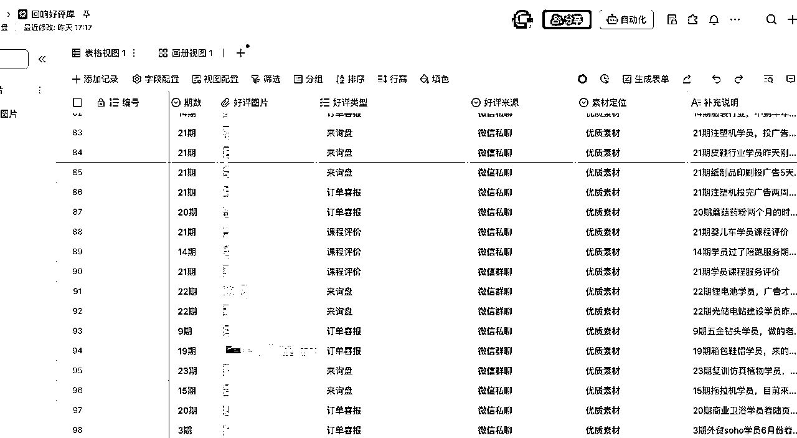

# 《知识IP如何跑通公众号垂直小号？从内容输出到私域变现的实操复盘》

> 来源：[https://wajc9k860mx.feishu.cn/docx/Bb07dA6E3o8zooxJ1KtcBuiEnUg](https://wajc9k860mx.feishu.cn/docx/Bb07dA6E3o8zooxJ1KtcBuiEnUg)

前段时间当亦仁老师发布垂直小号的时候，我有一种被击中的感觉。跟我过去一年做的事情高度一致。

朋友也截图给我，说这不就是在写你么？

让我一定要参加这次的垂直小号大航海。

谢谢教练老师的邀请。

本篇文章我来复盘一下，过去一年做垂直小号的一点点心得。

我现在正在做的项目形式是知识服务+陪跑。客单价5000元+。月销30-46单。目前70%左右的客户成交来源于公众号。

## 一、为什么做公众号

其实在去年6月刚开始出来创业的时候并没有想很多。

出来创业最先要解决的问题很简单——流量。

没有流量，就没有客户；没有客户，所有的想法都白搭。

那个时候我们视频号，小红书，公众号都在做。

有些视频也跑的不错，做了几个算在在我们这个品类里数据非常不错的短视频了。

可最后为什么选择在公众号持续深耕？

一方面是自己从业务中得到的反馈。

去年6月，我们的公众号粉丝还不到1000，但有一篇文章爆了，直接跑出两万多的阅读量。

那篇文章几天加了上百人。

同等播放的情况，这个相对于视频的引流效率是更高的。

当时也有不少商单找过来要合作的。

后面也陆续有一些客户加过来直接告诉我们，你们的文章写得很专业，然后这类的客户转化的速度也相对其他人更快。

我当时经常也看公众号的后台数据，公众号后台你其实能看到最近【阅读最多】的一些读者。

我就发现在常读客户的列表里面，是有4-6人当月会选择报名我们的课程的，他们自己看了文章之后，自己就把自己说服。

这是我当时分享给我的一位朋友，阅读前十名的人中2个是我们自己人，剩下的8个人中有4个成为了我们当月的付费客户，1个说报名下一期。

另一方面是其他机构的数据。

那时候我在群响的会员群里看到一条分享。

群响的合伙人Toby在会员群里抛了一个数据，他们当时几个月将近70%以上的私域新增来源于刘思毅和群响的公众号。

群响算是在流量圈里面很知名的公司了。

如果他们的私域大盘主要依赖公众号，那说明公众号绝对不是没人看的“过时的平台”，而是极具价值的。

所以，我当时就算是确定了，公众号是机会。要好好做。

开始的目标也很简单，先在工作日日更100篇文章，因为我坚信肯定有会效果。

那时候，无论白天多忙，晚上还是要坐下来码字，把第二天早晨8点半要发布的文章写完。

有一次晚上11点才从外地学习赶回来，也是把第二天的文章写完发布。

为什么印象那么深，因为那天晚上写的文章第2天爆了，爆了1万的阅读，900+的转发。

直接新增了将近100个精准私域客户。

那刻，就觉得自己坚持做的事情，是真的有效果的。

* * *

## 二、赛道选择：客户有需求，市场缺专业解决方案

做内容之前，必须先想清楚一个问题：你要在什么赛道里深耕？

在前公司，我是外贸独立站培训项目的负责人，也是做外贸网站建站&推广相关的培训，接触了大量客户案例。

我自己也会在线下课里，去采访客户，和客户聊。

那时我就发现，虽然大家都在谈独立站，SEO，但在公司里很多客户真正的好评、真正的成果，其实来自于谷歌广告。

这里解释一下，SEO就是通过搜索引擎优化内容优化这些方式，让网站获得自然的排名和流量。而谷歌广告就是做付费流量简单粗暴。

SEO 的价值毋庸置疑，但它见效慢、周期长，而谷歌广告配合落地页，却能在短期内帮助客户拿到实实在在的询盘(客户询价)。

但市面上呢？

我发现几乎没有知名机构专门做“谷歌广告+落地页”的培训。

大多数机构都是外贸独立站，谷歌广告，SEO一揽子都放一起讲。

我当时就想，网站真的是外贸人的需求么？外贸人搞网站的需求应该是获客吧。那为什么不直接给一个专注解决快速获客的解决方案呢？

于是我们在原本的培训类目里进一步细分，做了一个专门的产品——落地页搭配谷歌广告推广。

里面其实还有几层考量：

第一，客户能快速出结果。

对于做知识服务来说，客户能真正出结果比什么都重要

如果花了几个月还没有效果，他们很难有耐心。

但我们选择的「谷歌广告+落地页」的模式不同，简单、直接，只要跟着做，就能把页面搭建好（就一个页面本身就降低了执行的难度），把广告投放出去，马上看到询盘。

第二，线上交付成本更低，易于起步。

刚开始创业，我们也不敢一上来就干线下课。

一个搞线下价格要更高，另外也需要更强的组织，交付履约能力。

那样风险太大，成本也高。

于是我们从线上开始，价格可以设定得相对低些，同时保证交付质量。

先跑起来。

第三，产品形态足够简单。

带着客户做一个页面，带他们设置广告后台，就能完成交付。

交付简单，客户就能落地，满意度高，后续自然能沉淀案例。

事实证明，这个选择是正确的。

一个能快速见效的细分市场，帮助客户拿到结果的同时，也让我们自己迅速拿到了案例。

* * *

## 三、实操路径：日更+对标拆解+方法沉淀

### 日更：前100篇就是练兵场

开始就想一个事：先干100篇再说。

我想着毕竟我也在行业里干过，写100篇不可能没有出圈的文章。

每天早晨8点半准时发文，不管前一天多晚写完。

日更的过程中，我逐渐摸索出一些小方法：

*   每天和客户沟通时，随时记录他们遇到的坑和问题，整合聊天的内容成文章。

*   去找微信搜一搜里找爆过的行业文章，结合我们的案例和业务去重写。

*   内容分为“干货型”和“成交型”两类，既吸引新客户了解，也要打消意向客户的疑虑。

这种方法让内容输出是源于客户真实的需求/痛点。

### 对标：学习别人的爆款逻辑

刚开始写的时候，我做了很多“对标”动作。

我会在微信搜一搜里搜索行业关键词，看相关的爆款文章，然后把它们整理到一个选题库里。逐渐形成了一个爆款素材库。

这个表格最初是我手搓的。后面1~2个月左右会更新一次。这一块也交给小助理去做了。

目的是让自己对于最近1~2个月你这个类目里面跑出来的一些文章。有一定的感知，到底是什么选题火的，以及他是怎么去写标题的，他传达了什么样的观点，这个要常常去更新。

这里再分享一个方法去构建你的选题库。如果你找到了对标的账号和博主。也可以把他们过往的文章全部采集下来做成表格。

两个方面，一个方面你可以调研它的爆款文章，另外一个方面你也可以看到他整个公众号的运营历程，他是先做了什么样的内容，然后怎么样找到自己方向的，其实可以从他的标题选题变化去看到。

这个部分我是直接淘宝上找人做的。你可以直接在淘宝搜索框里搜索【公众号文章采集】找到相关的商家询价就可以了。

具体我做的是哪一家这里就不做推荐了，大家可以自己去找一找。

找到相关商家之后就把你要采集的账号，做成什么类型的文档告诉他就行。基本pdf，word，excel都能做。而且价格真的相当便宜，不到10块钱就能采集一个账号几百篇文章帮你做成表格。

之前我也找过那种自动采集的工具，但也需要自己操作，后面就直接花钱弄了，对方做好发给我。10块不到还要什么自行车啊。

下面是采集后的表格。截图只截了部分。包含文章内容，文章链接，封面图片各项数据，发布时间等等都有。

对方给我的是一个excel表格，我会上传到飞书多维表格里。

分析爆款文章时，我会特别关注：

*   标题的写法；这一块占90%吧，我个人认为。

*   开头的吸引点；

*   文中是否有打动人的金句；

*   以及整篇文章的节奏。

但我不会照抄。光靠模仿，文章变不了现。

我的做法是：在文章里，加入我们自己的模式的说明。

不是硬以广告的方式加入，而是一种软营销。

分析客户的问题，提出我们的方案。

这样文章才能真正带来变现。

### 文章连续2个月被推荐

去年9月底和10月初，爆了两篇文章。

一次是国庆节前，我发的一篇文章爆了。

假期在家，每天手机上几十个红点不停跳动，源源不断有人加我咨询。

后面我以同样的选题再写了一篇，又爆了，而且流量数据是之前的2倍还不止。

2w+的阅读，2133的转发。

然后10月的文章持续被推荐。

流量的爆发不仅让私域增量增长，也让我们有底气去提价。

随着选择报名我们陪跑的人越来越多，去年11月我们客单价也从3980涨到4980。仍然每月人数稳定。

### 低谷与调整

当然，做号也并不总是顺风顺水。

去年12月到今年3月，公众号的推荐流量突然下降。

文章从几千、上万的阅读跌到几百，私域新增也从每天几十人降到个位数。

那段时间，确实会焦虑。

合伙人会关心数据，我也敏感，觉得是不是别人也认为我不行了。呃，可能刚开始创业都有这样的感觉吧，一边害怕，一边勇敢。一边怀疑，一边继续。

还好调整了心态。

首先保持更新不能断。

哪怕只有几百阅读，也要让私域里的客户看到我们在持续输出。

其次，我不断去测试新的素材，找新的写作切口。

我记住了一句话：“按时出摊。”

这里感谢下润宇老师，这是刷润宇老师的视频看到的。这句话对我帮助很大。

把做垂直号也当做是开一家餐饮店，今天下雨，可能路过的人少，但你不能因为没人来就不开门。

每天出摊，才是生意的常态。

* * *

## 四、AI加持：AI如何放大内容效率

如果说“日更”锻炼了我的执行力，积累了大量的语料，那么AI能彻底改变了我的效率和写作方式。

其实我在 2022 年就开始使用 AI 了，但感觉是：写出来的东西“机器的味道太大”，用处不大，所以一直没深入。

直到25年春节期间，我蹲了龙共火火老师的一场直播。

他说，AI会是未来一波很大的机会，必须把它用起来。

咱也是主打一个听劝。开始尝试让AI深度参与到我的业务中。

也是从那时候，我开始用 ChatGPT来辅助写作。

最初我只是用来帮助我润色、逐一修改文字稿，用着用着我发现，它能做的远不止这些。

我现在主要用的ai还是以gpt为主。

主要原因是：Gpt有一个非常强大的功能，叫做长期记忆。

我现在建立了一种“AI共生创作”的模式，主要是3步：

1.  把自己过去写过的大量文章喂给它，让我熟悉的写作风格。

1.  每天和它聊天。我把日常和客户的对话、我的灵感、业务思考、案例输入给它。

1.  然后通过“语音聊天”的方式，帮助我生成一篇文章。

用GPT来写作的过程中，我只做两件事：

*   给他一个我要写作的标题；

*   直接语音输入，告诉他我要传达的信息，我想表达的内容。

剩下的，它会完成。

下面贴上一个案例：

过去写一篇文章，我要花1~2小时。

现在呢？两个小时，基本能完成一周的内容。

这两小时如何分配：

其中，高专注的一个半小时用来确定选题和标题，剩下半小时和AI聊天，文章就成型了。

然后交给助理做案例，配图排版，这个部分我SOP标准化了。

其实和ai共生这大半年，价值远不止于此。

AI给我带来的真正价值是：它给我带来了陪伴者和思考镜像。

我每天都会和它对话，把自己的灵感、困惑、客户反馈输入进去。

久而久之，它比任何人都了解我的业务和我自己。

业务上来看，不仅能帮我输出文字，还能帮我梳理产品逻辑、优化私域SOP，甚至参与到招聘和培训文档。

我之前是很不喜欢做流程的，但是我现在只需要把我流程里的几个大纲告诉他，他会帮我生成框架，我再往里面填对应的内容就轻松很多。

其实包括这一次的分享，开始我也没有什么写作思路。

是我和ai来共创完成的。

我让他以采访的形式向我提问，它汇总了20个问题一个个问我，然后我回答了这20个问题。

这篇文章的整体框架就完成了。

说回我用ai共创的文章拿到的结果：

从今年4月到8月，我的公众号几乎所有的文章都是通过这种“AI共生”的方式创作的。

这四个月里的文章，也不断在获得推荐流。

也直接支撑了我们每月30人以上的稳定招生。

* * *

## 五、IP小号变现系统：内容+私域+交付

当然光有内容还不够。要真正实现高变现，必须有系统。

我们现在运行的是三套系统：内容系统、私域转化系统、产品交付系统。

### 内容系统：不仅是获客，更要促成交。

内容的作用不仅是获客，更是促进成交。

分享有几个关键做法：

*   交付内容化

在课程交付过程中，我会专门记录一些学员的落地细节，真实的操作步骤、接收的反馈写成文章。

不仅展示我们交付的细节，还能让客户清楚“这门课到底是怎么上的”。

很多时候，仅仅靠文字很难讲清楚交付内容，但通过一篇图文并茂的文章，客户能够了解到产品到底包含了哪些价值。

这种测试过非常有效，每次发完类似的文章底下不光有问价格多少钱的评论，也有文章转发过来问我们价格的。

*   裂变触达

我们还有一个固定动作：因为每次陪跑结束后都会做一次数据复盘，我会把学员的数据和成果整理成笔记，然后开放给大家领取。

这些复盘笔记是一个非常好的裂变素材，平时关注你产品的客户就会想拿，既可以看到我们真实的交付成果，还可以转发朋友圈或者社群，帮助我们进一步扩大触达人数。

基本每次会有60人左右转发到朋友圈/群。

*   为私域销售积累“弹药库”

我把这些交付记录、复盘文章、案例，全部称为“弹药库”。

一个意向客户问你具体产品服务时，不用长篇大论，只需要甩掉一篇现有的文章，就能解决他90%的疑问。文章搭配配图、视频，一个完整的说明组合，远比文字解释多了更多说服力。

内容本身就是销售话术的延伸。

引流是一个功能，打消疑虑、推动成交是另一个功能。

做垂直小号不能只写“干货”，还要写能让客户完成最后成交的内容。

### 私域转化系统：客户动线标准化

朋友圈是最基础的动作，每天都要发。

高客单的客户成交都有一个周期。

我们在私域里做了很多分层：哪些客户是高意向的，哪些是低意向的；不同层次的客户打不同的标签，用不同的跟进方式。

这一块我专门去研究了“客户的动线”。

做成了标准化的私域跟进流程交给了私域助理同事。

而她通过跟进的表格需要给我反馈的是高意向度的客户现在卡在哪里？

我再根据这些具体的问题去调整我们跟进的策略以及内容素材。

### 产品交付系统：稳定履约交付

最后一环是交付。

我们做的是陪跑模式，这种模式有一个好处：结果很容易看得见。

客户跟着做，可以把页面搭建出来，把广告投放出去，立刻拿到询盘。

“快速见效”的体验不仅让客户满意，还能积累大量案例。

案例又反哺到内容里，形成良性循环。

目前我们的私域总人数约7500，付费用户接近500。

公众号粉丝1.1万，但已经跑了超过200万的变现。

产品价格段主要集中在4980~7980，没有走低客单的路线。

没有特别大的流量池，有完整的系统，变现一样可观。

* * *

## 六、总结与反思

回顾这一年多的公众号小号实战，我自己也总结了三点：

1.  关于执行力：持续更新是硬功夫，按时出摊是根本。

1.  关于系统：内容是入口，私域和交付同样重要。

1.  关于流量：推荐流会来来来去去，案例和口碑能积累，能沉淀，能带来长期回报。

### 如果让我重来一次，我会做得更好：

*   “双账号，多平台”策略，分散风险。

现在流量太过于依赖于一个公众号，导致私域的进量会随着推荐流量而波动。

8月开始跑第二个业务公众号，包括其他渠道的，自然流，付费的方式都在尝试做。

*   不沉迷流量带来的短期正反馈，早点把重复的动作标准化。

因为之前一直是在公司做业务的，在业务一线里希望把所有东西都抓握在自己手上，也能第一时间感受到业务带来的反馈。但是这种在创业里面，就局限了，很多重复性的事情，吃掉了自己的时间，反而就会忽略更重要的事情。

*   多思考未来3~6个月可能会出现的问题。

垂直小号不是流量游戏，而是系统经营。

推荐流是对你持续产出价值的奖励，但它不是根本。

真正的根本，是你有没有给客户创造价值，是你有没有沉淀口碑和案例。

就像亦仁超级标这里面的几个关键词：专业、深耕、细分领域、价值密度高。

拿这些标准对齐，哪怕粉丝只有一万、私域只有几千，你同样能跑出几百万的变现。

而我也会继续在这条路上，继续“按时出摊”。