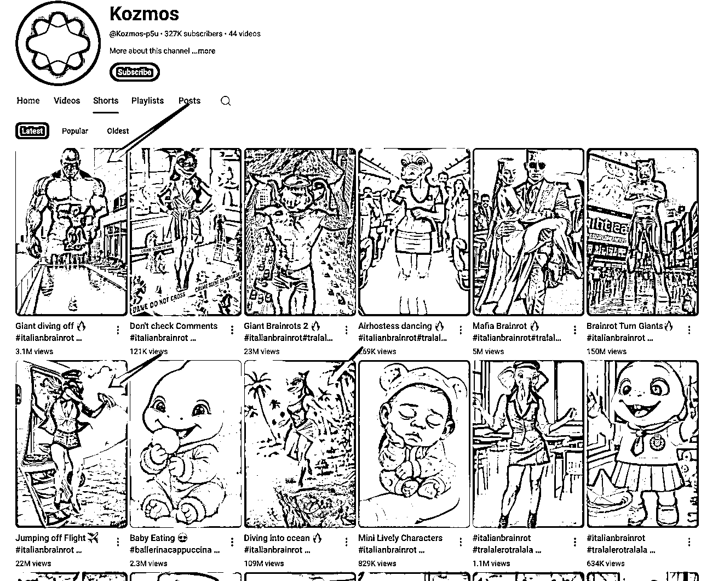
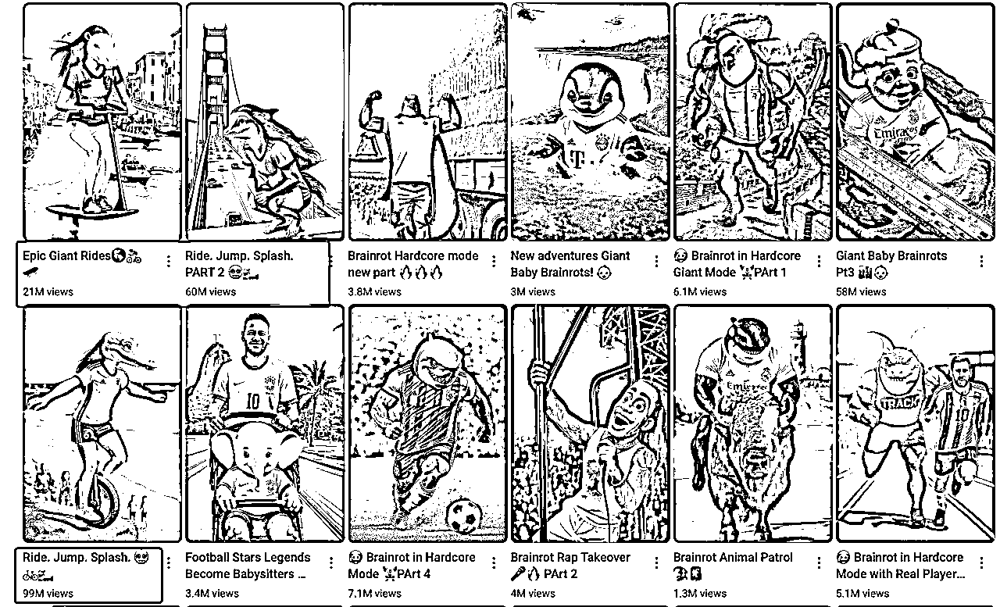
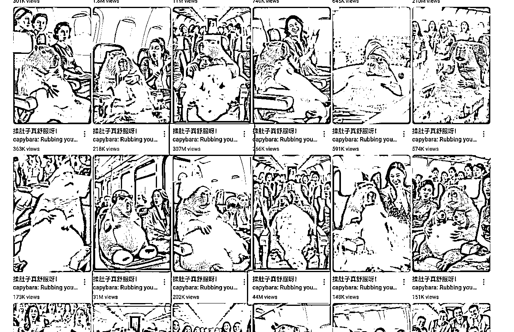
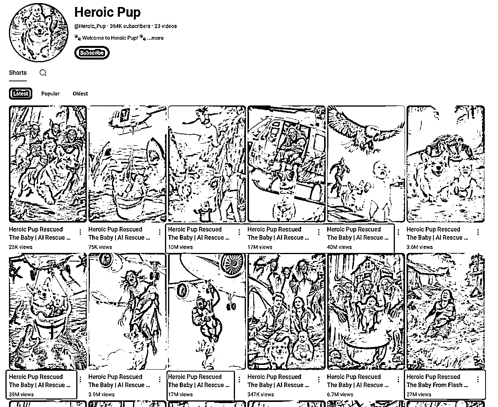
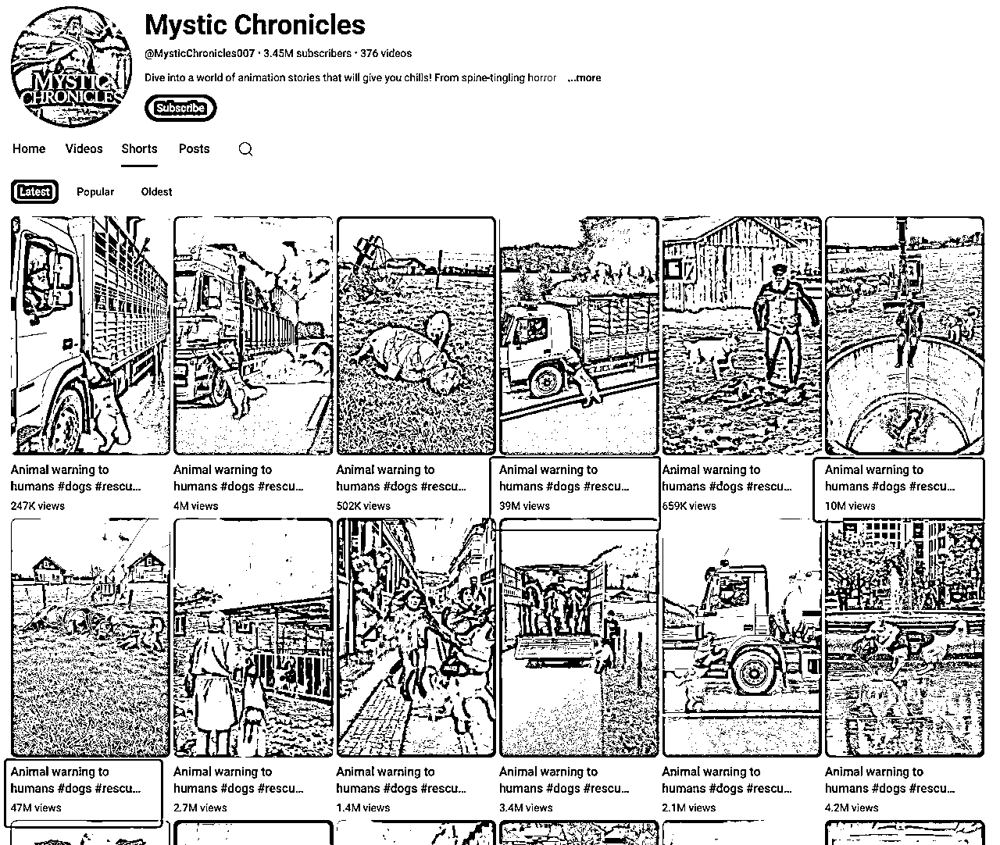
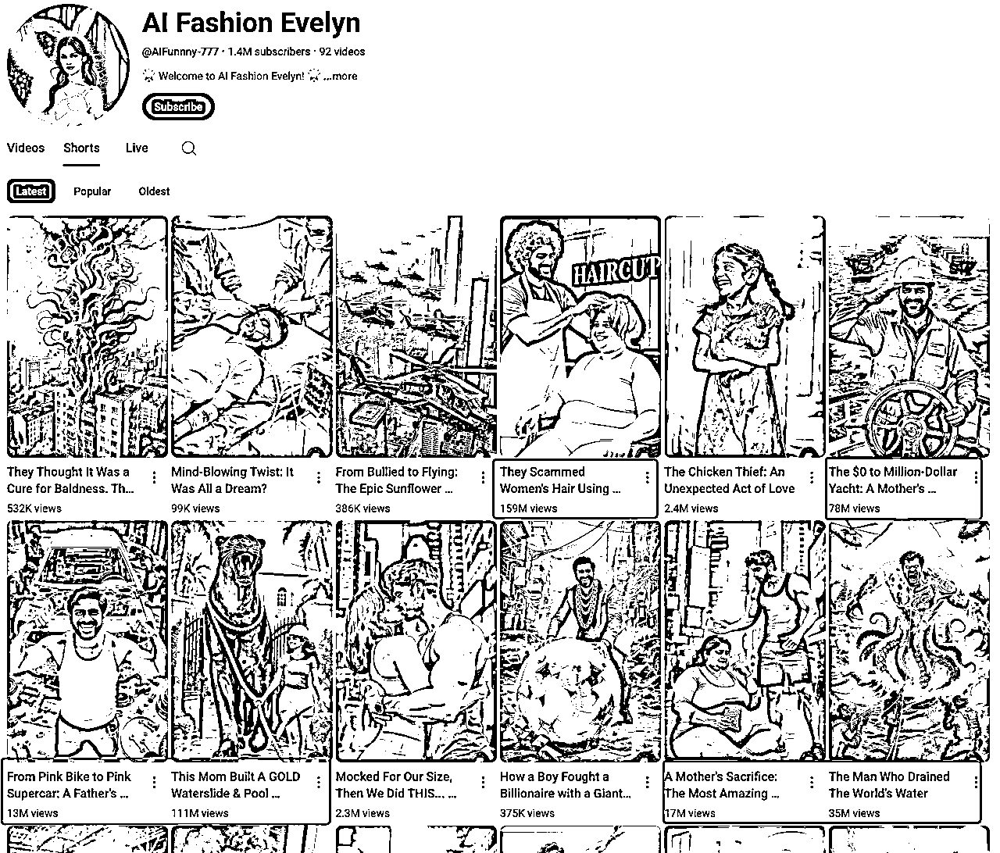
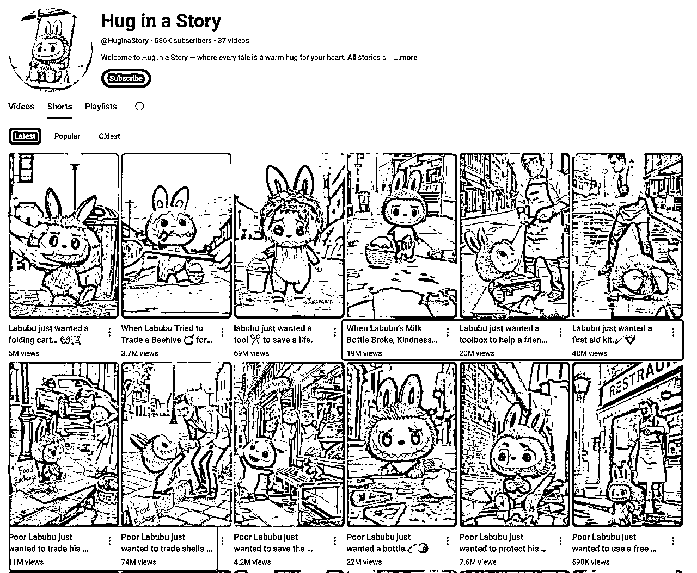
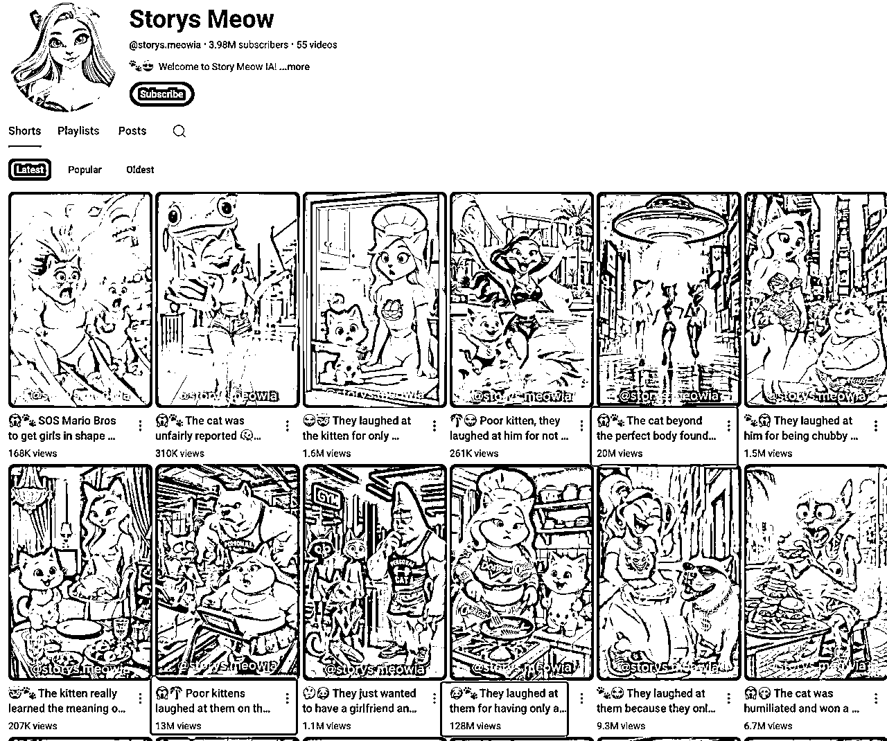
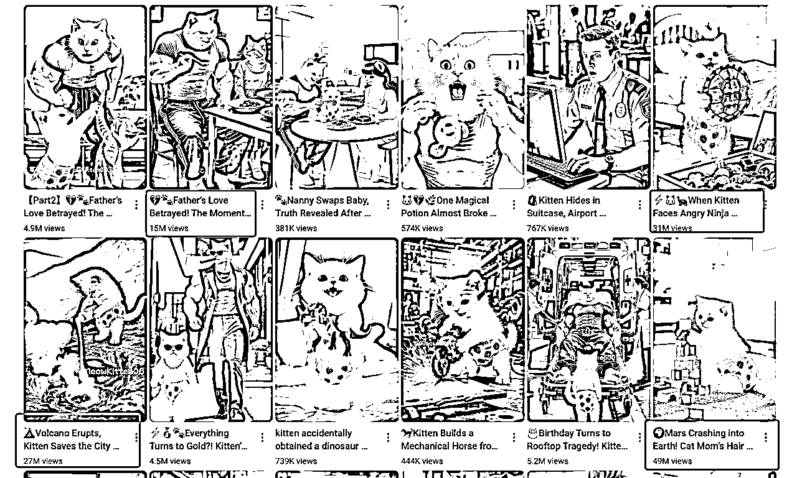

# Youtube AI千万爆款赛道分享

> 来源：[https://kpekh28hdw.feishu.cn/docx/JByddu7iGoOSyxxonu2cI6f2nff](https://kpekh28hdw.feishu.cn/docx/JByddu7iGoOSyxxonu2cI6f2nff)

大家好, 我是小芬, youtube深海圈教练, 目前深耕故事号赛道, 8个高级ypp频道.

这篇文章给大家分享近期能做到千万爆款的6个AI shorts短视频赛道，前两个赛道0基础也能上手.

内容制作难度从简到难, 每个都附上了对标频道, 以及对应youtube平台的Rpm(千次播放收益)供大家参考. 让你看完就能抄作业. 新手也不用担心, 总有一个适合你！

# 一、跳水

这个频道使用了美国的山海经角色来跳水，就拿到上亿的播放量, 真的非常夸张!

这类内容主打的就是通过视觉冲击、新奇的动作和性感的角色吸引观众.

制作上也非常简单，图片使用GPT/banana/即梦4，视频使用海螺02就可以制作出这样的视频.

预估RPM（千次有效播放收益）：0.03美金

https://www.youtube.com/@MrPlonkTV/shorts

https://www.youtube.com/@Kozmos-p5u/shorts

# 二、趣味揉肚皮

卡皮巴拉在各种日常场景下, 双手揉肚皮, 流出各种颜色的液体, 配上一个洗脑的BGM, 真的特别解压上头, 趣味感十足. 这个频道近一个月干了将近六亿的播放量.

而且只需要即梦生成一张图片, 然后出视频即可.

就这么简单的几秒视频, 就能搞出过亿的播放, 一天产几十条都不在话下.

预估RPM（千次有效播放收益）：0.03美金

https://www.youtube.com/@MiaoMiaoLiaoLi/shorts

# 三、动物救援

开头是各种遇难的场景, 然后动物在紧要关头冲出来当英雄, 去拯救人类的剧情. 和年初爆火的人类救动物形成了呼应, 爆款内容会转移, 但不会消失, 只是救援主体发生了转换.

虽然动物救人有些行为很不现实, 但它就是狠狠地唤起人的同情心和怜悯心，非常的正能量. 让你忍不住想看下去, 遇难的人类最后怎么样, 动物如何救人.

评论区很多都是评论: 这动物太棒了、很聪明, 十分暖心. 精准拿捏人性.

预估RPM（千次有效播放收益）：0.03美金

https://www.youtube.com/@Heroic_Pup

https://www.youtube.com/@SilentAssist/shorts

https://www.youtube.com/@MysticChronicles007/shorts

# 四、印度故事

这类视频都是使用印度人的形象, 演绎各种故事剧情, 搭配印度的BGM. 故事跌宕起伏, 反转不断, 跟演印度神剧一样.

下面截图的频道, 近一个月搞了超6亿的播放.

预估RPM（千次有效播放收益）：0.02美金

https://www.youtube.com/@AIFunnny-777/shorts

https://www.youtube.com/@hakan_RF

https://www.youtube.com/@Hmm88/shorts

# 五、玩偶IP类故事

## Labubu

使用泡泡玛特里面的拉布布形象, 来作为视频的主角, 演绎一个能引发全人类共鸣的治愈暖心故事.

故事情节非常简单、固定：先让Labubu受尽委屈，想要个东西买不起，还被人欺负，激起人的同情心。然后总会有个好心人出现，帮它实现愿望。最后，Labubu再用得到的东西去帮助其他小动物，超级暖心的结局。

就这故事情节不变, 换不同的场景, 不同的东西, 连出五条千万爆款, 简直是精准地拿捏了人的同情心.

预估RPM（千次有效播放收益）：0.06美金

https://www.youtube.com/@HuginaStory/shorts

# 六、猫咪故事

以猫咪为主角的故事, 在国内短视频平台, 也是十分受大家欢迎, 主打一个反差萌+狗血荒诞剧情, 但是不妨碍它能千万爆款.

过去传统猫猫形象故事可能已经过时了, 但并不妨碍各种不同形象, 不同风格, 用着一样的脚本继续成为爆款.

做故事, 内核在故事, 而不是外在的动物形象.

预估RPM（千次有效播放收益）：0.03美金

https://www.youtube.com/@storys.meowia/shorts

https://www.youtube.com/@MeowKitten007/shorts

https://www.youtube.com/@grannycat1909/shorts

https://www.youtube.com/@XiaoyueMeow/shorts

以上, 就是今天要分享的五个赛道, 大家可以根据自己的兴趣和能力选择对应的赛道.

如果你是新手, 建议先选择比较简单的前两个赛道上手.

视频的制作流程, 可以参考下面这个流程去操作:

1、分析对标视频的图片和视频提示词

2、使用AI工具出图、出视频

3、剪映导出成片

希望进一步了解赛道、学习详细的教程，可以在航海手册、YouTube专区进行学习.

最后, 希望以上的分享对你有所帮助!