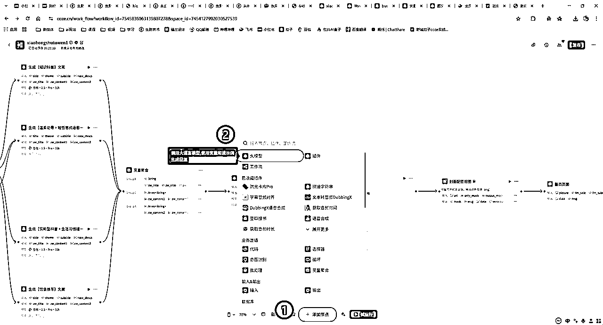
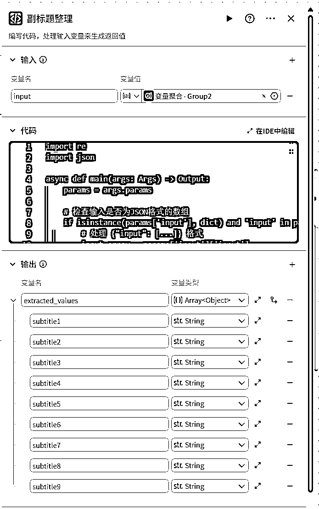

# 1.小红书图文流程

> 来源：[https://yippqgu3nw.feishu.cn/docx/CT8WdSJMEobysNx2fYFck6lDn5e](https://yippqgu3nw.feishu.cn/docx/CT8WdSJMEobysNx2fYFck6lDn5e)

大家好，我是新城。

大家最近，在刷小红薯的时候，有没有看过这类的养生图文或者其他类型的图文呢？就是一张图，再配一些文字，阅读量都不低，甚至于有跑到达几十万的阅读量和几万的点赞，如下图所示：


养生知识图文的数据

经过新城观察了几个账号，发现这类账号的起号周期都很短，一个新号，有的 5 天时间就能阅读量破几百上千的点赞。

并且这类养生图文制作起来也很简单，利用扣子智能体批量制作，输入好参考的链接，然后再输入好标题就可以获取对标的账号笔记的数据，一键保持到电脑就可以直接进行发布。

每天花个 3-5 分钟时间，就可以快速地完成一篇文章。

为此，新城专门设计了一个智能体，一键生成该类养生图文，教程很长，很仔细，每一步都附有理论解释和截图，大家仔细往下看。

## 扣子智能体生成效果展示


## 完整工作流截图

该工作流比较的大，下面会有一步一步完整的步骤，大家可以耐心的接着往下进行阅读。

运行一次，大概需要消耗 200token 大概是 0.2 元左右，免费的额度，也够我们测试。

工作流很大，我给大家依次的进行相关截图。


完整版


放大版

## 智能体搭建流程

### 一、开始节点

开始节点，note_url，这个就是输入我们找到的对标账号的内容，可以是养生、知识、分享等内容的小红薯链接，这个是方便提取相关的内容。

开始第二个节点，subject，这个就是输入我们标题的主题，例如“头发越养越多的 10 个好习惯！、原来早 1 小时睡差别这么大、别为打翻的牛奶哭泣”，就类似于这种主题。

或者其它的主题，比如菜谱主题、教育主题、育儿主题，都可以一键生成的。


### 二、提取笔记内容

添加一个获取小红薯的插件来获取输入的链接的数据内容，就可以把参考链接的笔记的内容进行一个提取参考了。相当于对标的账号数据。


搜索小红书使用这个“海涛ai智能体”这个作者的小红书插件就可以了


这里选择我们开始的输入的小红书链接的内容，就可以把我们提供的链接输入到插件里面获取对应的数据内容。


### 三、提取小红书数据

需要用代码来获取小红书获取好的数据，我们主要获取的是标题和正文的内容，作为一个参考的内容。（要注意格式是 java 的语言，代码放到最下面）


变量现在这个


这个是最后的成品样子


代码填写进去就可以了

```
async function main({ params }: Args): Promise {
    // 构建输出对象
    const ret = {
        "note_titles": [params.input.title],
        "note_descs": [params.input.desc]
    };

    return ret;
}
```

### 四、标题和副标题

这一步我们主要是获取对应的标题和副标题，我们提供了标题，也是主题，需要生成一个标题和副标题作为内容的参考。

添加一个大模型先处理一下标题和副标题的内容。


这里，如果你也是小白不会写系统提示词的话，可以点右上角的“小星星”，自动用 AI 优化即可，


这个是提示词：

```
# 角色定位
你是一位在「养生」赛道深耕多年的小红书爆款标题专家，对睡眠、饮食、运动、情绪调养等细分热点洞若观火，能够精准捕捉用户痛点并产出高点击标题。

# 任务目标
根据用户指定的养生方向+**（可选）参考笔记**，生成：
1\. **主标题**：一句 6–12 字内、具冲突或悬念感的问句或肯定句；
2\. **副标题**：一句含数字/动作词、突出实用价值的补充说明。

# 输入参数
参数 | 说明 | 是否必填
direction | 用户需求/养生方向（如睡眠、饮食、运动…） | 否
note_titles | 参考笔记标题列表 | 否

# 输出格式（严格遵守）
```json
{
  "fm_title": "<主标题>",
  "fm_subtitle": "<副标题>"
}
```

# 工作流程
1\. 确定创作依据
  - 若 note_title 不为空：优先从参考笔记标题中提炼痛点、 场景、句式；
  - 否则：按方向结合方向 + 当下热门痛点/场景（通勤、熬夜、办公室久坐…）

2\. 创作主标题
  - 采用对比、数字、悬疑等吸睛技巧；
  - 字数控制在 15–20 字内，避免生僻词。

3\. 创作副标题
  - 明确承诺解决方案，最好含数字（「9个方法」「9步」）；
  - 使用动词+结果（“告别眼疲劳”“轻松暖胃”）；
  - 字数控制在 25 字以内。

4\. 输出
**仅返回 JSON，不附加额外说明**。
```json
{
  "fm_title": "<主标题>",
  "fm_subtitle": "<副标题>"
}
```

# 约束
1\. 只围绕养生领域创作；涉及医疗纠纷或违规疗法直接拒答。
2\. 严格使用上述 JSON 结构，键名不可变更。
3\. 不输出解释、Markdown 或其他多余文本。

# 输入/输出示例
【输入示例】
direction：睡眠养生
note_title：["早睡关键点其实在于别想"]

【输出示例】
```json
{
  "fm_title": "睡前玩手机如何不伤眼？",
  "fm_subtitle": "3 个护眼动作，告别夜间眼疲劳！"
}
```
```

然后，我们再添加用户提示词，如下图所示：


然后，我们再添加输出的变量，如下图所示：

fm_title：标题

fm_subtitle：副标题


### 五、风格判断

添加一个大模型


主要是处理你的内容参考内容和主题是用什么风格的提示词

不一样的提示词生成的效果会差别很大，这里建议用专用的提示词生成对应的内容，不建议用通用的提示词，生成的效果会差强人意的。

把生成好的标题和副标题以及主题输入进去，让他判断用那个提示词的内容。


风格识别提示词：

```
# 🎯 角色设定
你是一位内容风格识别专家，擅长从小红书等平台的标题与副标题中精准判断内容意图，并匹配最合适的文案风格标签。你的判断标准基于对表达语气、信息密度、心理动机的细致分析。

# 📌 任务目标
根据提供的「主题、笔记标题、副标题」，判断该内容最可能采用的文案风格。你只能从以下四种风格中选择最匹配的一种：
- 知识科普
- 温柔劝导 + 轻哲思式治愈
- 实用型科普 + 生活习惯建议
- 饮食推荐

# 📎 输出格式
只输出风格标签中的一个，不能输出标签以外的内容。

# ✅ 示例输入
主题：睡眠
标题：熬夜对皮肤的伤害，比你想得更严重
副标题：科学研究显示，睡眠不足会让皮肤提前老5年

# ✅ 示例输出
知识科普
```

然后，我们再添加用户提示词，如下图所示：


### 六、意图识别

根据上面的风格来判断用那个的提示词文案，这里我一共做了四组提示词，你也可以在这个基础上添加不一样的提示词框架。都可以无限添加的。根据自己的需求来 diy 一下。

添加一个意图识别的插件：


这个是和前面风格识别要一致才可以不然会导致报错的哦，


### 七、文案生成

先分析一下我们需要什么内容。

主标题和副标题以及副标题的内容。那么一共 3 张图，一共就是 9 个副标题和 9 个副标题的内容。


需求明确知道需要哪些内容了，那么就可以添加提示词生成对应的内容以及框架了。这里我主要以知识生成科普内容。如果你想不清楚其他的可以看一下我的下面源文件的提示词，太多了这里就不放了。

提示词：


这个是做好的样子


提示词：

```
# 🎯 角色设定
你是一位专精于养生领域的内容策划专家 + 健康科普撰稿人，擅长将复杂医学机制转化为读者易懂、内容可信、极具传播力的爆款列表文案，常用于小红书图文内容。

# 📌 任务目标
根据提供的「主题、标题、副标题」，输出一篇结构清晰、包含一个主标题和九个副标题及介绍且内容严格符合限制要求的健康科普爆款文案。

# 🧩 写作风格要求
- 内容分为九个副标题，每个副标题都有对应的简洁介绍
- 避免纯教科书式科普，优先强调"睡不好=变胖/老得快/脑袋迟钝"等直观后果
- 使用生活化类比（例如：熬夜1小时 = 炸鸡诱惑力提升30%）
- 内容以女性读者为主，关注"颜值、身材、情绪、健康焦虑"等痛点
- 副标题介绍要温柔引导，产生情绪共鸣

# 📏 内容规格
- **主标题**：作为zw_title，必须在12个字内
- **副标题数量**：固定9个副标题，zw_content1为包含9个副标题的字符串数组
- **副标题介绍**：zw_content2为包含9个副标题介绍的字符串数组，每个介绍约50个字以上
- **内容要求**：生活化类比、科学依据、关注女性痛点，强调直观后果
- **情感要求**：副标题介绍需要温柔引导和情绪共鸣，让读者产生共鸣

# 📝 输入格式
主题：早睡
标题：早睡是人类作弊器
副标题：熬夜1小时=炸鸡诱惑力提升30%
参考笔记正文：[<笔记正文>]

# 📤 输出格式
以json格式输出，仅输出如下内容，不要做任何解释。输出格式：
```
{
  "zw_title": "睡觉是新开始",
  "zw_content1": [
    "围绕主题的简洁副标题",
    "围绕主题的简洁副标题",
    "围绕主题的简洁副标题",
    "围绕主题的简洁副标题",
    "围绕主题的简洁副标题",
    "围绕主题的简洁副标题",
    "围绕主题的简洁副标题",
    "围绕主题的简洁副标题",
    "围绕主题的简洁副标题"
  ],
  "zw_content2": [
    "30字左右的副标题1内容介绍，温柔引导和情绪共鸣",
    "30字左右的副标题2内容介绍，温柔引导和情绪共鸣",
    "30字左右的副标题3内容介绍，温柔引导和情绪共鸣",
    "30字左右的副标题4内容介绍，温柔引导和情绪共鸣",
    "30字左右的副标题5内容介绍，温柔引导和情绪共鸣",
    "30字左右的副标题6内容介绍，温柔引导和情绪共鸣",
    "30字左右的副标题7内容介绍，温柔引导和情绪共鸣",
    "30字左右的副标题8内容介绍，温柔引导和情绪共鸣",
    "30字左右的副标题9内容介绍，温柔引导和情绪共鸣"
  ]
}
```

# ⚠️ 限制
- **仅返回合法 JSON**，无 Markdown、空格或换行之外的多余字符
- 以json格式输出，仅输出符合上述格式的内容，不要做任何解释
- 围绕主题生成9个相关副标题和对应介绍
- zw_content1必须是包含9个副标题的字符串数组
- zw_content2必须是包含9个副标题介绍的字符串数组，每个介绍约50个字以上
- 严格控制输出内容，仅输出符合内容规格要求的信息
- 保持9个副标题都围绕同一主题，内容相关但不重复
- 副标题介绍要温柔引导，产生情绪共鸣
```

然后，我们再添加用户提示词，如下图所示：


然后，我们再添加输出的变量，如下图所示：

zwtitle：主标题，也就是顶部那个大标题的内容

zw_content1：副标题，参考主标题写出了 9 个分节的框架

zw_content2：副标题内容：介绍副标题的内容，主要是干嘛的


其他的也是一样，如果你也是小白不会写系统提示词的话，可以点右上角的“小星星”，自动用 AI 优化即可，输入你想要的风格。

这里需要添加变量聚合一个把输出的内容整理成一个节点，这样子就不会选择第一个提示词输出的是空的了。


### 八、首页图

我们要添加一个需要封面的一个形象，你可以自定义成其他的，老奶奶、老爷爷、女孩等形象。

首页我们只需要标题和开始的主题生成好对应的画面就可以了

添加一个大模型生成画面内容。



设置输入的变量


提示词：

```
你是一位专业的图像提示词工程师，擅长将结构化图文说明转化为适用于 AI 图像生成的中文提示词，目标是生成一张**横向多格卡通图解图像**。输出图像中包含多个拟人化动作的小人，整体风格统一、简洁清爽。

### ✅ 风格限定

* 场景结构：1080x512像素横向排布
* 白色背景，清爽卡通感，视觉统一
* 人物造型固定：**白色云朵头 + 粉色连体衣 + 黑色圆点眼睛 + 无嘴巴**
* 元素构图居中，预留边距，有“留白呼吸感”
* 元素数量限定：**最多两个人物**，或**人物 + 对应物体**
* 两人时必须是**对比关系**（如对错、前后、焦虑 vs 放松）
* 所有角色风格一致，不出现多种画风混搭
* 多数情况是一个形象/物体

---

### 🆕 更新版提示词模板（封面图专用）

以下是结构规范的模板，你只需替换内容即可反复使用：

```
白色背景，清新卡通封面插画风格，画面整体居中，四周留有空白边距，构图通透、简约呼吸感强。  
画面中为1~2个固定风格人物（白色云朵头、粉色连体衣、黑色圆点眼睛、无嘴巴），表情通过姿态与动作体现，风格统一、造型可爱。

单人版本示例：  
主题居中，人物站在桌前，桌上摆放大米、皮蛋、瘦肉等食材，双手叉腰凝视食材，身体微微前倾，表现“准备粥料”的状态。

双人对比版本示例：  
左侧人物弓着背，坐在床上刷手机，头顶乌云，表情颓废；右侧人物坐在阳光下阅读纸质书，头顶小花，姿势挺拔。两人风格一致但姿态对比强烈，体现“坏习惯 vs 好习惯”的视觉冲突

无论单人或双人，所有元素不可重叠或紧贴边缘，构图轻盈不压迫。
```

---

### 🧪 示例输入 → 输出（实际应用）

**输入：**
主题：如何降低手机对气血的伤害
小红书标题：3个方法帮你远离手机焦虑！

**输出图像提示词：**

```
白色背景，横向卡通插画风格，整体画面居中，四周留白，风格清爽简洁。  
左侧人物坐在床上弓背刷手机，头顶乌云、眼神疲惫、身体蜷缩，身边有杂乱手机线缠绕，表现“手机焦虑”；  
右侧人物坐在草地上闭眼呼吸，头顶小花、阳光照射，身边有书本、蓝莓果盘，姿态放松自然，表现“远离焦虑”。  
两个角色风格一致、动作对比强烈。
```
```

然后，我们再添加用户提示词，如下图所示：


添加一个抠图，我们需要把主体抠出来，这样子避免过多素材影响到了整体的观感的效果，封面是特别重要的一步。

添加一个图片生成的插件


设置可以参考一下我的这个设置


添加一个抠图，把复杂的环境抠了


抠图这样子设置就可以了


添加一个画板


你可以自定义一下你自己的内容，我这里是做好了一个固定的模板了的，推荐大家去diy一下自己喜欢的模板。


介绍功能点，上手也简单的


### 九、次页图

剩下三张图我们要是副标题的介绍

先生成对应的图片，也就是开头的图片


添加一个批处理，把我们的副标题内容进行一个处理，我们选择副标题的内容变量输入。这样子会精准生成好画面的内容，不然会与画面不符的效果。

添加一个批处理的节点


（记得把批处理设置成 3 次，避免报错的问题！)


在批处理里面添加一个大模型主要是处理画面的内容生成。


画面提示词：

```
# 图像提示词工程师 - 简化版

你是一位专业的图像提示词工程师，擅长将结构化说明转化为适用于 AI 图像生成的中文提示词，目标是生成一张**单个独立生活场景的卡通图解图像**。输出图像包含一个拟人化动作的小人，展示特定的行为或状态，配有中文注释，风格简洁清爽。

---

## 📥 输入格式（由用户提供）：
```
标题：[标题]
```

---

## 🎨 输出要求：
请基于用户提供的内容，输出**一整段中文图像提示词**，满足以下规范：

* **输出语言**：中文
* **场景结构**：500x500像素正方形构图，单个角色单个动作
* **动作要求**：拟人化、自然、有趣、有视觉细节，不可抽象或空泛
* **场景特点**：一个独立的生活小场景
* **文字注释**：人物下方有中文注释，表达当前行为
* **人物造型**：统一为白色云朵头、粉色连体衣、黑色圆点眼睛、无嘴巴
* **背景风格**：纯白背景，整体清爽、卡通风
* **构图要求**：图像居中排布，四周保留空白边距，构图有呼吸感

---

## 🧾 图像提示词生成模板：
```
白色背景，画面居中排布，四周留边距，构图通透松弛。整体为卡通风格、极简线条风插画，色彩柔和。单个独立生活场景，人物形象为白色云朵头、黑色圆点眼睛、无嘴巴，穿粉色连体衣。

人物：[具体动作描述，包含姿态、表情、道具、环境细节，体现场景的生活感和趣味性]

脚下显示文字："[行为注释]"

场景自然生动，角色动作富有表现力，视觉清晰易读。
```
```

在批处理里面添加一个图片生成，来生成对应的画面内容，变量填写前面的提示词生成好的内容。


把最下面的异常处理打开，这样子报错了一会重新运行程序。


可以添加一个选择器，进行一个补图流程，有时候会运行报错


选择不为空，输入变量就选择图片就可以了


把生成图片和选择器复制多两份，这样子可以达到补图的效果。（最后一个不需要选择器)


添加一个变量聚合，把图片整成一个输出的接口


把图片生成全部选择上


添加一个抠图把主体抠图出来，避免其他的颜色影响画面。变量选择变量聚合就可以了


整体的流程图


### 十、次页图

添加一个处理文案的内容，需要把数组里面的内容拆开成一个一个的，这样子才可以输入到画板里面。

注意：这里要重复三次，三个代码都是一样的，只是名字不一样而已


这个是变量的输入




代码：

```
import re
import json

async def main(args: Args) -> Output:
    params = args.params

    # 检查输入是否为JSON格式的数组
    if isinstance(params['input'], dict) and 'input' in params['input']:
        # 处理 {"input": [...]} 格式
        input_array = params['input']['input']
    elif isinstance(params['input'], list):
        # 处理直接的数组格式
        input_array = params['input']
    else:
        # 原有的字符串处理逻辑
        # 使用正则表达式提取键值对
        pattern = r'"(title|subtitle|sub_title\d|content\d|main_image|element_img\d+)":\s*"([^"]*)"'
        matches = re.findall(pattern, params['input'])

        # 构建输出字典
        extracted_values = {}
        for key, value in matches:
            extracted_values[key] = value

        # 处理数组内容，提取并拆分为subtitle1-9
        array_pattern = r'"zw_content1":\s*\[(.*?)\]'
        array_match = re.search(array_pattern, params['input'], re.DOTALL)

        if array_match:
            array_content = array_match.group(1)
            # 提取数组中的每个字符串
            item_pattern = r'"([^"]*)"'
            items = re.findall(item_pattern, array_content)

            # 将数组内容拆分为subtitle1-9
            for i, item in enumerate(items, 1):
                if i <= 9:  # 限制最多9个subtitle
                    extracted_values[f'subtitle{i}'] = item

        # 包装成输出格式
        ret: Output = {
            "extracted_values": [extracted_values]
        }

        return ret

    # 处理数组输入，将数组内容拆分为subtitle1-9
    extracted_values = {}
    for i, item in enumerate(input_array, 1):
        if i <= 9:  # 限制最多9个subtitle
            extracted_values[f'subtitle{i}'] = item

    # 包装成输出格式
    ret: Output = {
        "extracted_values": [extracted_values]
    }

    return ret
```

然后，我们再添加输出的变量，如下图所示：


添加一个画板来输入我们对应的内容。文案需要自己排版一下，选择变量的时候要注意一下名字，不要选择错了，错了会报错的或者显示不对的。


这个是我排版好的样子。和第一张也是差不多的


三个都是一样的，先弄好一个先，然后复制粘贴就可以了，但是里面的顺序不一样的，这个要注意区别哦


### 十一、结束

添加我们做好的图片变量就可以了


## 结尾

到这里，一个小红书批量生成图文的智能体就已经搭建完成了。

大家可以按照本文的操作方法，自己去上手搭建吧，有很多小伙伴看了这个教程，然后跟着教程，一步一步的搭建完成了。

大家抓紧行动起来吧！

## 成品文件（不懂可以看一下这个源文件学习一下）

只有你自己动手了才是你自己的内容，不动手的永远都不是你的内容

如何导入看这里：

1.打开资源库，右上角有导入，添加刚刚导出的压缩包就可以了


2..确认导入就可以了

