# 手把手带你快速入门飞书知识库

> 来源：[https://x0vg1nkm75f.feishu.cn/docx/CL71dvLD9oML1fxTcBDcBeHXnCb](https://x0vg1nkm75f.feishu.cn/docx/CL71dvLD9oML1fxTcBDcBeHXnCb)

# 一、创建知识库

1.打开飞书，在左侧导航栏中点击知识库（我的是拖入到“更多”里了，如果大家找不到在上方搜索框里搜索知识库），再点击右上角的新建知识库

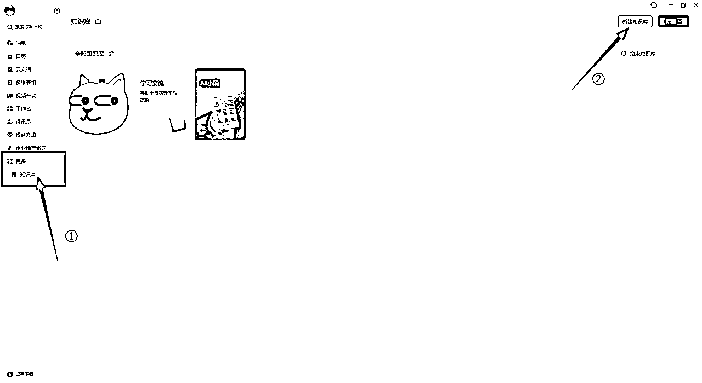

有圈友表示找不到知识库入口，最简单直接的位置就是飞书PC客户端——云文档——知识库（下图所示）

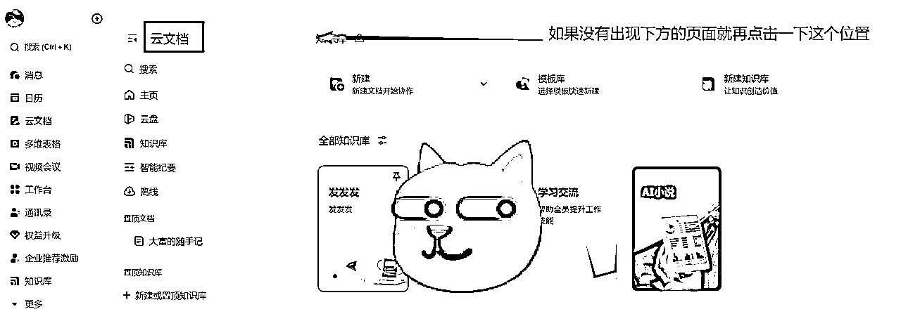

2.我们可以选择飞书提供的模板进行创建，也可以自己创建空白知识库。选择好后，点击右下角的“下一步”

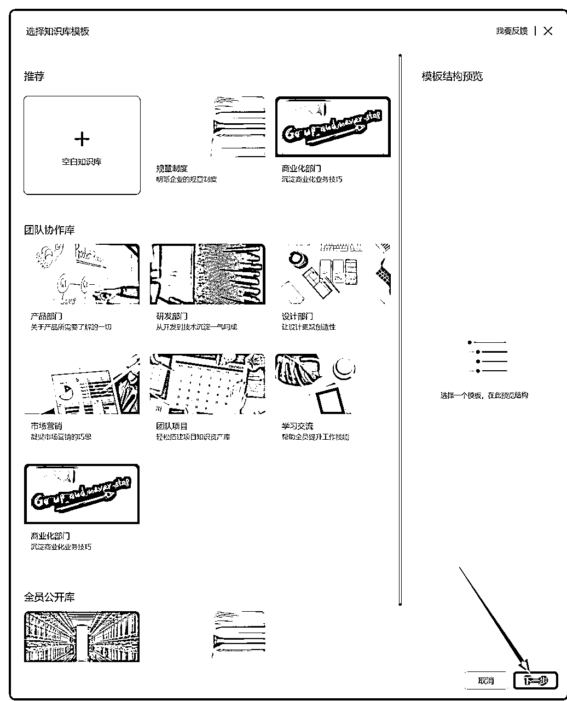

3.设置好名称、简介、可见范围后，点击右下角创建。

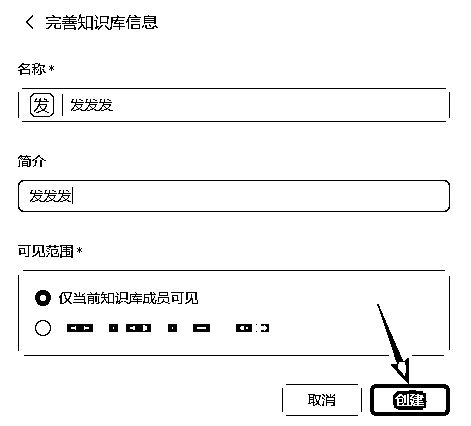

完成以上步骤后，你就成为了这个知识库的管理员。

# 二、知识库分区介绍

请直接看图：

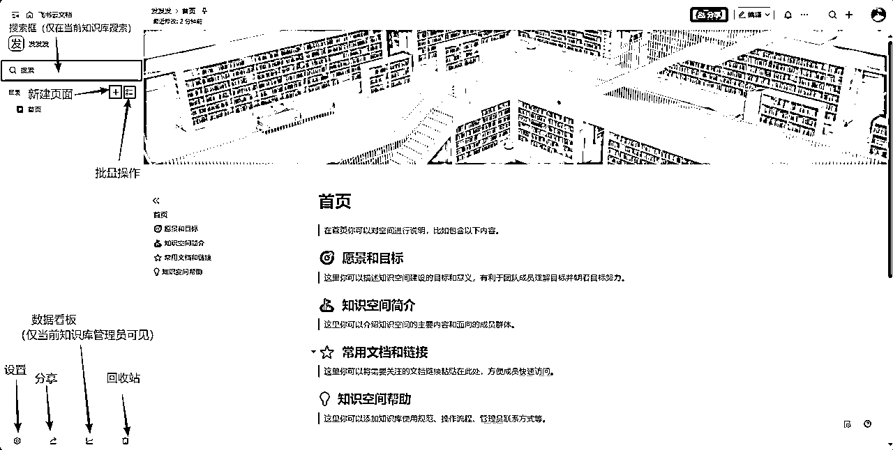

# 三、添加页面

创建知识库后，如果我们需要添加其他页面，点击左侧“+”后，就有三种添加页面的方式：

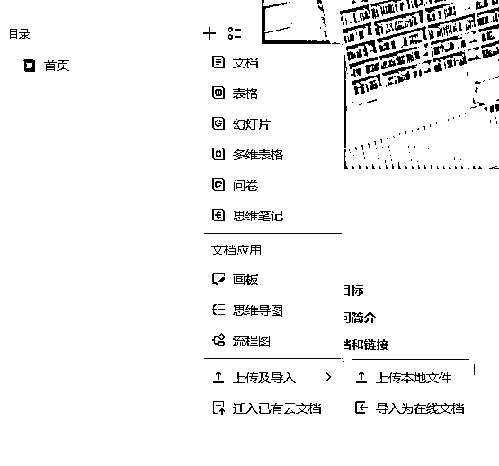

## 1.新建页面（空白或模板）

在“+”菜单里选择所需类型：文档、表格、幻灯片、多维表格、问卷、思维笔记、画板、思维导图、流程图。

## 2.上传/导入

进入上传及导入：

*   上传本地文件 → 文件将以原格式作为一个页面出现在知识库中；

*   导入为在线文档 → 将 Word/Excel/PPT/CSV 等转换为飞书云文档后加入知识库。

## 3.迁入云文档

选择 迁入已有云文档，搜索并勾选要迁入的文档，一次最多 20 个，右下角会显示迁入进度与结果。

# 四、整理页面

## 1\. 拖动调整位置与层级

*   在左侧目录选中任一页面，按住拖动到目标位置即可变更顺序。

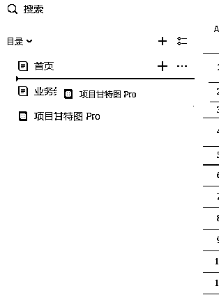

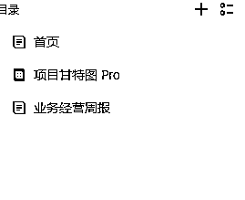

*   当目标标题背景变蓝时松手，当前页面将变为该目标页面的子页面（形成父子层级）。

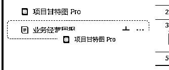

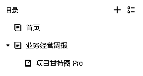

*   需要提升层级时，拖回到上一层的合适位置即可。

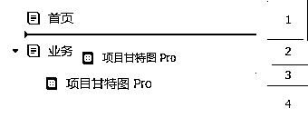

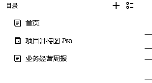

## 2\. “更多”菜单常用操作

*   在页面标题右侧点击“更多”（…）可进行：

*   创建副本：复制一份页面；

*   移动：将页面移动到其他位置/知识库节点；

*   添加快捷方式：把当前页面的入口放到指定位置，原文档不移动。

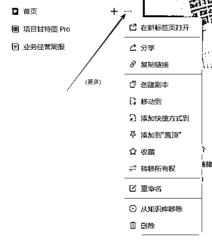

批量操作：点击多选或按住 Shift 逐个点选页面标题，即可对创建副本 / 移动 / 添加快捷方式等进行批量处理。

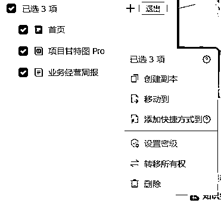

## 3.标记常用页面

*   添加到“置顶”：将页面固定在当前知识库目录最上方，便于快速进入。

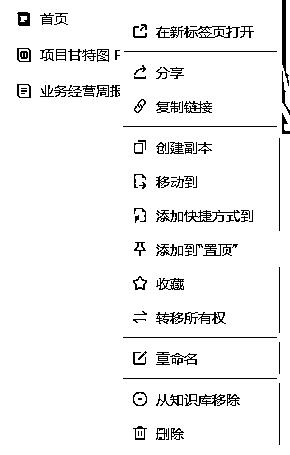

*   收藏：点击后变为“已收藏”，可在 云文档首页 > 收藏 中查看。

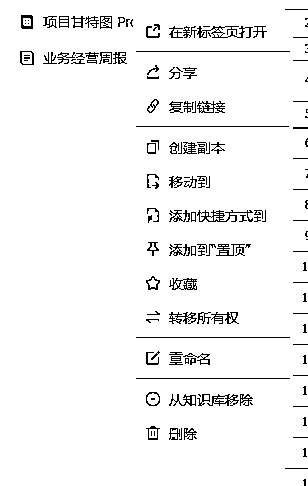

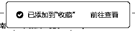

## 4.移除和删除

*   移除：选择从知识库移除，页面会回到页面所有者的“我的空间”，不进入回收站。

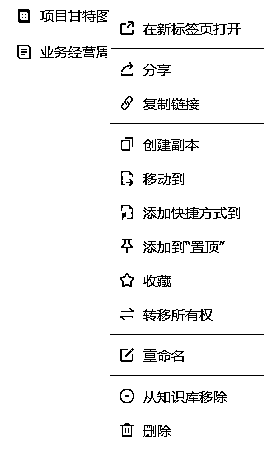

*   删除：选择删除，页面进入本知识库回收站，30 天内可恢复；超过 30 天将彻底删除。

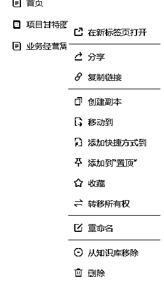

# 五、分享知识库或其中的页面

完成前面的步骤后，就可以把整个知识库或其中的页面共享给他人阅读/协作。

## 1\. 分享整个知识库

方式 A｜添加管理员 / 成员（统一授权整库）

进入知识库 设置 → 成员设置，按需添加管理员、可编辑成员、可阅读成员；创建人默认是管理员。

被添加的成员会在“知识库”列表中看到该库。

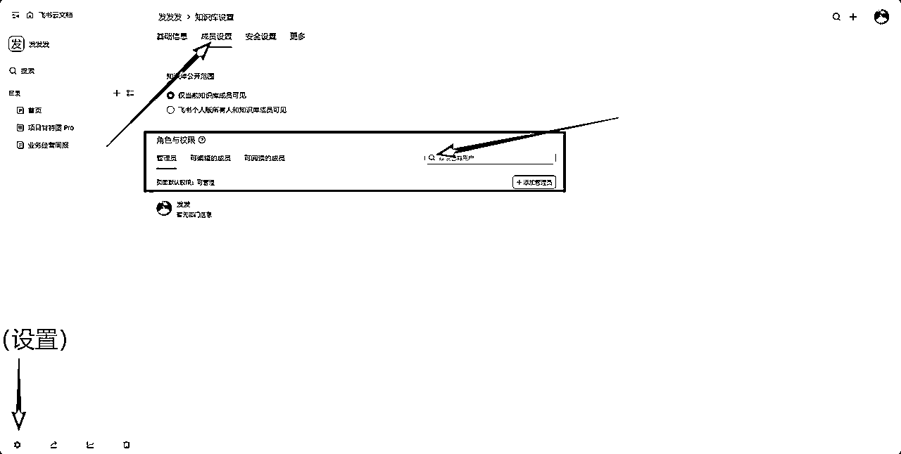

方式 B｜设为组织内公开

在创建时将可见范围切为“"XXXX"所有人公开可见”，或在设置 > 成员设置 > 知识库公开范围，知识库会出现在组织内所有人的知识库主页列表；变更公开范围后 1 小时内不可再次修改。

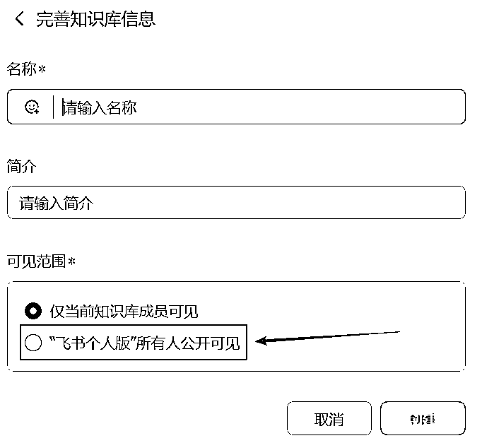

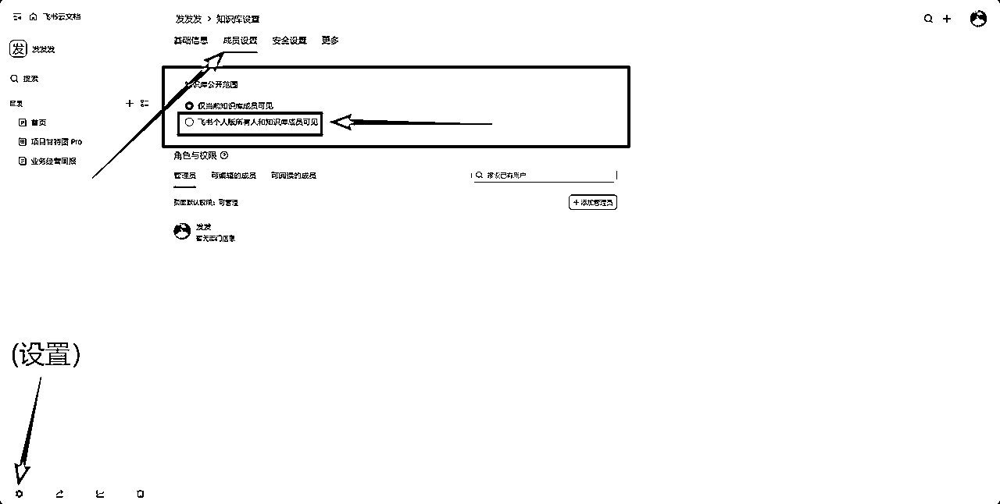

方式 C｜发布到互联网（对外链接）

点击左下角分享按钮，开启“将知识库发布到互联网”，复制链接发给外部用户即可访问。开启后，目录第一级页面的链接分享范围会自动改为“互联网获得链接的人—可阅读”，子页面默认继承；关闭开关则外部访问失效。

外部用户通过链接，无需登录飞书账号即可在网页上查看你分享的知识库。

满足密级限制或已停止继承父级权限的页面不会自动开放，需单独调整。

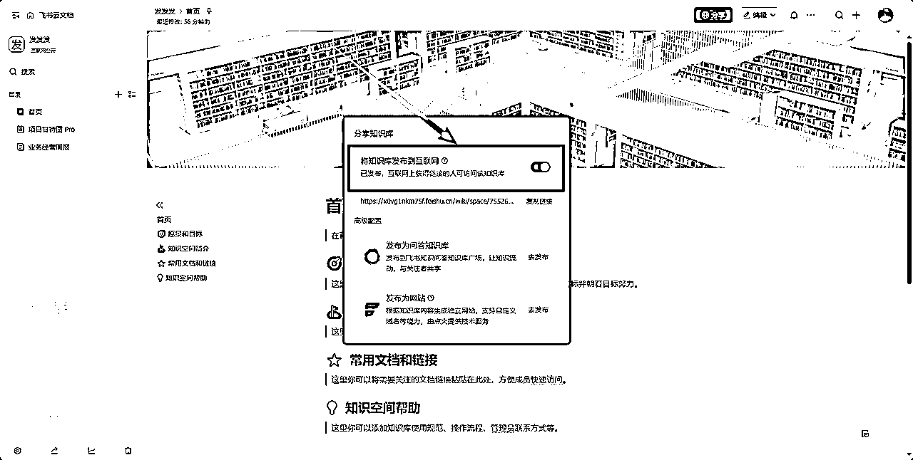

小提示：任何人打开知识库链接后，只能看到自己有阅读权限的页面；必要时仍需给对方开通页面层面的权限。

## 2.分享知识库中的页面

方式 1｜邀请协作者（指定人）

在页面右上角点分享，输入人名/群组，设置可管理 / 可编辑 / 可阅读。根据需要勾选/不勾选“允许协作者同时访问子页面”。

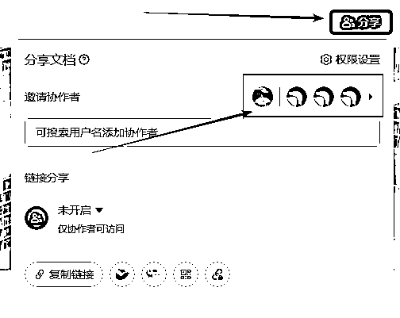

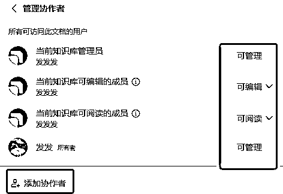

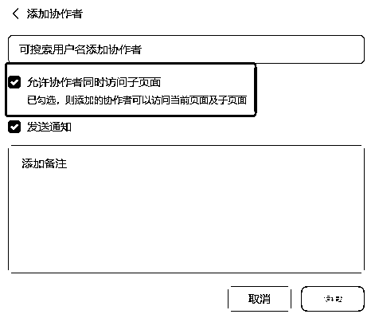

方式 2｜链接分享（全网可见）

在分享 → 链接分享选择“互联网获得链接的人”，再选择作用范围：仅当前页面或当前页面及子页面；设置为可阅读/可编辑并复制链接。仅拥有该页面可管理权限的用户可修改链接分享范围。

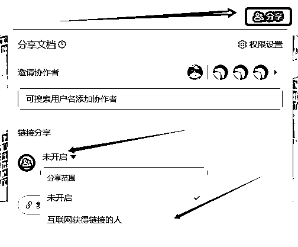

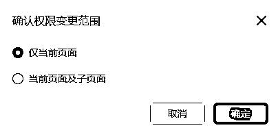

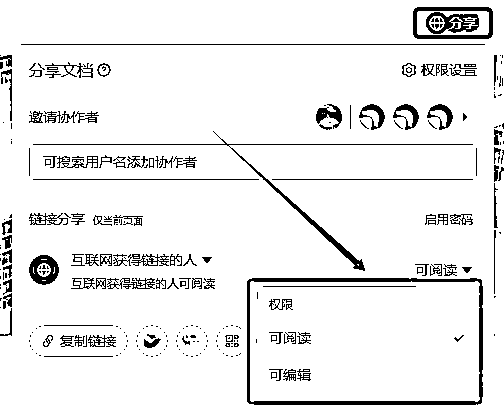

继承规则要点：父级页面的分享与权限会影响子页面；协作者列表里能分别看到“当前页面及子页面”与“仅当前页面”两类协作者。

受限情形：若安全设置不允许对外分享，则任何页面都无法开启对外分享；单页面权限设置不得超出知识库安全设置的允许范围。

# 六、管理知识库

谁是管理员？

新建者自动成为管理员，并可继续添加其他管理员与成员。

管理入口在哪里？

进入知识库左下角设置，可修改基础信息 / 成员设置 / 安全设置，以及在“更多”中执行删除知识库等操作；设置入口仅对管理员可见。

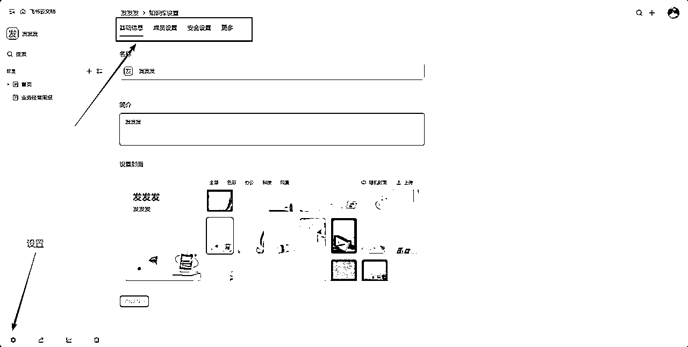

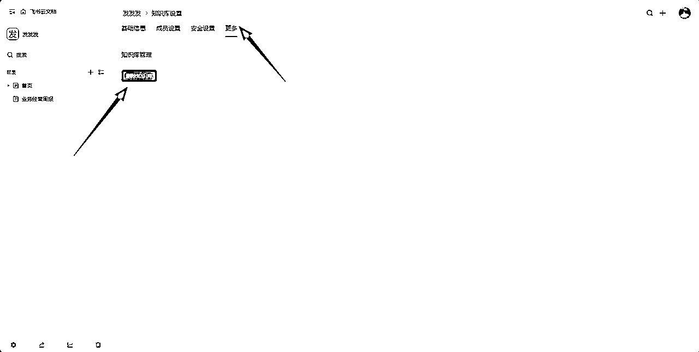

### 1.安全设置介绍

*   是否允许页面被分享到组织外？：

允许/不允许页面对外分享。若设为“不允许”，将关闭已有对外分享、隐藏“互联网获得链接的人（可阅读/可编辑）”选项，且无法添加外部协作者。

*   谁可以新建知识库的一级页面？：

可选“管理员和成员”或“仅管理员”。选“仅管理员”时，其他成员不能创建/移动/删除一级页面。

*   谁可以看到知识库设置中的基础信息？：

控制谁可点击左下角“知识库信息”查看封面、简介、管理员名单。

*   是否允许可阅读的用户对知识库内的页面内容进行复制、创建副本、打印、或导出（Word、PDF、图片等）？：

是否允许仅可阅读的用户获取内容。设为“不允许”后，相应页面设置里不可再选可阅读用户。

*   是否允许可阅读的用户在页面进行评论？：

是否允许仅可阅读的用户发表评论（含划词评论）。

*   谁可以移动或删除知识库的子页面：

规定谁可以移动或删除非一级页面。

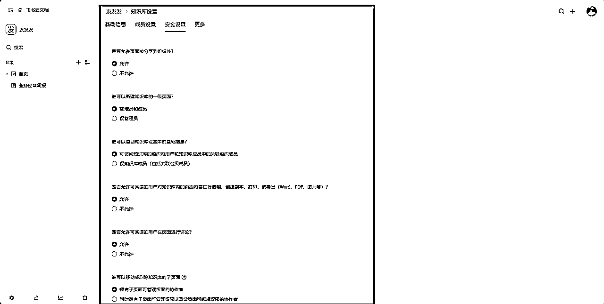

提示：安全设置由当前知识库管理员在“设置 → 安全设置”统一调整。

### 2.数据概览（可选，需要升级套餐版本）

若你的版本支持，管理员可查看内容访问量、内容新增量等使用数据。

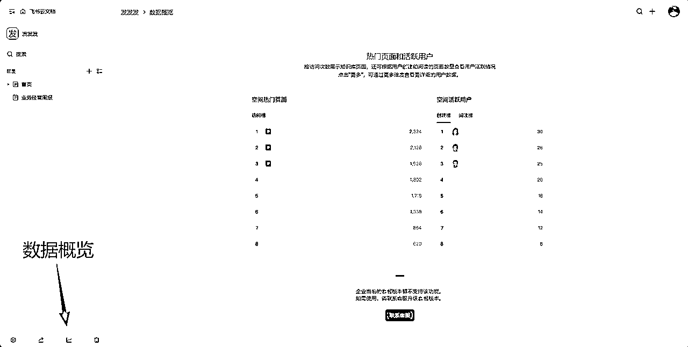

### 3.删除知识库（谨慎）

在 设置 → 更多 → 删除知识库 执行。删除后，知识库及其中所有页面一并删除；如需恢复，一般需由管理员在后台处理，且仅支持 90 天内删除的知识库（个人版删除后无法恢复）。

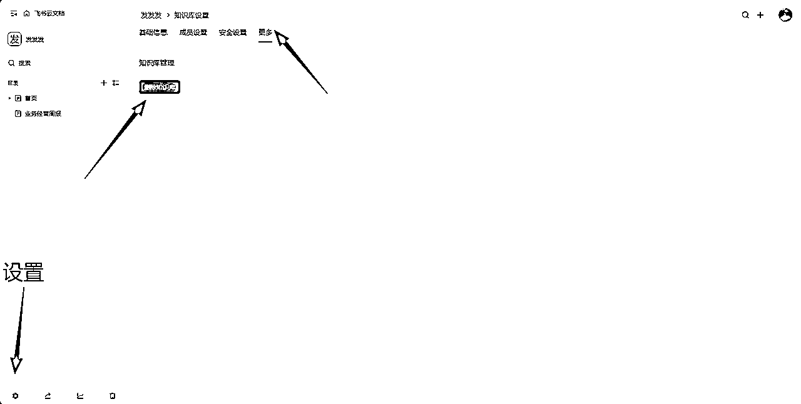

# 七、常见问题

## 1.创建与规模

*   能创建多少个知识库？ 支持创建无限个知识库。

*   一个知识库最多能有多少个页面？ 40 万个页面。

*   单个页面下最多能创建多少个子页面？ 2,000 个。

*   目录层级最多多少层？ 100 层。

## 2.成员与角色

*   知识库可以添加多少位成员？ 知识库有 3 种角色：管理员 / 可编辑成员 / 可阅读成员。 总人数上限为 500 位（三类合计）。其中，可编辑和可阅读成员不单独限额，但受总上限 500 约束。

*   可以添加多少位管理员？ 管理员计入总上限 500，没有单独的独立上限（以组织策略为准）。

*   按群组或组织架构添加成员如何计数？ 每个群组或组织架构按 1 位计（包含其成员）。最多 100 个群组或组织架构。

## 3.协作与协作者

*   每个页面最多可添加多少位协作者？ 500 位。 若按群组或组织架构添加，每个按 1 位计，最多 100 个群组或组织架构。

## 4.批量与运维

*   最多可同时移动多少个页面？ 20,000 个。

*   最多可同时删除多少个页面？ 2,000 个。