# 如何搭建AI解压视频n8n工作流：小白教程（以API.core为例）

> 来源：[https://bcnd4kmmbtts.feishu.cn/docx/CNMIdmPdToGBrYxyIPKcKNsSnHg](https://bcnd4kmmbtts.feishu.cn/docx/CNMIdmPdToGBrYxyIPKcKNsSnHg)

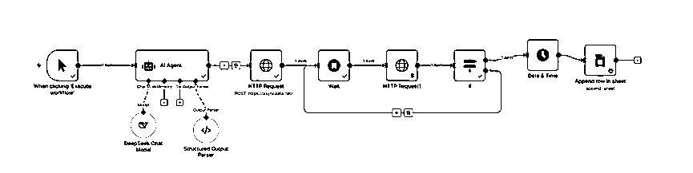

大家好，我是高猿一等。

写这篇的起因是按照航海手册的方法，注册kia.ai这个API中转站，出现了一个问题，试了7、8次，真人验证过不了，提醒我请求次数过多。于是我换一台电脑重新登录，可还是无法注册。刚开始就遇到这样的问题，真是让人感到无奈。API中转站又不是只有这一家，索性直接用熟悉的APIcore这个API中转站。

### 关于APIcore

APIcore，生财圈友书虫搭建的API中转站。网址：https://api.apicore.ai

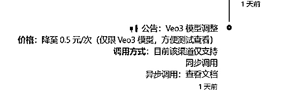

（网站最新公告2025年9月10日）

跟其它的中转站相较而言，除了好用之外，价格还很亲民，调用一次veo 3，价格是0.5元。

花了半天时间，我看着Kia.ai的案例，一边问AI，调用API.core成功地完成了解压AI视频工作流的搭建。这两者有什么不同呢？让我们往下看。

前面的两个节点很容易，航海手册上说的很明白。不一样的地方开始于第三个节点：Http Request，也正是从第3个节点开始调用APIcore中的API用来生成视频

以下文字内容配合图片一起学习（下图为APIcore的文档截图）

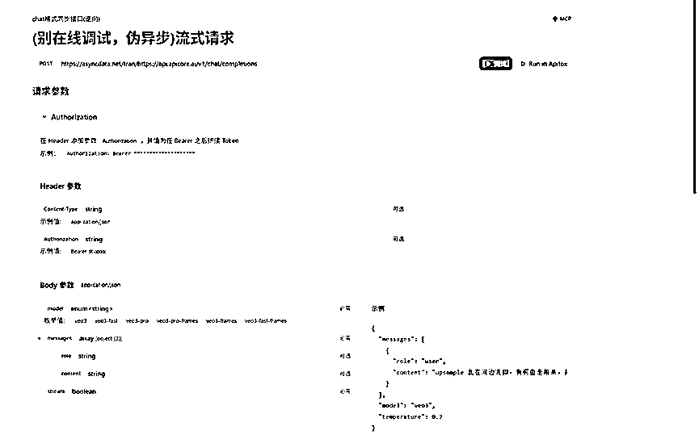

Url是我们想要请求的网址，我们从这里填入

https://asyncdata.net/tran/https://api.apicore.ai/v1/chat/completions

获取方法为参考API文档，复制网址进去，(别在线调试，伪异步)流式请求 - APICore 为API文档地址

这个网址来自于APIcore的官方文档，有没有发现这个链接很奇怪，它有两个http://

为什么这个“错误”的 URL 是“正确”的？

答案：因为它根本不是一个“地址”，而是一个“指令”。

我们来用一个生活中的比喻 (可以忽略以下内容，先去配置API key）：

https://asyncdata.net: 这是邮局的地址。

/tran/: 这是邮局里的一个特殊窗口，叫做**“代寄服务”**窗口。

https://api.apicore.ai/v1/chat/completions: 这是写在信封上的、你真正想寄达的最终地址。

你现在要做的，不是直接开车去那个最终地址，而是把这个写好了最终地址的信封，交给邮局的“代寄服务”窗口。

所以，整个 URL https://asyncdata.net/tran/https://api.apicore.ai/... 的真正含义是：

“你好，asyncdata.net 邮局！请你帮我把一个请求，转发（transfer）到 https://api.apicore.ai/... 这个地址去。”

如果直接访问 https://api.apicore.ai/...，会遇到—— 429 Too Many Requests (服务器太忙，占线)。因为太多人同时在直接请求，把服务器挤爆了。

现在，这个中转站提供了一个**“异步 (async)”**的解决方案。asyncdata.net 就是这个方案的入口。

它的工作模式是：

你把你的任务（信封）交给它。

它不会让你在线等待结果，而是先收下你的任务，并立刻给你一个**“任务回执号” (Task ID)**。

然后，它会在自己后台的队列里，慢慢地、不那么拥挤地，帮你把请求发送给真正的 Veo API。

你之后需要做的，就是拿着这个“任务回执号”，过一段时间再来查询结果。

### 如何获取API key

获取API Key的网址：https://ismaque.org/

进入之后，点击管理后台，然后在API令牌上面获取API key

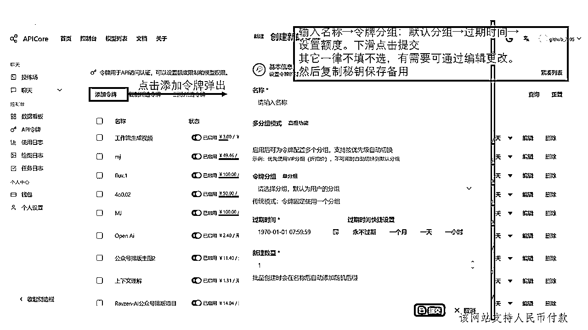

点击创建新的令牌，

输入名称→令牌分组：default默认分组→过期时间→设置额度。下滑点击提交

其它一律不填不选，有需要可通过编辑更改。

然后复制秘钥保存备用

该网站支持人民币付款

### 节点3：

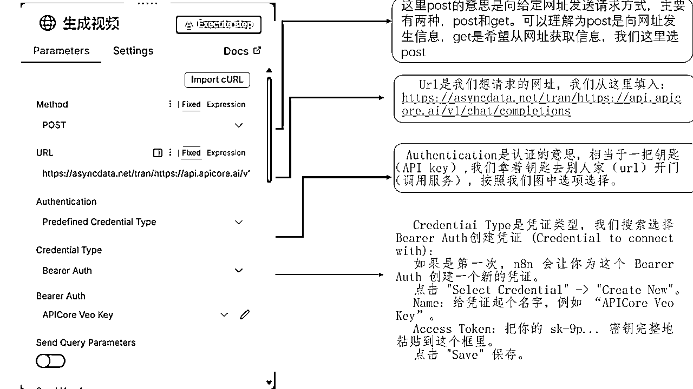

这里post的意思是向给定网址发送请求方式，主要有两种，post和get。可以理解为post是向网址发生信息，get是希望从网址获取信息，我们这里选post

Url是我们想请求的网址，我们从这里填入：https://asyncdata.net/tran/https://api.apicore.ai/v1/chat/completions

Authentication是认证的意思，相当于一把钥匙（API key）,我们拿着钥匙去别人家（url）开门（调用服务），按照我们图中选项选择。

Credentiai Type是凭证类型，我们搜索选择Bearer Auth

Authentication (认证): 保持选择 Predefined Credential Type (预定义凭证类型)。

Credential Type (凭证类型):

点击 Select (选择) 下拉菜单。

在弹出的搜索框中，输入 Bearer Auth。

你现在应该能看到一个名为 Bearer Auth 的选项。请点击它。

创建凭证 (Credential to connect with):

现在，n8n 会让你为这个 Bearer Auth 创建一个新的凭证。

点击 "Select Credential" -> "Create New"。

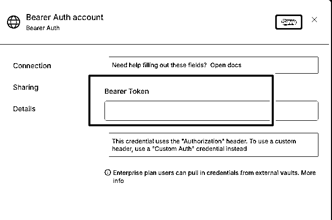

Name（左上角的位置）: 给凭证起个名字，例如 “APICore Veo Key”。

Bearer Token: 把你的 sk-9p... 密钥完整地粘贴到这个框里。

点击 "Save" 保存。

也可使用 Header Auth

万一因为 n8n 版本等原因，找不到 Bearer Auth ，我们还有一个更通用、更底层的“手动挡"方案，它100%有效。

Credential Type(凭证类型): 在下拉菜单中，搜索并选择 Header Auth。2.创建凭证(Credential to connect with):

。点击"Select Credential" >"Create New".

。Name: 同样，起个名字，比如“APICore Veo Key (Header)"。

Name(字段名):这里必须输入 Authorization。

。Value (字段值):这里必须输入 Bearer(注意 Bearer 后面有一个空格)，然后粘贴你的 sk-...密钥。

·最终看起来应该是这样:Bearer sk-9p...KCJy

这个 Header Auth 的方式，就是手动告诉 n8n:"请在请求的 Header 中，加入一个名为 Authorization 的项目，它的值就是Bearer sk-xxxx"。这和 Bearer Auth 的效果是完全一样的，只是需要我们手动指定字段名。

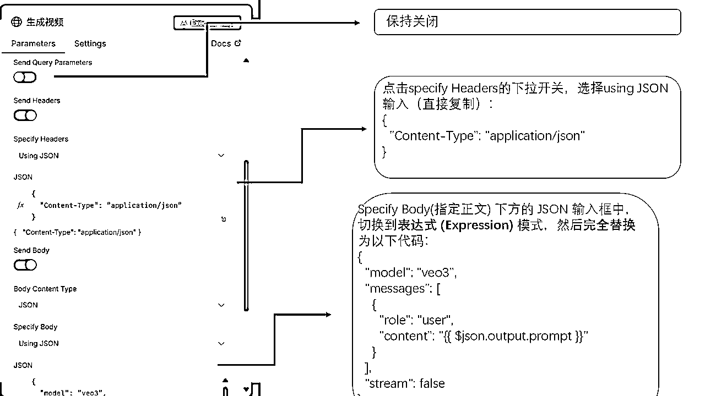

往下滑，打开send Headers和send Body的开关

点击specify Headers的下拉开关，选择using JSON

输入：

CodeJson（直接复制以下内容）

{

"Content-Type": "application/json"

}

这个标头的作用是告诉 API 服务器：“我接下来要发送给你的 Body 数据，是 JSON 格式的，请你这样去理解它。”

指定正文 (Specify Body) 的 JSON 信息

这是本次修改最核心的部分。新的 API 不再接受一个简单的 prompt 字段，而是需要一个结构更复杂的 messages 数组。

操作：请在 指定正文 (Specify Body) 下方的 JSON 输入框中，切换到表达式 (Expression) 模式，然后完全替换为以下代码：

codeJSON（直接复制以下内容）

{

"model": "veo3",

"messages": [

{

"role": "user",

"content": "{{ $json.output.prompt }}"

}

],

"stream": false

}

### 节点4：

设置好wait的节点，注意格式

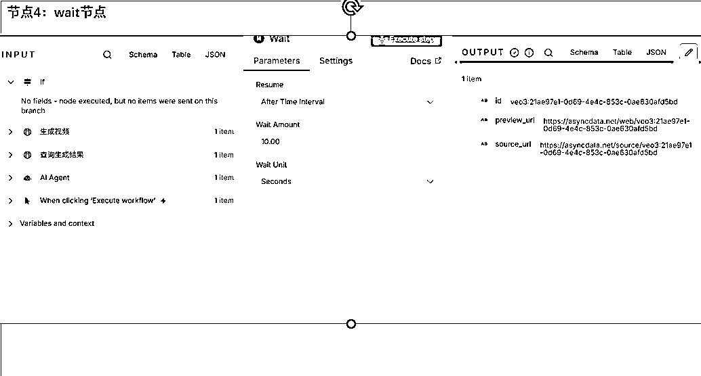

### 节点5：第二个http request

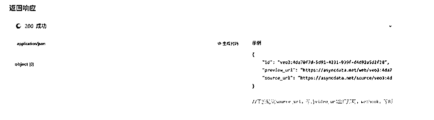

根据APIcore文档的示例

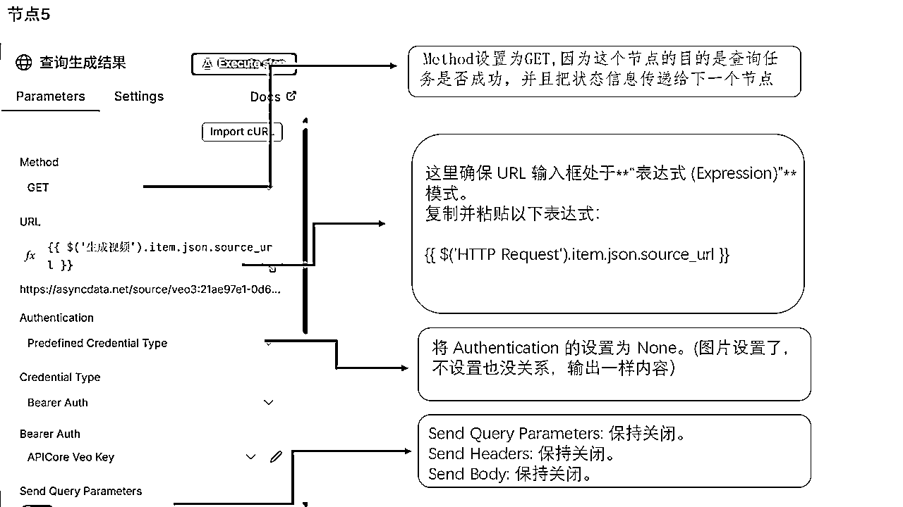

Method设置为GET,因为这个节点的目的是查询任务是否成功，并且把状态信息传递给下一个节点

这里确保 URL 输入框处于**“表达式 (Expression)”**模式。

完全删除输入框里现有的内容。

复制并粘贴以下这个全新的表达式：

Code（直接复制以下内容）

{{ $('HTTP Request').item.json.source_url }}

解读:

这个表达式的意思是：“请找到名为 HTTP Request 的那个节点（也就是我们提交任务的第一个节点），获取它输出的 json 数据里的 source_url 字段。”

这样，我们就确保了每次都是去访问那个正确的、动态生成的“订单状态查询页面”。

第二步：

将 Authentication 的设置为 None。

为什么？ 因为我们现在是去访问一个公开的查询页面 asyncdata.net/...，这个页面本身不需要 Bearer Token 认证（URL里的那长串ID就是“密码”）。

第三步：确保其他设置干净

Method: 保持 GET。

Send Query Parameters: 保持关闭。

Send Headers: 保持关闭。

Send Body: 保持关闭。

这个节点大功告成

### 第六个节点：IF节点配置

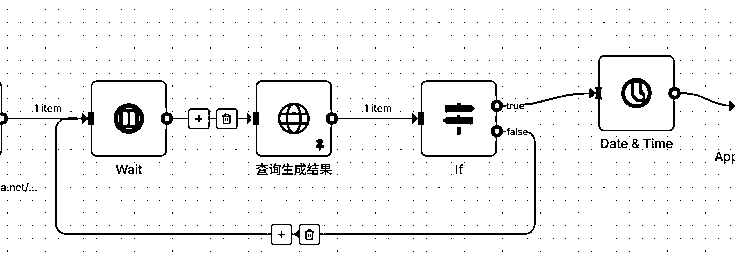

IF节点false连接在wait前面，这个节点可能需要等一会才能出结果，所以需要轮询

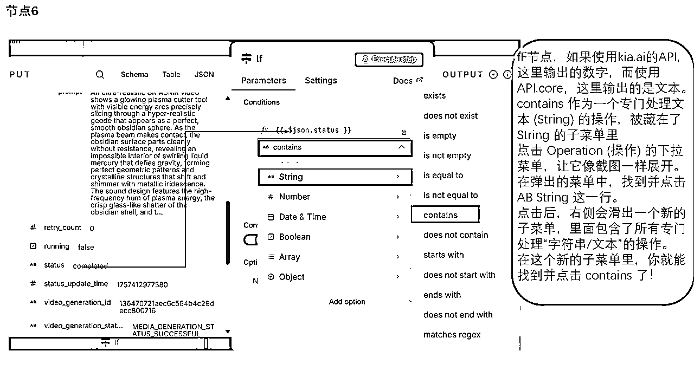

IF这里不一样，使用kia.ai的API,这里输出的数字，而使用API.core。这里输出的是文本。

contains 作为一个专门处理文本 (String) 的操作，被藏在了 String 的子菜单里

点击 Operation (操作) 的下拉菜单，让它像截图一样展开。

在弹出的菜单中，找到并点击 AB String 这一行。

点击后，右侧会滑出一个新的子菜单，里面包含了所有专门处理“字符串/文本”的操作。

在这个新的子菜单里，你就能找到并点击 contains 了！

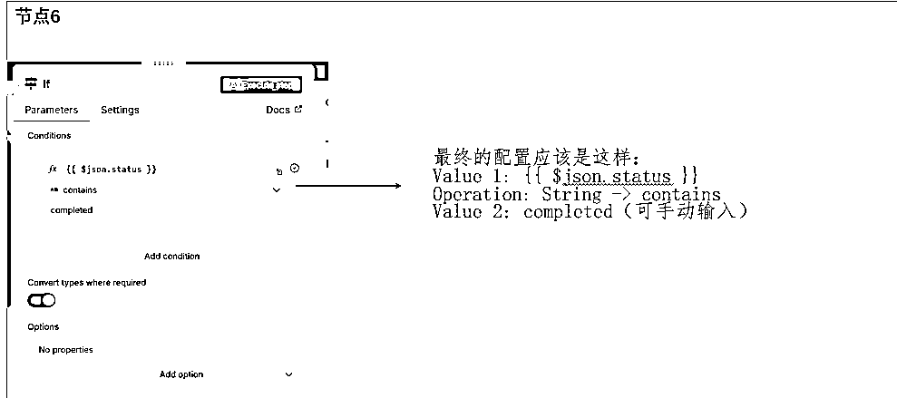

最终的配置应该是这样：

Value 1: {{ $json.status }}

Operation: String -> contains

Value 2: completed（可手动输入）

为什么用 contains 而不是 is equal to？因为有时候 API 返回的状态可能是 MEDIA_GENERATION_SUCCESSFUL 这种更复杂的形式，用 contains 可以更稳妥地捕捉到成功的信号。

其它所有节点的配置方法与生财手册无异，请仔细阅读航海手册。

今天是航海第七天，别急，你现在探索时遇到的每一个坎，最终都会变成你技能库里闪亮的徽章。加油！

### 注意事项

相信一手资料：当遇到困难时，反复、仔细地阅读API官方文档，尤其是那些不起眼的注释和小字，往往能发现被忽略的真相。

跟AI协作反复报错的时候，尝试自己排查异常，尽可能多喂一些信息给他

如遇问题，欢迎交流。成功了，希望你在评论区报个到，让更多人看到。

感谢读完