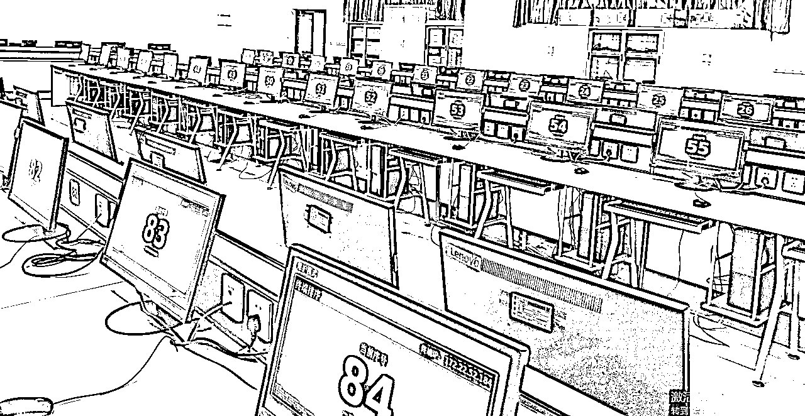
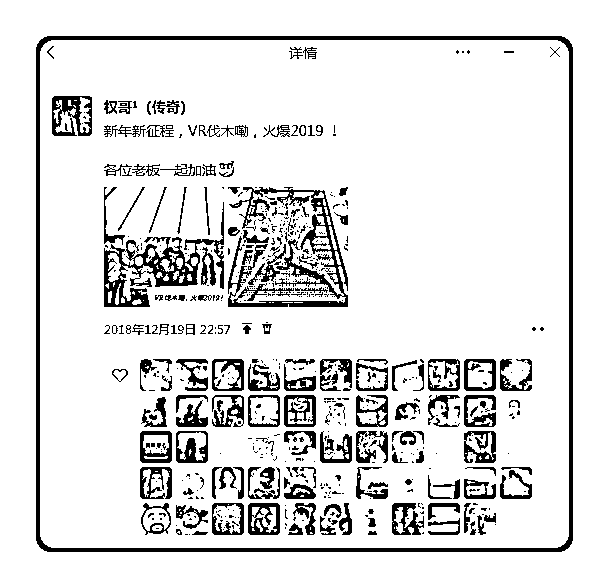
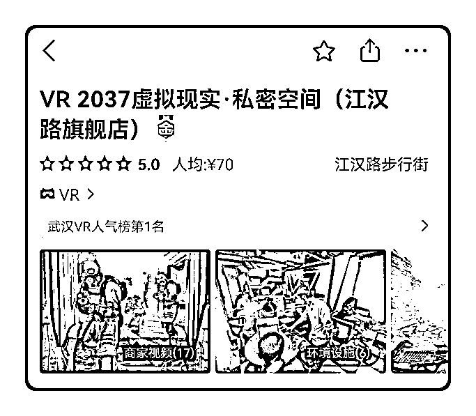
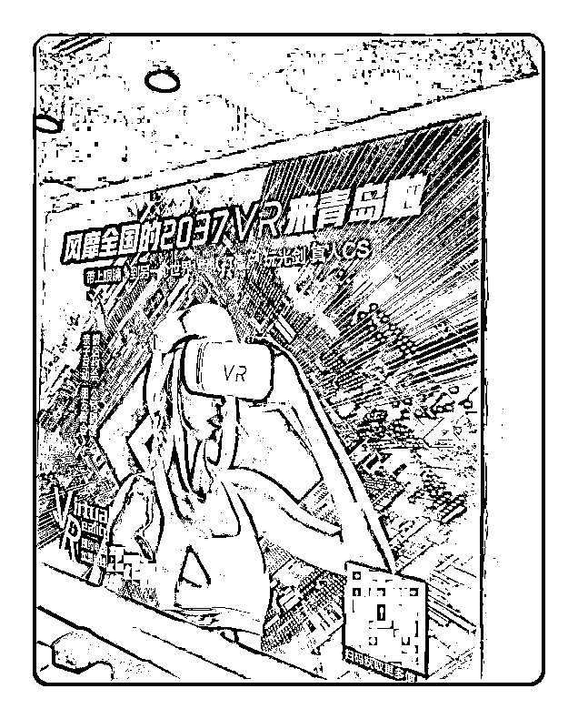
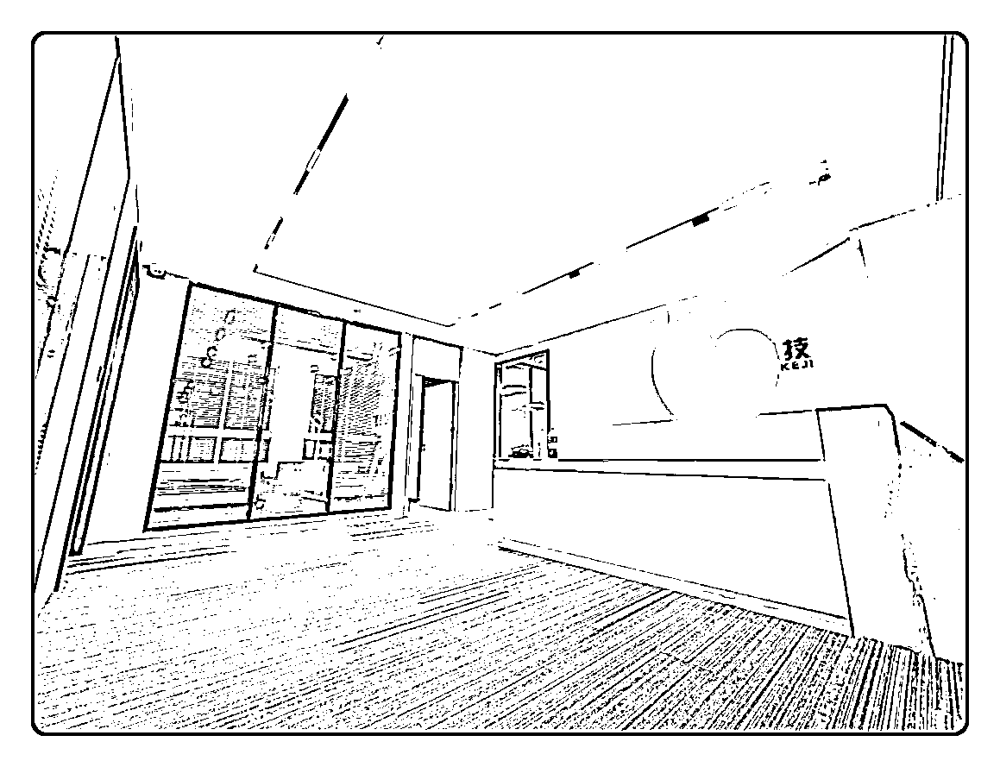

# 从0到97家店，再到挥手作别：一个产品经理的千万级连锁实战复盘

> 来源：[https://ymcncqsd4u.feishu.cn/docx/CdhXduiFloo4fux5gpzcL5wonUh](https://ymcncqsd4u.feishu.cn/docx/CdhXduiFloo4fux5gpzcL5wonUh)

### 《我如何用4年时间打造全国TOP3的VR连锁品牌，又为何在巅峰之后选择清零回归？》

大家好，我是权哥（本名汪升，字传奇）。

在生财潜水许久，每每看到圈友们毫无保留的分享，都深受触动。互联网的魅力，或许就在于这种开放与真诚的连接。今天，我也想把我的一段故事写下来，一段关于成长、跨越、狂奔与沉淀的经历。

故事的开篇，我想先澄清一个可能存在的误解。很多人基于我后来的创业方向，或许会给我贴上“程序员”的标签。但实际上，我并非出身于代码的海洋，而是在一家云计算新三板上市公司，从最前线的炮火中一步步摸爬滚打出来的产品经理。

这段独特的职业旅程，让我习惯了从用户的视角去审视世界，也让我骨子里坚信，再精妙的技术架构，如果不能转化为用户可感知的价值，解决市场的真实需求，那么它最终也只是一段沉寂的代码。我今天要分享的，正是我如何带着产品经理的这份“执念”，一头扎进线下实体连锁的深海，从0到1，从1到97，最终又选择清零回归的完整复盘。

这不仅仅是一个商业故事，更是一个关于 “流量” 与 “人” 的深刻反思。

# 第一部分：蓄势待发——从大厂螺丝钉到创业掌舵人

每一个创业的念头，都源于对现状的“不满足”。我的故事，便始于职业生涯中那块清晰可见的“天花板”。

## 1\. 从技术支持到产品经理的跃迁：深入炮火，才能听见炮声

在那家云计算公司，我的起点并非办公室，而是全国各地的机场、火车站，以及无数个高校的机房和政府单位的服务器机房，数据中心机房。作为一名基层的技术支持工程师，我的日常就是背着电脑包，奔赴一个个项目现场，安装、调试、售后，解决各种疑难杂症。

那段日子很苦，一年有大半时间都在出差，但也正是这段经历，让我像海绵一样吸收着来自一线的真实反馈。我能亲眼看到老师们因为系统的一个小bug而手忙脚乱，能亲耳听到政企客户对数据安全的真实担忧。我深刻地理解了，深入炮火，才能听见最真实的炮声。

为了家庭，在女儿出生后，我希望能有更多的时间陪伴妻子和孩子，于是主动申请转岗，成为了一名专家客服。这个角色，让我从“动态救火”转向了“静态分析”。我每天的工作就是对接高端客户的问题，复盘、归纳来自全国各地用户的反馈，我开始发现，90%的技术难题背后，其实都指向了产品逻辑的不清晰或用户体验的断裂。这份洞察，在我心中埋下了一颗种子。

勇敢的人先享受世界。当公司宣布要增设产品经理岗位，负责核心的OEM产品线时，我毫不犹豫地报名了。那是一场激烈的内部竞聘，我的对手中不乏资历深厚的技术专家。但我凭借着对一线场景的深刻理解、对用户痛点的精准把握，以及一套完整的逻辑闭环，最终成功胜出。

从技术支持到产品经理的跃迁，是我职业生涯的关键一步。它让我完成了从“被动执行者”到“主动规划者”的身份转变，也让我彻底明悟：一个成功的产品，必须是技术、市场、用户三者之间的完美平衡。而我，渴望去创造这样的平衡。

## 2\. 邂逅VR，用5万块钱购买一张“入场券”

在产品经理的岗位上，我做得还算不错，但也很快看到了那块透明的天花板。公司的核心管理层几乎都是创始股东，再往上晋升的空间微乎其微。虽然刚出社会2年，就拿到了公司奖励的原始股，而此时，我的内心，早已不满足于做一个大机器里运转良好的“螺丝钉”。

一个偶然的机会，我认识了同事“老C”。他是一个天生就带着创业基因的人，不安于现状，总在折腾。当时，他正在业余时间经营着一个VR体验店项目，并且已经有了初步的加盟模式。他每天都在兴致勃勃地跟我讲述VR世界的神奇，以及这个赛道的巨大潜力。

他的热情感染了我，而我产品经理的直觉则开始疯狂运转。在接下来的两个月里，我几乎把所有的业余时间都投入到了对VR市场的深度调研中。

线上查资料看数据。2016年，被称为“VR元年”。Oculus、HTC Vive、索尼PS VR，三大头显厂商神仙打架，资本市场彻底疯了。

线下去店里体验。我伪装成顾客，走遍了武汉三镇大大小小的VR体验店，记录下每一家的设备、定价、服务流程和客流情况。我以加盟咨询者的身份，深入考察了老C已有的三家加盟店，仔细分析它们的运营数据、盈利能力和存在的问题。

调研的结果让我愈发兴奋——这个市场正处于爆发前夜，存在着巨大的信息差和机会窗口。

于是，我做出了人生中一个至关重要的决定。我主动找到老C，开诚布公地提出，我想用5万元购买他49%的股份。我清晰地告诉他，我买的不是他现有的几台设备或那个尚未注册成功的品牌，而是他过去一年多在VR行业里积累的行业经验和试错成本。

工作3年，成家生娃后积蓄不多，只能慢慢一笔笔转。

在我看来，这5万块，是购买一张进入新赛道的“入场券”，是一次成本极低的“市场MVP测试”。我相信，这些无形的财富，远比有形的资产更加珍贵。老C被我的坦诚和这套“产品经理”逻辑打动，我们一拍即合。

就这样，一个懂产品、一个懂行业，带着对未来的无限憧憬，我们的创业之路，正式启程。

# 第二部分：飞速崛起——四年97家店的疯狂增长曲线

我们的目标从一开始就无比明确：我们不是要开一家赚钱的小店，而是要打造一个可以被标准化、被规模化、被无限放大的连锁品牌。这，是产品经理的“规模化”思维在驱动。

## 1\. 旗舰店模型的从0到1：极致执行与差异化定价

创业的第一步，是打造一个无可挑剔、可供复制的旗舰店“样板间”。我们把目光锁定在了当时武汉最繁华的核心商圈——江汉路步行街。这里的租金寸土寸金，中介费高昂。为了找到性价比最高的店面，我们放弃了传统渠道，采用了最“笨”也是最低成本的方法：晚上去扫楼，看到商铺的位置合适，就从门缝里塞进一张写有本人电话和求租意向的A4纸。

连续一周，我们几乎塞遍了江汉路所有写字楼。终于，一位房东被我们的“执着”打动，主动联系了我们。

为了将每一分钱都花在刀刃上，我们几乎把所有事情都做到了DIY的极致。电脑，我们不买品牌整机，而是自己研究配置单，从网上淘来二手的高端CPU和显卡，亲手组装；店里的墙壁需要隔音，我们就自己买来隔音棉，一块一块地贴上去，常常弄得满身胶水和灰尘；甚至连地毯，在看过一次专业师傅的操作后，我们便掌握了技巧，后续新店的地毯，都是我们自己带着工具去铺设。那段时间，我们每天都像上了发条，白天还在公司上班，晚上就一头扎进那个毛坯房里，敲敲打打直到深夜。

在产品定价上，我们做出了一个大胆的决定。当时，市面上VR体验店的客单价普遍在70元左右，走的是薄利多销的路线。而我们经过反复测算和讨论，果断将核心套餐的价格定在了148元。我们坚信，在消费升级的趋势下，用户愿意为更高品质的体验买单。

为了支撑这个高定价，我们在服务细节上下足了功夫：每一次体验结束后，店员都会用消毒湿巾仔细擦拭VR头显；我们为等待的顾客准备了免费的零食和饮料；我们精心筛选了当时最新、最有趣的VR游戏，并为每一款游戏都设计了独特的引导话术和服务流程。

事实证明，我们的判断是正确的。高品质的服务带来了极佳的口碑，仅仅用了不到2个月时间，在几乎没有投放任何广告的情况下，我们的旗舰店就凭借着用户的真实好评，冲上了武汉VR品类美团人气榜的第一名。看着后台源源不断的订单和用户“物超所值”的评价，我们知道，这个“样板店”成了。

## 2\. 从1到N的连锁体系：认知升级与模式创新引爆全国

旗舰店的成功，验证了我们的单店盈利模型。但如何将这个模型快速、高效地复制到全国？当门店开到十几家时，我们很快遇到了管理瓶颈：服务标准不统一、财务管理混乱、品牌形象模糊……各种问题接踵而至。

我们意识到，光靠自己摸索，已经跟不上扩张的速度了。必须向专业的人学习。于是，我们做了一个更大胆的投资决策：拿出近20万元，我和合伙人一起飞往深圳，报名参加了一个国内顶级的连锁经营主题落地陪跑班。

那是一次彻底的认知颠覆。在连续几个月的时间里，我们飞到了深圳、广州、杭州会场，系统地学习了如何打造标准化的单店模型、如何设计科学的店长股权激励、如何构建病毒式的裂变模式……这次为认知付费的经历，让我们完成了从“草台班子”到“正规军”的蜕变，也为我们后续的疯狂扩张打下了最坚实的理论基础。

认知升级后，我们的扩张之路如同打通了任督二脉。其中，“杭州模式”的成功，成为了我们引爆全国市场的关键节点。

我们在杭州龙翔桥的加盟商是一位非常精明的温州人，他的家族之前一直在做连锁超市，虽然规模不小，但投资巨大，回本周期漫长。而我们的VR店，总投资不到30万，让他仅仅用了10个月就收回了全部成本，远超他过去任何一个超市项目的投资回报率。

那年春节，他在温州家族聚会上分享了我们正在做的“小生意”。结果出乎意料，翌年开春，加盟意向客户蜂拥而来，其中大多数源自他的口碑推荐。借此契机，门店数量迅速从十几家扩展到三四十家，并成功成为美团休闲娱乐板块的 KA 商家（每天重点大客户）。同期，我牵头推动的《连锁加盟授权许可》也顺利完成商务部备案，为连锁扩张提供了政策保障。

我们敏锐地抓住了这个机会，迅速将这套基于熟人信任的裂变模式SOP化。我们设计了一套在当时看来极具吸引力的推荐返点机制：老加盟商每成功推荐一个新加盟商，3.68万元的加盟费，我们直接返现2万元给推荐人；新店开业后，每月流水的8个点，我们再拿出3个点，持续返给推荐人。

我们深知，舍得分钱，才能聚拢人心；利益共享，才能实现共赢。这套模式，极大地激发了老加盟商的“布道”热情，他们成了我们最得力的“编外招商团队”。我们的门店扩张速度，也因此进入了快车道，在短短半年多的时间，就从50家增长到了80多家。这个时候的年GMV（商品交易总额）达到了2000万元。

为了支撑起如此庞大的连锁网络，提高品牌影响力，我们升级了品牌形象，聘请专业设计师，统一了所有门店的LOGO、门头和装修风格，让品牌调性瞬间提升。

基于我们所有的门店业绩情况，我们定制了一个科学选址手册，让加盟店选址的工作高效的进行，从一周变成3天，并且只要是被选中的位置都有极大的概率成为当地排行第一的门店；同时，我们还自主研发了一套会员互通的结算系统，解决了连锁行业“总部收钱，门店亏钱”的核心痛点，确保了每一家门店的利益，同时解决了会员互通和异地结算问题。

在巅峰时期，我们的VR连锁店在全国开到了97家，，甚至吸引了国内网咖巨头“网鱼网咖”的二把手，亲自带队前来洽谈收购事宜。

那时的我们，站在自己亲手打造的商业版图前，意气风发，仿佛已经触碰到了成功的顶峰。

# 第三部分：风暴降临——时代洪流下的急转直下

然而，商业世界里，唯一不变的就是变化本身。一场突如其来的风暴，让我们的高速列车，戛然而止。

## 1\. 疫情冲击与流量失灵：被时代抛弃，连招呼都不打

疫情的到来，给了我们沉重一击。作为线下娱乐业态，我们在封控期间颗粒无收。虽然在解封初期，我们凭借着一波短暂的“报复性消费”反弹，业绩有所回暖。但随着疫情的常态化和经济的持续下行，人们的消费变得愈发谨慎。作为“锦上添花”而非“雪中送炭”的“玩乐”消费，VR体验，很快就被人们从消费清单中划去。

更致命的是，我们过去引以为傲的“数据裂变”模式，在此时彻底失灵了。以往，我们只需要打开美团后台，将一家家门店漂亮的营收数据和火爆的排队照片展示给意向加盟商，就能轻松签单。但现在，门店业绩普遍下滑，我们再也拿不出有说服力的“证据”。这条我们最依赖的获客渠道，被拦腰斩断。

这时，我们才追悔莫及。我们过去对新兴流量平台抱有一种莫名的傲慢，尤其是抖音。我记忆犹新的是，当我们连锁店到20家的时候，武汉抖音本地生活刚起步，官方人员来我们店里求合作，免入驻费，提供免费的达人直播带货，都被我当面拒绝了。主观地认为抖音上充斥着低俗和不雅的内容，根本上不了台面。当时代要抛弃你的时候，真的连一声招呼都不会打。

我们慌了，开始病急乱投医。花50万选了个500平的写字楼作为总部运营中心，同时组建了招商团队，又投入了十几万去尝试做百度竞价和抖音投放。但因为团队缺乏专业的公域流量操盘经验，对平台的规则和玩法一无所知，投放出去的广告如同石沉大海，除了烧掉一堆真金白银，没有带来任何有效的线索。

我第一次如此深刻地体会到，不懂获客，是企业最大的命门。一个不能持续、低成本获取新客户的企业，就像一台失去了发动机的跑车，外表再光鲜，也只能在原地等待淘汰。

## 2\. 合伙人困境与团队内耗：逆境中，才能看清人心

外部环境的恶化，也如同催化剂，加剧了内部的矛盾。

为了寻找新的出路，我们几个合伙人决定背水一战，开两辆车带着衣服和日用品前往当时疫情控制最好的广州，希望能在一线城市开拓新的市场，找到新的增长点。然而，在这段最需要同舟共济的日子里，我却看到了人性的复杂与脆弱。

每天，只有我和老C还在外面顶着烈日奔波，考察市场，约谈客户，验证新的思路，寻找任何可能的合作机会。而其他几位后来加入的合伙人，却似乎失去了斗志，安于现状，经常性待在出租屋里做饭、打游戏，对公司的未来心有余力不足。

在一次次深夜的会议上，我提出了新的战略方向时，迎来的要么是沉默，要么是质疑。在反复发生多次后，我彻底失望了。我意识到，顺境时，人人都可以是伙伴；但只有在逆境中，才能看清谁是真正的战友。我们后期引入的合伙人，在价值观、认知和行动力上，与我们早已不是同路人。选错人，比做错事更可怕。当团队无法形成合力，所有的努力都将变成内耗。

# 第四部分：回归沉淀——清零再出发的勇气与远见

在广州那个闷热的夜晚，我独自一人开车在广州塔旁边的停车场想了很久。继续僵持下去，只会是无尽的内耗，最终拖垮整个公司。于是，我做出了一个让所有人都震惊，但在我看来却无比正确的决定。

## 1\. 壮士断腕，主动清零

我召集了两个核心合伙人，平静地告诉他们，我决定退出。我将我名下价值近几百万的股份，以“1块钱”的象征性价格，全部转让给了老C和另一位我相对认可的合伙人。我告诉他们，这个品牌就像我们的孩子，我不希望它因为无休止的内耗而消亡。

签下股权转让协议的那一刻，我没有一丝不舍，反而感到了前所未有的轻松。我知道，我放弃的，是过去的沉没成本；而我赢得的，是未来的无限可能。当天，我便收拾好行囊，独自一人开车，从广州返回了武汉。

## 2\. 复盘与展望：寻找下一个可以被放大的事业

回到武汉，我花了两周的时间，彻底放空自己，回归家庭，陪伴妻子。那段时间，我回顾了过去四年创业路上的每一个决策，每一次跌倒和爬起。我深刻地复盘了这次失败的两个核心原因：

1.  获客能力是企业的命脉。

任何商业模式，无论线上还是线下，如果不能解决持续、低成本获客的问题，都将是无源之水，无本之木。必须掌握一套属于自己的、可控的、可规模化的流量方法论。

1.  选对同行的伙伴至关重要。

创业是一场艰苦的长跑，只有在价值观、认知和行动力上高度同频的人，才能真正与你并肩作战，翻山越岭、穿越风雨。 合伙人应该在前进过程中选择对的人，而不是局限于熟人和朋友。

这次创业，让我付出了惨痛的代价，但也让我收获了用金钱买不到的宝贵认知。我知道，我不能再回到过去的老路，我必须去寻找，一个真正可以被无限放大的事业。这个事业，必须能从根本上解决“流量”和“人”这两大难题。

我过往所有的经历，无论是作为产品经理的系统思维，还是操盘97家连锁店的实战经验，都已化为我最坚硬的铠甲和最锋利的武器。它们将指引我，去寻找下一个千万级，乃至亿级项目的入口。

而这个故事，也正是我下一段征程的开始。

过段时间，我会再写一篇万字长文：分享我是如何从0起步，跨行业转型，一路带出1000位健康主播，并成为年业绩2亿团队长的核心成员。

如果你对【大健康赛道】或【直播赛道】【AI技能变现】感兴趣，欢迎在评论区留言你的问题，我会在后续的文章中毫无保留地分享。