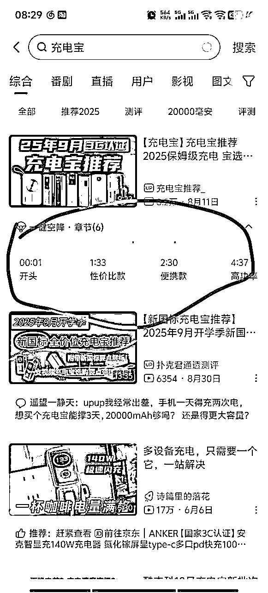
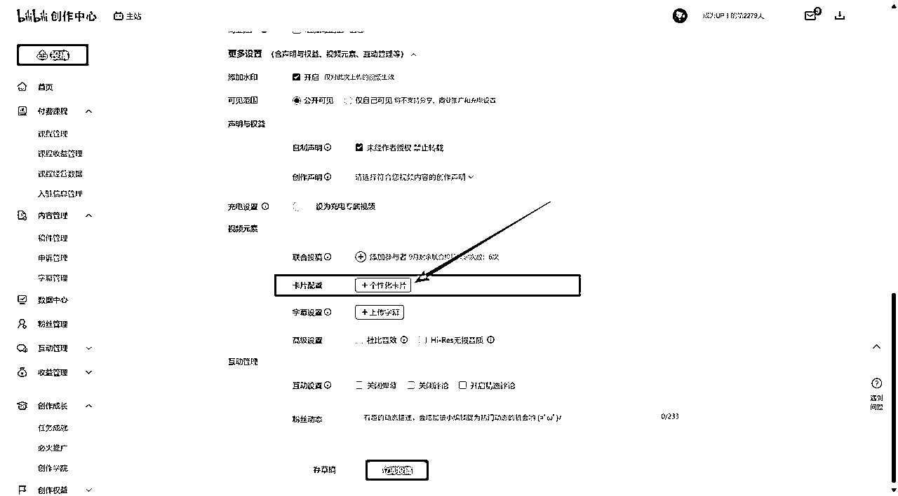

# 从零开始b站好物深海圈，只发了两个视频，开始日入1000，3天速通深海圈，预计10天破万收益，我做对了什么？

> 来源：[https://psborr04us.feishu.cn/docx/CqYMdV5JrodY3Ux9bBPcncs3nyd](https://psborr04us.feishu.cn/docx/CqYMdV5JrodY3Ux9bBPcncs3nyd)

# 第零部分｜前言：

## 0.1 感慨的话

第一篇帖子有些用心，写帖子的净时间用时12个小时，跨度一个星期，字数过万了，阅读用时大概需要20分钟，感谢阅读。

感谢生财，感谢亦仁老大，感谢家蒙老师和助教老师们，感谢深海圈里无私分享的大佬和各位共同跑项目互相打气的圈友们。

b站好物真的是红利，想拿到正反馈太快了，第一个视频就出单，第二个视频就如标题所说~

一天一千多块钱利润，3天赚回票价，才知道从零开始，也可以有这么高上限。

## 0.2 生态位说明

b站好物的生态圈非常丰富，我选择的是，跟着深海圈，走的是生态位置较为优势的生态位置（看上去很难！其实是纸老虎！在家蒙老师的带领下，一戳就破，无痛速通~），所以这篇帖子的内容并没有太多关于好价视频和AI矩阵的路子哦，只有第四部分AI提效的部分，提到过一点。

做的路子可以参考百万榜的下面这位，后面讲的大部分内容也是围绕着这种视频该怎么优化，下面这位大佬也是我的对标对象之一~

## 0.3 文章结构说明

本篇帖分为4个部分，因为我写的细，把有些决策的思考过程也写出来了，文章有点长，注意力这种资源很宝贵，看左侧目录也可以直达，希望能够帮助到你。

一是收益分享，这个部分是为了给大家提升信心的，我会展示收益的数据

二是我做对了什么，讲解质变的道与术

三是深海圈的价值

四是提效方法

五是一些感悟杂谈（附带时间记录表与对挫折的理解）

* * *

# 第一部分｜收益数据

信息和执行之间，缺了太多东西，动力就是其中最重要的事情之一，写这个部分就是给大家加油的。

人对于未知总是有恐惧的，那么我先把数据给你，至于心中的那杆秤要怎么衡量，取决于你。

只要你选对了方向，坚持做正确的事，只要不下牌桌，总会赢的。

成功才是成功之母，只要你能赢第一次，就会有下一次，就会有无数次。

## 1.1 小晒收益

晒收益前我先补充一件事，我有主业，同时还是非全研究生，工作日干活，周末上课，上课的老师很牛逼，我无法控制我去不听课，有的时候从早上8:30上课，21点45才下课。

我想说的是，我每天只有两小时是可以纯粹的去做这份项目，既然我这个条件都可以，那你也一定可以！

每年抛去日常工作和必要的休息娱乐通勤，能用的时间大约是1425个小时，再除去研究生的学习和“刻意休息”的时间，只有600个小时的资源可以用来聚焦做一件事，去在这一件事上积累小时数，从而去引发质变。

我一年基本上只做一件事，去年是考在职研究生（537个小时成功上岸，时间见下表），今年就是从互联网搞到钱的能力。

### 1.1.1【9月3日】当日760元利润

当天虽然只有3000，但当日 gmv 1.3万，佣金利润760元

### 1.1.2【9月4日】当日1200元利润

播放量爬到了7000，当日gmv 2.7万，佣金利润1200元

### 1.1.3【9月5日】当日1380元利润，深海圈，票价回本

播放量到了1.2万，当日gmv 2.8万，佣金利润1380元

我视频挂了15个链接，一半链接都卖空了

3天时间，深海圈，票价回本，但收益，还在持续。

### 1.1.4【9月6日】当日1700元利润

播放量到了2万，当日gmv 3.2万，佣金利润1700元左右

好了，鸡血打住，咱们回归现实，多苦多累还得继续干，看看总结部分~

## 1.2 我投入了什么？

从8月24日开始看家蒙老师直播的录播课到今天，共计投入了50个小时数

我有时间记录的习惯，会把每天有价值的净时间，以10分钟为最小单位进行记录，这个习惯坚持了2年，正是因为这个习惯，大伙才能看到比较清晰的过程数据，以便参考。

我建议大家也尝试培养一下这个习惯；

如果有一个一般等价物来衡量能衡量人的价值的话，那么这个一般等价物一定是时间；

价值的单位可以是“元/小时”，我自己的目前价格大概是50元/小时（兴许未来能升值）；

年轻真好，人生还有大把的时间；

后面我会顺带分享一下我自创的、迭代了无数个版本的自用时间记录表。

做事里程碑如下：

### 1.2.1【8月14日】生财宣布要上b站好物深海圈

我看了之后很心动，但我看什么都会很心动，但这个在直觉上感觉就对劲，但越是看起来心动，就要越谨慎的分析他的风险，我认知的底层逻辑时刻提醒我做成事情要聚焦，all in 是一门艺术，要不要做一件事，我先做了初步的可行性分析。

01 外部环境 & 机会分析

价格价格战环境下，用户更信任第三方素人（非知名up）评测而非从品牌方的单一口径营销，单品的短视频本质上是品牌方的单一口径营销的延续，而长视频才是更能承载测评的载体。

目前B站处于红利期，B站开放了电商跳转口，还鼓励你成交。评论区挂蓝链、视频悬浮按钮直跳淘宝京东，这意味着：平台允许你把流量带走，只要你能卖出货。

b站好物生态环境的多元化，有高门槛的，也有低门槛的，在策略实施，评估后，可调整的选择多种多样，即使在尝试高门槛的战地发现打不下来，也能退守一步到基础的战地，保留一份根基。

02 外部环境 & 威胁分析

对产品返利的比例依赖度高，易被选品牵着走，难做到差异化竞争（后来实践的时候发现威胁不大）。

赛道拥挤，同质化严重（后来实践的时候发现威胁不大）。

政策/平台规则突变（外链、佣金、带货权限）可能让既定转化模式失效。（暂时还有担忧，等跑到明年之后开始准备后手）。

03 关于我的自身的资源（尤其是时间资源）分析，和优势劣势总结放在这里有点自恋，不放了。

04 结论

最后我认同了b站好物是至少能做3-5年的项目，是一个可以从0开始学习，并且能够打造属于自己的护城河，外部的竞争者想要进来会有较高的门槛的项目。

同时，前面做失败的几个项目，让我学习到了各种能力，有了基础，再结合我自己的优势才干，我有信心能够做好的项目。

3000块钱的门票，也许半年之后，能做到月入3-5000，一个月就能回本。（实际结果：第1个月，做到了1天1千块钱，3天就回本了）。

### 1.2.2【8月20日】买了点fs，为了开通好物悬赏功能。

### 1.2.3【8月24日】开始看家蒙老师直播的录播课

看完课立刻开始做，选定了第一个题材：充电宝。

为什么选定的第一个题材是充电宝呢？

关于充电宝的新版规则，自2025年8月15日起实施，这个选题天然有流量。

### 1.2.4【8月31日】账号做出来第一个视频

当时非常不自信，一发视频就买了必火投流，300块钱，出单了！但靠必火只出了3单，佣金总利润也只有40块钱，现实把我干的头破血流。

### 1.2.5【9月03日】做出来了第二个视频

痛定思痛，仔细分析，仔细对标，然后做出来了第二个视频，不敢投流了（到现在也没投流）。

早上7点发出来了，上午看了完整的阅兵，当核导方阵出列，主持人说到射程可覆盖全球的时候，真的很难控制泪腺，正义必胜！和平必胜！人民必胜！

然后结束后看了一下视频只有80播放，两眼一黑并且笑笑整理下心态，准备快速去战下一个视频，但下午再打开视频，发现有爬升的趋势，之后就火了（也不算火，算小火），然后有了本篇文章。

* * *

# 第二部分｜我做对了什么？（含金量）

大家从里程碑节点里可以看得到，质变是发生在8.31到9.3日之间的，那么我其实做了一件事——对标。

但对标也亦有差别，看看下面我是详细怎么做的

视频的提升一口气做下来是非常难的，城墙很高，容易被吓跑。

这里就是我三大做事基本原理的第二个起了作用——工程分解+聚焦。

我做事或者思考的维度，他的最小内核就是三点

一是量的积累：什么叫水到渠成，在正确的方向上积累小时数，量的积累终究会引发质变

二是做任何事都要工程分解+聚焦

三是生命在于记录，时间是一种战略资源，要去管理

工程分解：再难的问题只要把他分解再分解，直到分解成你可以轻易上手去做的程度，然后依次那么一做，就会完成，火箭就是这么一点一点造出来的。

聚焦：不管万里长城有多长，其实都是一块块的砖，无论何时你要面对的都不是一座长城，而是眼前的这块砖！

觉得难啊，拆开！拆到你觉得轻易可以上手的大小！聚焦做好这件“小”事！

拆！

见色起意，始于颜值：

标题、封面、置顶评论、视频数据（外露的）、视频章节、字幕，背景音乐音量，无噪音，语速

陷于才华：

视频节奏，剪辑手法

忠于内在：

内容（核心）、评论区运营（核心）、人物信任感

具体该怎么做呢，大道至简，就是每一个点都找到对标的视频，去copy+迭代！

## 2.1 见色起意，始于颜值

这部分并不是告诉你要做的多么美，我真正想说的是，你至少要做到及格线！

b站观众的容忍度非常高，但这并不意味着你可以每次都不及格。

高考作为阅卷老师10秒一篇作文，他是怎么做的呢？

先分档位，再划分数。

观众不也是这样的吗，我们不也是这样的吗。

看到你的标题和封面，就已经知道，你的视频大概在一个什么分数的档位了。

你要是这个地方出现让人厌恶的因素，有可能后面的内容再好，也会错过一些让观众爱上你的机会，即使可能不完美，但也一定要到及格线。

因为观众的时间很宝贵，注意力是一种稀缺的资源。

研究这个道法的基础学科，我认为是认知心理学，认知心理学是对自我和世界的感觉、记忆、理解、思考的全过程进行研究的一门学问。

里面有个概念叫选择性注意

人体的信息存储器每秒钟大概向我们大脑传递 1100 万比特的信息。最终我们能够处理的信息有多少？

答案是我们只能处理 16 到 50 比特的信息，也不到 1/ 200000。

这个就像在一个漆黑的夜里面，大地虽然很广阔，但是我们只有一个很小的探照灯，只能照到很小的部分。所以我们大脑每时每刻都在有意无意地控制探照灯，去照到不同的地方。

当你的封面的整体上的感觉对了，观众才会把探照灯看放到你封面和视频的文字上，才会开始第一次阅读文字，才会第一次用脑子处理信息。

接着，认知心理学上有一个著名的鸡尾酒会现象 ，在聚会上，有可能你正在跟别人聊到天呢，但突然间发现 3 米开外有一个人说了你的名字，然后在那里哈哈大笑。这个时候你的耳朵一下子就竖起来了，会不自觉的去听他们到底在说你什么，反而对你眼前这个人说的东西一下子全部都听不见了。这就是你的意识控制你的感觉系统刻意去把聚焦点放在你关心的事物上的最好的体现。

什么样的文字能够，更容易的，让观众点进来呢？答案是与观众有关！

道理是这个道理，但术法万千，大家平时看b站视频的时候可以注意一下，为什么你会想去点开别人的视频，

多去积累，多去运用。

我下面写的内容主要是新人在对标过程中要注意的几个点，有自媒体经验的同学可以直接略过，这部分并不是关键，真正的核心在于内容和评论区。

这part也不是要求你把外在做得多么精美，而是想强调：至少要做到及格线！

因为做到及格线，观众才更容易把探照灯看放到你封面和视频的文字上，进而再把探照灯放在你的视频内容上，这些小细节处理好，观众才更愿意更多的投入注意力，开始理性的思考你视频的内容。

### 2.1.1 封面

b站平台的封面要做两个，一个16:9，一个4:3。

9月4号家蒙老师在直播点评账号的时候，我看到有些圈友的封面比例不对，大概是只做了一个，导致有些文字没有显露出来，观众看了感觉不对，信任感就丢失了。

明明一个很小的动作就能解决问题的，你只需调整一下尺寸，再排排版就行了。

可能新手不知道怎么上传两个封面，我演示一下

01 先正常上传第一个封面，4:3的

02 点击多比例封面设置即可（很多圈友没有看到这个）

03 在这里换成16:9的

04 封面比例不同，也可以按照不同比例的特点去做嘛。

### 2.1.2 置顶评论（蓝链）

下面是我觉得牛逼的，去学，做到50%就行啦，前期还是要快速迭代作品。

编辑蓝链的确是很累，但观众点击蓝链才会给你钱，前面做视频都这么痛苦了，不差苦这一个小时

（我从上传视频发布+从京东联盟上开始搞蓝链的整个过程，基本上都要一个小时）。

### 2.1.3 视频数据（外露的）

播放量和弹幕数量，做带货视频，5000以上就属于好看的数据，不用太多。

先自然流3天，看看数据有没有过1000，如果只有几百那种，可以稍微运作一下。

运作一下仅为了主页好看，运作之后，流量也不会继续推流的，没有任何收益，达到及格线即可。

### 2.1.4 视频章节（必加）

一定要用阿b自带的这个，因为我注意到，手机端搜索视频后的那个列表，部分视频，有这个章节的会自动展开章节，有可能有人看到你的章节内容感兴趣。

我一开始是自己拿剪映做的，后面就改成阿b自带的了。

添加方法如下：

### 2.1.5 字幕

必须要加字幕，推荐的信息密度很高，如果你不加，观众可能跟不上你说什么。

我感觉好看的字幕（清晰可见即可）要加底色，和文字颜色对比出来，或者不加底色，加描边也行。

### 2.1.6 背景音乐

没什么好说的，注意一般调低15-25分贝。

### 2.1.7 无噪音

观众集中注意力开始看你的视频已经很辛苦了，你还要视频里埋大音爆给观众提升听力难度吗。

### 2.1.8 语速

大多数人偏慢，我也是，我调了1.1倍速

## 2.2 陷于才华

做完了第一步，你的视频达到及格线了，观众就能无痛的看了，大多数观众的第一次感性判断完成。

那么第二部，观众会根据这部分内容，给你定义档位。

如果你的节奏很舒服，观众的留存率就会高些，会多幅度的看你的内容。

如果你的剪辑画面很舒服，观众可能会觉得你很权威（其实并不是很重要）。

但这部分并不是最关键，真正的核心在于内容、评论区和信任感。

### 2.2.1 视频节奏

这是内容创作型视频节奏思路，仅做参考。

而对于我们这种带货的，要点就是不能一直讲干的，要有节奏，一直讲干的，观众感觉像上课，就累了，大脑是很不喜欢消耗能量的。

可以一会干货，一会调侃，一会参数，一会故事。

### 2.2.2 剪辑手法/质量

对于这部分，我们一直都是知道是可以怎么做的，只不过我们的大脑很害怕，他不让你们去做，甚至欺骗你，限制你不让去往这方面想。

邪修就是找一个对标视频，去花个2/30个小时，去1比1复刻一个，谁不是这么走过来的，我刚开始剪辑的时候1分钟的视频要剪1个小时（剪辑这部分我是总结了一点提效经验的，放到后面提效篇来说）。

这里上好的对标对象，我推荐的是这个。

边看边做，哪里卡住了，就去搜教程。

复刻完一个视频之后，再看见其他视频就知道他是怎么做出来的了。

但其实不要每个视频做的牛逼，你能模仿50%达到及格线上，找到感觉就行了，

## 2.3 忠于内在

### 2.3.1 内容（核心）

内容这里分为两部分 铺垫部分+产品介绍部分

为什么这种账号不到100的播放量也能酷酷出单，而为什么有可能我做的第一个13分钟的长视频的出单量还没有他的高呢？我做完第一个视频之后，进行了深度思考。

生态位置里的好价视频，他这个月百万gmv上榜，例如下面，猛猛出单。

我想到，既然能获得收益必然是你给对方提供了价值（当然也脱离不了b站目前是红利期大环境的根本因素），

那么b站好价给观众提供了什么价值呢？那么这种账号给观众提供了什么价值呢？

家蒙老师在第一节直播课上说

其实不是我们有多厉害，也不是我们的视频做的有多漂亮，更加不是说，我们解决了用户多大的一个问题.

说的露骨一点，就算没有我们，用户的问题，大概率自己也会解决掉。

我们只是出现在这个位置上，他消费的时候经过了我们一手，这就产生了中间服务费。

我这时想到，如果我是新人，在没有粉丝和作品基数的时候，我要扮演的，难道应该是一个牛逼的网络推销员？给没有需求的人推销各种使用场景吗？

不，一是作为新手，我不知道怎么成为一个牛逼的网络推销员，也许我根本就不需要去推销，我只需要扮演好一个便签纸的作用，提醒观众购买他们本来就打算去买的作用就足够了。

那么怎样才能成为一张合格的便签纸呢？

我看了一下9月在榜百万带货博主，发现了这位是我的理想对标对象。

建议大家也看看他的视频，说不定也会有所悟了呢。

给本来要买xxx的人，给与相应的信息整合建议，并且给出好与坏的评价。

那么内容我该怎么写呢？换位思考大家都知道的四个字。看看我是怎么想的。

解题步骤如下：

#### (1) 下面先是铺垫的部分的要点

##### 【铺垫内容要点 01 】

假如我刷牙感觉累，有点想买电动牙刷，但是又感觉普通牙刷用着也能用。

我日常刷着b站，可能看到一个电动牙刷推荐的标题，就点进去了。

那么这时候我首先想听什么内容呢？

1.有没有必要换电动牙刷

2.市场上有哪些电动牙刷品类，什么的算是好牌子

3.不同价位差出来的钱，他的区别是什么

带货视频，你前面的铺垫内容知道写啥了吧，当你写的东西恰好是他想要的东西，那他的脑区就会被激活，就会把探照灯聚焦在你身上。

##### 【铺垫内容要点 02 】

Tips很多up一上来会说最近我xxx（一个场景），用了他，真的爽。他可能是一个很好的推销员，但我觉得，一个便签纸，在一开始，认为便签纸怎么怎么样，遇到了什么使用场景，可能不是那么重要。

我觉得他写的这部分内容非常好，但是位置放错了，应该放在产品介绍的时候再说。

而在视频开头，重要的是把关于想买xxx的观众他想知道的一切，以观众能听懂的语言传达给他，让他判断视频的价值。

##### 【铺垫内容要点 03 】

为什么要强调以观众能听懂的语言呢，这个很重要，给大家举个例子。

我们做个简单实验，大家点开一下这个视频，看一遍就退出去。

你会发现，你的大脑是不是把这段信息给“屏蔽”了，不仅“看不见”，还“听不见”。

超过3秒的“看不见”，观众就会往右滑一段距离，连续滑3次，试想你会怎么做？

可能就会去视频相似推荐里，去找个能“看见”的视频看啊。

那么你带电动牙刷的时候，下面是你的资料，还敢直接给观众看这种信息吗？

高深的词汇可以说，展示权威性，但高深的长句没啥必要说，如果一定要写，不要把钩子埋在里面，因为这整句话观众大概率是“听不到”的。

我作为观众，只会想听最能能听懂的，能打动我的2-3个点

比如：

1.关于相比普通牙刷能不能更省力的就能清理干净的参数

2、打牙感（难不难受）

3，续航能力

我这里会选扫振幅和打牙感，因为观众一开始看这个视频，他大概率能听懂的是这几个点，你说工艺，观众只会隐约有个感受，具体内容，大概率是听不到的。

至于后面那些参数，要在产品介绍的时候埋钩子，一个产品挑一个牛逼的指标。

* * *

#### (2)下面到产品介绍要点的部分啦

##### 【产品介绍要点 01 】

产品介绍说的时候一定要介绍出这个产品：事实+评价

事实：扫振幅达到黄金标准(40°-60°)，能有效模拟巴氏刷牙法，深入清洁牙缝。

评价：那么这个幅度就已经能够满足那些不用花太多心思注意就能刷得全面的人啦

事实是用来权威的，评价是为了让观众听的懂的。

加不加一句评价的效果也许是这样的。

观众听完文案之后，能记住的信息大概是这样

光有事实：扫振幅+？扫振幅+哦→遗忘

事实+评价：扫振幅+好/坏，回忆的时候回想起来，我加钱买这款是因为有一个扫振幅，他好，所以他值，不亏。

你光阐述参数可不行，你还得说这个参数他怎么了？一共就两种结果，好与坏，你要点出来。

##### 【产品介绍要点 02 】

价格差在哪一定要说出来

（如果方便说的话。要说，有的一眼能明白的，比如充电宝，功率和容量就俩参数那就不用讲。但是两个相同价位，参数也差不多，你一定要做推荐区分，两个都推荐等于两个都不推荐，白花那力气多写两个品的文案呢？哪怕你说，这个颜色上适合学生，比较酷，而这个适合出勤，拿出来也不尴尬，都行！）

我的第一个视频，

第一个产品，100元把参数白话一遍，特点说了一下

第二个产品，200元把参数白话一遍，特点说了一下

我的第二个视频，

第一个产品，100元把参数白话一遍，特点说了一下

第二个产品，200元把参数白话一遍，特点说了一下，相比于100元价位的品类，这个品类加了xx的功能，能够xxx

##### 【产品介绍要点 03 】

使用场景要点出来

第一个产品，100元把参数白话一遍，而这个参数能够让你在xx的时候，能够xx，很贴心的一个设计，也是能满足基本需求的。

你不说出来，那关观众什么事情呢？与“我”有关的事情，才能最能激发人的注意力。

就好比你视频中间，随便来一句人名，假设是李华，

那么假如真的有叫李华的人看到了这里，他会直接炸毛的，耳朵会直接竖起来，甚至会打一句弹幕“怎么突然叫我”

### 2.3.2 评论区运营（核心）

评论区分数权重分数是很高的。

给大家一个数据，如果你一天能在评论区谈成100单的话（回复他，并给他推荐的链接，大概率会在你这里下单），那么大概率，今天你的gmv会破万，佣金利润会过千。

有的人可能会想，谁这么闲啊，挨个回复，然后可能还要回答问题，回答问题的时候还要推荐产品，推荐产品的时候还要有客观分析+主观评价。

就是在下啊。视频脚本写了4000字，评论区回复了2-3万字，

我知道一个人看了视频，大概率，也什么都记不住，你回复他，与他直接有关，你再把视频精华给他讲一遍（增加信任度），你再给他推荐一个商品，结果会怎么样呢？

看看我的回复，假如你收到了这样的回复，你会不会蓝链下单？哪怕是你知道会让他挣钱，你甚至会开心能让他挣到钱，因为他给你解决问题了，你也算帮到他了。

为什么我会这样回复他？

因为我想得到，根据认知心理学的理论，他能够给你发图片，要消耗脑力，大脑是非常不喜欢耗能的，他本可以划走的，这是相当可贵的事情，一次试探，值得我同等或者更多的回报。

并且如果有人看到了这个评论，他看到了有人得到了正反馈，他会怎么想?他会更容易的做出询问的这个决策，因为他收获了确定性，确定性意味着安全感，安全感意味着信任感。

做对了，剩下的交给复利与马太效应，量的积累会引发质变。

那么最后这么做的结果会可能是什么样的呢？

具体评论不太方便展示，800多评论，氛围就起来了，你应该能想象到那个场景，茫茫一片人海，多么壮观。

### 2.3.3 信任感

这个我不是很权威，有的人在表达上一看就很真诚，一看就招人喜欢，我看了许多圈友的作品，真的很b站，真的很好，下面是经某位圈友授权过，允许举例的。

家蒙老师直播点评的时候说很多商家都很喜欢他，愿意给单，我也很喜欢这位老哥。

据家蒙老师的经验，找那些非常精美的博主，做出来的视频开单效率，比那些粗糙博主差多了。

精美的很多时候比粗糙的，差。

根本原因是观众看视频做的太好了，可能会觉得你可能是广，你这么有钱才会做的这么精美，你不真实。

这个度需要自行把握。

可惜了，虽然我做不到视频表现上很让人有信任感，但可以在评论区里让人有信任感，或者用其他手段去弥补。

* * *

# 第三部分｜深海圈的价值

## 3.1 建立全局认知，选对“生态位置”，直接避坑提速

*   带你看清B站好物的完整生态，内容形态，知道都有什么，知道自己在哪，有恃无恐。

*   有完整而可落地的方法论，（纸老虎！那种视频，实际上手，有方法论的话，一戳就破，无痛速通~）。

## 3.2 资源与机会：高佣与商单

*   圈内整合高佣链接资源，有些是定向的专属高佣链接，直接给到我们去使用。

我第二个视频带的货单价200，佣金只3-5%，8%的高佣就意味着净利润翻一倍啊，伟大，无需多言。

*   商单资源：刚起步就有商单能接，还都是大牌子。

## 3.2 大佬圈友们的无私奉献，互相打气，涌现”复利效应”

*   大佬无私分享。

*   圈友互相打气。

* * *

# 第四部分｜提效技巧

## 4.1 AI提效

我个人是懂一点ai编程，懂coze工作流，会ai视频，并且是主业工作上也是重度依赖AI的。

但这个项目，我用到的AI技能不多，一部分原因是我刚跑通，没时间做这个动作，另外一个原因是我全年无休，目前我有主业，周一到周五上班，周末的时间非全日制研究生上课，有的时候周末从8:30 上到晚上21:45，真没有时间。

### 4.1.1 分享一下这个生态位置的AI自动化思路

短期快钱应该是能有的，但我觉得这是一个劣势的生态位置，但是如果我有时间的话，我可能也会同步做，但是现在没有时间预算，做事要抓主要矛盾。

#### (1) 影刀+Python把别人视频下的蓝链转成自己的链

#### (2) Python把别人的视频每5秒进行截图，删掉重复的，让gpt把信息按规定格式提取出来

#### (3) 可画什么的，做个固定模板，填写excel，自动套用信息

#### (4) 文案转写，规定每个产品的字数，让持续时间保持一致，coze做个工作流，直接生成视频

### 4.1.2 目前AI能帮到我的还有一个就是做图表

把一段文字信息给完gpt后，加一句口令，下面是效果

### 4.1.3 待验证AI应用想法

待验证的一个想法，截取别人视频里实拍的图片或者店家的商品实拍图片，然后ai图生视频，不加动作，只加运镜，来补充视频素材，没有拍摄的设备做那种酷酷的商品展示升格

### 4.1.4 minimax声音克隆

（不推荐打算长期做这行的人使用，还是真人说话出境有信任感）

## 4.2 剪辑提效

### 4.2.1 我的创作sop，一个视频大概12来个小时

### 4.2.2 剪辑的顺序（重要！）

剪辑经验：先定文本，录完之后定音轨，音轨定完之后才铺画面，音轨的地位就像一个结构的骨架。

一次，一口气搞定一个部分，这样才快。

### 4.2.3 快速剪辑的方法通俗讲就是用稿定设计做视频素材

剪辑一开始基本要用4个小时，但是用了这个方法后，现在基本两个小时了。

#### (1) 稿定设计抠图

#### (2) 稿定设计背景透明化，搞定剪辑素材

这个方法快不快，可能只有剪辑过的人才知道。

* * *

# 第五部分｜杂谈（时间记录表与对挫折的理解）

## 5.1 时间记录表

模板放在这里了，从简单到复杂，再由复杂到简单，迭代过无数遍的。

至于做记录这件事情真的这么重要吗，通过记录，不仅在于提效，你的生命的质量、密度会大大提升，更多好处，只可意会，不可言传。

补充说明：10分钟只是一个单位啊，真正做事情都是做完之后再填格子的，看看做了几个十分钟。

为什么是十分钟，就是因为感觉不想干先干个10分钟，要是干完还难受就先不干了，反正也就干了10分钟，但一般情况下会是完事开头难，做完第一个十分钟就进入状态了。

使用样例如下（这是去年考研期间的记录，因为感觉还是得放个使用过的例子，用我现在的吧，隐私还太多，就放去年的了，你要是问我为什么计划和实际做的内容对不上，我只能说人之常情吧哈哈哈，你计划你的，我做我的，计划是为了摸清这一周大概有多少时间资源，大概能做成什么事，有什么效果，人一但清晰自己做事情之后的结果，就会有动力，都是为了心理学上的暗示），去年左边是计划，右边是记录，今年给迭代了，反过来了。

## 5.2 是什么造就我成为一个不太会生气，心理韧性好，能主观控制情绪，做什么事都容易快乐的，核动力乐观小牛马？

分享一个小插曲， 9月7日早上走在上课的马路上，我发现我的佣金收益被砍了一半多，截止目前被砍了3000多块钱，后台查看，说是流量异常，（已经申诉了，目前还在申诉中）。

当时的我第一步做的事情就是镇静下来，我能感受到肾上腺素的分泌，但首先不要被情绪劫持，随后我想的事情是这件事对我的影响，先抓主要矛盾，我好像今年的主要目标还不是赚够xxxx数量的钱，而是获得能够从互联网上赚钱的能力，那么貌似并不影响我的核心目标，那么这件事可以被定性为有些肉疼的“小事”。

我一年基本上只做一件事，去年是考在职研究生（537个小时成功上岸，时间见下表），今年就是从互联网搞到钱的能力。

接下来的对策就是按照官方程序来申诉一下就行了，即使失败，损失3000来块钱，好像也不影响生活，也不影响我的核心目标，那么这就是一个不太重要的外部环境变动，那么我今天的主要目标还是去认真上课，听课。

做出判断之后，也顿时觉得自己的心性不一样了，要是3年前还是大学生的时候的我，可能会情绪崩溃，但现在的我能理性控制。

那么是什么造就了我现在的心理韧性呢？我觉得答案是挫折。

我经历过较大的挫折，但最后我还是走出来了，虽然用的时间相当长，想想时间花的很亏，但也很值。

具体的经历就不说了，如果有圈友也因为爆单而被砍收益的话（我的话9月6日当天的1690块钱给我砍到了600元，哈哈哈），要理性的看待这件事，挫折也许算是一种馈赠，人生可以拉长时间线再去看。

即使3000的佣金申诉不回来，可能5年后的我，再看我现在的这篇文章，只会觉得这件小插曲，是一件趣事罢了。

天生我才必有用，千金散尽还复来~

最后也祝福一起奋斗，做着不同项目的圈友们：

有很多时刻，你惊心动魄，而世界一无所知；你翻山越岭，而大地寂静无声。

所有难过，难是难，但总会过。

纵有千古，横有八荒，前途似海，来日方长！