# 新手怎么做好小红书虚拟电商？原创虚拟产品全面复盘

> 来源：[https://p03a4vs9s2.feishu.cn/docx/PVLGdsCrUo17UTxfY7pcRWhknhf](https://p03a4vs9s2.feishu.cn/docx/PVLGdsCrUo17UTxfY7pcRWhknhf)

哈喽，我是叁斤，我又来做虚拟电商的教练了。前后带了 5 次小红书虚拟资料的航海，越来越发现，大家其实都小看了这个项目。

一直把视角放在整理、搬运、卖盗版资料上，这个模式，有很多人做不起来，或者被告侵权很正常。

我从 5 月份开始新开一个账号，铺垫了半个月，6 月中开始发力，到现在 3 个月左右的时间，店铺卖了 5 万多了。

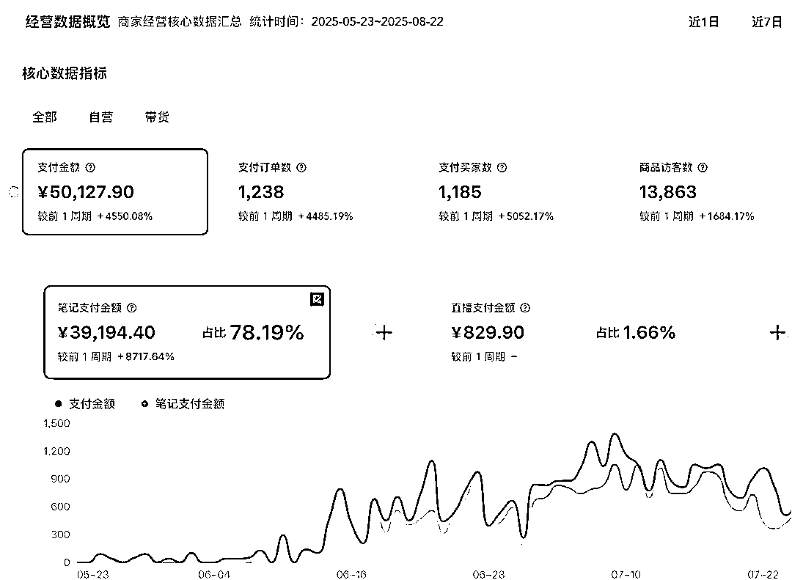

加上私域转化高客单价的，整个项目 3 个月收益在 10 万+。而我只是稍微认真一点，做了原创资料、原创内容……仅此而已……

原创内容是 AI 协助生成的，原创资料也是……

这次航海直播分享了一下我的思路，很多圈友都说打开了一个新世界，也有几个圈友立马开始了原创资料，最近的举手提问，也都是原创资料相关的，我真的非常开心也非常有成就感。

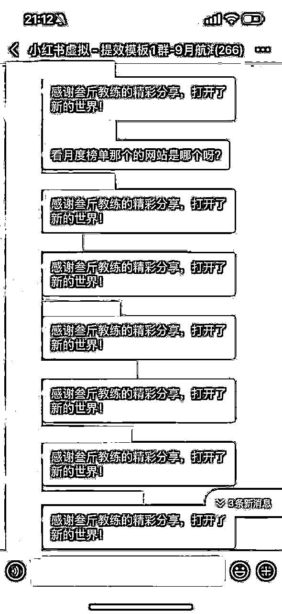

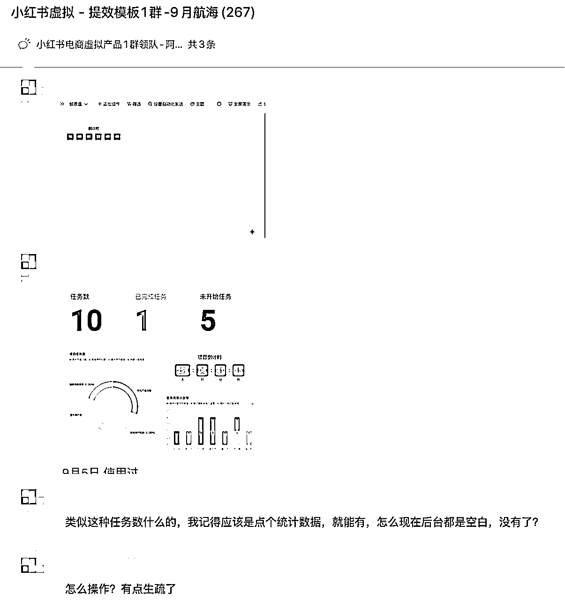

今天，我把对虚拟资料的一些理解，以及一些高手领航直播内容进行整理，再带大家进入一个全新的，你可能没有了解过的新 · 虚拟电商。

# 叁斤对虚拟资料的一些理解

## 虚拟资料可以是一个行业！

在我看来，「虚拟资料」更应该叫虚拟电商，本质上是属于电商一类（除了去年的引流航海）。「资料」只是产品之一，任何不需要物流发货的，都可以算作虚拟电商。

它甚至都不是一个「赛道」，而是「行业」，小红书把这个称为「虚拟行业」，而这个行业里，有无数的产品，无数的赛道。

把这个点想明白，你会发现虚拟资料的空间真的非常大。

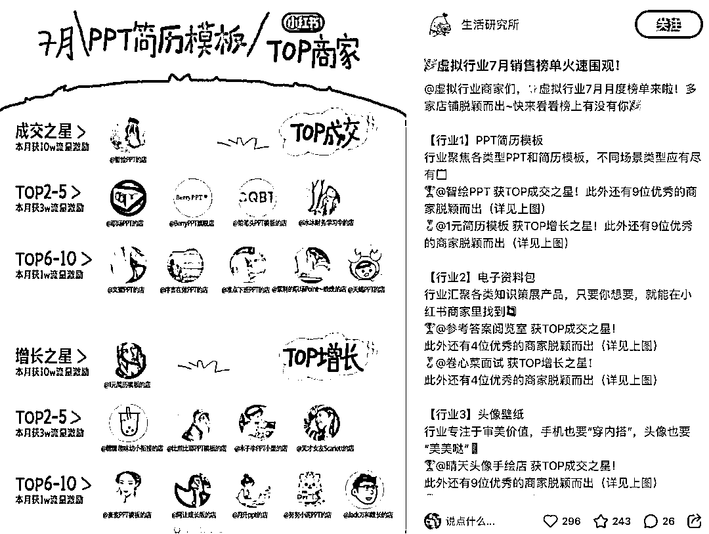

比如，ppt、简历模板、自律教程、快捷指令、表格模板、一对一咨询、头像壁纸、AI绘画、AI工具、xx教程……等等，其实都算虚拟电商。

甚至我的网站，薯光创作器：https://sgcreator.zhimoxiezuo.cn/ ，也是虚拟产品。

很多人在讲虚拟资料不好做，里面列的都是教育资料、学习资料……这就像你因为衣服不好卖，退货率高，然后得出「小红书电商不好卖，退货率高」的结论一样，以偏概全。

要在虚拟行业上赚到钱，第一个要打破的，就是「资料」的局限，别被这个词给骗了。

## 虚拟产品可以原创！

网上很多人在避雷虚拟资料，原因有几个，最重要的是版权问题。

还记得有个博主讲的是，他身边99%做虚拟资料的，都是二道贩子，把别人的资料整理过来卖，很容易就触及版权风险，还有朋友被人告到赔钱。

这是事实，也是大部分人眼里的「虚拟资料」。

24 年我卖的虚拟资料，是我自己写的《小红书运营手册》，10万多字，也是我的社群。从刚开始做虚拟资料一直到现在，我的都是原创资料。

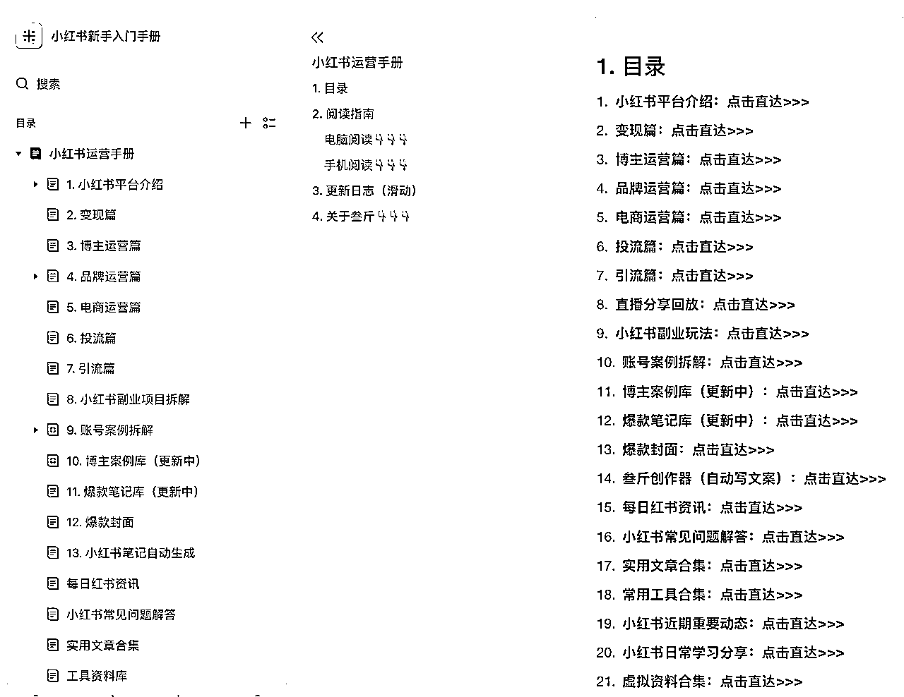

在今年之前，要原创出一份虚拟资料，难度还是有一些的，所以也没几个人去做这个。但是，今年 AI 的能力比去年强了10倍不止，要做出一份虚拟资料来，真的没什么难度。

比如，之前分享过的一个朋友圈文案生成器案例，就是用 AI + 飞书做出来的。后面讲到原创资料会写教程。

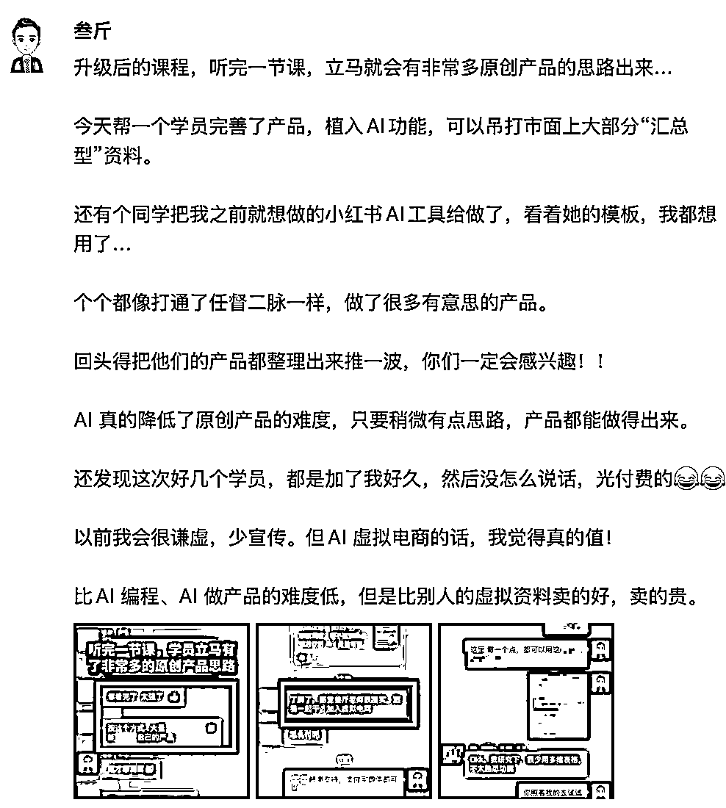

这次航海直播，也教了大家用 AI 原创产品的思路，后面我放一下笔记。

## 虚拟产品可以卖高价！

很多人看到的虚拟资料是1.9、5.9，最高9.9，我急的有个同学一天出了4单，GMV7.8……这做的多累啊……

为啥这么多人避雷虚拟资料，因为盗版资料卖的便宜不说，还有风险，这谁受得了。

原创资料就不一样，这个资料独一份，你可以卖更高一些。

大部分资料可以定到39以上，虽然不是真正意义上的高客单，但在虚拟电商行业，不算低的了。

再好一些的资料，可以买到199、399，我的一些资料就直接卖399，一样有不少成交。

## 虚拟电商可以复购！

虚拟资料并不是一次性生意，大部分都只是充当引流的载体，到了私域转化高客单。比如简历模板这些，到私域可以转化定制简历、职场相关的付费服务等等。

这里又分 2 个大类，原创资料和盗版资料。

盗版资料大部分做的是产品交付，就是我在你这买的只是产品，你后面卖什么东西与我无关。

原创资料做的都是信任交付，就是在这买的东西不仅是产品，还是对这个人能力的认可，尤其是在产品超预期交付的时候。

做信任交付的产品，后端转化高客单价的可能性更高。

比如我的资料，有一半的收入来自后端社群和私教服务。我一直很坚信一句话：服务好一小部分用户，你就能活得很滋润。（好像还有个1000个铁粉理论来着）

所以我的服务里有一项，只要购买了我的产品的，写个五星好评，就能得到我给她做的专属账号定位方案。

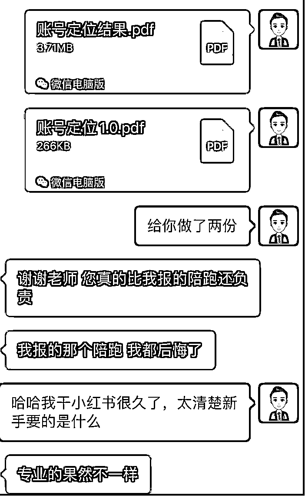

这个服务，我觉得很少人会提供，大家最多就是帮你看一下账号，而我可以直接做个账号定位方案。

服务好客户的过程，其实也是筛选客户的过程，你从这里能筛选出一些比较认可你的人。

我店铺销售额 5 万多，实际变现10万+，也就是说，我多做的这一些服务，间接带来了 5 万多的营收，比店铺销售额还多。

有一个博主，做了个产品叫「兔子宇宙」，她的社群还能解决一些产品、飞书相关的问题，服务做的也是不错的，至少我买了之后不会觉得亏，而且也很认可她的服务，以后她有什么新产品，我大概率还会购买。

所以我真觉得，虚拟电商严重被低估了。

以前也就算了，现在有了 AI ，我觉得这就是个近乎完美的项目，几乎没有成本，几乎没有售后，用户对产品的满意度还很高。

移动互联网时代有个 「人人都是产品经理」，但那会还是要有一些产品和开发基础。现在 AI 时代，是真正的「人人都是产品经理」，真正实现把你的想法，变成产品。

你可以用 AI 制作虚拟产品，也可以用 AI 开发一款软件。软件其实也属于虚拟产品的一类。

而你做虚拟电商，就不仅仅是卖虚拟资料，也可以是IP打造、私域导流和知识付费、服务付费等等。

「资料」只是其中一小块，一小块的载体。

# 为什么叁斤这么看好虚拟电商？

平台最近推出了“笔记分享文件”和“快捷售卖”两大功能，对于虚拟产品的引流和销售，真的方便了很多。

## 笔记分享文件：

发布笔记时，可以直接关联一份文件，用户看笔记可以直接点击文件链接，就能下载文件。

可作为免费资料引流的钩子。在资料文件中植入微信号，引导用户添加私域，此方法目前安全。

这有可能是平台在测试站内直接文件交付的雏形。

未来可能实现用户购买后直接发送文件，缩短交付链路。

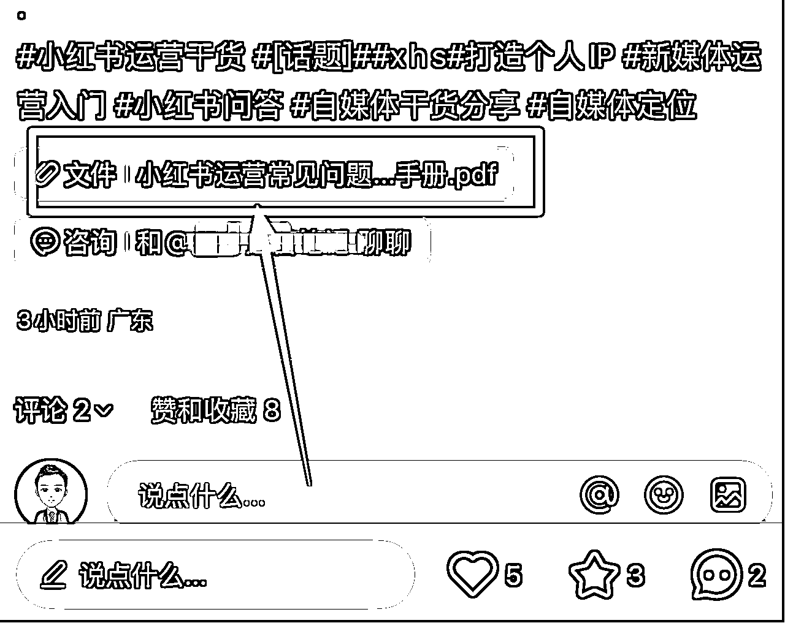

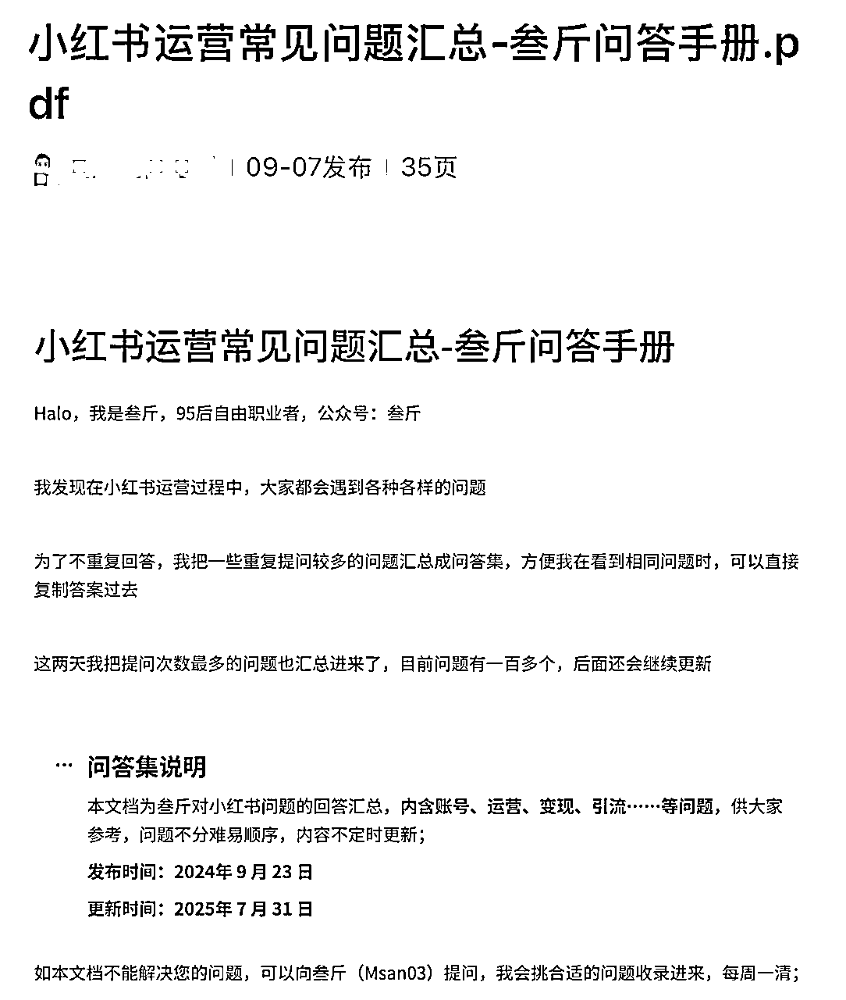

## 快捷售卖（小红书版闲鱼）：

小红书最近上新的功能，可以直接在小红书上卖你的闲置物品和虚拟产品，不需要开店！不需要开店！不需要开店！

这真的直接把虚拟产品的门槛降到极致，可以在不开店的情况下，验证某个虚拟产品在小红书是否有市场需求。如果有人下单，再决定是否开店。

当然，也有一些开通条件:

1.  账号注册时间 > 180天（老号）。

1.  完成个人专业号认证（实名认证）。

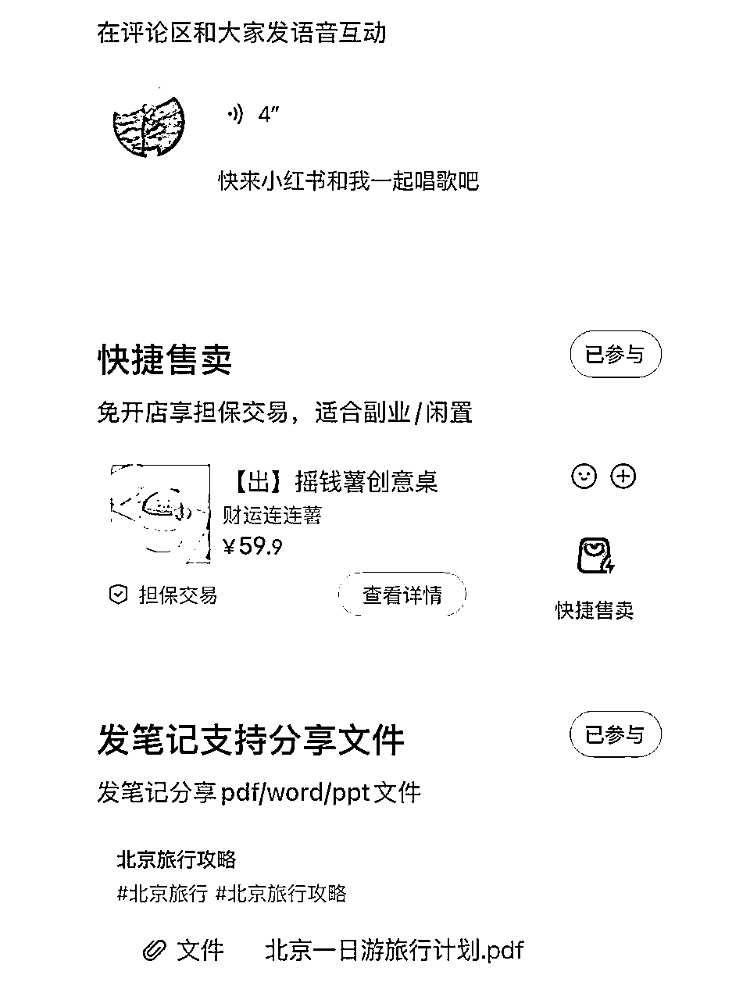

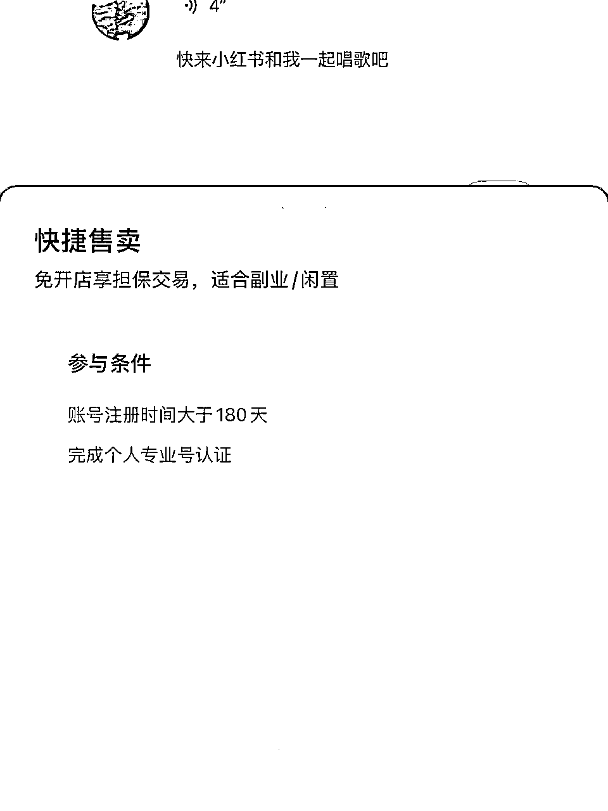

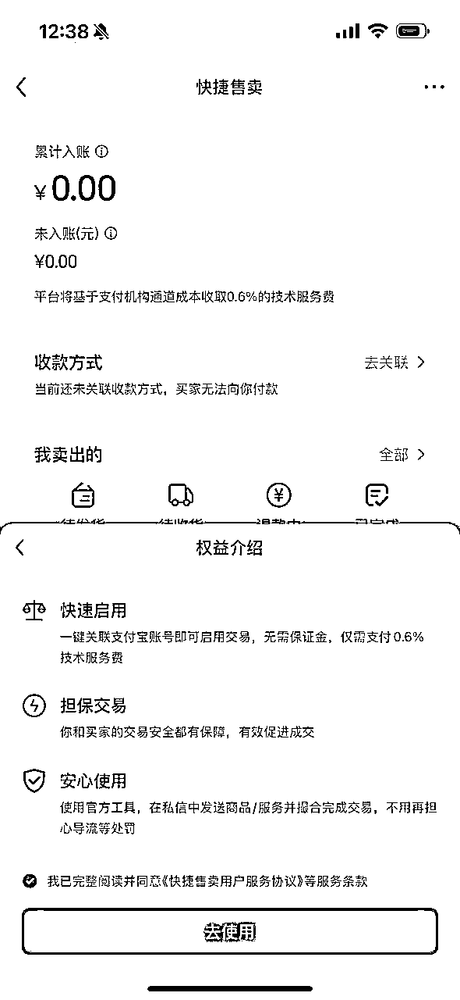

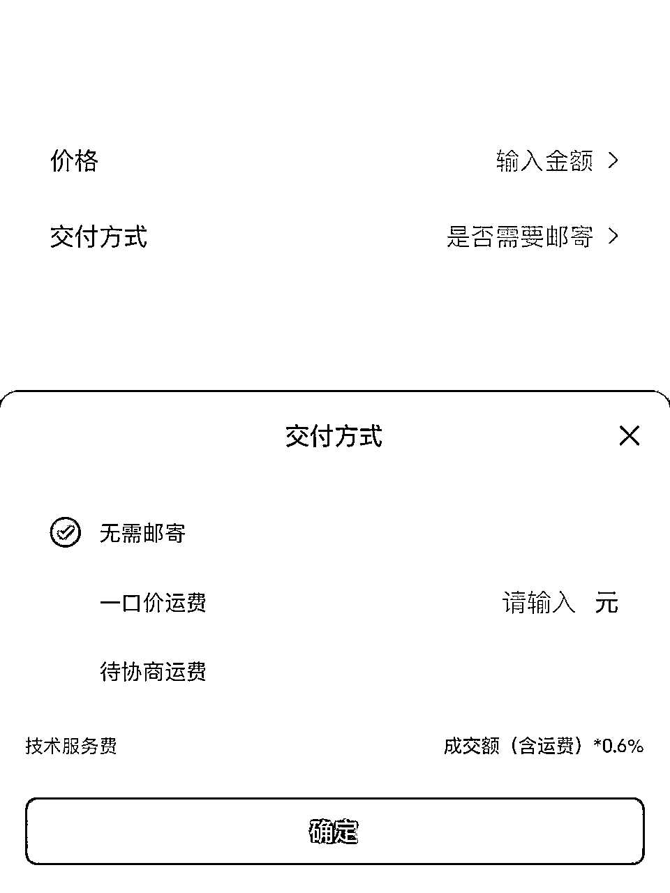

## 从更长的周期，看小红书的发展路径

我从2020年开始干小红书，平台虚拟类目的变化，大致可以分为以下四个阶段：

第一阶段：引流。

所有虚拟产品，知识付费，都只能靠引流到私域变现。现在还有人用着引流的路子，但是成交路径变长了。

第二阶段：专栏。

大约是2021年，小红书上了个「专栏」，可以卖知识付费作品。

但门槛很高，要万粉以上，扣点也高。不过，最起码在平台里有了个能直接交易的地方。

第三阶段：教育类目。

到2023年，小红书电商发展最快的一年，平台新增了教育类目。

这时候可以正常上架K12、TED这些资料了。但门槛还在，得有对应的教育资质。

第四阶段：全面开放。

就是今年，2025年。平台直接搞了个“电子资料包”类目。大部分虚拟资料，都能直接上架，再也不用擦边。

最关键的，几乎没门槛了，开个店就行。

发现了吗，平台一直在做一件事：规范交易，降低门槛。

它想把所有发生在私域的交易，都收回到平台内部来。

在这种时候，如果你认为虚拟资料只是k12、小学资料的话，那真的太狭隘了。这个阶段该做的，是利用 AI 快速整理虚拟产品，去解决用户问题，然后快速变现。

并且在这个阶段，利用虚拟资料，快速建立自己的 IP ，吸引你的精准用户。

# 提效模板赛道介绍、案例拆解

这一部分，主要针对这次「提效模板」航海，我发现，很多人都不知道什么事提效模板？

我的理解是，一切能帮助用户提升效率的工具、方法或系统都属于“提效模板”。常见的有，ppt模板、表格、简历……，还有很多小众但一样卖的很好的：快捷指令、苹果日历系统、人生管理系统、多维表格模板、AI工具……

比如以下：

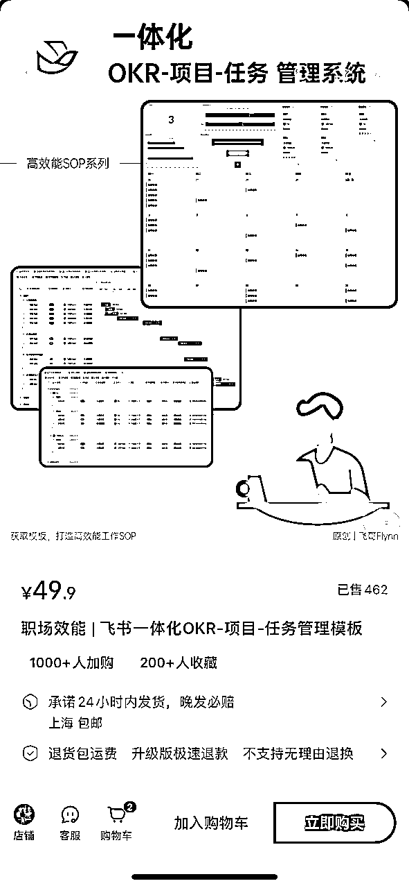

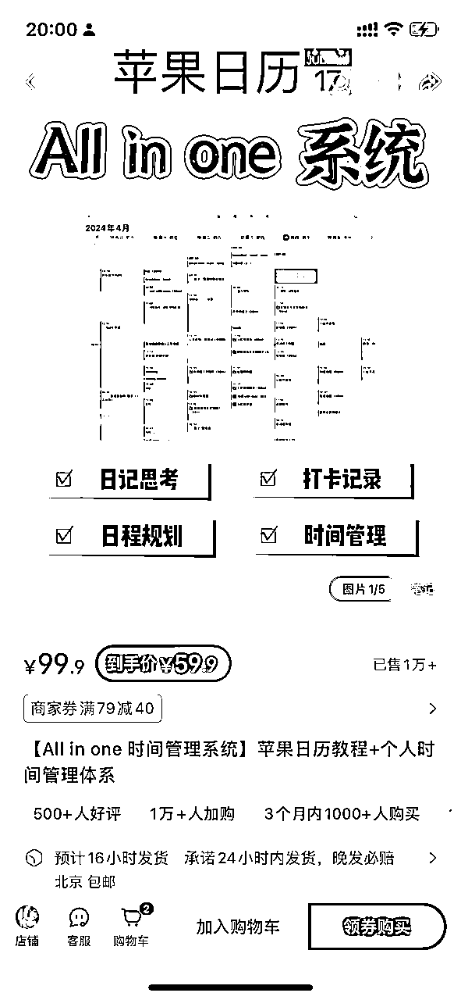

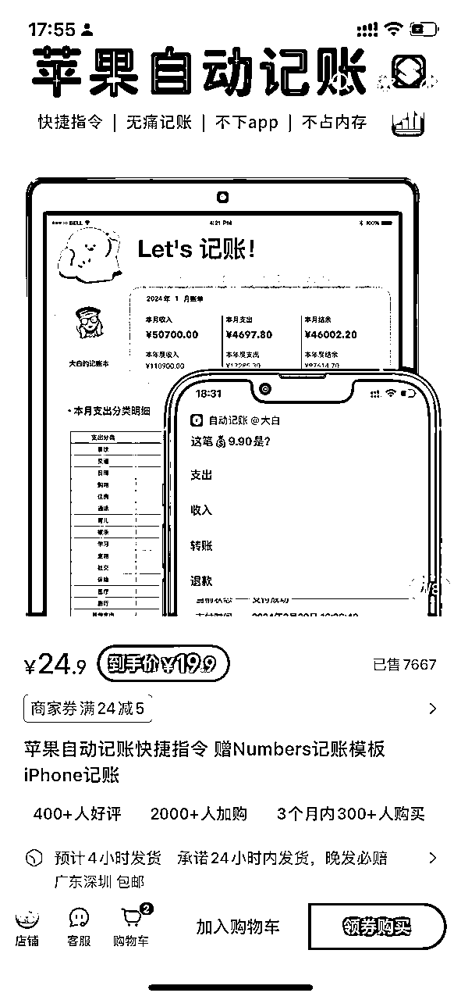

案例1：飞书OKR项目任务管理系统

在飞书内搭建的一套管理模板，利用飞书自带功能实现。售价近50元，已售400多份。客单价比较高，而且账号笔记更新频率低（一周甚至更久才更新一篇笔记），说明，小众原创产品的生命力更强一些。

案例2：苹果日历系统

这个是卖的比较久的爆款，销量过万。客单价也几十块钱，同样是小众、高需求的提效产品。

而且产品我买了，其实没啥，就是一套日历提效流程，甚至都不是什么资料、模板。

案例3：快捷指令记账

售价19.9元，销量7000+。

这个大家只要在小红书搜索“快捷指令自动记账”，会发现爆文来自大量不同的账号，说明这个细分领域没有绝对的头部，人人都有机会做爆。 即使是去年的产品，今年依然有新账号能做出爆文。

# 提效模板选品方法、实操演示

## 人群选品方法

关于选品，我真的有太多要聊得了。大部分渠道上能学到的选品方法，都是跟爆款，依赖灰豚、野马等数据工具，去搜寻和模仿已有的爆款。

这本质上没错，有句话叫「取法于上，仅得为中；取法于中，故为其下」，跟爆款，就非常容易陷入同质化竞争，永远在追赶别人。

也不是说这个方法不好，很好，容易出单，但一个品今天爆了，隔天立马10个店、100个店上同一个品，爆款生命周期被无限缩短。我觉得做起来太累。

我有一个非常独特的选品方式，我不选赛道，而是选「人群」，重心放到：解决特定人群的细分问题。

找到一个特定的人群，发现他们遇到的一个具体问题，然后创造一个产品来解决这个问题。 你的需求，很可能也是一群人的需求。

比如前几天我就有一个很大的需求，复制文字，调出快捷指令，自动采集到飞书。找了一圈，没有能解决需求的产品。后来没办法，只能自己想办法做出来。

做出来之后发现，其实很多人都有需求。虽然我的是融入在个人知识库，没打算对外售卖。但至少说明，这个需求别人是愿意付费的。

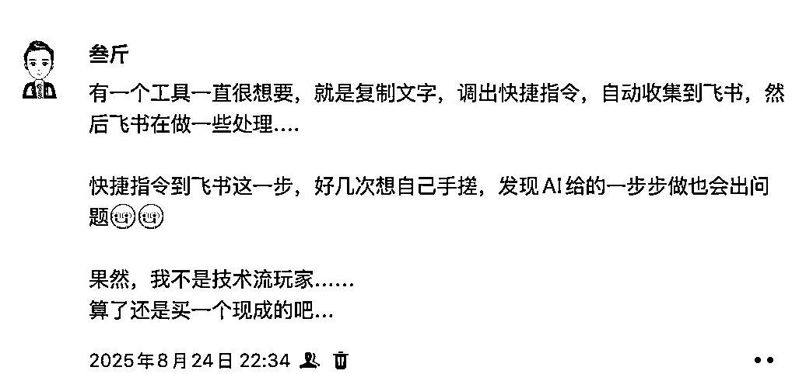

## AI 分析，解决具体人群在某个场景下的具体问题。

如果自己发掘不了需求，也可以利用 AI ，挖掘需求选品。

比如：

我直接问AI，我想小红书千帆数据看板不够直观的问题，并且问他能否做一个飞书多维表格，导入后台数据后，自动生成可视化仪表盘，并内置利润、成本等计算公式？

然后他就能给我一个方案。

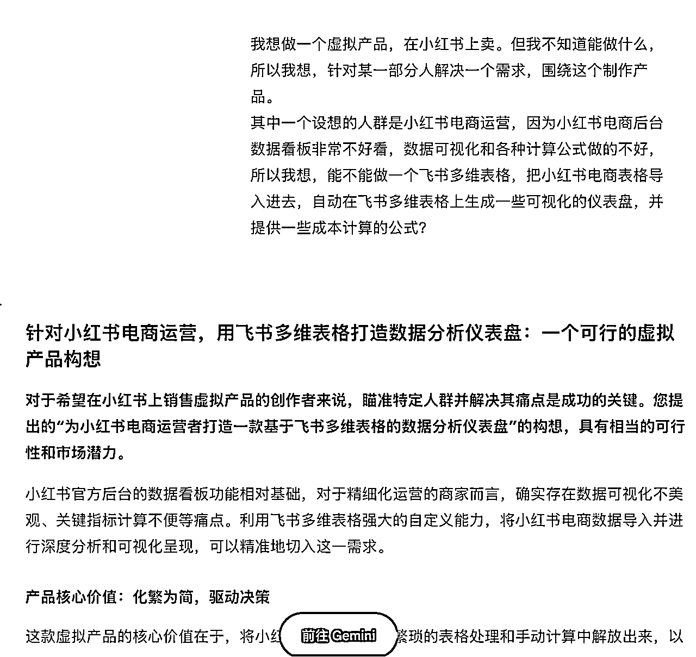

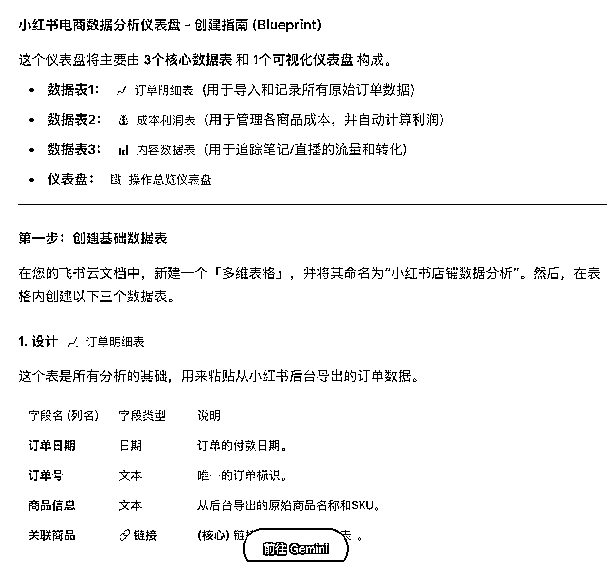

AI虽然不能直接生成文件，但给了我完整的搭建蓝图：

1.  需要哪些数据表。

1.  每个表的具体字段、字段类型。

1.  需要用到的计算公式。

1.  ……

我按照 AI 提供的结构，在飞书多维表格中手动设置表头、字段和公式。

成功制作出一个可以计算平台扣点、产品成本、运营提成、物流成本，并能按月度展示利润的可视化数据看板，远比官方后台强大。这个看板本身就是一个极具价值的原创虚拟产品。

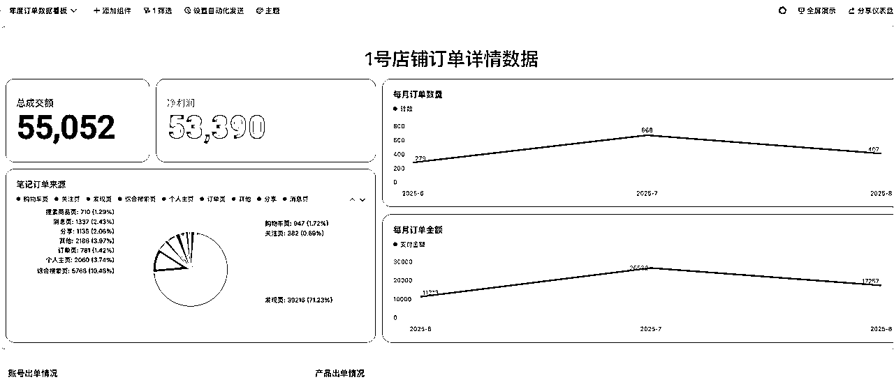

其实还能继续追问AI：“针对同一人群（小红书电商卖家），他们还有哪些具体场景下的需求？”

AI给的答案是：

*   内容创作: 小红书爆款选题库、文案创作SOP、高点击率封面模板包。

*   广告投放: 小红书付费投流（乘风计划）手册或课程。

*   私域运营: 私域引流与运营SOP资料包。

*   团队协作: 小红书电商团队专用飞书项目包。

*   信息服务: 小红书运营情报周刊、付费社群。

仅通过几轮与AI的对话，就能围绕一个精准人群，衍生出一整套可供售卖的虚拟产品矩阵。

# 开店、上架商品

关于这部分，不会写太多，可以直接访问“小红书电商学习中心”官网。

这里有官方发布的最新、最详细的开店流程、不同店铺类型的权益对比、保证金规则等，信息时效性最强。

开店流程和细节介绍：https://school.xiaohongshu.com/course/list?categoryNo=65dc5a0da905406b9a99182a88a29862&categorySource=HOME_NAV&entry=00020002&jumpFrom=ark

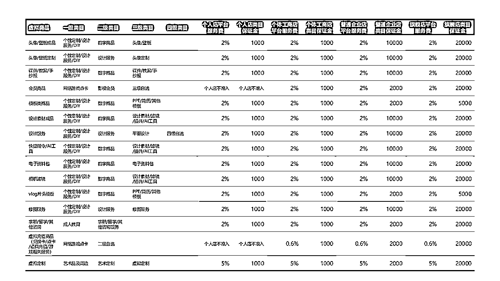

# 怎么原创虚拟产品？

其实前面选品方法里面，就有说怎么用 AI 做出产品来。它能帮你做选品，就一定能帮你做产品。

不同的产品，原创方法也不一样，这里我把之前写的「朋友圈文案生成器」教程放一下：

我是参考了一个地产行业的朋友圈文案模板，全年更新，150/年，卖了2700份，粗略算下来有40w+。

100 条朋友圈文案模板也卖 10 块钱，即使按最低 sku ，不升高客单，也卖了近 3万块钱。

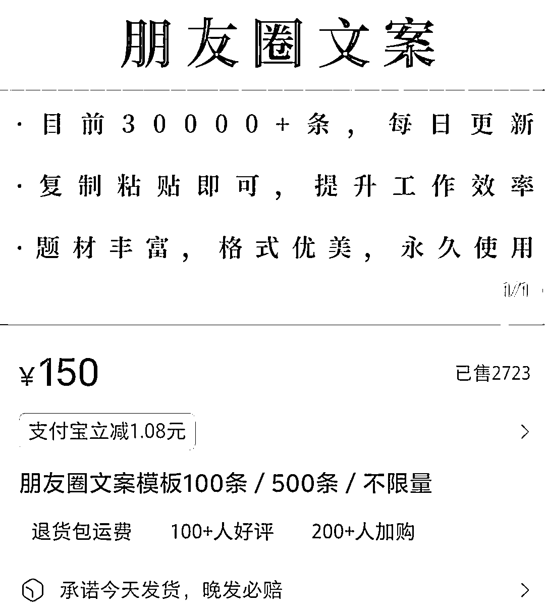

这个产品从有想法到完成，只花了不到10分钟！

给你们看看成品：

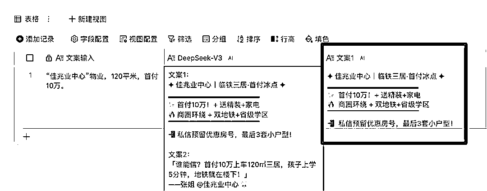

对标的只是朋友圈模板，是固定的，而我的能根据用户每一个产品情况，生成不一样的文案。

就是对标产品的升级版， 「地产文案生成器」 ，用户输入信息后，等待文案模板生成完成后，复制就能用了。

有这个表格，别说3万个朋友圈文案了，10 万个也没问题。

而且我测试了一下，发出去的视觉效果其实还不错：

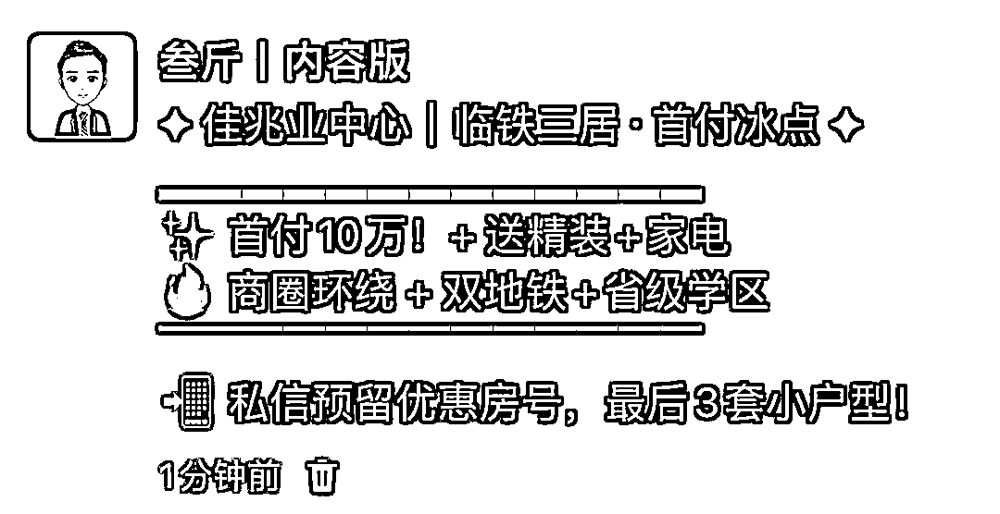

可以随时开拓美业、微商、银行等等不同行业的朋友圈文案模板，开拓新模板，对我来说难度为 0（只需要更改提示词）

相信关注我比较久的粉丝都知道，这个用的就是 飞书多维表格 + DeepSeek 的功能，之前分享过，这次更详细分析下如何搭建朋友圈文案生成器。

1\. 网页打开飞书，新建「多维表格」。

2\. 把新建表格中默认的列表删除掉。

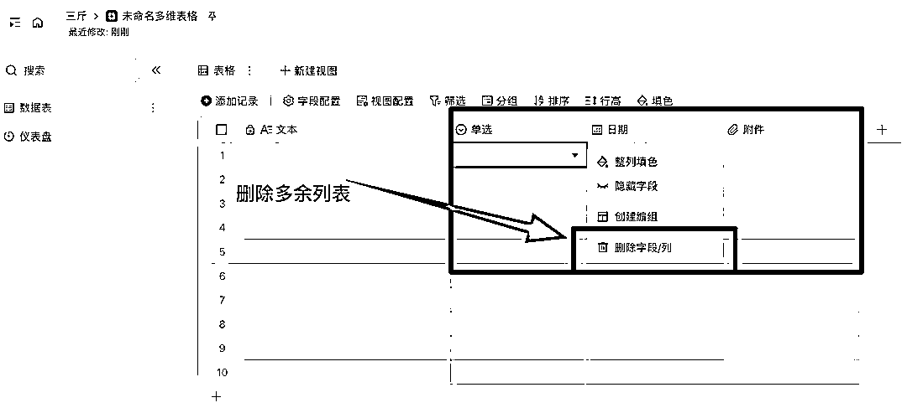

3\. 点击 + 号，新增列表。

4\. 新增「字段类型」，并且搜索，选择「DeepSeek R1」

关于DS 部分，有V3、R1和R1联网，我测试了一下，生成效果差距不大，直接用 V3 也可以，我习惯 R1。

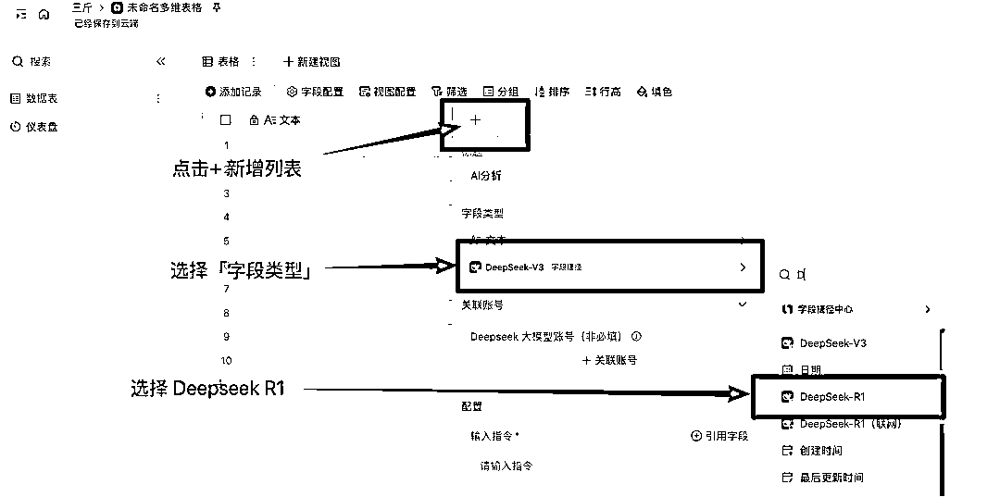

5\. 绑定 DeepSeek 大模型账号。

这里最好是绑定一下 API ，如果不绑定的话，可能用几次就不能用了。绑定后就可以按照消耗情况充值，费用很低。

这个自己去「火山引擎」上新增 DeepSeek 的 API ，新增后回来绑定就好。

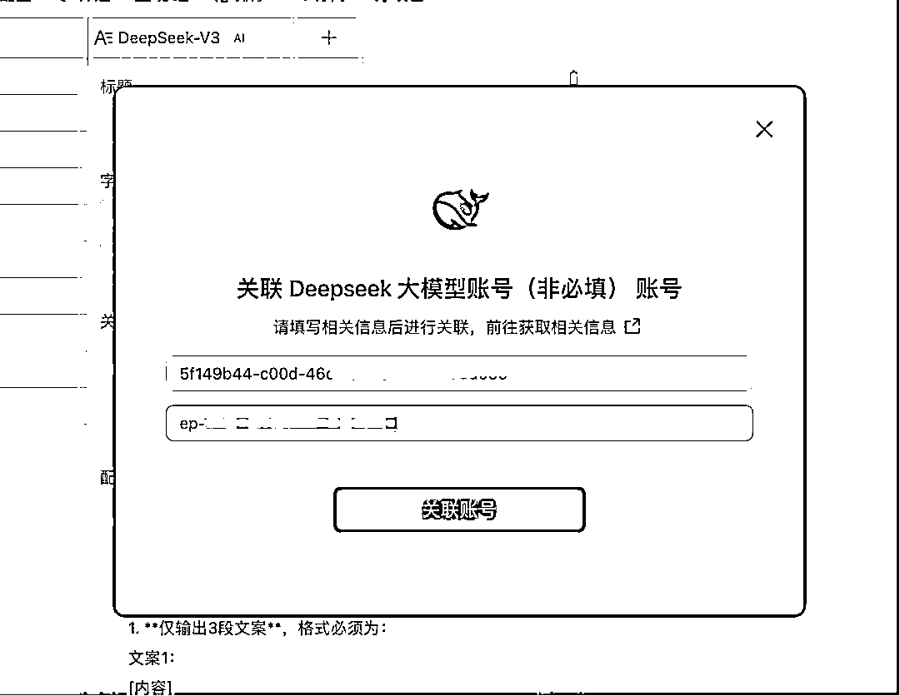

6\. 绑定后，在「输入指令」处，粘贴这一串提示词：

你是一个朋友圈排版专家，根据用户输入的房产信息，生成3种固定排版风格的朋友圈文案。规则：

1\. 仅输出3段文案 ，格式必须为：

文案1：

[内容]

文案2：

[内容]

文案3：

[内容]

2\. 所有文案需严格使用以下风格模板：

━━━━━━━━━━━━━━━━━━━━

文案1：符号分隔型

[装饰符号] 项目名称｜核心卖点 [装饰符号]

▂▂▂▂▂▂▂▂▂▂▂▂▂

✨ 首付[金额]！+ [利益点1]

🔥 [利益点2] + [利益点3]

▔▔▔▔▔▔▔▔▔▔▔▔▔

[行动号召] + [紧迫感提示]

文案2：客户证言型

「[真实感客户评价]」

——[客户称呼] @项目名称 🌟

▂▂▂ [面积]首付[金额]真相 ▂▂▂

✅ [生活场景1] ✅ [生活场景2]

💡 [情感化结论]

⏰ [限时福利]

文案3：悬念提问型

?? [吸引眼球的问题]？

▸ [选项1]

▸ [选项2]

───────────────

🌇 [悬疑答案提示] 👇

📱 [互动指令] + [符号]

━━━━━━━━━━━━━━━━━━━━

3\. 用户输入 ：

4\. 必须使用Unicode装饰符号（如▂▂▂/✨/🔥/▸）

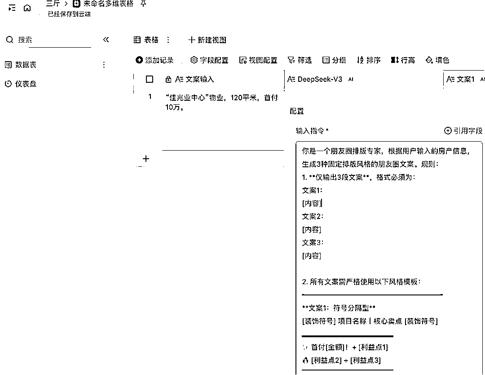

这个提示词可以根据不同行业，不同模板自行调整。

7\. 生成文案

只要在第一列输入信息，AI 就能自动写好 3 条不同风格的朋友圈文案

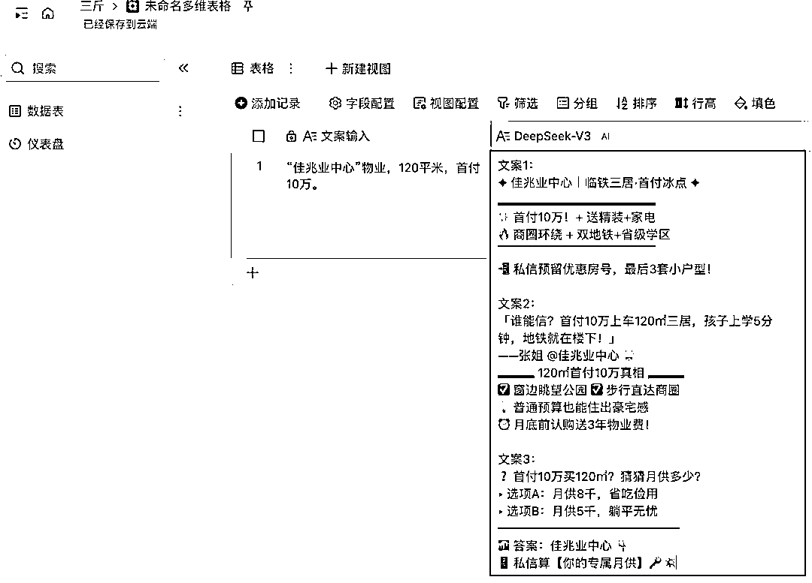

8\. 新增「信息提取」字段

AI 生成朋友圈文案后，再新增一列「信息提取」的字段。

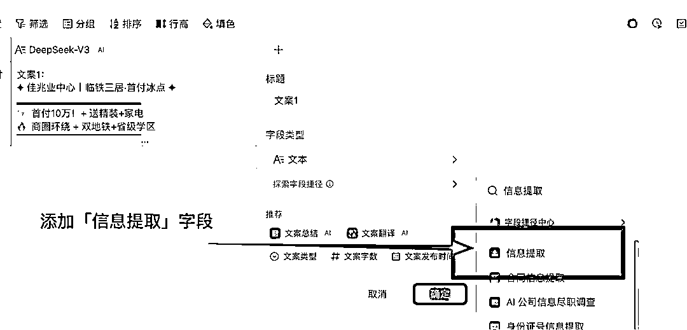

9\. AI 自动分类文案

自动把 3 条文案分离，用户觉得哪个写的不错，就复制去发布就行了。

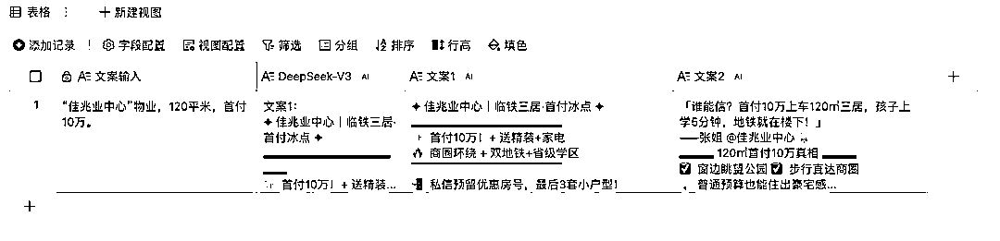

以上，整个表格搭建完成，需要更多文案模板，只需要在提示词上调整修改就行了。

要开拓其他行业的朋友圈文案，也可以直接在提示词上修改。

# Q&A精选

## 怎么做高客单价？

先说说现状吧。我看过太多人做虚拟资料，定价思路就是错的。

他们觉得虚拟产品嘛，成本低，所以价格也要低。结果就是大家都在9.9元、19.9元这个价位，累死累活也赚不到什么钱。

还有一些就是做的无版权资料，本身就接近于 0 成本，所以客单价也都是在几块钱这样。

我做的虚拟资料，大部分定价在39元，个别产品是399元，卖一个399元的产品，就抵过别人卖40个9.9元的产品，这个差距有多大？

所以我觉得，做虚拟资料要突破100万，第一个关键点就是要做高客单价的产品。那怎么做高客单价呢？其实也不难，关键是两点：

第一点，要找到具体的用户，解决他们生活、工作场景中的具体问题。

什么意思呢？就是不要做那种大而全的产品，要做小而精的解决方案。

举个例子，很多人喜欢做“大学生必备资料包”，然后定价9.9元。但是大学生这个群体太宽泛了，大一和大四的需求能一样吗？理工科和文科的需求能一样吗？

不如换个思路，专门做“大四学生求职简历模板”，针对的就是那些马上要找工作的大四学生，他们对简历的需求是刚需，而且很迫切。

这样的产品，你定价39元，甚至99元，只要产品能解决他们问题的，都愿意买。

第二点，要做原创产品，不要做搬运工。

现在太多人在卖盗版资料，这样做有两个问题：一是有版权风险，二是天花板不够高。你想想，盗版的东西，你能卖到高价吗？

但是原创资料就不一样了，你可以随便定价，而且价格一定比盗版的更高。

我有个学员，原来卖“考研资料包”，9.9元一份，一个月能赚小几千块。后来我建议她调整思路，只做“考研英语作文模板+批改服务”，把重点放到服务上，定价99元，现在一个月能赚过万。

前者是资料堆积，后者是解决问题。前者用户买了不一定用，后者用户买了马上就能用，而且还有后续服务。

所以，高客单价的核心逻辑就是：你的价值=你解决问题的程度×用户需求的迫切程度。

## 飞书多维表格作为模板售卖，如何防止盗版？

只要你做虚拟资料，就避不开盗版这个问题。只要你的产品卖得火，就一定会被盗。如果没被盗，那说明你还不够成功。

我有个学员，在闲鱼卖一个 9.9 元的产品，原本一个月能卖几千块钱。结果有几个同行买了她的产品，盗了她的图片和内容，挂了个6块钱的价格，现在甚至降到了3块钱。

盗版上架之后，她的销量从一个月几千块，直接降到了1000块，甚至几百块钱。

盗版虽然没办法完全遏制，但是可以在一定程度上预防。

第一：做服务型产品。

比如一对一咨询，这种产品没办法盗版，因为只有你自己能做交付。别人可以模仿你的咨询框架，但是没办法替代你本人提供咨询服务。

第二：做社群产品。

社群的价值在于连接和互动，这个也很难盗版。别人可以复制你的社群规则，但是没办法复制你的社群氛围和人脉资源。

第三：做持续更新的产品。

这种产品也会被盗，但是盗版者也有更新成本。所以在你做得很大之前，一般没人会持续盗版你的内容，因为成本太高了。

第四：做复合型产品。

就是资料+服务+社群的组合，这样可以大大增加盗版的难度。我的就是这样的产品，399的社群，有《小红书运营手册》 + 线上咨询服务 + 社群，这种组合，被完全盗版的概率比较低。

当然，还有一些防盗小技巧：

1.  在资料中加入你的个人品牌元素，比如水印、个人介绍等

1.  设置多层次的产品结构，不要把所有价值都放在一个产品里

1.  建立用户粘性和复购体系，让用户离不开你

完全防盗是不可能的，但是我们可以让盗版的成本高于盗版的收益。

## 怎么让用户复购？

现在大部分人做虚拟资料，都是一次性生意，用户买了一次就没有然后了。

但是你想想，如果一个用户只能给你贡献一次收入，你得不断地找新用户，那你的天花板能有多高？

所以，我们一定要想办法让用户复购。

复购有几种可能性：

第一种：单产品持续复购。

就是卖消耗型的产品，一个产品可以购买多次。比如卖AI工具的会员、账号积分之类的，用户用完了就需要再买。

第二种：单产品周期复购。

就是卖周期性付费产品，比如社群年度会员，一年结束后需要再次付费。

第三种：多产品矩阵。

针对同一个用户群体，卖他们需要的不同产品。比如，针对大四学生这个群体，他们需要简历模板、面试技巧、职场穿搭指南等等，你可以开发一系列相关产品。

第四种：升级客单价。

针对同一个用户，先卖低价产品建立信任，然后卖更高客单价的产品或者服务给他。

我采取的就是第四种策略。我针对小红书运营、小红书副业相关的用户，先卖对应的运营手册，如果用户有更强的连接需求，可以加入399元的付费社群，将来我还会推出私教产品。

这样下来，一个用户价值可能是几千元，而不是几十元。

复购策略的核心是什么？

1.  建立用户分层体系，不同层次的用户提供不同的产品

1.  设计产品升级路径，让用户有进阶的空间

1.  维护长期的用户关系，不要卖完就不管了

1.  持续创造新的价值，让用户觉得跟着你有收获

## 虚拟电商怎么放大？

分享虚拟资料放大100倍的6种打法。我觉得，只要选择其中一种，都能比你现在赚的多。

第 1 种：个人 IP 驱动

这是目前最有效的放大方式。在小红书、抖音、视频号持续输出专业内容，建立人设。这样引流来的粉丝，是最高质量的私域。

比如你做考研资料，不是直接卖资料，而是分享考研经验、学习方法、院校分析。用户因为你的专业度关注你，自然会买你的资料。

关键是一个 IP 可以承载多个产品线。

当你有了 1 万粉丝，可以卖考研资料、学习工具、一对一咨询，甚至开训练营。一个用户的终身价值可能是几千块。

但这个打法需要你有持续输出能力，而且要真的专业，虚假人设容易崩。

第 2 种：资料 + 群答疑

就是卖资料的时候，把用户拉到一个群里，让用户有问题在群里问，你来解答。

这样做的好处是，用户觉得买的不只是资料，还有后续的服务支持，付费意愿会更强。而且群里的讨论，会让资料的价值放大。

更重要的是，群也是你的私域。

你可以在群里推新产品，做活动。一个500人的群，就是500个精准用户。

这个打法的关键是，你要真的能解答用户的问题，而且要及时回复。如果群里没人管，很快就会变成死群。

还有最重要的，一定要控制舆论和差评，一旦群里发现产品相关的负面舆论，要及时纠正，把方向掰回来，并私聊对应用户，是出于什么情况发负面舆论？

该补偿的补偿，否则容易引起产品负面信息。

第 3 种：知识库

这个是把资料做成知识库的形式，用户付费后可以永久访问。比如做成飞书知识库。

好处是用户体验更好，查找更方便。而且你可以持续更新内容，增加用户粘性。

用户会觉得买的是一个持续更新的知识库，而不是一次性的资料。

这种模式特别适合那些需要经常查阅的工具类资料，比如我的《小红书运营手册》。

但是要注意，知识库的门槛比较高，需要一定的内容能力。内容要足够丰富，不然用户会觉得不值。

还有，知识库可以跟第 2 种社群答疑做结合，在知识库的基础上增加社群答疑服务，这样用户会觉得更值，客单价也能卖的更高一些。

第 4 种：免费引流 + 高价后端

这个打法最常见，就是用免费资料吸引用户，然后销售高价产品。

这里有 2 个点，首先是用户需求必须一致。

比如你做创业陪跑服务，就可以免费送《创业必备100个文档》，吸引创业者加你微信。但这些人还会需要创业指导、项目对接、资源整合。

你就可以顺势推出高价的创业陪跑服务。

假设一年能收 2 万。1000个免费用户，转化 10 个高价用户，就是10万收入，而且这个转化率不算高的。

但这个打法有个前提，你必须有能力做出真正高价值的后端产品。如果只想低质量交付割韭菜，那可能也做不长久。

而且免费吸引来的用户质量参差不齐，你要有很强的筛选和销转能力。

第二个是付费意愿。

你要确保这些人有付费能力。比如同样的资料，你是针对企业老板，还是个人用户？

一定是企业老板，只有他们才能付得起更高客单价的费用。

那对应赠送的资料，就一定是企业老板们需要用到的资料，而不是运营员工需要用到的。

很多人用免费资料引流就会有这个问题，明明目标是企业老板，却用一些员工用的运营sop去引流，吸引来的人都没有决策权，结果转化率肯定低。

第 5 种：矩阵化运营放大

这个是最常见的放大方式，就是做一个矩阵。

矩阵分几种，产品矩阵、内容矩阵、账号矩阵，我们一个个来。

1\. 产品矩阵

就是做同个类型的多个产品，比如你做职场资料，可以分成：简历制作、面试技巧、职场沟通、升职加薪等多个细分产品。

只要产品是同一个人群需要的，那就不算杂乱，一个用户还有可能多次复购，买多个产品。

2\. 内容矩阵

这个在之前讲获客的时候分享过，简单来说，就是多发内容。一个账号发还不够，还要做素人矩阵，做晒单笔记等等。

多找一些人，在店铺下单，并且发一篇晒单笔记，你提供内容给他们代发就行。

3\. 账号矩阵

这个就很好理解，多做几个账号。小红书有「账号关联」功能，一个账号开店，可以关联 3 个子账号。

每个账号都可以专注一个领域或者一个内容类型，但背后都是关联在同一个店铺。

你可以招团队，大量生产内容。一套成功爆款模式，复制到多个细分账号上。

如果一个人运营不来这么多账号，也可以招聘线上兼职帮你运营，只要设置好工资和提成就行，虚拟资料成本低，完全能覆盖掉这个成本。

第 6 种：乘风投流放大

最后，是很多人忽略的类型：乘风投放。

做虚拟资料，我是非常推荐投流的。为啥？因为边际成本极低，投产比贼高。

你只要有 3～5 条笔记转化率还可以的，拿去投流，就能支撑你50%以上的销量。如果你加大投放金额，甚至能支撑80%的销量。

而且，你的 ROI 只要大于 1 ，那就赚钱。哪怕投 100 块钱，只回了 101 ，你也赚 1 块钱。更何况，内容好的话，ROI 一般不会低于 2 。也就是消耗 100 块钱，至少能获得200销售额。

这比实体产品投流，划算太多了！

都不需要每天发多少条内容，只要有几条笔记投流转化率还可以的，就能一直投。

我能做到一个月大约有2～3万左右，除了有私域高客单，最关键的，就是我投流了。虽然投流金额并不多，但是 ROI 非常划算，还能撬动免费流量。