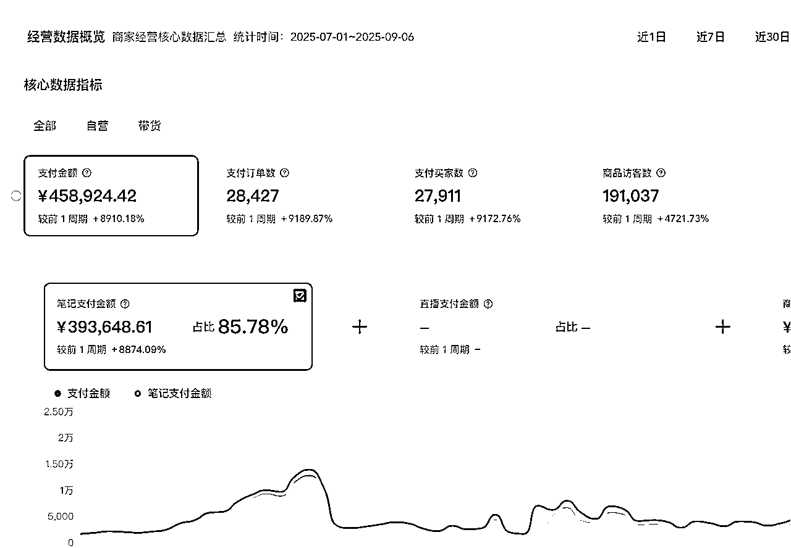
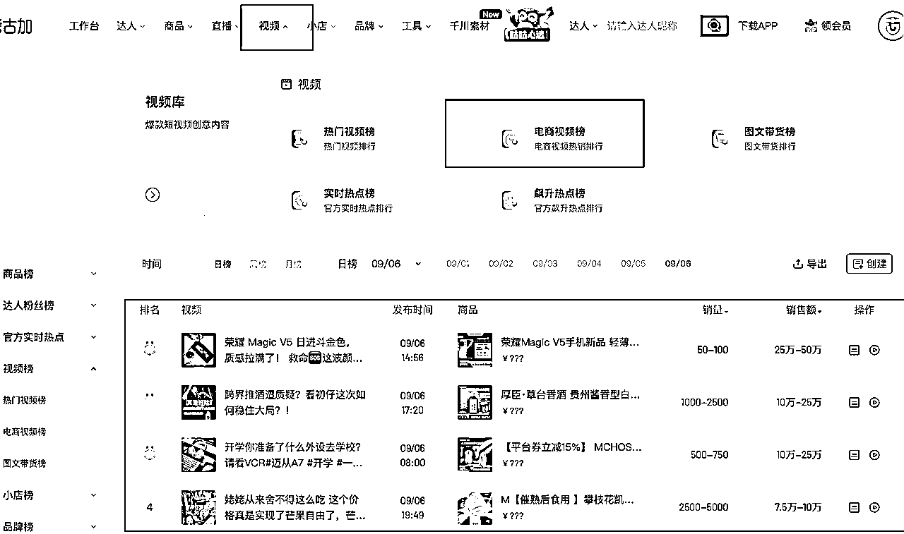
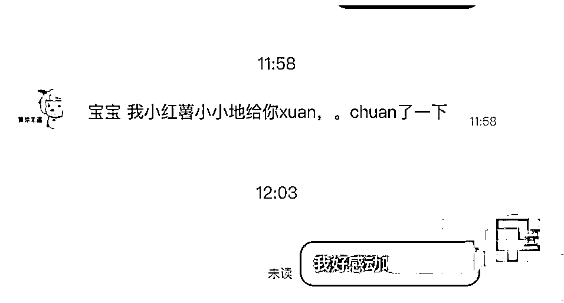

# 从0到单日爆单：我用2个月跑通小红书电商的选品、测品与AI提效全流程

> 来源：[https://sahxia8w0z4.feishu.cn/docx/D5LmdYXy9owAd4x3avwc53rLnAd](https://sahxia8w0z4.feishu.cn/docx/D5LmdYXy9owAd4x3avwc53rLnAd)

大家好，我是一只仙，加入生财已经1年啦，这一年参加了大大小小的航海，终于在小红书电商这个项目上，拿到了一点成绩。我是在今年3月份参加小红书航海项目，5月份正式投入小红书电商的，6月份开始陆陆续续出单，7月和8月两个月做到了45万的GMV，利润在50%以上，类目做到了行业第一。

这篇文章我会分享我是如何从一个从未接触过电商的小白，在两个月内快速学习并实操拿到成绩的。我将从两个大方面进行分享，一个是小红书技巧篇，一个是心态篇。

（先亮个成绩，马上进入正题～）

# 一、项目背景

我在今年3月份参加了小红书的航海，报名了两个项目，一个是油管，一个是小红书，在航海期间只把整个航海手册看了一遍，选了1个品，发了不到5篇笔记，结果可想而知，一单都没出。

但是！请大家不要小看21天的航海！这次航海给我心里埋了一颗种子，尽管没有出单。

航海结束后，经过复盘和思考，我发现我对这个项目是很有兴趣的，所以在最后一天，我链接到了航海中的教练小茗姐和刀姐，正式开启我的小红书电商之旅。

重点：参加航海，判断自己对项目的意愿度，要想更快速拿到成绩，去找到这个领域的高手，付费并认真对待高手总结出来的经验

之前我是一个觉得可以靠自己摸索就不会寻找帮助的人，现在觉得付费可以让大佬带自己少走弯路少花时间，这笔投资太划算了。

# 二、技巧篇

很多人都知道选品定生死，但是我想说：

选品只是第一步，后面的运营细节才是决定能不能爆单的关键点！

同样的品，有人卖得好，有人就是卖不出去。

拿我的情况举例子，在我在卖出1万单的时候，看到有人抄了我的笔记和产品图，但就算是直接拿来我的品和图，依旧卖不动。

下面我会展开选品、测品、笔记等内容，其中涉及到一些比较关键的细节技巧的分享。

## 2.1 选品技巧

### 2.1.1、小白启动电商第一步：确定品类和品

电商的品类非常多，小白一开始什么品都想试试，选到最后一头雾水，推荐大家两个个办法。

第1️⃣：可以去抖音考古家app或者淘宝看看电商大概有哪些类目，每个类目下有什么品，判断一下自己对哪些类目或者哪个品感兴趣，前期确定下来两个类目即可。

然后到小红书搜一下，感兴趣的这个类目或者品，在小红书有没有人卖得好的。

第2️⃣：学会踩在巨人的肩膀上！

准备一个小号，用来关注同行，等你关注的同行足够多，只要一点开小号，就是一个热乎乎的选品库（俗称跟品），我有很多出单的品都是靠这个方法挖到的。

## 2.2 测品

### 2.2.1 有效测品

选完品，下一步就是测品了，但在正式测品（发笔记）之前，我们需要判断选出来的品是不是适合在小红书测？是不是适合自己测？俗称【有效测品】。

#### 2.2.1.1 什么叫做适合在小红书测？

选品方法有如上面我提到的小红书站内选品，也有通过其他平台的一些选品方法，比如抖音选品。但一个品在其他平台卖爆了，不一定可以在小红书卖爆，这就要考虑到小红书的用户群体了。

目前小红书的用户群体还是以一二线城市的女性为主，年纪偏年轻化。

判断步骤分为两步🌟

🌟第一步：查看考古家的【电商视频】【近30天】销量排行榜，选出自己感兴趣的近期热销品

🌟第二步：判断是否适合在小红书测，判断依据可参考这个标准

1.  粉丝数量，最好是小于1000粉

1.  商品销量，销量大于200单

1.  看爆文笔记时间，近一个月发布

抖音有一些车载产品卖得很好，但是在小红书上就卖不动，这是品和平台调性不匹配的例子，所以这一步很关键。

#### 2.2.1.2 什么叫做适合自己测？

每个人的特点是不一样的，我们需要判断品的笔记拍摄方式对自己来说是否有难度，比如男生如果想卖头饰产品，场景上难以复刻，审美上难以共情，这就超出个人能力范畴了，建议换品。

还是要说明一下，这种情况也不是不能做

我想表达的是：如果有两个品，一个是自己很感兴趣也很了解的爆品A，一个是自己不感兴趣也不了解的爆品B，优先选A，但如果没有遇到A，那就先选B，毕竟A没出现呢。它是一个优先级问题，不是限制。

到这一步，品才算是真正选完了，继续下一步。

很多人都想掌握选品，但是我想说：会选品不如会测品，品是要测的！！！

### 2.2.2 开始测品

测品：通过发笔记，来判断品和笔记在平台上的数据表现

#### 2.2.2.1 如何有效发笔记？

让大家头疼的事情就是：笔记到底要怎么发啊！为什么我的笔记没人看啊？！小红书是不是针对我啊？（我也经历过这种状态）

大家不妨换个角度想想：为什么同行的笔记这么多人看啊！

很多时候我们都不愿意模仿同行，但是呢，根据我这一年的项目经验，得出的结论就是，除非你天赋异禀、天资聪颖、幸运女神眷顾，不然一开始就老老实实虚心向同行学习，而且模仿一定要到位！！

我这次爆的品是实拍品，所以主要跟大家分享实拍品的笔记制作。

当确定好要测的品后，需要做以下两件事情

1.  确定模仿的爆款内容，时间锁定在近30天内发布

1.  模仿（实拍+二创）

补充一下：笔记发布时间太长，再爆的概率不高（也不是说完全不可能），但我们的每一个步骤，就是要让成功的概率更大一点，更快一点。

#### 2.2.2.2 如何有效模仿

搜集完笔记，我们需要拆解一下笔记的封面、标题、正文、笔记最后两张图片、评论区。

小红书是瀑布流模式，封面和标题极其重要，封面最好是像素级模仿，别人怎么拍，我们也怎么拍

模仿一段时间，对品和内容开始有体感之后，可以从100%模仿，到逐渐融入自己的创新，当测出来自己某个创新封面数据变好之后，就可以大胆的发挥自己的想象力了。

大家不要小看模仿，其实后续的很多创新，都是从最开始的模仿产生的体感开始的。

标题和正文，我一般是用GPT或者deepseek改写的同行爆款，和封面同样的，在大量的模仿后，也可以增加一些自己的创新

笔记的最后两张图，是影响转化的很重要的因素，这个也是我跟同行学到的，也是一个很关键的细节，一般可以增加一些商品评价截图，增加一下用户信任感。

评论区干预也很重要，更多的评价会带动笔记的流量，干预的方法有很多，最方便的就是直接抄同行。

同行怎么评价，我们也怎么评价。我一开始会收集同行的高赞评论到备忘录，当笔记跑到500小眼睛，就可以去发布一些验证过的高赞评论。

在前期测品阶段，我的图文笔记小眼睛其实都没有超过100，但是仍然会有偶尔的出单。

所以想告诉大家，如果是选择图文笔记，前期不用着急，每天每周不断优化你的笔记，研究同行优秀的笔记，小眼睛是自然而然的事情，完全不需要焦虑。

#### 2.2.2.3 思考账号的人群定位

为什么需要思考人群定位？

是因为人群定位影响关键词，关键词可以让搜索流更加精准，实现100个小眼睛也能出单的快乐。

我后来在复盘为什么可以超越同行，成为类目第一的一个很关键的因素，就是我会思考账号的人群定位，然后优化笔记标题、正文和关键词，这也是我转化率高达15%的原因。

#### 2.2.2.4 数据复盘

测品阶段，笔记是重点，复盘也很重要。

一开始我选了7个品，基本上都出单了，但也因为选的品太多，我陷入了无法聚焦时间和精力的困境，那我是如何解决这个卡点的呢？

两个字：复盘！

我会进行一周一次的数据复盘，来判断品在这一周的销量等数据表现，以及市场情况，这些数据可以帮我决策要把精力放在哪个品上。

前期没有正反馈时，通过复盘，我可以了解我的动作有没有变形，整体方向是不是对的，心态都好了不少。

我这次卖了近3万多单的品，前期没太重视，直到有一天，我刷到同行比我晚发笔记，但已经卖了2000多单（我当时不到100单）！我当时非常懊悔，感觉自己要与爆单擦肩而过了。我赶紧咨询了一下老师，然后决定把大部分精力放在这个品上。

我不再漫无目的的测品，启动了我的每周复盘计划。

复盘的内容包括了：每个品发布的笔记数，出单数据，访客数据，优化动作，提升技能，心态，卡点；复盘的内容要根据自己的项目实际情况进行调整，我会把自己觉得最重要的数据都放在我的复盘模板中。

也因为复盘，我知道我之前的笔记数量远远不够，数了一下才发现，同行一天发8条，而当时的我一天最多4条，赶紧追赶上来，从一天4条慢慢增加到一天9条甚至18条（这里涉及到提效技能，在2.3会展开）。

复盘会让我们的关注点从【结果】转变成【进步的过程】

## 2.3 提效

提效是跑通0-1后放大结果的关键步骤。

我从前期发布一篇笔记1小时到现在10篇笔记1小时，诀窍就是用ai工作流和工作流程化。

### 2.3.1 ai工作流

用到的工具是deepseek+飞书多维表格

工作流处理好之后，只需要先在飞书上把模板搭建好，准备好原文，一键就可以生成几十篇文案

（不过后来那个工作流的点数用完了之后，我就用gpt了，虽然没有工作流那么方便，但依然很方便了，9月份报名了n8n航海，争取学习更多的ai提效小技能，此前的工作流是刀姐提供的，我只是改了一些节点，不算真正学会自己搭建工作流。）

如果大家是自己用ai改写文案的话，提示词最好包括背景、角色和要求

比如告诉ai是做小红书电商什么品类的？ai是个什么角色？（比如小红书电商文案专家，精通xxx），要求是什么？（比如重复度？字数要求？保留xx关键词？），最后根据生成情况不断优化，直到满意为止。

很多ai技能得益于我之前在学习油管的时候，顺带学习了一些ai技能，你看，就算做的项目一开始没有赚到钱，但是学到的东西就是我们自己的，技能是可以迁移的，所以大家一定要认真对待每次航海，当作一次学习的好机会

提效的前提🌟

知道什么样的内容是可以让ai帮助我们生成的，所以还是想强调一下，在没有跑通之前，不着急提效。先老老实实测封面、标题、正文，去感受哪些是好的内容，这个过程很重要，是培养品感、内容感的必经之路。

当开始意识到，某些内容方向是更可能吸引用户之后，就可以让自己速度加快了。

### 2.3.2 工作流程化

工作流程化，是为了减少决策次数，每一次决策，都是有精力和时间成本的。

我的做法是，每周统一一个时间拍摄素材，改写文案，每天统一时间制作笔记。好处就是我在固定的时间内，只需要高效的完成一件事情，效率极高。

## 2.4 不要怕售后！

很多小伙伴第一次遇到大量售后会很慌张，但在我看来，售后往往藏着一些【机会】。就像我们平时做项目一样，很多困难一旦得到解决，我们的能力和认知就会往前迈一大步。

我也经历过负反馈，经历过限流，经历过供应商品质问题，经历过一堆的差评

在我经历第一次爆发阶段，供应商发错货了，导致客户收到的品和我实拍的品不一致，而且质量更差

当时我的做法是

1.  换供应商

1.  安抚客户

安抚客户，不是道歉！要站在客户的角度思考解决方案。

当时我的做法是，告诉客户这个是隐藏款且不售卖，会再补发一个新的，喜获不少好评。

另外我会主动联系给了差评或退货的用户，收集品的问题，反馈给供应商，让供应商和我们一起进步（供应商一定不是我们的对立面）

要把客户和供应商当作我们进步的垫脚石，而不是对立面，一些负面评价也许是我们的机会点。

（这个客户是原本发了负面晒单的客户，后面改成帮忙宣传了）

# 三、心态篇

## 3.1 学习阶段

在最开始学习小红书电商的时候，我越看对标越兴奋，原来粉丝这么少就能卖这么多单，开始盲目自信，对很多选品的原则性要求选择性忽视

这里很想和大家说，学习阶段真的不要急，就给自己一段时间，扎扎实实的去享受新知识带来的冲击感，去享受学习的乐趣，基础打牢了，爆发性才会强。

## 3.2 前期实操阶段：迷茫、困惑

学习完成了，也发了几篇笔记，看到数据开始陷入怀疑，怎么发出来的笔记就那么几个人看？

这时候自信心又跌到地上了，开始怀疑自己，这种状态，我相信很多小伙伴和我一样都经历过，我的办法是，先让自己停下来，然后去看那些经历过这种状态但最后成功的人。

让自己停下来，是因为状态不好的时候，动作容易变形。

我印象最深刻的一次心态崩塌，是看到比我晚发的同行比我多卖了2000单。在当时的状态下，我没有选择继续测品发笔记，而是给自己3天的时候恢复心力

这3天里面，我没有发笔记、没有看品、没有想小红书，我将自己脱离出来，去感受生活，去找一家很远但很好吃的小店享受美食，去寺庙走了一圈，给家里做了大扫除，给猫猫洗澡，第三天，我觉得自己的心力恢复过来了，重新开始。

在没有正反馈的日子里，我还会看刀姐的公众号文章，文章里面有很多从0开始的小伙伴，期间也遇到和我类似的问题，但最后她们都跨过去了。现在我也会把自己的项目过程分享在自己的公众号上，包括这次分享到生财上，就是希望像我之前一样没有拿到结果的小伙伴，相信自己。

## 3.2 爆单后的痛点：节奏感被打乱

当单量越来越多，客服工作让自己的状态又不对了，没有节奏感

我在某一天下定决心，花钱请客服！这是我爆单后花的最值的一笔钱，因为中间我又经历了负反馈限流，如果没有客服同事的支撑，我觉得我不一定有心力可以熬过负反馈的那段时间。

花钱买他人的时间，我觉得我在商业世界里又前进了一小步。

还有就是我在上面提到的工作流程化，流程不是一开始就很完美，随着项目进度的发展，我们需要优化流程，结合复盘，行成【复盘-优化流程-进步】，这个正向循环，会让我们的状态越来越好。

# 四、总结篇（附上一些圈友的疑问）

#### 1、我做的是什么类目？

我爆的类目是玩具类。

#### 2、我是如何一步步做到45万的？

a、跟品，多看同行在卖的品，看到适合自己且近期在爆的品立马跟

b、测品，测品的频率，我会结合同行的数据情况进行调整，一般10条笔记还没有出单或者单量很少，我就会换品，如果近期确实在大爆，可能会增加到15-20条。

测品阶段结合数据复盘，调整测品节奏，逐渐找到适合自己的品。

c、发笔记，选定品之后，我的笔记数量会逐步增加，前期一天可能5条笔记，到中间一个号9条笔记，再到现在三个号一天25条笔记左右。

发笔记过程中要主动打造评论区，重点在于提高信任度，进而提高转化率

发笔记过程中要不断优化笔记关键词，提高人群精准度

笔记内容要尽量贴合目标人群的使用场景，提高代入感

d、当订单量超过5000之后，我开始增加笔记数量和加上乘风

笔记数量目前是三个号一起发，主号一天发9-10条，两个子账号总共15条左右

乘风是我在看生财直播的时候，听到坤汀说，只要算好ROI，可以把乘风开到最猛，我才意识到，也许我该投流了。事实证明投流真的可以让销量翻好几倍！

e、现在基本上销量都比较稳定，只需要执行【发笔记—每周复盘—优化（关键词、笔记内容）】

#### 3、到底是混剪好还是实拍好？

没有好坏之分，适合自己最重要，混剪也可以卖得很好很好（同行数据是最好的证明）

如果前期只看到混剪的品，那就跟着混剪，我实拍是因为我跟的品刚好是实拍的，再加上我之前混剪的技能不够熟练，效率没有实拍高。

总的来说，品更重要，混剪和实拍只是把品推出去的工具而已。

#### 4、你觉得小红书电商是一个长期的项目吗？

我觉得至少3年内都可以赚到钱，但是不敢保证能不能长期，小红书的平台也一直在变动

今年很明显，小红书想大力扶持电商商家（100万免5%费用，市集入口的变动）

#### 5、您怎么样复盘的，复盘哪些数据，怎么样根据反馈做出优化调整？

复盘包括数据情况和笔记情况；

a、数据情况：1️⃣销量+2️⃣访客+3️⃣转化率+4️⃣市场情况（有无近期新起来的品）

b、笔记情况

查看本周出单的笔记和市场的笔记，得出下周要发的笔记内容（标题、内容、关键词）

#### 6、您做的是什么赛道，每周是怎么样进行实拍的？

玩具赛道

因为我在上班，每周固定周日拍摄，大概拍个1-2小时，就够一周的笔记了

#### 7、介绍一下工作流及对应工具

上面提到的工作流，是Deepseek+飞书，可以学习下n8n的航海手册，感觉自己搭建也不难，我是付费买的。

目前用到的工具有：飞书多维表格+GPT

#### 8、上面提到的老师

可以通过小红书航海手册就可以看到啦，小刀和小茗，需要链接的话找鱼丸。

以上就算是我实操三个月来的一些小小经验和心得吧，希望我们都会变得更好，成为更棒的自己。

最后还想告诉大家，不管你经历多久的不出单，不管你参加了多少次航海都没有找到属于自己的项目，别担心，享受过程，享受每次的一点点进步，每次航海结束一定要复盘自己学到了什么，然后你只要继续相信自己，有一天你就一定可以找到的。

总结就是：相信航海！相信自己！并且知道自己在进步！！