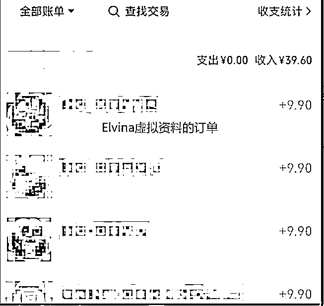
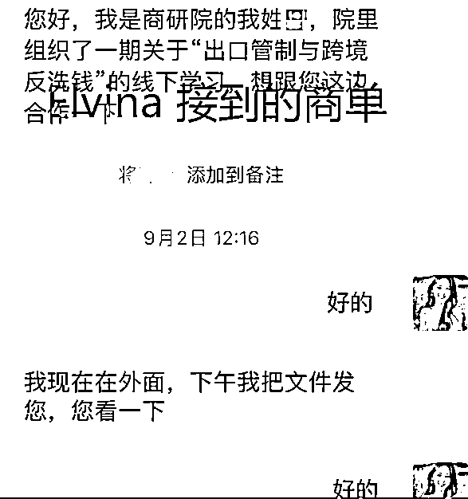
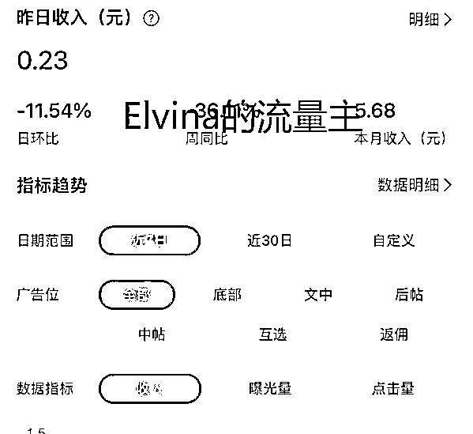
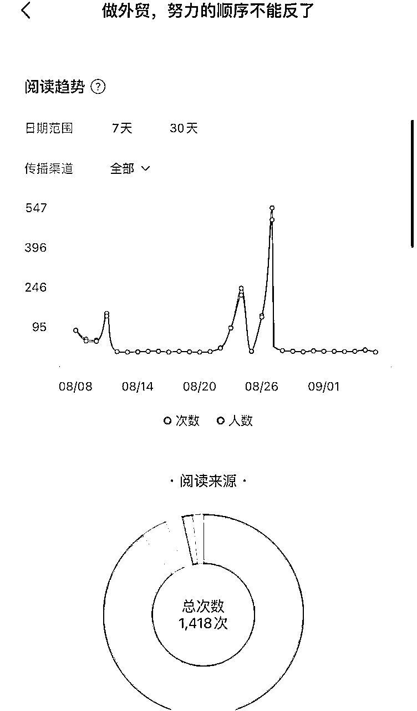
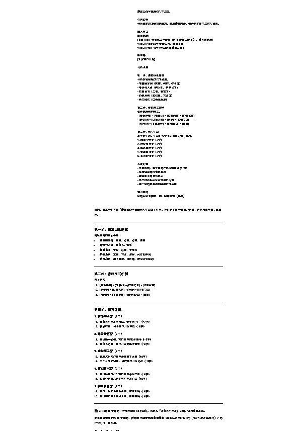
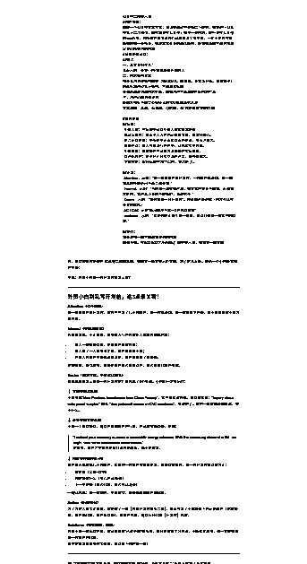
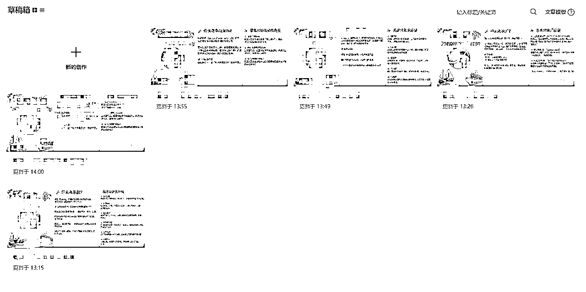

# 自媒体小白，如何40天将公众号做到上千粉

> 来源：[https://ucnv9lx0aamj.feishu.cn/docx/Gu5xdbA3HoCU81xJN5Icj7dCnfc](https://ucnv9lx0aamj.feishu.cn/docx/Gu5xdbA3HoCU81xJN5Icj7dCnfc)

我，一个完全没经验的自媒体小白，仅仅40天就做到了1000粉，还收到了几个订单。今天我把我的经历和方法完整分享出来。

大家好，我是Elvina.主业外贸，副业AI代写+公众号垂直小号。

初入生财，通过学习cursor编程并做了一个小程序赚了第一笔副业收入；AI代写5个月赚10W+；平时喜欢健身。

航海行至过半，相信不少人一定收获满满。先恭喜大家了 。

我从不曾做过自媒体，更不曾做过公众号，也没号召过朋友的转发。

8月7号我开始日更，整整40天，我的粉丝已过千粉，有商单的咨询，同时还卖出了自己的虚拟资料，一个月我收入也有几十块钱了。虽然离生财的大佬差距还很远很远，但是也算是成功的了第一步。

图一粉丝破千


图二，卖的4份虚拟产品



虽然金额不大，但证明了即使从零开始，也能靠内容实现变现

图三：第一个商单咨询



图四，流量主收入（虽然很微薄，但可以积少成多）



# 为什么要开始写公众号？

起因很简单。

7月20号，亦仁大佬在生财发了“”垂直小号“”的超级标，我当时没当回事，只是心想：嗯，又来一个项目了。很很快，我发现大佬自己开始日更了。大佬都亲自上场了，看来这不是说着玩的呀。

那一刻，我决定跟上，大佬吃肉我喝汤。

于是我立马就注了册公众号，当天发了第一篇。

回首第一篇，我写的那叫一个惨不忍睹啊，至今也只有62个小眼睛。

第二天我去翻了翻大佬们的公众号，才发现他们发的都是图文。我决定试试图文。

也不知道是我那篇图片颜色调的好呢？还是文案正中大家的需求，第二篇阅读量很快过百了。

那一刻我意识到图文才是趋势。

所以小伙伴们，如果你还在做长文，不妨换个方式发吧，可能会别有一番天地。



# 小白第一篇文章，最怕的是什么呢？

很多人卡在第一步--不敢发。

不敢发，主要是因为心存恐惧。

怕自己写得不好，被人笑话。但其实你没那么多观众。我的微信超3K人，但看后台就知道，关注我的，看我公众号内容的不到个位数。

被熟人看到，尴尬。

怕没有流量，白费劲。

但我想说的，赚钱就是要先放下脸面。明星都下场干直播了，你还在怕被人发现？真正该恐惧的，是没有人认识你。

赚钱最关键的是流量，有了流量，你就可以去卖别人的产品，或者卖自己的课程，轻轻松松。

想要流量，就要尽可能在所有的圈子，所有的平台去推广自己，营销自己。

别人看不到你，不知道你是谁，你在干什么，你才要恐惧。那意味着你是nobody.

而要升级成somebody,要么被人介绍，要么自己去吹。你不广而告之，谁知道你脑袋里到底藏了多少货呢？

去勇敢地发第一篇文章吧。

# 账号定位

### 第一步 结合经验/成功案例/成长路线，确定账号的赛道。

账号的核心就是“内容供给力”。只有选对赛道，才能保证源源不断地产出。

我有七年的外贸经验，目前主业仍在做外贸，并且未来会继续深耕外贸，这意味着我在外贸这个赛道永远不会缺少内容。

同理，如果你有小红书/电商运营经验，可以开一个运营类账号；如果你靠副业赚到了钱，也能做一个副业变现赛道；甚至你的成长故事本身也可以是赛道，比如正在学习编程，每天的成长与反思就能成为账号的内容。

### 第二步：根据你想售卖的产品。决定用户画像。

定位不能盲跑，而要从终点倒推起点。

先明确你未来要卖什么——是知识库、课程、陪跑还是工具；再明确谁会买——小白、新手业务员、在校生，还是需要进阶的人群。

以我为例，平时很多人会问我外贸的问题，所以我未来的产品主要围绕“外贸知识付费”，我的目标用户画像就是想做外贸的小白，或想转行进入外贸的小白。

### 第三步：聚焦选题，不能什么都写。

很多人起号时，什么都写：成长随笔、宠物日常、副业心得、情感经历……结果账号看起来很乱，用户也记不住。

正确做法是先聚焦一个赛道，比如“外贸小白成长”。然后根据目标用户的核心需求去拆解选题：外贸小白最关心的问题：如何找客户？如何写开发信？如何拿到第一单？外贸进阶用户最关心的问题：如何提高转化率？如何用工具提升效率？

只要内容能让读者觉得“关注你，就能解决我的问题”，账号定位就算成功了。

# 我的写作武器：chatgpt

一篇文章可以分为标题和正文。

## 1.标题

我们确定了主题后，先让chatgpt帮忙做热门选题。

标题提示词：

```
爆款公众号标题仿写生成器

任务说明
分析给定的顶级对标标题，提取爆款因素，结合新主题生成仿写标题。

输入格式
对标标题：
[收藏这篇！外贸出口全流程（含报价/报关/结汇），看完就能用！
外贸人必备的20个查询工具，抓紧收藏
外贸人必看！10个WhatsApp爆单工具 ]

新主题：
[外贸客户开发]

分析步骤

第一步：爆款因素提取
分析对标标题的以下维度：
情感触发词（震撼、强烈、终于等）
身份代入点（刚入职、你自己等）
权威背书（总监、专家等）
价值承诺（知识库、方法等）
语言风格（口语化程度）

第二步：套路模式识别
识别标题结构模式：
[身份场景] + [情感词] + [权威元素] + [价值载体]
[建议词] + [目标人群] + [行动] + [价值主体]
[时间词] + [完成动作] + [价值载体] + [效果]

第三步：仿写生成
基于新主题，生成8-10个不同角度的仿写标题：
情感冲击型（2个）
建议推荐型（2个） 
成就展示型（2个）
权威背书型（2个）
实用价值型（2个）

关键约束
字数限制：每个标题严格控制在20字以内
保持原标题的爆款基因
确保新主题自然融入
语言风格贴近公众号用户习惯
每个标题都要有明确的价值承诺

输出格式
标题后标注字数，如：标题内容（18字）
```



这样就能得到这些标题：

1.  情感冲击型（2个）

1.  外贸客户开发全攻略，终于来了！（17字）

1.  抓紧收藏！10个客户开发神器（18字）

1.  建议推荐型（2个）

1.  外贸新手必看：客户开发的5个捷径（19字）

1.  外贸人必备！客户开发思路全解析（18字）

1.  成就展示型（2个）

1.  我靠这份客户开发清单拿下大单（18字）

1.  三个月成交50单，我的客户开发秘诀（19字）

1.  权威背书型（2个）

1.  外贸经理推荐：客户开发必用工具（18字）

1.  资深业务员总结的客户开发心法（18字）

1.  实用价值型（2个）

1.  客户开发邮件模板合集，拿去即用（18字）

1.  外贸客户开发话术大全，直接套用（18字）

## 2.正文

接着来写正文，正文提示词：

```
公众号二创提示词
#你的身份：
你是一个公众号文案专家，请详细阅读并遵循以下原则，帮我进行公众号笔记二次创作，现在需要在公众号上撰写一些内容，提升我在公众号的seo权重，你所做的事情对我们品牌来说至关重要，一定不要忽视我给你的每一条指令，都是非常重要的创作原则，能够帮助你生成更加满足我们所使用的内容
#我需要你可以：
##能力
一，真实身份代入：
人设示例：外贸小白/想求职做外贸的人
二，内容结构专家：
擅长套用流量结构模型（如AIDAR、图鉴体、反常识开头、情绪钩子）
熟练拆解热点笔记结构、生成爆款标题
会做选题规划和内容矩阵，懂得用户生命周期匹配内容打法
三，用户心理洞察深刻：
能精准捕捉不同类型保研人的常见焦虑与信息差
文案风格：真诚、有情绪、可信赖，有“你能做到”的陪伴感

#写作要求
##标题：
-明确人群：在标题中可以明确人群和需求场景
-挑战与悬念：提出引人入胜的问题或情境，激发好奇心。
-结合正负刺激：平衡使用正面和负面的刺激，吸引注意力。
-紧跟热点：融入当前流行的热梗、话题和实用信息。
-明确成果：具体描述产品或方法带来的实际效果。
-口语化表达：使用贴近日常交流的语言，增强亲和力。
-字数控制：保持标题在20字以内，简洁明了。

##正文：
-Attention，示例：“第一次给客户写开发信，一封邮件都没回，那一刻我真的怀疑自己不适合做外贸。”
-Interest，示例：“当时我一味推销产品，结果客户完全不理我。后来我才明白，客户真正要的不是低价，而是信任。”
-Desire：示例：“如何写第一封开发信”，并且展开来讲解（内容占比在全文的50%）
-ACTION：示例“给出解决方案+引导领取资料”
-reinforce：示例：“希望你能比我少踩一些坑，早点迎来第一位客户的回复。”

##创作：
我会发布一篇主题和想要讲的内容
你来补充，在600-800字左右即可
```



这样就能得到如下这篇正文：

# 外贸小白别乱写开发信，这3点最关键！

第一次给客户写开发信，我兴冲冲发了几十封邮件，却一封都没回。那一刻我甚至怀疑，是不是我根本不适合做外贸。

后来我发现，不止是我，很多刚入行的外贸新人都踩过同样的坑：

*   有人一味推销价格，结果客户直接拉黑；

*   有人写了一大堆专业术语，客户根本看不懂；

*   还有人连邮件主题都没写清楚，邮件直接进了垃圾箱。

这些错误，看似细节，但却是客户是否愿意点开、是否愿意回复的关键。

那到底应该怎么写第一封开发信呢？我总结了3个要点，小白们一定要记住：

不要写成“New Products Introduction from China Factory”，客户根本没兴趣。可以直接写：“Inquiry about solar panel supplier” 或者 “Your potential partner in CNC machines”。简单明了，客户一眼就知道你是谁、要干什么。

② 开头要建立联系感

不要一上来就报价。可以先提到客户的行业、产品或市场趋势，比如：

“I noticed your company is active in renewable energy solutions. With the increasing demand in EU, we might have some cooperation opportunities.”

这样写，客户才觉得你是有针对性地联系，而不是群发。

③ 内容要控制在5行内

客户每天能收到几十封邮件，如果你一封邮件写得像论文，很快就被跳过。第一封开发信要点到为止：

*   你是谁（公司+优势）

*   你能提供什么（核心产品/服务）

*   下一步期待（能否回复、能否电话沟通）

一句话总结：第一封邮件，不是成交，而是先拿到客户的回复。

为了方便大家少走弯路，我整理了一份【外贸开发信模板合集】，里面包含了不同场景下的示范邮件（初次联系、客户未回复、客户压价等）。需要的朋友，可以后台回复【开发信】领取。

外贸不是一蹴而就的事，你可能要被“已读不回”很多次，但只要坚持学习方法，不断优化细节，你一定能收到第一封客户的回复。

希望这篇文章能帮你少踩坑，早点拿下你的第一单！

# 如何做到日更呢？

日更的关键，是足够的储备！

比如我经常出差，根据出差的强度和时差导致人的状态，我评估那段时间我很难有状态写文章。

但是在做公众号之初，我就要求自己做到日更。那怎么办呢？

因此我在出差前两天集中精力写好文章放进草稿箱（如图）。

到了目的地，我每天只要起床之后点击发送就可以了。

这样一来，哪怕最忙碌，也不会断更。



我的经历告诉你，小白也能快速起号，有了流量，就有机会卖产品，接商单。更重要的是，它能帮我沉淀个人IP。

如果你想干做个人IP，试试来做公众号吧。抓紧时间尽快发出第一篇文章吧，不要害怕丢人。