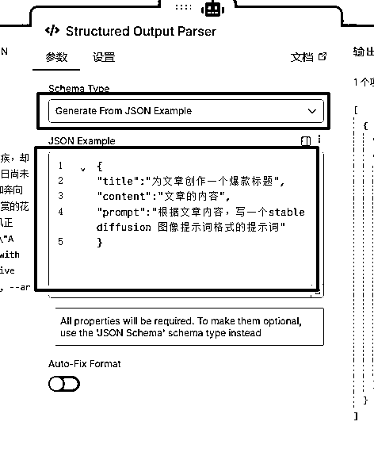
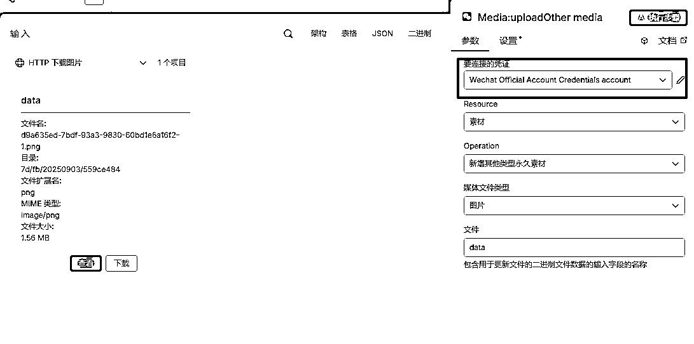
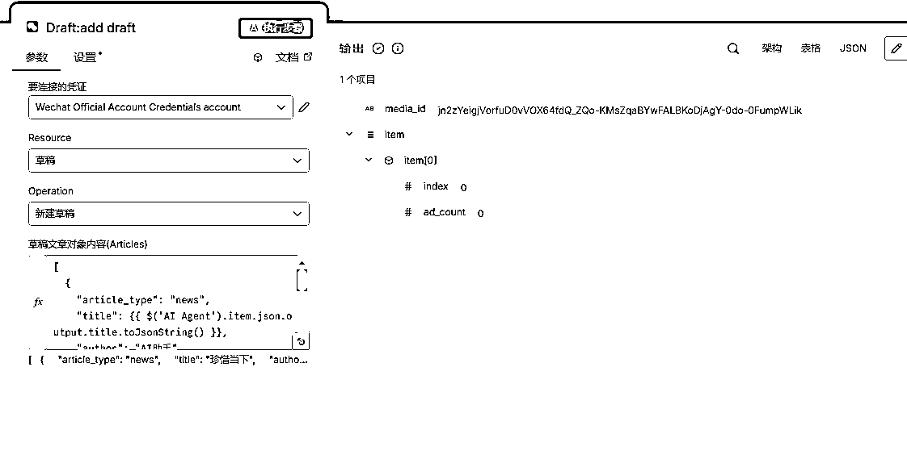

# 保姆级n8n教程来了：手把手教你打造一个AI生成内容并自动发布公众号的工作流

> 来源：[https://b121w2zgwyx.feishu.cn/docx/Dpm6dHYWToC2GgxRSElcMfMgnHj](https://b121w2zgwyx.feishu.cn/docx/Dpm6dHYWToC2GgxRSElcMfMgnHj)

## 前言

注意！由于写的太详细，本篇内容有点长，实际搭建也需要点时间，在开始之前，请确保有足够的时间和精力，可以跟着实操，否则建议先收藏，找个合适的时间再战。

其实这个微信发布的工作流，很多人估计都实现过，coze上也有相似的插件，之所以选择在n8n再次实现，是因为它整体流程足够简单，却又包含了许多n8n的常用知识点，非常适合作为新手入门后的上手实操

完成本篇内容的实操，你将可以掌握n8n的以下几个知识：

1、社区节点如何安装

2、大模型节点如何配置

3、节点间的变量如何传递

4、如何多样化输出不同变量

5、如何配置凭据

6、url图片如何转换成可上传的文件

## 一、准备工作

### 如何在n8n中安装公众号节点？

首先需要安装一个公众号的节点，这个节点是根据微信开放文档开发的，基本支持了所有的微信公众号接口，我们可以借助这个节点实现微信公众号内容的自动发布，进入这个节点的介绍页面，找到截图上的安装命令，命令如下：

```
npm i n8n-nodes-wechat-offiaccount
```

https://www.npmjs.com/package/n8n-nodes-wechat-offiaccount?activeTab=dependencies


拷贝这个命令后，进入我们的n8n点击左下角找到设置


接着找到社区节点，点击“安装社区节点”


然后把我们刚刚复制的命令黏贴进来，打钩风险提示，点击“安装”


等待安装完成，社区节点就出现了这个节点了


### 申请一个可调用国外大模型的api

由于n8n中没有自带大模型，因此我们需要自己接入大模型，这里我们使用openRouter的api，一是因为，它的api国内可以直接调用，二是因为它有免费的模型可以使用，调试的时候用正好。

openRoute官网地址r：https://openrouter.ai/

我们打开这个网站，注册成功之后，找到这个地方


然后点击“创建APIkey”


创建成功之后，记得点这里复制，保存到自己电脑，只显示一次，后续如果忘记了，只能删除重新建。


### 申请一个免费的图像生成模型

因为公众号发布接口有个配图是必填的，所以这边我需要一个图像生成的模型，我使用的阿里云百炼的通义万相模型，因为阿里有活动，新用户免费赠送每个模型100万token。

我们进入https://bailian.console.aliyun.com/阿里云百炼官网，没账号的注册一下，登录之后，找到这个地方，新建一个密钥，把密钥保存下来


## 二、用n8n搭建一个自动生成文章并自动发布公众号的工作流

接下来我们开始一步一步搭建工作流

### 1、触发节点

触发节点就是工作流的开始节点，n8n支持多种不同的方式触发工作流，为了调试方便，我选择chatmessage节点，这个节点的作用就是接收一条聊天框输入的信息


### 2、大模型节点

有了输入的信息，接下来就需要有大模型来处理，我们点击触发节点右边的加号，然后搜索AI agent 节点，加进来


这个时候会发现，这个节点有个小叉叉，也就是有报错的，因为有个核心的大模型节点没有配置，我们在Chat Model这里点击“+”号，接着搜索一下“open”，因为我们打算用openRouter的api，所以我们选择openRouter


现在节点是这样子，接下来需要为openRouter配置一下apikey，才能使用。我们双击openRouter


进入openRouter节点的配置，发现这里需要连接凭证才能使用，所以我们要去创建凭证


进入凭证创建后，我们看到只需要配置一个API KEY就可以了，把准备工作时申请保存的openRouter的APIKEY 填入保存就可以了


回到我们的openRouter配置这里，选择刚刚的凭证，然后在Model这里搜索一下你需要的大模型，这里我搜索“free”代表免费的模型，正式使用，建议使用付费的，因为免费的有调用频次限制1分钟只能请求一次。不过，付费的大家就得提前去充值了。


选择模型之后我们点击左上角的“返回画布”就可以了


### 3、配置大模型节点

接着我们双击AI Agent 节点，配置一下参数和系统提示词，如下图，因为我们用的是聊天触发的节点，可以直接选择Connectted Chat Trigger Node 这个选项，会自动把参数带进来。

接着我们点击下面的 Add option，选择 System Message，这个是配置系统提示词的。


这里我随便输入一个简单的提示词


到这里，大模型基本就可以用了，直接找到左下角的聊天输入框，输入内容进行测试，看到正常的返回，说明配置成功了


### 4、如何格式化输出内容？（重要知识点）

我们前面只是简单的打通了大模型和回复，接下来，由于我们在后续添加公众号的时候，还需要标题、配图等等，而我们现在这种单纯输出内容是不行的，因此我们还要学习一下如何让大模型格式化输出多个不同的内容。

双击AI Agent 节点，打开这个开关，就是对输出进行格式化


打开之后，这个节点会多出来一个节点，我们点击添加一下这个结构化输出的节点


接着我们按照下图配置一下这个节点，就是给大模型一个输出的示例



配置完成之后，回到AI Agent节点，重新执行，我们就能看到，大模型按照我们的需要的格式输出了


### 5、添加配图大模型

我们再次进入阿里云百炼的网站，找到模型广场，然后点击筛选，选择图片生成，找到下面这个模型，点击“api参考”（注意不能使用其他模型，其他模型没有同步接口，需要额外步骤才能用）


接着找到这个curl代码，点击复制


把代码拷贝下来,然后把里面的$DASHSCOPE_API_KEY 替换成我们之前在阿里云百炼创建的 apikey，最后把完整代码保存。这里需要注意，Bearer和$DASHSCOPE_API_KEY之间是有空格的，不要擅自删除了。


接着我们进回到n8n 在大模型节点之后，添加一个 http 请求的节点，如下:


双击进入节点配置里，找到导入curl，点击进去，把我们刚刚准备好的curl代码导入


导入成功之后，我们找到JSON这个参数，然后将前面节点的输出内容 拖动到JSON里的Prompt提示词这个地方（一定要注意不要搞错了JSON的格式）。这个操作的意思就是，我们会使用前面大模型生成的图像提示词去“文生图”


到此配置完成，点击执行步骤，测试一下，图片生成成功！


### 6、配置公众号凭据

调用公众号接口需要授权的，因此需要先配置一下公众号的调用凭据，左上角有个“+”号点击，然后选择创建凭据，如下图：


然后搜索wechat ，找到公众号节点的凭据


接着打开自己的公众号，找到这个地方，如果没有开启秘钥，需要点击启用一下


然后把公众号的AppID跟AppSecret 填到n8n的凭据中，点击保存


对了，记得在公众号添加一下白名单ip，这个白名单ip就是你n8n所在服务器的ip。如果是云服务器部署就是服务器的ip，如果是本地部署的，就查一下自己本地的公网ip。（本地用的时候，需要注意，本地公网ip经常会变的，如果发现ip变了，需要及时修改白名单）

需要学习如何云部署的可以看我这一篇教程：


### 7、如何将URL的图片转换上传？（知识点）

因为公众号的接口发文的时候，配图是必填的，而一般我们上传接口接收的都是file数据，也就是我们经常看到的，通过组件点击选择图片上传！

但是，大模型一般生成的图片都是一个url链接，因此我们需要进行数据转换。

当我们获得的是url图片地址的时候，可以使用Http request 节点直接下载转换成file ，以供后续的上传调用

直接在图片生成后面新增一个Http请求的节点


双击进入节点配置，首先我们把上一步图片生成的url，传入当前节点请求的url，然后再新增一个response的选项，这个response代表的是请求返回的数据。


接着我们需要对返回数据做转换，找到新增的response配置项，点击response format（返回数据格式化）选项，选择file。意思就是，将我们下载的图片格式化为二进制文件输出（因为一般上传需要的是这种格式）


接着运行测试，出现以下内容，说明下载成功


### 8、微信配图上传

终于可以开始操作公众号了，首先，我们需要把前面的配图上传到公众号的素材库，以便于文章发布时调用。我们在刚刚的Http下载节点后面添加这个其他类型永久素材的节点


接着点击配置节点，确认一下我们链接凭证是否选择了之前第6步配置的凭证



没问题之后试运行，出现以下结果，说明配置成功


### 9、添加文章到草稿

最后一步啦，找到新建草稿节点加到图片上传的后面


双击进入配置，把前面AI生成的标题、内容以及上一步上传获得的media_id分别对应到如下参数中，由于内容较多，不好操作，可以点右下角按钮放大操作


放大后


这里需要注意，由于文章内容中经常也会有双引号出现，会造成JSON的格式错误，因此我们最终添加的时候，需要在我们添加的变量后面加上 .toJsonString() 。最终代码如下

```
[
    {
        "article_type":"news",
        "title":"{{ $('AI Agent').item.json.output.title.toJsonString() }}",
        "author":"AI助手",
        "content":"{{ $('AI Agent').item.json.output.content.toJsonString() }}",
        "thumb_media_id":"{{ $json.media_id }}",
        "show_cover_pic":1,
        "need_open_comment":1,
        "only_fans_can_comment":0,
        "auto_publish":false,
        "publish_time":"immediate"
    }
] 
```

代码里面的参数介绍：

article_type: 文章类型，设置为"news"表示文章消息

title: 文章标题，使用toJsonString()方法确保JSON格式正确

author: 文章作者信息

content: 文章正文内容，使用toJsonString()方法处理特殊字符

thumb_media_id: 封面图片的媒体ID，来自上传图片素材步骤

show_cover_pic: 是否显示封面图片（1=显示，0=不显示）

need_open_comment: 是否开启评论功能（1=开启，0=关闭）

only_fans_can_comment: 评论权限（1=仅粉丝，0=所有人）

auto_publish: 自动发布设置（false=创建草稿，true=立即发布）

publish_time: 发布时间（"immediate"=立即发布）

最后，进行一次整体测试，成功了



到公众号看一下草稿箱，成功录入啦


如果有需要直接发布，可以在添加草稿后面，加上发布草稿节点，不过稳妥起见，我觉得还是批量发布到草稿箱，然后人工修改审核一下发出去，AI发挥不稳定的。

如果需要完整的工作流，请联系我获取。

如果你连工作流也懒得搭，可以试试我的自动化工具：https://auto.kanglan.vip

我将这个自动发布的工作流集成到我的工具中啦，在我的工具中生成好素材后，直接点击发布，选择需要发布的账号，就可以直接发布到指定的账号中啦

