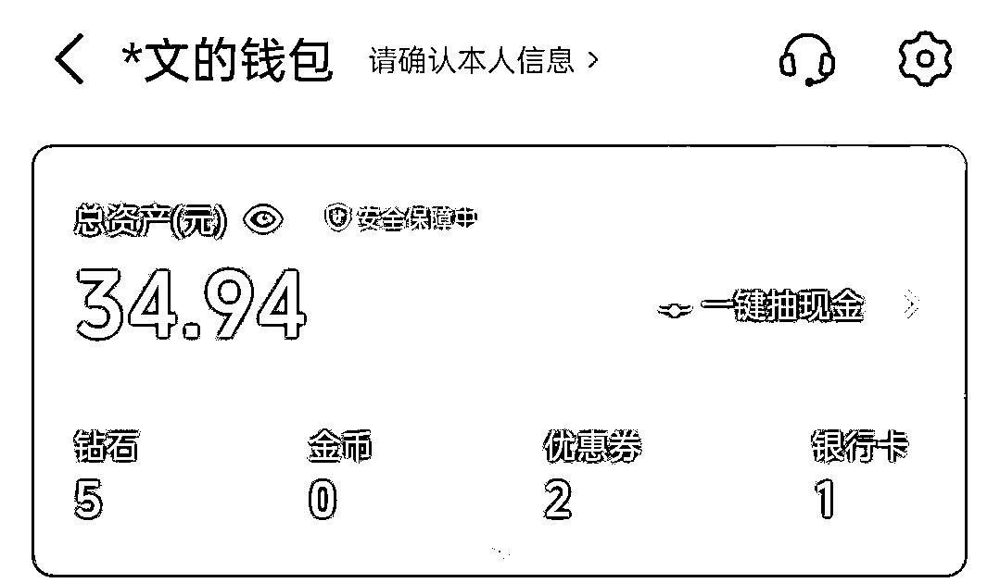

# 从理发店学徒到YouTube赚美金，我的两年破圈之路

> 来源：[https://xpjursanoo.feishu.cn/docx/CKYydAILjoYijpxHLQAcINFInje](https://xpjursanoo.feishu.cn/docx/CKYydAILjoYijpxHLQAcINFInje)

大家好，我是文少，生财传术师，也是第七期圈友，现在主要做YouTube，5月YouTube航海结束后加入了YouTube深海圈。

目前有4个账号，高级YPP一个，其余3个还在开通YPP的路上。

加入生财两年，也终于有了两篇精华帖，也体验了志愿者、领队、教练。

可以说，这两年算是我成长速度最快的两年。

不过今天不是聊项目复盘的，而是和大家聊聊我自己。

起因是看到曹教练和枨惘教练的分享经历，看的我深有感触。

作为YouTube深海圈的一员，让我也忍不住来分享一下。

如果用三句话来概括我的成长经历：

低学历从理发店打工做起；

跨行到互联网运营下班做公众号，坚持2年终出成绩；

辞职自由职业出海赚美金

所以这篇文章，我会尽量回到当时的视角，聊聊自己过去的一些选择与努力，顺带做一个复盘，它不会给你一夜暴富的捷径，只想坦诚分享我这几年踩坑、转型、慢慢找到节奏的过程。

如果你也曾觉得自己学历不够、起点太低、努力了却看不到结果——也许我的经历能给你一份「他行，那我也可以」的底气。

内容有些部分可能有点流水账，但都是真诚分享。希望能给正在经历相似阶段的你，带来一点点微小的帮助。

# 一、从月薪1600的理发学徒，到跨行互联网：我如何用先干起来破局

从上学的时候我的成绩就一直不好，高中读的职高，学的美发专业，毕业后就进入社会上班了。

是的，是高中毕业，我没有像其他孩子一样正常的走这一路程：读完高中→进入大学→步入社会。

甚至我连人生最重要的一场考试——高考都没有体验。可以说，我的学生时代是不完整的。

2017年毕业后在学校分配的理发店实习做学徒，每天从早上9点到晚21点，工作12个小时，但一个月只能拿1600左右的工资，好点可以到2000，而且节假日和周末还不能休（节假日是理发店最忙的时候）。

很难想象对吧？那时候已经是2017年了，最扎心的是法定节日上班还没三倍工资。

据我当时所知，国内理发店都是这种情况，但还好是包吃包住，倒不用我花钱去租房，再加上还可以学「技术」，所以就坚持干了半年。

每天的工作就是帮顾客洗头，洗一个5块钱，指定客户8块（就是指定要你洗的顾客）。

这还是比较偏中大型的理发店，小店的提成更少，洗一个3块钱的都有。

基本每天都是洗10个顾客左右，多的时候要洗20个。

由于每天都在频繁碰洗发水，一到冬天，我们的手都很干（洗发水里面含有碱性），然后就会慢慢变成下面这种：

为什么会选择这个专业？

也是被逼无奈，因为没有考上好的高中，去读一个垃圾学校，不如去职业学校学一门技术，至少还能混口饭吃，学得好自己还可以开一家理发店当「老板」，这是我爸当时为我规划的路线。

可以给大家看看我2017年还在理发店上班时的照片。

后面因为身体原因，不得不从理发店辞职，然后去了医院，头部做了手术，住院了将近4个月，在2017年12月份出院，这期间人生仿佛被按下了暂停键。

由于在医院躺了几个月，出院后身体感觉快废了，为了可以早点去上班，我开始锻炼健身，在家休养了几个月。

住院的时间加上我休养的时间又是小半年过去了，这半年我是一分钱收入都没，我开始有点急了，我不想再伸手找父母要钱了。

那种没有钱、赚不到钱的日子真难受。

我开始思考是继续重操旧业，还是找其它工作？可找其它工作我又能干什么呢？什么都不会。

那年刚好是抖音爆发的一年，可我当时哪懂这些呀，只把抖音当做娱乐软件，完全没有想到用它来赚钱。

这时候就只有这几条路摆在我面前：

要么进厂打螺丝

要么去餐馆做服务员

要么去做房产销售

要么继续去理发店学技术

“打螺丝？不存在的，那还不如去做房产销售。”

“做房产销售？算了，我丢不下这个脸，还不如做服务员。”

“做服务员？唉还是算了，还不如继续去理发店，至少还可以学技术。”

思想前后，我还是继续选择了去理发店。

于是我又再次踏上了我爸之前为我规划的那条路，在离家近的地方找了一个小店上班。

因为小店比较容易学到剪头发的技术，大店至少要两三年才会让你学剪头发。

可又在干了几个月后，已经2019年了，我还是没有学会剪头发，跟我同期的那个同事已经可以接待理发的顾客了。

我发现我在这方面是真的没有天赋，心也累了，不想再学了。

于是某天晚上我跟我爸说我不想干这行了。

我爸也看出来了，确实这行不适合我，也没有说太多，让我自己想清楚接下来要做什么。

然后我又再次想到了之前那几条路，这次我狠下心决定选择房产销售试试，在当地入职了一个房产公司的销售岗位。

每天工作就是去做地推，发传单，拉客户去看房。

也是人生第一次体验做销售，一开始站在路边发传单，手都是抖的，声音也发虚，连跟路人对视都有点害怕。

那时候正赶上重庆的六七月份，空气弥漫着让人窒息的炎热气息，太阳晒得人皮肤发烫。一天下来，衣服湿了又干，干了又湿.....

从那时候起，我就特别羡慕每天坐办公室里吹空调对着电脑工作的人。

虽然苦，但也练出了胆子，后面只要看到有点意向的客户，我就凑上去大胆说两句加微信。

可惜干了三个月，我的业绩还是太差，最终被公司劝退了。

那时我才明白：打工，永远翻不了身；没方向的努力，只会像「老鼠赛跑」一样无限循环。

人永远无法靠重复不喜欢的事情脱胎换骨。与其硬扛，不如早点打破重组。

# 二、疫情之下注册公众号，我如何用下班两小时死磕自媒体

时间到了2020年初，在没被辞退多久后疫情就来了，大街小巷开始封锁，所有人都停工待在家。

那段时间我经常看一个公众号的文章补充心力，也了解到了自由职业、自媒体这些东西，博主还推荐了一本书叫《认知红利》让我去看，在这本书里我第一次了解到“注意力”是可以赚钱的。（25年才知道这个博主也是生财圈友）。

加上自己平时也有在看知乎这些平台，还写过一些回答，有几百粉丝，虽然不算多，却让我对内容创作有了最初的触碰。

于是，在2020年3月14日，我照着网上的教程，懵懵懂懂的注册了自己的公众号——那个梦开始的地方。

在注册公众号后，我好像找到了某种方向，我知道只要我把粉丝量涨起来，阅读量上去了，我就可以接广告赚钱了。

可这个时候问题来了：怎么涨粉？怎么运营？

那时候的公众号还是封闭的，不像现在有了「公域」推荐的流量，涨粉基本全靠外部平台引流。

所以，我开始全网搜教程，知乎、百度、头条、简书、微博……几乎所有平台上关于公众号运营的文章都被我翻了个遍。

看了好几天的文章后才渐渐弄明白：原来公众号的定位、头像、简介、自动回复、菜单栏设计，甚至人设搭建，都有这么多门道。

也是那时我才知道，除了接广告，还有流量主这种变现方式。

可是另个问题又来了：内容该怎么写？

总不能让粉丝来了看一个空白吧。

我一个连800字作文都很难憋出来的人，更别说让我去写一两千字的文章了。

没办法，那时候AI还没出来，只能靠自己手搓。

要想持续输出，就必须先有大量输入。于是我开始逼自己看书，一字一句地读，一本一本地啃，不知不觉，我的书已经有这么多了。

要知道，我从学校出来后，基本就没在认真看过书了，让我重新静下心来阅读，真的很痛苦。

但现在回想也真的很值得。

可以给大家看看我当时写的文章，现在看真的跟💩一样：

也不怕大家笑话，我吭哧吭哧运营了一个多月，没有一分钱进账，甚至连流量主都还没开通。

心里越来越急，觉得这样单打独斗不行，我必须得有圈子。于是我开始在网上四处搜索，最终通过一个公众号留言小程序和一些1元的公开课，摸进了几个用户交流群。

终于，我也算是半只脚有了圈子的人。也正是因为这个圈子，我遇到了后来的贵人——理白。

后面混群才了解到原来可以通过刷粉快速开通流量主。没多想，花了几十块钱试了一下。

当我第一次看到后台出现收益的那一刻，又惊喜又激动。

就为了每天都能有点收益，我开始咬牙日更。第一个月，流量主一共带来163块钱。

钱不多，但到账那一刻的开心，至今还记得。

就这样坚持了小半年，我终于接到了第一条广告——某公司的播音课程，报价300元。

虽然这笔收入还远不能支撑生活，但却像一束微光，让我真正看见：这条路，或许真的能走下去。

期间也是一边是做体力活赚辛苦钱，一边是晚上死磕内容。

我没有选择等到有空再做，而是没时间就挤时间，不懂就硬学。

普通人做副业最大的障碍，不是没时间，而是总想准备好了再开始。

# 三、找工作学历受阻、公众号寒冬：我如何应对不断推倒重来

在坚持运营了将近一年左右，我的公众号阅读量逐渐能稳定在500~1000左右，广告报价也涨到了500一条。

但接单全看运气，有时候一个月能接4条，有时只有1~2条，完全是看天吃饭。

这点收入当零花钱还是可以的，但是完全养不活自己呀。

那时候已经陆续复工，我重新开始找工作。心想，再怎么说我也自己运营公众号这么久，找个新媒体运营岗位总有机会吧？我把目光投向了曾经羡慕的坐办公室的工作。

可现实又啪啪打了我一巴掌，我投了很多家公司，结果却一次次受挫。

有的卡学历，说我高中学历不够（至少得要大专）；有的工资实在太低，我不愿意去；还有的觉得我经验太浅，让我等通知。

然后就没有然后了......

那时候我才真正意识到，学历是我的硬伤，也是在那一年，我去报了成人自考，拿了一个大专学历。

反复面试没结果，我也渐渐放弃了上班的念头。

干脆横下心：既然别人不给机会，我就自己把公众号做好。

那段时间，为了赚点零花钱，我继续做着各种兼职：发传单、地推、甚至当群演……什么都试过。

不过好在皇天不负有心人，那段时间我的公众号粉丝量和阅读量都迎来了上涨期，通过知乎、企鹅号、抖音等外部平台引流，一个月就涨了8000粉，尤其是企鹅号这两篇文章应该都帮助我涨了三四千粉。

至此，我的公众号也终于突破了万粉。

除了公众号在上升，我的知乎也没落下，当时也在同步我公众号的文章，也涨到了2000粉丝，在21年的端午，第一次收到知乎送的端午礼盒。

从那以后，我的公众号每个月都能稳定接到4条广告，每条价格至少500，甚至价格稍微低一点的我都拒绝了。

这种硬气的感觉真爽！

公众号的运营好不容易稳定了下来，但却在2022年4月开始逐渐进入「寒冬期」。

原因是平台的推荐机制迎来了大调整，算法规则逐渐向公域倾斜。几乎一夜之间，大部分公众号的流量大幅下滑。再加上双减政策，很多教育培训类公司大幅缩减广告预算，接单变得越来越难（当时公众号主要是课程类广告为主）。

整个圈子好像一下子冷了下来。很多号主已经开始在卖号了，我还记得当时发了一条朋友圈分析了一下公众号的算法改变。

我没有选择卖号，但也不敢再all in公众号了。

是时候再出去找份工作了。

想着自己已经运营了两年公众号，这一次，找一份运营相关的工作应该不难吧？

所幸，这一次比较顺利。六月份，我成功入职了一家MCN机构，担任运营岗位。

主要工作内容就是找抖音达人进行签约和商单合作。（更像是媒介和BD）

在上班那段日子里，依然是坚持白天上班、晚上写公众号和知乎。

说不累是假的，有时候还要加班，晚上22点多才到家，选题、素材什么都是现找的，写好一篇文章后基本就到12点了。

然后因为那段时间，公众号的算法机制越来越转向公域了，阅读量一直起不来，商单也越来越少。

坚持了一段时间不见好转，我索性停更摆烂了几个月，决定先把主业做好。

虽然公众号停更了几个月，但我也从未停止找路。

这个世界从不拒绝愿意尝试的人，你推倒墙，就成了门；你退一步，就可能永远困在原地。

# 四、进入生财、视频号爆发：正反馈是喂出来的

主业求生存，副业谋发展。

可能由于做公众号的原因，我一直就不安于上班，看着公众号和知乎都没有起色，我必须得找点其它路子了。

说来也是缘分吧，那时候刚好遇上生财第七年418活动，我的好朋友理白也在帮忙拉新。其实早在2021年的时候我就在一些号主群里听人提起过生财，但当时并不清楚它具体是做什么的。

后面在朋友圈观望了几天，加上当时价格才1965，我决定加入试一试。

之前我也报名过一些知识付费课程，像知乎、新媒体写作课之类的，价格基本都在1000~1600左右。相比之下，生财当时的价格，真的让我觉得，这么便宜，必须试试！

虽然不贵，但我当时工资还没发，手头有点紧，最后还是通过花呗套现买的（心里有底，下月工资发了能还上）。

就这样，我也成了生财的圈友。

作为一个刚进来的小白，加入生财后真的被震撼到了。那种感觉就跟之前下面这位新加入的圈友一样，说不出的震撼：

也是从那时候我才知道，原来还有这么多的赚钱路子，居然还有这么多人愿意分享自己的赚钱方法

这真的不可思议！

为此，在新手村的时候，我还立了一个flag，我说希望明年也有机会分享自己的赚钱方法（这个flag终于在今年完成了）。

当然，刚加入生财时的前几个月也是非常焦虑的，很多项目看得眼花缭乱，不知道该从哪个开始。

后面跟着航海、做志愿者才慢慢找到节奏，认知也有了一定的提升，知道光想光看没用，必须下场实操，把手弄脏。

我第一个做的项目是抖音养生带货，当时跟着一篇精华帖操作，花了两个小时才做出第一条视频。

后面做了一个月左右才出了几单，那几十块佣金因为没缴押金到现还在抖音钱包里提不了现.....

之后也尝试了无人直播、快手磁力聚星、得物等等，但基本都没拿到太大的结果。

无人直播不是违规就是没人看；快手磁力聚星视频经常被限流，很难出单；得物稍微好点，靠流量分成+优惠券差不多变现了1000多

但因为当时做的是搬运，觉得对自己能力提升不大，所以做了一段时间就没做了。

时间来到了8月航海，我报名了视频号带货，才开船第二天发的视频就爆了，我毫不犹豫地开启了人生中第一场露脸直播，播了一个多小时，GMV128，佣金80块左右。那一晚，我兴奋得几乎没睡着。

那一刻我突然觉得，视频号，好像也没那么难嘛！

这份实实在在的正反馈，给了我巨大的信心。我决定认真把视频号做下去。

但是因为当时做的是曾仕强混剪相关的，视频大爆之后就会触发人脸验证，结果航海期间只变现了2000左右，账号就废了。

没办法，迫于视频号的规则，我只有换赛道。

后面刚好赶上了视频号分成计划的航海，因为有了一点带货经验（当时已经开通过分成计划），觉得难度不大，就又报名试试。

这一次，航海期间我就变现了1000多，又一次拿到了正反馈。航海结束后我也坚持每天更新，前后大概也爆了至少10条100w播放以上的视频，有时候一条视频收益就有500多。

就这样，我坚持更新了半年。

在24年6月份左右，我终于迎来了一条爆款中的爆款：单条视频播放量破3000w，收益超过4000元。

我想，要不是我一直坚持在发，我也不会等到条千万播放；

我想，要不是我没下牌桌，我也不会有勇气辞职做自由职业；

我想，要不是我一直不安于现状，我也不会走到这一步。

所以，你尽管去撞击这个世界，成败皆是反馈。只要没下牌桌，就还有翻盘的可能。

# 五、一条超级标埋下的种子

2024年年底，亦仁老大发了一条YouTube shorts的超级标，正是因为这条超级标，悄悄在我心里种下了一颗种子（毕竟赚的是美金，还是非常诱惑人的）。

之前尝试过不少项目，也慢慢积累了一些网感。看了几个YouTube的对标视频，感觉好像……也不难？

说干就干，花了几个小时，做了一条动物融合的视频，但是视频发出去后一晚上才几十播放量。

我以为是我内容问题，觉得YouTube太难了，加上当时还在做视频号，就放弃了。

直到今年4月，看到很多人都在YouTube拿到了结果，开通了YPP，说不馋是假的，那时我视频号的流量也开始下滑，那颗埋藏已久的种子，突然又开始发芽。

直接开干！

虽然当时航海已经结束了，但我还是照着航海手册自己摸索实操，花了几个小时做了一条婴儿救援的视频，就这样发了两个月还没开通YPP。

直到5月航海开船那天才知道这个赛道已经不能做了，根本过不了YPP。

没办法，只有把视频全部隐藏重新开始。

后面的故事很多圈友也都知道了：航海期间就成功开通了初级YPP，一周后开通了高级YPP，成功赚到第一块美刀，在5月航海结束后加入了YouTube深海圈，也有了一篇YouTube的精华帖：https://scys.com/articleDetail/xq_topic/1524188151855412

有些种子不会立刻发芽，但它会在你心里扎根。只要时机成熟，加上你愿意再次尝试，它就会破土而出。

# 六、如果你想行动，却迟迟没开始：我的4点建议

1、不要等准备好。

我注册公众号时连写作都不会，全靠流水涨，后面才有了自己的风格，做视频号时连剪辑都是从零开始学的，第一个视频剪了4个小时才剪完。

但我明白一个道理：你永远不可能真正准备好。唯一的方法就是先下场实操，把手弄脏。

写着写着，你就懂了写作；剪着剪着，你就熟悉了流程。站在原地等待完美时机，不如先发出第一篇文章、第一条视频、第一个朋友圈.....

行动本身的反馈，才是最好的老师。

2、打工和副业，是两套逻辑。

打工求稳定，副业求突破。如果现阶段不能all in，就用下班时间试错最小闭环。

从生财找一些感兴趣的项目凹凸性尝试：发第一条视频、写第一篇文章、做第一个引流动作.....

不必一步到位，小步快跑、持续迭代，每天进步一点点。

3、学会主动筛选信息，而不只是被动接收

生财里每天都有大量信息和项目涌现，一开始我也焦虑，什么都想跟。后来才发现，比看到多少更重要的，是筛选出与你匹配的。

不必追逐每一个热点，而是静下心找到那些符合你当前能力、资源、时间投入的机会。

真正的圈内优势，不在于你加了多少群、看了多少帖，而在于你能否从噪音中找到属于自己的灯塔。

4、你可以接受失败，但不能接受放弃。

我也做过很多失败项目：抖音养生货没人看、无人直播被违规、快手磁力聚星限流......

但它们给了我网感、经验和能力。没有白走的路，每一步都算数。

失败只是过程，放弃才是终点，普通人的路，是用尝试铺出来的。

只要你开始，就不会永远普通。

# 七、写在最后

回顾这几年，真的犹如过山车，起起落落，所幸每个阶段都有收获，走的每一步，都算数。

也感谢在每个阶段帮助过我的贵人：

感谢多年老友兼贵人老师——@理白 ，带我加入生财，给我资源。

感谢靠谱老师@梁靠谱 帮我改稿，不然我第一篇帖子都不敢发。

感谢@张小鸣 ，我的自媒体引路人，如果出院那段时间不是一直看你的公众号文章，我也不会踏上这条路，没想到你居然是生财5年圈友，互联网的算法终究是圆的，对的人绕多少字节都会在相遇，果然搞钱的终点还得是生财！

也感谢航海期间对我帮助的所有教练、领队、志愿者，还有深海圈的曹教练、波妮教练、我的咨询教练——@李香君教练。

最后也感谢生财所有嘉宾、亦仁老大和工作人员，也感谢能彼此遇见不断航行的我们自己。

我在生财最大的感触是：生财提供的不是一张藏宝图，而是一张航海地图。

藏宝图是告诉你一个确定的地点，而航海地图告诉你洋流、风向和绘制新航线的方法。我分享的成果，只是我根据地图探索到的第一个小岛。前面还有无数岛屿等待发现。

所以，我想对还没开始的人；快放弃的人；怕失败的人，说：不要羡慕任何人的岛屿，去绘制你自己的航线。生财这座宝库，你挖的越深，收获越丰。

还记得我刚进生财时的那种震撼吗？震撼于信息差，震撼于利他之心。

那时我是因为看见，所以相信。我看见了大佬的成果，才相信这条路可行。

而今天，我想告诉大家的是，我走完了下一个阶段：因为相信，所以看见。

我相信先把手弄脏，才能看见结果；

我相信坚持很酷，才能看见转机；

我相信试错成本很低，才能看见成功的偶然变成必然。

更重要的是，我看见了那个因为相信而变得更好的自己。

这个循环在生财无处不在。

希望我的故事，能成为你相信的起点。