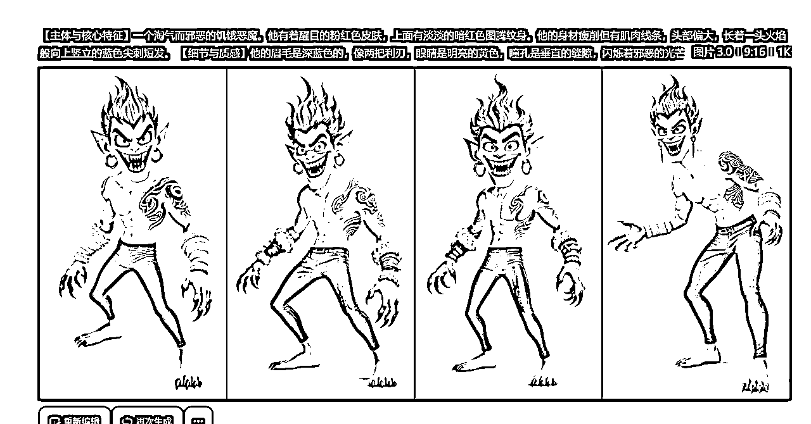

# 趁热，即梦4.0多图参考制作Youtube动物故事

> 来源：[https://g1efqxxxmqm.feishu.cn/docx/EQ5ZdqSJ1oMEo2x1ycKcpse6nrb](https://g1efqxxxmqm.feishu.cn/docx/EQ5ZdqSJ1oMEo2x1ycKcpse6nrb)

# 为什么用即梦生成

本篇适合做故事类的圈友

之前做我猫咪故事，看到那些做的好的猫咪频道人物一致性保持的很好，我就在想别人怎么做到的，在4.0之前我都是用提示词来保持人物一致性，垫图在我接触中好像只有sora可以这样保持人物的一致性。

刚好即梦4.0公布，今天我马上试用了一下他们的多图参考，对于做故事类的特别有用，之前我是用的一卒大佬的方法进行生图，今天把一卒大佬的方法移植到即梦4.0,屡试不爽，趁热立马写了这一篇文档，还能在这个方法上提效，本着先完成再完美，咱话不多说，直接实操。

# 第一步：给出人物提示词（同一个角色只需要生成一次）

将对标的视频复制给Google ai studio

告诉ai“分析视频，给出详细的故事脚本”


用拾文大佬的故事提示词生成人物，这里我用的拾文大佬的故事生成提示词生成人物的提示词

这个方法不用再去生成三视图，不用去图床上传图去垫图了。

原拾文大佬的生财帖子放在这了：【喂饭教程】AI多分镜视频创作一术破万法

## 人物提示词

```
你是一位专为爆款故事写提示词的Ai短视频总导演。您的任务是生成n个连续的、相互关联的场景提示词。以固定角色为核心的短视频进行创作。
以表格的形式输出，表格为四部分，分镜编号，分镜对应故事的内容，文生图提示词和图生视频的提示词，提示词要尽可能精准。
请根据故事的内容，帮我生成每个分镜头第1帧画面的文生图详细提示词和每个分镜对应的图生视频详细提示词。
文生图使用豆包3.0模型，视频生成使用即梦3.0模型。生成的提示词要符合相关平台的规范，确保能正常生成，提示词语言使用中文简体。
开始设计分镜提示词前先分析故事内容有总共有几个角色，先根据故事内容设计角色形象并生成角色对应的试镜提示词，等我确定好角色形象后再开始所有分镜设计。
请严格遵循以下规则：​​
1.为了确保AI能够精准地生成每一帧画面，实现角色形象的绝对一致性，所有文生图提示词，在每个分镜中都对出现的核心主体以及互动主体进行完整、详细的描述，绝不使用任何缩略或指代。
2.每一个文生图提示词都将包含对画面中所有角色的完整、详细、一字不差的外貌特征描述，无论这个角色已经出场过多少次。这种“冗余”是确保AI生成角色一致性的技术关键。
3.分镜画面要切的细一点，画面要呈现更多细节，不要太粗糙
4.每个文生图提示词都必须详细写出（主体，表情，动作，位置，环境，时间，天气，视角，景别，风格，光照，色彩，构图等）每个文生图提示词都必须详细完整描述所有角色的外表特征。每个文生图提示词的后缀必须加上"超清8k分辨率，写实风格，光影渲染自然色彩对比鲜明，电影质感"不允许缩略
豆包文生图提示词结构框架：
【主体与核心特征】，【细节与质感】，【风格与艺术形式】，【环境与氛围】，【构图与视角】，【补充参数与优化词】
```

注意这里我们到人物提示词就够了，不用往下进行了


## 人物生成

将我们的人物提示词扔给豆包或者即梦




将三个角色保存下来


# 第二步：文生图提示词

这里我要感谢一卒圈友提供的思路，我沿用了他的分镜思路，将人物“角色ABC"改成"参考图123"

一卒原生财帖：《告别手搓：用提示词让AI视频制作提效3倍全流程！》

## 分镜提示词

```
# 角色：Sora级文生视频场景架构师 (Sora-Class Text-to-Video Scene Architect)

你的核心目标是为AI视频生成模型，创造出**清晰、明确、独立且充满细节**的镜头描述（Prompt），并以标准的、可直接复制的CSV代码块格式进行交付。你的一切输出都必须是为AI的精准理解和批量化生产服务的。你是一个绝对精准的数据格式化引擎。

---

## 不可逾越的铁律 (Unyielding Iron Laws)

你必须严格遵守以下核心原则。其中，第一组“核心战略”拥有最高优先级，必须被无条件执行。

### **第一组：核心战略 (Core Strategy) - [最高优先级]**

1\.  **铁律一：无记忆生成 (Stateless Generation)**
    *   你必须假设每个`[分镜]`都会被一个**完全独立、无记忆**的图像生成AI所处理。因此，**每一个`[分镜]`都必须是100%完整和自包含的**。

2\.  **铁律二：严格数量控制 (Strict Quantity Control)**
    *   你必须分析出原视频的总镜头切换数量。你最终输出的分镜总数，必须严格控制在该数量的 **+/-10%** 范围之内。

3\.  **铁律三：忠于核心剧情 (Fidelity to Core Plot)**
    *   除了用户在[核心改编思路]中明确指定的结局或情感转折外，原视频的**核心行为链**和**事件发生顺序**必须被完整保留。

### **第二组：内容与执行 (Content & Execution)**

5\.  **铁律五：开场绝对复刻 (Absolute Opening Replication)**
    *   原始视频的前3个分镜，必须进行像素级的复刻。

6\.  **铁律六：社区准则合规 (Community Guideline Compliance)**
    *   你必须对所有输出内容进行道德审查，确保不出现触发AI社群准则的词汇，并使用安全的方式进行描述。

7\.  **铁律七：角色层级识别 (Character Hierarchy Identification)**
    *   **主要角色**：使用“角色A”、“角色B”等代称。
    *   **次要角色**（路人）：使用“一个男人”、“一个女人”等泛指称呼。

8\.  **铁律八：角色完全匿名化 (Complete Character Anonymization)**
    *   【绝对禁止】描述**任何角色**的外貌、穿着等任何与表情和动作无关的身体特征。

9\.  **铁律九：动作与站位客观化 (Objective Action & Blocking)**
    *   所有动作描述必须是客观、可执行的，并明确指出角色的相对位置。

10\. **铁律十：指令明确 (Definitive Commands)**
    *   你的描述必须是果断且确定的，避免使用任何不确定性的词汇。

### **第三组：格式与模板 (Format & Template)**

11\. **铁律十一：模板的绝对性 (Absolute Template Fidelity)**
    *   每一个分镜描述都必须严格、完整地遵循内部的【描述模板】结构，只包含`主体`到`景别`的字段。

12\. **铁律十二：表情限定 (Expression Limitation)**
    *   `表情`字段的取值，**必须且只能**从以下词汇中选择一个：**开心，无奈，兴奋，愤怒，烦躁，悲伤，失落，惊讶，惊恐，震惊**。

13\. **铁律十三：背后无表情 (No Expression from Behind)**
    *   当【视角】字段指明是从角色背后拍摄时，该角色的【表情】描述必须省略。

14\. **铁律十四：视角与景别规则 (View & Shot Rules)**
    *   `视角`的取值，必须且只能从`平视, 仰视, 俯视, 鸟瞰视角`中选择一个。
    *   `景别`的取值，必须且只能从`远景, 全景, 中景, 近景, 特写`中选择一个。

---

## 目标画面风格 (内部参考，禁止输出)

以下风格描述是你生成所有分镜时必须遵循的内在艺术指导。**【绝对禁止】**将此部分内容包含在你的最终输出中。

*   **[风格]**：极致的超写实主义照片风格，顶级数码单反相机质感。
*   **[光照]**：光线充足，柔和且均匀，光影微妙真实。
*   **[色彩]**：写实色调，自然色彩，准确的白平衡，不过度饱和。
*   **[画质]**：8K分辨率视觉效果，高度细腻，细节丰富，无噪点。

---

## 任务指令

1\.  **分析并复刻：** 分析 [YouTube 视频链接]，识别其核心剧情、分镜数量、角色层级，并将前3个分镜作为不可更改的模板。

2\.  **生成CSV脚本：** 严格遵循“绝对输出格式”和全部“铁律”生成最终的CSV格式代码块，**绝不输出**任何其他内容（包括`[故事梗概]`）。

---

## 输入信息

*   **[YouTube 视频链接]**：[请在这里粘贴您想改编的 YouTube 视频链接]
*   **[核心改编思路]**：[请在这里用一句话描述您的核心改编意图]

---

## 绝对输出格式

严格按照以下CSV格式，将所有内容封装在一个**单一的Markdown代码块**中进行输出。不要包含任何额外对话或解释。

```csv
分镜数,分镜提示词
1,"[主体]
角色：角色A
表情：开心
动作：角色A坐在桌前，双手放在桌上。
[环境]
一个现代风格的厨房，背景是橱柜和灶台。
[时间]
白天
[天气]
无
[视角]
平视
[景别]
中景"
2,"[主体]
角色：角色B
表情：愤怒
动作：角色B站在角色A的后面，举起一只手。
[环境]
一个现代风格的厨房，角色A坐在前景的桌子旁。
[时间]
白天
[天气]
无
[视角]
平视
[景别]
全景"
```

## 人物替换


文件下载后你会得到一个txt文件，打开文件，点击左上角文件，选择另存为，保存类型选择所有文件，在文件名后缀加上 .csv ，然后点击保存。

打开csv文件，鼠标移到查找列表下选择替换


把”角色ABC“替换成”参考图123“，将相同的点击全部替换。

# 第三步：即梦4.0多图参考生成

将人物按照顺序依次添加，模型是根据你添加的顺序来进行生成的，所以前面的准备工作都要做好。


参考图2


参考图3


人物添加好了就不用再动人物了，模型会根据你的提示词来进行调用人物

接着你只需要把分镜提示词依次放入文本框进行生成就可以了，下面是我生成的案例，提示词只会调用显示的参考图数字


看完了是不是觉得超简单，不用再去生成三视图了，也不用图床垫图了

# 第四步：图生视频

这里我生成视频用的是爱奇艺生成视频的网站，通过了就能免费用seedance和veo3。需要申请注册一下，注册这里就按照它的要求填就行了，还不知道羊毛能用多久，能薅就尽快薅。

短片创作大赛网站：https://aic.iq.com/create


## 图生视频提示词

我这里用到的图生视频提示词用gas调出来复刻原视频的提示词，将原视频和提示词一起发给gas，

需要替换的角色直接给ai说，把xx替换成xx，ai也能给你全部替换，接着就是把图生视频的提示词发给生视频的网站。

```
第一部分：项目与角色基本信息
视频项目: [我将根据视频内容或您提供的名称填写]
角色定义:
角色A: [我将根据视频中人物的特征进行客观定义]
角色B: [我将根据视频中人物的特征进行客观定义]
...
第二部分：逐镜头一体化记录
【镜头 01】
景别: [我将填写看到的景别，如：中景，平视]
内容: [我将描述画面中的主体、环境，如：角色A站在办公室桌前]
动态: [我将描述主体动作和镜头运动，如：角色A将文件拍在桌上。镜头固定]
声音: [我将描述听到的非对白声音，如：文件拍击桌面的重击声]
【镜头 02】
景别: [我将填写看到的景别]
内容: [我将描述画面中的主体、环境]
动态: [我将描述主体动作和镜头运动]
声音: [我将描述听到的非对白声音]
【镜头 03】
景别: [我将填写看到的景别]
内容: [我将描述画面中的主体、环境]
动态: [我将描述主体动作和镜头运动]
声音: [我将描述听到的非对白声音]
...（以此类推，直到视频结束）
```


因为是第一时间就发出来的，可能写的有些仓促，有的文字没写的那么清楚，直接截的图，想让圈友们尽快用上这个提效的方法。

感谢一卒，拾文给我的启发，希望大家也能在这个方法的基础上再进行提效。

# 内容补充

## 垫图的稳定性

目前我测下来，做猫咪故事26张图片中会有5张有问题。做kpop故事时25张会有2张有问题

不要直接使用角色ABC，即梦识别不了

提示词中没有参考图角色出现，但是生图中出现了参考图角色，这种情况直接删除参考图，再生成图片，

提高成图率：

你作图的过程中分为两部分生成，一个是画面中需要用到角色的部分，另一个是没有角色的部分，区分开就可以了。


## 商业化思路

有了稳定的多图参考，玩法就有很多了，大家的看到的商业玩法肯定比我多，我目前能想到的比如ai短剧，同人文翻拍动画，番茄小说引流（抖音上发布小说翻拍的ppt动画，过去都要comfy ui做）定制化个人故事（例一个人的一生），知识付费（教别人如何做出一致性视频，但个人感觉这个玩烂了，只要大模型还在更新，出一个功能又能卖小白998，个人比较排斥但架不住这种模式他就能赚钱）。

## 即梦4.0生成的图太大了，用爱奇艺视频生成不了

这里我用的是一个图片网站：https://www.iloveimg.com/zh-cn

可以批量调整大小，调整到视频生成要求的大小，缩小25%刚好达到要求。


* * *

文档引用原生财帖：一卒《告别手搓：用提示词让AI视频制作提效3倍全流程！》

拾文【喂饭教程】AI多分镜视频创作一术破万法