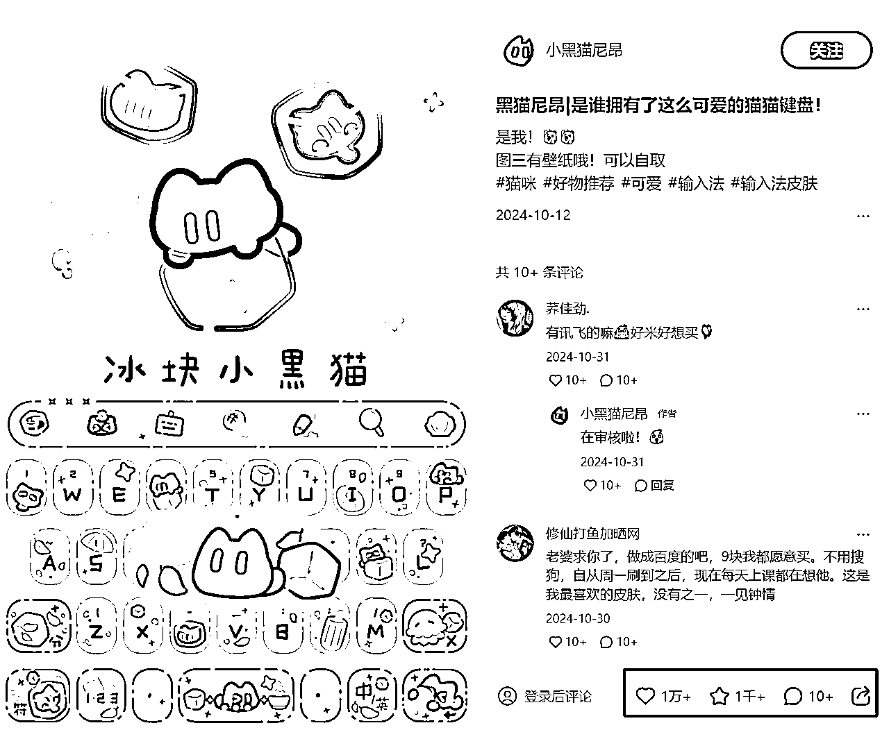
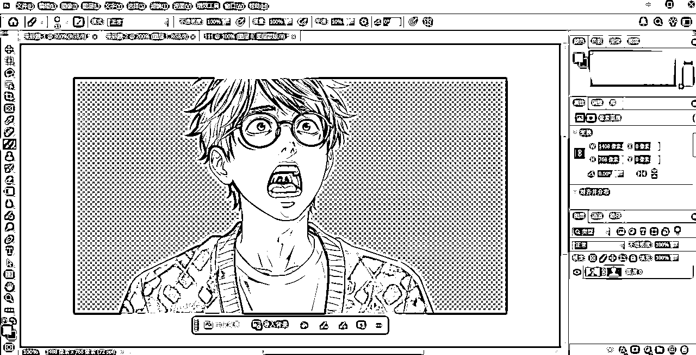
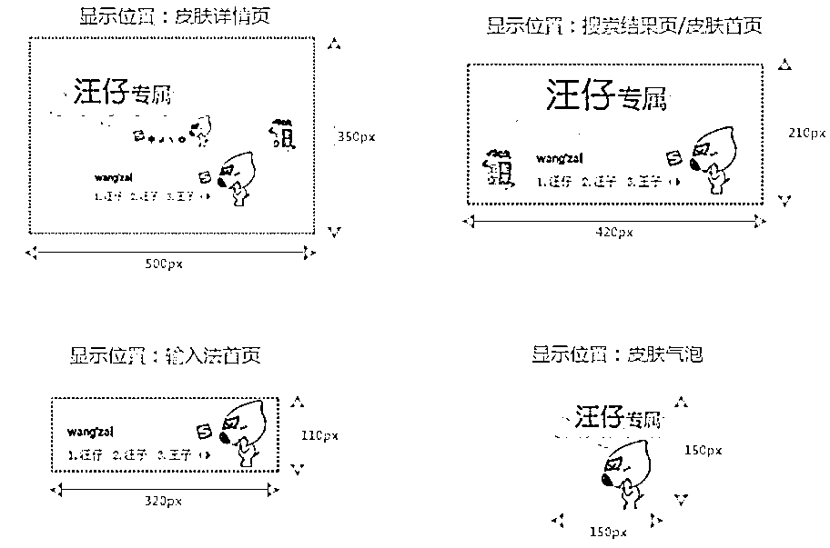

# 奇葩但悄悄赚钱的小生意——输入法皮肤定制需求

> 来源：[https://ib7ibjauw4.feishu.cn/docx/ERhcdOeiNoIhFPx90rtc6f7lnuh](https://ib7ibjauw4.feishu.cn/docx/ERhcdOeiNoIhFPx90rtc6f7lnuh)

背景：本文首发于AI探索家新牛马之光第四期参赛项目组。全文由Penny调研及撰写。

项目一句话介绍：半小时出成品，自己就能捏，单位最小的私人专属AI陪伴赛博电子宠物

# 一、项目调研

### 1，市场规模分析

*   输入法皮肤市场

*   用户规模：中国第三方输入法用户数达7.83亿（36氪，2023年）。

*   商业化规模：动态皮肤/桌宠类产品年收入约3-5亿元（Statista，2022年）。

*   增长趋势：动态皮肤用户付费率年均增长12%，桌宠类皮肤占总皮肤下载量的15%

### 2，入局时间分析

*   行业周期阶段细化

*   2025年关键变量

1.  技术变量：

*   AR眼镜落地：苹果Vision Pro、华为VR Glass出货量预计超2000万台，驱动3D桌宠需求爆发

*   区块链确权：平台可能引入NFT技术，桌宠成为用户数字资产，衍生二手交易市场

1.  市场变量：

*   跨平台竞争：微信输入法、抖音输入工具切入战场，桌宠需适配多应用场景（如短视频弹幕互动）。

1.  用户变量：

*   社交货币升级：用户愿为“独家限量桌宠”支付溢价。

调研举例↓

个人用户把自家的小猫做成搜狗输入法皮肤


*   注：该举例的定制桌宠，还开通了AI对话功能，可以和自家的宠物进行角色对话。相当于是一个虚拟的可对话的宠物猫猫。并且实际上她又是真实存在的。

*   可适用场景：上班族上班时使用。

*   扩展场景：可用于各种定制类AI角色的载体。

*   满足的情感价值：满足了陪伴的感情需求，且宠物戳中萌点。

*   对个人创作者核心要求：AI工具使用

# 二、 变现方向1：搜狗官方商城上架，吃搜索流量和长尾效应

#### 投稿流程

1.  投稿：设计桌宠→提交至官方邮箱→审核（2-5个工作日）。

1.  上线：通过后入驻皮肤商店，用户下载使用。

1.  迭代：根据用户反馈优化（如增加互动动作）。

#### 变现金额

*   分成模式：创作者分成为用户付费金额的30%-50%（根据作品热度浮动）。

*   案例参考：

*   爆款IP联名：单款收入可达10万元（如“阴阳师”联名）。 （不适用个人创作者）

*   普通输入法皮肤：单款下载量1万次，单价2元，创作者收入约6000-10000元。


# 三、变现方向2：在小红书、闲鱼上找流量，发布爆款作品，卖批量/定制皮肤

### 可以靠着可爱、活泼的画面，吸引消费者。

受众年轻女性为主，客单价大约在1-5元左右，而且这个项目的浏览量和潜在用户需求高。

项目的运作简单，可以通过网盘自动发货，用户下单后，系统自动发送皮肤文件。



小红书搜索结果：


单个店铺销量1：


单个店铺销量2：


# 四，变现方向3：找到愿意付费的定制客户，提高个别皮肤定制化高客单

# 闲鱼接定制发帖话术：

标题：【接定制】搜狗输入法皮肤定制仅电脑端使用

正文：

```
仅自用，禁止二次交易!有任何需求请提前说明未说明部分将自由发挥
图片自己提供，最好提供纯色底图，婉拒主体部分被遮挡、不完整的图(会给看效果，实在抠不了会主动拒绝请放心)不帮画，游戏模型不帮导出。
可自选颜色及相关元素。提供的图片请确保没有版权问题
默认为横框+状态栏，竖框+3r输入条默认简单几何框，状态栏保留中文、英文、大小写，简繁体，需要其他功能可加，超出三种1r/入
动态50r起
抠图有瑕疵，介意慎拍
可适当调整，确定草稿后不大改，开始制作后不允许以任何理由退款
商用、加急等费用请详聊
成品【像素小羊】动态【喜鹊说】静态全平台限量发售，如需定制请联系
定制 oc 人设 约稿 剑网3 逆水寒 天刀 捏图 同人 明星
```

价格：

静态：30-40元

动态：50元起步，视具体难度增加

# 五、搜狗输入法皮肤制作SOP文档（超详细版）

# 1，搜狗输入法皮肤上线流程


# 2，制作方法

## 1)了解制作规范

### 皮肤制作规范

*   手机皮肤由候选栏+拼音区+云候选区+键盘大背景+9键键盘+26键键盘+弹泡等元素组合设计。功能键前景文字部分支持自定义贴图，其中中英、分隔、大小写切换只可修改字体及颜色；字母键文字暂不支持自定义图片，但可以修改字体和颜色

*   PC皮肤主要分为四种模式的输入框和状态栏。输入框和状态栏可使用png格式图片；注意标注的尺寸，可进行一定的调整；输入框的背景图尽量选择纯色或者保留可拉伸的区域；输入框和状态栏上的主形象都不宜过大，以免影响输入

### 皮肤介绍

下图为手机端九键键盘示意：


9键/26键切图范围标注图：


手机皮肤源文件下载地址：img.shouji.sogou.com

需要使用授权字体，手机字母键使用字体必须要有大小写字母

下图为PC端四种模式的输入框和状态栏示意：


## 2）下载三个需要用到的软件


皮肤编辑器下载地址：https://pinyin.sogou.com/skins/design.php

## 以及准备需要用到的AI软件

whisk（https://labs.google/fx/tools/whisk）、即梦AI、可灵

## 3）想好一个页面主题，并做成画面

比如电视剧滤镜有个男主角和羊驼的片段很火，就做这个

### 3.1）搜集照片人物素材，打开whisk，确定主题人物，背景用纯白，风格选择自己喜欢的

a人物


b羊驼


### 3.2）将素材抠图后，分别放进500x130的透明背景图里

和200x200的透明背景图





### 3.3）再放入搜狗拼音输入法皮肤编辑器里，分别作为横排合窗口显示图和状态栏显示图，即可

搜狗输入法编辑器下载地址：https://pinyin.sogou.com/skins/design.html?f=idx_makeskin?f=idx_rmzt


实际效果如下：


需要用时：半小时不到。

拓展场景：非常适合作为情侣定制礼物，有纪念意义

## 4）动态版

### 4.1）打开可灵AI，图生视频，将图片转成视频


### 4.2）打开PS，将视频渲染成PNG格式，并利用PS的批量操作，批量把背景扣成透明


接下来，我们选择文件夹中最后一张图拖到PS中，在动作面版执行新建动作，然后执行“选择主体”--“反向”--，确定生成选区后按Delete键“删除”背景得到透明图;“存储”-关闭文件，停止动作记录。


批量去底操作，执行“文件”--“自动”--“批处理”，调出对话框选择刚才记录的抠图动作，源就选择文件夹，其他默认就可以了，点击“确定”你会看到电脑在拚命地为你干活

### 4.3）gif movie gear导入文件夹，保存为PNG动画格式


### 4.4）放入输入法皮肤编辑器


加入了一个键盘icon的设计，用即梦AI生成


导入到软键盘的标志这里


### 4.5）在搜狗输入法官网上传

步骤：使用搜狗通行证登陆搜狗拼音输入法官网皮肤页面（http://pinyin.sogou.com/skins/）点击上传皮肤，按照提示填写信息，及上传皮肤及效果图。


## 5）皮肤上传官方审核

如审核未通过


解决办法：按照官方给出的修改建议进行修改：




# 3，进阶版输入法皮肤——可全桌面游走、鼠标追随、打字追随的AI陪伴赛博电子宠物

原因:

1，提高竞争力，玩法更具竞争力


2，商城首页曝光度更大


3，价格更高，用户黏度更高


*   这位个人作者，只出了三款宠物皮肤，三款皮肤总收益是24483.6元

看完收入，再看产品细节：


目前调研到的，桌宠迭代进阶用到的几个技术：

Live 2D技术，已经用于许多虚拟主播的直播中


Godot 动画技术，常用于游戏中，比如代码狐狸和动物农场


# 六，项目优劣势

优点：

*   这个项目的制作和运行逻辑和红包封面、表情包项目类似，而竞争程度又远小于这两个项目。

*   制作难度不高。

*   市场大，消费者多。

*   可定制。

劣势：

*   上线天花板低。

本文档为Penny撰写

欢迎交流~