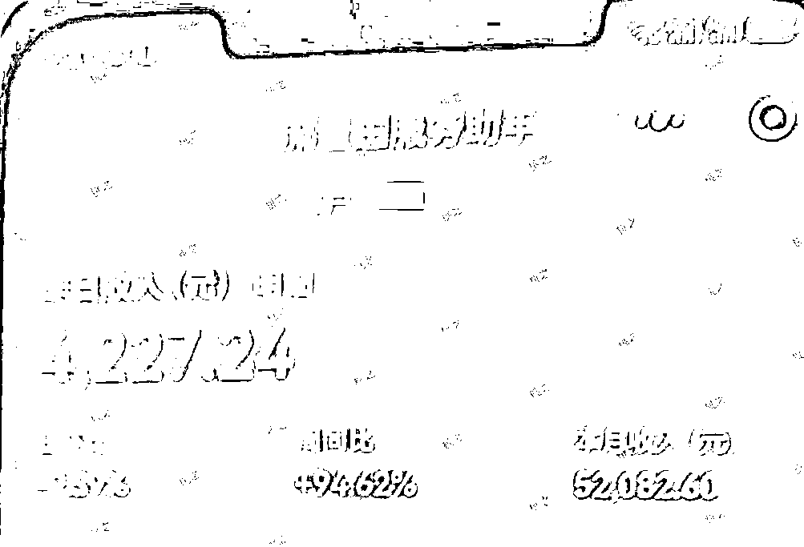

# 公众号流量主：一年的时间，更新了600多篇原创，涨粉10万+，挣了37万，分享三点心法

> 来源：[https://p2tkpuv6qm.feishu.cn/docx/ViOldC1dQofa9DxXu8ucNtPbnth](https://p2tkpuv6qm.feishu.cn/docx/ViOldC1dQofa9DxXu8ucNtPbnth)

hi，各位圈友们大家好，我是格子，做自媒体三年来一直聚焦于公众号流量主变现。

今天这篇内容，这可能是很多闷声挣钱的号主不会告诉大家的真相，至于有没有用，那就看每个人的理解能力与执行能力了。

这个案例来自于我一个私教学员，她这个公众号从去年六七月开始更新，直到今天，整整更新了600多篇原创内容，一年的时间，单号挣了37万！注：文中的所有收益图均来自于这个学员这个号！

现在账号的流量虽然没去年那么猛了，但每天依然有收益，少的时候一百上下，多的时候还能往上冲一冲，这个10多万粉丝的号，给她带来了非常稳定的睡后收入。

这个号，我是从头到尾看着她做起来的。从0到1，从1到10万，再到现在的37万，所以我的感受也特别的深刻！

今天呢，我不是来炫成绩的，而是想借着这个活生生的例子，跟大家掏心窝子地聊聊：如果你也想做一个能真正挣到钱的公众号，到底该从哪几方面下手？

我总结了3个核心心法，这可能是很多闷声挣钱的号主不会告诉你的真相。

### 心法一：做“第一批”，而不是“跟风者”

做公众号流量主，我们大部分的玩法是：什么领域火，就一窝蜂冲进去。

比如军事火，大家都冲军事；养老金火，大家都冲养老金...

这个方法不是不对，也能挣到钱，但它很可能只能让你挣点快钱、小钱。

你这么想，别人也这么想，竞争太大，平台审核也会越来越严，导致起号成功率极低。

最重要的，因为内容同质化越来越多，后面新起来的很多号都是一波流，挣个三五千，账号就死了，然后你又得注销重启，特别累。

而且这样的玩法，我们会发现，我们一直在追着那些热门领域，等我们进去，又只能瓜分到一点点的流量。

而这个学员的号，就是切中了一个非常细分、当时很少人做的领域。

她算是很早做这个领域的那批人。正因为进去得早，竞争小，她的账号权重很快就建立起来了，这才有了后面持续稳定挣钱的可能。

如果大家用心观察就会发现，每个领域，总有号是流量很好的，而这些号，基本都是第一批做这个内容的，所以进得早是有优势的。

那么，我们的思路要变一变：从“什么火做什么”转向“我发现什么可能会火”。

### 心法二：必须做差异化的内容，而不是单纯洗稿

如果找到了一个有潜力的新领域，你怎么做内容？

其实公众号的展现形式非常多：传统长文+配图、纯图片（不是小绿书）、小绿书、视频、GIF动态图等等各种。

千万不要只盯着一种。我们可以想想，这个领域的爆款内容，能不能用一种新的形式去呈现？

比如，大家都是写长文，你能不能做成视频？大家都做视频，你能不能做成GIF动态图？

像去年我们做美食领域，其实就有很多种形式的内容出现，有小伙伴做动态图，有小伙伴只发图片的，也有小伙伴只发小绿书的，还有小伙伴只发视频的...

同一个领域，真的是百花齐放，而且大家流量都很好，有小伙伴通过差异化的玩法，一年的时间也挣了大几十万。

又比如最近，AI漫画形式的内容很容易进流量池，大部分人都是盯着明星漫画，职场漫画，其实是不是有很多过去流量猛的长文领域，也可以尝试着用AI漫画做一遍呢？

当然了，创新不一定百分百成功，创新也是很痛苦的，拿到结果很慢，反而是跟风式的玩法更容易拿到结果。

但不创新，是很难做出一个挣大钱的、且持续在流量池挣钱的号的。

### 心法三：测试要投入多个号，多花点时间

这是大部分人起号的一个状态了：测试一个领域行不行，就起一个号，发个七八天，没看到爆，就下结论：“唉，这个领域不行”，然后果断放弃。

起号本身就有概率性，不是100%能成功的，甚至有些号天生不行（我们戏称“哑号”），有些就是“天选之号”。

所以，正确的做法是：看准一个方向，就要舍得投入多个号去测试。而且测试的时候，要把时间周期拉长到一两个月，甚至三个月。

做公众号流量主就是这样的，这个号没反应，可能另一个号就能起来。

有一个小伙伴，为了测试一个领域，她花了两三个月，而且还同时起了3-5个号，每个号用不同的起号方法去测，这个过程中有些号能起来，有些号起不来。

她在这件事情上，投入了大量的精力，结果自然是好的，做起来一个号就给她挣了大几十万。

而她，一直用这样的玩法，把公众号做得很好，关键是她一年挣个几十万，其实只做了三五个号，并不是靠数量取胜，而是靠质量、差异化取胜。

### 最后说句大实话：做号讲究天时、地利、人和。

*   天时：你入场那个领域的时机，是不是足够早。

*   地利：你手里的号，是不是有那么点“运气”在。

*   人和：你自己能不能坚持，能不能跑在同行前面去大胆创新。

就像上面这个学员，她做出了一个一年挣37万的号，但其实中途她还做了很多其他的号，想要原封不动再复刻一个一模一样的，成功不了了，一个是时机，一个是号的潜质不一样。

这样的情况不止个例，是大部分号主，能做起来一个年入几十万的号，却好像怎么都做不起第二个、同领域、一样牛逼的号。

所以，我们要追求的，不是复制一个具体的项目，而是掌握一些方法，这个领域我做不起第二个牛逼号，我可以用这套方法去做另外一个领域，一样还是能成！

我是真诚地把我所有认为很值钱的内容都分享给大家了，做公众号流量主，想要挣大钱，就得做这个领域的“元老”。

只要你进入得够早，一旦账号权重起来了，后来的人即使再多，也很难撼动你的地位。这个号就能为你持续地、稳定地赚钱。

希望这个真实的案例和这3点思考，能给你一些启发。

我这次写的就是纯思路上的东西，有没有用，各凭本事了。

用心体会，好好消化，为你所用，然后大胆去干。

我相信，你一定能通过公众号流量主这个项目多挣几万甚至更多！

现在虽然流量没去年那么猛了，但每天依然有收益，少的时候一百上下，多的时候还能往上冲一冲，这个10多万粉丝的号，给她带来了非常稳定的睡后收入。