# 全局视角下的SEO实操指南：我的站内优化细节与站外外链抄作业心得

> 来源：[https://mxd9q29m9yq.feishu.cn/docx/SzYSdjvipoTkDoxoeC5c0T5Fnig](https://mxd9q29m9yq.feishu.cn/docx/SzYSdjvipoTkDoxoeC5c0T5Fnig)

## 自我介绍

大家好我是TC，00后圈友一枚，今年20，之前做web3拿到五位数的结果，目前在一家量化公司做远程，当然大部分时间在研究ai web站出海这件事上，目前成果是靠seo拿到过几个关键词Google前10的排名以及工具站成功开单完成0-1的闭环，最后感谢我的两个师傅 刘小排老师和哥飞老师，感谢带我走上出海这条路来

## 为什么我认为SEO值得做

### 1.投入足够低

不像其他的推广和获取流量的方式比如红人营销（找海外的kol推广自己产品），Google广告，Facebook广告等推广方式，SEO的投入主要体现在时间成本上，我们需要投入的全部就是大量的学习时间和实操时间，就算最后失败了也就是浪费了一些时间，但是这段时间还是学到了一些东西所以也并不算完全浪费我觉得，他不需要什么金钱投入，是比较适合新手的起步探索方式

### 2.想象空间足够大

SEO做好了代表着你可以持续从Google获取稳定的大流量（当然前提是词选对了），有了持续稳定的不低的流量之后，不管是Google adsense还是做Saas工具站收订阅费都会变的相对容易起来，有很多大站从靠SEO从Google获取的流量是非常巨大的比如Canva，所以SEO是一个前期投入可接受，做好了收益大的事情，所以我认为SEO还值得做

### 3.关于AI搜索

AI搜索可能会带走一部分流量，但这部分流量主要是内容站（做文字内容的我理解），因为这些内容现在我们可以问AI让AI回答我们，这比我们自己搜索来的更快，也就是AI搜索满足来对部分信息获取的需求，但其实还有更多需求是AI搜索满足不了的，比如当你搜索的内容是一个视频，AI给了你视频链接之后你依然还要进到YouTube去看视频，如果你需求的是一个工具，AI告诉你之后你依然要到具体的工具站去使用，所以SEO依然值得做，我自己的站现在每天就有一些从各种AI来的流量进来

## 全局视角（先有个感觉再往下做）

由于大部分词做seo是一个相对漫长的过程，往往需要几个月的时间才能初见成效，所以在往下看之前，先对从选定词开始做到最终拿到排名的整个过程变化有一个整体了解相当重要，有了全局的视角之后中间遇到波动才不会慌，才能保持动作不变形一直坚持做下去，下面以我自己网站的gsc后台曲线来简单看一下整个过程

这个站的关键词拿到排名大概花了两个多月左右，中间大部分时间排名都是比较靠后的位置波动的，偶尔有前进一点点也没有维持之后就马上又回去了，一直到最近这段时间才突然上升拿到排名，我的关键词排名是直接从60到10的而不是一点点前进的，所以我觉得做seo的关键还在于坚持做，然后中间有波动是正常现象，如果没有意外情况比如网站突然打不开了或者其他意外情况，坚持做耐心做然后等待就可以了

下面就网站的seo细节怎么做来拆开说一下，怎么样坚持做，中间我们具体要做哪些动作以及分布怎么做可以帮助我们更好的拿到Google的排名，按我做这个站的经验下面拆分成站内优化和站外优化两部分来讲做什么和怎么做

## 具体操作路径

### 站内优化（onpage seo）

站内优化就是对我们自己网站的优化，这一步的关键在于扣细节，因为seo里面有非常多的细节的点，你的网站比竞争对手的网站在更多的细节上做好，你就比竞争对手更容易拿到排名，下面拿我自己的网站说说我做了那些动作，都分别是怎么做的（我自己可能也还有部分细节没有做到位），在做网站站内seo的时候，我会用aitdk（chrome浏览器插件）这个工具来帮助检查各个细节做到位了没有

aitdk下载地址：https://chromewebstore.google.com/detail/aitdk-seo-extension-traff/hhfkpjffbhledfpkhhcoidplcebgdgbk?hl=en-US&utm_source=ext_sidebar

#### 第一步：检查网站标题和描述（门面）

这一步我们打开aitdk工具的overview部分，这块我们可以关注三个部分，

第一个是title，这个一般不要超过60个字，然后要包括到我们的关键词，这里为就写了flowchart ai这个词在title里面，剩下的作为补充我一般就写相关的，我这里就在后面写了flowcharts这个关键词，

第二个是description，这里除了不超过160字以外就是依然包括我们的核心和相关关键词就可以了，

第三个点是下面的canonical（一个网页标签，理解后直接让ai帮忙设置）是否被我们正确设置了，canonical这个标签作用是声明网页的规范网址，是为了解决重复网址问题，举例比如https://aaa.com和https://aaa.com/index.html都有可能访问到网站的首页，如果不设置canonical那么Google在抓取的时候就可能发现这两个甚至更多网址，他们的内容都是一样的，就认为这些是重复内容了，所以我们要设置好canonical，告诉Google我们官方认定的规范网址是哪个，才能让Google更好的明白

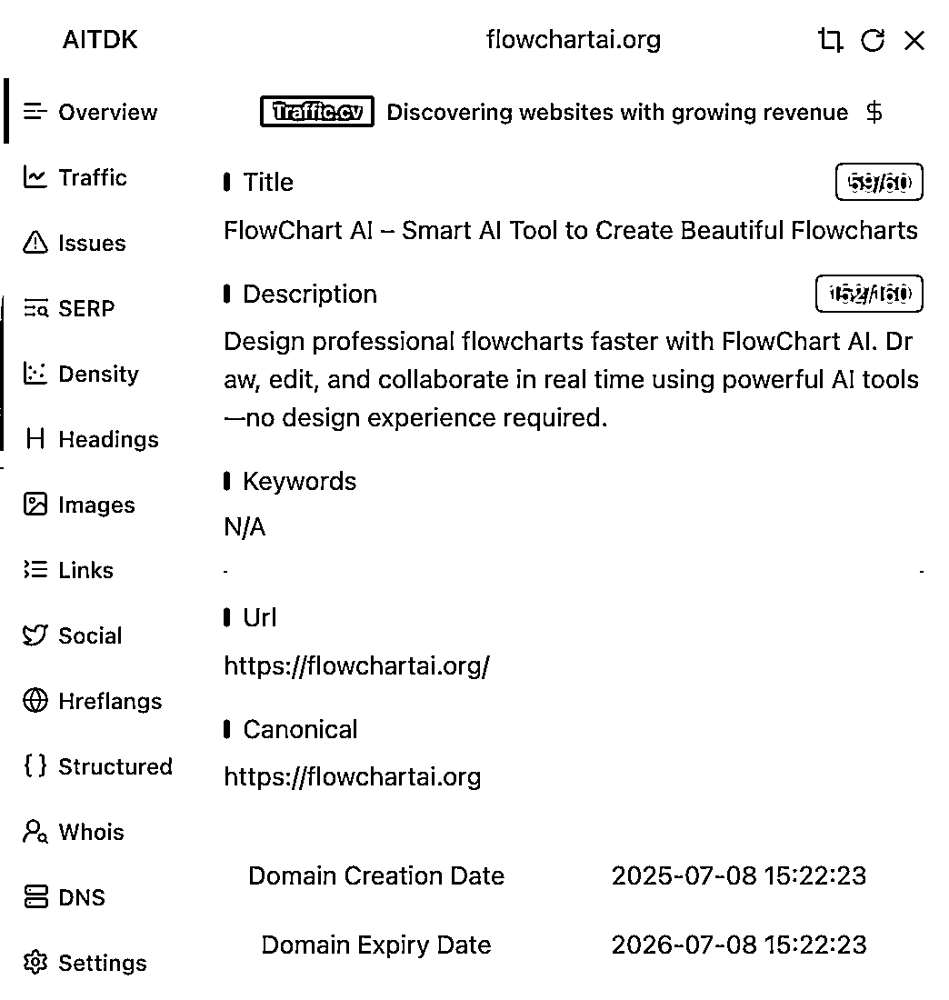

#### 第二步：检查网站的关键词密度

这一步我们打开aitdk的density这个模块来进行检查

density这个板块是我们网站的文案部分，Google的爬虫是不会直接来使用我们的网站的，所以我们为了让Google能够更好的理解我们的网站我们就要在网站的首页写好对应的文案告诉Google，我们的网站是干什么的，而这个文案也不是让ai随便写写敷衍了事就完了的，下面说我写文案的时候会注意哪些细节

首先，字数要达标，这是为了告诉Google，我们的内容也是认真写了的，好歹也有这么多，不然你的网站页中字数还没header和footer加起来多Google一眼就能看出来你是随便搞了个网站来糊弄他，自然也就不会给你排名和流量，我写的时候一般会控制字数在1000-1200左右，当然有时候也有更多

第二则是关键词密度，我们的核心关键词密度要尽可能的在一个比较高但合理的范围内，这是为了跟Google强调我们核心关键词，为了后面更好在gsc（Google search console，也就是Google官方的站长后台工具）里面出词，一般这个范围是3-5%，这里我的主打的这个关键词flowchart ai这里的关键词密度是2.86%，我一般不会特意追求一定要写进这个范围，接近就可以了，主要有时候写太高了反而又导致看起来有点像关键词堆砌，关键词堆砌是一定要杜绝的，是非常不好的行为，然后当你已经设置好了核心关键词密度的时候，也可以适当让其他相关关键词密度更高一些，比如说我这里还设置了flowchart这个关键词的密度也很高有3.72%，不过这个词的难度很大我现在肯定没拿到什么排名

第三我觉得就不是在aitdk上面看的了，就是这些都没有问题之后，最后返回网站首页看看语句是否通畅，内容是否真实，内容是不是真的有价值等等，这一步是我个人的思考，我觉得做网站是给用户做的，顺便方便Google，这是seo，而不是给Google做，不要为了seo而seo，所以我往往在刚开始写文案的时候就会让ai注意真实性，如果中间涉及到一些问题，我就让ai先去搜索对应资料，搜索用户关心什么问题，然后再让ai根据这些问题来进行首页内容的安排和写作，最后写完了之后再审一版，确定没问题之后再使用

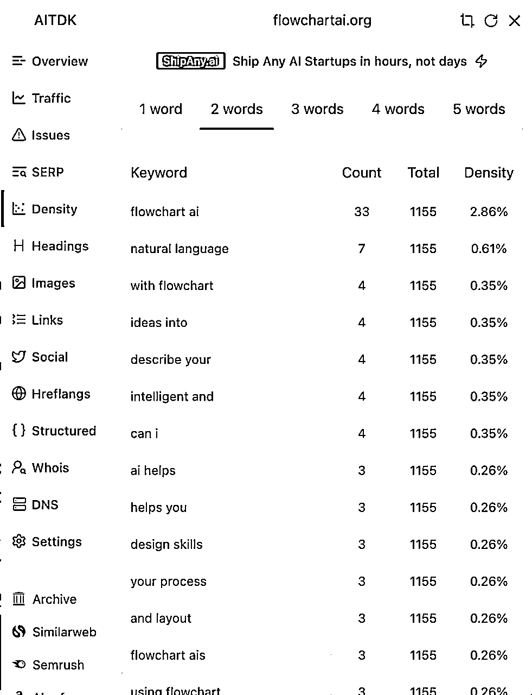

#### 第三步：检查网站H标签，看结构

这里我们看的是aitdk的headings板块

第三个是headings部分，这部分和我们写文章有点像，h是分级标题，h几就是几级标题，这些标签的作用是让网站的结构清晰就像写文章要分段是一样的道理

首先必须要确定的是整个网页只有一个h1标签，这是这个页面的最上层的标题

然后是h2标签，这个一般也是概括性的，而h3一般是具体细节性的内容，我们一般只会用到h1，h2，h3这三个标签了，如果还真的有更细节分层的内容可以用到h4，但比较少，大部分情况下h123就已经足够用足够清晰了

如果可以的话，也可以在标题里面覆盖自己的关键词，比如我这里h1里面就有flowchart ai这个关键词

但我这里我觉得做的还不够好，看起来还不是很清晰

#### 第四步：看图片设置和设媒设置是否正确

这里我们看的是aitdk的images板块和social板块，

images这部分我们主要检查各个图片是否写好了他们对应的alt文字，这个alt的作用是对于图片内容的解释，也是为让Google可以更好的理解我们的图片内容，确保不同图片有他们对应的正确的alt之后我们看social部分

social部分的作用是当你的网站被分享的时候他会以一个什么样的形式被别的用户看见，一般我就使用首页截图来做这一部分了，如果有精力什么的话也可以单独设计，但我觉得一开始还是首屏截图（直接用你网站首页截个图就行）就够用了

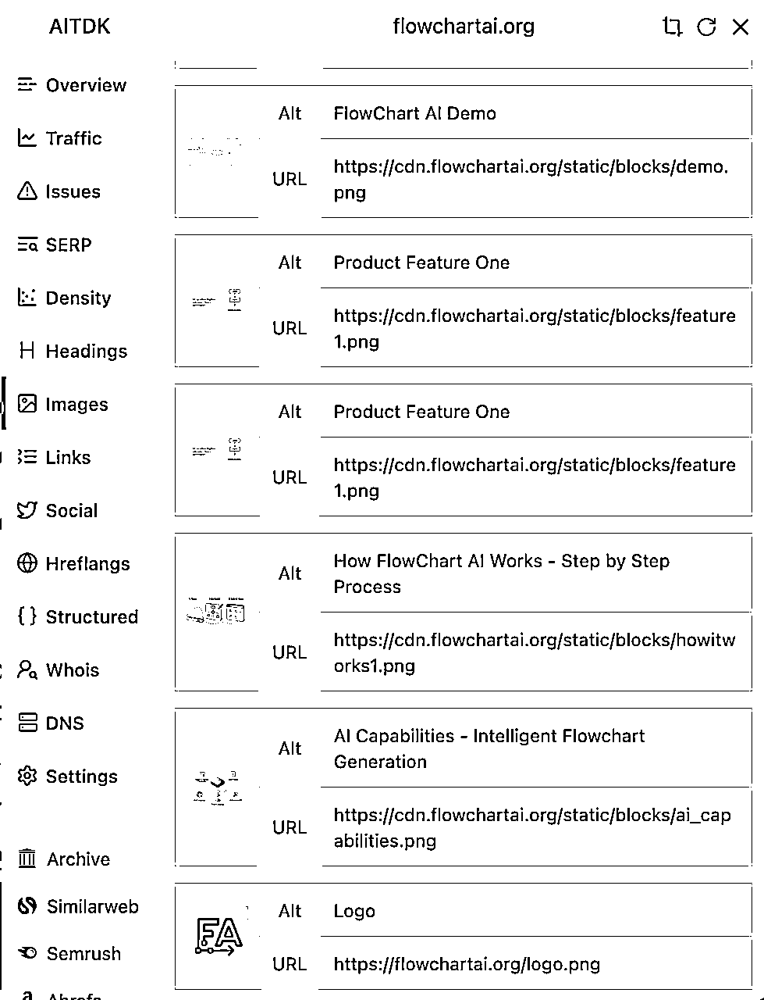

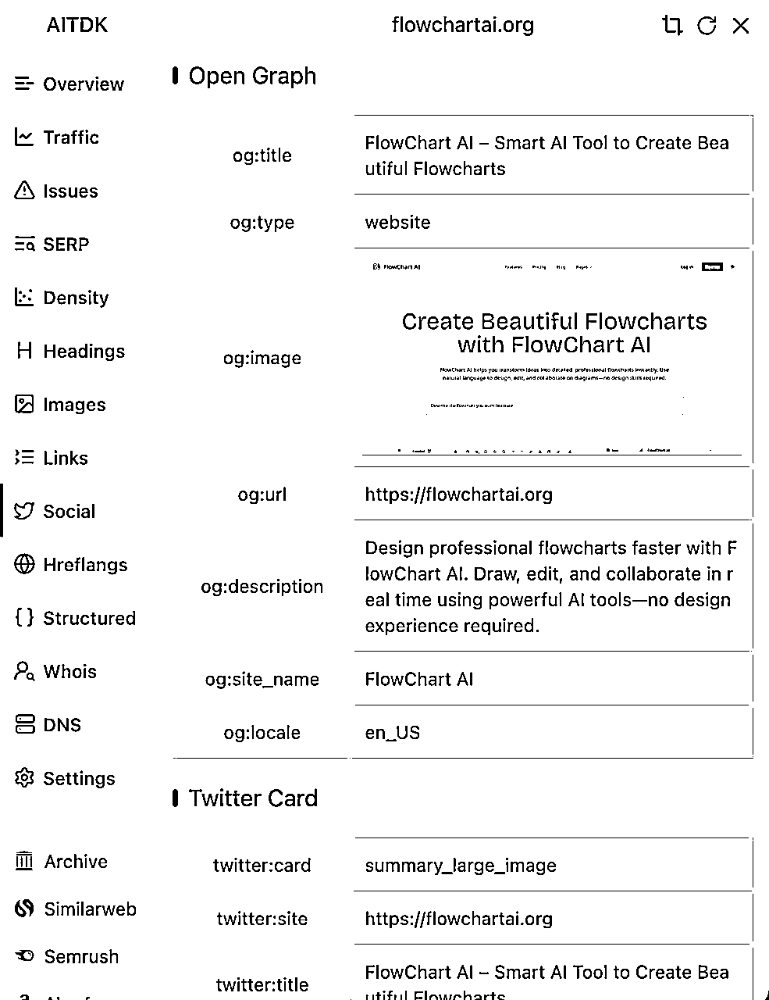

#### 第五步：不放心最后检查一遍

这里我们打开aitdk的issues部分做最后的一遍检查

这些都完成了之后就可以在issues那里看到全绿的记号了，这说明我们的站内seo初步还可以了，当让还有细节是issues里面没有展示出来的就需要我们后续根据我们的学习再自己把控了

#### 如何判断自己的站内seo做的咋样

最后，如何看自己的站内seo做的是不是合格呢

##### GSC是否出词

我首先解释一下什么是出词了，当我们刚刚提交Google search console的时候，我下图的queries那个位置（中文的话是查询，好像因为我浏览器默认语言是英文所以这里是英文）是没有词的，应该是完全空白，过来一段时间之后，Google发现你这个网站了收录了之后要给你一些流量让别人看到的时候你就会看到那个地方慢慢有词出现，比如我这个地方，过几天了之后就出现了flowchart ai这个词，那这个就是出词了

然后我们可以看Google search console后台也就是gsc是否出词，看到出词了说明前面的站内优化基本做的问题不大

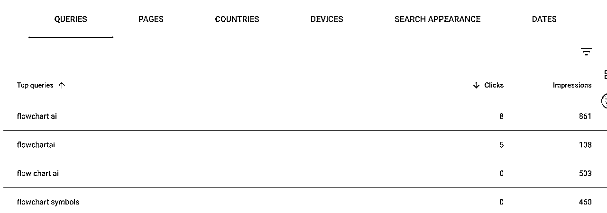

##### Bing是否拿到排名

然后我再提供一个自己的一个"偏方"吧，这个纯属是我个人感觉的仅供参考，就是网站做好了之后提交Google search console申请收录的时候也同时去bing提交网站，bing比Google会更容易拿排名一点，我目前的感觉是如果你的站内优化做的好的话有比较大的概率在bing拿到前10的排名，但也跟词有一定关系，如果低难度的话可以用我这个去看看，我有几个难度在50以下的基本都上线一个月内拿到bing的前10的排名，当然也有说法说bing排名比较玄乎，惩罚机制也莫名其妙，这里仅供参考

### 站外（外链）

站内的做好之后就是站外了，都知道网站做出来之后要持续发外链给自己的网站积累权重，那么一定会面临这些问题，外链上哪里找？和什么样的外链是好外链？下面以我做这个站找外链的过程来实操一下尝试回答一下这两个问题，

#### 在哪里找外链（抄作业）

首先说外链上哪里找，我的外链基本全部都是抄来的，具体怎么抄，我实际演示一下, 这一步我常用的工具是semrush（一个seo工具，直接上淘宝找共享版本吧，正版太贵了，这里不推荐具体店铺），首先打开semrush，输入一个你想学习对标的网站，我这里就以我自己的网站做演示，其实这里应该是平时看其他网站研究其他网站的时候输入其他网站的网址来研究学习，输入完成之后在左侧侧边栏找到外链建设下面的反向链接之后就可以在这里看到你要学习的这个网站的外链和其他信息情况

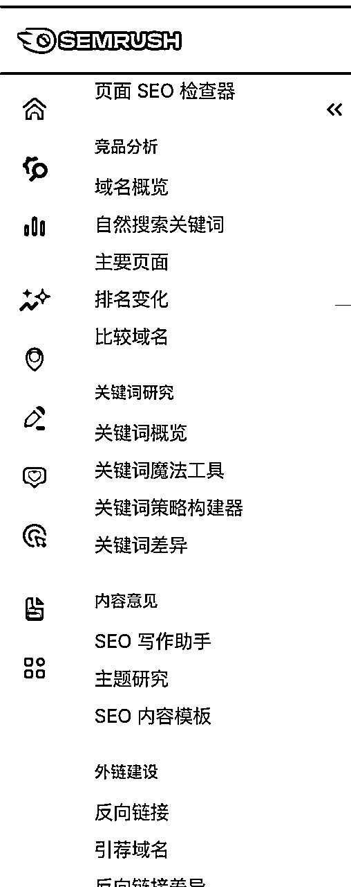

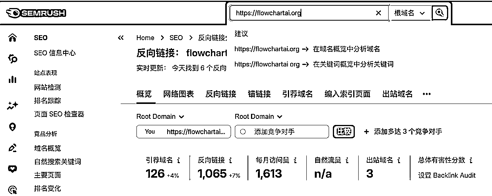

下一步我们点击反向链接，在这里可以看到对标网站的全部外链了，那既然对标网站依靠这些外链拿到啦排名，那么我们也可以利用这些外链来拿排名，配合这里的筛选器我们可以找到更多符合我们要求的相对高质量的外链，我平时找的时候会比较常用几个筛选器选项，首先第一个就是活跃，这个说的是目前还存在的外链，后面所有的筛选都是在活跃的基础上面来做的，然后我喜欢使用的还有两个，分别是首次发现日期，我希望从最开始的外链开始看，这样可以看到对标网站的第一批外链是怎么获取的，因为这个时候网站还没有流量，这些外链大概率是站长自己做的，比较有学习价值

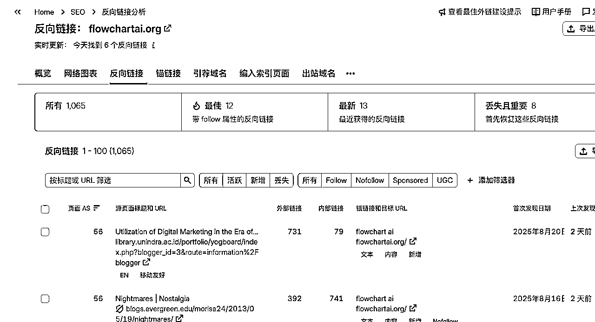

第二个就是这里的添加筛选器，我会选择引荐页面平台这里选择博客，我们可以找到这个网站的博客类型外链，我早期的外链基本除了第一批是一下导航站，后面大部分都是博客类型外链，为什么选择博客类型外链，当然就是因为博客类型外链好获取，博客外链就是别人的博客文章，我们去下面的评论区留言的时候带上我们自己的网站的链接就获取成功了

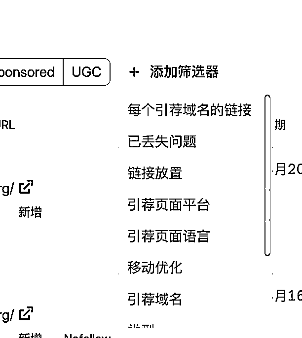

这里就是一个博客外链的例子，就是别人的文章下面的评论区，当然也并不是全部的都长这个样子，，而那些人评论中的标亮的超链接就是别人网站的外链了，这些外链可以被Google发现从而给网站增加权重，当然前提是这些外链质量过关

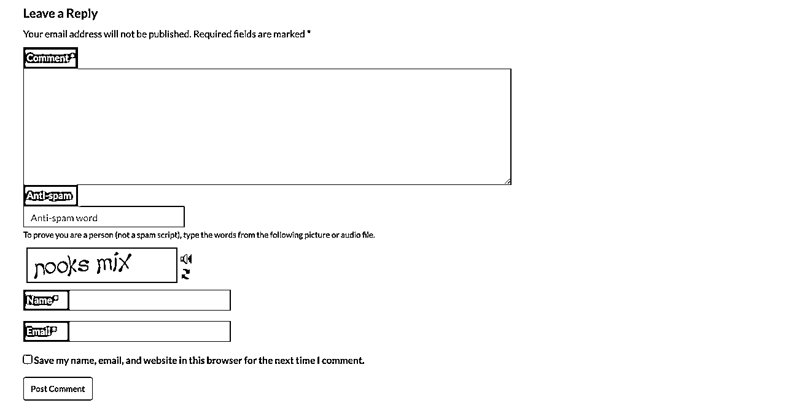

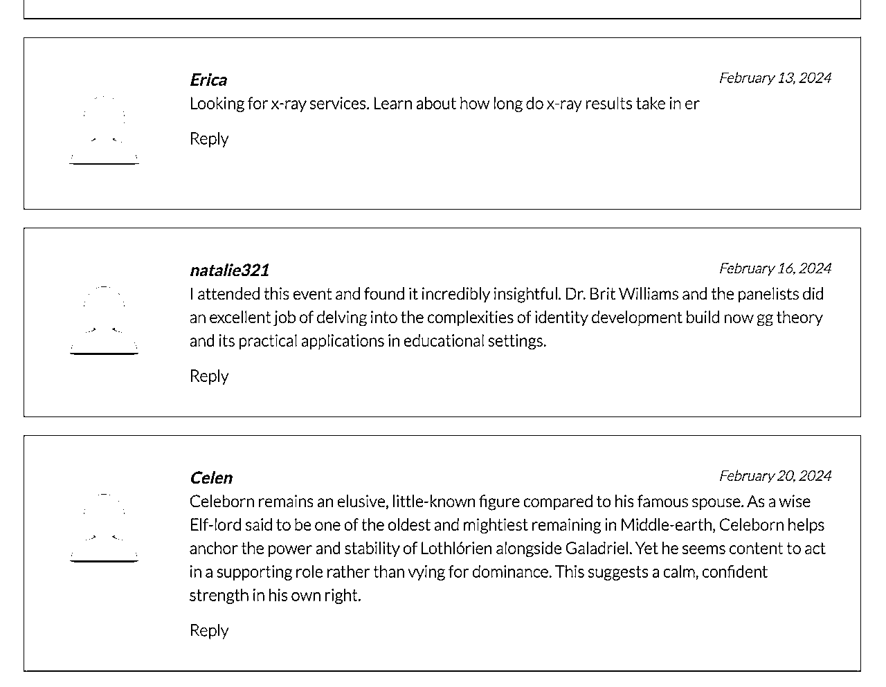

#### 如何判断外链质量

那么什么样的外链是质量过关的甚至是高质量的外链呢，在semrush我就会直接看这个网站的AS，AS是semrush的算法，一个网站的AS越高，他的权重就越高，他的外链就越有价值，就更值得我们去获取，所以在我们上一步去抄别人的作业的时候我还会加上一步，就是看他们网站的AS评分，一般我都会尽量选择AS在20以上的外链去加，10甚至更低的外链也不是完全不加，但是也只加一点，不能让这种低质量的外链占据我网站的大部分，当然这个是我的标准，不一定是最好的，可能依然会加到一下质量没那么高的外链，但是网站刚上线什么都没有，这个时候有总比没有好，当后面拿到更靠前的排名了，或者排名前进不动了，这个时候再去进一步把控外链质量，加更多高质量的外链也不迟

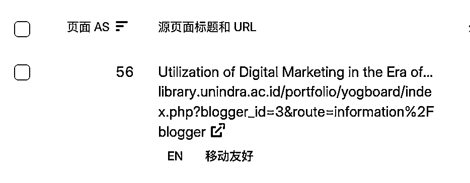

#### 一个高质量外链

最后，推荐一个高质量外链，大家可以在github的一些榜单上去提交自己刚做出来的网站，可以获取GitHub的高质量外链，有的还可以带来不小的GitHub的流量，我举一个例子，这个GitHub项目下几乎每天或者隔几天就会有人来提交他们做的项目，可以直接通过给作者提issue的方式来申请加入自己的产品，作者审核通过后你就拿到啦一个外链，github上还有更多这样的列表项目可以获取外链，可以问ChatGPT来获取更多，大部分的其实是提交pull request的形式来提交的，也可以让gpt来指导完成这里就不多做演示了

https://github.com/1c7/chinese-independent-developer

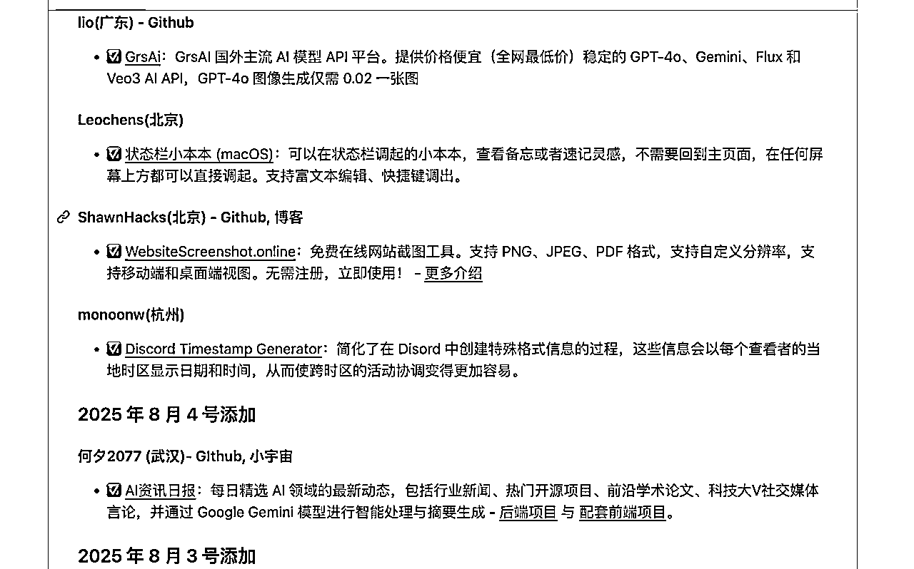

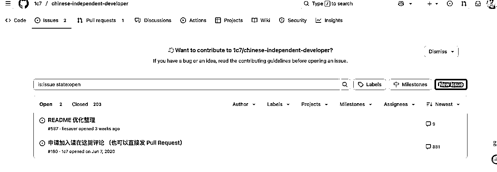

还有更多其他的外链比如说客座文章，别的类型的网站给你外链这种，一部分是你自己花钱买可以获取，另一部分就是当你的网站做的还不错，有意思有价值的基础上，有一些网站会给你发邮件说希望跟你合作或者问你需不需要客座文章或者pr的外链这些，我这个网站就拿到了一个类似appsumo的网站的合作邀约，拿到啦一个DR70的外链，还有一些其他的客座的询问不过那些大部分是推销哈哈，这方面我接触的也不多，就不再多做展开了，总之偶尔看一下邮箱说不定会有惊喜

然后，外链也是一样，重在坚持，每天不用发很多，但最好可以每天发，我现在保持的频率是每天每个网站发10条左右的外链，然后做了一个网站就放那里加外链然后就去做下一个网站了，seo是一个厚积薄发的过程，只有中间做了足够多的积累最后才可能看到成果，希望我的这些经历可以帮到大家

### 优化效果

#### 网站流量提升

首先是外链可以带来流量，上面提到的那个GitHub外链给我一个网站带来了一部分冷启动的流量，左图是网站刚上线几天时候的数据，一天就只有可怜的个位数访问，右图是加上了GitHub的外链和一些其他外链之后当天GitHub来的流量就超过了三位数，后续流量虽然不多但也还算稳定，每天也有三位数的流量，所以这个是第一点，好的外链可以帮助你的网站完成冷启动，可以带来一部分的初始流量

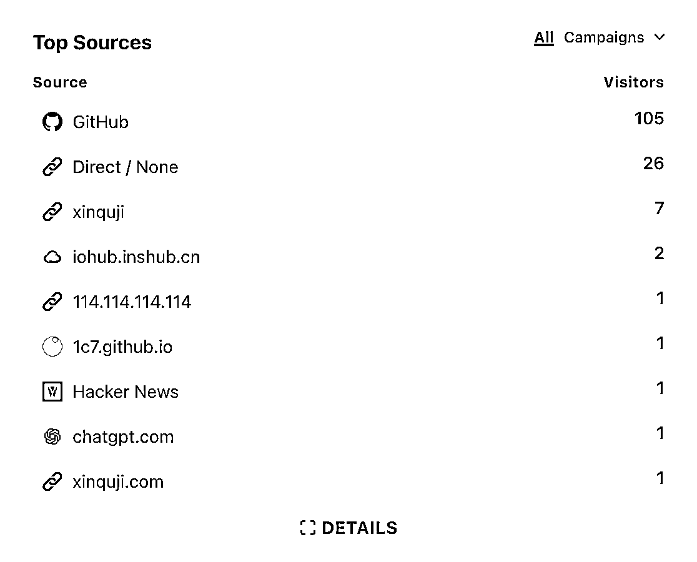

#### 网站权重提升

第二个是网站权重的提升，这部分的提升带来的优势是你在Google眼中的信任度的提升，这个网站刚上线的时候DR（domain rating域名权重）是0，经过一段时间的加外链目前已经来到了22，当然这个还是有延迟没有全部抓到的，实际上这个网站的外链现在有更多，随着你的网站权重越来越高，你拿到Google排名的机会也越来越高，同时你拿到的排名也就越来越稳固，别人就越难和你进行竞争，同时也可以看到这个词在flowchartai这个词已经到了第3的位置，当然这个词没什么人搜，更大的那个词 flowchart ai排名还没完全站稳，效果现在也还没这么明显，

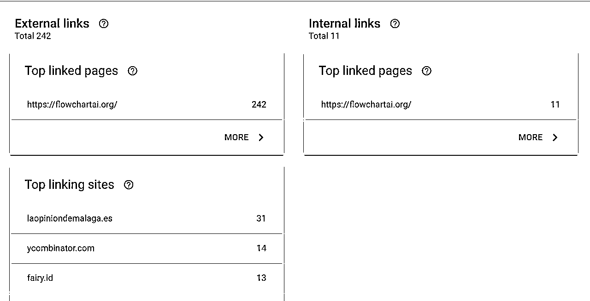

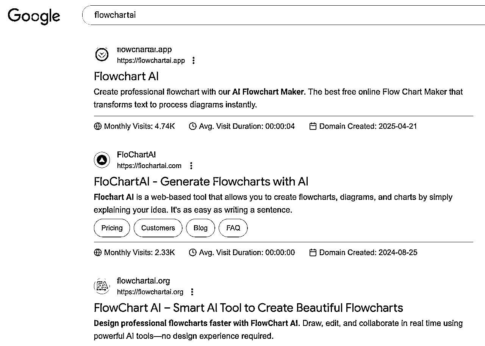

## 写在最后（总结复盘）

SEO最大的困难在于耐心，因为几乎除了最后增长的那一下，你前面都几乎看不到任何效果，所以需要我们有非常的耐心去等待出结果，并且SEO是一个拼细节，拼执行的活，你需要话大量的时间学习网站的基础的站内SEO要怎么设置，网站的外链要怎么加，找到好的外链需要时间的积累，同时每天还要坚持发外链，长时间看不到结果就容易放弃，我对此的解决办法是多做，做完一个网站之后就放在那里，然后做下一个，但放在那里的也不是不管了，至少要每天坚持加外链给他，如果有时间的话，还有定期更新页面，上新的页面保持网站的新鲜度，但这样你就不会一直盯着一个网站看，同时你的成功率也会更高，最后我觉得是SEO确实困难，但SEO的收益也是足够可观的，并且有足够多的成功案例已经在前面了，剩下的做就完了