# web出海从0到1：感谢生财，让我赚到第一笔美金

> 来源：[https://pghe992qie.feishu.cn/docx/QnpedKt4UowkFgxpkF9caBmGnBc](https://pghe992qie.feishu.cn/docx/QnpedKt4UowkFgxpkF9caBmGnBc)

大家好，我是星城，刚参加完航海家AI大会，回来触动很大，依旧秉持着越分享越幸运的原则。从5月底做web出海，零基础，不懂代码，英语很差Web出海新人，需要借助翻译器，到8月9日开单，现在也能陆续开单。其实我觉得可以更早开单，因为一开始我流量不大，我以为没什么人买、就懒得接支付，而当我一接通支付后，审核成功后，当天就开单了，这里可以笑哭。

能开单和未开单，整个人的精神状态和感觉都是不一样的。当时是开着车带孩子去玩，谷歌突然收到creem的短信通知，至今记忆犹新，这个场景我应该会记很久很久。或许只有做过的人才知道，跨越这个门槛有多艰难，它不仅仅是一笔收入，更是一个强大的正反馈，将我的状态从“可能行”彻底切换到了“我做到了”。它验证了路径，点燃了信心。

今天，主要分享也是复盘一下自己的方法论，希望能对圈友们有所帮助，一起成长。

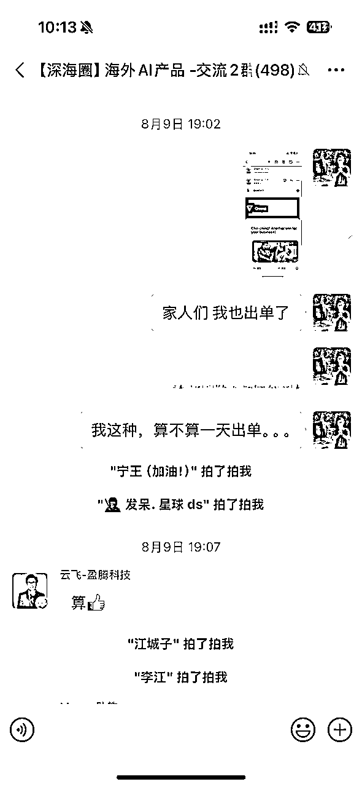

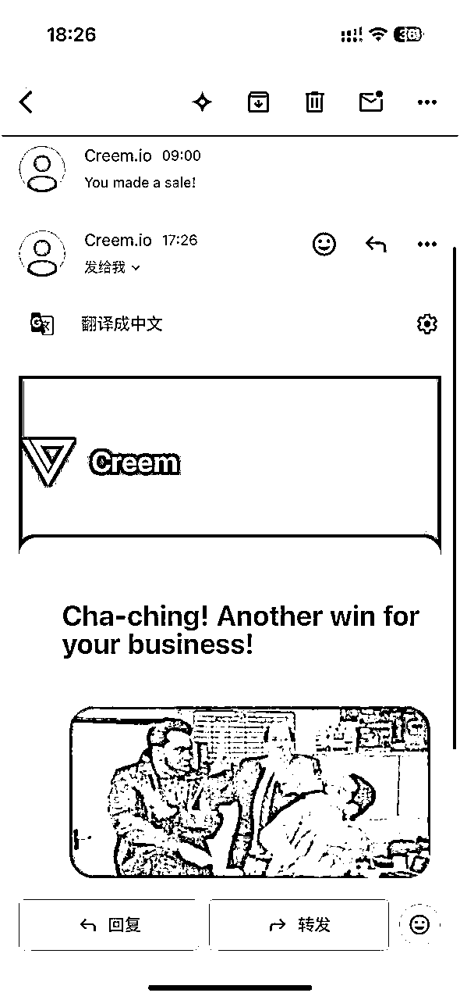

* * *

# 一、相信AI，相信生财，相信未来

在5月底的时候，报了刘小排深海圈课程，因为我是生财的重度用户，亦仁哥现在整个生财战略目标都往AI靠，所以我也坚信这个方向是对的，就往AI方向去做。

我想做点有门槛的，加上老自己觉得创意无限，以及经常看刘小排的文章，学到很多知识，所以我就报了深海圈的课程。近一年期间不断听别人说AI+出海，是个大机会能拿到大结果，反正亦仁也这么说了，也让我更笃定这个事情，我就想做这种「有门槛，有红利，天花板足够高」的事情。

前段时间，亦仁发了这么一段话，震撼到我，当晚睡不着：

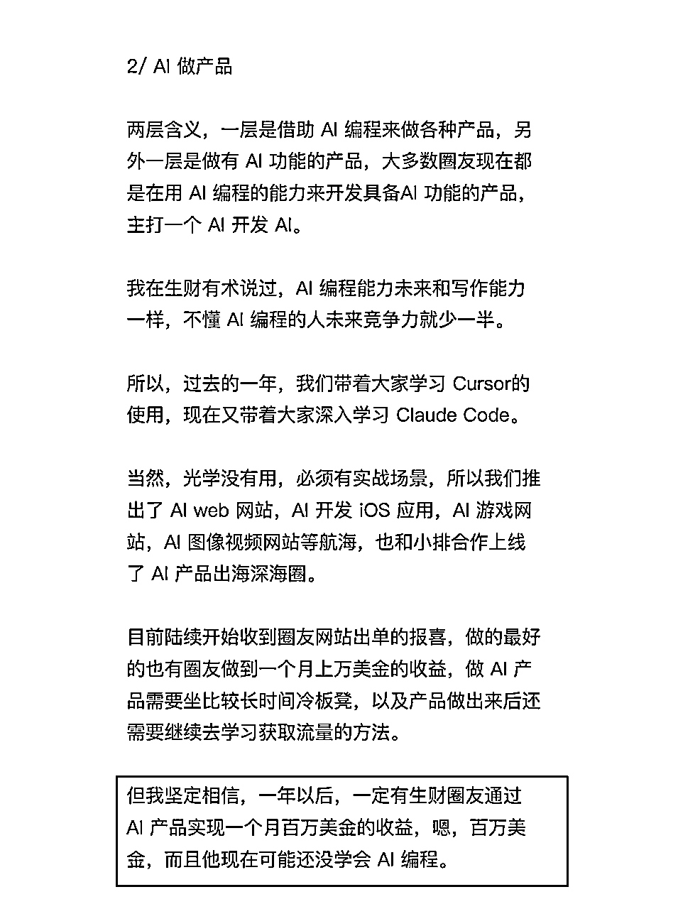

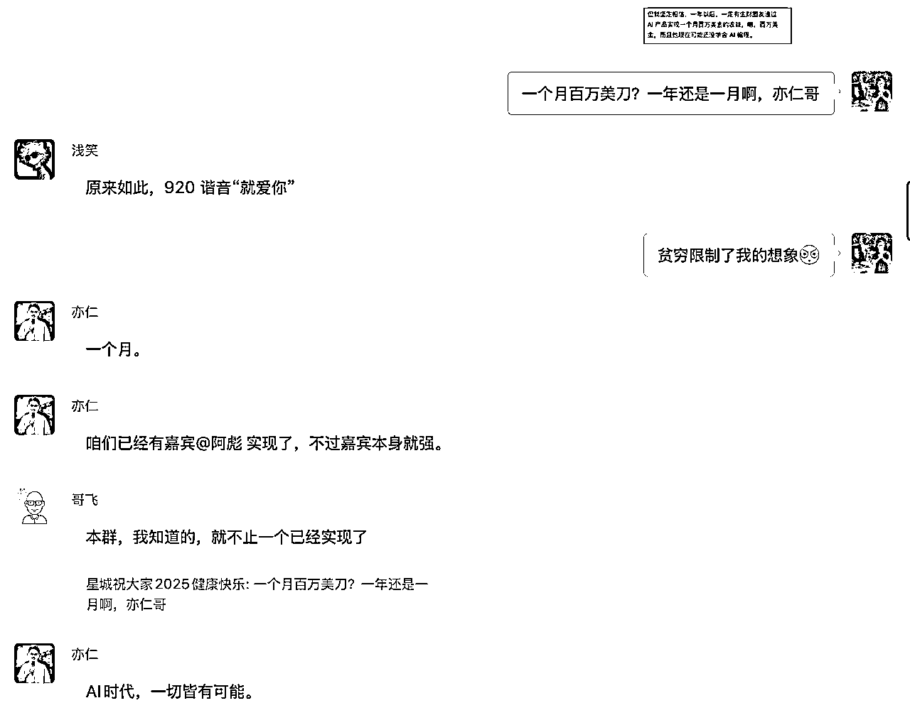

当时我还特意在群里问了亦仁，他准确回答“一个月”。

虽然现在我离这个还特别远。但我们之前做国内小红书，谁都不敢说一个月可以700w人民币，但在AI出海领域，它真实发生了。所以，AI的想象空间非常大，一切皆有可能。

这背后不是运气，而是AI带来的“技术平权”，让个体有了打造高价值产品的可能。而“出海”则意味着，你面对的是一个全球化的、付费意愿更强的市场。

所以，我的第一个突破点，是认知上的突破：在正确的时间，选择了正确的战场。剩下的，就是执行。

# 二、参加线下局：圈子比个人努力更重要

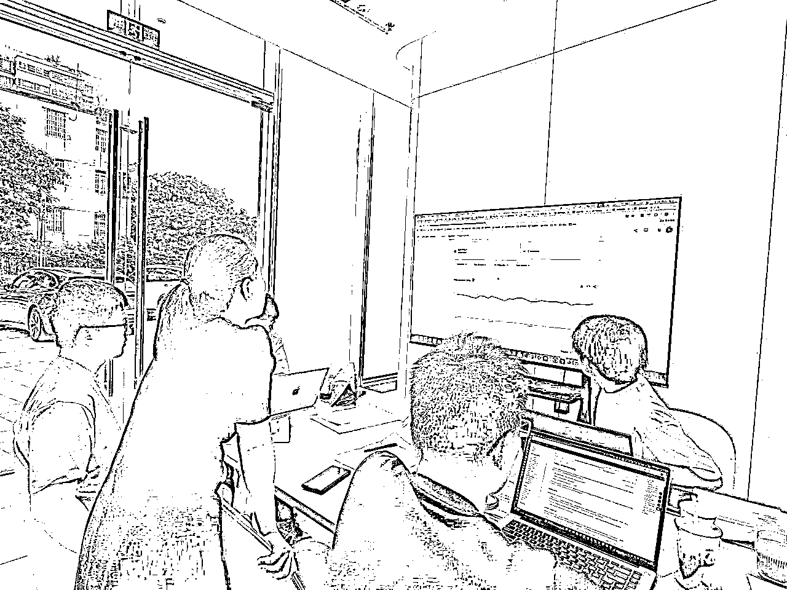

对于我来说，出海+ai是我的新领域，我对这个领域还是非常小白的阶段。我觉得环境对人的影响力很大，自己埋头吭哧吭哧干没什么反馈的话，很容易放弃。而且线上聊和线下聊，差别太大了。

我的策略很简单：主动走出去，构建我的信息与人脉网络。

也是因为这个契机，我了解到课程以外的东西。比如怎么找关键词，怎么找需求，怎么判断这个关键词是否值得去做等等。因为组局里面有产品经理，有UI设计交互，有后端程序员等等。每个人发表一下意见，有点类似初创团队的感觉，有更多不同的视角。这让我马上有了出海做“生意”的视角。

其实我们出海做产品，就是做出海生意。AI编程只不过是用AI实现了技术平权，更快更低门槛的做出一个AI产品。而你把出海当成生意，你就要去涉及到完整的闭环，如我们常见的：

流量x转换率x客单价=收入。

对于出海产品来说，流量等于SEO优化、广告营销、社媒引流（阿彪三板斧参考）

对于出海产品来说，转换率等于UI界面，产品功能描述，用户交互体验

对于出海产品来说，客单价等于竞品分析，API调用的公式技术计算

把这些搞清楚了，就可以拿到实实在在的收入。

参加组局，大家人都挺好，都乐意分享自己，我也建议大家可以多参加这类组局。

当然，你可以勇敢一点，自己发起组局，收获更多更大。

线下组局给我三类价值：

*   信息差：关键词的判断方法、需求验证、竞品对比的捷径。

*   人脉差：UI、后端、产品各抠一把细节，少走弯路。

*   反馈快：现场“拉通一个闭环”，回去就能落地。

也是因为组局认识到人的缘故，我链接到超哥（stewart），后面我和他有更多密切的交流。包括接支付我都是请教他，优化了接支付的流程。当时我还特意去他公司楼下的星巴克，我们两台电脑，对着接支付。

小排课程也有讲creem怎么接支付，但对于我这种特别小白的人来说，与其自己摸索，不如直接请教已经接过的人。超哥人也很奈斯，我觉得这样也是一种节省时间成本的方式。关系都是麻烦出来的，也因为接了支付，后面出单了，有更多正反馈，就有更多的交流。

我一直认为，买课程、进圈子，买的不仅是知识，更是链接这些关键“节点”的门票。

# 三、creem，接支付，3分钟就接完

支付环节，是所有出海业务的“临门一脚”。

当时我是用cursor接的，模型选择是claude 4，优化后提示词，可以做到一键梭哈，接通还是非常快的。

现在有claude code 和GPT code，那就更加简单了。按照我这个提示词去做，你不懂的也可以来问我。

可以看看这里，之前公众号有写过：

X上疯传 3分钟接Creem支付，出海上站赚美刀！

简要说明一下：

本地环境测试接入：

帮我在首页添加pricing模块，样式参考[对标网站]。在用户完成支付前，关键功能需要上锁，并引导用户进入Creem支付流程。

*   Creem产品链接: [你设置好的产品链接]

*   测试API URL: https://test-api.creem.io (请将此URL放入环境变量)

*   测试API Key: env.CREEM_API_KEY

测试 Webhook URL: [你自己的公网测试 URL]

测试 Webhook Key: env.WEBHOOK_API_KEY

*   参考代码: [支付文档的官方链接]

发完这个提示词后，测试本地跑通后，再发下面的提示词：

现在，请你把creem产品id，api url，webhook url，webhook key 等要用的，测试环境和生产不一样的参数，全部放 env，接下来我要进行creem的正式接入。 现在，我需要改成正式的creem环境，creem支付，产品链接：xxxx API key在env的CREEM_API_KEY webhook url:xxxx，API key在env的WEBHOOK_API_KEY，代码你可以参考这个链接（支付手册官方链接）

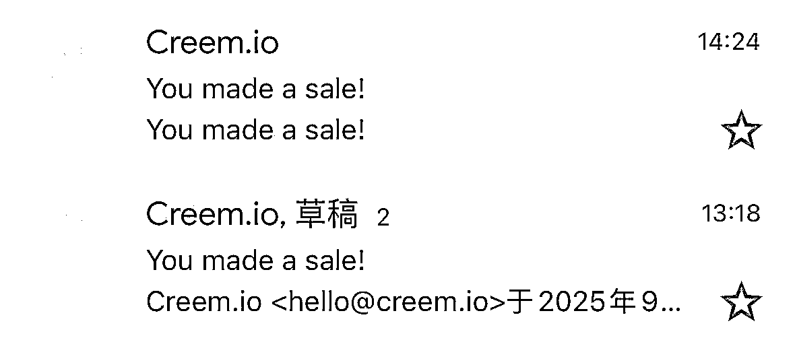

然后，我们在creem后台进行操作以下步骤：

1，creem申请前，一定要把测试跑通后再推送到远程上，如vercel，这样审核人员才能看到。

2，国内支付支付宝或微信，建议接入zpay，支持个人，不需要营业执照。

3，window系统如果ngrok无法下载，可以用vercel来做公网测试webhook

4，让AI帮你写规范文件，这样更容易审核通过

# 四、不懂就问：从“闷头干”到“抬头问”

这里是有小技巧的，通常我卡住一个问题，我会对这个问题进行评估，如果我觉得2小时能搞定，但我一天都搞不定，我就不能再去这里花时间了，我就赶紧去问人，立刻求助。

提问三件套：

上下文（我在做啥）/ 期望结果（我要啥）/ 已尝试（我做了啥）。

自己表达越清晰，给对方参考的背景资料越多，你的目的越明确，得到的效果就越好。这里有个禁忌，就是如果你自己都没尝试过，遇到不懂的啥都问别人，大概率别人会觉得你在浪费他的时间，自然就没有好果子吃。所以，一定要先自己尝试，尝试不出来，再去问别人。

这里感谢的人就很多啦。这个可以提示一下大家，不要抓住一个人一直问，因为人家也会觉得很烦，特别我们还处于小白时期，问题没什么营养不说，也浪费人家大量时间做答疑。所以我一般都问多个人，这样就不会让别人觉得很烦躁。

我一直都觉得，买课程，除了能学到课程知识外，还有一个特别的作用是能找到志同道合的人。我也一直强调说过，圈子比个人努力重要得多。圈子会带动你去做，会让你有正反馈，也会刺激到你。

这里特别感谢@tc，@location，我遇到不懂的问题，他们还会语音和我解答。还飞书给我开了小课，特别感谢

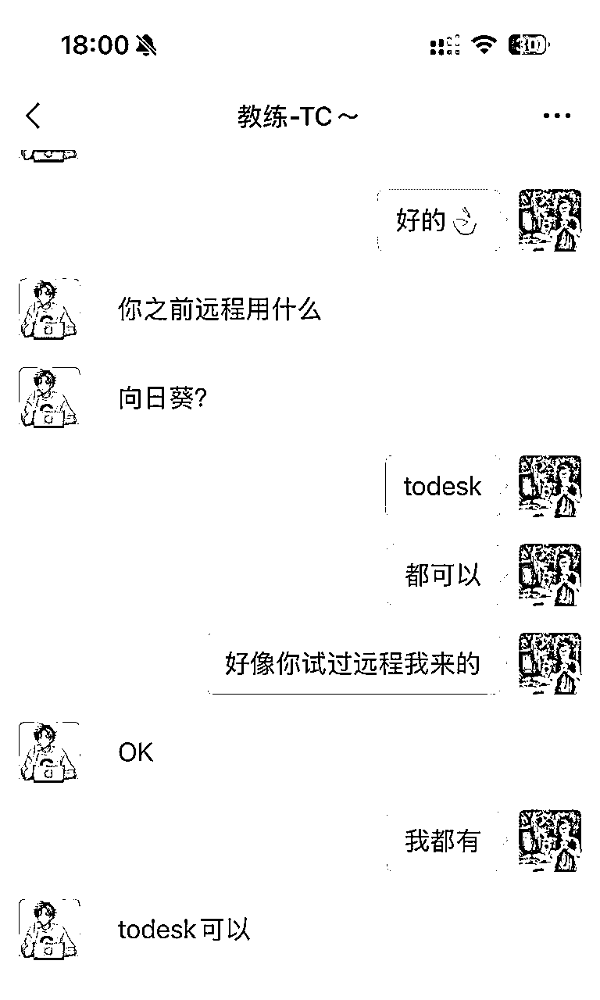

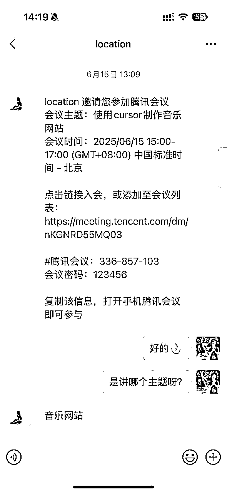

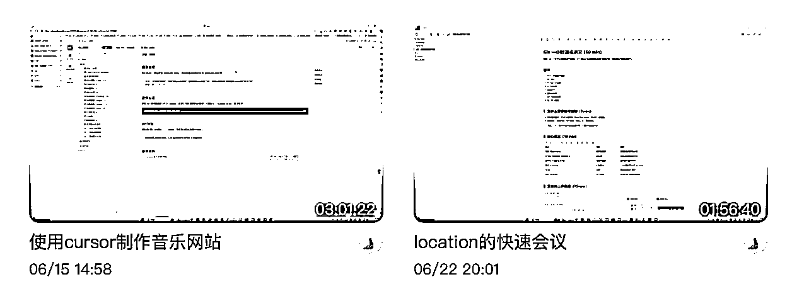

他们真的太友好了，直播和我拆解他自己的网站，我也跟着云上站了一次。所幸我也没辜负，我后面也是看完又重新看一遍录播去了。

其实我问的人还挺多的，就不一一截图了。感谢各位贵人相助~

# 五、流量启动：可复用的SEO优化流程

我的网页主要是靠SEO的优化+发外链

大家可以直接下载AITDK插件。https://chromewebstore.google.com/detail/aitdk-seo-extension-traff/hhfkpjffbhledfpkhhcoidplcebgdgbk?hl=en-US&utm_source=ext_sidebar

里面有很多功能，把里面能优化都都去优化，直接丢给CC去优化就可以。以Title和Description为例子，我来演示一下：

打开，similarweb，在关键词研究——关键词生成器中，输入你的关键词。注意，如果你的关键词有空格，要输入空格，不要连着打。

我们重点留意「语句匹配」和「相关关键词」。

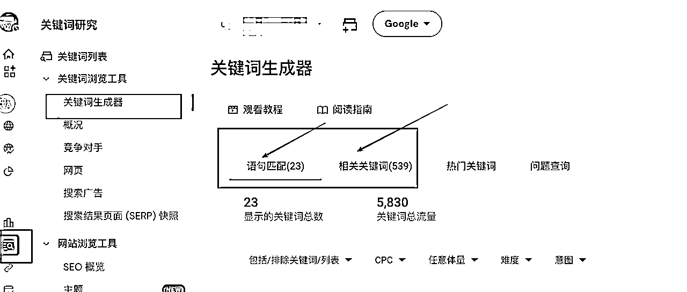

把两个前100的关键词进行整合，去重，依次由多到少进行排序。如果是小众词，其实并没有这么多，大概自己过一遍。

我发现一个有趣的现象，我的相关关键词，竟然出现了youtube和github这类词，而且流量惊人。

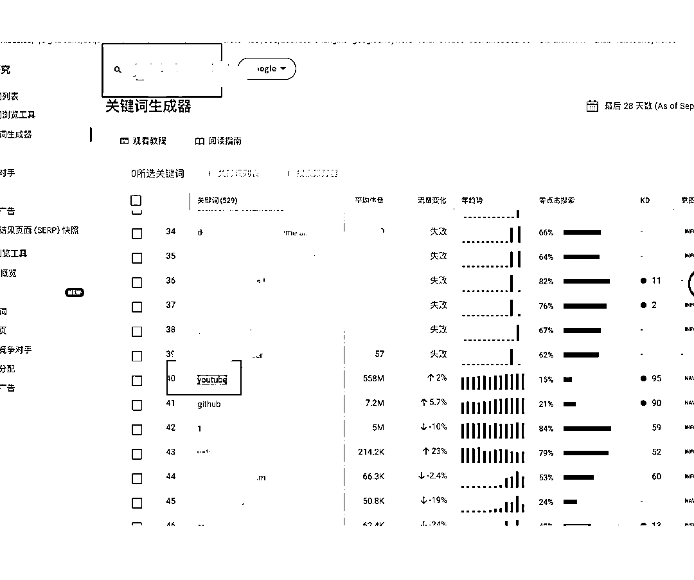

于是我去请教哥飞，哥飞告诉我，这类词不相关的，可以去掉，以及你也可以把自己的域名代入xx+youtube，你搜一搜，就知道怎么回事了。

当然，你也可以这样操作来验证：Google 搜索 TOP3 打开，确认意图一致，看他们的关键词是写什么。因为英语单词语义都不一样。

有个小思考，如果发现有youtube的词，的确可以去站内搜一下，你会发现，很多人在那里获取流量。这里给到我一个新启发，我不一定只是优化网站去获客，也要看网站类型。如果网站是适合传播，适合玩的，那就可以去youtube和tk之类的社媒工具上去获客。

而在搜索相关关键词中，发现youtube，去youtube搜了后，的确很多人在那里获客。

回到主题，你就会发现，其实相关关键词中，并不能单纯以搜索量进行排序，你还是需要去看，哪些词才是“真”关键词。

显然，youtube并不是我网站域名的主要关键词，它只是一个视频获客渠道，很多人在那里发我关键词相关的视频。我也知道接下来我会通过社媒短视频的方式来进行获客。

好啦，通过刚刚的步骤，我就会把找到的关键词发给cursro任何AI工具，让它基于我的网站项目，进行讨论，从生成出Title和Description。

这个过程，需要你多次磨合，不是说一次就可以拿到答案的。

我们也可以借助tdk插件，它有个参考标准，Title是60个以内，Descripiton是140~160区间。在本地测试的过程中，tdk也是可以看到3000窗口的，也挺方便。

更多操作方面，我建议大家可以看看TC这里有介绍，我就不过多讲了，因为我很多东西也是跟着他学习的 ，还有就是哥飞，哥飞里面的很多内容，我都是按照公众号写的东西去优化，反正一路路顺着优化。

反正不懂就问cursor，当时cursor不卡，我觉得挺好用的。

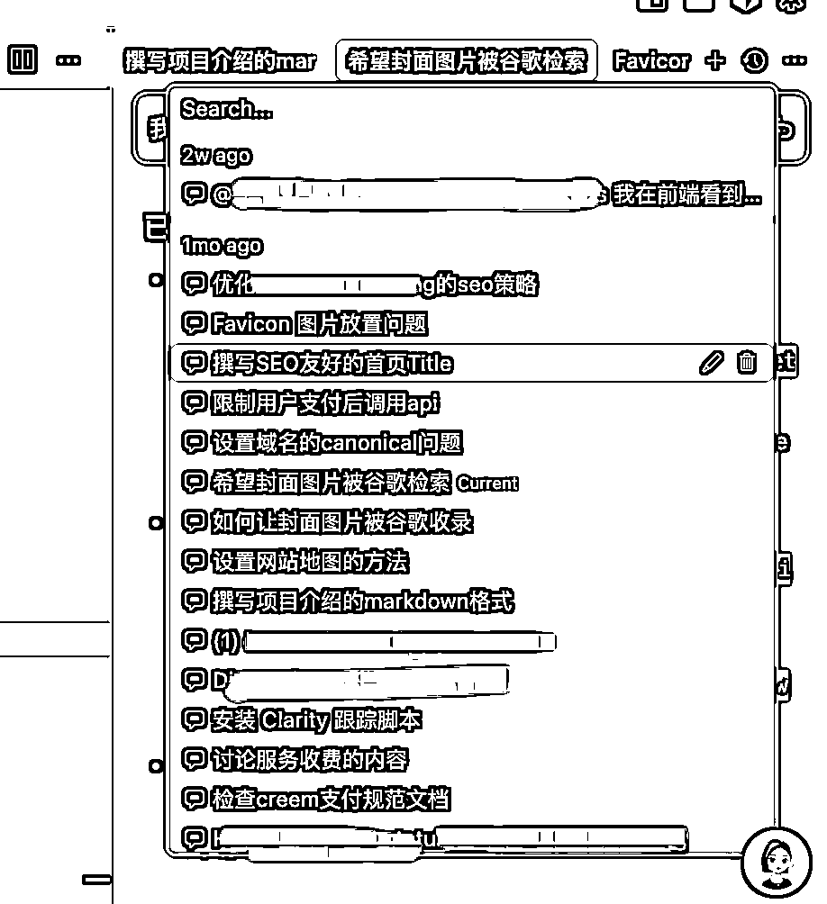

现在，有更好的AI工具和模型，而且这玩意还是一直发展的。所以编程方面，大家真的不用太担心，会一直越来越容易。

# 六、权重积累：体系化的外链建设

我用的是这段话，直接发给dia浏览器的chat模式，让他来写。不需要安装什么插件工具。dia目前只支持苹果用户。如果你是win，可以用豆包，QQ浏览器，都是可以实现的。

格式如下：

[我的域名]是我的网站，它是一个[功能描述]。我现在需要给网站发外链，请帮我写一些宣传文案。

要求：

1\. 内容自然，与外链网站的主题贴合，软性植入，不要硬广。

2\. 文案中必须包含我们网站的锚文本链接。

3\. 英文撰写，内容不宜过长。

4\. 最终输出格式为包含锚文本的HTML代码。

找外链的方式，也很简单，有两种方式，一个是在博客等可以发的外链地方去发，一个是在通过工具去查竞争对手的网站，发过什么外链，我们也同步去发。

总之，他有我也有，他无我也无。这样谁还打得过你？

怎么查看竞争对手发了多少外链，可以在semrush里面找，路径如下：搜索栏输入域名——域名概况——反向链接

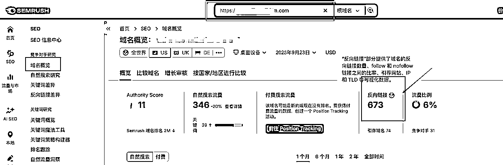

点击里面的反向链接，选活跃，所有。

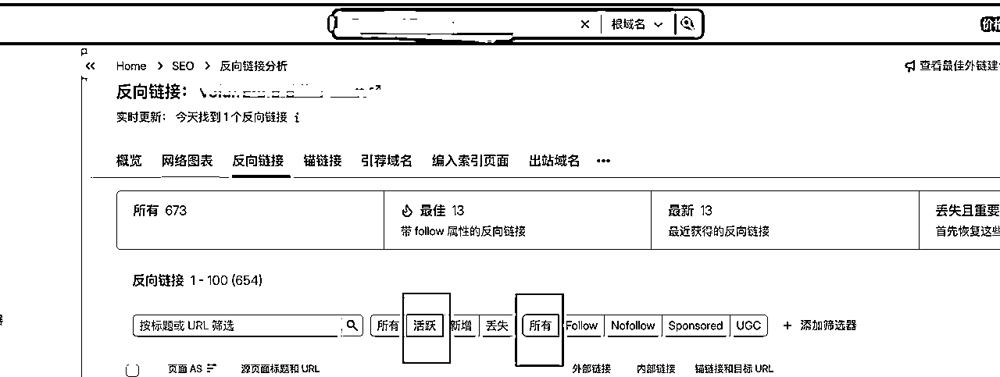

里面就会显示竞争对手的网站。

我现在的每天工作节奏，都是发20~50条外链，反正有空就发发。最好你要把外链做一个exc表进行整理，这些都是自己的资源，要积累下来。

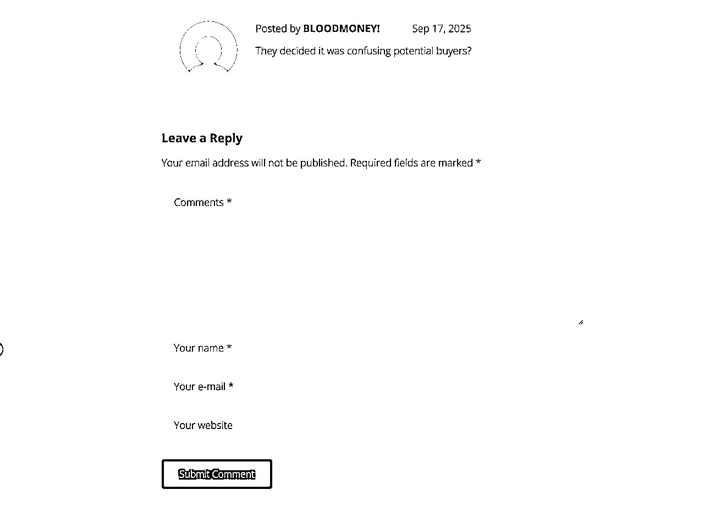

博客外链，一般都是在最下面，按照要求提示，选这个发出去。用dia浏览器写好的chat，就可以。

关于工具的选择，我们做出海的，一定是需要SEMRUSH和similarweb的，正版太贵了，我们要去淘宝/闲鱼买共享版本即可，大概75元/个月

后面还会打算尝试社媒、广告相关。这点会持续去突破，大家也可以去尝试下，也欢迎准备在做这个板块的圈友，多和我交流交流，我准备尝试后又更新一篇帖子看看？如果感兴趣，也可以点个赞，后面更新通知你呀，哈哈。

# 七、关于产品的一些建议：

### 1、首页首屏只做一件事：

一句痛点 + 一键体验/上传，别放三种按钮。刘小排老师说的，要让用户觉得简单，把难度留给自己。

任何让用户思考和犹豫的设计，都是在把他推向你的竞争对手。所以，你的首页首屏（用户不用滚动就能看到的部分）必须像一把锋利的尖刀，直插核心。

一句痛点文案（Headline）：不要说“我们是一个强大的AI图像处理平台”，而要说“5秒钟，让你的产品图惊艳全场”。前者是自嗨，后者是价值。直接告诉用户，你能帮他解决什么切肤之痛。

一个核心操作按钮（CTA）：整个首屏，我只给用户一个最明确的行动指令，比如“立即上传图片”或“免费生成头像”。砍掉所有次要按钮（如“关于我们”、“博客”、“联系方式”都放在最下面），因为在用户体验到核心价值之前，那些都不重要。把复杂留给自己，把简单留给用户，这是产品的第一性原理。

### 2、“未支付加锁”+ 明确的解锁提示：让用户知道“差一步就能用”。

先给糖吃，再设门槛：让用户在不付费的情况下，就能体验到产品的“Aha! Moment”（惊艳时刻）。比如，AI生成图片后，可以展示带有水印的低分辨率预览图。用户亲眼看到了结果，感受到了价值，此时他对产品的信任度和渴望度是最高的。

“未支付加锁” + 明确解锁提示：当用户想下载高清无水印原图时，点击下载按钮，此时再弹出付费解锁的提示。这个提示文案至关重要，不要简单地说“请付费”，而要强调价值，只需一次性支付 [价格]，你将获得：

*   超清分辨率：适用于打印、设计等任何场景。

*   纯净无水印：让你的作品完美呈现。

*   完整使用授权：可用于个人及商业项目。

这让用户感觉不是在为“功能”付费，而是在为他刚刚创作出的“作品”买单。

### 3、用“一页产品”起步：只做一个明确场景 + 一条清晰转化路径。

我们这种独立开发者，一开始不要想着做个“平台”，大而全，目标用户就不精准，不要总想着一上来就做一个功能大而全的网站，带用户系统、带社区、带积分……结果就是，耗费数月甚至一年，产品还没上线，心气早已磨没了。

正确的姿势，我认为是，用“最小可行性产品（MVP）”的思路，先跑通一个最小的商业闭环。

*   只做一个核心场景：你的产品只解决一个，也是最痛的一个问题。是做AI证件照？还是AI虚拟试穿？选定一个，把它做到极致。忘掉其他所有“也许用户会喜欢”的功能。

*   跑通支付和交付链路：你的首要目标，不是获取100万用户，而是让第一个用户成功付费，并顺利拿到他想要的结果。只要这个“付款 -> 交付”的链路跑通了，你就顺着去找到对应的渠道和优化seo。

以上都是我对产品的一些个人看法，可能不是很成熟，如果大家有什么不一样的观点，也欢迎讨论。

# 八、最后感谢

感谢生财有术这个社群，大家都秉承着越分享越幸运的价值观，也是因为有这样的价值观，我才能更好的融入这个圈子，不懂可以到处问人，基本都可以拿到结果和答案。感谢刘小排，感谢亦仁，感谢哥飞，感谢tc，感谢location，感谢st超哥，感谢FanG，反正要感谢的人太多了，如果没写上，希望不要怪下来哈，我还是爱你们的~

有时候我想放弃的时候，我又会想着，之前麻烦了别人这么久，如果啥成绩都没做出来，都怪不好意思的。所以还是咬咬牙，一定要出成绩，一定要赚到美刀。

选择比努力更重要，这次的结果是小结果，但也迈出了最难的一步了。后面我认为应该会很快就上道的，对自己还是非常有信心。圈友们也要对自己有信心，要多把手弄脏，不懂就多问人，没什么不好意思的，顶多别人拒绝你。亦仁大佬说过，没有任何一个大佬，会拒绝好学，真诚问问题的人。

如果大家有什么疑问，也可以多多交流。我也是遇到各路贵人才能让我快速上道，所以一定要发挥生财精神~

加油，咱们一起生财有术！！！