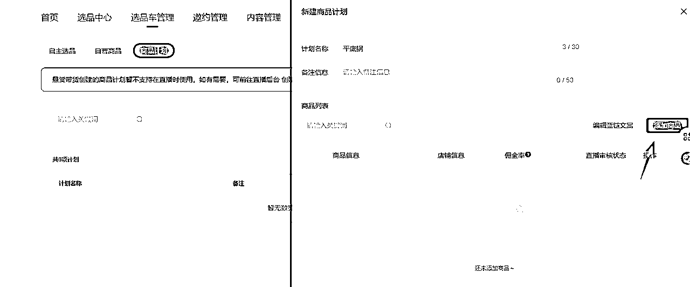
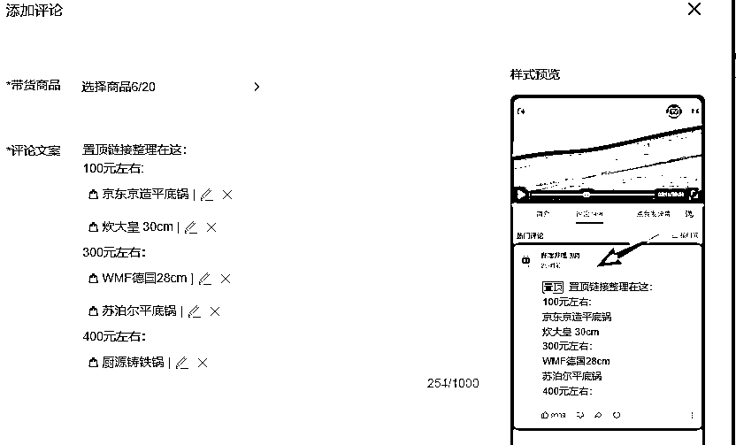

# 实操一个月B站好物，我通过1单佣金，挣回B站深海圈门票，这里面我做对了什么？

> 来源：[https://px1hmn4sqj.feishu.cn/docx/CH4xdxHLYolvx3xsXTRcfb1YnFc](https://px1hmn4sqj.feishu.cn/docx/CH4xdxHLYolvx3xsXTRcfb1YnFc)

# 一、经历介绍

大家好，我是王小小，入生财也有几年，在生财里面也找到了不少的项目，比如21年的时候，看淘宝虚拟帖子并把帖子打印下来，一步一步实操出来20多家淘宝虚拟店铺

22年在刷帖子的时候，刷到了影刀这个，后面通过帖子和搜索b站up主的视频（这里就慢慢接触到b站)，通过影刀官方课程和b站某个up的视频，慢慢学会了影刀，用影刀搭建了不少的应用

23年跟着公号爆文航海实操一步一步操作，也出了不少爆款的（23年的航海基本就是死磕公号）

B站好物，是在6月的时候通过超级标知道的，后面通过星球里面的资料学习，7月初就在操作，中间在心态上一直是断断续续的，想放弃又觉得不能放弃，后面意识到，这样不行，为了让自己，安心做B站好物，索性加入了深海圈，进深海圈之前就给自己定了个目标，一定要赚回门票费用，结果一单的佣金，就赚回门票费用

这期间我做对了什么？我的心态又是怎么转变的？

# 1.做b站好物心态的转变

我是直接从公号爆文项目转到B站好物项目上，熟悉了爆文的操作流程，到B站上操作就有很多的不适应，尤其是心态上有很多的不适应，我先说说我的不适应。

1.从图文为载体突然转到以视频为载体，恐惧视频拍摄和剪辑，镜头里面的自己，表现的很僵硬。

2.拍摄一边一边又一边，加上拍摄和剪辑时间，一起花了6个小时

3.商品单价低，1%-3%左右的佣金，打不住自己花的时间成本，尤其是这点是最不适应，心态上就更加麻了

4.有播放量的强迫症，这个习惯是在公号爆文项目养成的

当播放量不高，没出单或者出单的佣金低，操作这个项目的时候就一直是断断续续的，直到我出了接近3千多的单子，佣金有50左右，这个收益相当于公号1-2万的阅读量，单子完成以后，佣金拿到手，我是超级超级的兴奋，之后让我意识到，原来在B站上有人会为高客单价买单，我明白了这点以后，在心态上就明显就有很大的变化，开始认真选品，行动上慢慢有动力，也不拖拉和变形了，心态转变一周以后，出了一单2千多佣金的，就更加让我确定b站这个项目，能深耕的做下去

恐惧视频拍摄和剪辑，就给自己灌输这样一个观点，相比没钱，镜头的恐惧，周边人认出来等，这些都不算什么，我是通过自己的双手挣钱，我怕什么，有什么不好意思的，没钱才会不好意思的，我挣钱，我快乐。

# 2.B站好物值得深耕

21年学习影刀工具的时候，我其实已经接触到B站这个平台，相比其他短视频平台来说，它娱乐的内容很少，更多的知识分享的平台，这点，就跟知乎平台很相似。我21年有尝试过写知乎，入场的时候，太晚了，无奈只能去研究淘宝虚拟。在说会爆文项目，做过爆文的朋友都知道，爆文号爆了以后，你的收益也会很高，但同时这个号离注销也不远了，对于账户来说，它一直没有沉淀，一直在注销，注册中反复循环，时间长了，人会麻木，疲累。

这时候，刚好看到b站好物，想着看能不能有机会的，进去之后，发现机会很大（我在后面选品的时候，会讲），现在的竞争环境，不是很激烈，B站的分佣机制，收益是完全给创作者。

我出单的视频播放量不高的，但同样也能出单，现阶段是发了视频，就有机会出单挣钱

放上京粉8月的数据，总GMV4万3，佣金2100，通过数据看出，我的订单量其实不是很多，佣金能挣回B站深海圈门票，其实就是靠一单，我会在选品内容说下，我是如何选到这个品，靠这一单，挣回深海圈门票的

# 二、选品（这部分是重点内容）

现在到了最重要的部分，选品。在电商里面，选品真的定生死。

我想大多数人，跟我一样认为b站里面大多数都是数码类，这其实对女生是不太友好的，但又想做b站，这咋办？

后面我想到了一个最笨且最有效的办法——把京东排行榜的类目采集下来，找到一二三级类目词，通过数据透视表分析类目人数 ，找到相应的产品词，在把产品词放到去b站分析竞争程度，最终找到适合自己的类目。

通过这个方法发现也有不少适合女生的类目，比如零食测评，个护清洁用品，宠物用品，母婴用品、厨房小电、生活电器类，床上用品，体育用品，家居饰品等的，也有不少适合女生的类目。

在实操过程中发现b站里面其实也有不少高付费的人群，愿意在里面高消费的，所以我们在选品的时候，就可以考虑到商品单价，佣金比例的商品，我后面会说下，我在这里踩的一个坑

我具体说说，我是怎么操作--------最笨且最有效的办法

# 1.京东排行榜采集

京东排行榜这个功能，只能在手机上面用，如果一个一个找就很麻烦，后面下载了雷电模拟器，在影刀上面安装雷电模拟器的插件（影刀的官方教程里面，有安装模拟器插件的教程），就可以把手机端的东西搬到电脑上面去。通过采集的过程中，就发现了，采集多了，京东会需要用过滑块拖拉的方式验证，后面就只能用真实的手机去采集，这样我们就得到了我们要分析的所有数据

京东排行榜这里还有一个bug，三级类目的词，不是固定的，每次采都会有新的词出来

当然我们还可以直接把京东的分类，用影刀直接抓取下来，里面的内容跟我们用排行榜采集的内容大差不差的，在清洗数据的环境，就少了一级类目的定位判断

# 2.清洗数据，定一二三级类目

把类目人数里面的万替换成0000，正在逛也替换掉，替换以后的数据建立透视表

建立以后的表，跟我截图的一样，分3个区域

在第一个区域里面，只放一级类目，降序排列，第二个区域里面，需要在透视里面的筛选器，放一级类目，在表格里面筛选，你在一级类目里面词，在表里面，我是筛选了家居家装，第三个区域里面，放在透视里面的筛选器，放二级类目，同时还要筛选你在二级类目的词，我是筛选了厨具。

三级类目里面的内容，就是我们清洗出来的数据。

京东排行榜里面有32个一级类目，我给自己文章复盘选择7个类目，表里面的数据一看，确实就是数码（手机、电脑居多）我对这些不太感兴趣。那我看还剩下家居家装，那我把家居家装放到二级类目表里面透视，看到厨具类目这个我感兴趣写，好，那继续，往在三级类目表里面清洗筛选，直到我们选出来大概品出来。

在这里，我们已经完成了3分之一的选品工作，这里我选出来一个平底锅

# 3.查询b站，判断竞争情况

我们清洗出来的平底锅的数据，放在在b站里面查询下，他的竞争情况。

往b站上一查询，发现竞争情况不激烈，都是23年和24年的视频，25年5月，8月，9月都只有一个视频，

视频内容，不是很丰富，我做这个品，能在b站上获取到流量，就有机会开单，好，那我就做这个这个品

b站好物，现在还确实是有一段时间的红利，我除了平底锅，还可以做高压锅、砂锅、蒸锅、汤锅等，这里就拓展出来4个品类， 也同样可以放在b站里面查询竞争情况

我用同样的方法筛选出来家电里面空调这个类目，通过查询b站视频数量来看，23年和24年的视频很少，基本上今年4、5、6、月的居多，这个品，我就不会做，因为我做不过同行，哈哈哈。

# 4.查分佣比例，定带货品

当我们确定平底锅能做，那我们就要去，京东联盟和淘宝联盟选对应的商品，复制商品链接出来。

查分佣比例用，一定要以京东联盟和淘宝联盟选品，B站里面的佣金比例数据会有些出入的

https://pub.alimama.com/portal/v2/pages/promo/goods/index.htm 淘宝联盟

https://union.jd.com/proManager/index?pageNo=1 京东联盟

在京东里面选品的时候，要注意选择自营商品，不是自营商品的话，在出单以后你的分佣比例是60-90%，自营商品出单以后你的分佣比例是100%，进去这两个网站里面，找到商品推广，把表格里面的热销类目的品，在联盟网站里面搜索，看金额和佣金率。

实际佣金=实际计佣金额*佣金比例*分成比例

我们在选品的时候，就要注意商品金额、佣金比例以及分成比例（我刚开始选品的时候就没有注意）

平底锅这个有一千多款商品，我们手动挑选，得多费劲。这里我就使用了影刀，让影刀给我们提效，给商品打分，提升选品的效率。

影刀给商品打分的评判标准：佣金金额、佣金比例、商品好评数量，最后给这3个指标相加，得到总和，再降序挑选，选出来的商品佣金比例就清晰很多

在影刀里面有一个魔法指令，用自然语言描述你要实现的效果，最后影刀就会帮你实现，最后就是表格里面的内容

再按照深海圈，上课的时候，对高客单的分类：

1.低价，100以下，10%-30%

2.低价，500以下，5%-8%

3.中价，1000以下，3%-5%

4.高价，2000以下，1-3%

分佣比例可以按照自己的接受度来选择，不要盲目最求高单价高比例的，需要综合各项指标来选，表格上8%-12%的分佣，还是挺可以的

那一单2千多的佣金，就是通过这种方式选出来的品

我们最难操作，是在清洗数据部分，要通过联动3个透视表，筛选一二级类目，然后一层一层的往下钻取数据，到第三级类目的时候，有些品是相似的，都是小词里面再套词。我们多操作操作下，就会找到这种选品方式的感觉。我在出了第一单50的佣金以后，调整选品方式后，在选品上会花3-4个小时左右，现在选品基本上1-2个小时

# 5.链接备份，有备无患

我们挑选完品以后，商品链接别删，有些商品等销量起来以后，商家会调低分佣比例或者商品没货，就需要找里面找到替换的链接

我一般是把链接单独拿出来，备份格式：A000X-商品名称

# 三、蓝链操作技巧

当我们选完商品，就需要挂商品链接，b站挂商品链接的操作是有些麻烦的，越麻烦的地方越要处理有很多细节，蓝链优化，能让我们做出细节差异化来

# 第1个细节：视频投稿

在b站里面上传视频的地方，是在投稿那里，视频上传-标题-简介-商业推广(视频带货),视频带货这里就是我们挂商品链接的，如果你是视频带货的话，没有点商业推广，视频投稿以后挂链接的话，那你这条视频，b站会判违规推广

我一般是习惯了先添加商品链接在投稿，在选品车管理——商品计划——添加商品，在去带货商品里面，有一个带货计划，添加的链接直接在计划组里面。

谷歌浏览器编辑蓝链，会时不时给卡bug，页面编辑不动，只能关闭页面重新编辑，商品计划组这里，算是一个链接商品做一个备份

# 第2个细节：商品排序

如果你不是用计划组添加链接话，一次性批量添加20个商品的话，在评论区展示商品的时候，最前面第一个商品会排序在最后面的，最后面的商品会排序在最前面，在商品分区整理的时候，要手动的拖拉排序。

或者是商品一个商品的添加，评论区的商品排序才会跟我们添加商品的排序是一致的

推荐添加蓝链的方式：还是用计划组

# 第3个细节：短标题

商品添加以后，我们要把蓝链的长标题改成短标题，改短标题的好处就是方便用户知道是那个，改完短标题的时候，要在空白处点下，才能保存，把所有短标题都改完以后，你点右上角的关闭，就直接保存了（对，不用怀疑）相同的商品只需要改一次短标题，下次用相同的商品会直接是这个短标题

短标题:一般就是商品简称+价格

# 第4个细节：蓝链分区

改完短标题以后，还有一个地方要特别注意。蓝链商品会挨在一起，用户都不知道商品是什么，很影响转化，所以我们需要点下商品中间部分后再回车下，将两个商品就隔开了。

另外还注意的细节点，我们在添加商品链接前，可以将商品按照价格或者类型分区，减少用户挑选时间

我们所有的所有细节问题，都是为了更好的转化，出单。

# 第5个细节：2次加蓝链

评论区添加蓝链的话，一次只能添加20个商品，如果当然我们可以分好几次在评论区多添加相关的商品，这时候，你只能在你置顶的评论区点回复，添加商品的，如果是直接在你视频下方留言，后面添加的链接就不是在置顶的位置，评论多的时候，第2次添加的商品就被挤掉

# 第6个细节：手机发送链接

视频发完以后，如果有人在视频下方留言想要你推荐商品的话，这时候就需要用手机发送链接，电脑发链接，系统会直接删除你的回复，只能用手机发送商品链接。能在视频下方留言的用户，她下单购买的意向是最高的，我们直接扔商品链接过去

挂蓝链是我们佣金的主要来源，把蓝链和评论区维护好了，下单的人会越来越多，我们的佣金就会越来越多。

当然，也有人在评论区引流，或者踩低你的商品，没关系，拉黑这个人，删除评论，当这个事没发生一样。

# 四、踩坑的点

# 1.选品金额和佣金比例

我在选鼠标垫这个品的时候，没有注意到金额和佣金比例，就选到了一个完全没有佣金的商品，直到出单了，我才看到，同一个用户，下了5个单，京东就只记录你的单量是1单，佣金是会有5个单的佣金。可我的佣金比例是0.1%，完全是可以忽略不计的了，那时候的心情是超级郁闷，出单以后，意识到让选品佣金比例低，会让我白忙活一场

# 2.参加京粉活动

B站带货，除了可以挣商品的佣金，还可以参加京粉活动，挣另外一份补贴佣金。

京粉里面有一个活动奖励，一个超级补贴奖励，超级补贴奖励只能京粉app里面操作，参加路径：首页-奖励活动-最顶上就是了

活动奖励：我要推广-活动奖励-可参加活动，可以把所有的活动都申请上

我在这上来遇到的坑是，同一个类目，昨天有单还在记录，第二天出单就没有补贴佣金了。我去查活动，原来是时间过期了。后面，我每天定时看下有什么更新的活动，有活动就点参加，不管有没有出单，先加入

# 3.申请mcn机构

在没有报深海圈之前，就听别人说，申请mcn机构号，带货不需要实名认证，申请网址:https://mcn.bilibili.com/

第一次申请，营业执照还差几天就满半年，想着试试，就提交申请了，在我意料之中，被拒了。

过了几天，我第二次申请，我以为这次能过了，结果还是过不了，找到上面的联系方式咨询，原来是自孵化的号，需要法人跟号之间有一个说明的材料。好，那我就第3次申请，这一次申请就终于过了 ，那我就开始申请带货，结果发现，我根本带不了，又找b站客服。

b站客服，给的回复，带货需要千粉和实名认证，不管是机构号还是个人号。看到这里，我麻了，申请折腾几次，最后还是需要实名认证，我踩的第3个坑，我每一个坑都踩到很到位，

# 五、总结

从一个项目转到另外一个项目，我在心态上浪费了一段时间，好在b站现在还是红利期，有时间让我去适应。

最后跟像我一样，在郁闷边缘徘徊的人说，别放弃！！坚持认真选品、做内容，过2天就会开单的！！！

一个人，能走的很快，一群人，会走的更远。感谢b站深海圈的每个人！！！