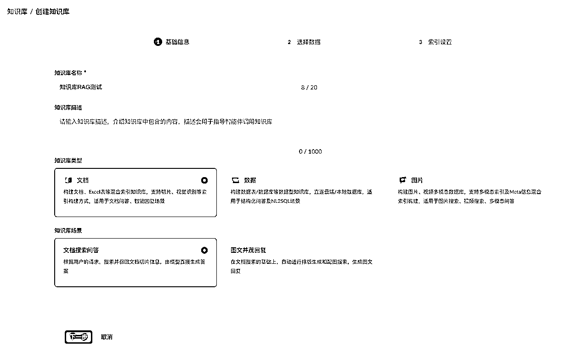
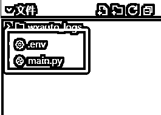
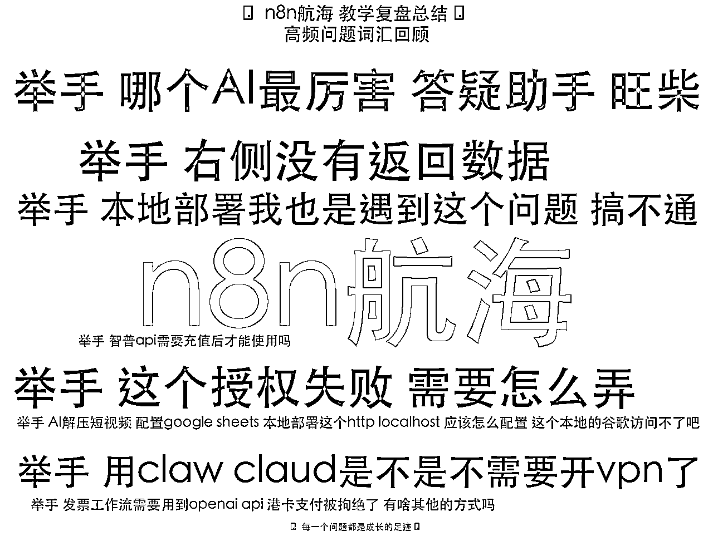

# n8n航海教练复盘：答疑机器人新尝试！附数据分析和n8n干货

> 来源：[https://lag410zsdtc.feishu.cn/docx/BlPodVnWroxu3LxxSabcheo7nFb](https://lag410zsdtc.feishu.cn/docx/BlPodVnWroxu3LxxSabcheo7nFb)

如果你只是想看我的复盘回忆不想尝试动手搭建机器人，可以越过教程，只看1和9部分，里面整理了一些航海时的回忆，线下局里面有干货分享推荐看看。

本次讲到的wxauto并不是为他打广告也没收广告费，我个人觉得他这个微信机器人方案挺不错，而且基本功能是开源项目可以看底层代码怎么实现，然后还花钱买了plus版支持一下，不买plus也能解决问题。

为什么只推荐wxauto没有其他平替，因为微信web方法和微信hook方法的机器人不稳定，会封号，大家没有必要浪费时间研究

# 聊聊为什么自建AI问答系统

第一次参加航海活动当上教练让我深受启发。当面对3700多名学员时，问题应接不暇成了常态，这促使我思考：如何在保证答疑质量的同时，提高效率？

答疑助手震撼登场—多模态看图会分析，AI+RAG知识库+长记忆，全能为你解答！

每位船员都拥有独立记忆，实现可连续追问的智能互动，真正懂你、陪你、答你。

使用示例


不懂的问题，不会乱说乱答，会召唤教练（摇人）！


一些案例


具备数据复盘能力，将AI的问答记录存入数据库，分析未正确回答的问题及船员的高频提问，持续迭代和优化AI的精准问答能力。


当然目前需要解决的问题也有很多，以下是一些常见的问题：

1.  微信消息发送频繁容易被踢下线，可能需要扫码，或者手机确认进行重新登录（目前没有办法自动重新登录，或者重新登录解决方案过于复杂）

1.  4.0版本以上的微信目前暂时不兼容

1.  在回复消息时如果对方撤回，那么群聊中引用撤回的消息可能导致微信崩溃（概率）

1.  因为模拟前台监控微信消息，你操作鼠标会导致无法正常回复消息

# 我的航海体验

利用业余时间为圈友服务本是一件充满成就感的事，但面对铺天盖地的问题，即使是最热情的教练也会感到力不从心。我发现自己在重复回答同样的问题，而且由于工作原因，很多船员的疑问得不到及时解答。

这种体验让我意识到，我们需要一个更智能、更高效的解决方案。


# 传统问答的局限性

在航海活动中，我注意到几个明显的痛点：

重复性高："如何配置webhook？""n8n报错怎么排查？"这类问题每天都会出现数十次。每次都需要教练手动回复，极大消耗了精力。

时效性差：由于有些教练都有自己的主业，无法24小时在线，船员提问后往往需要等待数小时甚至隔夜才能得到回复，严重影响学习进度。

覆盖面有限：在成百上千的问题中，教练们精力有限，只能优先回答最紧急或最新的问题，导致一些问题被忽略。

# 核心问题分析

搭建一个有效的航海答疑机器人，首先要解决三个关键问题：

微信接口的稳定性问题：目前市面上大部分网页接口已经失效，要么登录困难，要么使用没多久就被封禁。这导致机器人无法稳定运行。

回答质量问题：不能只是让AI泛泛而谈，必须能针对航海特定内容给出精准回复，否则会让船员感到失望。

可迭代性问题：机器人需要能够收集无法准确回答的问题，并在有了解决方案后进行升级迭代，这样才能持续提高回答准确率。

# 技术方案选择

微信收发能力：针对微信接口问题，使用wxauto这个前台微信自动化管理Python库。它通过模拟前端操作，大大降低了封号风险，提高了可靠性。虽然免费版功能有限，但购买plus版本后完全能满足我的需求。相比那些基于hook或web形式的解决方案，这种前台模拟方式更安全稳定。

AI部分：确保回答准确性，使用阿里云百炼知识库。考虑过dify知识库和火山方舟等替代方案，但前者需要部署，后者每天有额外费用。相比之下，阿里云百炼知识库无额外收费，免部署，开箱即用，还能方便地配置AI机器人。我们只需对接其智能体接口，中间的RAG和智能体设计都可以在平台上完成。

可迭代设计：关于可迭代性，我设计了一套记录机制，专门收集机器人无法回答或回答不准确的问题。这些问题会定期由人工审核，重写解决方案，从而让AI回答越来越精准。这一点特别重要，因为每个船员的问题和基础不同，有人问题很细致，有人一眼就能理解。如果知识停留在某个阶段，随着问题越来越多样化，就会出现答非所问的情况。


# wxautox（plus版本）介绍

## 6.1 什么是 wxauto？

以下内容摘自wxauto文档（里面的我不代表文章作者本人）

wxauto 是我在2020年开发的一个基于 UIAutomation 的开源 Python 微信自动化库，最初只是一个简单的脚本，只能获取消息和发送消息，经历了2年多的停滞，期间很多网友留言说需要更多的功能，所以在2023年针对新版微信重新开发了 wxauto，增加了更多的功能，即使 Python 初学者也可以简单上手自动化微信操作。目前已实现很多日常的微信操作的自动化，如自动发送消息、自动添加好友、自动回复、自动获取聊天记录、图片、文件等功能，后续还会根据反馈更新更多功能。

wxauto分为开源版和收费版，本文中使用的是收费版，但是根据使用的功能来说开源版也可以达到目的，但是收费版和开源版python库的名称是不一样的wxauto【开源版】wxautox【收费版】


## 6.2 wxauto 的主要功能

*   消息发送：支持发送文字、图片、文件、@群好友、引用消息等功能

*   聊天记录：可获取好友的聊天记录内容

*   监听消息：实时获取指定监听好友（群）的新消息

*   其他定制功能：根据需求定制自动化流程，满足各种特殊需求。

## 6.3 安装和使用

安装 wxauto 非常简单，在命令行输入以下命令即可：

```
pip install wxauto
```

接下来，可以按照以下步骤进行基本配置和使用：

引入 wxauto 库：

```
from wxauto import WeChat
```

初始化微信对象：

```
wx = WeChat()
```

发送消息：

```
# 给文件传输助手发送消息wx.SendMsg('这是通过wxauto发给你的消息！', '文件传输助手')
```

就这么简单几步，你就可以开始使用 wxauto 了！

详细说明请看官方文档：https://docs.wxauto.org/docs/

# 阿里云百炼平台的Agent智能体设计

https://bailian.console.aliyun.com/ 百炼平台地址


## 7.1 知识库的创建

我们先来创建一个知识库

操作步骤：应用开发→知识库→创建知识库


按照下面的基础信息进行填写，选项按照下面的图片进行选择，然后点击下一步



## 7.2 知识库内容上传

在这个页面我们上传知识库内容

为了方便大家的测试和理解，我生成了一段知识库内容，可以拆开三个文档，也可以合在一起，我为了方便这边就放在一个txt下面。我们将这个txt进行上传，和下面的内容是一样的。【其他参数都保持默认】

```
Doc 1
标题：埃菲尔铁塔
正文：埃菲尔铁塔位于巴黎战神广场，高 324 米，是世界著名的钢铁结构建筑，建于 1889 年。游客可以登塔俯瞰巴黎全景。
Doc 2
标题：卢浮宫
正文：卢浮宫是世界上最大的艺术博物馆，收藏了《蒙娜丽莎》等众多杰作，位于巴黎市中心的塞纳河畔。
Doc 3
标题：巴黎圣母院
正文：巴黎圣母院是一座哥特式教堂，始建于 12 世纪，以精美的雕刻和彩色玻璃闻名。

```


其他配置全部选择默认，然后导入完成


导入完成之后显示空，这种情况需要刷新一下网页，然后就出现刚刚上传的文本了


这种情况需要刷新一下


刷新完成后基本就解析完成了（如果你传入的文件特别大可能需要等一会）

## 7.3 智能体搭建

这里先解释一下一个核心概念，文章里提到的智能体、AI Agent其实都是同一个东西，也就是集合了各种功能模块的AI。

点开应用开发➡️应用管理➡️创建应用，在弹出的窗口中，选择智能体应用，选择知识问答


创建后我们来到这样的页面


接下来我们找到文档部分，点击➕号，


在新弹出来的知识库选择中，添加我们刚刚创建的知识库RAG测试


我们这边就多出来一个挂载的知识库了，我们现在没写提示词，但是可以进行通用对话的测试。还记得我们之前往知识库加入了什么吗？


```
Doc 1
标题：埃菲尔铁塔
正文：埃菲尔铁塔位于巴黎战神广场，高 324 米，是世界著名的钢铁结构建筑，建于 1889 年。游客可以登塔俯瞰巴黎全景。
Doc 2
标题：卢浮宫
正文：卢浮宫是世界上最大的艺术博物馆，收藏了《蒙娜丽莎》等众多杰作，位于巴黎市中心的塞纳河畔。
Doc 3
标题：巴黎圣母院
正文：巴黎圣母院是一座哥特式教堂，始建于 12 世纪，以精美的雕刻和彩色玻璃闻名。

```

## 7.4 有知识库和无知识库回答的区别

接下来我们对比一下有知识库和没有知识库问答的区别

有知识库


无知识库


通过上面这个例子，我们可以看出有知识库的回答完全按照我们知识库中的内容，但是没有知识库的问答会比较长篇大论泛泛而谈。

接下来我们点击右上角的“发布”按钮，发布完成后，前往发布渠道


## 7.5 AI智能体的对接方式

在这里会给你一些接入你的专属知识库机器人的指引，比如：API对接，钉钉机器人、微信公众号如何对接，目前只有这三个比较好用，对于大部分人来说，对接微信公众号是一个比较好的渠道，比如一些大V的数字分身，你可以往知识库中放入平时说的一些话、人生感悟、随笔等，然后给你自己设定好提示词人设，你的数字分身就可以直接接入到微信公众号中，替你回复粉丝的问答消息。【因为微信公众号的对接有引导页面，这里就不做过多赘述】


关于如何使用api进行对接，可以参考一下官方的文档

# 打通wxauto与阿里云百炼平台

我们现在有了wxauto与阿里云百炼平台的智能体接口

wxauto：收发微信消息到AI智能体中

阿里云百炼平台：处理微信的消息，使用RAG技术来找到需要的答案，输出AI回复到wxauto

再次复习一下我们的文档 https://docs.wxauto.org/

大家测试一定是安装开源版本，不是plus版本，对于对话机器人来说已经够用，当然plus版本支持更多的功能，可以在我们 6.1 部分看到具体的区别是什么

这里要⚠️注意的点：

python版本：3.9-3.12

系统：windows系统！！！其他系统用不了（因为是挂在前台的，原理是操作你的鼠标模仿人类操作微信，所以你需要有一台额外的电脑挂你的微信，同时他支持微信多开的控制）

微信：3.9.12 版本【重要‼️】

挂机推荐：N100小主机（闲鱼有售，微信在挂机宝vps还有一些服务器中会封号7天无法PC登录，需要有真实的电脑环境和常用的IP）


```
from wxauto import WeChat
from wxauto.msgs import FriendMessage
import time

wx = WeChat()

# 消息处理函数
def on_message(msg, chat):

    # 示例3：自动回复收到
    if isinstance(msg, FriendMessage):
        msg.quote('收到')

# 添加监听，监听到的消息用on_message函数进行处理(nickname 可以设置成群聊名称)
# 这里测试1是我创建的一个群聊，我们监听这里面的消息
wx.AddListenChat(nickname="测试1", callback=on_message)

# 保持程序运行
wx.KeepRunning()
```

我们创建一个main.py文件，然后将脚本放进去运行，一定要先安装python环境


运行成功后，我们看到鼠标会自动操作微信，然后打开测试1群聊

这里回答一下如果重名了怎么办，重名会打开搜索出来的群聊第一个，所以尽量保持群聊名称不一样，不然可能会错乱


这个时候我们可以往群聊里面发消息，机器人会回复收到，同时我们的电脑上也可以看到鼠标操作的效果


当然这个是最基础的只会回复收到，我们下面说如何接入AI

新创建两个文件，文件名称如下，第一个就是需要运行的python代码，第二个是ai密钥的环境变量

main.py

.env



两个文件的内容按照下面先设置好

```
from wxauto import WeChat
from wxauto.msgs import FriendMessage
import time
import os
from http import HTTPStatus
from dashscope import Application
from dotenv import load_dotenv
load_dotenv()

wx = WeChat()

# 消息处理函数
def on_message(msg, chat):

    # 示例3：自动回复收到
    if isinstance(msg, FriendMessage):
        response = Application.call(
        # 若没有配置环境变量，可用百炼API Key将下行替换为：api_key="sk-xxx"。但不建议在生产环境中直接将API Key硬编码到代码中，以减少API Key泄露风险。
        api_key=os.getenv("DASHSCOPE_API_KEY"),
        app_id='替换你自己的应用ID',# 替换为实际的应用 ID
        prompt=msg.content)

        if response.status_code != HTTPStatus.OK:
            print(f'request_id={response.request_id}')
            print(f'code={response.status_code}')
            print(f'message={response.message}')
            print(f'请参考文档：https://help.aliyun.com/zh/model-studio/developer-reference/error-code')
        else:
            print(response.output.text)
            msg.quote(response.output.text)

# 添加监听，监听到的消息用on_message函数进行处理(nickname 可以设置成群聊名称)
# 这里测试1是我创建的一个群聊，我们监听这里面的消息
wx.AddListenChat(nickname="测试1", callback=on_message)

# 保持程序运行
wx.KeepRunning()

```

下面的sk-xxxxx需要修改别的内容，我们下面会讲到

```
DASHSCOPE_API_KEY=sk-xxxx
```

我们回到阿里云百炼平台，然后找到这个页面：应用开发-》应用管理-》然后找到我们之前发布的知识问答智能体


鼠标移动到知识问答上面，会出现一个配置按钮，点击配置进来下面的页面，点击发布渠道，我们需要获取到应用ID，接下来要使用


将上面的ID替换到你的代码里面


我们回到应用开发-》密钥管理，现在需要apikey创建一个，然后复制出来


将密钥替换掉后面sk-xxxx


我们现在应该有两个文件了，就可以运行这个main.py脚本


现在我们需要先安装好百炼的python SDK，使用下面的命令，直接安装

pip install dashscope -i https://pypi.tuna.tsinghua.edu.cn/simple

然后就可以直接运行了

python main.py

运行完成之后就可以进行与你的智能体对话了


我们测试一下之前的问题【给我介绍一下埃菲尔铁塔】，AI会直接调用知识库的内容进行回复


更复杂的系统，其实可以让AI帮你写一下，注意：写的时候，需要将文档一起丢进去，不然AI是不知道这个库的使用方法！！

# 最后总结一下

我是本次分配到8群的Cyrus 赛教练（另外的群我都在哦），非常开心能与大家共同度过本次航海，在大家航行的同时，我们教练团队一直在为大家保驾护航，这次航海人数众多可能不一定每一条举手都能得到回复，同时我也在利用AI，默默记录大家在航行过程中的问题难点，与大家共创n8n的常见问题手册（由 @小宋教练 发起的问答手册共创），我以此答疑手册作为基础，利用AI+知识库24小时提供智能答疑服务（但因为微信各种掉线原因没有真正实现24小时的问题收集与解答），每一次的提问都是对航海手册的查漏补缺，能够完成这么高的上岸率离不开教练团队的答疑更离不开船员小伙伴的互相帮助，这次航海虽然到了终点，但这不是n8n的终点，同时最后给大家带来一份答疑助手收集的数据统计（不完全统计）


n8n航海 1-9群 提问次数排行榜单TOP3


高频问题统计




除此之外，我在杭州也组了一场共学局，现场来了两位教练和大家一起分享，另外一位是我们的 @KKKK教练 ，现场分享超多可以对接n8n好用的网站和平台（KKKK教练平时超级低调，躲在大家身后，空调下面第二排特别指出⬇️）


详见下方分享复盘贴

自 2025 年 4 月 18 日加入生财以来，我告别了埋头苦干的技术宅生活，开始破圈、链接、复盘，从单纯的埋头做事走向持续的知识输出。感谢一路推动我成长的生财小伙伴们！

2025期待与更多人发生链接！！！