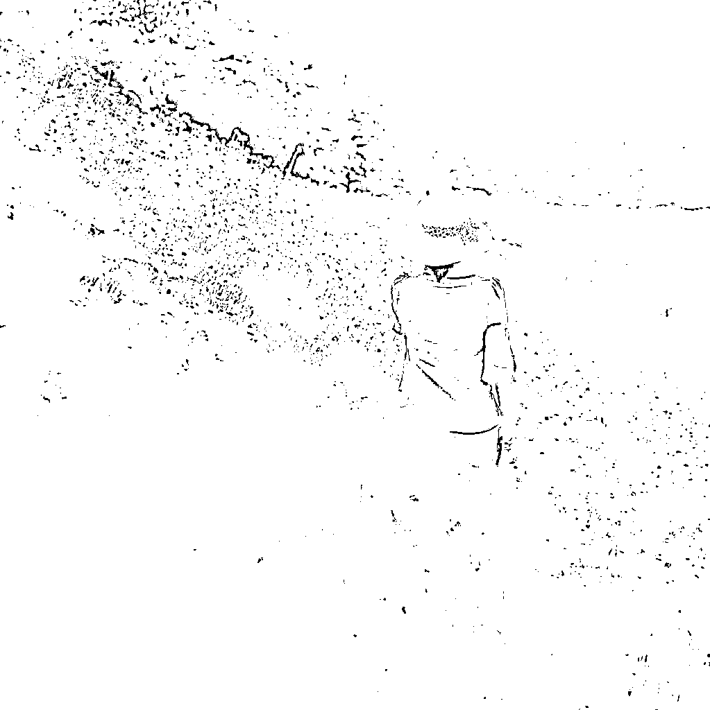
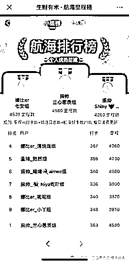
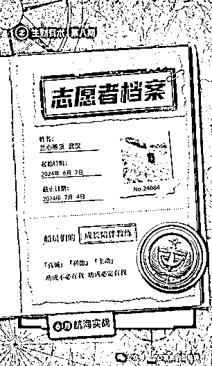
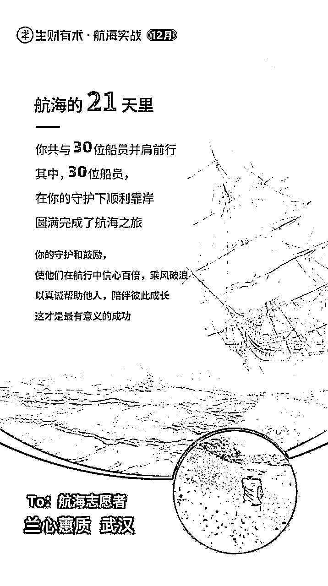
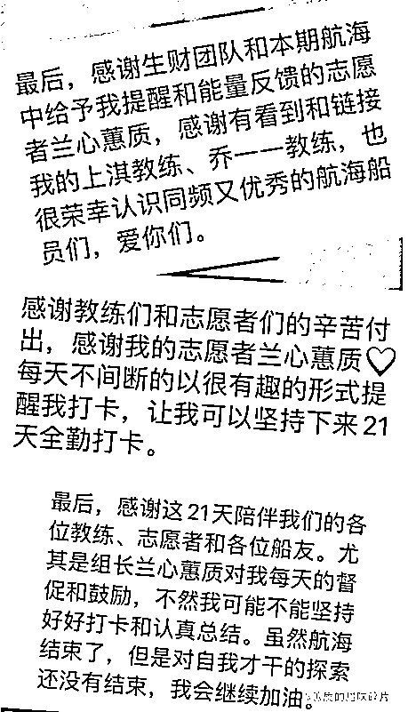
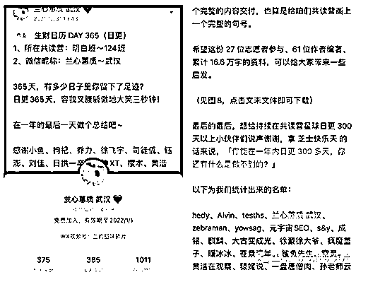
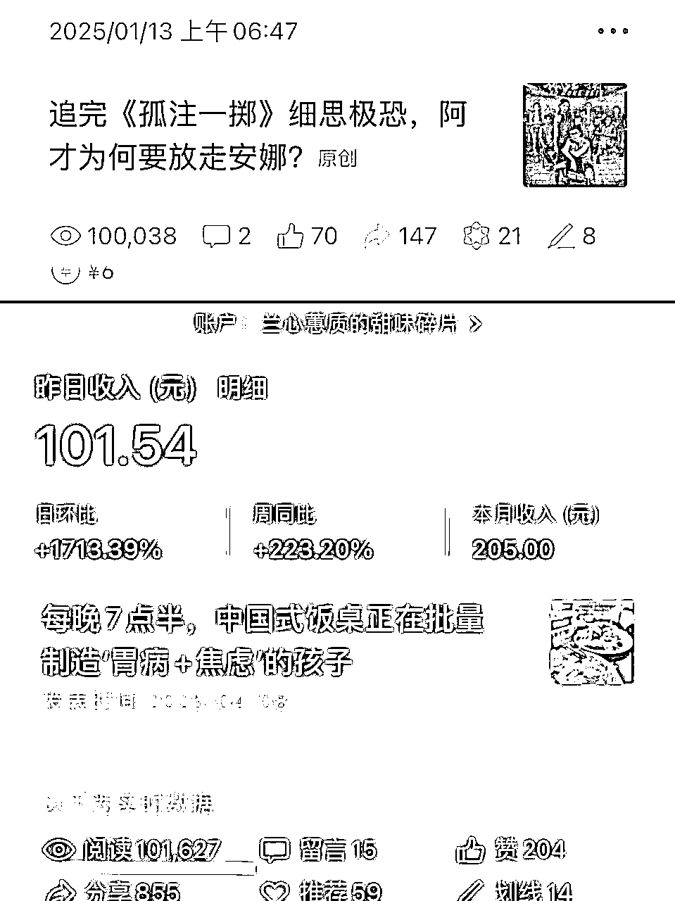
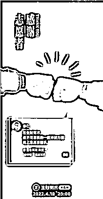
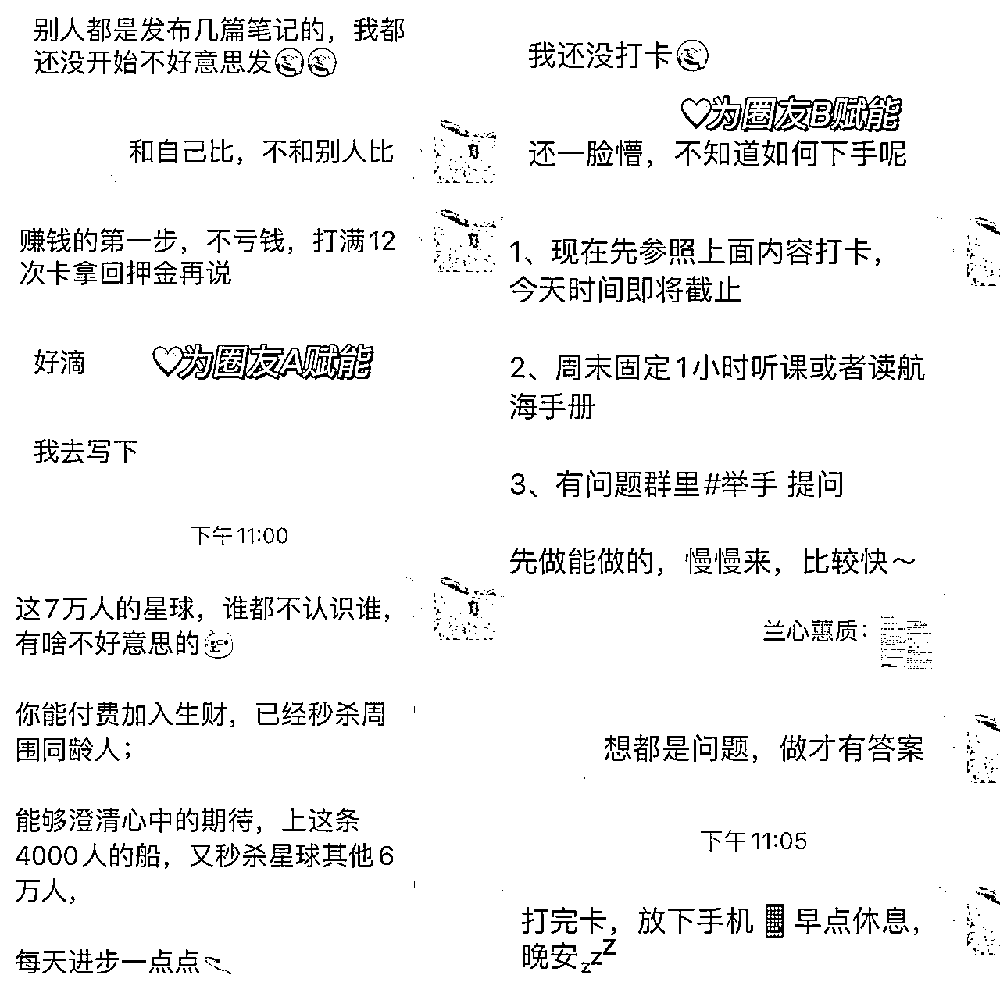
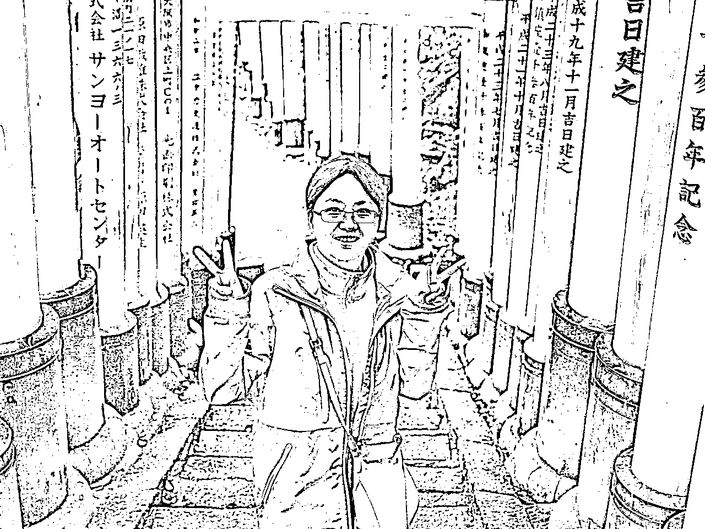

# 国企宝妈靠「加入生财志愿者」破圈：2年3次金牌，AI日更500天，从茫然到10W+

> 来源：[https://m661tsgjbp.feishu.cn/docx/YVWHdv4AGog817xorN7c28Xhnvd](https://m661tsgjbp.feishu.cn/docx/YVWHdv4AGog817xorN7c28Xhnvd)

# 一、自我介绍

出来混，最重要的是，出来。凭借在AI赋能写作、个人优势分析与生财日历内容策划等领域的专业技能，我在过去两年担任志愿者期间，3次获评A+等级，均获得60点术值，并荣膺金牌志愿者称号。

大家好，我是兰心蕙质，来自武汉。我的身份挺简单的：

*   15岁男孩的妈妈，目前在国企综合部担任负责人

*   一名用文字、图片和视频记录生活的10万+公众号&视频号创作者

*   在生财有术，我还是一名志愿者

我的人生使命是：持续地体验、分享生活中的爱❤️与美好，影响100万人。

2021年4月18日，我跟随明白老师加入生财有术，同年7月，我开始以志愿者身份陆续参与了多个项目，比如：

*   生财日历内容编著团队

*   个人优势挖掘项目

*   Ai赋能写作项目

志愿者是一个杠杆，一点点帮助我撬开“生财有术”这座巨大的信息宝库。这段经历让我明白了一个朴素的道理：凡事都得一步一个脚印，踏实去做，才能真的把事做成。我很珍惜每一次全情投入的志愿时光，正如那张生财海报上所写的：“持续行动，走向海航中最为耀眼的远方灯塔。”

这篇文章核心目的是想帮助第一次参与志愿者的伙伴看清成长路径，如果你对志愿者感兴趣但还没加入，也欢迎加入。想要了解更多关于志愿者的成长体系，欢迎看亦仁大大发的帖子：https://t.zsxq.com/IXfHo

# 二、为什么我会加入志愿者？

以前我的生活特别简单，每天就是上班、回家、带娃，周末偶尔和朋友聚一聚。虽然安稳，但时间一长，总觉得日子有点单调。

作为一个妈妈，既要忙工作又要顾家庭，每天围着柴米油盐转，但我心里一直有个念头：想跳出自己的小圈子，去看看外面更广阔的世界，接触不同的人，也让孩子明白，人生其实有很多种活法。所以，尽管日常已经挺忙的，我还是想挤出一点时间，做点自己喜欢、也有意义的事。

刚加入生财的时候，面对那么多海量信息，我一下子有点懵，不知道从哪里开始，也不知道自己到底能做什么。

一个偶然的机会，我看到生财日历团队在招内容编写的志愿者。我心里一动：平时我就喜欢写点东西，也愿意鼓励别人，是不是正好可以试试？虽然一开始我也犹豫，但想来想去，还是决定勇敢一点，报名参与。

就是因为这次尝试，让我真正从“想”走到了“做”。通过志愿者这件事，我不光慢慢找到了自己的节奏，也认识了更多同行的人。我一直相信：愿望从不会改变现实，行动才会。

# 三、成为志愿者的成长和收获

从 2021 年起，近四年里我以志愿者身份先后参与了多个项目，包括生财日历内容编著团队、个人优势挖掘项目、Ai赋能写作项目。回顾这段历程，发现自己在很多方面都收获了成长。

*   积累运营经验，学会更真实、及时的反馈

*   善于发现自己和他人的优势，心态更积极

*   学会使用AI工具，写作效率大大提升

*   提升了执行力，坚持日更内容

*   链接到了更优秀的人群

接下来，我会通过 3 个具体的故事聊聊做志愿者期间的收获。

### 故事一：一次志愿带队，收获运营成长和心态调节秘诀

*   积累运营经验，学会更真实、及时的反馈

*   善于发现自己和他人的优势，心态更积极

2024年6月，我作为“个人优势挖掘”航海项目的志愿者，带领一个30人的小组，实现了全组100%完成目标，小组总积分排名第一，我个人也完成了全部21次作业，保持了全勤。

作为志愿者，我有机会优先接触高潜力项目、进入专属后台参与实战。深度参与“个人优势挖掘”、“AI赋能写作”等项目，生财官方为我们提供了充分的物料支持和清晰的操作后台，我们按照SOP流程执行过程中，就能学到了很多实实在在的东西：

比如怎么设计激励环节，让大家更愿意参与；怎么用轻量互动、及时反馈这些低成本的方式保持活跃度。更重要的是，我明白了运营其实就是“基于人性的沟通”，真实、及时的回馈，才能真正建立起信任。

航行第1周，因为用眼过度，我的眼睛充血，医生建议多休息。但作为一名有责任的志愿者，我还是选择把组员放在前面，没有中途放弃，而是尽量压缩其他事务，来协调时间。最终，航海结束时，我们小组拿到了总积分第一，我的眼睛也慢慢康复了。

那段时间白天工作安排得很满，我就挤出三个时间段专注做这件事：早晨上班前，快速回复每一条组员的留言，哪怕只是一句“很棒”的鼓励；午休时，我逐条看大家的作业，认真写评语并提交给领队；晚上十点左右，我会编写提醒文案，点对点推送给需要帮助的组员。

在航海过程中，我常常会惦记着组员们的状态，那怎么跟进比较好呢？我用了一个很实在的方法：建了一张Excel表，把每个人的进度和情况都记下来。比如谁带病坚持、谁经常熬夜赶作业，我都会主动去问候，希望让每个人都感受到被关注、被支持。说白了，这就是在做“精细化运营”，只不过对象是一群共同前行的人。

其中，有位组员每次打卡都比较慢，一开始我也有点着急。后来才发现，原来她不是拖拉，而是习惯想得更全面、更细致。于是我鼓励她发挥这个优势，请她多做一些复盘和总结。结果她不仅自己顺利上岸，还成了我们小组的“智囊团”，经常帮大家出主意。

之后不管是带团队还是在家里，我都更愿意去发现每个人不同的特点，不再急着下判断。生活好像变得更轻松了，和身边人的关系也变得更好了。

心态慢慢稳了，运营能力也在一次次实操里长起来，我于是把目光投向公众号写作。真正让我写下去的，是志愿者经历，它给了我素材、能力与信念，也带我走进了新的世界。

### 故事二：从不会写作到AI加持，公众号坚持日更500天

*   学会使用AI工具，写作效率大大提升

*   提升了执行力，坚持日更内容

2021年，我加入“生财日历共读营”，从“不知道怎么写作业”到坚持日更365天，收获1011个赞、58个V值。更让我惊喜的是，后来我成功入选生财日历2022内容编著团队——我的名字，被印在了日历封底。

加入生财有术之前，我从来没有奢望过写作变现、日更500天和10W+阅读量。就这样，一点一点地写起来，从最初每周写1-2篇公众号，到后来借助AI工具连续日更500天+，并产出多篇10W+内容。

有人问我：是因为成为了志愿者才有内容可以持续输出吗？确实，正是因为加入志愿者，我才更系统地接触了各种AI工具。不但自己完成打卡作业，还会每天查看同学们的作业，挑选精华作业推荐给领队。

海量、有价值的输入，决定输出。在同为志愿者的圈友帮助下，我逐渐熟练运用这些工具、不断坚持产出。

我掌握了一套高效的AI写作流程，写作效率大幅提升。原本写一篇公众号文章要花大半天，现在用AI工具只需不到一小时就能完成内容输出。同时，写作项目也为我带来了金钱收益。单篇10万+文章，可以带来一周的流量主累计收入约300-600元不等。不仅是经济上的回报，更是个人品牌和影响力的积累。

回头看，公众号之所以能坚持更新和获得收益，并不是靠一腔热情硬扛，而是从志愿者做起。志愿服务让我置身更高能的圈子，手边有一线素材与真实场景，也逼着我把复盘写成文字；在这个过程中，我学会了借助 AI 工具，把资料整理、结构重写、标题对比拆成可执行的小闭环，更有方法、有节奏去完成目标。同时，正反馈一多，更新不再靠灵感，而是可复制的流程，读者稳步增长，也带来了实打实的收益。

除了个人成长与副业收获，更重要的是，我遇见了很多优秀的同路人。

### 故事三：通过志愿者进行人脉升级

*   链接到了更优秀的人群

我做生财有术的志愿者，起初只是出于兴趣和认同，并没有想过具体回报。但有趣的是，在持续“利他”的过程中，我竟用积累的术值，直接兑换了两年的生财门票。

同时，也是因为自己真心认可生财，我推荐了4个朋友加入生财，不但得到了一些金钱奖励，还加深了和朋友之间的信任。这就像一场温暖的“价值循环”：你付出时不计得失，收获时却格外惊喜。

而比这更珍贵的，是在这段经历中结识的那些“做实事的行动派”。她们来自不同行业、不同背景，却都在自己的赛道中做出了令人惊叹的成绩。

和她们交流，不止一次打破我原有的认知天花板。共建者之路让我从具体到抽象、从广度到深度，系统打磨了财富能力，真正体会到：你想成为谁，就和谁一起玩。在做志愿者的过程中，我认识了很多真正在做事、并且做出结果的人。他们的工作方法和实战经验，实实在在地拓宽了我对运营的认知，也改变了我的执行思路。

比如，我曾在生财日历的志愿编撰项目中认识了黄小鱼。她当时带领我们一群临时组建的队员，在极短时间内完成高质量的内容提炼和编辑。我之前以为“快就是糙”，但她却做到了既快又好。关键就在于极强的流程把控和信息筛选能力。

加入优秀的志愿团队，从基础的飞书工具开始学习，我才意识到：真正会做事的人，是把“目标”拆成“步骤”，把“步骤”落实为“动作”，干脆利落、绝不拖泥带水。

还有赫连雨彤，加入生财有术两年多，已经参与了11次志愿者工作，其中7次担任领队，并被誉为金牌领队。我亲眼见证她在志愿服务中快速成长：

从一开始的新人，逐渐变成一位极度注重细节、善于总结的“细节控”。她甚至写出了SOP级别的志愿者复盘文档，把经验转化为可复制的方法，这种成长和热诚，令人印象深刻。

另一位优势转型教练麦几，今年，她尝试了潜力的项目：微信“问一问”。她很快跑通了整个流程，获得了持续而稳定的收益。截至目前，她运营的两个账号累计收入已达5000多元，内容曝光量超过100万。

同时，这份“小而稳”的成果还吸引队友加入，月收入也突破了1000元。一位自媒体0经验的职场人，她借助微信平台的流量和支持，成功开启了自己的内容创作之路。

如果没有成为志愿者，我可能永远不会结识这群乐于分享、不求回报的姑娘们。日常的圈子不同、轨迹难交叠，正是志愿者这个身份让我们在共同完成一件事的过程中，自然相遇、并肩作战、彼此认可。

这也让我更加相信：人际关系的构建，远不止是“认识多少人”，而是你能否融入一群正在做事、能出结果的人，被他们影响，跟着一起成长。去靠近有结果的人，向他学习，这才是最直接的成长方式。

而这一切，都始于一个主动的选择：成为志愿者，接触更多优秀的人。

# 四、参与社区共建，传递利他理念

爱出者爱返，福往者福来。赋能他人不是单方面的付出，而是一场能量的双向流动。作为志愿者，我始终秉持这样的信念：

### 真诚倾听，及时反馈，不让任何一条消息石沉大海。

记得有一次，我遇到一位迟迟没进入状态的圈友。他因为缺乏信心、找不到方向，显得有些迷茫。我是这样和他沟通的：先提醒他记得打卡，避免有押金损失；建议他可以固定在周末抽时间学习；还鼓励他有什么问题随时可以提出来。

有的组员习惯和其他高手比较，我安慰他别着急，重点不是和别人比，而是比自己有进步。我帮他定了个实际的小目标：先打满12次卡，把押金拿回来。同时也肯定了他已经做出的努力，让他先放松下来，慢慢建立信心。

整个过程，既给了具体可操作的建议，也提供了情绪上的支持，帮助他真的动起来，而不只是停留在“想”的阶段。

有时候，一条语音、一个拍拍，一个图片，看似简单的动作，都能让每一位圈友感受到“被看见、被回应”。这样及时的互动，能让他们更有归属感和自信，也更愿意敞开心扉、多聊聊，这样就形成了一个越来越好的正反馈循环。

### 既分享成功，也不避讳失败，因为“真实”远比“完美”更有力量。

遇到开船就想退缩，要下船或者改围观的圈友，我会坦诚分享自己的摸索历程：无论是走过的弯路，还是验证有效的方法。帮助他，再给自己一次机会，再看一眼优秀作业模板，别急着说“我不行”。

真诚搭配任何技能，永远是王炸。这份真诚，让我们走得更近，也让圈友更愿意相信我们。而分享那些实际有用、能借鉴的经验，是为了帮大家少踩坑、更快上手，每一步都走得更稳当。

### 主动传递机会，助力优秀伙伴被更多人看到。

比如，当我发现某位圈友在视频剪辑方面特别出色，我会主动推荐TA参与相关项目；或者看到有适合的线下活动、商业资源，也会第一时间牵线搭桥。

被推荐之后，圈友不仅能获得更多曝光、合作机会，也可能因此打开新的收入渠道或个人影响力通道，而这往往只需要我们的一次转发或一句引荐。

还有一点非常重要，那就是在服务过程中，始终牢记：“圈友并非永远都是对的，但与他们争论永远是错的。”我们追求的不是辩论输赢，而是共同成长。即使观点不同，也以包容之心沟通，用建设性对话替代对立。

生财路上，志愿者之所以能帮助那么多人，是因为我们抱团取暖，我们共同击碎了成年人赚钱路上的孤独感。航海上岸后，我也收获了非常多圈友细腻的、温暖的、能量满满的感谢，有的还成为生活中的挚友。

在这里，有人带你、有人看你；有人陪你立黄昏，也有人问你粥可温。这里不夸夸其谈，只关注你是否在行动、是否在成长。而你，从来都不是一个人。

# 六、如果你想加入志愿者，我的建议：

志愿者，是进入社区共建最友好的入口。加入之前，不妨先问自己一句：“我真正想要的是什么？”把目标放在前面，再以志愿服务为路径去尝试与积累，愿望就会一步步落地。基于此，我给出 3 点建议：

### 四条志愿者成长路径

1）提升执行力，累积经验

从小任务做起，以“完成”为最小单位，在实践中打磨自己。开始无需很强，但要把每一次“开始—交付—复盘”做扎实；你会在一次次完成中变得越来越强。

2）发挥天赋，找到定位

把志愿当作低成本试错场：多尝试不同角色与任务，逐步验证你真正擅长的方向。每个人都有独一无二的优势，关键是找到那个让你一出手就比别人快三倍的事。

3）拓展人脉，增强影响力

在服务中真诚提问、主动分享、及时互动，让别人看见你的专业与可靠。每一次真诚互动，都是在给别人一个记住你的理由，关系也会由点成线、由线成面。

4）长期成长，打造个人品牌

选择可持续的项目，持续输出并坚持利他，在帮助他人的过程中积累信任与影响力。“不是看到希望才坚持，而是坚持了才会看到希望。”你现在的每一份付出，都是为未来的自己存下影响力。

### 坚持下去，因为收获有滞后性

很多人以为，付出马上就有回报。但真相是：你先得成为“付出者”，才有可能成为“收获者”。你可能连续几周都在做杂活、写文案、整理资料、统计数据、一对一沟通，看起来毫无成长。

但请记住：你现在的每一次付出，都是在为未来埋种子。它不会明天就发芽，甚至不会下个月就结果。 但只要你持续浇水，它一定会在某个时刻，给你惊喜。

### 去做你真心喜欢的事

有两个简单的问题，可以先思考：

1）你最感兴趣、坚持最久的事情是什么？

2）有没有一件事，你不赚钱甚至倒贴，也愿意去做？

对我来说，答案是：读书和内容创作，所以我一般会选择相关的志愿者项目。它们让我进入心流，让我愉悦。我相信：时间的复利，会把今天的热情，变成明天的资产。

最后想说：生财这条路，不短，也不孤独。 只要你目标清晰、愿意先付出、能坚持到滞后性结束，我们终会在这条路上相遇，以终为始，结伴同行。

# 七、致谢

感谢明白老师带我走进生财，感谢亦仁、涛哥、靠谱、黄小鱼的分享，感谢志愿者团队欢欢和三七的信任，感谢领队振帅、blue、十月、佳佳油，也感谢每一位和我并肩作战的志愿者们。

最后，如果你也愿意付出时间、真诚行动，欢迎加入共建者队伍。在这里，你得到的可能不只是钱，还有爱、能量和真正值得深交的同行者。

看完啦？谢谢你来。期待我们在生财的海洋里，继续并肩前行。

