# 土木工程师裸辞，零基础3个月跨界AI，我在AI 出海赚到了第一笔美金

> 来源：[https://acnwscsrr4nu.feishu.cn/docx/Yu2pdMbl0odbZJxLEiaccXtSnef](https://acnwscsrr4nu.feishu.cn/docx/Yu2pdMbl0odbZJxLEiaccXtSnef)

从土木工程到AI出海，我放弃了五年拼搏来的副总经理职位，选择裸辞。几个月后，我在这个全新的领域赚到了第一笔美金。

这是一个普通人的跨界冒险，没有科班背景，只有一路的实战复盘和贵人相助。故事有点多，但每一步都算数。

大家好，我是井然。最近有不少朋友问我，是怎么在短短几个月内从土木工程跨进AI圈子、还最近上线一周的网站就赚到了美金的。所以我想在这里分享一下我这段时间的经历，希望能给正在探索新方向的你一些启发。

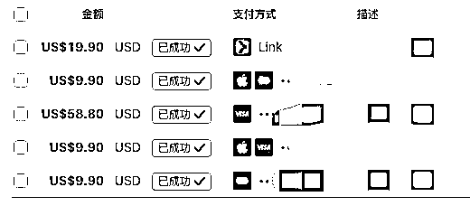

# 一、简要自我介绍：

我是2020年毕业的土木工程专业，到今年已经在建筑行业干了五年。

之前一直在深圳一家口碑不错的私企，老东家现在工程也出海了，目前在沙特做项目。

这五年我自认没有虚度——从试用期实习生开始，两年半时间做到了公司的副总经理，成为核心团队成员之一。

非常感谢老东家给我的平台和机会，这段经历对我转型AI出海有非常大的帮助。

五年间，我经历了从技术小白到项目负责人再到管理者的转变，心智和耐心都得到了极大的锻炼，也学会了冷静分析、对症下药的处理问题方式，这些能力在我后来的AI创业中都非常受用。

其实我选择AI出海这条路的时候，并没有期待这么快能拿到正反馈。原本我给自己设定的预期是一年左右。毕竟离职之前我是个典型的工作狂，对外面的世界了解不多。

但没想到，一步步走下来，很多事情竟水到渠成。

## 放弃年薪核心岗位，选择AI出海这条路

为什么放弃年薪不错的稳定工作，选择AI出海？

原因有很多，但最主要的是我更看好AI这个赛道，也希望未来能组建自己的小团队，全身心投入到自己感兴趣的事业中。

现在的我真的很沉迷AI，有时候甚至废寝忘食，走路、睡觉都在想点子，半夜突然有灵感也会赶紧拿手机记下来——当然这不太健康，大家别学我，睡眠还是很重要的哈哈哈。

但就是因为这种状态，让我从未怀疑过自己的选择。我能感受到那种“心流”，乐此不疲，甚至有点“为爱过度发力”的感觉。

## 第一引路人

在接AI之前，我了解到了我同学在“生财”圈子里三年多了，做过不少项目，也赚到了些钱。

今年三月份，他的一篇公众号文章甚至破了百万流量，连续爆了三天，赚了三万！

当时我也尝试用类似方法做一波，可惜刚好碰上微信公众号推流算法调整，我自己也没找到感觉，最后只能另选感兴趣的赛道了。

# 二、AI走进了我的视野，被小排老师的精神感染到

但也正因如此，我注意到了AI这个赛道，并加入了生财的“3月AI应用-Web网站”航海。

在那里我认识了良辰美，也刷到了很多刘小排老师的精华帖。

每一篇都让我受益匪浅，特别信服他的认知高度。

后来我在多个群里默默关注小排老师，虽然很少发言，但他发的每一条信息我都会认真看。

他总给人一种能量满满的感觉，后来得知他有一个“深海海外AI产品课程”，我果断加入了——这也就是我AI出海之路的真正起点。

# 三、非常幸运加入小排老师的【深海圈】海外AI产品

选择与运气共存！如果没有加入深海圈，可能也没有我下面的故事了！

我奔着小排老师去的，也是奔着一群热爱 AI志同道合的圈友去的。

深海圈开始报名的时候，真的是争分夺秒锁定报名的，一直刷不出报名信息，把我急的！最后报上名的时候只剩几十个名额了！

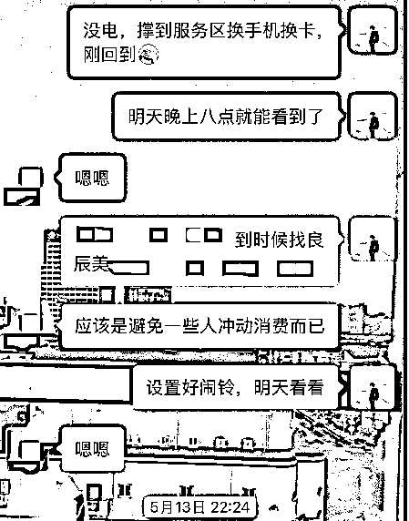

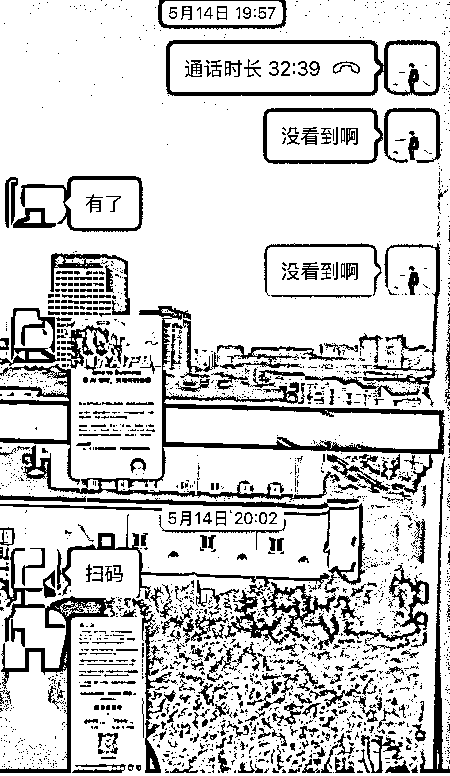

加入之后氛围比意向的还要nice，小排老师会经常直播讲解。

直播也是由浅入深：教我们如何走出新手村，掌握基础，精通API 不再抽卡，掌握框架数据库轻松对接，产品拆解等等一系列直播，每场直播都值得反复观看，因为每个直播都附带了很多概念性的知识！

除了小排老师直播，还会持续有邀请大佬嘉宾分享出海收获经验，这个直播分享会持续10 个月下去，真的太香了！

我的出单肯定有从他们身上吸取了不少经验，很多成功收获都是一点点积累起来的，所以也很感谢大佬嘉宾和深海圈的伙伴们分享经验，太实用了，这就是我要找的志同道合的伙伴们！

现在深海圈已经航海 3 个多月了，群里的AI消息每天都谈论的热火朝天，国际AI圈有什么大新闻群里都会第一时间有人发出来了，这不就是妥妥的一手支援吗？

就问你香不香！反正我就是这么熏陶出来的！看多了，上站的网感就来了！

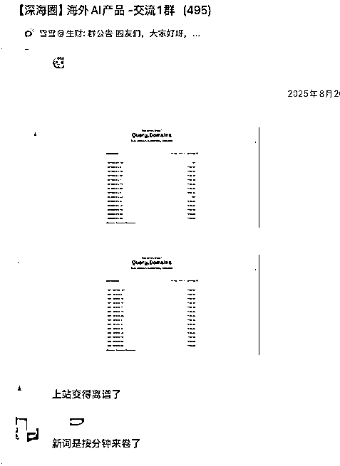

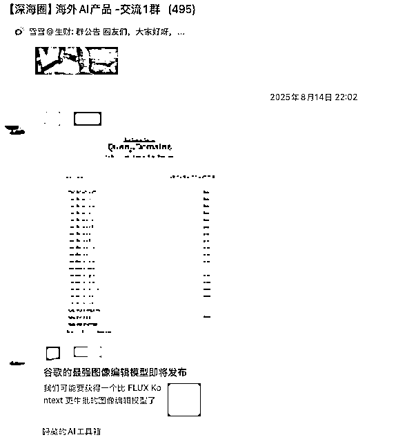

慢慢的圈友们都开始出单了，越看到这些好消息，越坚定走下去了，所以我不断修炼自己的内功！

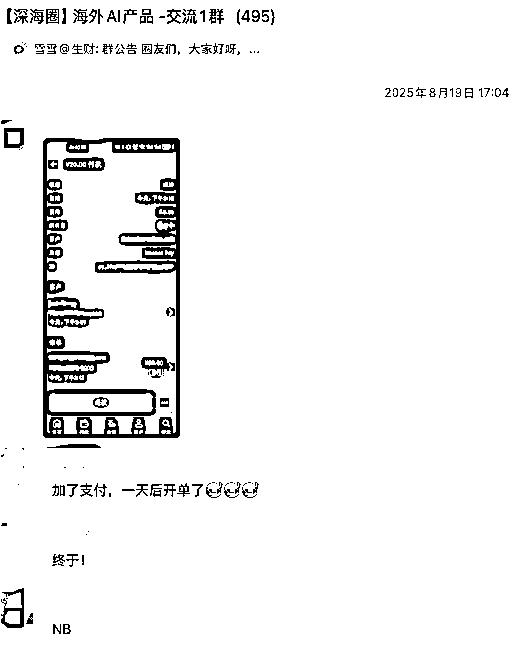

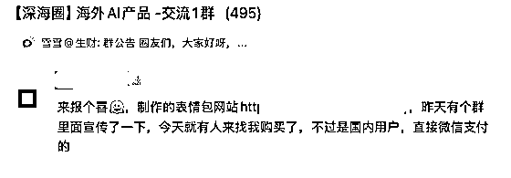

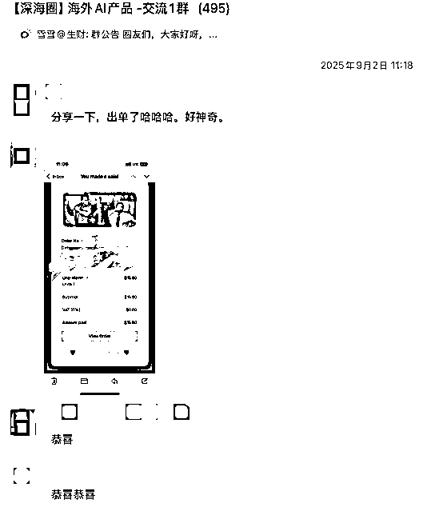

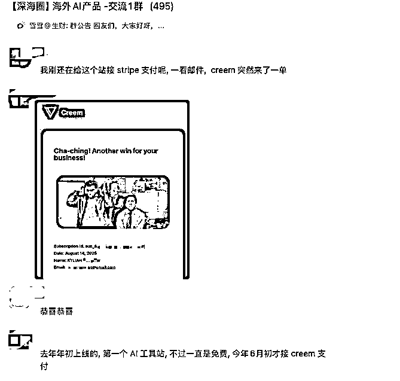

## “排学”受益匪浅

在小排老师那里，我学到了非常实用的“排学”四要素：什么人，在什么场景搜的、愿意花多少钱、解决什么问题？

这套思维模型直到现在我还一直在用，帮助我判断一个方向该不该投入、投入多少精力。

除了产品思维和完整的商业逻辑，小排老师带给我的更是一种状态，一种能量，这种状态让我的学习效率大大提高。

6月21～22日，我还特地跑到杭州参加他的线下交流会。当时我还处于对接API有点懵、搞不懂支付、没有港卡也没有Stripe的阶段。

当晚的黑客松比赛，我熬到凌晨三点半，（很多大佬也都熬夜得很晚，特别是冠军-DieselNiu,他也是我现在的技术支持大哥，我现在的出的单他有很大的功劳！）虽然最后没能完成提交，但那次经历让我清楚地看到自己的不足——认知和技术都还不够。

回来之后我就开始反思，缺什么补什么。慢慢做多了，速度也就跟上来了，真的是熟能生巧！

这里放一张之前参加杭州学习的朋友圈，这条朋友圈仅对自己可见，啊哈哈（明年再看回头看应该还会有更大的感触吧）

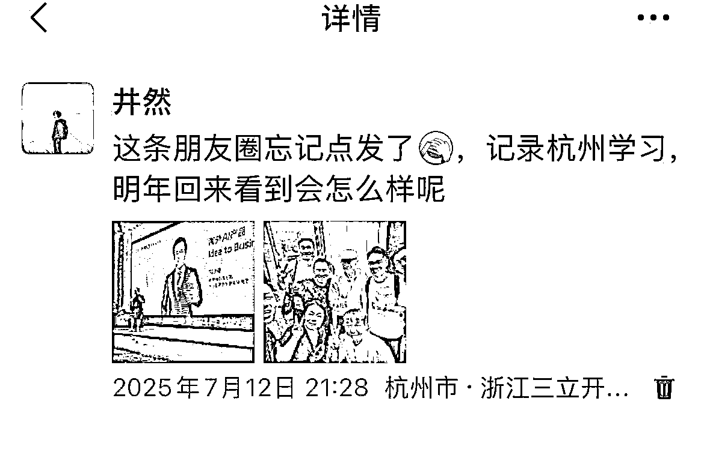

## 不断补充内功武装自己

反复学习小排老师的【深海圈】海外AI产品航海手册，这也是精华宝典，详细讲解了整个从零到产品再到商业闭环的思路！

这份文档也会持续更新中，值得我任何时候都可以回来反复钻研提高认知思维！

在修炼内功的期间，我学会了如何与AI高效交流。现在写代码前，我会先整理需求文档，再让 AI 实现，做到“指哪打哪”。

同时不断补齐框架基础，用飞书文档记录学习内容，避免遗忘。

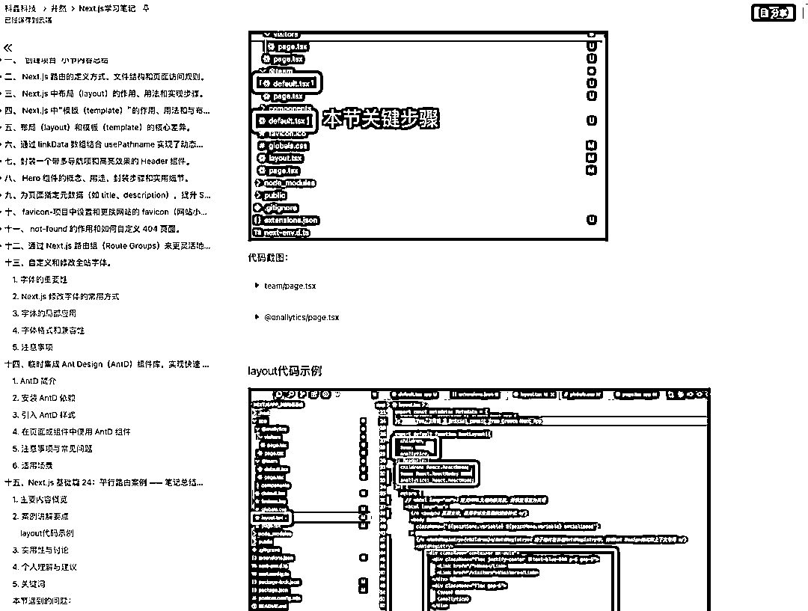

# 四、去香港办港卡遇到的（小坑）

现在已经办好了汇丰、中银和众安。

这里提一下我踩的坑：提前也做有了攻略，正常按攻略人到了香港连上商场WiFi，然后在手机银行上一步步操作就可以了。但我却在中银香港那我踩了坑：商场WiFi一般30分钟会自动断开，我注册完中银用户名后没有立即登录，结果回来就忘了用户名。中银的用户名和其他银行不太一样，而且App防截图，没法回头查。

后来打电话要月结单、又walk-in了两次才最终办好。第三次我去的是中国银行(香港)上水分行，人少不用排队，非常顺利就重置办好了。

所以有些事真的要多尝试，总会有意想不到的转机。

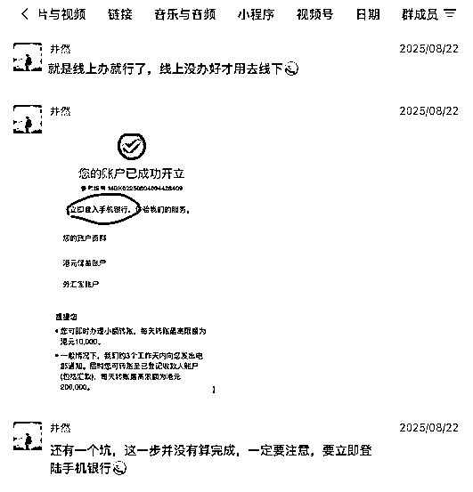

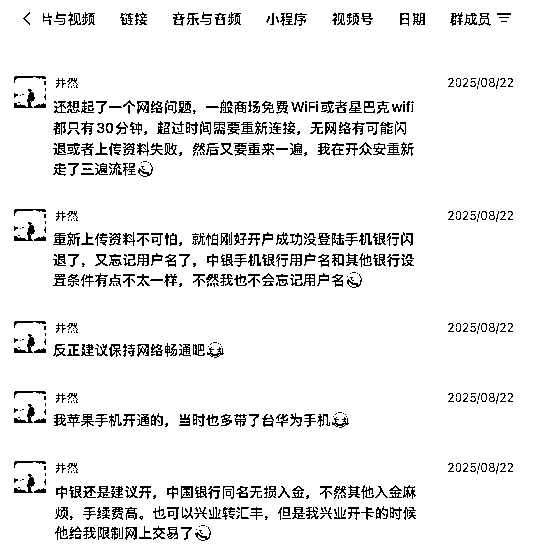

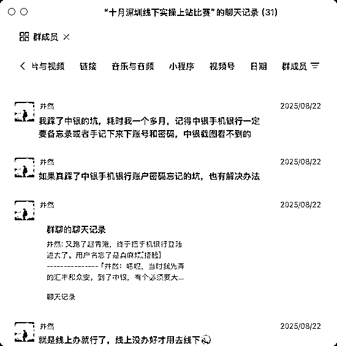

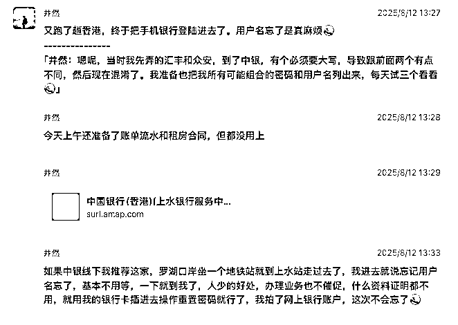

还有中银邮寄实体银行卡默认是平邮，上面没有电话号码联系的。

一般是按你填的地址投放信箱，如果住的地方有信箱留意看有没有，一般是两个星期左右寄到，一直没有领的话会被退回去的！

如果住的小区没有信箱，那就要自己主动联系了附近的邮政快递员了，我是跑到附近的邮政去问，然后他们提供电话给我，转打了两个电话才找到，添加了负责我这块小区的邮政快递员微信，让他帮我留意这个地址，后面中银万事达的卡到了他第一时间联系上我了。

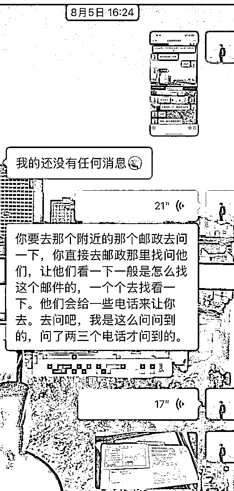

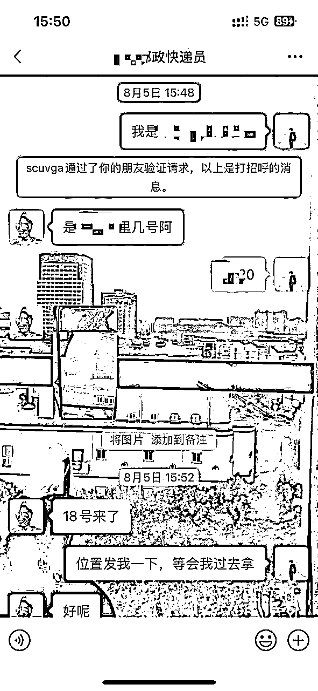

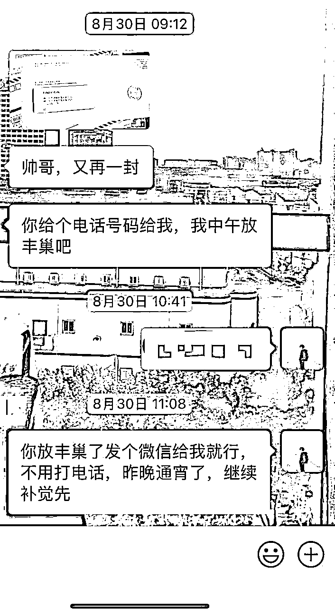

# 五、日常出海工作，424 打法

回来之后我又反思了一段时间。光学技术不行，得提高我的商业嗅觉，找到目标用户，我的用户到底在哪？

后来我就开启了“424打法”：40%时间挖掘需求，20%开发，40%宣传推广。

我出单的这个站时间线大致是这样的：在还没确定做它之前，我花了很多时间找网感、挖需求，天天刷AI新闻，研究各种词根，通过外链找站、站找站，分析竞品需求等等。

后来我看到Flux1krea刚发布，生图真实感很强，不少博主都在推，就查了一下域名注册情况，发现已经有人下手，搜索量也在涨，于是立刻抢注了一个域名。

花两天时间上线网站，再花四天左右找外链、发外链（一边找一边发，速度还是有点慢）。后来观察到这个词搜索量一直没起来，竞品也没动静，我就暂缓维护，继续寻找新需求。

## 开始 SEO 之路

实操动手多做才是硬道理！要开始 SEO 之路之后，每天都有做不完的事：研究热点新词、深挖竞争对手、收集外链、优化内页、想办法提高排名……

刚开始SEO的信息量巨大，我只能一点一点啃，一遍不懂就再看一遍，慢慢就找到了感觉，除了看还得多实操分析。

后来买了十多个域名，中间做了不少半成品：AI导航站、微信聊天记录总结分类、AI试衣、内容站等等。

相对完整上线的网站包括7月底做的Flux1krea.app和“grow a garden mutations”（没流量就没维护了），8月中旬做的qwenimageedit（也没追到热点，纯当练手），以及最近终于出单的这个站。

我始终相信“熟能生巧”，第一遍手忙脚乱很正常，多做几次就会越来越好。最关键的是动手去做。

# 六、第三个AI工具站上线一周出单

而我真正开始赚钱的，是第三个AI工具站。上线一周左右，就陆续有人下单。这个站也是花两天上线，我觉得速度还有提升空间——等确定好模板风格之后，争取一天就能上线一个有需求的网站，后面集中做推广。我目前的推广方式主要有三种：

1.是发外链，包括提交到具有权重高的AI导航站和相关dofollow博客；

2.自己录视频，发各大外媒平台，找博主发视频推广；

3.投广告

# 七、可能有人会问我为什么能拿到结果？

前面说过，时刻保持排学四要素

“排学”四要素作为决策锚点：谁（什么人）、在什么场景搜、愿意花多少钱、要解决什么问题；用它过滤需求、决定做不做与做多深。

1.  很关键的一步找到了一个新起巨量的热词---Nano Banana，拿到了一个好的域名，这里再次感谢生财圈友DieselNiu(牛哥)，感谢！

1.  这个词本身就具有产品需求了：

*   (1).谁--视频创作者，电商模特摄影的，企业海报宣传的等等。

*   (2).场景--用于社交媒体分享（如3D立体模型和表情包），以及在技术论坛中进行研究和基准测试 。专业用户也会将其集成到工作流中，用于快速原型设计和生成营销素材 。

*   (3).花多少钱--相当于请了一个P图助理，更省时，更省力。

*   (4).解决了传统图像编辑软件操作复杂和效率低下的问题。其最大的价值在于能够有效保持图像一致性，解决了以往 AI 模型在处理人物和物体时容易变形的痛点。

1.  那我新起巨大的搜索量：意味着大家同一起点竞争，看谁做得更快更好，更能满足用户的体验需求！更有创意！基于前面积累了不少案例经验，也有了些模板，上站速度勉强算可以，在 UI 设计花了点心思，还录制了一个视频进去！

1.  几天下来，两百多刀了！在我接通 stripe 第二天开单的，现在还陆续有人下单！有几个年度付费：58.8 美元的，还有 29 美元包月套餐的，更多的是一次性积分支付的9.9 美元和 19.9美元（之前模板是没有开通一次性积分支付的，后面接上一次性支付真的能增加客单量）。

总结这次这次商业闭环，我算是摸到出了属于自己的道了，已经形成日常出海工作了（424打法）

SEO 商业闭环：找词 → 建站 → 优化网站→开放免费体验留住客户 → 结构化内链与收录（发外链，找大佬的网站收录了，可以花钱投权重高的导航站） →快速接入支付闭环 → 数据驱动优化→不断提高网站排名。

我的网站域名就不直接发了，应该都能找得到，虽然被黑客恶意攻击过一次怕了，无所谓了，经历多成长更快。被攻击的时候连夜通宵修复 bug 加多层安全措施。（这里也有一个避坑分享，后面有空整理分享出来。）

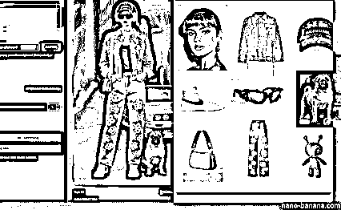

之前录制的产品宣传录制的视频

文章末尾，我想再次衷心感谢这一路上遇到的各位老师和朋友：小排老师、哥飞老师、熠辉老师、良辰美老师、fox@MkSaaS大佬、我的技术大哥DieselNiu、我的引路人元彻！

还有感谢生财各位航海教练每一期真诚的付出，以及协助我完成此篇长文故事阐述的七天老师及内容指导老师（嘻嘻、楞楞）和鱼丸们，（这些都是我来时的路）真诚谢谢你们！

现在对我而言只是一个开始，我只是站在了巨人的肩膀上看到了更远的世界。未来的AI技术会不断进步，我也会继续成长。我觉得每个人应该都是每一个阶段都有每一个阶段的成长，慢慢来，认真做，该来的总会来。也祝愿所有还在迷茫的人，早日找到自己的路，坚定、努力地走下去。