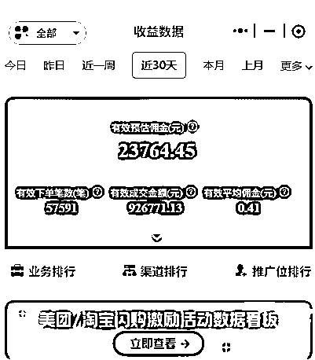
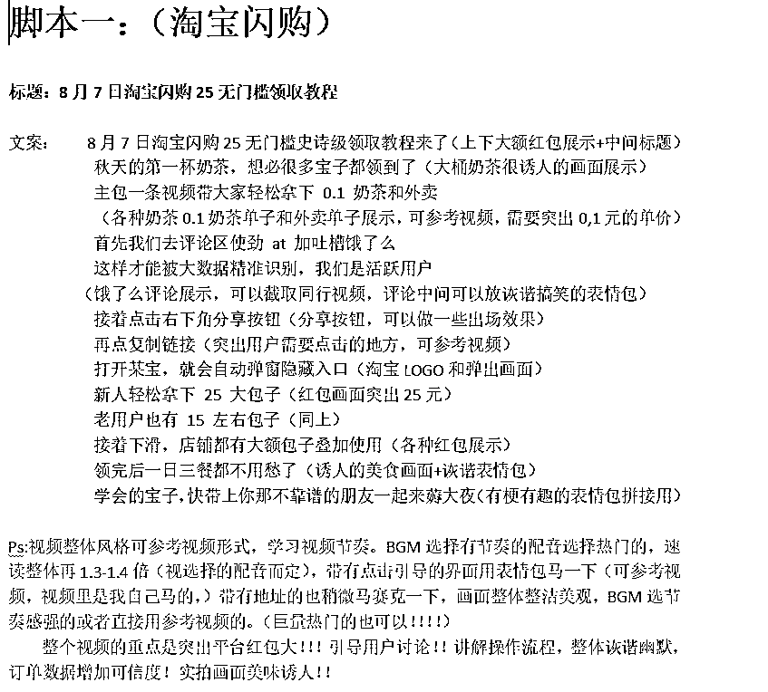
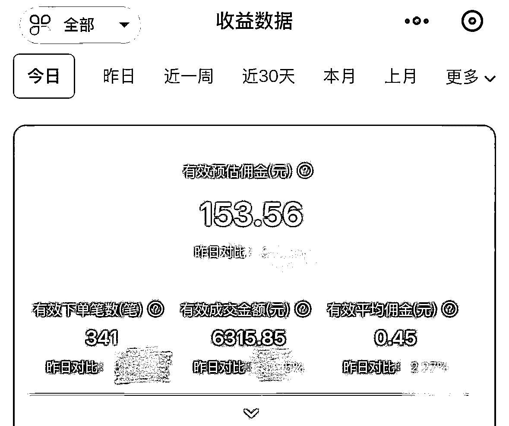
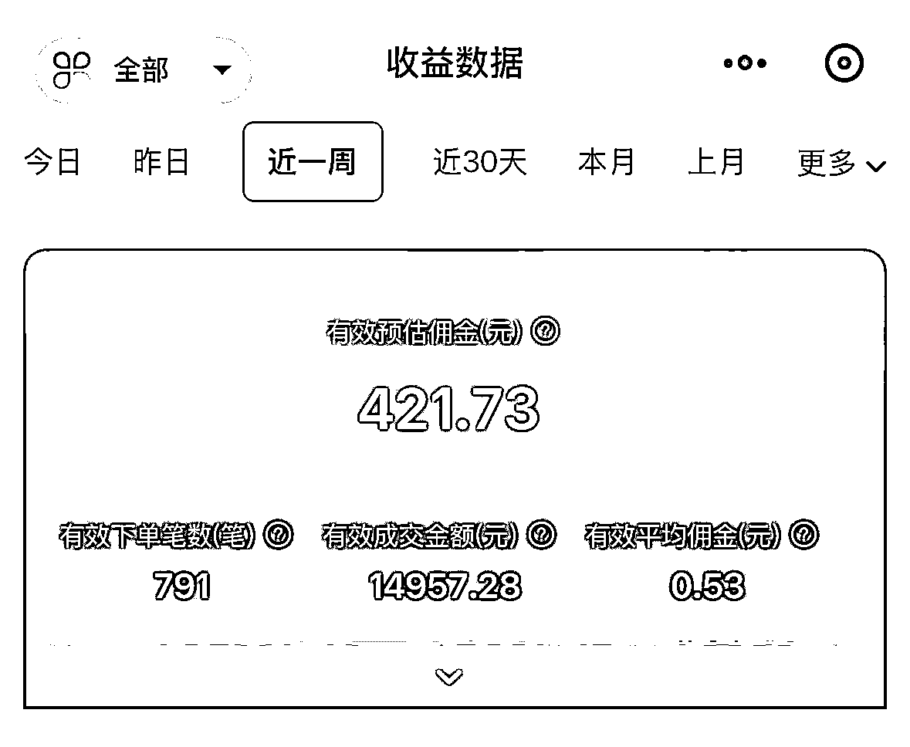
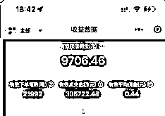
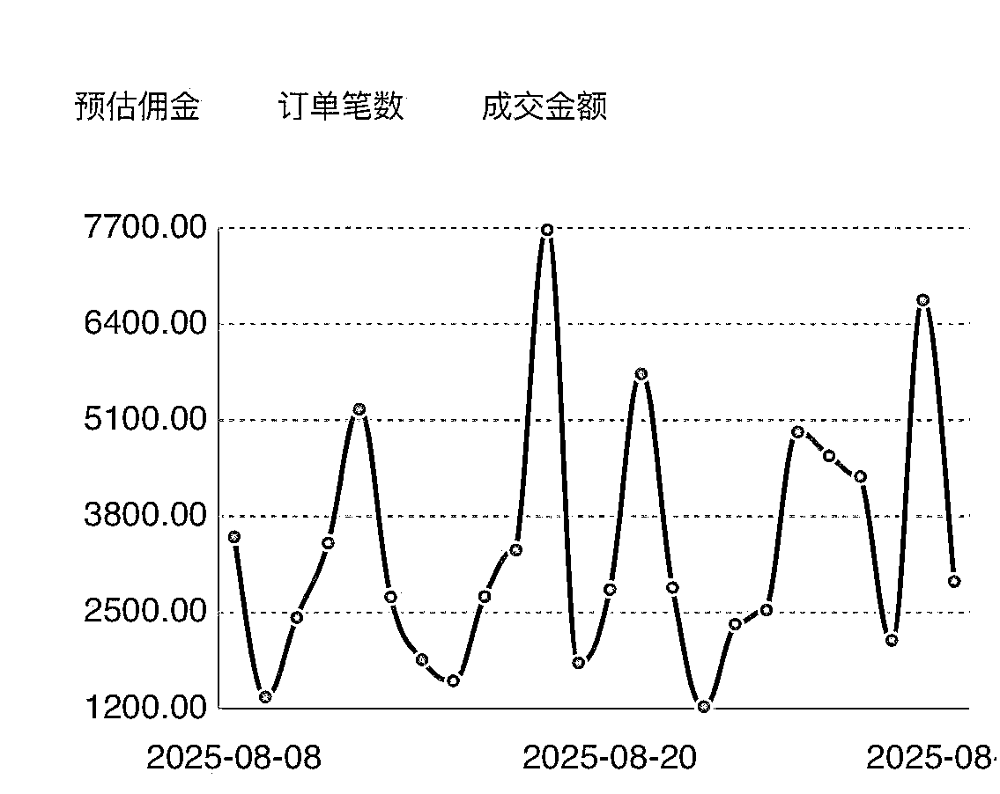
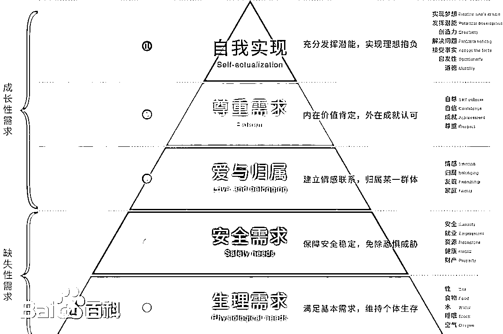
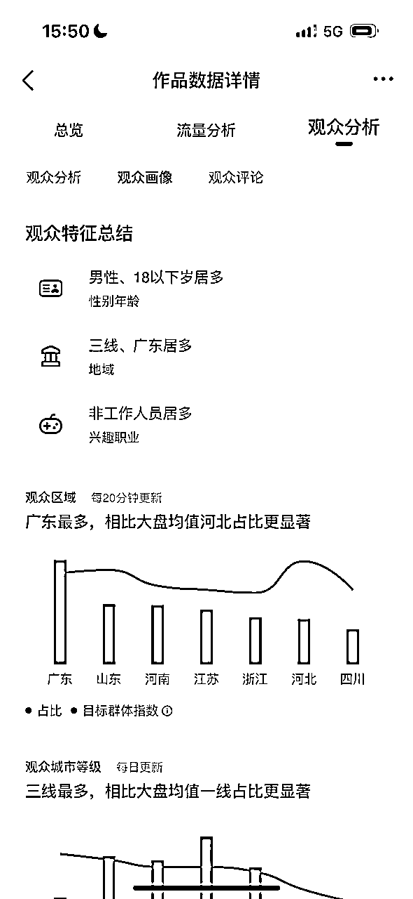

# 从0到月销5W单：我做外卖CPS短视频的爆款框架与思维转变

> 来源：[https://uq5667tkx0.feishu.cn/docx/Pzpdd7rB2ofkdex0KeZc1svDnVb](https://uq5667tkx0.feishu.cn/docx/Pzpdd7rB2ofkdex0KeZc1svDnVb)

### 一.从信息流编导到自由职业的探索

<h9>1.背景介绍：离职后加入生财</h9>

见字如面，大家好，我是新人Lesley!是今年5，6月份加入生财的萌新一枚。在此之前我没有任何靠副业赚钱的经验，只是按部就班的做了5年的信息流编导。终于在某个平凡又枯燥的一天我发觉自己再也不能当一个脚本输出机器，毅然离职。我想知道除了进体制内或者是给别人打工还没有没有其他的赚钱方法，自由工作者那么多也不差我这一个。后来就加入了生财，这只是故事的开始....

<h9>2.为什么我会选择外卖CPS赛道？</h9>

离职后爽玩了一个多月后，我并没有很明确的目标，也不知道自己擅长什么，脑袋空白一片。正巧外卖CPS的mini航海开始了，就想着做做看。当初看中这个项目的优势在于它，受众广，上手简单，变现链路短，而且可以尝试短视频引流变现，于是就报名了。

<h9>3.一个月的收益成果</h9>

在第三四天的时候佣金就赚到了150佣金，后续低迷过一段时间，然后突然爆发，单日单量超2W单，并日趋稳定每天上千单，一个月累计超５W单

接下来我将分享这一个月从0到1的外卖CPS短视频引流的操作方法，希望能给正在做相同赛道或者是想入局这个赛道的朋友带来一些启发！

### 二 .从0到1：冷启动与快速破局

<h9>1.初期迷茫与方向选择</h9>

刚接触这个项目的时候我完全没想好怎么做，阅读航海手册的过程中，我会发现上面更侧重于直播引流的途径，这个给我这种超级大i人的挑战几乎是劝退性的。但是后面我看到还有其他的引流玩法，比如公域引流，如：抖音，小红书，咸鱼等，还有私域引流等形式。于是我就去抖音搜了一下和外卖优惠券相关的视频，发现有很多相关的视频，且流量都很好，我就进一步确定了要做短视频引流这个赛道

<h9>2.对标分析与内容测试</h9>

抖音短视频引流说到底还是属于视频营销，短视频营销我可是轻车熟路。我把这次的外卖CPS当作我接的一个全新的信息流新项目来看待的。那么第一步就是找对标，前期在浏览爆量视频的时候我发现大家的风格比较多样化，同一风格的很少。而且当时刚做外卖CPS，不太清楚人群画像和喜好，只要是爆款我统统都模仿。第一天剪辑了４个视频，四个视频四个风格，也不区分是美团还是淘宝统统都发在一个账号上。虽然很快就出单了，但是视频整体播放都不高。

<h9>3.从关注单量到聚焦内容质量</h9>

开始的时候没有掌握发视频的节奏和观众爱看的点，我每次都是剪完视频就发剪完就发，过于关注单量涨幅了，这是不对的，后面我开始筛选视频，开始拆解爆款视频，并分析爆款视频的共同性。

我一般就是两个原则：１．挑选低粉爆款的博主的视频，２.就是前５秒有钩子能吸引我的视频。还真让我总结出了一些爆款视频的规律：

以上两个爆款视频，都是开篇就标明了平台，日期和利益点，以教学形式引导用户操作，内容可复制性很强，基本上不用换形式，每天改改日期，填充下内容就可以。

后面我还扒了一些爆款视频的脚本然后总结了一些规律和视频节奏，希望对大家有所帮助。

于是按照这个规律，第三，四天的时候赚到了１５０佣金，一周４２０佣金

当时拿到成果还蛮开心的，至少实现航海前立下的把学费赚回来的ｆｌａｇ。当时看到群里有大佬日销近１W单，佣金上千的时候我真的崇拜得五体投地，要是我能像大佬们一样，不敢想不敢想。 没想到几天后就出现了重大的转折..

### 三. 爆发增长：爆款的诞生与方法

<h9>1.单条视频爆火，单日佣金突破2W+</h9>

然后某一天，某个视频爆了，播放井喷式的增长，评论根本回复不过来。当天的单量就2w+，我记得当时正好是秋天第一杯奶茶预热活动，各个平台优惠力度很大，流量高。当时选了各种奶茶诱人的视频穿插在视频里，蹭了一波热度，没想到视频爆了。

<h9>2.沉淀爆款模型，实现每日千单的稳定收益</h9>

有爆款就好说了，说明这个形式是能跑通的，接下来的几天我都复刻爆款形式想看看这种模式是偶然还是可以长期做的。后续虽然流量不如爆发期高，但是比新手期好很多，每天也能在1000单以上，虽然没有超级大爆款，但是转发每个视频都能维持在几千。

爆款视频的模型可以总结为：

带有钩子的标题（吸引人，话术简单）➡强调优惠方便，好拿 ➡引导用户互动➡展示大额优惠界面➡引导用户使用

<h9>3.从评论区挖掘优化方向</h9>

跑通了视频模式之后，每天就会有人留言刷评论，我会分析用户在意的点，后续每次剪辑视频的时候会根据用户的需求进行调整。后面我就多创了几个号，也是能跑出稳定的收益的。不求大富大贵，只求稳步增长！！

用户一般会有三个大类别的需求：

1.不知道具体怎么操作的（这个需要在视频里很清楚明了的去引导用户）

2.觉得外卖贵的（这个在视频里提现很多人都能白嫖外卖这种话术）

3\. 想要领到大券的羊毛党（从视频开头就抛出钩子引导）

### 四 核心干货：爆款视频的底层逻辑

<h9>1.信息流广告五要素</h9>

1.五要素构成了广告内容的全部内容（以外卖赛道举例）

谁--广告的传播者(广告主、广告经营者)---外卖就是（美团，饿了么，京东）

告传播必须明确广告主，这是由于广告传播的目的和责任所决定的

说了什么--广告信息(广告文本)---利益点，就是我这个产品能给用户带来什么好处（越吸引人，越夸张越好）

信息具体是指思想观念、感情、态度等等，这里的信息不是泛指任何方面的信息，而是限于广告所“诉求”的信息。

通过什么渠道--广告媒介---用户要怎么得到（分享链接跳转APP的途径，越简单越好）

传播媒介把信息转化为“适当的符号形式(文字、图像、语言)”，只有经过这种转换才可能实现跨越时空的传播。

对谁说--广告的目标受众--- 目标用户（羊毛党，学生，宝妈等）

广告传播总是针对一定对象选行的。广告主在开始发起传播活动时，总是以预想中的信息接受者为目标的。

有何效果--“反馈”--- 人人都能0,1吃外卖或者是奶茶，外卖自由

“反馈”是指广告治动不仅是一个信息传播者向接受者发出信息的过程,还包括信息的接受以及由接受者作为反应的反馈过程在内，是传播、接受、反馈活动的总和。

这个是整个视频广告生成的整体框架，如果每条视频都能按照整个框架来或者是把某几点深度挖掘到了，整个视频质量是不会差的。

<h9>2.需求层次理论：提升视频穿透力</h9>

更深层次的就是马斯洛的需求层次理论了（这个是当你拥有成熟的爆量模型后这个非常的好用，可以大幅度提高视频的跑量能力）

（这个是站在用户角度，能满足的从低到高的需求）

说实话我的视频重复度很高，几乎都是一个跑量模板复刻，但是每次我会按照这个需求去填充不同的内容，这些内容就是要发掘一些用户更深层次的需求。（比如：占便宜，缺钱但是要吃饭，吃饭自由等）整体视频播放和转发都不低。

<h9>3.用户行为分析与痛点挖掘</h9>

1.用户分析主要是从各个人群维度找到产品的目标用户画像，分析目标用户痛点，为后续创意制作提供人群方向。

基础属性 行为特点

年龄段、性别、地域、职业、 兴趣标签、用户消费心理、

教育程度、收入状况。 消费目的，消费场景

就是创作过程中要从用户画像和消费行为等两方面去发掘，我们要知道自己做出来的视频面向的受众以及受众在什么时间段，哪里会使用我们的产品，这个也是提高视频质量精准度的一个重点！

2,分析用户痛点

1)何为用户痛点

痛点就是用户未被解决的真实切身需求，指让目标用户付出某种行为的最大阻碍（没有钱，饿，想占便宜等）

2)找出在每个阶段影响用户行为的关键因素

性能/效用:这东西能不能达到我想要的效思?

形象:是不是符合我个人形象的?

可靠:是否存在风险?是否用起来不稳定?。

容易:做出该行为是否很容易、不需要思考?

价格:做出该行为花钱多不多?

3.根据目标用户的人群特征，用户心理引起的消费目的不同，做用户分层

根据分层用户，分析用户消费场景来分析对应的目标用户痛点

用户分层 用户场景分析

根据用户画像，不同群体特 用户在什么时间、什么地点以及

征，分析消费心理，把客户 什么场景下会使用到客户产品

的目标人群做用户分层 通过消费场景分析相关的目标用

分析用户通道内--以外卖引流为例（这个抖音的作品就能看到哦）

1)用户画像:18岁以下居多（可以理解为学生党，羊毛当）、男性用户比例较高、二三四线城市人群较多、收入中等偏下.……

2)用户分层

·基础属性分层:年龄段、地域;

·消费心理:便宜、新奇、享受、好玩等等

3)消费场景分析

·刚需物品购买，现在很饿想点外卖

· 没有钱，想点便宜一些的外卖

·羊毛党想占便宜的心理

·没有渠道，但是看到别人点了0.1元外卖，也想占便宜的从众心理

（以上是基于这一个视频的分析，人群画像的年龄不太准确，大家可以根据自己多个视频的人群画像总结一下）

<h9>4.创作者思维转变到消费者思维总结</h9>

所以视频创作，特别是爆款的产生都是有一定的底层逻辑的。 我们所说的视频质量好，并不是一定要视频画面多么优美，剪辑手法多么炫酷，实际上是要遵循一定的逻辑，要有打动用户点。在内容生产和视频创作的过程中要不要用创作者思维去干，切忌辛辛苦苦剪辑几个小时，觉得视频很好，很用心，自己感动了自己。而是把自己当作消费者来进行创作，我（现在有什么困难，这个需要深度挖掘），你能给我带来什么，获取的方式难不难，我有什么好处。在创作的时候多想想这四个点，是能很大的提高视频质量。

当初流量好的时候有很多同行都问我是怎么养号的，怎么能同时做到手上的号都有稳定的流量。我的回答是我从不养号（因为我不懂)

我都是根据以上的底层逻辑进行视频创作的。主要是视频质量，其实我每次产出钱都是遵循以上逻辑进行创作的。其实我觉得号并不是越多越好，因为一个人的创作精力实在有限，可以先深入发掘爆款模型，再去新号复刻这样比几个号一天发很多视频的做法要简单很多。

### 五、 现状与未来：红利后的挑战与应对

<h9>1.当前赛道环境分析</h9>

对于想现在想入局外卖短视频引流的朋友们需要了解现在的大环境：

1.现在环境很差，外卖大战热度褪去，平台优惠逐渐降低，用户吸引度逐渐降低

2.9月份视频起量难，爆款难产出难度增高

3.同行恶意竞争严重，没有好的解决方式

这一点尤其会影响视频起量情况，其手段不乏：1.批量多账号恶意举报起量视频导致被下架，2，恶意搬运个人作品导致很难跑量 3.恶意刷赞导致作品断流等

<h9>2.心态调整与未来策略</h9>

作为副业萌新我想和大家聊聊这一个月的心理变化希望能给同样处在迷茫时期的朋友带来帮助

最开始加入生财的时候，我完全不知道我能做什么，我会做什么，然后看大佬分享的帖子对于那时的我而言完全就是薛定谔的理论。现在想想人是永远赚不到认知以外的钱，这句话真没错。刚加入的时候正好6月份大航海开航，从众心理我就随便选了两个项目报名了一个是共读《生财宝典》，一个是小红书虚拟资料。我每天非常麻木的跟着航海手册的操作，然后打卡，一直到结束都没有什么成果。后面我的反思是，小红书虚拟资料虽然很好，但是我本人平时并不用小红书，只是给它当作一个搜索的工具而已，而且我选的虚拟产品的赛道也是一个我完全不了解，也不感兴趣的东西，前期没有反馈，就没有动力继续做下去了。

后续就是加入了mini外卖CPS航海，正好它可以用短视频引流，我当时想着这和我之前工作做的事情差不多，就报名试试，没想到取得了意想不到的成绩。这次很不同的一点就是，这次实操的每一步，我大概知道怎么做，也知道怎么试错。因为之前的工作经验，我有不错的优质视频筛选能力，所以很快就有正向反馈。所以我的好事的帖子都是建议大家要选择适合自己或者是自己感兴趣的赛道，真的能事半功倍，正向反馈永远是最好的驱动力。如果你还在迷茫中，没有拿到成果的话，不妨静下心来读一读《生财宝典》，当初的我不屑一顾，如今的我如数家珍。

在取得一定成果之后，9月份来到了低谷期。其实做短视频引流很能对应一句话：搞钱就是搞流量。但短视频的流量不稳定，每天的落差很大，8月份有波动但是整体稳定，只要发视频观看量不会低于一万，转发量也是上千。9月份因为平台和同行的恶意竞争的原因要么没有量，要么就是视频微微起量就被举报侵权下架，或者恶意刷赞，长此以往账号权重会越来越低，现在视频都是几百一两千的播放了。这种情况申诉一般都不会成功的，可能还会影响后续作品的流量。

走过的每一步都算数，做每个项目都不会一帆风顺，现在就是调整好自己的心态，发掘新的爆款模式，创建不同的小号，一边维持，一边想解决办法。外卖CPS短视频引流这个赛道现在是难做，但是也不是不能做，毕竟它的三个优势还摆在这里。后续的即时零售也有很大的市场，只有保持在牌桌上，才能等待下波爆发的机会。

最后非常感谢生财，让我看到了个人不依托于公司所产生的价值，为我立志做自由职业者的目标喂了一颗定心丸。也看到了个人的潜能是无限大的，当今社会一个人也能撬动很大的杠杆。由衷感谢航海教练，领队，志愿者对我的帮扶。希望我的经历经验能给生财的小伙伴一些启发!