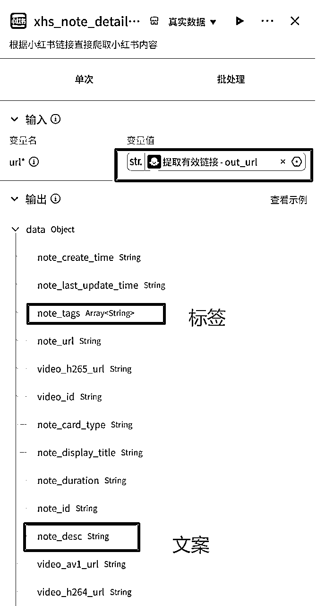
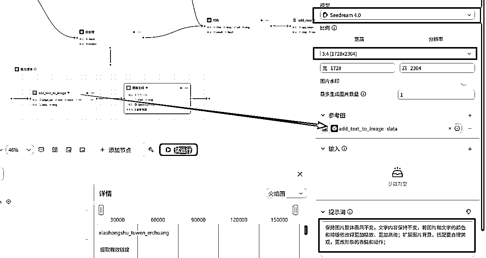

# 首篇笔记就变现成功，小红书新手破0神器教程：coze/N8N工作流一键模仿对标笔记

> 来源：[https://bqrx3wjikn.feishu.cn/docx/KgrfdnVRKoh2gTxgg5fcAn1KnSb](https://bqrx3wjikn.feishu.cn/docx/KgrfdnVRKoh2gTxgg5fcAn1KnSb)

本次N8N的航海中，在做公众号二创的工作流时，突然有一个灵感：既然文案、文章可以洗稿二创。 那么图片是不是也可以？

因为前段时间。 Nano banana。 以及咱们国内的豆包4.0的升级，带来图片的高度一致修改的能力。

因此我做了小红书笔记二创的工作流，用户只需要输入对标笔记的链接，工作流自动二创并将结果保存到飞书表格。

针对图文笔记，能够进行结构上的高度模仿，电商以及虚拟资料相关的。 应该都能用上。

针对在做小红书项目的小伙伴们，如果还是新手的还在模仿阶段的。我觉得这个工作流能够给到一定的帮助，目前本人亲测有效，下图中新账号第一个变现型笔记，发布就获得3个询盘，且成交一单，可以看下效果图。

## 效果展示


其中，主要修改了图片的颜色搭配、背景、部分排版emoji等，而保持和原图中文字或者文字含义不变；具体可以通过修改提示词来调整其图片的修改程度。


过程中会发现，即使元素比较多的图，模仿后也有很好的效果（如上图，背景，字体、孙悟空的造型颜色都有修改）


除了颜色背景外，如果图中有人物、动物等形象，会修改其动作和表情。

## 工作流教程


整体流程还是较为简单的，分为4个步骤：格式化链接（因为考虑到复制过来的小红书链接是有干扰文案的，所以处理成纯链接）、提取链接内容、用大模型二创标题和正文、修改图片、数据格式化、保存到飞书。

### 1、提取分析链接

这部分分为两步，第一步是处理链接，原链接是：


用大模型直接过滤无效信息即可，这里模型选择因为是比较简单的操作，所以1.5就够用了：


第二步则使用小红书提取链接信息的插件，先搜索小红书插件


下滑找到具体插件：


该插件只需输入链接即可，结果里标签、文案、标题、原图的URL都有：




### 2、标题正文二创

#### 第一步：提炼框架

用1.6大模型，输入直接引用上个节点的标题（title）和正文（note_desc）：


提炼框架的大模型提示词：

# 角色

你是一位专业的小红书内容分析师。

# 背景

在输入中包括小红书标题{{title}}、正文文案和标签内容{{note_desc}}；(其中带“#”的是标签)

# 核心任务

你的核心任务是：提炼出该笔记的标题写法结构，以及内容的风格和框架；

#特殊情况

分析内容中，如果没有找到标题、正文文案、标签，则跳过处理，对应字段输出为空即可；

# 输出要求

1.  标题结构：提炼标题框架的维度大概从以下几点出发去分析，没有的维度不用删除，主要目的是讲清楚这个标题怎么写，有哪些特点：

人群+痛点+emoji图标+情感词（如：哇！、可怕！等）+符号（|、！、~等）

注意：不用重复输出原标题的内容

1.  正文结构：包括以下维度来分析：

正文主题内容摘要：....；

正文行文框架：....；

正文行文风格：....；（包括文风、语气词、符号运用、图标emoji应用等）

要求尽可能详细，内容部分与原文相似度60%，风格和框架与原文相似度90%；

1.  核心信息提炼：从正文中提炼出内容中的核心信息点，分点输出；

1.  字数：原文案中，不算标签内容，标题+文案的总字数（输出纯数字即可）

1.  标签：识别并输出原文中的标签内容。不要修改直接输出即可；

1.  格式化输出：请严格按照以下格式样例输出，以确保内容清晰：

"这是标题结构",

"这是正文结构",

"1.这是信息点1。2.这是信息点2...",

"这是字数",

"这是标签"

#### 第二步：生成文案

第二步则是根据刚提炼出的框架，生成新的标题和文案。输入的引用则是提炼出的框架，以及原文作为提示词中的模板：


提示词如下：

# 角色

你是一位顶级的小红书运营专家，精通小红书文案风格和写法；

# 核心任务

你的核心任务是：接收我提供的{{input}}，其中有包括[标题框架]、[正文框架]、[正文信息要点]等，来写一篇小红书文案以及标题，文案中需包括【正文内容的核心内容点】中其中的信息点，最后创作一篇标题、正文文案字数不超过原字数；

# 写作风格参考范例

为了让你更精准地理解我想要的写作风格，请仔细学习以下范例：

原文范例：{{note_desc}}

* * *

# 最终输出格式

你的最终输出**必须是**一篇完整的、纯净的 **Markdown 格式**笔记正文和标题，其中正文结尾包括了标签，标题也是一句话不超过20字符；正文多用换行。格式如下：

"这是文案标题"，

"这是正文内容。#...#..."

注意：

标签的格式需要处理，均为“#”加上标签名，再无其他后缀，例如：#标签1 #标签2

### 3、修改图片

因为一篇笔记往往有多张图，所以需要使用批处理，这里只需引用解析链接节点中的图片链接字段即可，结果的引用可以最后选择，先把批处理的内容做出来：


整个批处理体内一共两个节点，其中第二个是图片生成的节点。这里需要注意的是，因为图像生成节点引用是类型必须是image，而原图片的链接是string，所以我们用一个水印插件处理处理一下格式：


#### 第一步：处理图片链接格式

插件搜索“添加文字”：


输入解析出的原图片链接：

（注意：这里这个插件原本的作用是给图片增加水印，但我们的目的并不是增加水印所以这里文字内容也就是水印内容只需要打一个空格，我们用这个插件的原因是因为这个插件最后生成的链接是一个Image类型，所以这里文字内容输入一个空格就不会对原图片画面有影响）


#### 第二步：生成图片

图片生成节点的模型使用seedream4.0，比例3:4，图片数量输入1，参考图引用上一个节点的结果，再输入提示词即可：



### 4、保存飞书

#### 第一步：数据结构化：

这里第一步代码节点的目的是汇总生成的标题、文案、和图片，并生成“add_records”飞书多维表格插件所需要的输入类型。

我们查看飞书插入多维表格数据的字段可以看到，插件对格式有固定要求（是一个object数组），因此需要用code代码节点来处理数据。


这里输入是引用生成的标题、文案、原链接、和图片，输出改成Array类型：


代码可以直接交给AI来写，这里我把提示词也分享一下:


上图这个代码中四个变量，img是字符串数组，其他的都是字符串，现在，先把img这个数组所有值拼成一个字符串imgString，每个值之间换行来间隔。然后把这四个变量的值，写到一个变量result中，result的格式（obj数组）：

[{"fields":{"原文链接":url,"标题":title,"正文和标签":desc,"图片链接":imgString}}]

帮我写这个代码

代码：

```
import json
async def main(args: Args) -> Output:
    params = args.params
    url = params["url"]
    title = params["title"]
    desc = params["desc"]
    img = params["img"]
    # 构建输出对象

    # 将 img 数组的所有元素用换行符拼接为一个字符串
    imgString = "\n".join(img)

  # 构建目标格式的结构
    result_list = [
        {
            "fields": {
                "原文链接": url,
                "标题": title,
                "正文和标签": desc,
                "图片链接": imgString
            }
        }
    ]

    ret: Output = {
        "result": result_list, 
        "key2": { 
            "key21": "hi"
        },
    }
    return ret
```

#### 第二步：保存飞书

最后一步，找到飞书多维表格中的“add_records”插件：


插件需要先进行授权，也就是跟你的飞书账号绑定，点授权：


然后在自己的飞书文档中新建一个多维表格，然后复制表格地址链接


将链接输入到插件中token字段，records则引用上个节点的结果：


最后的结束节点，可选择输出代码节点的结果，也可以输出飞书链接，不重要，因为我们结果是在飞书多维表格里看。


最后生成的结果中，标签则直接是加在正文后面，方面复制发布，链接可以使用图片下载工具批量下载：

工具地址：https://imagedownloader.online/zh-cn/


## N8N版本

如果希望实现自动监控表格来生成内容，或者想使用国外大模型的，可以用N8N来搭建，大体流程类似。可参考航海手册，增加一条生图的分支即可。


## 结语

### 1、不足

美中不足的是，目前图片生成也就是图片修改这一块还不完善。 因为很多图片里面是有很多文字、文案的，那这些文案，目前生图的大模型是没法修改文案的，他只能改字体或者改颜色，还没法改内容，期待AI的进步吧！

### 2、原创的笔记怎么批量做？

以上工作流主要是针对模仿二创的场景，而很多老手其实是有原创的需求的，但是呢我们原创，也是要测试笔记的类型、主图的模板的。 这个时候也可以在原创的基础上利用现在的never banana或者豆包4.0进行修改，来做成模板的效果。

具体的搭建流程框架和本篇类似，只是参数和提示词不同，如果真有小伙伴们需要可以联系我再做一个~