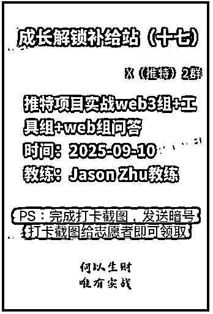
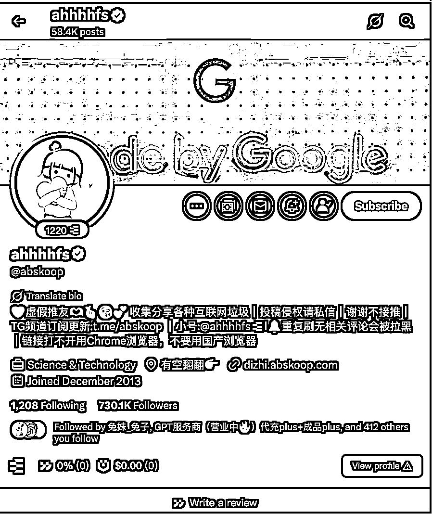

# 新人如何做AI自媒体-推特教练？带人48h 涨粉1000，50天变现近五位数

> 来源：[https://mblfvdi7tv.feishu.cn/docx/KSCgdu2aRo1XQix2hDscV0pvnLg](https://mblfvdi7tv.feishu.cn/docx/KSCgdu2aRo1XQix2hDscV0pvnLg)

大家好，我是Jason Zhu，8.13加入生财并报名自媒体推特-X教练，9月份作为自媒体推特-X教练带领大家航海，这是我第一次当航海教练，虽然一开始比较生疏，多次被警告，但结果是喜人的，成功帮助船员起号若干，4例48h 达到1000粉丝！

今天分享的主题是： 复盘为什么做自媒体和「航海教练」的N个隐藏收获

# 一、自我介绍：8月加入生财，仅半个月我就当上了「航海教练」

## 不只是数字游民、远程工作者、自媒体人，还是生财的教练。

我是Jason Zhu，INTP（数字游民前是INFJ，目前已经后面两个都变了，足以见得变化之大），盖洛普测评排名第一为学习，双子座，普通话不标准的浙江人。

*   没经历过高考的大专生，专升本进了宁波大学，又考研调剂去了某双一流大学读控制工程，毕业找到一份薪水还不错的AI算法工作师岗位。

*   以前的我曾是一名鞋贩子，通过信息差从国外搬运鞋子到国内，赚了20W+：https://wx.zsxq.com/group/1824528822/topic/1524881444228182（生财链接）

*   以前的我还在上海和别人合伙开过密室，虽然惨淡收场：https://wx.zsxq.com/group/1824528822/topic/2852114222811241（生财链接）

*   探索期的我做过知识付费——coze、dify平台搭建RAG个人知识库，47人报名并结业。

*   现在的我是一名独立开发，研究AI SaaS出海，也是一名AI方向的内容创作远程工作者，与此同时也在做自己的个人IP，目前也获得一些小成绩，推特2个月5.2k粉丝，GoSail出海公众号700+粉丝，付费社群也达到了260人。

## 我的航海档案

今年 8.13 经朋友介绍加入生财有术，并立即报名了自媒体推特的航海教练，并成功当选自媒体推特教练，和近900位船员陪伴前行，圆满完成了航海之旅。

希望通过这次航海之旅和这篇帖子，我能够如愿进入「传术师」。

因为在生财，传术师和航海教练不只是称号，他们还是共建者队伍的一员。如果你还不太了解共建者？点击链接看看

传术师：https://t.zsxq.com/bRZ2U

航海教练：https://t.zsxq.com/DiuVB

如果你刚加入生财，想知道怎么快速融入；如果你已经在路上，想看看同行人的成长故事；如果你想搞自媒体-推特，想看看同行人的成长之路。

那这篇文章，或许能帮到你。

# 二、航海教练的成长

## 当航海教练带给我什么？从零经验，到SOP输出。

*   帮助船员成功起号若干，4例近48h就达到1000粉丝，完成冷启动，甚至变现

*   收获了认可与成就感， 提升影响力

*   沟通与信息处理能力大幅增强

*   学会因材施教，建立属于自己的 SOP 流程

### ① 帮助船员成功起号4例（48h 1000粉丝），完成冷启动，甚至变现

doridHZ，24小时涨粉1000+，曝光破20W+，一天成功变现¥1164；

鱼总聊AI，8小时涨粉1000+

鬼手，24小时涨粉1000+

柿子，24小时涨粉1000+

### ② 收获了认可与成就感， 提升影响力

通过帮助船员，越来越多的人认识我，平时仰慕的圈内大佬们（龙共火火、炮爷），也向我投来橄榄枝…

### ③ 沟通与信息处理能力大幅增强

各种群内求助、私聊咨询、突发状况接踵而至。刚开始的我常常手忙脚乱，不知道先处理哪一个。但在一次次磨练中，我逐渐学会了高效分辨优先级、快速回复，同时又能保持耐心答疑（共解答42个问题，1群解答22个问题，2群解答20个问题）。

### ④ 学会因材施教

和不同船员的交流中，我慢慢意识到：每个人的成长经历、学习方式和思考问题的习惯都不一样，需要用不同的方式去引导，特别是故事叙述的个人自我介绍，每个人都拥有不一样的经历：有耀眼夺目的、艰难曲折的、励志成长的。

为了更好地帮助大家，我搭建了一套“小 SOP”。

我把几个微信群置顶，并打开消息通知，确保第一时间能看到群内圈友的求助。

私信的，我一般先让其查看成功案例的自我介绍先学习，然后让他们尝试进行自行修改，还有问题的话，我会先抛出大家常犯的错误，让其自我反思迭代，最后我会帮忙亲自修改，指出问题让他改正迭代。

不同类型的圈友，我也会因材施教，多说几句解释，顺便加上一点鼓励，并通过释放一些干货激励大家继续走下去。

## 什么样的人适合做航海教练？

如果你是喜欢真诚分享，和人交流交朋友的人，那么做航海教练，会是一件非常享受的事情。

*   真诚利他，教练并没有实际薪水💰，还要进行答疑、日志点评和分享，所以需要有一颗真诚利他之心！

*   喜欢交朋友！

*   将实践经验和理论抽象出方法论，并进行传授，从而进一步提升自己，能力再上一个台阶！

*   想要更多的合作机会！

# 三、为什么以及如何选择自媒体平台

## 为什么做自媒体

自身出发：通过需求挖掘、产品开发走通了全栈网站的上线，但是由于不会营销推广没有流量，遂开始学习营销。

营销最重要的三点：

（1）营销就是卖给别人感受，感受无非是社会地位的提升、财富、健康

*   比如：我之前的菜谱网站，罗列功能是大多数程序员的通病，罗列功能吸引来的都是比较精明的用户，有可能别人产品功能增加就会被抛弃；但是如何把你的菜谱受众做成场景，适合家庭主妇做漂亮菜发朋友圈，同时合理的营养成分又可以让孩子更健康，此时你的竞品就不是美食博主网站，你的漏斗口就更大了，而这些详细生动的案例会让别人产生信任，引发购买。

（2）共赢

柏拉图给苏格拉底讲了这样一个比喻：

想象有一群人，从出生起就被锁在一个黑暗洞穴里，面朝墙壁，动弹不得。他们背后有火光，还有人拿着各种物体从火光前走过。人们只能在墙上看到这些物体的影子，听到回音，以为这就是真实的世界。

突然，有一个人设法挣脱了锁链，爬出洞穴。他被阳光刺痛，但逐渐适应了外面的光亮，发现了真正的事物：树木、动物、星辰和太阳。他意识到，洞中看到的只是影子、幻象，而不是现实。

出于责任，这个人决定返回洞中告诉其他人真相。但那些仍被锁住的人不但不相信，反而嘲笑他、敌视他，认为他疯了。

*   我们离不开人群，人只会从一个洞穴到另一个洞穴，而每个洞穴里的人都有每个洞穴的信，你要进入某个洞穴就需要知道别人信什么——和想赚钱的就谈赚钱。

*   有人群就存在合作，而合作需要共赢

*   案例1：品牌中介PR 找到你，你接了商单赚到钱，然后呢？

*   你可以多问问还需不需要其他博主，你介绍商单给其他博主，其他博主赚到了钱、你获取了品牌中介PR的好感便于下次接单想到你、品牌中介PR完成了任务多了提成，简直三赢。

*   案例2（思考题）：你是一个Nobody，你去学着写一段好的自我介绍文档，然后去找大V帮忙转发？你可以做什么呢？

（3）沟通

人前演说家，私下知己话（说人话：一对多装逼，一对一真诚！）

营销推广（产品 / 网站）的方式

1️⃣ SEO

SEO其实是零和博弈，大家都在争google排名，有些词只能昙花一现，也有些词可能让你一波暴富；然而SEO针对不同词来说是不能够直接迁移的，每次来新词你就得重新去做一遍，当然这套方法是可以固化下来的，但是很多时候你沉淀下来的用户没办法在下一波迁移过去。

2️⃣ 自媒体

自媒体是共和博弈，大家可以共享粉丝、共享商单，针对不同产品 / 网站 / 服务都有加持效果。

3️⃣ 付费广告

这是一个手艺活，是和平台共赢的手段，也是能大幅扩大杠杆的手段。

## 如何选择自媒体平台--推特

*   首先内容分为三类：图文（随便发的图文、干货的图文）、视频。

*   抓主要：

*   推荐推特、微信公众号、小红书

*   PR（Public Relations）原话：小红书需求量最大，但也是红海，其次是微信公众号和推特（推特目前是蓝海—— 经济下行、企业和个人出海）

*   一些分发技巧：比如即刻、微博作为流量试验场，然后根据平台调整内容形式或者直接分发。

信息差 = 位置差（第几手信息源） + 认知差（你能不能识别信息具有价值） + 行动差（你能拿到有价值信息之后的行动效率）

### 信息差：我在哪里获取信息？

第几手信息

一个有意思的图——铁锤人：https://x.com/lxfater/status/1950745399645638742

信息源（张咋啦——字节AI业务，前飞书产品营销负责人，哈佛本科）：

1 张咋啦发布了一篇小红书笔记，快来看吧！ 😆 9qv70HKpMtU 😆 http://xhslink.com/m/jytezFImI7 复制本条信息，打开【小红书】App查看精彩内容！

如何在Yotube上找到AI行业的一手信息（张咋啦）：

54 张咋啦发布了一篇小红书笔记，快来看吧！ 😆 6POgK6TGu2C 😆 http://xhslink.com/m/1rgf8vq7tUx 复制本条信息，打开【小红书】App查看精彩内容！

### 认知差：我如何判断信息的价值？

https://x.com/GoSailGlobal/status/1963481881485476301

—— 例子：🍌 nano banana 认知阶梯

1️⃣ 知道nano banana：听过这个东西，这个估计国内还有大部分人都不知道。

2️⃣ 理解nano banana：明白nano banana 到底是什么，解决什么问题/满足什么需求，这个估计各个自媒体宣传完，大家关注AI的都知道得差不多了。

3️⃣ 对nano banana感兴趣：觉得大家宣传的还可以，想试一试。

4️⃣ 尝试nano banana：国内使用第三方的平台或者google官方平台，去自己尝试一些idea或者复现案例。

5️⃣ nano banana能力工具化/流量化：自媒体IP抓住机会获取流量，或者使用vibe coding去做一些自己玩的小工具使用或引流。

6️⃣ nano banana能力产品化盈利：比如网页http://nanobanana.ai和日活10W+用户小程序XXX，套壳也能转差价，借上google和自媒体自传播的东风；另外还有一波使用nano banana能力开发颠覆行业的产品。

### 2.3 行动差：我如何付诸行动？

（1）心理建设

为什么推荐阅读《摆摊式创业》？

*   因为大多数人都有曝光羞耻感，觉得自己是一个普通人，平平无奇，不足以让大家关注到我。

*   自己没有创作背景，怎么能在这个赛道做过别人。

但事实是：

1️⃣ 无论你在你目前的领域获得多少分，都会有你自己的受众；

2️⃣ 通过优化你获取的信息源渠道和质量、提高你的认知，你就可以帮助那些不太了解该领域的受众；

3️⃣ 恰恰是现在AI大语言模型的兴起，受众反而更喜欢口语化表达，因为更有真实感；

4️⃣ 内容大于形式，观点大于信息（信息爆炸的时代，你的观点就是你对信息抽象和专业性的体现）。

5️⃣ 传播最广的往往是「仰望15度角」的内容，这样做内容会让受众觉得更近，你只是比他们走快了一小步，他们踮脚就能够到。

知道事实后，首先需要转变的思维是你想要赚钱！很多人只是嘴上说想赚钱，但其实心里甚至觉得钱很脏，不屑赚钱，那又怎么能赚到钱呢——心之所向，行之所往。

一人公司、SaaS出海、自媒体这些所谓的创业，其实就是摆摊。

*   摆摊首先得保证自己出摊，然后你还要按时出摊，如果光信什么被动收入，人从哪里来，按时出摊是让别人来了不落空。

*   其次你得吆喝起来，不然为什么在那么多人中选择你

*   最后才是销售你提供的好产品，卖给正确的人群，真正能帮助受众人群解决某些强需求。

另外，摆摊式创业，一开始千万别嫌小，后面找到杠杆放大财富就行：信息 + 认知 + 行动 = 财富

（2）科学上网

自己解决

（3）分发工具

*   手动方式：推特内容直接截图，同步图片和文字到微信公众号、小红书

*   arc浏览器 + 爱贝壳内容同步助手：http://app.niucodata.com/mianbaoduo/recommend.php?id=74755

（4）推特工具

1️⃣ https://pro.x.com/（蓝标x自带pro工具，发长threads挺好的，还能排程）

2️⃣ SuperX（app需要付费，里面灵感工具一开始会惊艳到你；Chrome插件免费）

3️⃣ buffer

4️⃣ typefull

5️⃣ xhunter

（5）公众号排版工具

1️⃣ 大聪明-公众号排版工具：

2️⃣ 谷歌浏览器插件：飞书转公众号助手

# 四、推特具体的运营实操路径

## 推特前置知识

（1）中推和英推

优先中推，因为你不懂外国人的习俗和黑话；目前中推转英推成功的大号很少，虽然英推上限高。

（2）推特蓝标要不要开？

不开推特蓝标的话，别人可能不太会关注 / 回关你 + 推文字数限制 + 限流（传言）

（3）怎么开？

可以网页切换语言，看看日区或者其他区域是否便宜，开premium就行！

（4）推特三大需求（键政、黄推除外）

*   情感 / 情绪价值

*   赚钱

*   学英语

另外这三个需求还可以延伸出来，这个需要多分析小号爆款文章的本质，如果分析出来你可以模仿其神，修改其形。

## 推特养号、找对标

### 推特养号攻略

1️⃣ 初始稳定期：新账号注册后，不要马上进行大规模操作，先让账号稳定2 - 3天。在这期间，像正常用户一样每天登录推特，浏览首页的推文，了解平台上的热门话题和最新动态。

2️⃣ 完善账号资料：更换真人头像，让账号看起来更加真实可信。编写详细的个人简介，介绍自己的兴趣爱好、关注领域等，增加账号的辨识度和可信度。

—— 工具：咸鱼买个canva永久会员 ¥6、联系方式工具参考：https://lnk.bio/JasonZhu、https://linktr.ee/aixjiajiajia

### 对标账号（对应推特需求）

1️⃣ 赚钱：栋哥、web3 kol

2️⃣ 情感：

*   做真实的自己，多表达自己的内心：Mr Panda

*   娱乐休闲：ahhhhfs

*   深层次情感：FOMO（Fear of missing out）、自我提升

*   专业账号：归葬老师、乔木老哥

*   资讯账号：小互、AI Will、@Gorden_Sun、@HiTw93

3️⃣ 学英语（Rey、Haoshan）

## 内容创作与冷启动

### 输出

唯一确定的两件事：多发必涨粉、搬运和工具分享也能涨粉且速度不错

#### 初期：冷启动

1️⃣ 第一种：直接干 —— “闷头苦干，每条推只有几个或者几十曝光”

2️⃣ 第二种：写个人介绍的故事（长文共情故事 or 战绩+共情+长线程，最重要的事情需要大V转发——共赢，提供大V价值）—— “个人IP强、起号快、后期变现渠道多”

*   长文共情故事：

https://x.com/GoSailGlobal/status/1949467524669776131（一条涨粉1k+）

Cell 细胞拆解我的推文：https://x.com/cellinlab/status/1949662017155223798

营销启蒙老师--铁锤人的拆解：https://x.com/lxfater/status/1950117226620625372

*   战绩+共情+长线程

https://x.com/axichuhai/status/1955521806473069033

#### 进阶：内容创作

蹭热点是基操

歸藏老师nano banana一周热点流量（7D 400W）：https://x.com/op7418/status/1962352258122944736

## 放大与运营（如何持续产出、蹭热点）

信息差 = 位置差（第几手信息源） + 认知差（你能不能识别信息具有价值） + 行动差（你能拿到有价值信息之后的行动效率）

1️⃣ 搬运（搬运可以变成大号，但能否长久取决于你学习、信息检索和迭代能力）

*   下载飞书内容

*   飞书官方剪藏：https://chromewebstore.google.com/detail/%E9%A3%9E%E4%B9%A6%E5%89%AA%E5%AD%98/mofcmpgnbnnlcdkfchnggdilcelpgegn

*   Colud document Converter：https://chromewebstore.google.com/detail/cloud-document-converter/ehkomhhcinhikfddnmklbloahaakploh

*   免费推特视频下载

*   https://twitterxz.com/zh

*   http://DataTool.vip - 免费 - 全能视频下载工具

*   多平台素材下载器：

*   https://github.com/putyy/res-downloader

*   英推博主转译为中文：

*   Google插件 —— 沉浸式翻译

2️⃣ 资讯——建立自己的信息源

*   RSS源

*   官方RSS源

*   RSSHub提供的第三方https://docs.rsshub.app/

3️⃣ 持续输出、讲述自己的观点

# 五、变现闭环：自媒体变现近五位数，从何而来？

、

## 咨询

咨询也是产品 / 服务：

*   首先你需要吆喝，第一个咨询是来自于数字游民社区的群聊，我会将我的出海内容分享到各个群聊，然后刚好客户有一个情感化学习插件项目，有一些困惑需要咨询。

*   其次你需要敢于定价，这里的建议可以按之前上班时薪的2倍去报价，后续也可以继续调整（第一次我报价了350，因为是第一次咨询，打了折）。

*   一开始客户想要做一个AI 基础设施，在大厂做情感交互的背景下，以小切口去做一个生态，理想很丰满，显示很骨感，没有考虑融资方案、收益方式、生态建设的成本、人工成本、数据上链成本。

*   我一步步引导他，可以考虑从web3项目方那边融资，可以考虑从B端用户转向C端用户，缩小场景，并调研了一些产品给到他。

*   持续跟进客户情况，客户比较满意你的付出，打赏了88.88

## 商单

*   抓住机会多曝光自己：第一个商单是加入了向阳乔木老哥组建的博主群，迅速接龙并在飞书表格内填写相关信息，广告商通过这份内容联系到了我。

*   敢于定价：一般根据粉丝数和阅读量来定价，敢于出价（大不了咱降价嘛）

*   一开始不要嫌商单价格低：粉丝量低、阅读差的咱们就秉着先开单，再迭代优化的思路，不要一上来嫌这嫌那的

*   维护自身信誉，维护商单数据（共赢）：既然你接了商单，你就需要帮忙维护数据，不然就是一次性买卖

## 分销

*   首先保证自己是产品 / 服务的用户，因为这会影响口碑

*   其次需要知道分销其实对大家都有益，产品开发者获得了更多订单，分销者获得了佣金（一开始不要太在乎佣金率），需要购买产品的用户通过你的链接获得了优惠

*   可分销产品 / 服务：

*   别人的小报童 / 知识星球

*   saas订阅产品（目前接触的可以使用Affiliate、面包多进行分销链接构建，便于追踪订单来源）

## 其他变现途径

✅ 马斯克低保（500M曝光 + 500蓝标认证folllow）

✅ 知识付费

# 六、复盘总结

## 踩过的坑

*   千万不要有曝光羞耻感，放不开自己

*   认为自己是Nobody，没有受众

*   想太多，而不去实践 —— 纸上得来终觉浅，绝知此事要躬行

*   关注那些对你恶语相向的人

*   没做过的事，就充满恐惧

*   过分内耗

## 新手建议

*   现在适合做吗？

*   推特自媒体是蓝海，抓紧下场

*   什么样的人适合做？

*   如果你有自己的见解和知识储备，可以做个人IP，为以后的产品和服务引流

*   如果你只想赚钱，那么搬运AI资讯快速涨粉，可以用商单、网盘变现、知识付费来变现；或者分享工具、资料等内容，进行网盘变现或者引流到自己的网站进行广告变现。

# 七、书籍推荐

1️⃣ 《网感》：培养自媒体网感

2️⃣ 《千面英雄》、《故事经济学》：学写故事

3️⃣ 《主权个人：掌握信息时代的变革》：一人公司、超级个体的必要性

4️⃣ 《The Network State》：社区的必要性

5️⃣ 《SITUATIONAL AWARENESS The Decade Ahead》：社区的未来

6️⃣ 《摆摊式创业》：从摆摊中学创业

7️⃣ 《文案训练手册》：怎么写文案

