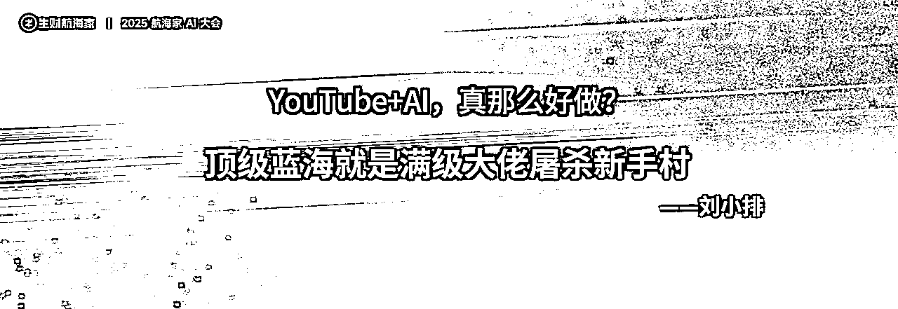
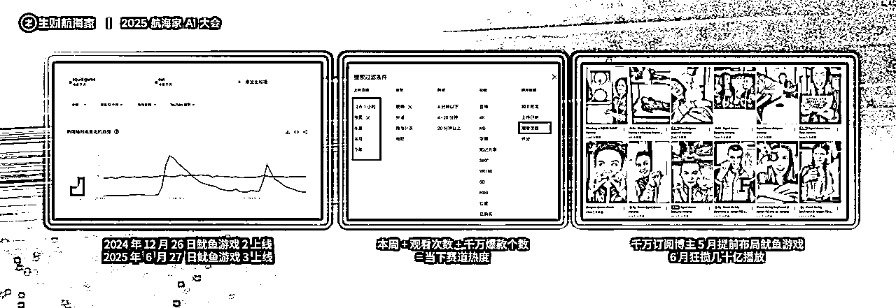
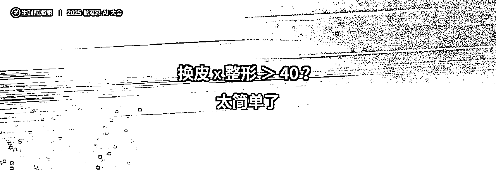
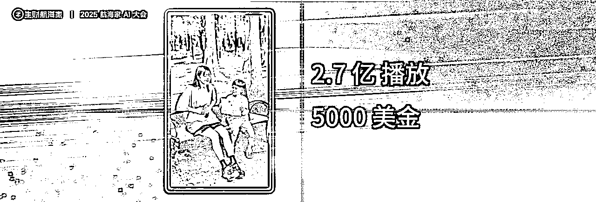
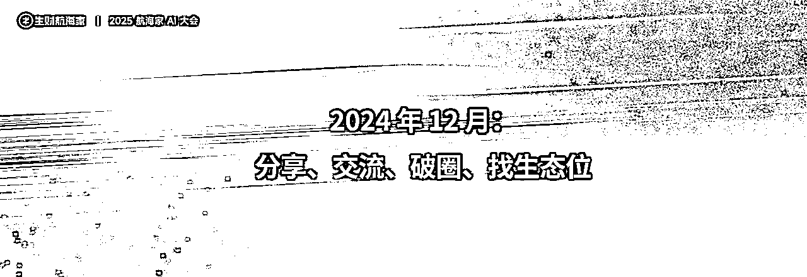
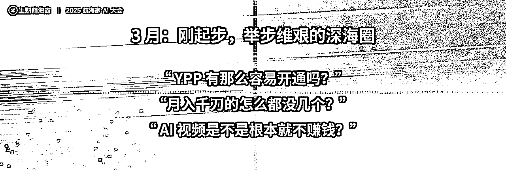

# 生财有术航海家AI大会——Gary ：YouTube AI 内容出海：把全球第一的视频平台变成自己的金矿

> 来源：[https://ncnmu5q1eqm9.feishu.cn/docx/U8lrdWdBaoUvYKxeRiZcNdASnkf](https://ncnmu5q1eqm9.feishu.cn/docx/U8lrdWdBaoUvYKxeRiZcNdASnkf)

Gary

生财 YouTube 深海圈总教练 | 带 400+圈友斩获超 200 亿播放，带超过 40 位圈友达成一亿播放

*   一、为什么在 YouTube 做 AI 内容出海

*   开场白：一个普通人的"小绿瓶”

*   YouTube超级标，超级在哪?

*   YouTube+AI 真的好做吗?

*   二、AI做爆款，1-100的方法论

*   1.爆款=好形式*好内容，1000个爆款=40种好形式*25个好脚本

*   2.找形式就是找到“观众爱看的皮囊”

*   3.好脚本让观众放弃思考

*   4.对标AI=无数个垃圾脚本，对标真人=无数个好脚本

*   5.内核升维，脚本裂变

*   6.实战案例：谷梓超圈友AI复刻真人鱿鱼游戏三个月10亿播放

*   7.我们是怎么做视频的

*   8.我对自动化的理解

*   三、未来三年内的超级机会：打通一个 27 亿海外用户的获客渠道

*   1.聊聊小语种和垂类赛道

*   2.百万 GMV， YouTube 带货蓄势待发

*   3.匿名、矩阵、To VC，海外 AI 自媒体的蛋糕比国内更大

*   结语：普通人的逆天改命之路

分享人：Gary,生财 YouTube 深海圈总教练

# 一、 为什么在 YouTube 做 AI 内容出海

##### 开场白：一个普通人的“小绿瓶”

我叫Gary，是生财YouTube深海圈的总教练。我们可能在今天，已经成为了全国最大的YouTube AI社群。上一次我站在这么大的舞台，还是很多年前在中国好声音的舞台上唱歌，所以现场分享经验不多，讲得不好的地方请多包涵。

被安排到最后一个，今天看着前面各位大佬分享，紧张了一天，终于轮到我上台了。

今天的分享有三个目的：

第一，带大家看一下YouTube这个平台的价值；

第二，分享我们打磨出的一套可行的AI视频爆款方法论；

第三，讲讲我自己的故事，这个不重要，前两部分大家认真听就好。

我还有一个比较特殊的身份，我是一个生财一年级的新生，刚加入生财一年。在一年以前，我还是一个非常普通，甚至可以说是失败的打工人。那到底是什么让我在一年里，看起来像是逆天改命？

这个图片有没有人认识？这是《凡人修仙传》里韩立的“小绿瓶”。对我来说，什么是我的“小绿瓶”？这个问题的答案，我会留在最后。

##### YouTube超级标，超级在哪？

去年10月25号，我加入了生财的航海。特别巧，10月24号，亦仁哥发布了“超级个体”的概念。我当时看到这个消息，第一个反应是：YouTube这东西到底能不能搞？作为一个没有了解过这个平台、没有了解过AI的人，我该怎么做？

今天，我就来给当时的我，也给在座的各位一个答案。作为超级个体的战场，YouTube有四个“超”的地方：超大体量、超额收益、超低门槛和超级增量。

*   超大体量：左边的数据是月活排行，YouTube以27亿的月活，在全球各大视频平台里排名第一。TikTok加上抖音，月活大概是20亿，比YouTube还差几个亿。右边的数据是YouTube和tk的总营收对比，YouTube去年有361亿的广告收入，比tk多了1.5倍。

*   超级增量：现在，如果你在YouTube上搜索“猫”和“狗”这两个超级热门的词条，按月度播放量排序，你会发现全是AI视频，已经看不到真猫真狗了。在很多赛道里，AI正在慢慢占领YouTube的内容生态，未来至少会有一半甚至更多的内容被AI占领。右边的图是微信指数，“TikTok”的指数是“油管”的10倍，“跨境电商”是“油管”的30-50倍。这说明什么？“油管”这个概念，在国内是完全没有普及开的，还是一个非常小众的市场。而这个小众，对比起前面巨大的平台体量，对于我们创作者和广告主来说，就意味着巨大的渠道级增量。

*   超额收益：YouTube是所有平台里，唯一一个把创作者广告分成模式写得清清楚楚的，它会把55%左右的广告收益直接分给创作者。李子柒复出的那条视频，在国内B站有3200万播放，预估创作激励收益是3.2万人民币。而在YouTube，这条视频2600万播放，保守估计的广告分成是5.2万美金。中间差了整整11倍。在给创作者分钱这方面，YouTube非常慷慨，这条收益路径也有十多年历史，规模大而稳定。

*   超低门槛：也许很多人还认为YouTube是个中长视频为主、高质量内容才能获得流量的传统内容平台，但实际上很多爆款内容，仅仅只是非常简单的AI视频。

*   案例1：这条简单到离谱的短视频，在今年8月份的YouTube短视频总榜上排名第一，5.6亿播放。它做出来可能只需要5秒钟，广告分成保守估计在3000美金以上。

*   案例2：这条更离谱的AI MV长视频，登顶了今年的半年榜，1.4亿播放，广告分成高达14万美金，差不多100万人民币。而它就是一个没有剧情、没有字幕、没有任何复杂动作的简单AI MV，制作起来也非常简单。

##### YouTube+AI 真的好做吗？

听到这里，肯定有人要问：YouTube真的这么好做吗？我作为一个不会做视频的普通人，能做吗？

今年330航海家大会，刘小排老师说了一句我印象非常深刻的话：顶级蓝海就是满级大佬屠杀新手村

去年，我没有任何短视频运营经验，11月8号开始发第一条AI视频，11月19号就做出了第一条千万播放的爆款，收益大概1200美金。我明明不是大佬，但好像屠杀了新手村，我当时第一反应是：怎么回事？好像比想象的简单很多？

大家也可以看看这条视频有多简单。

# 二、 AI做爆款，1-100的方法论

今天，我不是要教大家怎么从0到1做AI视频，因为这个太简单了，航海手册和精华帖，有数不清的从0到1的完整教学。既然站在了这个台上，我要分享的是咱们压箱底的方法论，也就是怎么从1做到100。我把“从0到1”定义为做出一个爆款，那么“从1到100”，我定义为做出1000个爆款。

如果一个爆款是200美金，1000个就是20万美金，这能够算是从1到100吧？而我们上次问卷统计下来，有超过40万美金的收益，意味着实际上超过了1000个爆款，所以应该是有做这个分享的资格。

##### 1\. 爆款=好形式*好脚本，1000个爆款=40种好形式*25个好脚本

怎么做1000个爆款？我有一个专门为这次大会创造的说法：做爆款，就是跟观众谈恋爱。

谈恋爱很简单，无非就是两点：好看的皮囊 + 有趣的灵魂。

对应到爆款内容，也是一样：好的形式（皮囊） + 好的脚本（灵魂）。

那么，如何量产1000个爆款？我的公式是：1000个爆款 = 40种好形式 × 25个好脚本。你用一种形式，搭配一个脚本，就是一条视频。用乘法，就能规模化生产。

##### 2\. 找形式就是找到“观众爱看的皮囊”

怎么找到观众都喜欢看的“好形式”？其实就是抓需求。

*   工具一：Google Trends (谷歌趋势)

*   这里有一个专门的选项，可以查看YouTube的搜索趋势。这个例子是“鱿鱼游戏”，可以看到在剧集上线的两个时间点，它的搜索热度远超“猫”这个超级大类。这意味着，当时这个赛道有巨大的观众需求。

*   工具二：YouTube 站内搜索

*   方法非常简单。你先搜索一个词，比如“鱿鱼游戏”，然后用筛选功能，选择“本周”、“按观看次数排序”。看看结果里有多少个千万级播放的爆款，你就大概知道这个赛道的热度了。

*   直接用被验证过的“好皮囊”

*   在YouTube上“百看不腻”的好皮囊：

*   卡通动物形象：比如猫猫、狗狗。

*   影视IP：比如钢铁侠、蜘蛛侠等漫威形象。

*   动漫IP：比如七龙珠、宫崎骏系列。

*   体育明星：梅西、C罗、内马尔，这几个名字在YouTube流量超级大。

*   政治名人：懂的都懂，不解释

*   地方特色：比如你做一个印度脸，印度人就非常爱看。

*   在YouTube上最近流行，有周期性的好皮囊：

*   网络流行元素 (Meme)：比如近期很火的“labubu”、“美国山海经”等。

*   时下爆火的影视IP：kpop猎魔女团、星期三、鱿鱼游戏等

这三个视频，看起来完全不一样，一个主角是C罗梅西，一个是“kpop猎魔女团”，一个是猫咪。但实际上，它们讲的是一模一样的故事：A在飞机上出事了，B去把他救了下来。

这说明一个被我们验证过无数次的规律：只要你的脚本（灵魂）是吸引人的，换不同的形式（皮囊），它依然能爆。

我们还能再进一步，对“皮囊”进行“整容”。不是简单的换角色，而是“去泰国做个变性手术”级别的改造，让观众看不出来。这几条视频，都是从一条真人爆款故事延伸出来的，其中大臣这条9000万，其他几条从几百万到千万不等，故事都是同一个，但换了人物、换了场景、换IP、换画风，都不影响它再次成为爆款。

通过“换皮囊”+“皮囊整容”，一个好脚本，你至少能做出40种以上的好形式。

##### 3\. 好脚本让观众放弃思考

怎么才能做出让观众一瞬间沉浸其中、失去思考能力的“好灵魂”？关键在于同时调动观众的逻辑脑（左脑）和情绪脑（右脑）。

*   攻击逻辑脑：唯快不破！

*   这条视频是一个大博主1.5亿播放的爆款，真人实拍的。

*   前三秒交代主线，制造冲突，留住用户。

*   一到两秒的快速切镜，不给观众思考剧情合理性的时间。

*   每个镜头都在推进剧情主线，没有多余镜头、不传递多余信息

*   重点突出，哪怕看起来简陋粗糙，目的让任何地区、任何语言的人都能看懂。

*   频繁制造冲突和感官冲击

*   攻击情绪脑：反差与共情

*   有句小学语文课学的名句：所谓悲剧，就是把美好的东西亲手打碎。人类都有损失厌恶的倾向，损失100块需要获得300块才能抵消负面情绪，放在视频里，就是要跟观众的期望反着来，所以这样对于情绪的冲击才足够强烈。

*   可以看看是不是在每个剧情的转折点，都反着观众的期望来？

*   妈妈衣着破旧，希望孩子懂事，但孩子任性，要买妈妈买不起的东西；

*   妈妈做了西瓜帽子，希望孩子喜欢，孩子嫌弃地扔掉

*   妈妈明明没钱买不起帽子，但还是把帽子送给了小朋友

*   孩子收到了帽子，刚准备开心，却发现妈妈头发没了

*   具体怎么去设计呢？我们后面再来拆解这个结构。

##### 4\. 对标AI=无数个垃圾脚本，对标真人=无数个好脚本

怎么找到更多这样的好脚本？我有一个核心观点：做AI视频，一定不要去对标AI视频，要去对标真人博主。

为什么？因为AI视频才发展了一年，还处在抖音、快手早期的“海草舞”、“社会摇”阶段。现在很多爆款AI视频能火，不是因为它质量好，仅仅只是因为赛道还蓝海，做的人不够多，整体质量低，所以很多并不优质的内容，也能成为爆款。

但真人短视频已经卷了七八年了，能卷出来的爆款，其脚本质量、情绪调度，都比现在的AI脚本要好得多。所以，你应该去各种真人博主的频道里上找那些被验证过的、能引发强烈情感共鸣的真人爆款视频，借鉴他们的脚本。

##### 5\. 内核升维，脚本裂变

好脚本是资产，找到一个好脚本后，只做一遍可太奢侈了。把它解构一下，内核升维，就能实现脚本的裂变，听起来很抽象对吧，我们来看看案例。

*   版本一：

这个脚本大家觉得拆得怎么样？大概是准确的对吧？但是不要拆成这样，拓展性太差了，拆成这样你就只能去改很少的元素。

我们抽象一点，就套用一下前面的理论，把它变成欲望和情绪两个支点构成的结构

*   剧本结构：

1.  欲望出现，情绪产生：孩子想要一个帽子（欲望），但妈妈买不起，妈妈破旧的衣服已经说明了妈妈是没钱的，但孩子很任性（情绪）。

1.  欲望落空，情绪激化：妈妈用西瓜做了个帽子，孩子嫌弃地扔掉了，特别是西瓜扔到地上那个镜头给了个特写，很心痛。

1.  欲望实现，代价出现，情绪再次激化：妈妈用自己的头发换了钱，给孩子买了真帽子，欲望看似实现了，但风吹过，妈妈头发没了，这是代价，这不是孩子希望看到的。

1.  损失强化，情绪爆发：孩子看到妈妈没了头发，震惊，闪回妈妈用头发换帽子的片段，配合音乐把情绪推到了高潮。

1.  情绪升华：这个故事结尾是大团圆，也不用解释了

现在，大家一起来共创，我们保持这个提炼出来的结构，改一改内容：

*   版本二：

1.  欲望：想要苹果手机，但妈妈买不起。

1.  落空：妈妈用纸杯做了个假手机，被孩子嫌弃扔掉。

1.  代价：妈妈打工赚钱，遭遇车祸身亡。

1.  代价：孩子用纸杯手机，找到了妈妈的尸体。

1.  升华：用纸杯手机表达爱和后悔

那大家觉得这个脚本会爆吗？

哈哈，当然会爆，因为这条是博主自己做过的。这条有更强的冲突和情绪推力，2.7亿播放，很夸张了。

可能有人要说，哎呀搁这套娃呢，用已经爆过的视频来讲有啥用？

那我们不用这个博主的视频了，我们自己做一条行不行？

来，再改一版

*   版本三：

1.  欲望：PS5，大家都喜欢吧。

1.  落空：得到假的PS5。

1.  代价：保持不变，妈妈打工赚到了真的PS5，但是出车祸。

1.  强化：妈妈的在天之灵送来了PS5

1.  升华：孩子在妈妈的骨灰坛前痛哭。

这个会爆吗？

当然，这是瀚伟圈友制作的一个版本。以及在前面我们其实已经早就看过这个故事演化出来了各种爆款了。

所以啊，一个脚本内核，通过替换不同的欲望、代价和情感载体，就可以衍生出无数个版本，这个比简单换个角色、换个场景的拓展性强多了。

##### 6.实战案例：谷梓超圈友AI复刻真人鱿鱼游戏三个月10亿播放

MR.DARGEE

谷梓超圈友，大部分爆款都提炼自这个真人博主脚本的同一个爆款结构，他的一个频道就拿到了10亿播放，以身证道，验证了这条路的可行性。而他并不只有一个频道，也不只有这一个脚本的模板。

##### 7.我们是怎么做视频的

好了，最重要的部分已经讲完了，剩下的视频制作这个环节，现在已经太简单了，大家开发出来的工具就足够提高一大截生产力了，因为这些工具圈友们都有分享在生财，我只做简单演示，让大家看看我们是怎么做视频的。

*   脚本提取：用Google AI Studio，把对标视频链接扔进去，一两分钟就能提炼出脚本和提示词，人只需要参与审核和有问题地方的修改。

*   图片生成：我们用api比较多，但RPA和agent现在也可以用。用大臣圈友制作的工具，把垫图和整套提示词扔进去，一两分钟就能批量生成高质量图片。

*   视频生成：方法很多，RPA、api和agent都能实现批量，比如一泽圈友写的RPA脚本，调用可以无限生成视频的智谱AI，把提示词和图片放在表格里上传，就可以批量地生成视频，几乎零成本。

*   剪辑：剪映或者AI编程，大部分视频的剪辑都很简单，不做演示了

##### 8.我对自动化的理解

大家对自动化有两个误区：一是认为自动化等于自己不用干活；二是认为自动化等于低质量。这两件事都不能和自动化划等号。

当蒸汽机出现时，马车就一定会成为历史。其实我认为自动化，是对所有的工作流程进行AI化的改造，是生产力进化的必然趋势，没必要把自动化理解为一个狭义的概念。

自动化是“1”后面的“0”。你如果没有前面那个“1”，后面加再多0也没用，放在做爆款这个事上，就是稳定地手搓爆款的能力，手搓都做不出来爆款，难道自动化就能做出来了吗，一条千万播放的视频，顶得上1000条1万播放的视频，在爆款面前，怼数量是没有意义的。

但如果你有了那个“1”，你就应该，也必须想办法去加后面的“0”。

S.Z圈友，自己写工具，把工作流程自动化了90%，实现了月入万刀，在715之后也并没有被YouTube平台针对，这个截图是他发在生财好事的截图，大家都能看得到。

#### 三、 未来三年内的超级机会：打通一个 27 亿海外用户的获客渠道

前面讲的，都是赚平台的流量分成。但YouTube作为一个27亿月活的平台，真正的机会远不止于此，没有哪位做抖音视频号的老板专门去吃那个流量分成的对吧？都是带货、IP、私域，作为老板，其实不应该只想着怎么赚流量费，而应该思考怎么用YouTube27亿的海外用户去放大现有的业务。

##### 1\. 聊聊小语种和垂类赛道

AI内容的发展，快，也不快。

说快，是现在大家如果去看YouTube shorts的排行榜，会发现某些时候AI视频已经占了快一半的位置了。而半年前，这个榜单上大家是看不到多少AI视频的。

说不快，是对于内容的形式、脚本和场景，AI内容还有很大的发展空间，尤其是在YouTube。

形式上虽然已经在逐步覆盖各类非AI内容的形式，比如短剧、动漫、电影，但还有一定差距；

脚本上刚我们聊了，还有很大差距；

场景上AI内容现在主要还是在做泛娱乐化内容，针对各种垂类场景的覆盖度其实非常低。

而这就意味着，在很多大家注意不到的赛道里，YouTube还存在巨大的、蓝海的机会。

*   在抖音、视频号能刷到无数关于历史的AI视频。但在YouTube，你去搜“美国历史”，排名靠前的视频，还都是真人讲解或历史素材混剪，你都找不到一条AI视频。难道是AI不能做吗？不，是大家都还没反应过来。

*   而这些垂类赛道的广告单价（RPM）其实非常高，远超泛娱乐内容。这些垂类的小赛道，能不能用前面做爆款的方法论去玩？这个问题留给大家。

##### 2\. 百万 GMV，YouTube 带货蓄势待发

2024年，YouTube上线了“联署营销”（带货）功能，类似于TikTok的精选联盟。但到今天，我问过很多做跨境电商的朋友，他们都不知道这个功能。

为了测试，我们把所有那些爆款的、跟带货没有半毛钱关系的泛娱乐视频，都挂上了YouTube官方的商品链接。结果，就这个月跑出来了100多万人民币的GMV。

YouTube作为电商渠道的开发，还非常不完善，但也存在巨大的信息差和机会，有在YouTube做带货需求的商家，也可以联系我们。

##### 3\. 匿名、矩阵、To VC，海外 AI 自媒体的蛋糕比国内更大

*   AI自媒体：海外的AI自媒体，已经到了“饥不择食”的程度，对视频质量要求真的不高。一个非常简单的、没有真人出镜的日语匿名频道，只需要1000订阅，一条视频就能接到200美金的商单。这个模式完全可以矩阵化操作。

*   知识付费：我们的小船老师，三年前就通过YouTube做知识付费，实现了第一个百万美金。现在每年来自YouTube的收益可能有几百万美金。

*   更多玩法：YouTube是个很特别的平台，它把引流到外站的链接能放在哪些入口，都贴心地告诉了我们，所有国内玩过那些流量变现套路，放在YouTube，可能都还是一片蓝海，如果说各位有这方面的业务需求，也可以联系我们，一起赚海外的钱。

#### 结语：一个普通人的逆天改命的故事

最后，讲讲我自己的故事。

去年9月，也就是这个时候，我的状态挺惨的。

大学四年，只知道赚钱要进大厂，为了进大厂，只知道实习，就实习了四年，结果翘课太多被延毕，错过校招无缘大厂；

在互联网教育行业努力打拼吧，又赶上“双减”，郁郁不得志想要创业；

结果在22年，特殊时期，搞线下家政，结果合作平台跑路，创业失败，为了发工资欠了20万；

为了还钱，去了国企，人情世故，领导PUA，但还是想干出头，两年增肥40斤，胖成了图里的样子，差点把身体和心理都搞垮了，所以选择了裸辞保命；

离开国企后，因为履历太乱、创过业、gap时间长，投了1000份简历，几乎0面试，裸辞了半年没做成项目也没找到好工作。

那个时候真的很痛苦，不知道自己到底错在哪里，为什么那么努力实习努力加班努力创业，落得个找不到工作的下场？

Anyway，去年10月，我只剩下两个选择：要么降薪找工作，要么加入生财，最后一博，我以前就非常纳闷为什么那么多人看起来经验能力不比我强，但能拿到结果，那进了生财死也死个明白。

很搞笑吧，加入生财居然都能成为最后一搏的选项，真的是无路可走了。

加入生财之后，我才发现，选择大于努力这句话人人都会说，但前提是得有选择。

以前没有信息，没有选择，只能在傻乎乎地在自己肉眼可见的方向上努力。当然，不只是YouTube的风向标，我还看到了很多国内的赛道，但基于前面讲过各方面原因，我最后选择了YouTube+AI这个方向。

11月份，我开始all in做AI短视频，每天除了吃饭睡觉，就是做视频、看精华帖。可能是运气好，也可能是那个时机切入地早，13天后，我做出了第一条千万播放的视频，很快开通了YPP，可能是生财第一个AI赛道开通YPP的人。

靠执行力赚到了一点小钱后，在那个时间点，我模糊地意识到只靠自己做视频，一个月两三千美金也不容易，还不稳定，可能还不如上班。真正想要逆天改命，做自由职业、超级个体，得想办法找到自己的生态位，那别的都还不清楚，先分享、交流、破圈吧。

所以我没有闷头做视频，而是选择直接把一个月以来摸索AI赛道做爆款的经验写成了帖子，也因此拿到了第一篇精华帖，刚好七天筹办了传术师社群和传术师线下活动给我赶上了。当时为了2000块的机票钱，我都下了很大的决心，因为那可能是我下个月的饭钱。在那次活动里，听到了超级大佬的分享，看到了不一样的世界，然后还有个很神奇的一分钟自我介绍活动，我其实是个超级I人，纠结了半天要不要上去自我介绍，最后心一横，来都来了，就上去自我介绍了。自我介绍为了显得厉害一点，我说了很难听懂的话，“我有5个已经开通或者快开YPP的账号”，结果不出意外大家包括亦仁都听错了，听成了我有5个YPP，亦仁哥还写在小本本上发到了群里，我当时非常尴尬。

后来要走了，在亦仁哥办公室门口纠结了很久要不要进去，其实也没什么问题，当时根本问不出什么有价值的问题，单纯就是想跟偶像合个影，我觉得能把一个目的是赚钱的社群，做得整体氛围是分享和利他，实在是太不可思议了，做社群其实非常符合我的盖洛普前三，交往、信仰、体谅，但这三个特质，在以前的工作中没少坑我，属于是内耗和自我pua的王了，所以很想近距离接触下亦仁哥。最后还是进了办公室，找亦仁哥合影，然后我都准备走了，以为他不认识我，没想到亦仁哥叫住了我，灵魂发问“你已经开了5个YPP是吧”，哈哈哈当时我只能挠头解释说其实是听错了，但亦仁哥还是鼓励了我，说一定要好好做YouTube，10年前他在YouTube拿到了不错的结果，现在机会仍然很大。

后来，可能是给亦仁哥留下了印象，欢欢找到我，让我和波妮一起做一期YouTube的私教陪跑，当时心里是真的没底，开营的时候做问卷调查，75份问卷加起来9000万播放，而我当时自己的几个号加起来都过亿了，再加上没赛道、没教程、没案例，真的能在一个半月加上过年的时间里带大家跑出结果吗？

我不知道，但孑然一身，没有什么可失去的了，无非就是时间没了，去找个班上嘛，没有路，我们自己走出来，名字里带个淦，干就完了。

一个半月以后，没想到真的给我们干出来了，103个人干出来107个YPP，可能听不懂，算账号价值大概就是32000美金，生财和我们都认为，这条路大有可为，应该放大，所以就有了后面的深海圈。

深海圈启动以后，我们去杭州学习了很久，见了很多大佬，补齐了很多认知和信息，但是最开心的还是在生财办公的时候，光明正大地坐在了亦仁哥对面，偷拍了一张，我心里偷着乐，两个月以前还得鼓起勇气敲门进去合影，现在偶像坐在对面了。

刚起步时，我们其实面临很多质疑：

“ YPP 有那么容易开通吗？”

“月入千刀的怎么都没几个？”

“ AI 视频是不是根本就不赚钱？”

那能怎么办呢？人家说的是事实。是非成败，是做出来的，不是想出来的，多说无益，干就完了。

4月，做完问卷统计，看到播放量还是挺开心的，人均有2000万的播放，比之前可多了太多倍了，但是一直会有声音“他们也就是YPP多，根本就不赚钱”，骂得对啊，人均300美金，这是事实，继续干呗。

6月，123份问卷，人均800美金，亿播圈友有了十多个，但那个声音还在，“这点收益不如找个班上吧”，也没错，800美金就是5000多人民币，确实不如上班，没得说，继续干吧。

8月底，146份问卷统计出来，人均收益达到了2600美金，人均播放量1.14亿。看到这个数据，我终于觉得算是对大家有个交代了，但还是会有声音说，“就那么几个案例来回讲吧，讲人均有什么用”。

那现在，9月份，大家已经能够在生财好事栏目和YouTube专区看到数不清的好事和精华帖，波妮从6月份开始每周在视频号连麦做得不错的圈友，到现在已经连麦了将近30位圈友，我们测带货，一个月跑了一百多万的GMV。

这个是我今年1月1号跨年的时候，在一个小群里立下的flag，现在已经实现了，到今天，我可以在这个一千人的分享台上光明正大地宣布：生财YouTube深海圈，已经是全国最大的YouTube AI社群。

我真的只是一个非常平凡的普通人，没有背景，没有资源，没有钱。正因为这样，我才知道，努力是最不值一提、最基本的付出。

《凡人修仙传》里，韩立结婴时，心魔问他：“如果你没有小绿瓶，你还能拥有什么？”。

对我来说，我的“小绿瓶”，就是AI和生财吧。

借助生财和AI，在YouTube AI这个赛道里和大家一路上打怪升级、一点点争取资源、一次次踩坑跌倒，走到了今天。

其实我们都很幸运，今天在AI和出海的市场里，还有足够多的生态位、足够多的选择和机会，多到让我们这样的普通人也有机会拥有“小绿瓶”，走出自己的路。

最后，在这个AI改变一切的时代，我想用生财的两句名言来结尾，但我加了几个字：“越分享、越生长、越幸运”和“越相信、越拼命、越看见”。这是我的大道之路，这是AI时代AI取代不了的东西。

分享的本质，我认为是利他，它会带来链接和贵人，也就有了生长和所谓的幸运，这是AI再厉害也给不了的。

而相信的本质我认为是愿力，它会让你拼了命地努力，才能看见，这也是AI给不了的。

利他之运，愿力之势，运势合一，逆天改命。

感谢一路上波妮、亦仁哥、老马、林俊杰、怅惘、七天、欢欢、坤汀的支持和陪伴，也感谢台下我的女朋友曼心，还有我的爸妈，我一直都不是一个省心的孩子，谢谢你们一直以来的理解和信任。

感谢所有的深海圈教练们、圈友们。

感谢无私分享的航海家、传术师、精华帖作者们。

感谢生财，感恩时代。

最后再立一个flag，在未来一年里，我希望能和大家一起，把生财YouTube深海圈，变成全球最大、世界闻名的YouTube AI社群，和大家一起成为那群吃到时代红利的人。

淦，就完了，谢谢大家，一起生财有术。

最后打个广告

深海圈新一轮报名时间是9.24-10.10，可以查看下面的海报了解。

