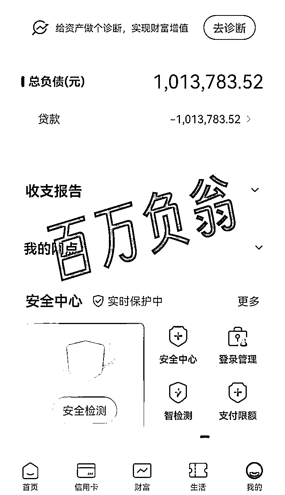
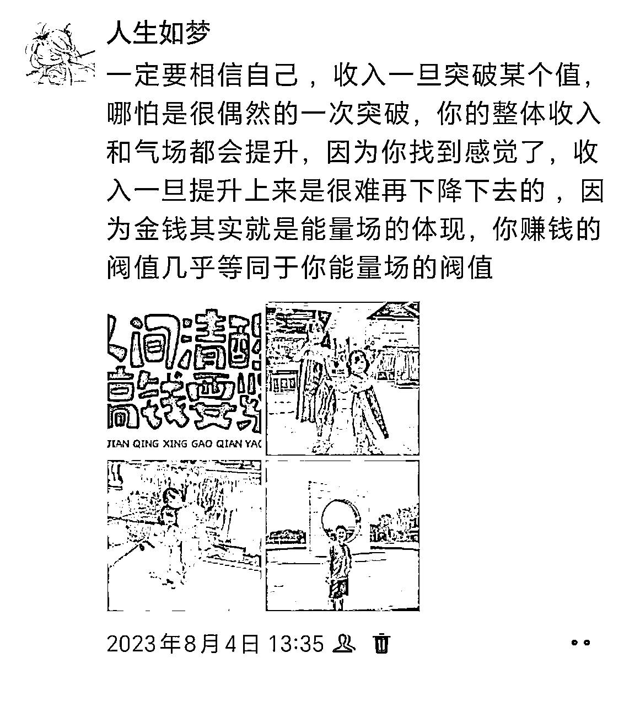
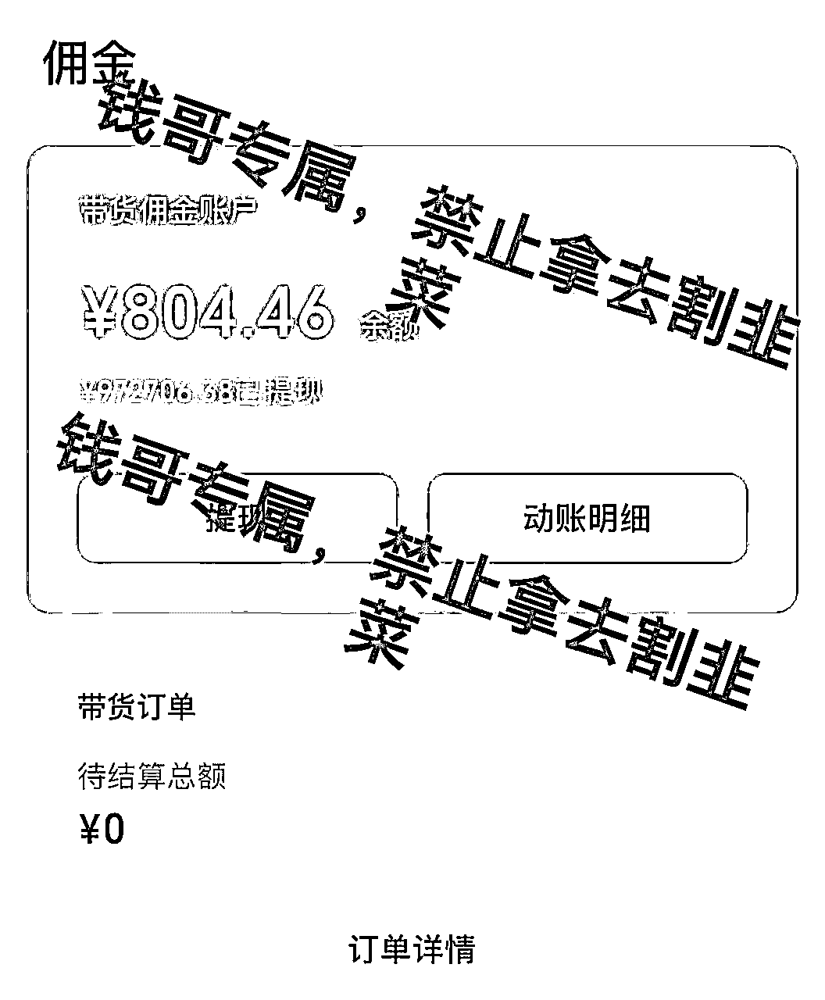
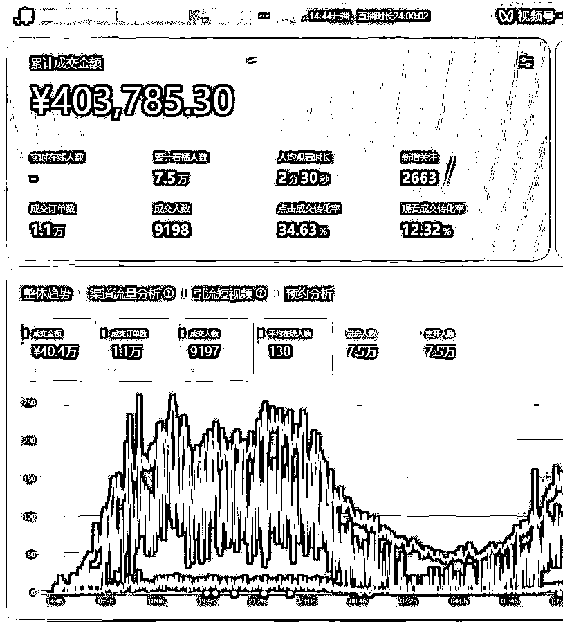
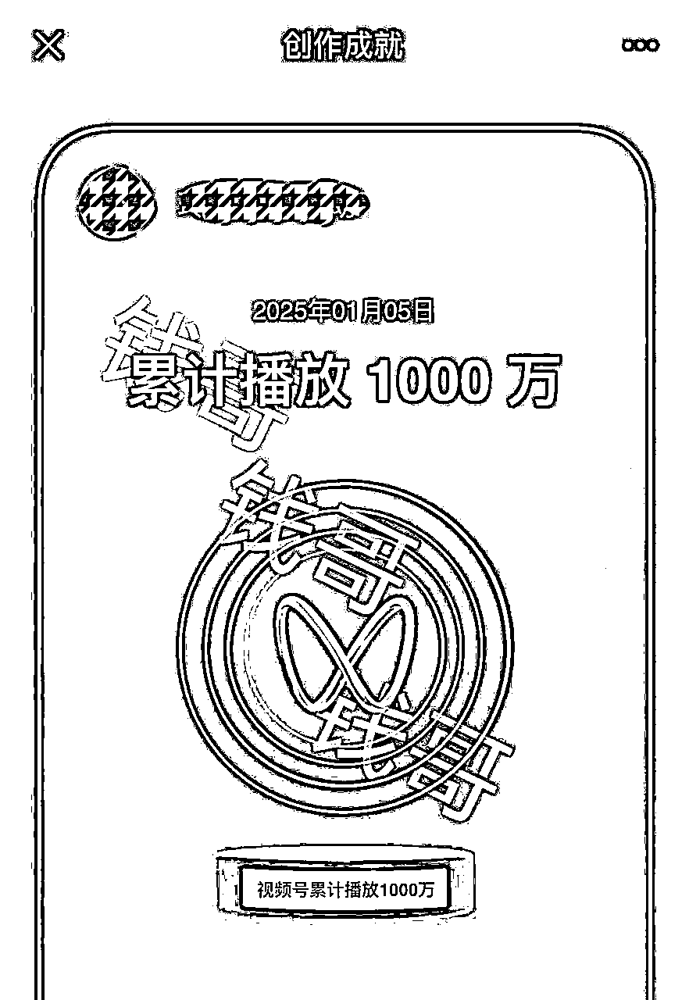
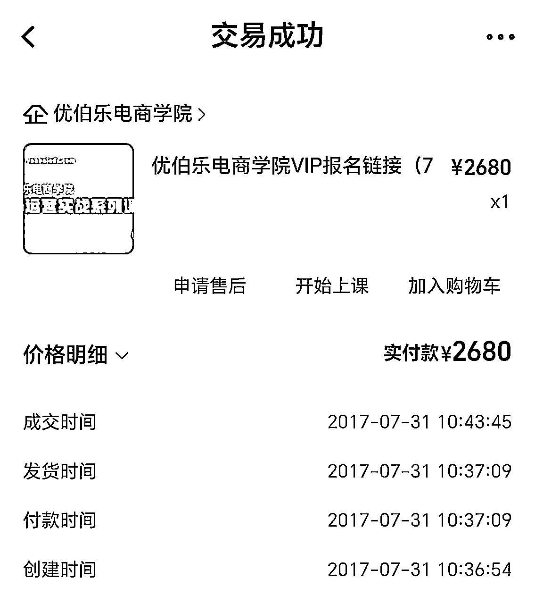
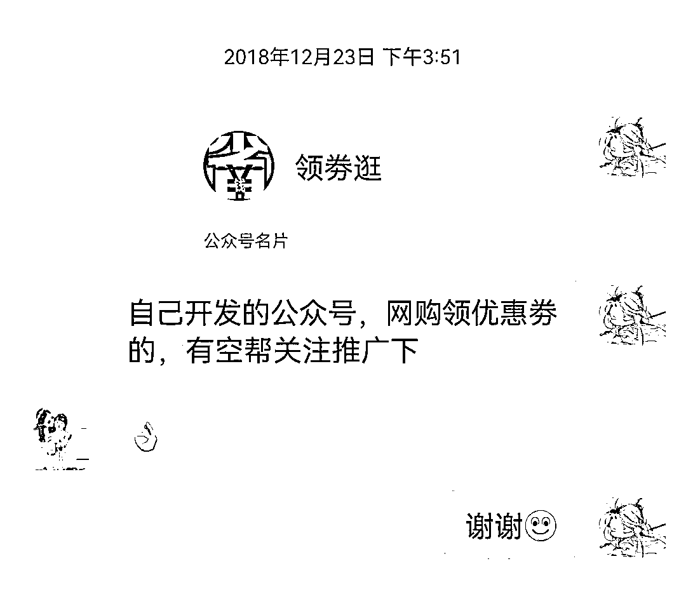
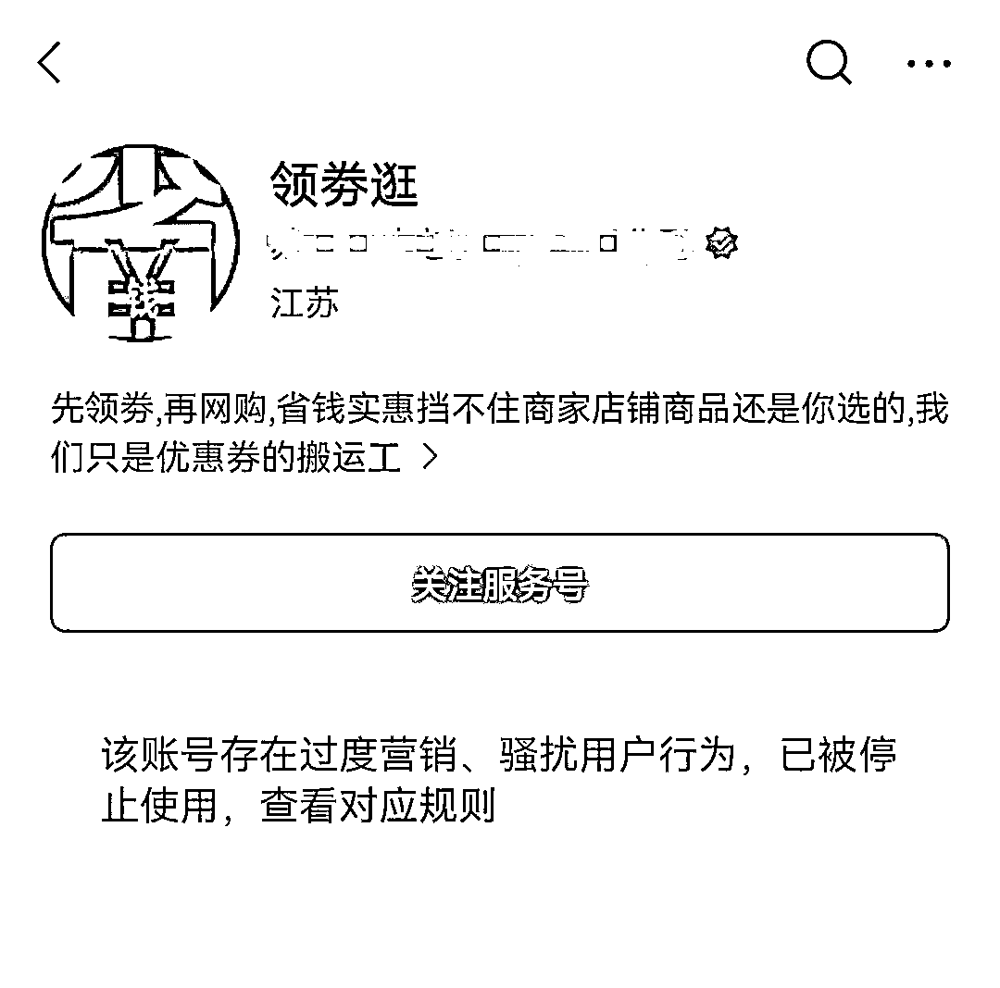

# 靠一个观点赚碎片系列：成功是概率

> 来源：[https://v1e5tzw5w2.feishu.cn/docx/OmK0dD6WKoJT3jxAMpDcFyZCnLe](https://v1e5tzw5w2.feishu.cn/docx/OmK0dD6WKoJT3jxAMpDcFyZCnLe)

## 前言：简单自我介绍

大家好，我是钱哥，我之前也是个三无人员（无学历/无背景/无资金），算是牛马屌丝。“在平凡的日子里挣扎，想活成别人期待的样子”就是我的缩影，可是这一挣扎就是10多年光阴。我想我可以代表生财里的绝大多数群体，可能唯一的区别就是你们在年轻的时候就接触到了生财这么优秀的群体，而我老了才加入。简单的说下我背景几个关键点：13年成立实体公司，一直半死不活的苟着，17年左右父亲赌博输掉90多万存款外加三四十万负债，19年孩子上学不得不背负100房贷，23年东拼西凑再加上转贷还掉了5.88利率的房贷，同期辞掉两万多的工作，想放手一搏，不行就回老家了，当时手里就剩2w块钱，买了一部手机（iphone7000多），一个电瓶车，还有个8000左右的学费（用处不大）开始直播创业，过程不重要，因为和我讲的无关，最终拿到了七位数以上的结果，就是告诉大家我屌丝过，也负重前行过，但打不死我的终将使我强大!最终也拿到了一些小结果！晒些图增加些说服力~

这些图我朋友圈都没发过，财不外露嘛，但是为了增加说服力我也是拼了，我没有培训，也没有任何的付费项目，写文章唯一的目的也写在题目上了，哈哈，就是想赚个碎片，所以我的观点你们可以认真听听！因为我也常常感慨，如果我10年前有了这样的观念，进步会不会更快？

## 正文：失败不是诅咒，而是概率分布的必然，用频率对抗不确定性，才是真正的强者思维！

好了，言归正传，今天这篇文章主讲失败以及背后的底层逻辑，我们从小听着“失败是成功之母”的格言长大，也听过“先做成一坨屎，再慢慢优化”的粗粝真理。各种成功故事扑面而来，虽然也会提及挫折，但最终都落脚于高光时刻——这让我们潜移默化地认为：成功是常态，失败是意外。

于是，当自己遭遇失败时，我们归咎于“运气不好”；看到他⼈成功时，我们感叹“运气真好”。今天，我想用这篇文字，为你揭开“运气”背后的真相，让你彻底摆脱内耗，轻装上阵。

### 一、重新理解“运气”与“概率”

什么是运气？

一件事如果只做一次，无论成败，都可以称之为运气。

什么是概率？

同一件事重复做十次、百次，成功与失败的分布规律，就是概率。

弱者相信运气，强者研究概率。 因为运气不可控，而概率可以被计算、被优化、被提高。

### 二、成功赚钱，本来就是小概率事件

是的，成功赚钱是一个小概率事件——但这恰恰是它的魅力所在。

我们每天用筷子吃饭，成功率接近100%，但没人会为此兴奋。

恰恰是因为成功难以企及，每一次突破才显得如此珍贵。

认识到这一点，不是让我们悲观，而是让我们清醒。

只有承认小概率的客观存在，我们才能用正确的方式去应对它。

### 三、破除内耗：失败是必然，成功是偶然

我们常常以“没有资源、没有人脉、没有准备充分”为借口，迟迟不敢开始。

但真相是：你不是没有条件，而是没有勇气，害怕面对失败~

当你真正理解“成功是小概率事件”后，你就会明白：

做一件事失败是必然，成功是偶然，你自会坦然，做好了必然失败的准备时，你不会内耗了！

你会发现你的勇气也会无比的提升！

### 四、提高成功概率的唯一途径：提高尝试频率

既然成功是概率事件，那么让这件事发生的最好方式，就是不断增加尝试次数。

频率上去了，概率自然就会提高。

这就是数学的力量，也是对抗不确定性最踏实的方式。

尤其是在互联网副业领域，这种思路更具优势：

一次试错成本可能不到2000元（远低于实体店20-40万的投入）

迭代速度快，反馈周期短，可同时进行多个低成本测试

你不需要等待“万事俱备”，你要做的是：快速行动，高频尝试。

### 五、我的感悟：用概率思维重塑勇气

参加这次生财深圳的AI大会，我和前面一女生聊到，我不懂AI，没用过AI，我是来看小排老师的，小排老师用Claude Code实现千万收益，我觉得我也可以。她提醒我：“小排老师有十年编程经验。”

若是以前，我可能会畏缩不前。但现在我知道概率之后，失败是必然的，反而我不拍失败了。

概率思维也给了我完全不同视角：

是的，小排老师有十年经验——但我们是站在他的肩膀上前行。他从零开始摸索，而我们已经有方向、有路径、有方法。我们要做的不是重复造轮子，而是提高尝试频率，用次数换概率。

另一个例子：YouTube运营

曹淦老师讲的很好，分享了通过AI实现动画自动化的方法以及YouTube发布爆款的方法论。而我想从概率角度补充：

即使你的脚本再好、动画再精美，高播放量仍然是概率事件。我们能做的，就是不断优化内容，同时用发布数量来对抗不确定性。

截至目前，我的抖音大号已经发布了1300多个作品（2年时间），视频号作品也超过1000条。不是每个作品都会爆，但发布越多，爆款概率就越大。这就是真相，不是泼冷水，而是知道概率之后能坦然面对失败，从而获得无限坚持的勇气！

### 结语：接受失败，拥抱概率

成功是一门概率学。

接受这个事实，你就不会再内耗于单次失败的挫败感，也不会再羡慕他人的“好运”。

你能做的，也是你最应该做的：

用频率对抗不确定性，用行动提升概率值。

这才是强者思维，也是实现突破的真正路径。

## 彩蛋：我的成长路径简述（一路走来都是泪）：

2013年注册机械自动化公司，没有接到什么订单，靠倒卖一些产品苟活着，算是失败！

中途公司干不下去就去上班，上班上不下去又回来搞公司，一晃3年过去了

2016学人开淘宝，一厢情愿定了一些衣服，一件没卖掉，失败！

2017年交三千和人家学习做淘宝，结果只教学怎么起标题和买直通车关键词，中途没有S单的情况莫名被封了淘宝号！

2018做淘宝时接触到了淘宝客又开始干淘宝客，看着别人挣钱，我搭个公众号返利系统一周都没搭建号，搭好刚推广不到一周公众号就被封号了！

2019年做返利机器人算是拿来点结果，但不到，昨天看了下，截至现在6年赚了10w左右，中间经历了微信封号/淘宝评论引流封淘宝号等事件~也没做大

2020年短视频兴起，试过王者荣耀游戏教学，电影剪辑，都没做起来，让我明白粉丝量不等于变现量

21年22年尝试过抖音无人直播，半无人直播，视频号引导橱窗带货，都没做起来，前前后后封了30多个号，焦虑

23年破釜沉舟搞抖音，再加上后来24年视频号的兴起，让我逐渐把直播变成了主业，终于可以说出这句话：打工，这辈子是不可能了

25年参加生财AI大会，希望把AI作为自己的第二曲线，助力自己尽早进入A8行列~