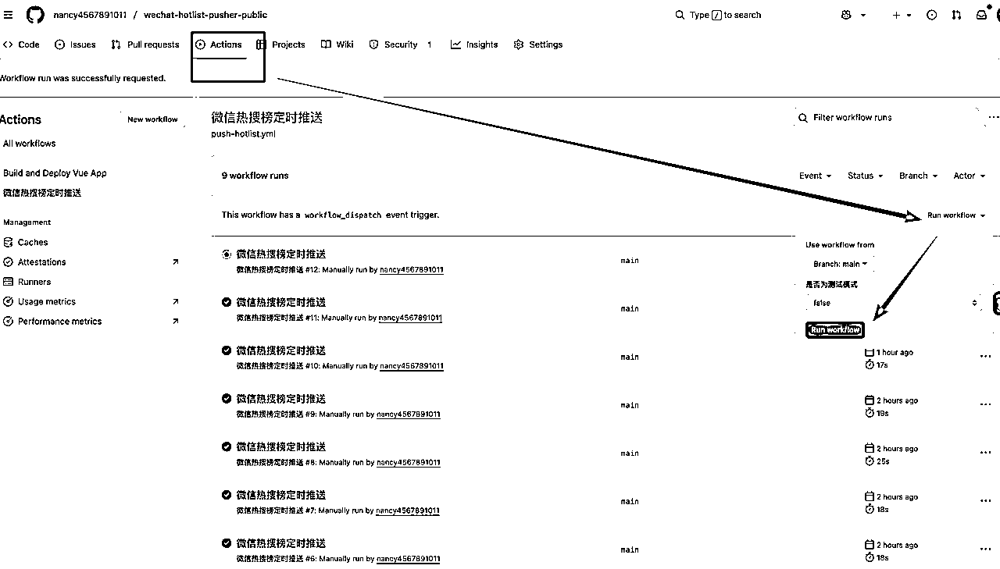
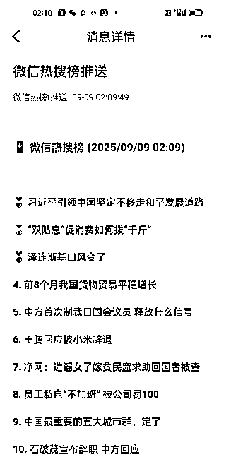

# 别再乱花钱了！零成本搞自动热榜推送，配置半小时能用一辈子

> 来源：[https://l0xoaai7d9t.feishu.cn/docx/OU6edYOnnophrpx6GOsc6Ur6nsc](https://l0xoaai7d9t.feishu.cn/docx/OU6edYOnnophrpx6GOsc6Ur6nsc)

大家好，我是Nancy~

这期航海参加公众号的圈友很多，不知道有没有遇到和我同样的问题；

1、不知道写啥

2、每天为了写啥花了很长时间找到底应该写啥，生怕错过什么大事件，想订阅热榜，但是价格实在太贵了

3、看到别人写啥就写啥，但是自己写完了热度早过了

我也是你们其中的一员，于是我想，世界上有没有这样的好事，给我免费配个热榜推送的秘书？

于是，我用三个工具搭一起，

1.  WxPusher：负责消息推送到微信

1.  天聚数行 API：提供热榜数据源

1.  GitHub Actions：不开电脑每天自动推送

现在我每天早上 10点，微信会准时收到推送：之前那种 "别人都在追热点，我还在找素材" 的焦虑感，现在完全没了。

可能有人会说 "配置会不会很复杂？"—— 实话说，确实需要一点基础，但跟着步骤走，半小时绝对能搞定。而且一旦弄好，后续根本不用管，每天到点就有推送

以前手动搜 + 整理，每天至少 60 分钟；现在打开微信看推送，5 分钟就能把当天热点摸透。算下来每天能省 91.7% 的时间，剩下的时间咱眯个觉多好~

还有人问我 "免费的会不会有坑？" 其实道理很简单：这些服务商是想靠免费额度吸引个人用户，咱们正好借这个机会 "薅羊毛"—— 只要你是个人用，不搞大规模商用，完全不用担心额度不够或者突然收费，我已经用了两周，没花过一分钱。

部署也特别简单，不用你从零开始写代码：直接去我 GitHub 把项目 Fork 了，填三个环境变量，点一下运行，搞定！链接我放文末了，需要的朋友直接拿。

### 步骤一：注册并配置WxPusher

1.访问WxPusher官网：https://wxpusher.zjiecode.com/

2.使用微信扫码登录，无需注册，新用户首次扫码自动注册。

3.在管理后台创建一个“应用”，

回调地址这里填：

https://your-domain.com/wxpusher/callback

确定后，会出现appToken的提示框。appToken是应用的唯一标识，一定要好好保管

接着界面会出现一个二维码，你按照上面做就可以了。只有关注了才能收到消息

然后他会给你发一条消息，告诉你已经订阅成功。

现在在小程序里面收不到订阅消息，按照上面的要求，下载APP，点击上面的红色自动跳转下载

每天从APP里面查看消息

下载完之后注册就可以了

然后它会让你绑定手机号

为了防止收不到通知，把通知提醒打开，注意要全部都打开，每个手机型号不一样，你要根据你的手机型号去查看方法，

我测试用的是oppo的，设置完是这样的

更具体的获取appToken和UID的方法，可以参考WxPusher官方文档： https://wxpusher.zjiecode.com/docs/#/

有的圈友说收不到消息，可以点击用户列表，右边有个发送消息，点进来是这样的，我发送个你好测试下：

他会从消息那里蹦出来

### 步骤二：获取微信公众号热榜API

找了很多API接口，有的没试用就让充值，然后我找到了这个，免费。

天聚数行TianAPI：https://www.tianapi.com/apiview/196

之所以用这个API,是因为如果自己用，完全是免费的。因为每天有一百次的免费次数

进去之后，点击申请接口

点击申请后，自动会进入在线调试页面

会看到这个页面

点击右上角的控制台，数据管理那里就能看到你的API-key

复制API KEY到接口调试的页面，点击测试，就能看到右边有数据了

### 步骤三：把自动推送的脚本上传到github

这个脚本主要是为了云端自动推送。

1.定时执行（例如每天一次）。

2.调用步热榜API，获取最新的微信公众号热榜数据。

3.调用WxPusher的发送消息API，将内容推送到微信

脚本放在github 上了，需要的可以自取

1️⃣ Fork仓库

访问：https://github.com/nancy4567891011/wechat-hotlist-pusher-public

点击 "Fork"

需要fork到你的github 上，这样它就在你的云端了，可以每天给你推送了

### 步骤四：设置定时任务

2️⃣ 配置Secrets

在fork的仓库中

进入 Settings → Secrets and variables → Actions

添加以下Secrets：

增加密钥，注意，一定要一个一个增加

*   WXPUSHER_APP_TOKEN ： WxPusher应用令牌

*   WXPUSHER_UID ： WxPusher用户UID

*   TIANAPI_KEY ： 天行API密钥

注意，设置完之后，要把仓库设置成私有。否则你的key可能会泄密

增加完是这个状态

进入ACTIONS这个选项，点绿色的按钮，选择测试模式：true，点击RUN WORKFLOWS,这个是测试，如果想每天都收到，就点false

点击 Run workflow 开始测试

发现了吗？下面多出一条消息。如果你微信已经绑定成功了，正常的话，就会收到推送的消息。

然后看看你手机，也会收到一条

现在您的微信热榜推送工具已经完全配置好了！每天上午9:00-11:00你就会收到你的免费小秘书送来的榜单啦

## 写在最后

这套方案改变了我的内容创作方式。

AI时代，当你被一堆重复的事情搞的焦头烂额的时候，一定要想一个方法让自己解放出来

别让信息差成为你进步路上的绊脚石！