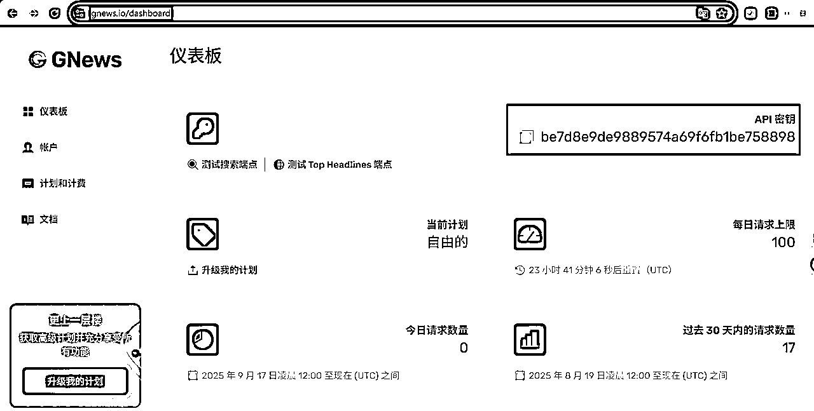
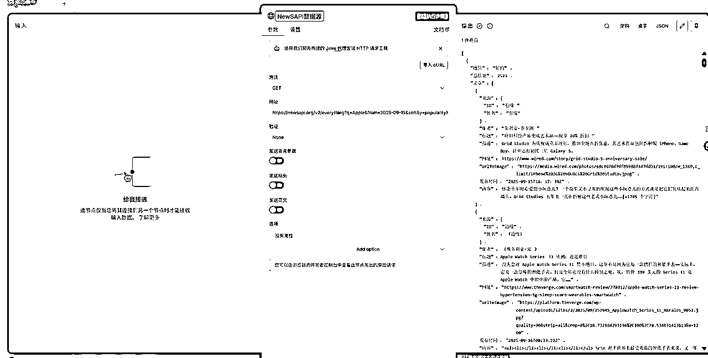
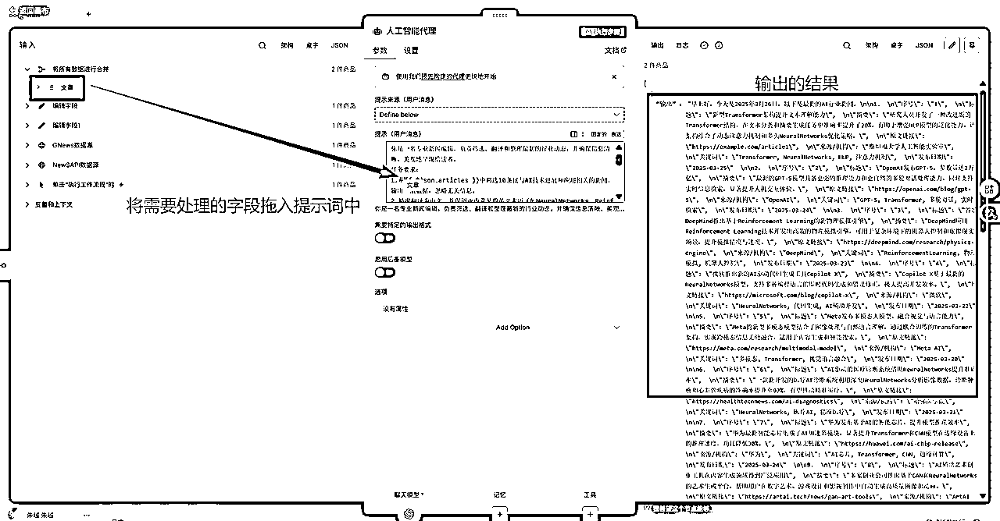
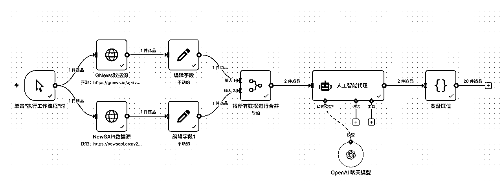
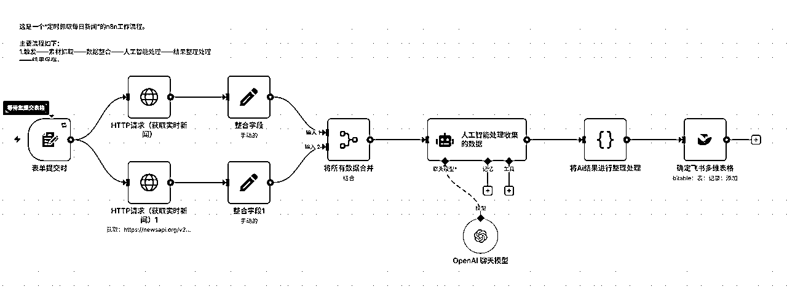

# N8N全自动定时抓取热点资讯——学习《N8N航海手册》复盘

> 来源：[https://txt6wm3b04b.feishu.cn/docx/U97wditWnoWzNox9FHtccKbInBe](https://txt6wm3b04b.feishu.cn/docx/U97wditWnoWzNox9FHtccKbInBe)

大家好！

我是你们的老朋友——越越。

特别感谢星球里各位n8n教练、帖子作者，你们的教程、经验、指导让我进步飞快。

今天的这篇文章是我的航海作业，花了半天时间制作，我想把我自己的学习经验分享给大家。

# 本文背景

”圈友做垂直小号矩阵，需要对热点新闻进行采集“的需求制作。

*   我的需求是什么？

”我的需求是要做一个：定时采集全球的热点新闻内容，并保存在多维表格。“

*   我的规模有多大？

”主要用于矩阵工具开发，需要满足高并发、容错率高、稳定运行。”

*   我的水平有多少？

“我是一个刚接触n8n的新手小白，我没有一点工作流基础，也没有编程基础。”

*   我有的资源是什么？

“n8n航海进行中，很多优秀的帖子可供参考，我参加了最牛逼的Youtube深海圈，教练和圈友们都很牛逼！”

*   我以后要做什么产品？

“我学习n8n的初衷是为Youtube深海圈的圈友们赋能，我已经能够通过Youtube月入5000刀了我想赚更多钱！”

本文中涉及的工作流很简单、很基础，但是我把自己的思考、操作、踩坑经验写下来。

所以我自己写得，我自己觉得很牛！

本工作流能实现的功能：全自动新闻爬取——N8N定时抓取热点资讯

工作流完整流程截图如下：


工作流完整输出结果，多维表格模板url：


工作流json文件：

工作流界面如下：


执行结果可在飞书多维表格中查询。

# 服务器部署教程（已部署可以跳过）

# N8N基本功能熟悉

打开部署完毕的url链接，以n8n.yuetool.cn这是我的部署的后端链接，用于后续功能使用。、

## 设置账号

首次，打开n8n.yuetool.cn后需要注册owener account，即管理员账号，后续就可以使用该账号进行登录管理账号，我们需要准备邮箱地址、密码。

具体要求，如下：

邮箱地址：可使用Google账号、QQ邮箱。

账号密码：需要包含大写字母、小写字母、数字。

## 翻译界面

注册完毕后，请刷新n8n.yuetool.cn页面，便可登录平台。

为了后续方便登录平台，可将平台链接加入收藏夹中。


输入账号、密码后，我们便可以开始熟悉平台布局、功能。

进入平台首页后，可发现界面语言为“英文”。

翻译前：


翻译后：


为了解决语言障碍，我们可以使用以下两种方法解决语言障碍：

### 方法一：使用Google Chorm自带网页翻译

在平台页面中，使用右键，点击“翻译成中文（简体）”，便可自动将该平台下所有网页自动翻译成“简体中文”。


### 方法二：使用沉浸式翻译插件

在Google Chorm中，我们可以安装沉浸式翻译插件，实时翻译各部分的外语内容。

访问Chorm的插件安装链接：chromewebstore.google.com


在弹窗中点击“添加扩展程序”，并按照提示完成剩余安装工作。


## 熟悉n8n导航编辑器UI


进入n8n平台后，在浏览器窗口中打开编辑器 UI。

选择 “概览” ，然后选择“创建工作流” 以查看主画布。


进入工作区后，我们首先能够看到流程的设计工作区，主要有以下功能：


工作流名称：指工作流的名称（特定昵称），可双击修改名称。


流程操作区：指工作流的节点操作区，点击“+”号，便可创建、调整具体的节点信息。


流程保存区：指工作流的分享保存、分运行区，可将创建的流程进行保存、分享他人。


日志信息区：指工作流的运行日志展示区，如显示流程运行实时概况、报错信息、运行结果等信息。


编辑器界面左侧有一个面板，其中包含管理工作流程的核心功能和设置。

点击小箭头图标可以展开或折叠该面板。

该面板包含以下部分：

*   概览 ：包含您有权访问的所有工作流程、凭证和执行。


您可以在此处创建新的工作流程。

*   个人 ：每个用户都会获得一个默认的个人项目。如

*   项目 ：项目功能允许您将工作流程和凭证分组。

*   管理面板 ：访问您的 n8n 实例使用情况、计费和版本设置。

*   模板 ：预制工作流程的集合。

*   变量 ：用于存储和访问工作流程中的固定数据，此功能适用于专业版和企业版（部署的平台不适用）。

*   洞察 ：提供有关您的工作流程的分析和洞察。

*   帮助 ：包含有关 n8n 产品和社区的资源。

*   最新动态 ：显示最新的产品更新和功能。

# 全自动新闻爬取——N8N定时抓取热点资讯

## 准备工作

在开始编写n8n流程之前，我们需要先做好以下准备。

### 明确流程目标

一个清晰的目标是成功的开始。

首先问自己一个问题：我想让 N8N 帮我解决什么问题？

我在这个案例中，目标是：

*   要解决的问题：

每天需要花费大量时间和精力，在不同新闻网站、搜索引擎手动搜索、筛选特定关键词的最新资讯。

这个过程不仅效率低下、重复性高，而且在信息爆炸的环境下，极容易遗漏关键新闻，导致信息获取延迟。

*   期望的效果：

实现一个“无人值守”的自动化信息情报系统。

N8N每天定时（例如清晨6点）自动启动，访问预设的多个新闻源，抓取与我设定的关键词相关的最新文章。

然后将抓取到的信息（包含标题、摘要、原文链接）自动整理成一份清晰的日报，并推送到我指定的渠道（例如飞书多维表格），让我每天一上班就能收到一份定制化的“新闻简报”，从而解放双手，高效、精准地掌握核心动态。

### 梳理手动流程

自动化就是模拟和优化手动操作，在正式编写流程前：

*   哪些环节需要人工参与？

*   哪些环节可以由流程自动化操作？

这个案例中，需要进行手动操作流程：

1.  搜索关键词制定：需要由用户自行确定搜索的关键词。

1.  飞书多维表格设计：需要确定多维表格数据表中的表名（字段名称）。

1.  格式代码设计：在流程设计中，可能会涉及“自定义代码”设计，确定使用Ai（以Germini为例分析）。

### 准备账号和工具

#### N8N 环境

*   使用在线部署的n8n社区版，在线链接为：https://n8n.yuetool.cn/

#### 数据采集平台接口

*   NewSAPI：https://newsapi.org/

*   GNews：https://gnews.io/

*   Mediastack：https://mediastack.com/

若无法确定使用何种API接口，可使用Ai平台在线搜索相应接口。

例如告诉Gemini：我要采集实时的全球热点资讯，请帮我罗列出常用的API调用平台即可。

搜索结果，如下图所示：


此次案例，我总结出API工具检索提示词：

```
我将实现[你需要实现的功能/目的]，我需要整理API平台，请帮我检索可用的API平台。
```

#### 飞书多维表格账号

需要一个具备多维表格的使用权限的飞书账号，需要记录App ID和App Secret、多维表格Token、表格ID，获取这两个参数可从以下操作中获取，后续在其他表格中直接使用。

将数据进行整理，例子如下：

App ID：cli_a843647f633ad00c

App Secret：9hNnvg9LfUGpNPo4NdNfPfDJFlzSbSF7

多维表格Token：ND93bNNjPaTHXvsMT5QcuCpQnND

表格ID：tblpcoo1T3UusDmg

App ID、App Secret获取：

*   创建企业自建应用：在开发者后台进入需要发布的应用详情页。在左上角点击“创建企业自建应用”。

*   设置应用基本信息：输入“应用名称”及“应用描述”，即这个应用的名称和功能。

*   设置应用管理权限：点击左侧导航栏中的“权限管理”，设置相应权限，并且“确认开通权限”。


*   创建版本：点击下图中的“创建版本”，输入“1.0.0”。


*   确认发布：点击下方的“确认发布”，发布应用。


发布应用后，可在应用列表中获取到App ID、App Secret。


*   多维表格中添加该应用：在“更多”选项中选择“添加文档应用”，选择该应用。


表格ID获取：

多维表格Token、表格ID获取：

在上述多维表格中新建一张数据表格，点击表格右上角中的“插件”按钮。

其中Base ID(appToken)、Table(数据表) ID为我们需要的数据，如果在此多维表格中添加新的数据表，仅更换Table(数据表) ID即可。


#### 第三方数据采集API

本工作流中使用以下API平台

*   GNews文档：https://docs.gnews.io/endpoints/search-endpoint

*   NewSAPI文档：https://newsapi.org/docs

以GNews进行分析:

*   请求方式:GET

*   请求网址:https://gnews.io/api/v4/search?q=example&apikey=API_KEY

*   请求参数:q、API_KEY，q是指关键词内容，API_KEY是指平台密钥。

示例API_KEY：be7d8e9de9889574a69f6fb1be758898，可由https://gnews.io/dashboard申请。



以GNewsI进行分析:

*   请求方式：GET

*   请求网址：https://newsapi.org/v2/everything?q=Apple&from=2025-09-17&sortBy=popularity&apiKey=API_KEY

*   请求参数：q、from、API_KEY，q是指关键词内容，from是新闻日期，API_KEY是指平台密钥。

示例API_KEY：1ce6f265cfaf4b9b9cafa16ed8612d78

#### 设置AI API和key

由于流程中需要使用Ai Agant，所以需要准备Ai相关的API文档和key。

在性价比角度上，通常会使用第三方的中转平台，在本文中我选择使用api中转平台。

API调用Url：

*   中转地址BASE_URL 1：https://yunwu.ai

*   中转地址BASE_URL 2：https://yunwu.ai/v1

*   中转地址BASE_URL 3：https://yunwu.ai/v1/chat/completions

API Key：sk-Cgi4XOuCJ6DnqBHf0AMay0oTPG8vlLbkrNGE1eL6JptJxi1C

### 绘制自动化流程图

明确了基本流程，将会在很大程度上提升制作n8n工作流的效率。

数据采集类工作流流程模板如下：

以下这张图是在制作工作流前，必须要明确的一个步骤（本次工作流已完成的流程图）。

以上这张流程图可以对照自己的需求进行编写，亦可使用以下提示词使用Ai生成。

我们可以借助Gemini（以此Ai为例分析），具体内容如下：

```
通用数据采集自动化工作流构建指南
核心理念
绝大多数自动化数据采集任务，无论场景多么复杂，其本质都遵循一个经典模式：ETL (Extract, Transform, Load)，即 数据提取 -> 数据转换 -> 数据加载。我们的通用工作流就是基于这个核心理念构建的。
通用流程概览： 触发器 -> 数据源 (提取) -> 数据处理 (转换) -> 数据目的地 (加载) -> (可选) 发送通知
通用流程图模板
这是一个适用于几乎所有数据采集场景的Mermaid流程图模板：
graph TD;
    A[触发器: 流程如何开始] --> B[数据源: 从哪里获取数据?];
    B --> C{数据处理: 对数据做什么?};
    C --> D[数据目的地: 将数据存到哪里?];
    D --> E((可选: 发送完成通知));

    subgraph "数据处理 (Transform)"
        C1[清洗与格式化]
        C2[转换与计算]
        C3[AI丰富与分析]
    end

    C --> C1 --> C2 --> C3 --> D;
各环节的通用节点建议
您可以根据您的具体需求，从下面的“节点库”中为每个环节挑选合适的节点。
1\. 触发器 (Trigger) - 流程如何开始？
定时自动运行： 使用 Schedule 节点。
我想手动运行： 使用 Manual 节点。
由其他应用触发： 使用 Webhook 节点。
2\. 数据源 (Extract) - 从哪里获取数据？
从网站API获取： 使用 HTTP Request 节点。（最常用）
从网页上抓取（爬虫）： 使用 HTTP Request + HTML Extract 节点。
从数据库获取： 使用 MySQL / Postgres / MongoDB 等专用节点。
从表格/文件中读取： 使用 Read Spreadsheet / Read Binary File 节点。
3\. 数据处理 (Transform) - 对数据做什么？
清洗和整理：
筛选/重命名字段：使用 Set 或 Edit Fields 节点。
合并多个数据源：使用 Merge 节点。
执行复杂逻辑：
条件判断 (如果A则B)：使用 IF 节点。
对多条数据逐一处理：使用 Loop Over Items 节点。
需要写代码的复杂操作：使用 Code 节点。
让数据更智能 (数据丰富)：
需要AI总结/分类/打标签： 使用 OpenAI / AI Agent 节点。
需要关联其他信息： 再次使用 HTTP Request 节点调用其他API。
4\. 数据目的地 (Load) - 将数据存到哪里？
存入在线表格： 使用 Google Sheets / Feishu (Bitable) / Airtable 节点。
存入数据库： 使用 MySQL / Postgres / MongoDB 等专用节点。
直接发送给应用： 使用 Slack / Discord / Email 节点。
5\. 发送通知 (Notification) - (可选)
发送到聊天群： 使用 Feishu Bot / Slack / Discord 节点。
发送邮件提醒： 使用 Send Email 节点。
如何向我提问以获得定制化流程图？
现在，您可以直接用一句话向我描述您的需求，我就会基于上面这个通用框架，为您“量身定制”一份具体的流程图和节点建议。

提问模板： 我想 [在什么时间] [从哪里] 获取 [什么数据]，经过 [怎样的处理] 后，保存到 [哪里去]。
```

提供的信息模板：

```
我的需求： “我想每天自动抓取XXX商品评论，用AI分析是好评还是差评，然后存到Airtable里。”
```

生成工作流流程图之后，可以使用Gemini确定各节点功能：

*   第1步：表单提交 (触发器)

*   功能：这是整个流程的起点。可通过手动提交一个表单来触发运行或者将这个触发器更换为 Schedule / 定时运行 节点，实现无人值守的每日自动执行。

*   第2步：HTTP Request 获取实时新闻 (并行)

*   功能：流程在此处分为两条并行的分支，同时向两个不同的新闻API（例如News API）发送请求，以抓取不同关键词或不同来源的实时新闻，这种并行处理方式可以显著缩短等待数据返回的时间。

1.  第3步：整合字段 (数据预处理)

*   功能： 在获取到原始数据后，使用这个节点（Set或Edit Fields节点）对数据进行初步的清洗和整理。只保留我们需要的核心字段，如文章标题(title)、链接(url)、摘要(description)等，丢弃不需要的冗余信息。

1.  第4步：将所有数据合并

*   功能： 使用 Merge 节点，它负责将前面两个并行分支处理好的数据合并成一个统一的数据流，为下一步的AI集中处理做准备。

1.  第5步：AI 处理采集的数据 (核心)

*   功能：将合并后的新闻数据批量发送给 OpenAI 聊天模型 (GPT)。可以通过精心设计的Prompt（指令），让AI完成以下高级任务：

*   智能摘要：将文章内容提炼成更精简的核心摘要。

*   情感分析：判断新闻是正面、负面还是中性。

*   信息分类：根据内容自动为新闻打上标签。

*   去除重复：识别并过滤掉内容相似的新闻。

*   翻译：将外文新闻翻译成中文。

1.  第6步：将AI结果进行格式化处理

*   功能：AI返回的数据可能是一个完整的文本块，需要使用这个节点（ Code 或 Set 节点）将其解析并构造成结构化的数据格式（JSON格式），确保每个字段（如标题、摘要、分类、链接）都与最终要存入的表格列一一对应。

1.  第7步：传入飞书多维表格

*   功能：这是流程的终点。将处理好的结构化数据，逐条写入到指定的 飞书多维表格 (Bitable) 中。如果需要还可以在此步骤后增加一个“飞书机器人”通知节点，向群里发送通知，提醒查阅。

## 开始搭建

### 关键节点实现详解

#### 触发器节点 (Trigger)

本工作流可选触发器节点：按计划进行、表达提交时。


1.  “按计划进行时节点”的功能：工作流在激活后，可以根据设置的计划时间点自动执行工作流。

本工作流预设的时间为：中国上海时区、早上8点。


1.  “按表达提交时节点"的功能：工作流在激活后，可以在网页中输入指定内容，用于执行工作流。

设置参数完毕后，请务必点击”执行步骤“，访问测试网址，测试畅通性。

测试网址：https://n8n.yuetool.cn/form-test/2755945d-8acb-41bf-aeaf-7f53859974cf


亦可设置数据返回的时间：


表单已提交：当表单被提交时，显示下图内容。


工作流程完成：单表单被提交后，显示正在执行中。


#### 数据源节点（HTTP）

本工作流采集数据使用API形式，使用第三方的数据采集API。

故此，选择使用”HTTP请求“节点采集原始数据。


以GNews数据源采集节点设置演示：

填写相关参数网址：https://gnews.io/api/v4/search?q=AI&apikey=be7d8e9de9889574a69f6fb1be758898

双击节点名称，并双击”HTTP请求“命名为GNews数据源，执行步骤，用于测试节点可行性。


测试成功后，点击右上角”返回画布“，连接节点并保存工作流。

以NewSAPI数据源采集节点设置演示：

填写相关参数网址：https://newsapi.org/v2/everything?q=Apple&from=2025-09-17&sortBy=popularity&apiKey=1ce6f265cfaf4b9b9cafa16ed8612d78

双击节点名称，并双击”HTTP请求“命名为NewSAPI数据源，执行步骤，用于测试节点可行性。



完成以上两个节点设置后，我们可以将所有节点进行连接与自动排列。


#### 数据转换节点（编辑字段）

在HTTP请求节点中，我们可以获取到返回的数据，但是返回的数据往往是以Json格式呈现。

不利于后期流程化操作，因此我们需要对返回的数据进行数据处理（字段处理），便于我们后期对变量的赋值。


双击打开节点，并将节点命名为”整合字段“，选择”手动映射“，同时将需要保存的字段拖入下方的字段设置框中。


完成后，请务必点击”执行此步骤“。

另外可点击”输出“框的右上角图钉符号，可固定上个节点的输出数据，此功能可以提高调试效率。


另外一个相同节点，也是相同操作，但是需要注意的是不同API数据平台返回的数据格式不同，因此不建议直接复制节点，而是应该重新设置参数，避免执行错误。


#### 数据合并节点（数据合并）

我们使用了两个数据源进行数据采集，为了提高数据稳定性，我们需要将两个分支中的数据结果进行合并。

我们可以使用数据转换中的数据合并节点。


在”数据合并“节点中，我们可以实现将多条分支的数据进行合并，最后输出一个完整的数据合集。


数据合并节点中有多个合并模式，以下是Merge 节点四种合并模式详解：

1.  Append (追加模式)

*   官方解释：Output items of each input, one after the other. (将每个输入的数据项，一个接一个地输出。)

*   核心作用：这是最简单、最常用的一种模式。它就像把几队人马合并成一队长队。它会先等待所有连接到它的分支都运行完毕，然后将第一个分支的所有数据项拿过来，接着把第二个分支的所有数据项追加在后面，以此类推，最终输出一个包含所有数据项的大列表。

*   适用场景：

*   您并行爬取了多个关键词的新闻，现在想把所有新闻汇总到一起进行处理。

*   您从两个不同的API获取了用户列表，想把它们合并成一个总的用户列表。

1.  Combine (合并/配对模式)

*   官方解释：Merge matching items together. (将匹配的数据项合并在一起。)

*   核心作用：这种模式不是简单地追加，而是尝试将来自不同分支的数据项进行“配对”合并。它会根据数据项在各自列表中的位置（索引）或者指定的“匹配键”（Key）来进行配对。

*   按位置配对：将分支1的第1个数据项和分支2的第1个数据项合并成一个；将第2个和第2个合并，以此类推。

*   按键配对：比如分支1的数据有email字段，分支2也有email字段。您可以指定email为匹配键，节点会自动寻找两个分支中email相同的项，并将它们的字段合并到一个数据项里。

*   适用场景：

*   您有一个用户ID列表，通过一个分支获取了他们的基本信息（姓名、年龄），通过另一个分支获取了他们的订单信息。使用Combine模式并以用户ID为键，可以将每个用户的基本信息和订单信息合并到一条记录中。

*   您有两个数据源，一个是产品列表，另一个是库存列表，您想将产品信息和对应的库存数组合成一条完整的商品记录。

1.  SQL Query (SQL查询模式)

*   官方解释：Write a query to do the merge. (编写一个查询语句来执行合并。)

*   核心作用：这是一个极其强大和灵活的模式，它允许您使用类似SQL的语法来查询和合并来自不同分支的数据。n8n在这里实际上是使用了一个名为AlaSQL的JavaScript库，让您可以在工作流中对JSON数据执行SELECT, JOIN, GROUP BY等操作。

*   适用场景：

*   需要进行复杂的JOIN操作，比如LEFT JOIN（以左边分支为准，合并右边分支的数据）。

*   在合并前需要对数据进行过滤（WHERE）、排序（ORDER BY）或分组聚合（GROUP BY）。

*   当Append和Combine都无法满足您复杂的合并逻辑时，这个模式就是终极解决方案。

1.  Choose Branch (选择分支模式)

*   官方解释：Output data from a specific branch, without modifying it. (从一个指定的分支输出数据，且不修改它。)

*   核心作用：这个模式与其他三个都不同，它不做任何“合并”操作。它的作用是“等待并选择”。它会等待所有上游分支都执行完毕，然后只选择您指定的那一个分支的数据作为输出，忽略其他所有分支的数据。

*   适用场景：

*   您的流程有多个分支，但后续流程只需要其中一个分支的结果。您需要用这个节点来确保在继续之前，所有并行任务（比如文件写入、API调用）都已经完成。它在这里起到了一个“同步点”或“屏障”的作用。

*   比如，一个分支在处理数据，另一个分支在创建一个文件夹。您需要确保文件夹创建完成后，才让数据处理分支的数据流继续往下走。

#### AI 处理数据节点 (Ai agant)

上述步骤只是将数据采集、数据清理，并未完成数据深度处理，

因此我们需要在此节点中使用Ai完成数据深度处理。


由于我们使用第三方的Ai API，因此我们需要使用OpenAi聊天模型。

如果是使用官方的Ai Api，那么就可以选择相应的模型。


在这个工作流中，我选择了OpenAi的模型，如下图所示设置凭证信息，设置完毕后点击保存。


设置完凭证信息后，节点会自动进行测试。


完成以上步骤后，我们需要设置以下预设提示词，并设置变量传递（变量以绿色字体显示）。

```
你是一名专业新闻编辑，负责筛选、翻译和整理最新的行业动态，并确保信息清晰、美观地呈现给读者。
任务要求：
1.从{{ $json.articles }}中筛选10条仅与AI技术进展和应用相关的新闻，输出一组数据，忽略无关信息。
2.精准翻译为中文，并保留业内常见的英文术语（如NeuralNetworks、ReinforcementLearning等，不必强制翻译）。
3.确保每条新闻附带原始URL，方便读者获取详细信息。
4.在开头注明当天日期，例如：“早上好，今天是2025年3月26日，以下是最新的AI行业新闻。”
5.头尾不要输出不相关的内容。
6.对输出内容进行排版美化，使用适当的换行、编号、粗体等格式，使信息更易阅读。例如：
1.AI突破：新型Transformer架构提升文本理解能力
[原文链接]（URL）
研究人员开发了一种改进版的Transformer结构，相比传统模型，在文本分类和摘要生成方面提升了20%的准确率······
2.0penAI发布GPT-5，参数量达2万亿
[原文链接]（URL）
最新的GPT-5具备更强的推理能力，能够更自然地处理多轮对话，并支持实时检索
请确保最终输出内容清晰、美观，方便读者快速获取关键信息。

严格按照以下结构输出：
 "序号":"","标题":"","摘要":"","原文链接":"","来源/机构":"","关键词": "","发布日期": ""

```

具体操作如下图所示，需要注意的是：

*   提示来源选择”用户消息


*   变量应该为合并后的文章数据

*   变量的颜色是绿色



#### 数据结构格式化处理节点（Code）

*   没有结构化输出： AI可能会返回一段话，比如：“客户名叫张三，邮箱是 zhangsan@example.com，他觉得产品很棒。” 这段话虽然人类能看懂，但程序很难自动处理。如果下次AI返回“客户邮箱 zhangsan@example.com，名字是张三，评价为‘很棒’”，你的程序可能就出错了。

*   使用结构化输出： 你可以预先定义一个JSON结构，告诉AI：“请必须按照这个格式给我信息！”

```
{
  "name": "",
  "email": "",
  "feedback": ""
}
```

AI就会返回一个干净的JSON对象，而这个json对象方便后续节点直接调用。

```
{
  "name": "张三",
  "email": "zhangsan@example.com",
  "feedback": "产品很棒"
}
```

总结来说，它的作用就是：为AI的创造力套上一个“模具”，确保产出的内容是你想要的、程序可读的格式。

在此工作流中，有两种方法可以可以结构化json代码。

1.  方法一：使用Code节点

由于Ai模型输出的不确定性，

我们在将数据传入飞书多维表格前需要将agent输出的数据进行数据格式化处理，

增加传入飞书多维表格的成功率。

由于该节点属于个性化节点，因此我们需要使用code节点进行自定义代码处理。


Code节点支持javaScript和Python代码运行，我们优先使用Python代码。

该节点输出的数据需要传入飞书多维表格中，因此我们需要提前对字段进行处理。

下面是飞书多维表格传入的json代码模板，其中""中需要传入变量参数：

```
{"fields":{
  "标题": "",
  "摘要": "",
  "原文链接": "",
  "来源/机构": "",
  "关键词": "",
  "发布日期": "",
  "序号": ""
}} 
```

我们需要明确code中传入的参数是什么？期望输出的数据是什么？


传入的参数（Ai agent生成的内容，可以直接）：

```
[
  {
    "output": "早上好，今天是2025年3月26日，以下是最新的AI行业新闻。\n\n1\.  \n\"序号\": \"1\",  \n\"标题\": \"突破性NeuralNetworks架构提升自然语言理解能力\",  \n\"摘要\": \"研究人员提出了一种全新的NeuralNetworks架构，显著提升了机器在文本分类和摘要生成任务中的准确率，较传统模型提高20%，推动了自然语言处理（NLP）的应用进展。\",  \n\"原文链接\": \"https://example.com/ai-neuralnetworks-breakthrough\",  \n\"来源/机构\": \"麻省理工学院 (MIT)\",  \n\"关键词\": \"NeuralNetworks, 自然语言处理, 文本分类, 摘要生成\",  \n\"发布日期\": \"2025-03-25\"  \n\n2\.  \n\"序号\": \"2\",  \n\"标题\": \"OpenAI发布GPT-5，参数量达到2万亿\",  \n\"摘要\": \"OpenAI最新推出的GPT-5模型在推理和对话能力上实现重大突破，支持多轮对话并集成实时信息检索功能，提升了交互体验和应用广度。\",  \n\"原文链接\": \"https://openai.com/gpt5-launch\",  \n\"来源/机构\": \"OpenAI\",  \n\"关键词\": \"GPT-5, 语言模型, 多轮对话, 信息检索\",  \n\"发布日期\": \"2025-03-24\"  \n\n3\.  \n\"序号\": \"3\",  \n\"标题\": \"ReinforcementLearning助力自动驾驶系统实现安全决策优化\",  \n\"摘要\": \"通过引入先进的ReinforcementLearning算法，自动驾驶车辆能够在复杂交通环境下实现更为精准和安全的决策制定，明显降低了事故率。\",  \n\"原文链接\": \"https://technews.com/rl-autonomous-driving\",  \n\"来源/机构\": \"斯坦福大学\",  \n\"关键词\": \"ReinforcementLearning, 自动驾驶, 决策优化, 交通安全\",  \n\"发布日期\": \"2025-03-23\"  \n\n4\.  \n\"序号\": \"4\",  \n\"标题\": \"Google推出基于Transformer的新型多模态AI模型\",  \n\"摘要\": \"Google发布了一款新型多模态AI模型，能够同时处理图像和文本输入，提升视觉与语言的联合理解能力，促进内容创作和搜索引擎的智能化发展。\",  \n\"原文链接\": \"https://blog.google/transformer-multimodal\",  \n\"来源/机构\": \"Google AI\",  \n\"关键词\": \"Transformer, 多模态, 视觉理解, 语言处理\",  \n\"发布日期\": \"2025-03-25\"  \n\n5\.  \n\"序号\": \"5\",  \n\"标题\": \"Meta创新强化学习技术优化虚拟助手表现\",  \n\"摘要\": \"Meta最新采用强化学习技术优化其虚拟助手的响应策略，实现了更自然和个性化的用户交互体验，提升了服务效率。\",  \n\"原文链接\": \"https://meta.com/rl-virtual-assistant\",  \n\"来源/机构\": \"Meta\",  \n\"关键词\": \"强化学习, 虚拟助手, 用户体验, 自然交互\",  \n\"发布日期\": \"2025-03-24\"  \n\n6\.  \n\"序号\": \"6\",  \n\"标题\": \"百度发布面向医疗领域的AI诊断平台\",  \n\"摘要\": \"百度推出基于深度学习的AI医疗诊断平台，利用NeuralNetworks模型辅助医生快速准确地诊断疾病，提升医疗服务质量。\",  \n\"原文链接\": \"https://www.baidu.com/ai-medical-platform\",  \n\"来源/机构\": \"百度\",  \n\"关键词\": \"深度学习, 医疗AI, NeuralNetworks, 诊断辅助\",  \n\"发布日期\": \"2025-03-22\"  \n\n7\.  \n\"序号\": \"7\",  \n\"标题\": \"微软AI团队发布全新代码生成模型Copilot V3\",  \n\"摘要\": \"微软发布的Copilot V3在代码理解和生成方面实现显著提升，集成了最新的Transformer技术，支持多种编程语言，进一步简化开发流程。\",  \n\"原文链接\": \"https://microsoft.com/ai/copilot-v3\",  \n\"来源/机构\": \"微软\",  \n\"关键词\": \"代码生成, Transformer, 编程辅助, AI开发工具\",  \n\"发布日期\": \"2025-03-24\"  \n\n8\.  \n\"序号\": \"8\",  \n\"标题\": \"DeepMind突破图神经网络在药物发现中的应用\",  \n\"摘要\": \"DeepMind利用图神经网络（Graph Neural Networks）加速新药研发，通过模拟分子结构和交互，显著缩短了药物筛选周期。\",  \n\"原文链接\": \"https://deepmind.com/gnn-drug-discovery\",  \n\"来源/机构\": \"DeepMind\",  \n\"关键词\": \"图神经网络, 药物发现, 分子模拟, 深度学习\",  \n\"发布日期\": \"2025-03-23\"  \n\n9\.  \n\"序号\": \"9\",  \n\"标题\": \"Tesla应用AI视频分析提升自动驾驶安全性能\",  \n\"摘要\": \"Tesla结合AI视频分析技术，增强自动驾驶车辆对路况和障碍物的感知能力，提高了系统的反应速度和准确率。\",  \n\"原文链接\": \"https://tesla.com/ai-video-analysis\",  \n\"来源/机构\": \"Tesla\",  \n\"关键词\": \"AI视频分析, 自动驾驶, 传感器融合, 安全性能\",  \n\"发布日期\": \"2025-03-25\"  \n\n10\.  \n\"序号\": \"10\",  \n\"标题\": \"IBM开发新型Quantum AI算法优化复杂问题求解效率\",  \n\"摘要\": \"IBM提出结合量子计算与AI的新型算法，有望在优化组合问题和机器学习训练速度方面实现突破，为量子AI应用打开新局面。\",  \n\"原文链接\": \"https://ibm.com/quantum-ai-algorithms\",  \n\"来源/机构\": \"IBM\",  \n\"关键词\": \"Quantum AI, 量子计算, 优化算法, 机器学习\",  \n\"发布日期\": \"2025-03-24\""
  },
```

期望传出的参数为字段参数：

```
{"output":{
  "标题": "",
  "摘要": "",
  "原文链接": "",
  "来源/机构": "",
  "关键词": "",
  "发布日期": "",
  "序号": ""
}} 
```

所以我们可以使用Ai（以Gemini为例）帮我们书写Python代码。

以下代码是code节点中的示例代码（节点运行代码的格式）：

```
# Loop over input items and add a new field called 'myNewField' to the JSON of each one
for item in _input.all():
  item.json.myNewField = 1
return _input.all()
```

将以上示例代码和提示词一起投喂给Gemini，具体模板如下：

```
这是code节点的Python示例代码：# Loop over input items and add a new field called 'myNewField' to the JSON of each one
for item in _input.all():
  item.json.myNewField = 1
return _input.all()
这是传入的数据：
[请输入上个节点输出的数据]
  这是期望输出的数据：
  {"output":{
  "标题": "",
  "摘要": "",
  "原文链接": "",
  "来源/机构": "",
  "关键词": "",
  "发布日期": "",
  "序号": ""
}} 
请帮我设计python代码。
```

填充具体数据后，将完整的提示词发送给Gemini生成代码：

```
这是code节点的Python示例代码：# Loop over input items and add a new field called 'myNewField' to the JSON of each one
for item in _input.all():
  item.json.myNewField = 1
return _input.all()
这是传入的数据：
[
  {
    "output": "早上好，今天是2025年3月26日，以下是最新的AI行业新闻。\n\n1\.  \n\"序号\": \"1\",  \n\"标题\": \"突破性NeuralNetworks架构提升自然语言理解能力\",  \n\"摘要\": \"研究人员提出了一种全新的NeuralNetworks架构，显著提升了机器在文本分类和摘要生成任务中的准确率，较传统模型提高20%，推动了自然语言处理（NLP）的应用进展。\",  \n\"原文链接\": \"https://example.com/ai-neuralnetworks-breakthrough\",  \n\"来源/机构\": \"麻省理工学院 (MIT)\",  \n\"关键词\": \"NeuralNetworks, 自然语言处理, 文本分类, 摘要生成\",  \n\"发布日期\": \"2025-03-25\"  \n\n2\.  \n\"序号\": \"2\",  \n\"标题\": \"OpenAI发布GPT-5，参数量达到2万亿\",  \n\"摘要\": \"OpenAI最新推出的GPT-5模型在推理和对话能力上实现重大突破，支持多轮对话并集成实时信息检索功能，提升了交互体验和应用广度。\",  \n\"原文链接\": \"https://openai.com/gpt5-launch\",  \n\"来源/机构\": \"OpenAI\",  \n\"关键词\": \"GPT-5, 语言模型, 多轮对话, 信息检索\",  \n\"发布日期\": \"2025-03-24\"  \n\n3\.  \n\"序号\": \"3\",  \n\"标题\": \"ReinforcementLearning助力自动驾驶系统实现安全决策优化\",  \n\"摘要\": \"通过引入先进的ReinforcementLearning算法，自动驾驶车辆能够在复杂交通环境下实现更为精准和安全的决策制定，明显降低了事故率。\",  \n\"原文链接\": \"https://technews.com/rl-autonomous-driving\",  \n\"来源/机构\": \"斯坦福大学\",  \n\"关键词\": \"ReinforcementLearning, 自动驾驶, 决策优化, 交通安全\",  \n\"发布日期\": \"2025-03-23\"  \n\n4\.  \n\"序号\": \"4\",  \n\"标题\": \"Google推出基于Transformer的新型多模态AI模型\",  \n\"摘要\": \"Google发布了一款新型多模态AI模型，能够同时处理图像和文本输入，提升视觉与语言的联合理解能力，促进内容创作和搜索引擎的智能化发展。\",  \n\"原文链接\": \"https://blog.google/transformer-multimodal\",  \n\"来源/机构\": \"Google AI\",  \n\"关键词\": \"Transformer, 多模态, 视觉理解, 语言处理\",  \n\"发布日期\": \"2025-03-25\"  \n\n5\.  \n\"序号\": \"5\",  \n\"标题\": \"Meta创新强化学习技术优化虚拟助手表现\",  \n\"摘要\": \"Meta最新采用强化学习技术优化其虚拟助手的响应策略，实现了更自然和个性化的用户交互体验，提升了服务效率。\",  \n\"原文链接\": \"https://meta.com/rl-virtual-assistant\",  \n\"来源/机构\": \"Meta\",  \n\"关键词\": \"强化学习, 虚拟助手, 用户体验, 自然交互\",  \n\"发布日期\": \"2025-03-24\"  \n\n6\.  \n\"序号\": \"6\",  \n\"标题\": \"百度发布面向医疗领域的AI诊断平台\",  \n\"摘要\": \"百度推出基于深度学习的AI医疗诊断平台，利用NeuralNetworks模型辅助医生快速准确地诊断疾病，提升医疗服务质量。\",  \n\"原文链接\": \"https://www.baidu.com/ai-medical-platform\",  \n\"来源/机构\": \"百度\",  \n\"关键词\": \"深度学习, 医疗AI, NeuralNetworks, 诊断辅助\",  \n\"发布日期\": \"2025-03-22\"  \n\n7\.  \n\"序号\": \"7\",  \n\"标题\": \"微软AI团队发布全新代码生成模型Copilot V3\",  \n\"摘要\": \"微软发布的Copilot V3在代码理解和生成方面实现显著提升，集成了最新的Transformer技术，支持多种编程语言，进一步简化开发流程。\",  \n\"原文链接\": \"https://microsoft.com/ai/copilot-v3\",  \n\"来源/机构\": \"微软\",  \n\"关键词\": \"代码生成, Transformer, 编程辅助, AI开发工具\",  \n\"发布日期\": \"2025-03-24\"  \n\n8\.  \n\"序号\": \"8\",  \n\"标题\": \"DeepMind突破图神经网络在药物发现中的应用\",  \n\"摘要\": \"DeepMind利用图神经网络（Graph Neural Networks）加速新药研发，通过模拟分子结构和交互，显著缩短了药物筛选周期。\",  \n\"原文链接\": \"https://deepmind.com/gnn-drug-discovery\",  \n\"来源/机构\": \"DeepMind\",  \n\"关键词\": \"图神经网络, 药物发现, 分子模拟, 深度学习\",  \n\"发布日期\": \"2025-03-23\"  \n\n9\.  \n\"序号\": \"9\",  \n\"标题\": \"Tesla应用AI视频分析提升自动驾驶安全性能\",  \n\"摘要\": \"Tesla结合AI视频分析技术，增强自动驾驶车辆对路况和障碍物的感知能力，提高了系统的反应速度和准确率。\",  \n\"原文链接\": \"https://tesla.com/ai-video-analysis\",  \n\"来源/机构\": \"Tesla\",  \n\"关键词\": \"AI视频分析, 自动驾驶, 传感器融合, 安全性能\",  \n\"发布日期\": \"2025-03-25\"  \n\n10\.  \n\"序号\": \"10\",  \n\"标题\": \"IBM开发新型Quantum AI算法优化复杂问题求解效率\",  \n\"摘要\": \"IBM提出结合量子计算与AI的新型算法，有望在优化组合问题和机器学习训练速度方面实现突破，为量子AI应用打开新局面。\",  \n\"原文链接\": \"https://ibm.com/quantum-ai-algorithms\",  \n\"来源/机构\": \"IBM\",  \n\"关键词\": \"Quantum AI, 量子计算, 优化算法, 机器学习\",  \n\"发布日期\": \"2025-03-24\""
  }
  这是期望输出的数据：
  {"output":{
  "标题": "",
  "摘要": "",
  "原文链接": "",
  "来源/机构": "",
  "关键词": "",
  "发布日期": "",
  "序号": ""
}} 
请帮我设计python代码。
```

Gemini生成的代码如下：

```
import re
import json

def process_data(input_items):
  """
  解析包含多条新闻的字符串，并将其转换为结构化JSON对象列表。

  Args:
    input_items: 平台提供的项目列表 (例如, _input.all())。
                每个项目都有一个 .json 属性。

  Returns:
    一个字典列表，每个字典代表一条新闻，并包含在 "output" 键下。
  """

  # 假设输入数据是一个列表，且我们只处理第一个项目
  if not input_items:
    return []

  # 从输入项的.json属性中获取原始文本
  input_text = input_items[0].json.get('output', '')

  # 移除可能存在的介绍性标题
  # 使用正则表达式匹配并移除直到“以下是”的部分
  cleaned_text = re.sub(r'^.*?以下是最新的AI行业新闻。\s*', '', input_text, flags=re.DOTALL)

  # 使用正则表达式分割文本，将每条新闻作为一个独立的字符串
  # 这个模式会在每个 "数字." 格式的条目前进行分割
  articles_str_list = re.split(r'\n\n(?=\d+\.\s*\n)', cleaned_text.strip())

  output_items = []

  # 遍历每个新闻字符串
  for article_str in articles_str_list:
    if not article_str.strip():
      continue

    # 移除每条新闻开头的 "数字." 标记
    cleaned_article_str = re.sub(r'^\d+\.\s*', '', article_str).strip()

    # 定义一个正则表达式来匹配所有键值对
    # 键是预定义的中文词汇，值是双引号内的任何字符
    pattern = re.compile(
        r'"(序号|标题|摘要|原文链接|来源/机构|关键词|发布日期)"\s*:\s*"(.*?)"', 
        re.DOTALL
    )

    matches = pattern.findall(cleaned_article_str)

    article_data = {}
    for key, value in matches:
      # 将找到的键值对存入字典
      article_data[key] = value.strip()

    # 如果成功解析出数据，则将其添加到输出列表中
    if article_data:
      # 按照期望的格式 {"output": {...}} 创建新的项
      output_items.append({'output': article_data})

  return output_items

# 实际代码节点中的调用方式。
# 这会调用上面的函数，并将处理结果作为整个节点的输出。
return process_data(_input.all())

```

将生成的代码粘贴进code节点中，并执行该步骤，如果报错则继续将报错截图发送给Ai，让Ai处理错误问题。


得到期望的结果后，对节点进行自动整理，并保存流程。



1.  方法二：使用Structured Output Parser（结构化解析输出器），此节点不适用于本工作流。

可以使用结构化解析输出器，进行结构化输出。

结构化输出意味：你可以预先定义一个JSON结构，告诉AI：“请必须按照这个格式给我信息！”。

调用Structured Output Parser（结构化解析输出器）具体使用方法如下：

*   打开Ai Agent节点，选择“输出特定的输出格式”


打开“结构化输出解析器”后，直接输入以下内容：

```
{
  "output": {
    "output": [
      {
        "标题": "",
        "摘要": "",
        "原文链接": "",
        "来源/机构": "",
        "关键词": "",
        "发布日期": "",
        "序号": ""
      }
    ]
  }
}
```

这个格式代表一个信息提取模板。

它的作用是告诉AI：“不论你从原始文本（比如一篇文章、一个网页或一段报告）中读到了什么，都必须帮我整理成下面这几个字段，并以JSON格式返回给我。”

具体来说，每个字段都代表一个明确的指令：

*   "标题": ""：请AI提取出文章的标题。

*   "摘要": ""：请AI生成或提取文章的摘要。

*   "原文链接": ""：请AI找出这篇文章的原始网址。

*   "来源/机构": ""：请AI识别出文章的发布来源或所属机构（例如新华网、某某公司）。

*   "关键词": ""：请AI提炼出文章的核心关键词。

*   "发布日期": ""：请AI找到文章的具体发布日期。

*   "序号": ""：这个字段比较灵活，可以是你自己定义的一个编号或索引，让AI填充。

当在n8n的“结构化输出解析器”中设置了这个模板，并给AI一段非结构化的文本后，它就会像一个智能助理一样，自动阅读、分析，然后将提取到的信息工工整整地填写到这个“表格”里，最终输出一个干净、可用的JSON数据。

#### 飞书多维表格节点（社区节点）

飞书节点属于社区节点，

社区地址：https://www.npmjs.com/search?q=keywords%3An8n-community-node-package

飞书节点的名称：n8n-nodes-feishu-lite


我们需要额外添加该节点，具体流程如下：


返回工作流，在节点搜索框中检索”feishu“，安装飞书节点。


设置多维表格中数据表的字段，例如标题、来源/机构等名称。


制作飞书多维表格的数据请求体。

请注意"标题": ""中的字段名应该与表格里的字段名一致

```
{"fields":{"标题": "",
  "摘要": "",
  "原文链接": "",
  "来源/机构": "",
  "关键词": "",
  "发布日期": "",
  "序号": ""}}
```

运行成功的请求体示例为：

```
{"fields":{"标题": "{{ $json.output['标题'] }}",
  "摘要": "{{ $json.output['摘要'] }}",
  "原文链接": "{{ $json.output['原文链接'] }}",
  "来源/机构": "{{ $json.output['来源/机构'] }}",
  "关键词": "{{ $json.output['关键词'] }}",
  "发布日期": "{{ $json.output['发布日期'] }}",
  "序号": "{{ $json.output['序号'] }}"}} 
```

打开飞书节点输入以下数据（举例，可替换成自己的参数）：

App ID：

App Secret：

多维表格Token：

表格ID：


#### 整理最终流程

在正式发布工作流之前，我们需要对工作流的稳定性、生成的内容质量进行测试。

通常会高强度测试100次以上，收集常见的报错信息，并进行处理。



### 常见挑战与解决方案

在搭建过程中，很可能会遇到一些问题，在这个工作流搭建过程中主要遇到以下几个问题：

#### 翻译误差

即使通过翻译插件进行翻译，也会导致翻译的结果和实际功能不对应，造成理解误差。

解决方法：对相应界面进行截图，提交给Ai理解并给出具体的使用方法指导。


#### 节点功能不匹配

在制作工作流中，会遇到现有的节点功能未能满足自身的实际需求，又或者使用官方的工具会导致成本高昂。

因此我推荐使用中转站的api（仅用于ai模型），以常见的云雾平台为例，设置的中转url为：

*   中转地址BASE_URL 1：https://yunwu.ai

*   中转地址BASE_URL 2：https://yunwu.ai/v1

*   中转地址BASE_URL 3：https://yunwu.ai/v1/chat/completions


#### 推荐使用社区节点

社区地址：https://www.npmjs.com/search?q=keywords%3An8n-community-node-package

详细教程请详见：

#### 多问Ai工具

在工作流编写过程中，我们遇到报错可以截图向AI提问，也可使用Ai工具编写程序。

1.  报错处理

将报错信息或者截图提供给Ai分析处理。


1.  编写代码

使用Ai进行编程，可将示例代码、输入参数、输出参数复制给Ai，输入期望，输出结果，并根据实际运行情况截图让Ai调整代码。

具体教程详见：

#### 测试工作流

在 N8N 画布的右上角，你可以手动执行 (Execute Workflow) 整个流程，观察数据在每个节点之间是如何流动的。仔细检查每个节点的输入 (Input) 和输出 (Output)。


#### 上线、分享工作流

测试完工作流后，可以选择是否分享或者上线。

1.  上线工作流

在首页中激活工作流，然后根据触发条件自动触发。


1.  分享工作流

可以下载工作流json文件分享给他人。


可以上传工作流json文件分享给自己，导入json文件。

