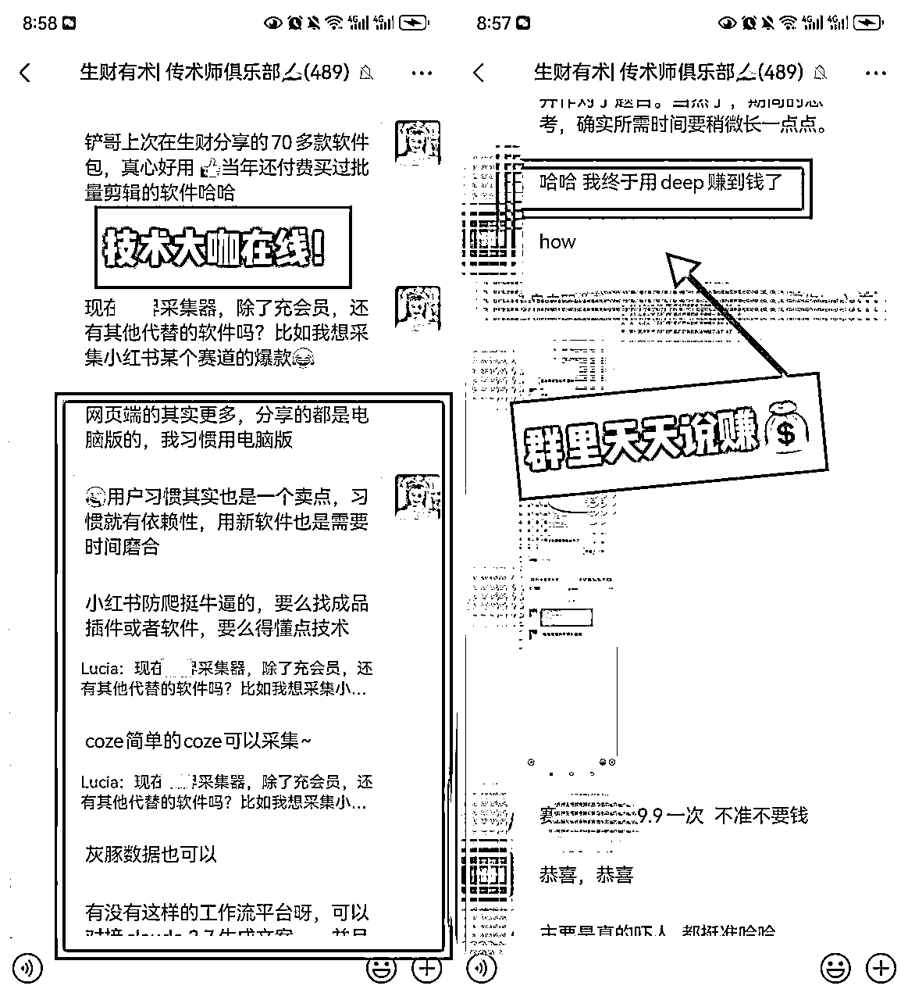

# 除了 1 篇帖子得 1 颗龙珠，复盘发现「传术师」和「航海教练」的N个隐藏收获

> 来源：[https://cbwtkywz24.feishu.cn/docx/NsfFdTURno5dHCxCwhtcb3W7nCe](https://cbwtkywz24.feishu.cn/docx/NsfFdTURno5dHCxCwhtcb3W7nCe)

大家好，我是Lucia，跟圈友们汇报一下：我上次1篇文章获得1颗龙珠～感谢圈友们的点赞和支持，这份荣耀我不敢独享，咱们依然文章复盘里见，爱大家！

今天分享的主题是： 除了 1 篇帖子得 1 颗龙珠，复盘发现「传术师」和「航海教练」的N个隐藏收获

目录传送门：

一、自我介绍:从生财暂住人口到常驻人口

二、成为传术师&航海教练的成长

三、什么样的人适合做传术师&航海教练

四、Lucia掏心窝的碎碎念（(打call版）

# 一、自我介绍：从生财暂住人口到常驻人口

### 不只是上班族，还是生财的传术师、教练。

我是Lucia，ESFJ（最像i人的e人），摩羯座，吃不了辣的广东人。

*   普通本科，荷兰公派出国留学生，财商晚熟。

*   正在做小红书虚拟产品项目处于1到 10 阶段。

*   以前我还是只会埋头做事的上班族，现在我拿到龙珠、入选精华、被主动邀约做教练。副业赚得比主业还多。

### 我的精华帖和航海档案

去年12月我发布小红书拆解帖获得精华帖，成为了传术师，后续直接通过1篇帖子获得1颗龙珠。6 月我报名了小红书航海，和近2000位船员陪伴前行，圆满完成了航海之旅。

贴上我的2025年精华帖，大家感兴趣欢迎阅读：

1/ 龙珠贴：小红书虚拟连续爆单3天，卖了1300单后的总结（可复制版）

https://t.zsxq.com/slYbi

2/ 小红书1万阅读，千赞赚6k，上班族是如何做到的（小白友好版）

https://t.zsxq.com/Ey0c8

3/ 闲鱼虚拟1万曝光6小时卖50单，上班族如何实现(小白进步版)

https://t.zsxq.com/RZmUi

再来晒晒我的海报们

以及在收到生财有术数不清的礼物：抱枕，黑T，鼠标垫，龙珠，生财日历、生财宝典....

在生财，传术师和航海教练不只是称号，他们还是共建者队伍的一员。如果你还不太了解共建者？点这里看看吧～

传术师：https://t.zsxq.com/bRZ2U

航海教练：https://t.zsxq.com/DiuVB

如果你刚加入生财，想知道怎么快速融入；如果你已经在路上，想看看同行人的成长故事。

那这篇文章，或许能帮到你。

# 二、成为传术师&航海教练的成长

我迫不及待和大家说：在生财有术，成为传术师和航海教练有超出你期待的好处！

### 从被鼓励，到传善意。感谢传术师给我的收获

*   加入传术师社群，获得高质量社交

*   从“不擅长写”到能系统地表达想法，助力副业爆单

*   把分享变成源源不断的收获，精神与物质双回报

#### ① 加入传术师社群，获得高质量社交

只要文章获得精华帖，就会被邀请进高手云集的传术师社群！进群后我感觉赚翻了！

我第一次进入传术师社群都惊了，群里除了每天赚钱，还讨论赚钱的最新动向，卷到令人发指。

当我在群里抛出一个问题时，立刻就有一群好心人热情回应（此处180度鞠躬jpg）。

那天已经是晚上11点了，我还在为一个问题发愁。没想到一泽主动私聊我，在12点前就帮我解决了原本以为要耗上大半天才能搞定的问题，结果他不到一小时就帮我搞定了。

有一泽在，感觉天下我有！每个人都值得拥有一个程序员朋友。他还顺带给我强烈安利了珍妮老师、叶凡、林泽，以及他的一圈朋友，简直是人脉王本王。

后来，我又在生财看到蘑菇圈友分享的视频号虚拟资料精华帖，一眼就想去链接，结果发现她正好也在我们的传术师群里，太巧了！

总之，那些曾经只在生财榜单上看到的名字，如今一个个出现在了我的生活里。我对生财有术传术师社群的印象越来越好，很多有价值的信息，都是圈友们主动分享给我的。

如果你想赚钱，想结识贵人，又不想走弯路，这里几乎有你需要的一切信息和资源。

#### ②从“不擅长写”到能系统地表达想法，助力副业爆单

在成为传术师之前，我对写文章并不擅长。我的习惯是“看一眼就会做”，很少花时间去系统地输出和总结。那时候，写作对我来说，既陌生又有点难。

加入传术师社群之后，我开始有意识地练习。每一次写作都是一次刻意训练，慢慢地，我发现自己不仅写得更顺了，还能更有条理地表达想法。写作这件事，不再只是记录，而是让我不断复盘、不断沉淀的过程。

比如电商找对标方法我这样总结：

1、先找品再找号：先确定3-5个同行都在稳定出单（如每天5-10单）的品，验证市场可行性；

2、反向找号：等我的店铺通过这些品实现持续出单后，再去找对标账号，观察他新上的品是否也能出单，如果有，直接借鉴选品逻辑，节省选品时间。

3、死磕一个品，反复做到爆：有几个人爆过，我也一定能爆.....

就这样，我将日常的思考和方法进行系统整理，不断记录实践复盘，不久后我就真的爆单了。

同时，从 2024 年 12 月开始，我陆续写下了几篇实操分享：先是小红书赚钱的实操帖，接着是闲鱼赚钱的实操帖，后来还拿下了龙珠的小红书实操帖。

短短半年时间，我通过写作，把自己的实操过程一步步系统地整理和沉淀了下来。写作不仅帮我记录，更让我在梳理中找到规律，在总结中看到成长。

#### ③把分享变成源源不断的收获，精神与物质双回报

3篇精华帖，我收到了一系列的正反馈。实质奖励更是超乎想象！

被亦仁大大推送的那一刻，我真的受宠若惊。既感动又羞愧，觉得自己还远远不够好。但那种来自前辈的力量和鼓励，带给我的震动非常巨大。

除了亦仁大大的鼓舞，还有来自成百上千的圈友的反馈。印象特别深的是，有一次一位圈友告诉我，我的文章对他很有帮助。那一刻，我体会到一种“戒不掉的喜悦与成就感”。原来，分享的过程不是失去，而是获得。世界的资源和机会，比我们想象的要丰厚得多。越勇于给予，越会有新的东西回到身边。

写作的价值，还在于它能让别人“看见你”。文字就是一个人的灵魂映射。其实，分享并不需要你很厉害，只要能给哪怕一小部分人带去启发，就已经足够有意义。

在这里，我真切体会到生财精神，“越分享越幸运”、“文章会走路”。也悄悄把那些被夸奖的话存了下来，每当觉得没能量时，就会翻出来看看，心里充满感谢，已经成为我生活的能量源泉。

当你觉得身边无人可说时，可以来生财有术说。勇敢地分享、表达、拥抱生财吧。

### 当航海教练带给我什么？从小透明不自信，到被认可；从零碎经验，到SOP输出。

*   收获了认可与成就感， 提升影响力

*   沟通与信息处理能力大幅增强

*   学会因材施教，建立属于自己的 SOP 流程

#### ①收获了认可与成就感， 提升影响力

关于成为教练的故事，是在我成功传术师后。那时，我特地去请教小红书的希平教练。慢慢熟悉后，他不仅鼓励我，还第一个对我说：“小红书店铺的航海，其实你也可以做教练。”那一瞬间，我愣住了。原来，我也可以做教练吗？

后来我又去请教了闲鱼航海的安之教练，他同样认可：“做小红书的教练，你完全可以啊。”那是我第一次真切感受到，自己被看见了。于是，我没有再犹豫，立刻行动起来。

不过，与其说我是教练，不如说我是一个忠实的陪伴者。

有一位圈友，是第一次参加航海。他经常来提问，也特别愿意听话照做。我平时盯得很紧，所以对他能拿到结果，我心里是有底的。

有一天他焦急地来问我：“最近听说小红书每天发不超过 20 个笔记，我要怎么办？”

我没有直接把答案塞给他，而是耐心引导：“按照你的想法去做。没有任何一个手册和教练能替代你。你已经出了第一单，接下来要靠独立思考去解决问题。”当然，在后续讨论过程中，我还是给了一些实质性的建议，帮助他更快地找到方向，解决卡点。

他的悟性很高，没多久就兴奋地告诉我，已经出了 500 多单！那一刻，他的幸福和喜悦透过文字传递过来，也让我感到无比欣慰。这样的小故事，做航海教练过程中常常发生。

越来越多的人认识我，平时仰慕的大佬们，向我投来橄榄枝，说“我看过你的文章，收获很大”，邀请我做星球嘉宾，发出讲师合作的邀约……

有个圈友，欣赏我写的拆解文章，请我去她的群里做分享，后续深度合作，我成为了她几个内部项目的共创嘉宾；另外一个圈友是公司的CEO，给我发出两次郑重的邀约：请我成为他们公司小红书项目的顾问，为他们的团队提供内容策略或运营方面的建议......

我受宠若惊，本来和这些圈友之前是毫无交集的；他们在生财也是潜水，我后面忍不住问他们为什么会选名不见经传的我？

他们说：”都是生财圈友，天然信任；你有那么多精华帖、是生财严选过的传术师和航海教练，实力毋庸置疑。“

感恩生财的光环，让我的影响力上升了，名利双收，我靠这些机会，实现靠兴趣吃饭，足以覆盖大部分的日常开支了，副业无忧，真是超预期收获啊。

#### ②沟通与信息处理能力大幅增强

作为航海教练，常常微信消息跳到 99+，各种求助、咨询、突发状况接踵而至。刚开始的我常常手忙脚乱，不知道先处理哪一个。但在一次次磨练中，我逐渐学会了高效分辨优先级、快速回复，同时又能保持耐心答疑。

我发现，解决问题并不只是“给答案”。即使有些问题我当下无法处理，我也会第一时间告诉对方：“我收到了，正在帮你想办法。别慌，我会陪你一起解决，不会只是丢个链接让你自学。” 这种被陪伴、被在意的感觉，比答案本身更能让人安心。

当然，有些问题超出了我的把握范围，我就会立刻去「教练群」求助。那真是生财严选的“高手云集”，luke 教练、星萤教练、叄斤教练、柚柚可乐教练、重洋教练、小海教练、夏林教练……每一次分享都让我受益匪浅。

最让我记忆深刻的是 luke 教练，他平时话不多，但每次开口都是关键提醒：“利基市场、长坡厚雪、POE Claude、关键词布局”……这些词汇在当时的我听得一头雾水，但回头再看，才意识到自己当初错过了多少宝贵的信号与机会。

当然，还有群里负责又温暖的领队们：美妙人生、媚子、剑渊。认识你们，是我莫大的幸运！

#### ③学会因材施教，建立属于自己的 SOP 流程

和不同圈友的交流中，我慢慢意识到：每个人的学习方式和问题习惯都不一样，需要用不同的方式去引导。

有些圈友偏好结构化思维，只有把底层原理和逻辑都梳理清楚，才愿意真正出发；

有些圈友追求完美，常常卡在细节里，迟迟不敢行动；

有些圈友目标明确、行动力超强，第一天就能批量上手工具，边做边迭代；

还有一些圈友比较敏感，不好意思提问，即使有困惑也习惯自己憋着。

为了更好地帮助大家，我开始尝试搭建一套“小 SOP”。我把几个微信群置顶，并打开消息通知，确保第一时间能看到圈友的求助。常见的高频问题，我会提前整理，放进微信收藏夹。解答时尽量用图文说明，按 1-2-3-4 的步骤清晰标注，让对方一看就能明白。不同类型的圈友，我也会因材施教，多说几句解释，顺便加上一点鼓励，帮助他们找到继续走下去的信心。

久而久之，这不仅是一套答疑流程，更是一种陪伴感和信任感的积累。也是对我自身的系统化思维的锻炼。

# 三、什么样的人适合做传术师&航海教练

如果你是喜欢真诚分享，和人交流交朋友的人，那么做传术师或者航海教练，会是一件非常享受的事情。

### 欢迎爱分享，真诚的你加入

所有的套路最终都会败给细节，而真正能打动人的细节，必然源自真心。

比高圈友说过：“真诚是社交中最大的杀手锏，反正往那一坐，自己掏出刀自己捅，把心把肺都掏出来，说一句，这就是我的全部了，你看着办吧。”

所以，我们只要保持真诚利他的心态，就不必说那些自己并不认同的价值观，更不必为了迎合而刻意讨好，更没必要为了某些目的去“吹彩虹屁”。真心换真心，才是最持久的连接。

### 欢迎爱交友，交朋友的你加入

曾经被善待过，所以也愿意一直善待别人。

虽然我是 E 人，但其实平时几乎不怎么社交，更多时候是默默做事，忙完才会找朋友聊聊、回回血。

但当我拥抱整个生财的环境时，我发现自己得到了卸下防备的友谊。这种纯粹的关系，不是出于功利，而是出于彼此的信任与善意。它就像是一剂良药，能在漫长岁月里，对抗孤独和虚无。

### 进一步提升自己，能力再上一个台阶

看了这么多，相信你也能感受到，我在成为传术师和航海教练的过程中收获了许多成长。也正因如此，我特别推荐所有想做内容、做产品的小伙伴加入进来。这里能让你系统学习如何看数据、如何做社群运营、如何总结和表达、如何通过写作打造个人IP影响力。

如果你是“会做不会说”的人，是“凭感觉做事”的人，或者正在探索全新领域、想快速摸清门道的人，那就更适合来这里。我太理解这种状态了。大胆一点，突破自己的天花板。向上走，本就是不断爬坡的过程。懂得越多，路子也就会越走越宽。

### 想要更多的合作机会

如果你和我一样都是普通人，想被更多人看见、喜欢、信任，提升影响力，有各种各样超预期的合作机会（最容易的就是被邀一起搞钱）来这里就没错了！

一个人做事进步有限，一群人才能走得更远。所以特别期待能遇到聊得来、能一起做点事的人。 哪怕暂时没合作机会，交个朋友、聊聊想法，也挺好的呀 。

# 四、Lucia掏心窝的碎碎念(打call版）

我是被生财有术改变命运的普通人，如果没有生财，现在你不可能认识我，没准我在什么地方，过着重复而无聊的人生。下面是给不同阶段的朋友的建议：

### 已经加入传术师&航海教练的圈友：

*   在离钱近的信息源，公开分享越多，发生质变的可能性就越大，接好运！

*   答应我一起写！一起冲进航海家社群好吗？搭子们

### 还没加入但对传术师&航海教练，但心动的人：

*   这是一个有很多赚钱信息的地方，这里是少数人走的路。

*   往前走，换圈子，开始写，分享是美德！

最后感谢七天，那么用心运营传术师的社群，把人连接起来，让我发现输出的价值，因为在生财有术发帖，我遇到了各种各样的圈友们，我也因此接触到了很多好机会

感谢三七军师的帮扶，耐心的帮我提建议，在脑袋卡住时候送来灵感，辛苦啦

感谢韩哥，给我很多机会，一起参加线下活动，我们聊过很多很多细节，我有哪些想看的东西，他总会第一时间分享给我，无论遇到什么问题，都说好朋友们一直在；帮我太多，我常常觉得自己没有做的更好而惭愧。

感谢张柯，网感超强，商业敏锐；感谢澄歌，说越分享越容易被看到，也越容易遇见同频的人。

这样的圈友还有很多很多，他们都在生财的社群里......

欢迎更多的小伙伴一起做传术师和航海教练，一起生财有术。

