# 普通人如何24小时在小红书构建自己的生意【生财有术线下mini航海精华文字稿整理】 【2.3w字】

> 来源：[https://g8ekpu7h0l.feishu.cn/docx/Po7bdEp3UoRKJ6xwgK4cLYdInBh](https://g8ekpu7h0l.feishu.cn/docx/Po7bdEp3UoRKJ6xwgK4cLYdInBh)

这篇文章是我在生财有术线下分享的关于普通人如何在小红书24小时构建自己的生意文字稿整理，总计2.3w字；

24小时在小红书构建自己的生意，主题创意来源于 一本书《the million dollaor weekend》

如果你不知道如何定位，不知道如何做虚拟产品，不知道如何挖掘自己的优势，并把自己的优势、技能化市场化，这篇文章一定要看，值得反复看

另外这篇文章也有很多关于AI相关的部分，希望对你有启发

小红书是一个很大的市场，每个鲜活个体都可以找到TA的定位

其实今天我想跟大家强调一个核心观点：如果我们从赚钱的视角，从赚钱系统的维度去重新审视小红书，我们不必再把自己局限在传统的单一角色中。

我们应该分为两个角色：生产者和消费者。为什么这么说？因为我后面会详细拆解，"小红书是目的，不是手段" —— 这是我今天想传递给大家的第一个核心概念。

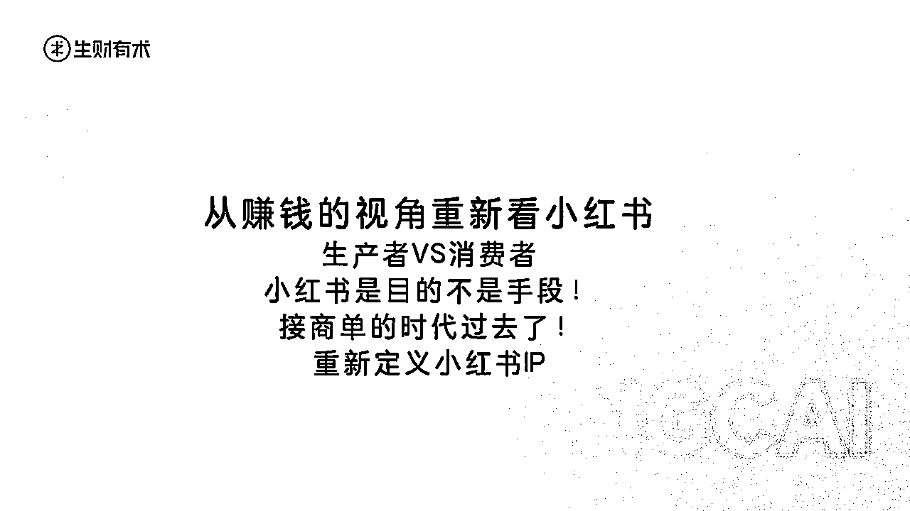

## 第一个认知突破：接商单的时代已经结束

按照2022年-2023年的传统逻辑，我们要在小红书赚钱，一定要接商单。这是最主流的方式，包括所有付费培训的人都告诉你："我们要接商单才能赚钱。"

但现在小红书已经不是单纯的平台了。举个最简单的例子，跟大家生态都比较接近 —— 小猫补光灯APP，大家听过吗？这是一个独立开发者做的APP，他的产品定位其实是在小红书火起来的。为什么？因为他把小红书看作市场部。

我有一个产品，我怎么向外界传达产品理念？通过小红书来传达。所以我认为，如果要做AI产品，你一定要在产品定位上思考：小红书能够帮助我这个产品做什么。

包括我认识的一个博主，他通过做AI背单词网站，大概卖出了1万多单，定价39.8元。他这个网站整体的代码底层逻辑，以及网站中嵌入的大模型，其实都是基于AI去做的。如果我要做独立站，不通过小红书这个渠道，获客是很难的。小红书获客是非常容易的 —— 所以我们要重新定义小红书。

作为从2021年开始做小红书的博主，我跟大家说实话：现在小红书整体的返点要求，已经达到了一个不健康的水平。

### 商单返点的残酷数据

返点是什么意思？比如报价2000元，返点40%就要返800元。整体返点要求已经是40%起步 —— 什么意思？40%是基础门槛。如果你不返到40%，连见到品牌的机会都没有。

整体小红书平台的合作逻辑是：不是品牌直接选号，而是媒介公司先选号，媒介公司选号后再给品牌方。所以有一轮筛选过程，现在的返点就是40%。

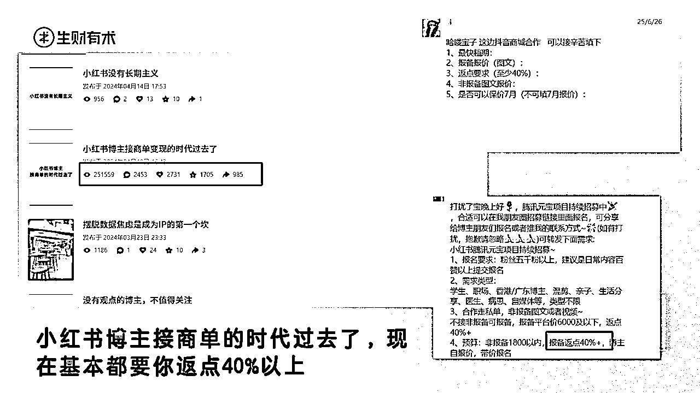

这些都是品牌方给我发的截图：你想见到品牌方，得先交40%的返点费用。更残酷的是美妆赛道最卷，返点要到70%以上。欧莱雅这种大客户，返点要到70%以上。所以整个小红书商单的情况是不健康的。

我之前发过一篇笔记，2024年4月发的，我可以明确跟大家讲："小红书博主接商单变现的时代过去了"。这篇笔记在小红书跑了25万浏览。

这篇笔记为什么火？因为它揭露了一个现象：在小红书赚钱，你不能只靠接商单了。

跟大家透露个数据：2023年6月我接商单的费用大概一个月1万元左右，我粉丝1.8万。但今年我只接到1条商单，然后就再也没有接过了。

所以大家要在小红书赚钱，我给大家打个"清醒剂"：不能再考虑积累到多少粉丝入驻蒲公英接商单。除非你是天生的商单体质，能够让品牌方给你投广告，否则你没有机会去做这件事了。

当然这要看赛道。比如AI赛道，AI产品层出不穷，AI赛道是比较好接商单的，但还是要基于大家各自的情况来反馈。所以新手做小红书千万不要再靠接商单。我这里没把话说死 —— 你可以接商单，但不要当作商业模式的主流。

## 第二个突破：同城服务的百万机会

我刚刚讲了要把小红书看作目的，不是手段。这个案例就是很好的例子 —— 同城服务案例。

### 杭州上门做饭的生意逻辑

同城服务是基于当地人需求衍生的服务。我今天给大家讲的是：我们不要只做虚拟产品，大家一定要有提前的打算。

首先上门做饭。杭州是什么？杭州是美食荒漠，但杭州有什么？杭州属于"有钱人+美食荒漠"，有钱人中间有个需求gap，需求的gap就是赚钱的机会 —— 所以有上门做饭。

大家可以搜"杭州上门做饭"，四菜一汤108元手工费。底下就有人问：包月可以吗？你做副业的话，有几个包月客户就OK了，副业收入其实就够了。所以在杭州会做饭，就是你的核心竞争力。

### 杭州旅游攻略的虚拟产品

第二个是杭州旅游 —— 这是虚拟产品。杭州旅游攻略都能卖出去！所以我告诉大家："万物皆可虚拟产品"。

杭州到底怎么玩？其实很多人不会在杭州旅游。举个例子，西湖你到底怎么玩？这都是非常底层的需求。

### 租电动车的商业模式

大家能看懂吗？租电动车的生意。为什么？现在流行凌晨4点去西湖看日出。我以前凌晨4点半起床骑车，西湖杨公堤巨堵，非常堵，全是人挤在那里看日出。但看日出很多人没有自行车，也没有电动车 —— 就衍生出租车的生意。

租车的生意谁都可以在小红书上做。秋天马上到了，我们延伸一下：夏天租电动车为什么好租？夏天热。秋天为什么租自行车好租？因为秋天凉快。

我之前骑自行车，车店老板就是租车的，自行车一天160元，是公路车。

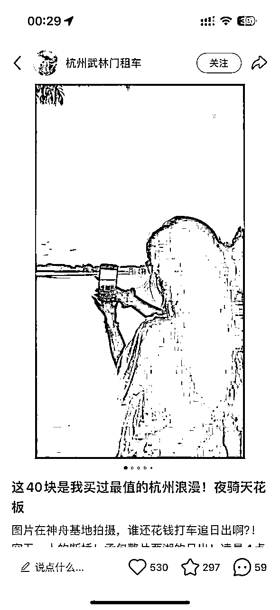

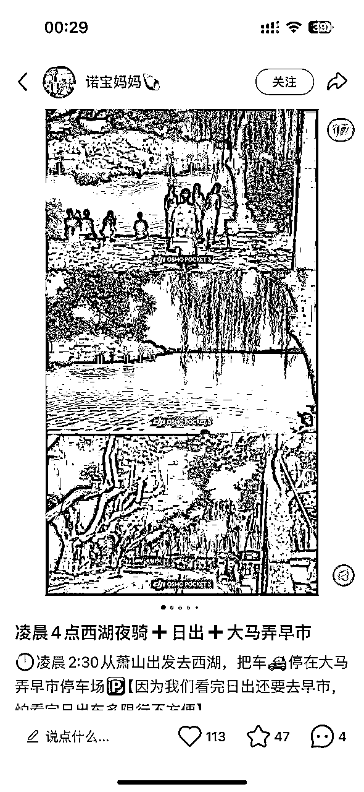

为什么要骑公路车？因为公路车起速比较快，不是骑共享单车。共享单车有个弱点：上坡特别难。而杭州很多景点都在山上，比如龙井茶山、梅家坞，那些地方都比较有坡。

所以租车的生意，你看这么小的生意在小红书上放大其实也可以。另外杭州是全国第二大骑行友好城市，很多人来杭州都开车。换个角度讲，我租一批自行车，通过小红书渠道去做租车生意 —— 这也是比较好的生意模型。

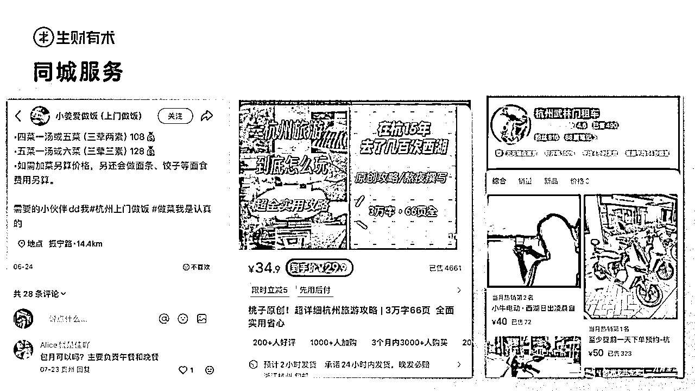

### AI无法取代的蓝领生意

所以大家看到没？这是基于同城服务，我从场景切分，大家一定要思考你的某项技能是否可以变现。

我再举个例子，因为我虽然本科学机械，但我手比较笨。其实在小红书上，AI无法取代的蓝领生意，在小红书可能赚得盆满钵满。比如修水龙头、修漏水等等，在生活中有很大机会。

我爸的同事从工厂离职，在三四线城市成为超级个体，每天给别人修太阳能、做防水，一个月能赚1万多元。在三四线小城市，一个月1万多元已经赚很多了。

## 第三个突破：职场博主的C端市场

大家平时都在职场，从职场博主角度讲，你接商单根本接不到。为什么？商单的本质是小红书的广告位。我职场上班那么累，还有什么广告位？

所以做职场博主一定要做C端市场。

### 什么是C端市场

广告是B端市场，C端市场是什么意思？就是基于你的技能和优势，你能满足某些人的求职需求 —— 这就是C端市场。

第一个，他卖大厂的面试经验。这些东西我跟大家讲，根本不是他原创的，都可以通过AI智能体加小红书现有物料去生成。

第二个，卖产品经理学习库。

第三个是大牛，整个运营行业卖虚拟产品最好的，在小红书里卖了几十万，卖什么？刚哥的运营课。

他的优势是什么？把内容变成手稿形式，不是卖知识库。他的优势是那种粗糙感 —— 手稿就是手写的东西。

大家可以搜"刚哥的运营笔记"，这三个案例：他卖了1500多单、500多单、7000多单。

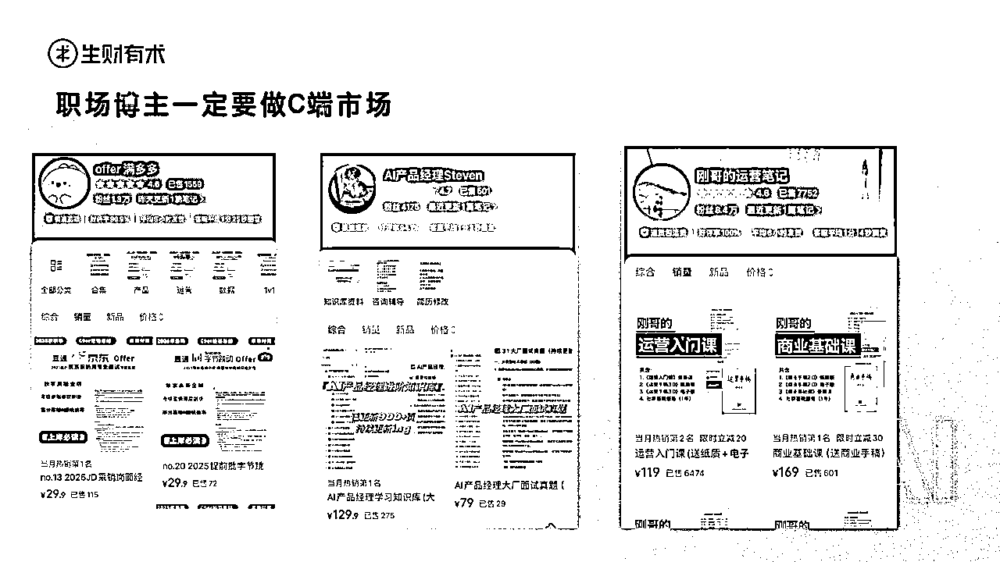

### 今天大家的任务：你到底是谁？

除了你的职场生涯外，你到底是谁？你是数据分析专家吗？你的数据分析能力特别强吗？还有大厂高管吗？

### 大厂出身的变现逻辑

我这里延伸一下：为什么大厂出来的人必须要做付费？本质上大厂是普通人能够拿到年薪百万几乎没有之一的出口。

大家可以搜一个岗位名称：京东采销。京东采销是小红书上大厂岗位最热门的岗位之一。

我卖京东采销的面试题，一个月卖出几十单。为什么？因为很多人都想进入京东采销这个岗位。

有个博主只卖京东采销相关的东西，粉丝3000多，他卖京东采销的面试题、求职辅导、简历修改、面试资料。这么多服务加在一起，他一年赚了20万。

所以如果你在某个岗位有非常深度的切入，我建议把这部分技能抽离出来，变成垂直技能的行业专家 —— 这叫做职场变现。

### 雅思8.0的英语生意

在小红书上卖英语相关的生意，你能够拿到一年100万GMV。学英语是东亚人一辈子的课题，大家认同吗？

学英语是东亚人一辈子的课题。包括我也在学英语，包括我今天会给大家介绍手把手告诉你：如果很多人想做原创性产品，但没有相关经验怎么办？今天我会给大家讲一个"协修"的方法 —— 协修是小红书目前比较火的一个词。

雅思8.0，只要你雅思某一项做得好，特别是雅思口语做得好，你都能卖口语素材赚钱。

### 考试专家的方法论

你是否有自己的协修复习方法？什么是考试专家？考试专家跟拿到结果不一样 —— 你非常擅长考试。虽然你最后拿不到好结果，但你擅长总结方法论再讲述也可以。

比如协修背单词，把单词融入霸道总裁小说里，让大家更加情景化教学。

### 懂AI的教师机会

懂AI的教师。AI是未来，但很多人在AI上的发展只是局限于疯狂卷技术、卷AI的底层逻辑。但用户真正需要什么？你给我AI落地解决方案。

我是老师，你能不能帮我用AI更好地做教案、做PPT？这才是AI对每个行业的帮助。

中国职场基于形式主义，很多都是基于形式主义。所以你PPT做得好，在垂直场景下也有很大机会。

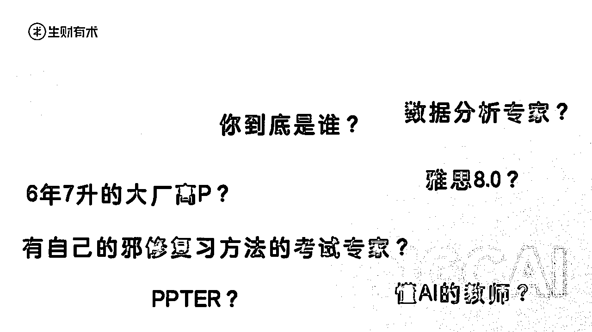

## 第四个突破：核心业务模型

你到底是谁？大家思考，我会给大家十个问题清单，思考你到底是谁？你的技能有哪些可以在小红书上市场化，任何技能都可以在小红书上赚钱。

重点来了：你要学会挖掘自己的优势、身份、成就、角色。

"你的优势和小红书用户的付费点就是你的业务模型" —— 大家能懂我这个意思吗？

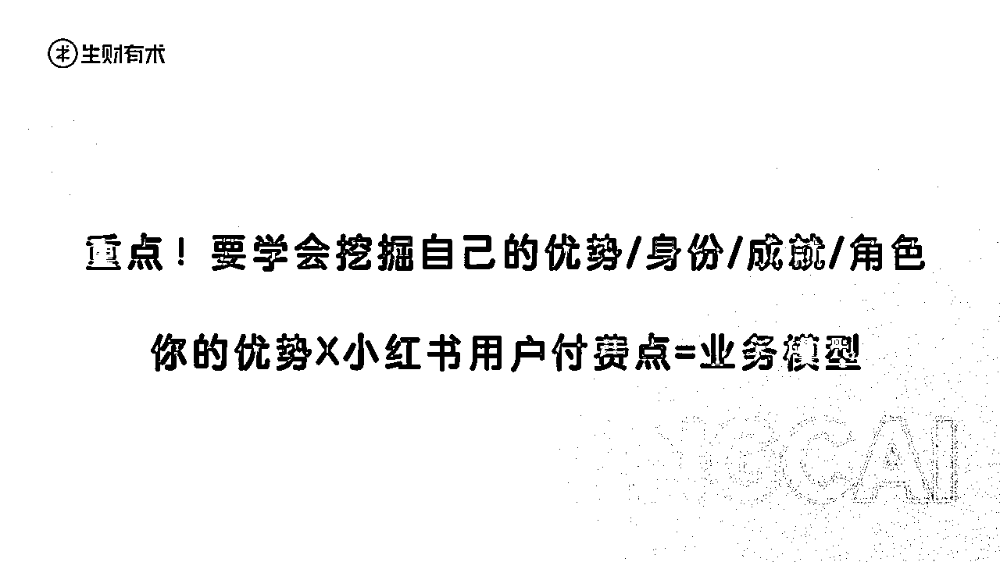

### MBTI+旅游攻略的完整逻辑

给大家举个例子，大家懂MBTI的J人、P人吗？我刚刚讲：你的优势和小红书的付费点就是你的业务模型。

大家重新理解这句话：J人的优势是什么？计划清单攻略。小红书用户有个付费点是什么？旅游攻略。大家去搜小红书旅游攻略。

我也给大家举例了，小红书的旅游攻略卖得特别火。为什么？因为很多人懒，懒得去找旅游攻略。

我从业务角度倒推：出国旅游大家最担心什么？最担心被坑。

小红书虽然有很多旅游攻略，但我也担心被坑 —— 可能是商家的广告，而且攻略非常浅。我要去国外旅游一圈，要花很多时间和金钱，我很看重这次旅行，但又有点担心会亏。

我想找本地人的经验，或者资深旅游人的经验。也就是说我买了这份旅游攻略，虽然只卖9.9元，但它能解决我可能5000元旅游预算打水漂的顾虑。

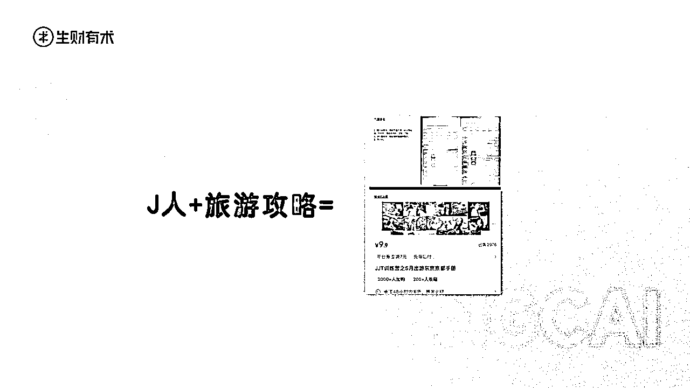

我买9.9元买了一份保险 —— 这是心安理得的保险。我去日本旅游，我觉得花9.9元无所谓，虽然可能没有帮助我，但我买了。

所以J人+旅游攻略，就等于你的业务模型。

《东京出游攻略》卖得最火，他只通过一篇笔记就卖了3000多单，相当于把去东京的旅游费用全赚回来了。

大家一定要思考，回顾一下你的优势：我的优势是J人，小红书的付费点是旅游攻略。旅游攻略是小红书已经验证的成熟模型。

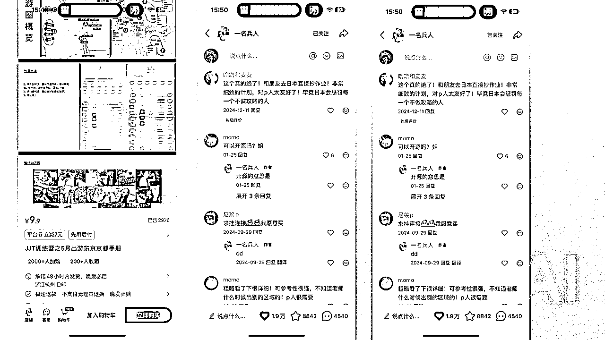

### 虚拟产品获客的完整链路

当然这不是终点。9.9元我获得了什么？我获得了一个客资。

给大家提个重点：所有线索行业、所有客资行业都可以用虚拟产品重新做一遍。

我买了日本旅游攻略，可能要包车、找当地旅游团、订酒店。我买了这份攻略，获得了他的联系方式。所以所有客资行业都可以用虚拟产品重新做。

虚拟产品最低1毛钱获得一个有效客资。大家可以搜各种诊断报告，皮肤诊断报告1毛钱，然后引流到私域，我给你详细报告，然后再转化：

"姐妹你这不行，你得做光子嫩肤。"

"我觉得你说得有道理，那我就买。"

1毛钱转化到9999元 —— 完成整个转化过程。而报告可以通过AI去做，所有文字类的东西都可以通过AI去做。

复习很重要：你的优势和用户付费点就是商业模型。

这个人比较懒，他现在还写5月。如果是我，我要写10月、9月。另外我还可以写京都，为什么写京都？因为12月是京都赏枫叶最好的季节。

然后看这个"求链接"，他们要做虚拟产品，他就把链接放上去了，做了个商业闭环。

所以优势市场化，技能市场化。你的技能可能就是小红书上百万的生意体量。大家千万不要小看小红书，小红书付费用户特别多。

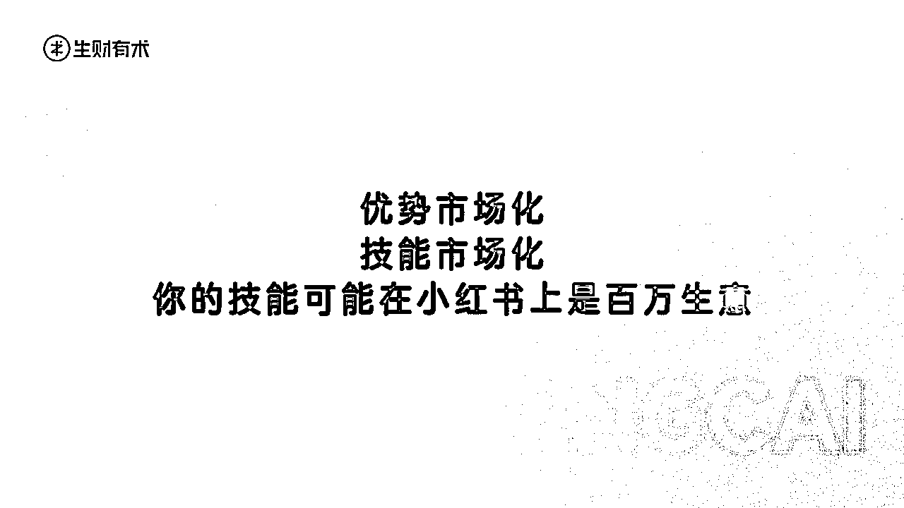

## 第五个突破：YouTube+语言学习的600万生意

我在航海圈说过我们要反向赚钱，要去做油管、YouTube、YPP。大家听过深海圈吗？我们可以反向赚钱，大家看这个案例：

YouTube+英语就是百万生意 —— 大家记住这个模型。

大家平时上油管吗？如果没有上油管，一定要去上油管。因为油管是世界的语言学校 —— 它不只有英语、法语、日语、德语，还有韩语、俄语都有。月活几十亿，所以YouTube+英语是成熟生意。

为什么？因为大家要练口语素材。YouTube有很多口语素材，我们就去做这个项目。

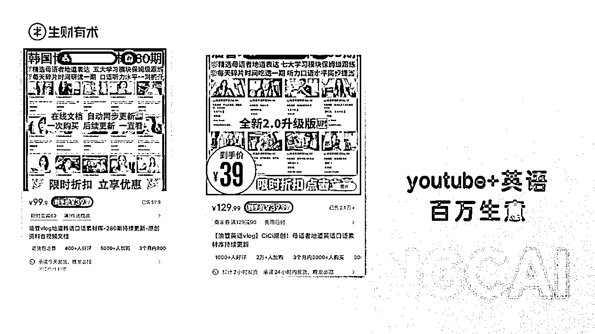

### 韩语赛道的时机洞察

如果9月份我推荐一个赛道，我推荐韩语。大家能思考为什么我会推荐韩语吗？

我们要考虑赛道，要考虑当下的市场需求：为什么9月份要做虚拟产品，要做YouTube+语言这个赛道，为什么做韩语是好生意？

九月份国家推出韩国免签政策。免签代表什么？代表很多人会去韩国旅游，虽然是团体游，但我有个需求：要学一些基本的韩语。所以韩语在9月份会是井喷的需求。

去韩国旅游除了语言，还有我刚刚讲的攻略。

### 数据验证商业模式

大家看这个"油管vlog地道韩语口语"，他卖了5118单！只是一个店，也就是说5000多单代表这个生意模型在韩国免签之前就已经成立了。所以9月份其实是放大效应。

销量代表用户需求 —— 我付费就代表我认可你，就代表我有这个需求。

大家可以考虑一下：我只需要找到韩国的博主，从YouTube把素材下载下来，然后用AI优化：如何让别人通过YouTube更好地学习韩语，然后做知识库 —— 就是我的赛道。

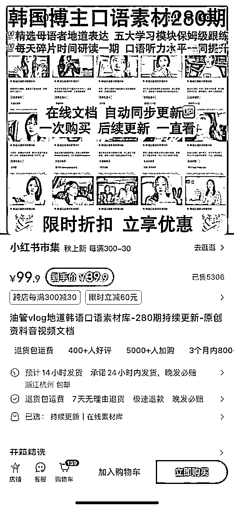

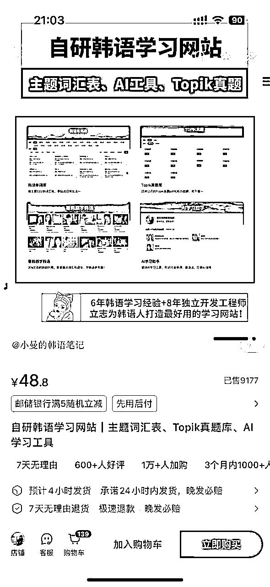

## 第六个突破：找到自己优势的十个问题

找到自己的优势，一定要问自己实际问题，直接给大家看问题：

### 第一个问题：你拿到什么大结果？

且这个大结果目前没有人拿到。什么算大结果？这个大结果不是在社会评判标准下，是你在个人评判标准下。

我二本机械转行广告，做过很多项目，这算大结果吗？很多人觉得不算。但为什么觉得算？我算不算想转行到其他行业的人的一个灯塔？我作为普通人角色成功了。我们写出一个方法论，告诉你我怎么成功的SOP。

我二本毕业，考研拿到985录取通知书，且复试第一 —— 这就是大结果。从A到B你克服了别人没有克服的困难，拿到了成果。在垂直赛道来讲，它就是大结果。

### 第二个问题：你所在地理位置有哪些可以小红书化的标签？

还是讲杭州。杭州我刚刚讲过租电动车，可以小红书市场化的标签。还有什么？大家要动脑子想 —— 找好吃的可以作为话题点，但用户不会买。为什么？在小红书用户买的是深度，你对这件事的理解和整理。

小红书什么最出名？除了西湖还有灵隐寺，有手串。在小红书做手串的生意，开光也赚钱。

杭州还有旅游攻略，每个城市都可以做旅游攻略。从旅游攻略视角往下：暑假是自驾游，自驾游再往下分是研学游。研学在整个圈子特别火 —— 我去一个城市想了解当地文化，研学手册这种也比较火。

除了杭州，北京可以复制一遍：北京旅游攻略、地道北京攻略、带父母该怎么玩。北京吃的最火是烤鸭和火锅。给别人代排队，100多元我能给你排队、选座位。排队这件事就是我卖排队的资格。每个技能、每个服务都可以做商品化。

义乌小商品市场游学去年在全国特别火。新乡有胖东来，胖东来的代购也特别火。

假如你的城市有山姆，做山姆分装、零食分发。我之前有个学员做山姆代购，从小红书引流，一年引流2000多客户。这些小生意都不起眼，特别赚钱。

大家可以直接搜"山姆分装"。山姆还有个场景：大学生想吃山姆蛋糕，但一个人吃不完，拼单。在北京山姆可以直接送到大学。杭州也有3家山姆，包括你的城市有什么资源，胖东来游学也有。

### 第三个问题：你在某个领域是否有超乎他人的积累？

比如谈恋爱。在小红书上教别人谈恋爱都能赚钱！我把谈恋爱心得写成攻略，在小红书能赚钱。直接搜"恋爱攻略"、"恋爱心得"，就有人卖这个东西。

### 第四个问题：你是否有很强的基础技能？

什么是基础技能？Excel、PPT、写作 —— 这些基础技能都可以。

### 第五个问题：你是否有他人不具备的复合标签？

这指向故事感。我的标签越多，故事感越多，内容可发散程度越多。比如："37岁大厂即将被裁，面对高额房贷，且杭州房价一落千丈，我该如何破局？"

这种复合标签大家特别容易共情。

比如我做付费赛道，我有两个付费专栏，怎么突出这个标签？"复购率高达73%"。

你想不想知道我如何运用私域社群？这就是我的复合标签。标签要有帮助性、利他性，且有故事感 —— 这就是你的IP核心。而且能在内容上给你很大帮助。

### 第六个问题：在核心课题上，你是否有傲人成就？

什么是核心课题？核心课题是我们一辈子在追求的答案。

比如保持健康、如何与父母相处、如何与孩子相处、亲密关系、自我和解 —— 这都是核心课题。

在这些核心课题上你是否有傲人成就？大家看过《原子习惯》吗？我推荐这本书。

个人成长是比较泛的核心课题。如果我要做付费，教你如何更好个人成长，他肯定说："你谁？你教我？"因为个人成长太虚了。核心课题如果只讲核心课题太虚了 —— 没办法形成付费欲望。

什么可行？《原子习惯》是非常具体的场景：如何通过小习惯在某件事上取得更好成就。从个人成长切分效率提升这个点，只讲如何帮你保持好习惯，就通过这本书赚了几千万美金。

核心课题就是你在某些领域上是否有自己的认知。"爱人社会化指南"在小红书特别火 —— 他在如何处事上做了很多理解。

比如你特别会向上管理、沟通、攒饭局 —— 攒饭局都可以。送礼在小红书都能卖钱 —— 我教你如何送礼。

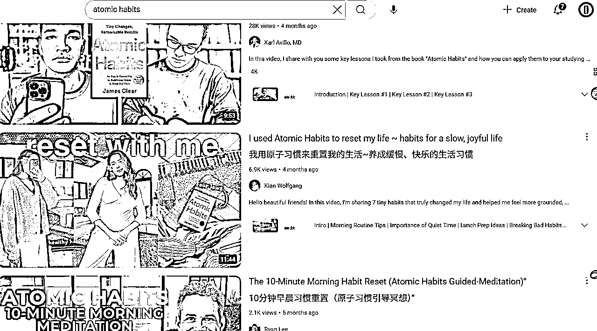

### 第七个问题：你在哪些领域专业度达到10%？

大家有没有专家思维？认为必须达到专家才能教别人？人人都是专家吗？人人都不是专家。但为什么有些人能跑出来？勇敢表达的人先享受红利。

从小学到高中班级成绩排名：100分、90分、80分、70分、60分。60分可以教50分，因为我比你分高，你不懂可以问我。30分可以教20分。

我们只需要找到我们的受众就行了。不是说我能教别人什么，而是说我能帮助到谁 —— 大家一定要把这个思维转化。

大家关注AI领域吗？AI特别难理解，但有个AI博主做起来了叫张专专。从AI视角来看，他是最专业的吗？不是，因为他是文科生，很难理解技术层面。但他在小红书10万粉丝。

目前国内AI博主主要做的方式：哪儿又爆炸了，中国AI太强了 —— 就是抓眼球的自媒体逻辑。但张专专的逻辑叫"learn in public"：我是谁不重要，我学到了什么，我能帮助到谁。他只是把学习过程分享，就能拿到10万粉丝。

如果你在某个领域拿到10%，你就一定要去做小红书 —— 因为小红书是无限细分的平台。

### 第八个问题：你是否有独特的方法论或生活哲学？

比如我刚刚讲的"邪修" —— 万物皆可邪修。协修就是野路子，协修就是捷径，是突破常识的东西。

### 第九个问题：你能否结合业务？

你懂不懂不重要。你能不能结合业务，这最重要。

我不懂AI，但我做的智能体在整个平台已有近千人用过，很多人想付费用。为什么？因为我懂如何通过AI赋能小红书这个整体链路流程。

AI不重要，重要的是如何跟业务相结合。

### 第十个问题：哪个主题你可以写100篇笔记？

为什么要说这一点？大家有没有感觉写小红书特别累？写小红书为什么很多人无法坚持？在于没有足够的内容体量去支撑。

我告诉大家为什么要写100篇？我们不要写100篇，我给大家降个数据：20篇就够了。

现在跟我实操一下：打开小红书，一个屏幕是不是4篇笔记？

用户点进你的主页，要往下滑看你发了什么，决定是否关注你。一般人会滑3-5下，按最多滑5下计算：4×5=20篇。

用户是否关注你的胜负手，是你是否发了20篇笔记。你发了20篇笔记，主页会变得丰满，活跃感会强一点。如果你发了3篇笔记就断更了，我为什么要关注你？

很多人只关注几百人，但有很多人关注几千人。是否要关注你，取决于你的内容是否发得多。这个"多"如果给明确数字就是20篇。

如果大家要做小红书，一定要够20篇笔记。从20篇笔记倒推：一个月发20篇，只需要两天发一篇。这个难度是不是就降下来了？

你要做小红书，有一个门槛叫"20篇笔记 —— 大家能get到我的意思吗？

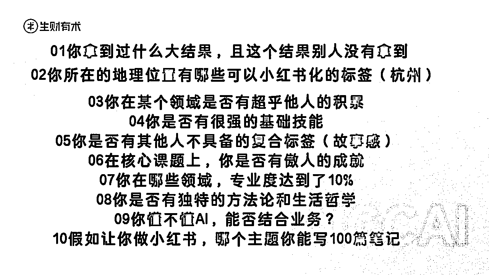

* * *

我会给大家讲"优势直接市场化"和"优势间接市场化"。今天我讲的这些内容，大家在其他地方肯定没听过。因为我刚搜了一下，没人讲这个体系。

## 优势市场化

### 什么是优势直接市场化？

其实就是你的优势直接在小红书上能卖钱。比如雅思口语无敌，直接在线上做转化。他把这个能力打包：口语素材2498份，110多块钱。还有口语进化营、训练营等基础口语素材。雅思8.0口语无敌，直接在小红书上做转化。

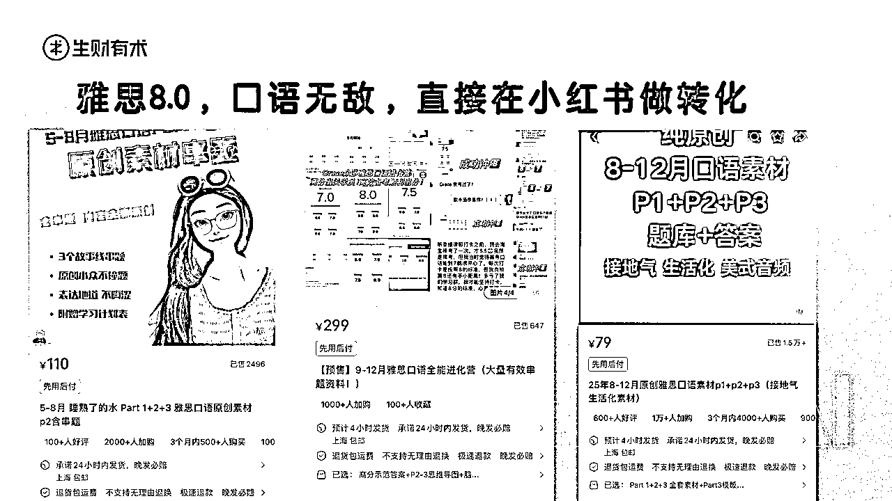

### 什么是优势间接市场化？

间接市场化就是你的优势本身在小红书上没办法直接变现，一定要结合一个用户可能付费的点。

刚刚我们提到的案例：J人+旅游攻略。J这个特性是你的间接性优势，J人+旅游攻略，其实就是间接市场化的典型案例。

我们回到这次航海：AI编程，大家会为你的AI编程买单吗？不会。但假如说你会AI编程，且你有很强的业务思维，你就能够赚钱。

比如九月航海，哪些技能是间接市场化的？"淘宝代码变成指南"——这就是典型案例。当然这确实有点难度，但你懂编程，你还懂一定的技能，这就是间接市场化。

AI编程是间接市场化技能，并不能直接帮你赚钱。但它能够帮你在整个赚钱的业务中，成为必不可少的一环。

你懂AI就能建网站。我刚刚讲了"小红书是你的市场部"，你建完网站在小红书上宣传这个网站，然后卖会员，这个链路就通了。AI+小红书=无限可能。

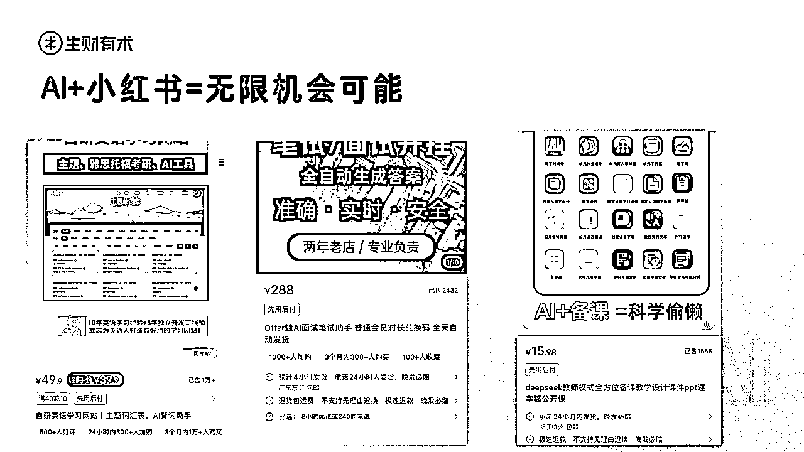

### 案例拆解：自研英语学习网站

我再强调一下这个案例：自研英语学习网站"主题词汇表VIPS"。这个网站通过AI来做，24小时就能做出来，但很多人做不了。为什么？因为他不懂英语。

所以我刚刚讲复合性标签：懂英语+懂AI，在小红书上是百万赛道的机会。

大家看这个数据：39元卖了1万单。虽然具体收入不重要，大家关注这个数据——24小时300人购买，代表这个需求当下还有很强的市场。

所以AI+小红书=无限可能性。

### 更多AI结合案例

大家发现没？很多人做AI产品没有流量。为什么没有流量？他没有找到用户的需求。

但这个面试助手，普通会员时长兑换码288元卖了2000多单。在我刚刚讲的教师场景：大家去搜"DeepSeek教师"，有人写了个DeepSeek教师应用手册，卖得特别火。AI+备课，这就是AI+小红书=无限机会可能。

AI是什么？如果你懂AI编程，它是你的间接优势。怎么间接市场化？一定要结合一个具体的用户消费场景。

自研英语学习网站+AI英语+AI面试+AI备课——万物皆可AI。

我以前做过一个智能体，但从来没有用过。这个智能体我觉得肯定能市场化，叫做"约会助手"。什么是约会助手？就是约会过程中，男生跟女生约会时经常不知道怎么聊天。有时候男生抓不准女生的心思，女生抓不准男生的心思，但他们有聊天记录。把聊天记录发给AI，就能帮你分析可能性。

现在有个AI硬件产品，可以挂脖子上的录音软件。因为拿录音笔不太好，像采访似的。但有个项链其实可以，我就做了这个东西。虽然发现它是个好想法，但市场化能否成功我不确定。

## 第二个核心：作品化思维——把优势结构化

当你找到自己的优势，下一步就要学会"作品化"，快速开启自己的生意。很多人做IP其实并不会作品化。什么是作品化？就是把你的优势结构化。

很多人如果要做IP，你想到的第一件商品是什么？是不是咨询？我只能去给别人做付费咨询，但咨询什么呢？很多人也做不了。"我不知道要给你咨询什么，你有什么问题问我。"

这就是传统做IP的逻辑——就某个主题去深入，但这并不是最优解。

### 策展思维：All in One

我告诉大家作品化的核心："策展思维All in One"。

大家知道什么是All in One吗？在小红书上什么卖得最好？我想问在小红书上什么卖得最贵？

给大家一个思路：知识库。大家去搜小红书那个"知识库"，"参考答案"卖了几千万！真的卖了几千万了。

每个人都可以有自己的知识库。我在行业手册里强调：每个人都可以有自己的知识库。

知识库是什么？知识库就是把你的经验写到一个飞书文档里——你用过什么方案，你用什么软件，你平时怎么学习的，怎么自我成长的，你对某件事的看法放到一个飞书文档里，这就是知识库。

这就是策展思维的All in One。

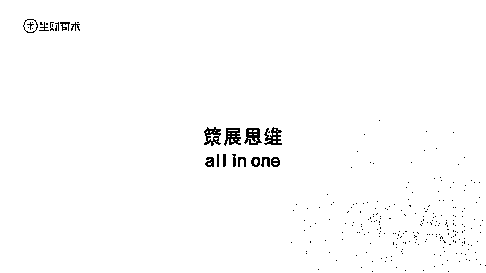

### 第一件产品：你的专属知识库

大家如果做虚拟产品，第一件产品就是你的专属知识库，你专属的智库。

重点来了：你们的第一个产品一定是你在某个领域的专业见解毫无保留地表达出来——这就是你的第一个产品，而且能卖高价。

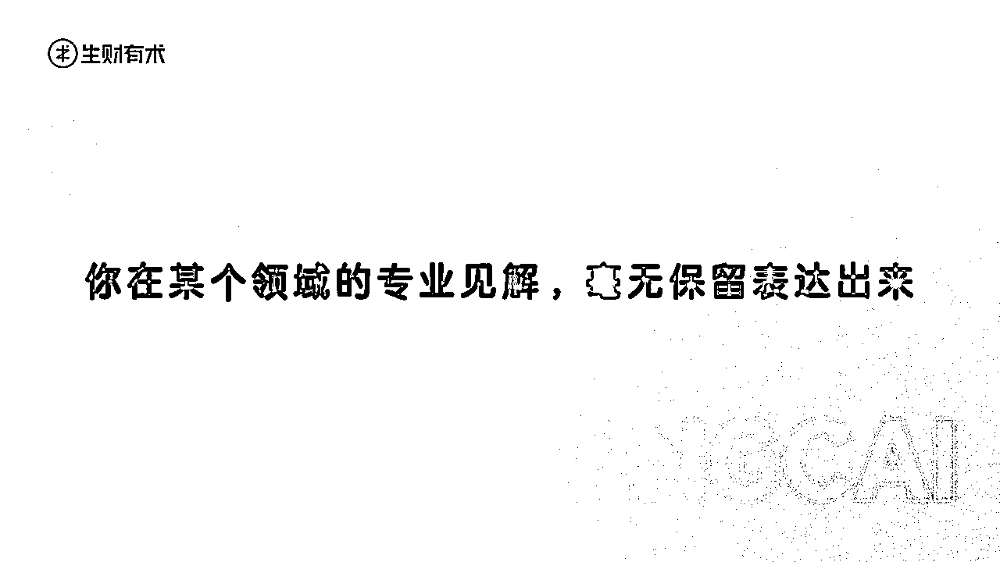

### 案例：创业书单的策展逻辑

再给大家举案例：大家看过这个案例吗？"行者创业学习方法如何书单"。

假如说我卖书单，我能卖出钱吗？我卖不出钱，书单那么多。他卖的什么？他卖的是创业书单——我从创业0到1，我的阅读顺序是什么？

这本质上就是策展，就像我们参观博物馆一样，有个动线。我从商周到清朝有个动线：先参观什么钱币，再到陶瓷，再到丝绸，再到书画。他有个路线，他给大家提供路线。

"行者专业系统读书学方案"——我该怎么读书，我读什么书。9000多单，99元，100万虚拟产品利润率100%。

我刚刚讲了什么？你在某个领域的专业见解毫无保留表达出来。

我在读书领域有什么？申论模板范文。我在申论领域，我在考公领域——申论。越垂直越付费，24小时200单购买，口供在小红书上虽然难度很大，但你经历过考公的流程，你就能切分无限的虚拟产品。

给大家举个例子：我为了搞懂教师资格证，我报名了教师资格证考试。我想考教师资格证吗？我不想考，考上考不上无所谓，但我要经历他一次考试的过程。我的优势是能够挖掘在考试过程中有哪些卡点，从而结合AI去帮我原创虚拟产品。

有同学是大厂的吗？这个就是你的产品："20万字大厂指南"，269元。

这是什么东西？刚刚我讲的All in One——里面写什么无所谓，重要的是你得写你在大厂中怎么进的大厂，你在大厂中怎么向上汇报，以及你怎么做管理，写成一个文档。

大家要想你的技能怎么能够市场化，这很重要。

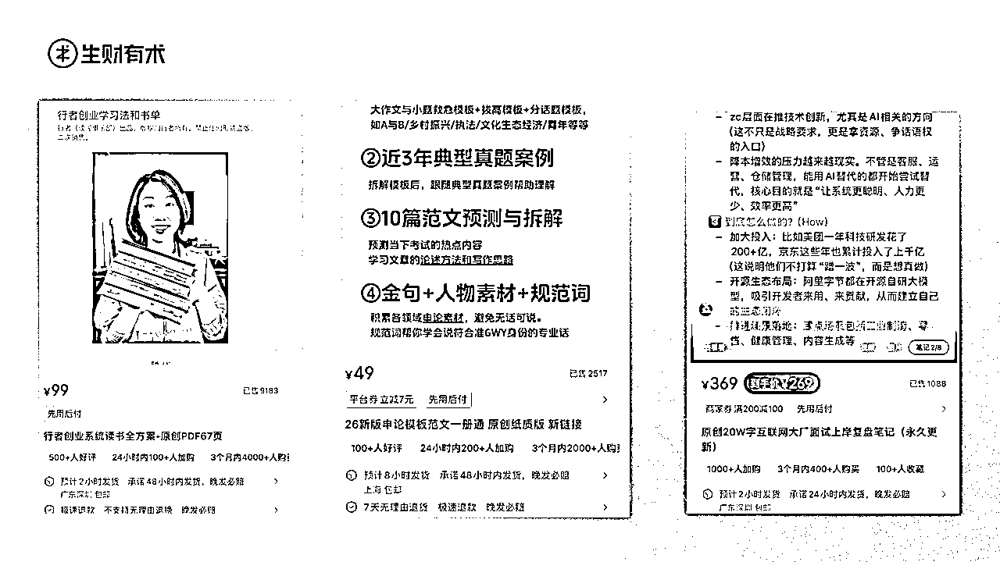

### 第二个产品：场景化拆分

我刚刚讲的是All in One做知识库，把你的经验全部放在一个飞书文档。当然这是一个产品。但在小红书你只卖一个产品太单调了，太累了。

所以就是：拆分你的专业知识，按照场景化不断细分去表达。

这是一个人店铺里的产品。我们要不断场景化去表达什么？考公场景是不是要有考公热点，要有结构化面试？那我就卖这个就行了。我把我所有东西先拆出来一部分，32元卖了150单。

我还能拆什么？我还能拆申论模板范文，我还能把思维导图拆出来。你首先已经有一个All in One的产品，可以卖高价，卖260元、268元。

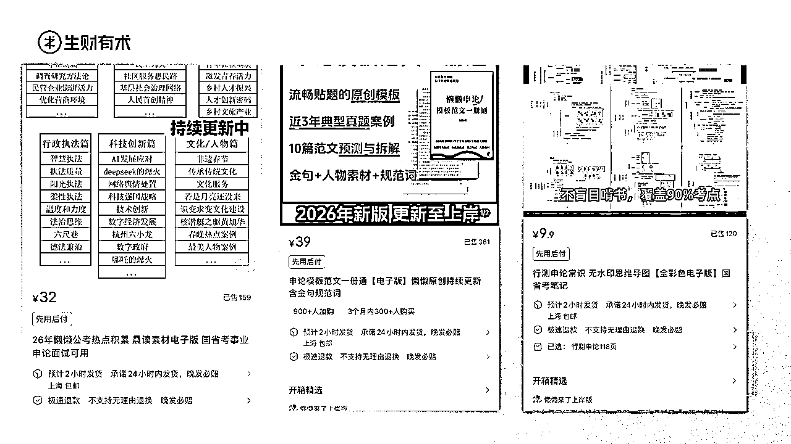

有了高价产品之后，这个产品可以无限扩展。

我再举个例子：职场。我是不是有了一个"我如何进入大厂"的知识库？这是一个大的商品。

我该怎么切分呢？我要进入大厂，我需要做什么？第一件事我是不是要投简历？我是不是可以从我的知识库里再拆出大厂简历模板？这又是一个产品。

我还能拆出什么？我还能拆出大厂面试题，这又是一个产品。我还能拆出大厂面试指南——如何准备面试，这是第三个产品。

这三个产品不重要，这三个产品你获得了什么？你获得的是前端的收入和后端的客资。你获得了客资，加了他的微信，是不是可以做高转化，转化你的陪考服务？

这就是一套完整的体系——结构化。有一个All in One的知识库，每个人都可以有知识库。第二个就是结构化拆分——不断地拆。

## 第三个核心：学会搜索很重要

大家平时会不会在小红书调研？如果你要调研虚拟产品，你会搜什么？

很多人有太专业的视角了。K12大家都知道，这个赛道很火。假如说我要做K12的生意，我会在小红书搜K12吗？K12是专业人搜的，家长会搜K12吗？家长不会搜K12。

家长会搜什么？小升初、幼儿园大班、孩子吵架怎么办——这些非常具体的场景。

我们要搜虚拟产品，我要搜什么？虚拟产品有形式+场景。首先是形式：在小红书上通用的表达形式。

知识库是不是虚拟产品的一个形式？模板是不是虚拟产品的一个形式？PPT是不是虚拟产品的一个形式？

后面我给大家一个我做的虚拟产品案例库。这个虚拟产品案例库结合国内跟海外的虚拟产品。因为我现在也在做海外的虚拟产品，1:7的汇率，所以做海外很重要。

我刚刚讲的形式：模板、PDF、攻略、指南——万物皆可指南。大家去搜指南：谈恋爱指南、约会指南、社会化指南、送礼指南、体制内生存指南、大厂生存指南，各种指南都有，还卖得很好。

我跟大家讲一个逻辑：30分教20分，10分教0分。有个实习生写了一个"我如何在大厂度过实习"的实习指南，细节到我怎么给mentor订奶茶这种事都写上去了。在小红书卖了2000多单。

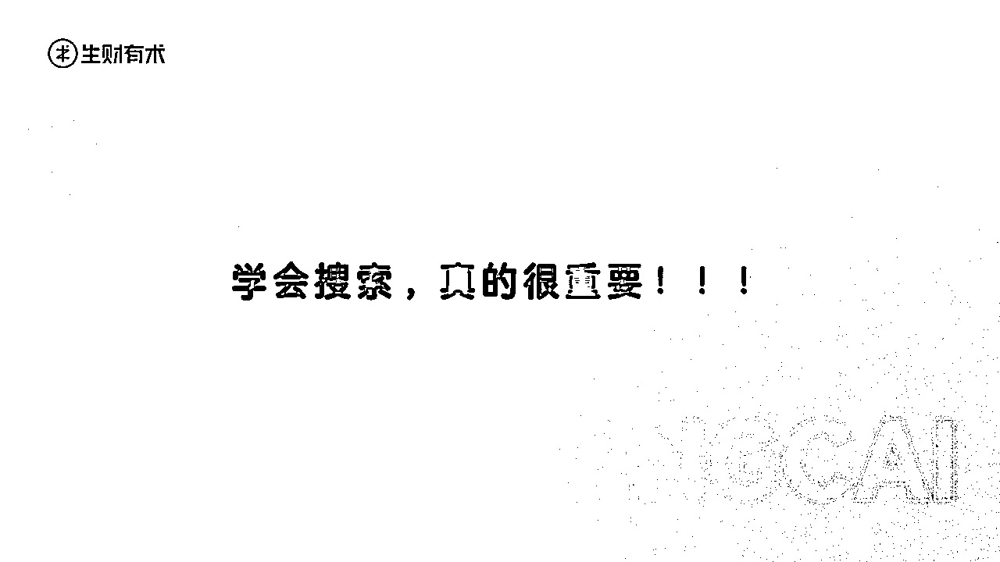

我感觉中国是一个巨大的知识付费市场。

为什么叫飞书呢？因为飞书有个东西做得最好：飞书多维表格，卖得特别好。还有notion，notion是做智库的一个东西。做海外虚拟产品一定要做notion。

教师素材库、苹果快捷指令卖得特别火——就是苹果的一个记账功能，在小红书卖得巨好。

多看多刷多看——我平均每天在小红书上大概6-7个小时，有时候看完会看吐那种，真的看吐那种，就是多看。

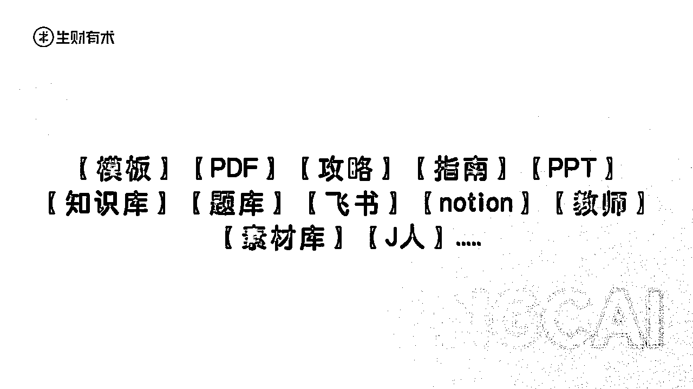

### 找到让你感叹"这也能赚钱"的案例

我想写"这他妈也能赚钱的案例"，但觉得骂人不好，所以替掉了。但大家记住我的语气：让你感觉"这样能赚钱？我靠！"你就把它记下来，把它研究透。

我当时刷到一个谈恋爱攻略，"这玩意也能赚钱？"然后看他写得不只学会谈恋爱，他还写了如何见父母，他把这条链路都写了。他把恋爱从约会到见家长都齐了，钱都要赚。

### 卖期末评语的神奇案例

卖期末评语。如果我不是老师，我根本想不到这个场景。

卖期末评语卖了将近13万，一个人卖了将近13万！期末评语这个事居然能卖钱！10元卖了1.3万单，期末评语多款可选。

为什么呢？后来我想：小红书卖的是什么？卖的是场景，不是产品。

期末评语在闲鱼、在淘宝根本卖不出去，大家都奔着目的来的。但在小红书能卖8.9元，卖1.3万单。

我是不是有1.3万的老师客户？我是不是可以卖下一波？每年都不一样，为什么每年都不一样？

老师这个场景我一直想研究，但我研究不懂。但我觉得里面有很多机会，特别相信他们能够赚很多钱。

我为什么说他这个东西能卖很多次？我为什么说他一年不能只赚13万？

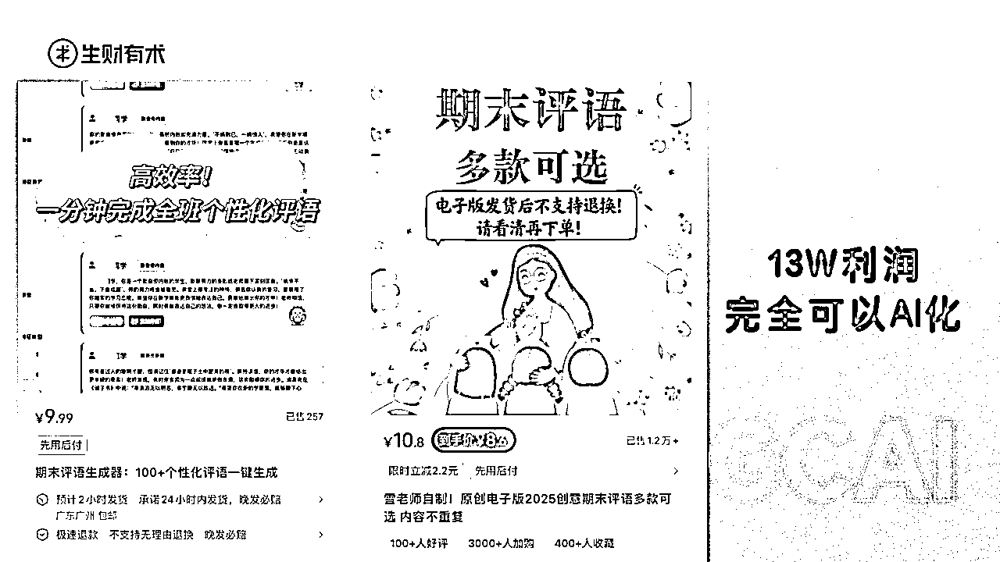

小学生是不是有开学？每个假期开学大家都要上第一堂课——开学第一课。开学第一课他还能卖两遍。

我们拿今年举例：今年年初最火的动漫是哪吒。哪吒主题的开学第一课，你在春天开学的时候，能卖得巨好。

那么马上要秋天，大家又要开学了，我还要做开学第一课，我卖哪吒能卖得出去吗？卖不出去。我们可以卖什么主题？大家最近看没看电影《浪浪山》？浪浪山主题开学第一课，又卖出去那么多。

所以你会做PPT，且你又有教师场景，副业就够你赚了，真的副业就够你赚。

小红书卖的是场景，不是产品。

### 万物皆可AI的教师场景

我们刚刚又讲万物皆可AI。每个行业都会有AI这个东西。

我跟大家讲，我们讲这个场景不用24小时，今天的主题是24小时在小红书搞定虚拟产品——这个不用24小时。这个期末评语生成器半小时都不到我就能把它做出来，因为功能很简单：我只需要输入学生以及我对学生的期待，然后就能够批量生成评语。

而且甚至都不用做智能体，通过大模型都能够解决。也就回到我刚刚说的那句话：所有文字类的内容都能够通过大模型去解决，不用编程什么的。所有文字类内容在小红书特别火。

接下来我会给大家重点分享如何通过AI去做原创的虚拟产品。

你说这个更像AI代写？首先我跟大家讲：不管你要做什么东西，这确实是AI代写。你可以理解为把AI代写变产品化。

从你的角度来讲，我还可以做什么？这个AI代写+教师，我是不是还可以做教案？我是不是还可以写演讲稿？PPT文稿？

所以每个需求都可以去产品化。大家想想你们工作中有什么可以去市场化。

我再举个例子：语文老师最重要的一件事是什么？他在给学生批改作业，他改的最重要的是作文。AI跟作文能不能结合？在小红书上卖AI作文批改，卖了2万多单，一个月还是一年？这个生意很好！

你懂很重要，当然你也得懂场景化。

* * *

其实接下来我给大家讲的就是"普通人没有优势，怎么在小红书上赚钱"。为什么这么说？因为我在做一个特别喜欢造词的项目——面试题赛道。

面试题赛道在小红书上就是蓝海，今天给大家说个实话，大家不要外传。因为马上就要秋招了，你要做面试题，通过AI去做原创面试题，一个月副业拿到1万到2万的收入很正常，只要你执行力到位。

## 第一个核心：选品比执行更重要

选品篇很重要，大家是不是很多人卡在选品？"我要做小红书虚拟产品，我觉得这个品好，但我怎么选品呢？"

传统的选品逻辑是什么？销量越高，我就选择这个品。其实这不是最正确的。

比如K12领域，你现在从K12领域你觉得你能拿到大收益吗？不能，而且K12现在疯狂内卷，连生财有术都没有K12了，都没有教育类了。

所以大家选品的本质是找到适合你的宝藏赛道。

底层方法论是什么？今天毫无保留分享给大家：选品很重要，构建自己生意的概念。我们今天的主题不要忘了——24小时构建你自己的生意。包括今天下午也会有一个小作业让你去构建。

什么是线下的意义？就是在一个固定的场域里发挥你的全部潜能，贡献自己生意，找到买家，匹配买家的需求。

问题来了：怎么找到买家，怎么选品？

### 选品核心原则：选品公式

大家记住核心原则叫做"选品公式"："不要单纯看销量，不要进入一个赢家通吃的赛道"。

什么是赢家通吃？就是这个赛道对于新手来讲没有机会了。

大家听说过一个俗语叫"浑水摸鱼"？浑水才能摸鱼，浑水是什么？是在这个赛道没有成型，没有成方法论之前，你进去才能赚到钱。

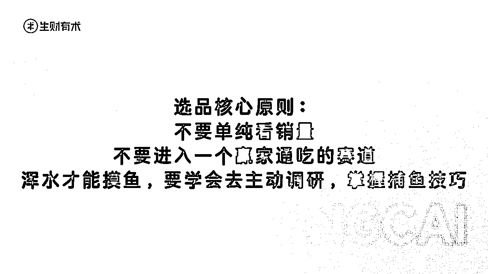

包括现在已经有什么成型的赛道？K12赛道已经成型了，你能赚到钱吗？不能。面试题赛道成型了吗？没有人讲面试题赛道方法论。大家当处于这个阶段的时候，其实是能够赚到钱的。

今天我给大家分享一个赛道叫做"垂类英语"。垂类英语也是我起的名，还有一个叫做"YouTube set"。我今天给大家讲这三个赛道。浑水能摸鱼，就是这个水浑它就能摸鱼。

### 真正有价值的干货在哪里？

再给大家分享一个经验：真正有价值的干货，一定不会通过文章的形式呈现，大家认同吗？

真正有价值的干货一定是碎片化的，一定是一段话或者一个核心洞察。比如在某个社群里，在某个付费社群里，他可能会呈现；在小范围的圈内他可能呈现。所以真正的干货就是在咱们这个固定的场域下，可能就有真正的干货。

浑水要摸鱼，要主动去掌握捕鱼技巧——不是摸鱼，是捕鱼技巧。

## 第二个核心：小红书最新选品方法

这篇文章我其实发到生财了，但好像没有多少人关注，才70多个点赞。"8月选品最新方法"，这是我发现的。

大家如果你们没有这个功能，一定要更新到最新版小红书。第一，你可以看到店铺的注册时间；第二，你可以看到新品的上新时间。

大家看到没？7月4号上新这个品卖了1062单，一个月卖了1000多单，是不是可以证明它是当下最热的品？英语漫画，同意吗？

"虚拟定制资料词汇量暴涨"，这个东西大家知道怎么找吗？第一，大家想到什么？是不是闲鱼？闲鱼可以找，但我一会儿会告诉大家一个非常牛的选品网站，真正让大家掌握货源。

### 具体案例分析

第一个是"词汇量暴涨"，这个7.99元卖了1062单，7月4号上新，也就是说他一个多月卖了8000多元，这是我以前截的图。

然后7月31号卖了这个东西，他卖了121单，对于他来讲也是一个非常爆的品。这个用户开店时长44天，我们也可以看到开店时间，他的商品卖得都很好，也就是说他一个月就卖了这么多钱。

他才是你们需要对标的账号，你只需要去多刷多看就行了。

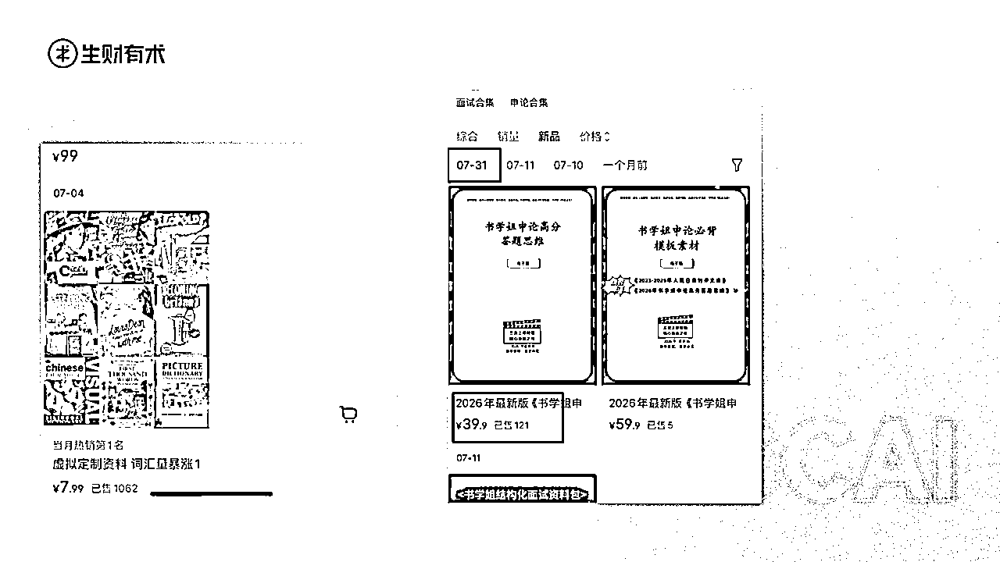

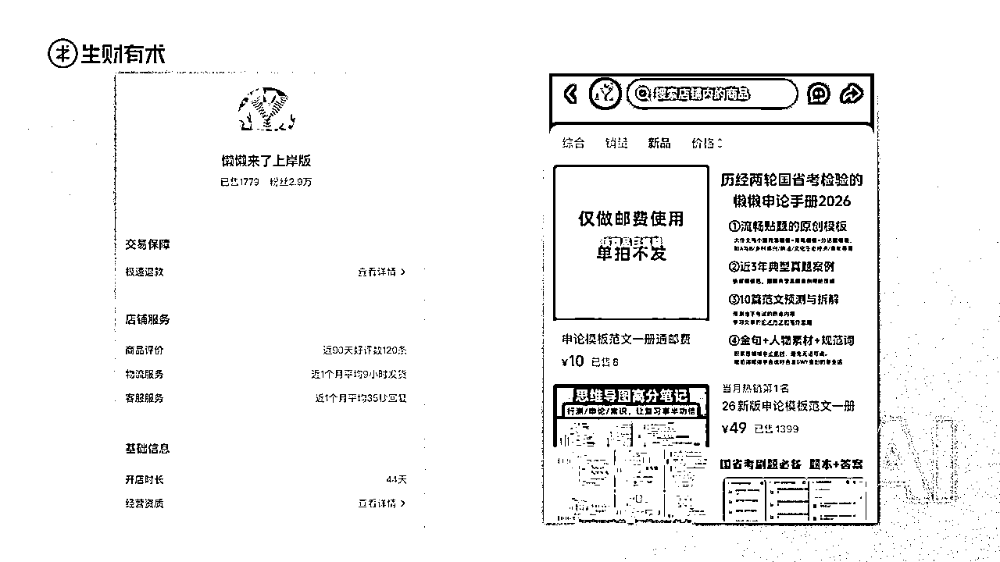

## 第三个核心：如何学习和拆解

很多圈友都会问："我找到了这些可能有价值的赛道，我该怎么更加细致地拆解和学习呢？"

### 第一步：学会定赛道

首先选品，学会定赛道。比如第一个赛道我给它定义叫做"垂类英语"，是不是垂直英语？英语的一个大类。我们不能教别人英语，我们一定要教大家更好地学习英语——这个叫垂类英语。

我英语一般，我只是把四级过了，大家可能也差不多，甚至比我还好。那么我们能不能做这个赛道呢？我们是普通人，我们没有找到优势，我们是不是需要选品？

我首先定一个赛道，是不是叫做"垂类英语漫画"？当我有了一个模糊的想法，要进一步交叉验证，大家不要一下就冲进去。

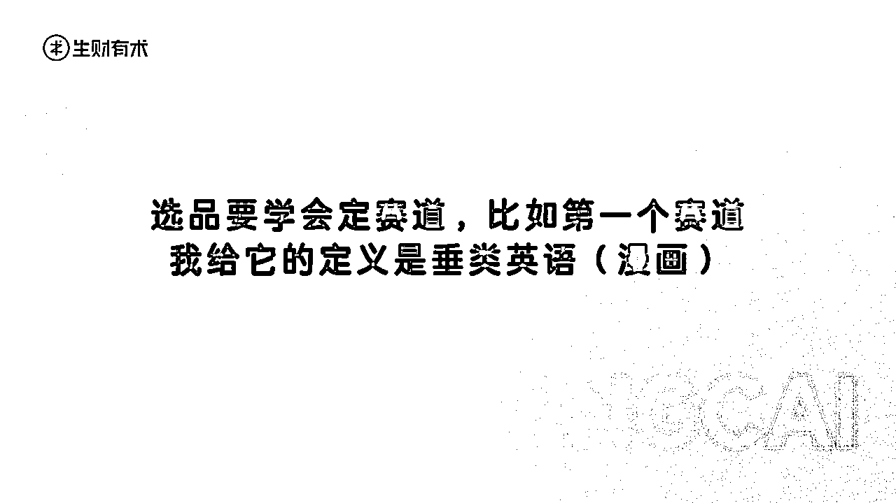

### 第二步：小红书同类搜索

小红书做同类搜索，大家现在就可以去搜"英语漫画"在小红书的销量怎么样。你们会发现很多人都在卖英语漫画，很多人都在卖热品。假如说我不说实话，我根本不知道英语漫画也能赚钱。

假如说我又觉得这个英语方法可以做，我下面是不是要找货源？货源很多人第一个想到什么？是不是闲鱼？

思考如何开发去做创新两个点：第一个货源，第二个创新。

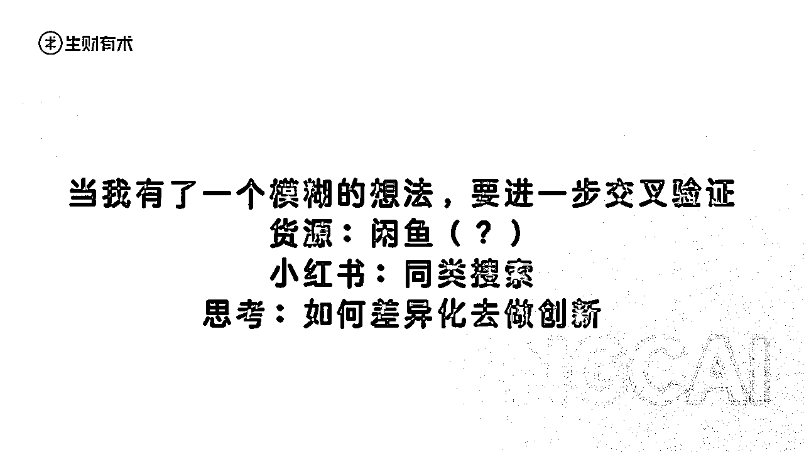

### 第三步：思考差异化

大家一定要思考：我不能跟别人卖同样东西，我跟别人卖同样东西，只能陷入低价的内卷。像K12从69.9元到0.99元，这个东西你就发现销量高其实不赚钱的。

思考如何开拓和创新。

看这个英语漫画，都是卖原版漫画的。货源呢？看了吗？1.28元。英语漫画这都是货源。这个是我的一个思考逻辑，大家能看懂吗？

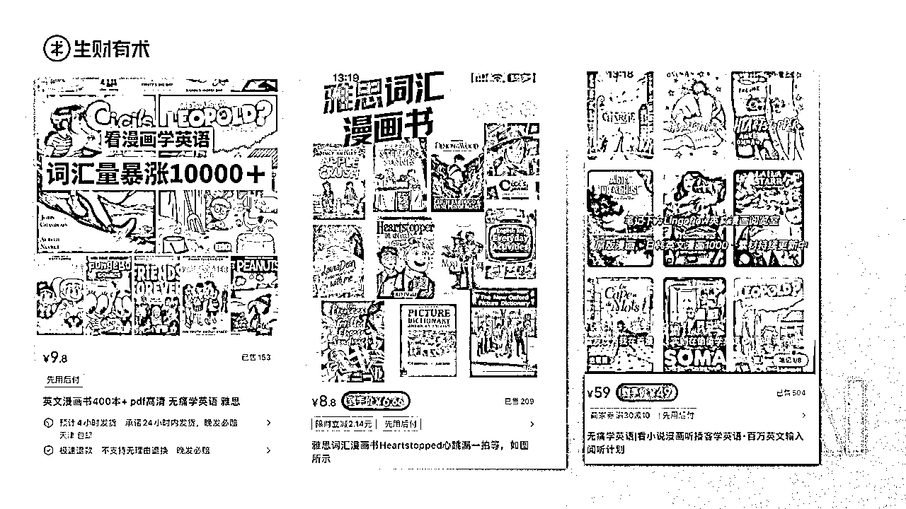

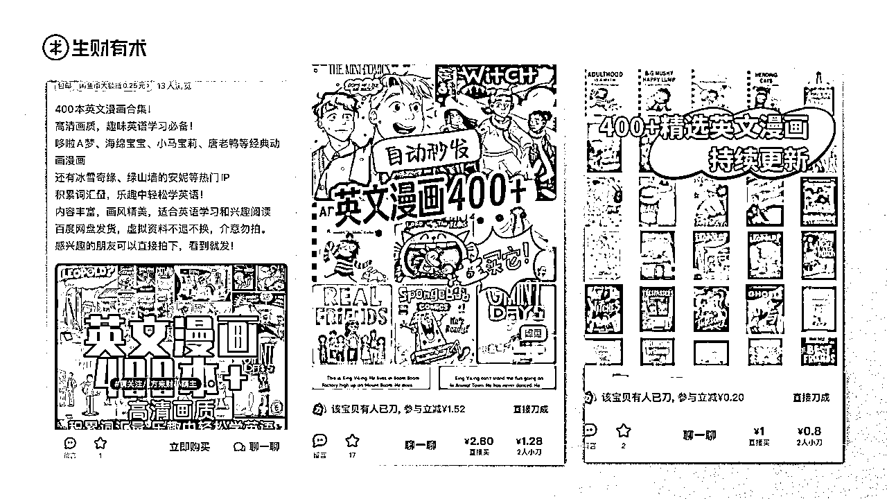

## 第四个核心：英语漫画背后的商业逻辑

英语漫画它是不是情景背单词？传统的背单词逻辑是什么？拿着一本单词书背，放弃，把单词书合上——这是我们传统背诵的方法，背不进去。

他其实为什么能火？"情景背单词"，大家能懂我意思吧？

情景背单词，每个年龄段都有自己情景背单词的课题。学英语是东亚人一辈子的课题，那么背单词也是我们的课题。

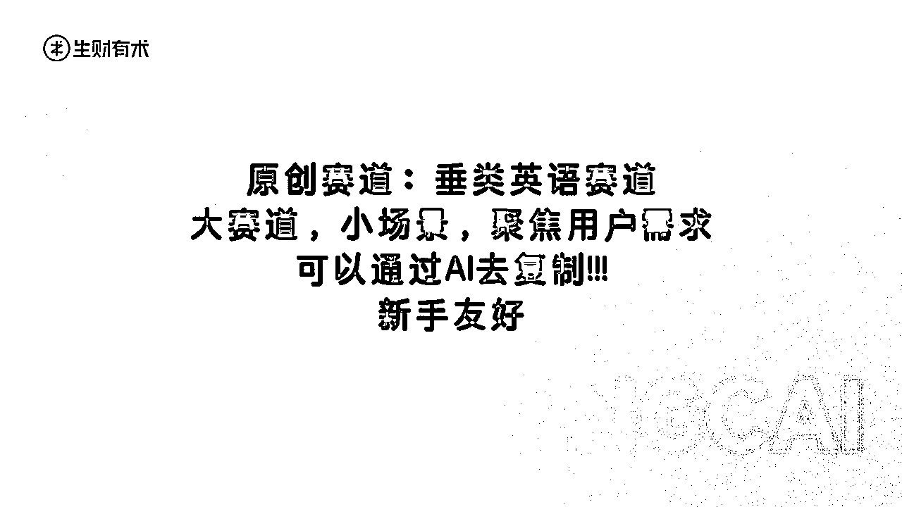

我们的课题什么意思？我们高中是不是有高中3500词汇？四级是不是有四级的词汇？六级是不是有六级的词汇？雅思是不是有雅思的词汇量？我是不是可以更加有针对性地选品？大家能懂我这个逻辑吗？

往上想：英语漫画为什么卖得这么好呢？多问自己为什么。原来它能够让我更好地背单词，而不是从abandon开始背。不同年龄段进行背单词。

## 第五个核心：原创赛道的机会

来看原创赛道："垂类英语赛道"。大赛道小场景，聚焦用户需求，可以通过AI去复制。我跟大家讲可以通过AI去复制，这是新手友好的。

大家看垂类英语赛道，原创赛道今天公开了。这以前我们不会说的，叫垂类英语赛道。

大赛道小场景，聚焦用户需求，可以通过AI复制，新手友好。

你到底要选什么赛道？"大赛道小场景，无限付费需求"。

* * *

其实职场我刚才讲职场有什么赛道？面试题赛道。语言学习韩语、日语、英语、法语，个人成长都可以AI加持。我再给大家深入讲解这个。

我刚刚讲什么？我刚刚讲选品，但我刚刚是不是有讲"AI+小红书虚拟电商该怎么做"？

## 第一个核心：选择正确的大模型是成功的基础

首先我想问一下大家，你们平时在用什么大模型？ChatGPT？还有吗？豆包？DeepSeek？豆包、ChatGPT，就没有人用Claude了吗？有用Claude，还有用谷歌的Gemini模型。

Gemini——中国人给他叫哈基米。为什么要选择这个大模型呢？大家去闲鱼上搜，10块钱买一年，可以用2.5 pro在闲鱼上买教育的优惠券。所以大家一定要学会找到最好的资源。

因为这个东西其实如果你要用的话，从省钱角度来讲。ChatGPT你们充值多少钱？200美元？我靠，高手，这是高手，200美元相当于请了一个AI实习生。还有吗？ChatGPT 25美元、20美元是主流？

但是我告诉大家一个方法，其实这个是有方法的，就是我也听说过，后续会把这个方法发给大家。就是在尼日利亚去选择ChatGPT，ChatGPT其实50块钱就差不多能买下来，它是有个套利的过程的。

所以你在用什么大模型很重要。大模型是底座，我这里建议大家尽量少用，或者说其实国内的大模型真的比较一般，在文字表达处理上以及对提示词的理解上，它其实很一般。

为什么呢？大家有没有看过那种很长的结构化提示词，就一堆1000多字提示词？这种提示词可以去做AI的能力测试。这种提示词假如说你放DeepSeek或者放豆包，它并没有严格按照提示词的逻辑去做。而Claude跟ChatGPT它是可以的，还有Gemini，它可以严格按照"我让你做啥你做啥"，所以底层是很重要的。

### 我推荐的工具：POE

Claude我认为Claude最好，包括我一直都在用Claude，但是Claude有一个问题：封号。怎么办？我跟大家讲，我用的是POE，包括我所有的智能体都是在POE上。

大模型很重要，这就是我用的POE。POE是一个套壳平台，它集合了很多的大模型。

这个GPT-4，还有Claude，还有2.5 pro，还有什么，反正各种主流大模型都有，还有文字的、视频的都有。

给大家推荐：一切和文字相关的需求，推荐Claude和Gemini。当然很多人认为GPT也强，但是大家有没有发现GPT-4它已经变了，它在文字处理上其实并没有GPT-4好。大家有没有这种感受？

GPT-4它有点像一个冷静的理科生，并不会给你提供太多的情绪价值。但是文字的本质就是聊天，本质还是需要一些情绪价值的。所以文字的需求推荐Claude跟Gemini。

还有Claude代码能力特别强，Claude code，它的代码能力特别强。

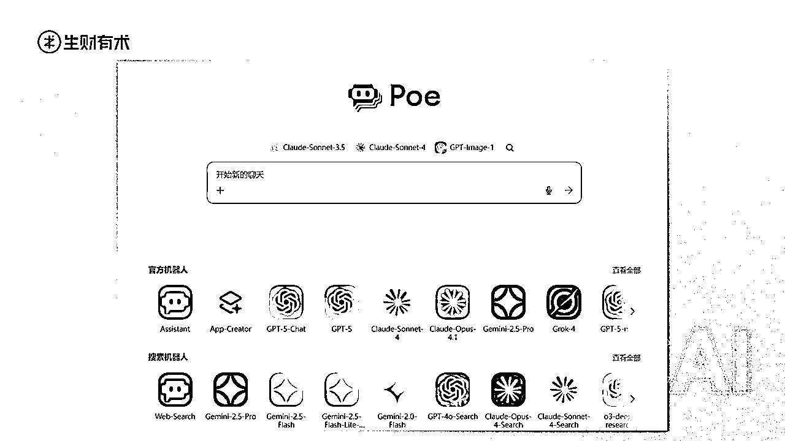

## 第二个核心：分布式提问——我的原创方法论

今天给大家一个重点，是我对大模型的理解："对大模型提问不要All in One"。我们刚刚讲你可以All in One一个知识库，但对大模型提问不要All in One。

大家能看懂这个逻辑吗？

首先大家有没有这样的感觉：你让AI一次性输出一个东西，它能够出来。但是你读起来就是没有那个味儿，没有那种很专业的感觉，没有那种醍醐灌顶，没有那种当头一棒的感觉？

只要给他一个复杂的提示词，他其实输出的答案是平庸的。大家有没有这种感受？这个关乎到我后面要讲的训练点。

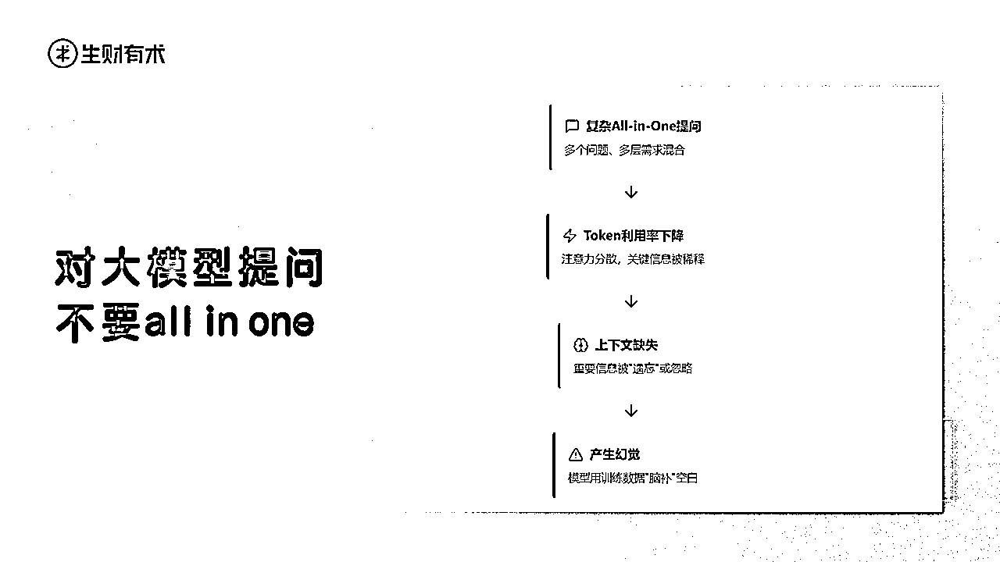

### 为什么复杂问题All in One会失败？

首先复杂问题All in One多个问题，你让他一次性干了很多事。比如说先帮我完成这个，再帮我完成那个，最后出这个。我的要求太复杂了，为什么呢？

因为Token的利用率会下降。为什么？因为Token在大模型可以理解为是大模型的货币。Token其实是有一个窗口限制的，一个大模型只能处理这种Token。你给大模型的问题，大模型思考，大模型输出，它都是消耗Token的。Token的利用率会下降，他的注意力会被分散，所以他的回答会很平庸。

大家有没有这样的感受？

接下来上下文缺失，为什么上下文缺失？你跟AI聊着聊着，AI就失忆了，他就接不上了。有没有？就是你跟AI开启一次多轮对话的时候，AI就失忆了。

大家有没有重新跟大模型聊天？为什么呢？因为大模型的上下文窗口已经接近饱和，所以AI会失忆。也就是说相当于AI出现幻觉，你这个其实就不能用了。特别是当你处理一些非常严肃需要严肃输出的工作任务的时候，上下文就有可能缺失，这很重要。

上下文缺失产生幻觉，我跟大家讲，大家有时间的时候一定要去研究一下上下文工程。

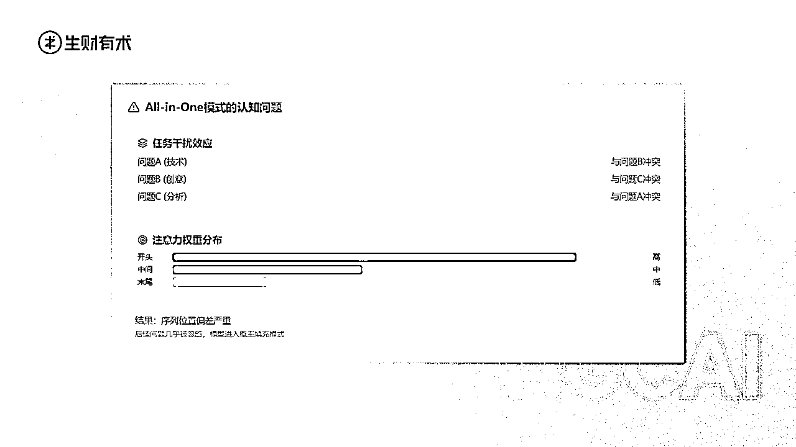

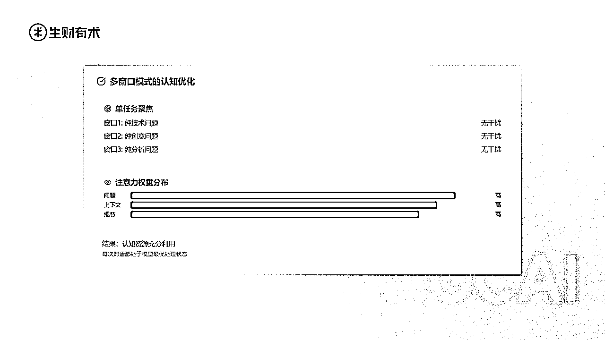

### 上下文工程：提问的艺术

大家听过上下文工程吗？上下文工程是在海外AI最火的一个概念，它现在已经超过了提示词工程师。

上下文工程是一门艺术——它是一门提问的艺术。提示词工程它只是给AI一个step by step的指令。

但是上下文工程它要包含长记忆、短记忆以及工具的调用，它是做Agent的基础。但是今天我要给大家讲上下文工程如何运用在我们真实的落地上。这个目前是没有人讲的，为什么呢？因为这个是跟业务相关的，今天给大家一次性讲透。

刚刚讲这些可能比较复杂，大家听懂了吗？

Token利用率就是不要把一个很复杂的问题去交给一个大模型去处理。尽管大模型很强，尽管大模型能够处理很强的上下文，但是对于复杂的问题，它Token的分配是均匀的。它Token的分配只能每一个都分一点。

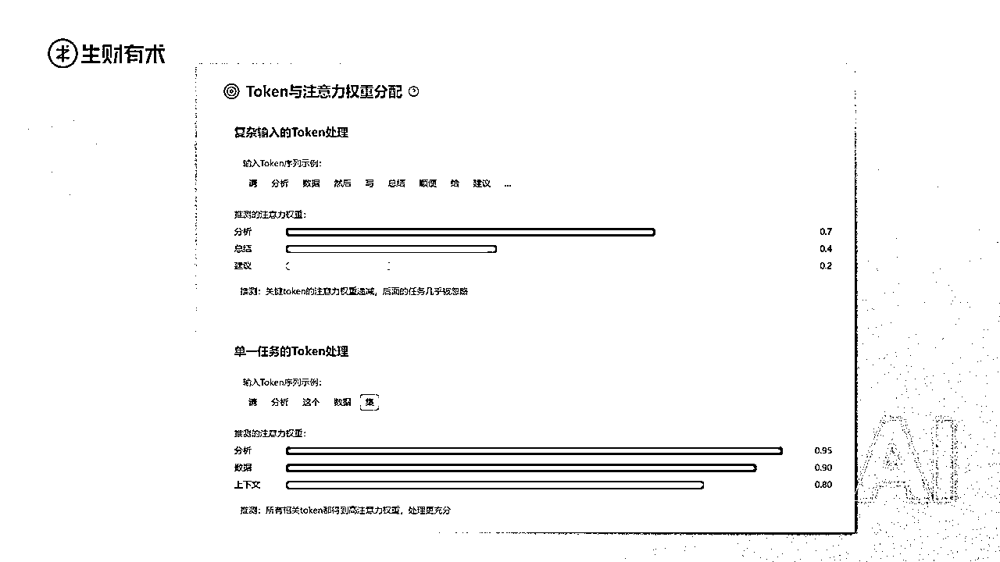

但是你需要的是一个非常精准答案的时候，就不要给他一个复杂的问题，All in One的问题。注意权重它会分配，开头、中间会不同的，任务之间也会相互干扰。

## 第三个核心：分布式提问的实操方法

我跟大家讲一个原创的概念，叫做"分布式提问"。分布式大模型提问什么意思呢？90%的问题都可以通过分布式提问去解决。我说的是文字类的需求。

首先我们要聚焦在某一个问题，这第一步其实就是相当于拆解我们的工作流。

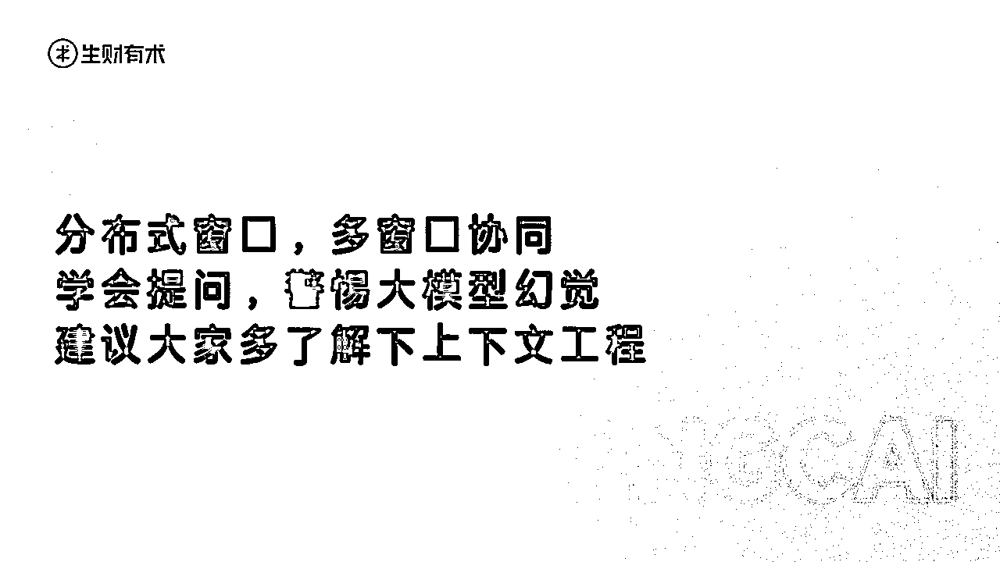

现在就给大家讲例子。假如说我们要去生成一个面试题库，这个面试题库大概2万字。按照我刚刚讲的普通人的做法，他是不是会说：

"请假如你是一名非常专业的HR，你现在需要生成一个面试题库，我的要求是巴拉巴拉巴拉，字数2万字。"

大家是不是经常看到这样的提示词？这样提示词说出来的东西，尽管他有2万字，他能用吗？他不能用。为什么？因为面试题库需要能卖出去的，他首先要做到专业。

### 面试题赛道的商业价值

大家现在去想：我如果要去做一个能够售卖的面试题，我到底该怎么做？面试题在小红书很火，后面会给大家更加详细讲解。

大家现在可以去搜一个账号叫"职场密码"，职场密码开店1年251天，他卖面试题，卖了120万，非常牛。他的答案所有都是AI生成的。

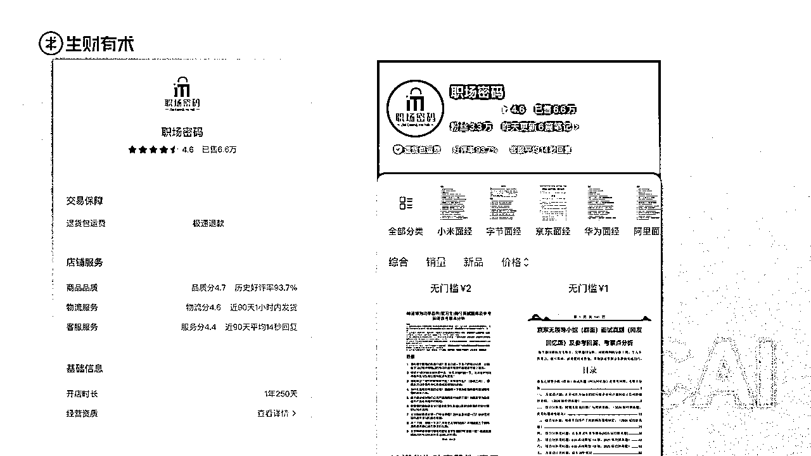

### 单任务聚焦的拆解方法

那么怎么做呢？我这里讲的"单任务聚焦"什么意思？做面试题赛道单任务聚焦什么意思？我可以把面试题当作一个项目，且拆解这个项目。大家能听懂吗？

把面试题看成一个项目，且我要拆解这个项目。我要做面试题项目我该怎么做？首先我不是要生成面试题。

首先我要拆面试题，那么面试题项目怎么拆呢？第一步我是不是要找到面试题？这是我的第一步，Step One。我们的业务流第一步找到面试题。

第二步是什么？大家可以去看职场密码那个号，它的每个产品就是这样的逻辑。找到面试题第一步，第二步是不是生成面试题答案？第三步是不是把这些东西整理到一个飞书文档里？

那么我是不是从我的第一个思路开始？我是不是有三个窗口，分为三步？是不是可以打开三个大模型窗口？窗口一生成面试题，窗口二生成面试题答案，窗口三整理文档？

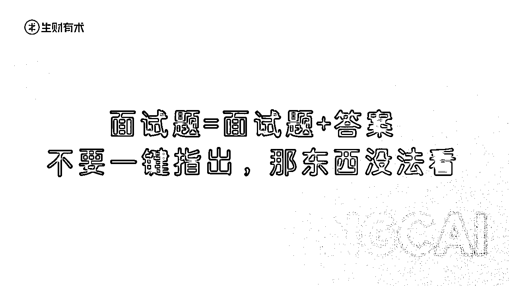

但是大家可以去看职场密码这个号，它的一个产品大概有20道到50道面试题。假如说我在窗口一次性生成20道面试题，大家觉得能用吗？不能用。

为什么？因为还是我刚刚说的，他太平庸了。因为Token的利用是有限度的。

假如说我要把Token全部分配给这20道面试题的时候，每一道都会很平庸。我是怎么做的？大家听好我是怎么做的。

其实咱们回过来看这个重点：Token注意力权重分配的问题。这就是我刚才讲的，假如说你输入的问题是"请分析数据，然后写总结，顺便给建议"——三个任务：分析一个任务，总结一个任务，建议一个任务。

所以Token的注意力权重就会衰减，后面的任务他就会敷衍，就交差给你得了。他不会去深入地做这件事。

单一任务的处理：分析拉满，数据拉满，总结拉满。也就是说单一的任务你就可以通过智能体，通过大模型就能够拿到一个很好的结果。这个逻辑大家一定要懂，这就是分布式窗口多窗口操作。

## 第一个核心：学会提问，警惕大模型幻觉

学会提问，警惕大模型幻觉。大模型幻觉真的太可怕了，有时候我跟AI聊天，聊着聊着他就忘了我之前聊了什么，既浪费时间又浪费Token。所以大家要学会提问，警惕大模型幻觉。

建议大家多了解一下上下文工程。建议大家怎么了解呢？首先微信有很多上下文工程的文章，小红书也有，小红书是一个学习很好的平台。还有YouTube，我平时看AI的时候，在YouTube上看，YouTube都是一线AI大牛去解读，比如N8N，YouTube上有很多，还有Claude的，也可以看到相关内容。

我就问大家个问题，咱们来重点了。大家认为虚拟产品下单的因素是什么？我要买一个虚拟产品，我下单的第一个因素是什么？大家想一想。

解决焦虑？解决问题？还有吗？价格？有用？心安慰？这都是一点。

但是我跟大家讲，在小红书卖低价并不是一个好生意，在小红书可以卖高价。有些人看到低价就不会买，认为你从网上搬运。

我告诉大家，我观察到的：字多是优势。大家认同吗？字多是优势，就是所有虚拟产品文字类的，字多都是优势。

面试题我生成了3万字，我卖你15.9元你还能说我什么？我3万字都给你了，我15.9元你还能说我什么？字多是优势，尽管我写得很垃圾，字多等于大模型的多次生成。大家能听懂我意思吗？

### 多次生成的核心逻辑

假如说我在做面试题的例子，一个面试题库2万字。那么我每一次生成3000字，我生成7次就是2万字。

所以大家一定要想：要让AI去生成单个非常精华的内容，一定是让他疯狂就一个问题疯狂输出，然后多次输出。当你一个提示词调优之后，多次输出就可以了。不要一次不要一键直出。

大家看没看过"DeepSeek+豆包表格=500篇小红书笔记"？你在看的时候，其实你会发现都不能用，一个都不能用。为什么一个都不能用呢？它生成得太多了，并不是说它生成太多，而是说他们对结果物的定义不同。

### 纯AI圈VS市场化的区别

纯AI圈，他们对结果物的定义是什么？他们从来不考虑市场化，他们对结果的定义是"我把这个任务完成了就行了"。比如说我生成500篇就完成了。

但是我对结果的定义是：这个东西生成之后，它必须得经过市场去检验。大家能听懂我的意思吗？

### 盲测：检验AI内容质量的方法

以前我用AI做小红书内容，我第一件事是什么？第一件事不是去发，第一件事是去做盲测。

大家知道什么是盲测吗？我把A内容和B内容同时发给几个人，让他去帮我判断A是AI生成的还是B是AI生成的。

假如说有超过一半的人认为我这个AI生成内容不是AI生成的，那么他其实就已经真正实现了内容平权。大家能听懂吗？

所以大家可以采取这个方法，让AI生成内容之后去做盲测。所以我平时特别喜欢去做提示词调优，去挑战各类内容。

## 第二个核心：AI+小红书的变现能力

现在不是垂直小号吗？大家看到航海最火的，其实我在很久之前，AI+公众号已经能够完成推荐流量的获取。

三月份的时候我已经能通过AI做小红书。我今天介绍了三个月做成纯AI赚钱的账号，就是用小红书发现了我的其他业务：他发笔记AI帮我发，笔记AI做虚拟产品，然后我来发货。

但问题就卡在这儿，因为我发货不及时，那个手机还老关机。结果就导致我经常没有办法去及时发货，从而导致经常被扣钱。这个手机你看还开不了机，不是开不了机，是我经常忘充电了。所以那个号就是我的试验号。

AI我跟大家可以打个强心针：AI是能够帮助你完成小红书内容创作、公众号内容创作、脚本内容创作，且能够拿到大流量的很好工具。

但是大家一定要学会提问，学会提问很重要。怎么学会提问呢？大家想知道如何通过AI去做笔记，它的胜负手是什么？我们下午压轴时候会讲，所以大家一定要听到最后。

我刚刚讲的大家听懂了：字多是优势，字多等于AI大模型的多次生成。大模型的上下文是有容量的，一旦超出就会有幻觉，这就是上下文工程。这个不展开，太技术了。

我刚刚讲的这些也是我昨天学的，然后我就践行了张三老师讲的"Learn in Public"，输出就是我给大家输出了。所以大家在听完今天之后一定也要输出，一定要学会写作，学会表达，很重要。

## 第三个核心：面试题赛道的商业价值

我看到一个案例，我跟大家讲这个"职场密码"，6.6万已经售出，6.6万份已经售出。我当时就觉得我靠他太牛了，他是怎么找到这么多面试真题的？

开店一年250天，已售6.6万单。假如说他的客单价按照20元来算的话，130多万。他是矩阵号，130多万矩阵号。

"考查点和参考答案使用职场密码智能面试场景合成算法生成，仅供参考，请勿完全照搬"。他说明什么？他说明他的答案是AI生成的。大家看到没？

他这个答案是AI生成的，并不是说很多人都卡在原创这一点。就是说"我必须得是这个专业的人我才能去做这个面试题"。

不是这样的，同学们不是这样的，AI就可以生成。大家去看的不是真题，大家看的就是思路和安全感。

所以大家可以复现这个项目，以及为什么我要强调这个项目：现在是8月份，9月份是秋招，9月份是秋招，稳稳的需求。

### 实操建议

这类产品上线的话，一定要写"算法生成"，你就写标题就行了。大家想做就直接搜面试题。

假如说有人质疑，我们要关注自己的核心动作，我们的核心工作是赚钱，而不是去处理这些纠纷。因为9.9元的东西，你们生成这么多心力干嘛？而且平台大概率是帮你的，你何不直接给他退呢？直接给他退的话，你就关注于你的核心动作就行了。

因为整个平台是有很多白嫖的，特别是虚拟产品。这种AI生成类的东西，现在有没有限制的趋势？我没说他是AI生成，它就不是AI生成的，可以检测不出来。

而且今天我会给大家分享如何通过AI写小红书笔记，没有AI味。大多数写AI小红书笔记，它是不会用提示词技巧。提示词有技巧，叫做Few Shot。Few Shot叫少量示例提示，这是顶级的提示词技巧。

但很多人写提示词怎么写的呢？"假如说你是一名资深的小红书创作者，请基于以下主题写一篇笔记，且不要有AI味。"跟大家讲这样提示词一点用也没有。因为AI跟AI什么是AI味它是没有办法达成共识的。

我能够一眼看出他这个文案是不是AI生成的，取决于一个关键点：假如说他开头就写"姐妹们"，绝对80%AI生成。因为现在小红书的内容，其实已经不说"姐妹们"了。大家现在谁看"姐妹们""谁懂"这都是以前的内容语料库了。所以AI它是滞后的。

## 第四个核心：面试题项目完整复现

好，我给大家讲为什么说这是普通人非常好做的项目呢？这是一个完全零基础的人，拿了我的整个SOP去做的。这个SOP我卖了4000元，但他现在已经赚回来了。我今天免费跟大家分享，包括一对一演示，包括我这个POE的账号，我都会后续都可以发给大家。

大家看，为什么我说他一定会稳定月入过万呢？大家看这个时间周期：8月10号到8月16号，这是秋招高峰期吗？这不是秋招高峰期。

他的订单量是多少？86单，他现在每天出单金额在300到400之间。8月13号单日413元，而且大家注意：而且他是做副业，同学们他是做副业，他就能拿到这个结果。

所以我说9月到10月预估，假如说副业的话，预计1万到2万肯定是有的。副业收入每天1小时。

我问过他，他每天1小时，他每天只完成一个核心动作：上一个品，发三篇笔记。小红书吃的是搜索流量，上一个品发三篇笔记，一个月就是30个品，然后三篇笔记的话就是90篇。

然后我说你可以上虚假产品，他说我胆小。大家一定要想，因为我能理解他。因为很多人可能比较着急，小红书用户特别着急，有时候特别着急下单1秒钟，第2秒说什么时候发货。假如说第3秒没回复，第4秒他退款，就特别着急。

我现在佛系了，因为现在比较喜欢骑车。我说我去骑车了，然后大家就下单了，而且不催发货就行了。所以不同的消费者他们内心的感受是不一样的。

这个项目就直接教给大家，然后今天还会给大家另外一个项目。

### Few Shot提示词技巧

所以顶级对标就是提示词工程。我刚才讲的上下文工程。第一个就是你要给他一个顶级对标，也叫做少样本提示。这个在谷歌发的提示词白皮书里就写着：Few Shot Prompt。

首先提示少样本提供对标能够减少AI幻觉，建立具体的风格参考，打破默认的输出方式，提供上下文和情感情境感。

顶级对标不只是展示写作技巧，更重要的传达了在什么情况下，为什么受众用什么方式来表达这种情感，是减少机械化表达的关键。人类的表达总是在具体的情感色彩，而不是抽象的信息传递质量锚定效应。

这个大家一定要注意：AI永远不知道什么是好的，AI永远不知道什么是好的，但是你给了他一个高质量的案例。

所以为什么要少样本，不是多样本？因为少样本就像我刚刚说的Token，它能够专注于这个样本。

所以少样本顶级对标，当质量锚定，AI会以此标准来调整输出，这就相当于给了他一个质量下限。什么叫好，什么叫不好？

所以我们更高阶的玩法是给他一个顶级的正面对标，然后再给他一个顶级的负面对标。所以他输出就不会太差，他不会输出得太超出你的范围，它只会在这个区间去输出。

所以给AI看一个好例子，这里顶级对标我给大家一个参考：大概就是3到5个对标，3到5个他就能够学习很好。

所以这个顶级对标可以用在虚拟产品，可以用在原创笔记，都可以。

* * *

其实大家可以听我讲，我刚刚上午提到了一个渠道，什么渠道？YouTube。"参考答案阅览室"80%的货源都来源于YouTube。所以今天下午要告诉大家如何通过YouTube去赚钱。

整个生态对于油管的重点，它是基于我们出海用AI去做视频去出海去赚美金。它其实是一个什么逻辑？其实是一个广告费的逻辑，广告分成你拿大流量，你拿分成。

但是我这个逻辑是内容的逻辑。小红书聚集了全中国最爱消费，最爱成长，最喜欢为审美、为自己成长支付溢价的一群人。所以"小红书+YouTube就是一个百万生意"。

我直接给大家看，这个展示其实也是本次行业主题之一，本次行业主题之一就是知识库。知识库也是由我带给大家去做直播。大家可能没有上我的船，但也没关系，航海手册以及我的高阶领航的直播都会放出来。大家也可以有时间看一下那几场直播。

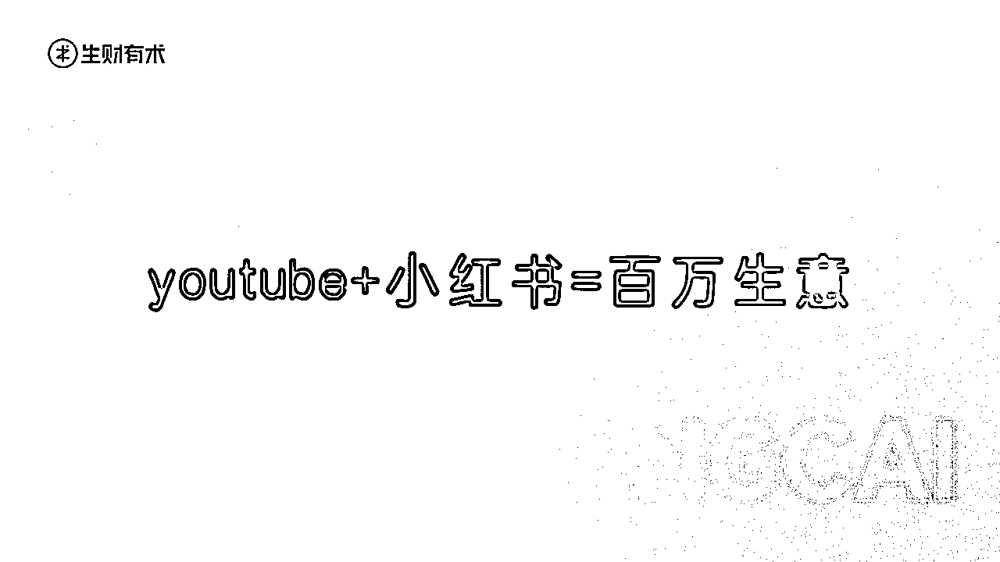

## 第一个核心概念：反向出海的商业逻辑

换个角度看YouTube，其实"反向出海"什么意思？反向出海我们出海是为了赚美金，反向出海是把海外优质的内容搬运到小红书就能够赚钱。但这里我提到了一个关键点，叫做"搬运+整理"，这个点很重要。"搬运+整理"你纯搬运是没有办法赚钱的，你纯搬运是没有办法赚钱的。

很多人都想我只是把它的内容翻译过来放在油管上能赚钱，不对。放在小红书上能赚钱吗？能赚钱，但是我要告诉你的是你一定要学会整理。

为什么？因为别人买的不是你的产品，他买的是你的整体的思路，就像"参考答案"，大家可以看它的详情页，它的详情页就是一个点，什么点？说我们的知识的选取里面，我们的阅读理念是什么？他先把理念先给打了一个心智定位，然后再告诉你我该怎么找。其实"参考答案"从来不生产知识，他也不是单纯的搬运知识，它是"搬运+整理"。比如说个人成长一堆，职场提升一堆，他其实是这样的逻辑，但是他能做，其实我们也可以做。我可以明确告诉大家，我们也可以做，就是"YouTube+小红书=百万生意"。

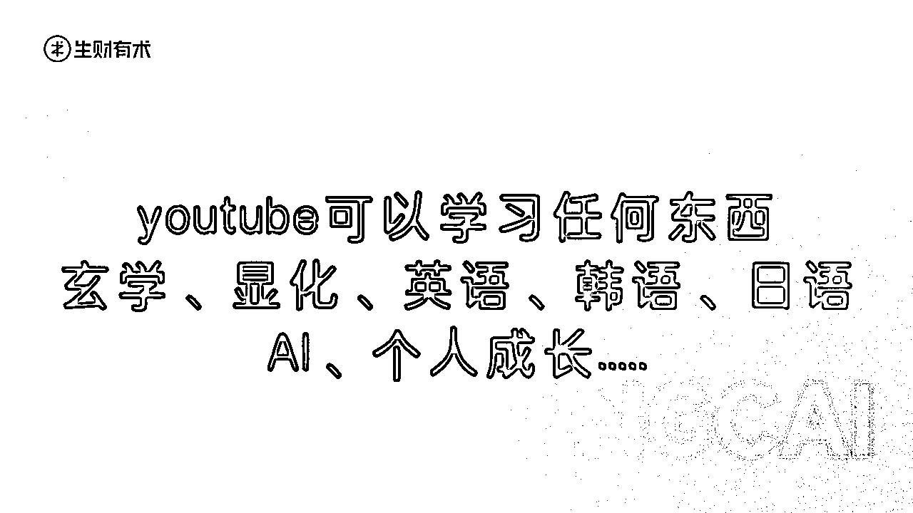

## 第二个核心：灵感来源与商业模式复制

首先我跟大家讲关于这个迷你行业的灵感来源。大家看我拿的这个，大家看这个其实就是本次方案的来源。这本书叫做《Million Dollar Weekend》，这本书什么意思？叫做"百万美金周末"。百万美金周末他讲的什么？他讲的是花一个周末去建立你的商业模式，建立一个百万美金的商业模式。这个书在油管上很火，在国外很火，搬到国内其实也有人在做。

不知道大家在小红书刷没刷到，说"24小时在小红书构建你自己的生意"，"花一个周末去梳理你的变现体系"。这些都是小红书的热门标题，而他们的来源都是来源于这个《Million Dollar Weekend》如何48小时创办一家公司。本次迷你航海也是这个核心主题，"24小时找到你的优势定位，包装你的产品，在小红书上上架并赚到钱"。当然可能大家的反馈没有来那么快，但是我希望今天结束后，大家能够去找到你的优势定位，并且把它转化为产品。

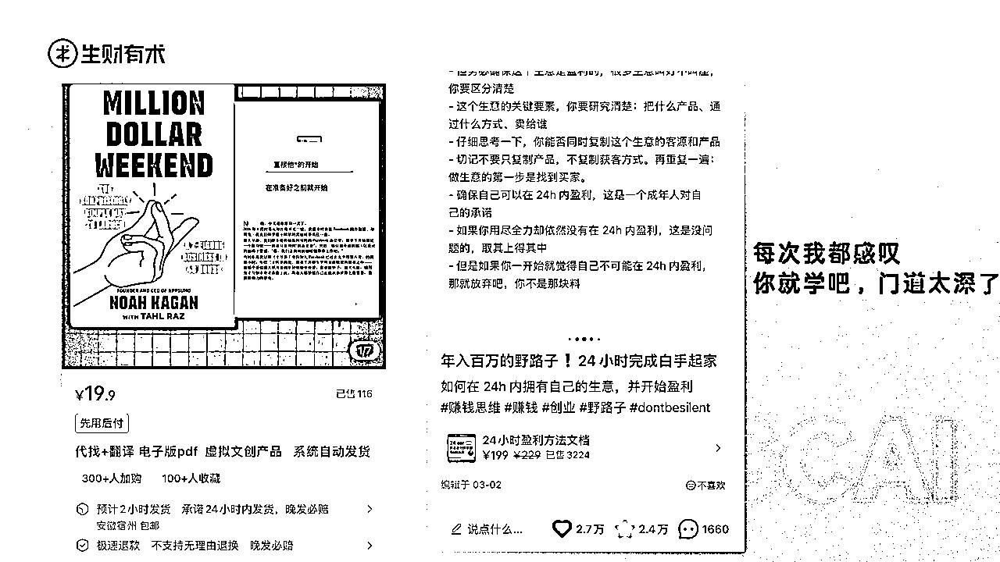

假如说没有找到你的优势定位，就看我今天给大家深度拆解的这几个项目，去上架。比如说我说的垂类英语，它就是个很好的项目，大家都可以去上架。看到没？大家看看刚刚我们是不是讲了这本书？这本书没有中文版，这本书没有中文版，就《Million Dollar Weekend》这本书没有中文版，那么它很火，国外很火，国内很火，我是不是可以直接把它搬运过来？

我可以直接把它翻译过来。大家看到了吗？这个《Million Dollar Weekend》翻译+电子版PDF虚拟文化产品116页19.9元，相当于一本书，他只是找了一本书加翻译就能够赚到钱。