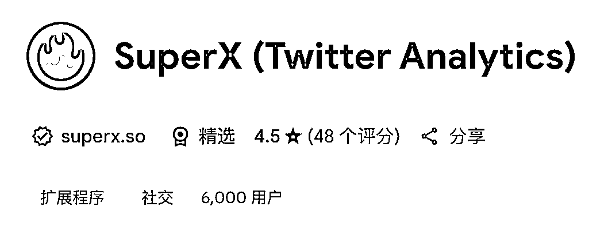

# 多平台社媒运营的核心增长策略

> 来源：[https://rwv5r1k6f2.feishu.cn/docx/S858dxMwsoGB3pxohgAcZkiwn4f](https://rwv5r1k6f2.feishu.cn/docx/S858dxMwsoGB3pxohgAcZkiwn4f)

## 5个平台同时运营的血泪经验

哈喽，各位船员大家好呀，我是Niko，最近加入了推特的航海，认识了很多优秀的小伙伴，和他们一起研究海外社媒，这个过程很折磨，但也收获了很多东西，今天来和大家一起分享过程中的一些经验和收获。

我目前同时在做推特、小红书、即刻、Reddit和公众号五个平台的运营，主打一个一鱼多吃，推特的重心在英文推，起号比较慢，没什么成果。

即刻有三条内容爆了，一条上了出海人的日常的热门，两条被官方号转发艾特，入选了每天7点的即刻小镇日报，还在即刻100多粉丝时候接到了飞书的商单，即刻粉丝直接冲到了400+。

推特的粉丝数量马上接近1000，曝光最高的一条推文展示量接近10W。

今天我想分享的是一个做内容要贯穿始终的核心——极致利他，以及围绕这个核心展开的几个具体策略。

下面的分享一共分为五个部分：大V转发策略、信息源溯源技巧、多平台差异化运营、推特起号方法论、Reddit养号实战。

## 一、大V转发：最快的起号方法

首先大V转发是最快的起号方法，需要你的内容价值高，或者利他，这一点在最近航海小伙伴取得的成绩也验证过了。我之前公众号写的一篇复盘贴，运气好被知识星球曹大转发了，他的星球有几万的用户，直接给我带来了第一波冷启动的流量。

然后就是按照手册里教的自我介绍的写法，把自己的经历包装成一个故事的形式，叠加数据，叠加转折展现给别人，告诉你的粉丝，你目前的状态，这就是他们目前想要成为什么样的人，把自己的故事写好，让别人有读下去的欲望。

再加上好多老师还有航海的教练们的助力，帮我转发了我的推文，粉丝数量直接坐火箭起飞，这个航海真的是收获满满，教练们都在为我们保驾护航。

## 二、信息源溯源：发现爆款内容的秘密

然后要分享的一个是关于信息源的问题，yangyi老师在高手领航里也说了这个点。

看到高质量的信息源要学会溯源，比如之前看到刘小排老师分享的49个顶级的claude code的Angets，我本能感觉这条发小红书可能会火，直接让GPT帮我找到了那张图的原始出处，发现是出自reddit，然后改写了一下发到了各个平台，目前这条笔记在小红书的阅读量是2500，点赞62，收藏106，我小红书的粉丝是85。

另外再说小排老师最近几天的文章，提到的Rube MCP，一个可以帮你自动化运营reddit，自动回复推特，自动回邮件，实现各种场景的自动化处理，着实是非常强大。

在亲身体验了功能之后，我做的第一件事就是溯源，发现最早的信息是8月22号，在国外的一些小众社媒平台。

养成信息溯源的习惯，慢慢的就能建立自己的高质量信息库，让自己第一时间获取到这个圈子的一手信息。

另外reddit上有很多高质量的文章，有很多独立开发和创业相关的人都会在上面分享干货，我一般看到很不错的文章的时候，都会点开这个人的主页，去把他所有的文章翻一遍，然后记录下来，保存到自己的素材库。多花时间泡在社媒上面，你的灵感和素材就会越积越多，在没时间写内容的时候，直接从素材库里面提取。

另外我会建立自己的自媒体内容来源，比如，整理好一些对标账号的社媒，reddit的子板块，通往AIGC之路，reddit和小红书前一段时间已经火了一次的内容，都可以重新找出来，作为二次加工的元素。在不知道发什么内容的时候，就会打开看看这些内容来源，刷一会，基本就有思路了。

这个阶段的核心其实就是建立系统化的内容来源体系，让灵感和素材源源不断。

## 三、多平台运营：一份内容，差异化分发

然后关于多平台的内容分发，每一个平台都有各自的特点，比如小红书是种草内容居多，以传播美好为主，需要加一些好看的标点符号，让内容更充实。即刻则注重内容质量，不支持md格式，这些平台的原始素材可以用同一份，但是分发在各个平台的时候，需要单独润色优化。

我是同时用了四个AI，然后分别观察效果，GPT，Claude，Gemini和Deepseek。效果最好的是Gemini和Deepseek，Gemini写的推文和Deepseek写的小红书，质量都比较好。

然后是推文策略，根据yangyi老师的方法论，用notion来承载数据，不断的去找爆款内容，分析，测试，回收，看哪个有效，哪个效果一般，慢慢的培养自己的网感。

## 四、推特起号：英推的极致互动策略

关于推特，中推和英推的起号逻辑完全不一样，因为我是做海外产品，目标是海外用户，国内的用户价值并不高，而且在中文圈Build in Public非常容易被抄袭，所以一开始就把重心放在英推。

中推靠圈子转发，相对比较容易把你带起来，但是英推就没有捷径可走了。在0到500粉丝阶段的策略，是以极致的互动为主，每天花大量的时间在大V的推特下面评论留言，目的是成为热评的前几名，借力他们的流量池获得曝光，每天输出10-30条高质量的评论。我现在每天都在花大量的时间在别人推文下面评论。

其实核心就是利他行为，评论："我能如何帮助你？"并提供如下选项：关注你、转发你的帖子、帮助你查看网站的SEO问题。然后需要关心那些刚刚开始的人，对只有两个粉丝的人评论，很高兴成为你的第三个粉丝。

分享一个我给别人的评论：

另外，这种方式也会让你交到很多朋友，其实，别人都很愿意帮助你，然后再分享一个刚刚和英推上的私信，还没来得及整理到飞书，我在和他请教产品的冷启动问题。

前提是你也需要给别人提供价值。比如说，我会主动帮别人分析他的产品的 SEO 问题。

这种启动方式在前期的增长虽然很慢，但是可以慢慢帮你融入他们的圈子，取得一批高质量的朋友

工具推荐： 然后分享一个插件和一个信息源，插件是superX，里面的功能很多，可以帮你分析推特的数据，查看某个用户的爆款推文。

https://readwise.io/twitter_leaderboard?thread 这个是推特高质量用户的排行榜

有这两个东西就可以把yangyi老师的方法论进行执行：

具体步骤：

1.  用推特排行榜的信息源

1.  通过 SuperX 这样的插件，查看他们最爆的前 10 推文

1.  然后用自己的话转述，最好有自己的想法，重新说一遍内容，并引起讨论

1.  重复上述步骤

## 五、Reddit养号：利他评论的威力

关于reddit养号这个事情，核心也是利他，多发表对别人真正有价值有帮助的评论。去找几个适合自己的子板块回帖，比如我是做独立开发的，就会在创业相关的社区回贴，遇到相关的问题，比如怎么找需求，怎么获取产品的第一批用户，第一个去评论，这样你的评论可以获得最大的曝光，会有几率爆，我最多是一条评论给了100多个karma值。先把comment karma涨起来，然后post karma就相对容易的多，找一些猫猫狗狗的小红书爆款帖子直接搬运就好了。

这条回复就是在刷帖的过程中顺手回的，完全没想到能爆

另外再分享一个reddit发帖踩的坑，搬运的图片，千万不要贴原创，不然被社区的人发现了会一起来骂你，别问我是怎么知道～

## 最后总结

回顾整个多平台运营的经验，我发现有几个关键点：

1.  核心理念：极致利他 - 无论是推特评论、Reddit回帖，还是内容创作，都要站在用户角度思考"我能提供什么价值"

1.  系统化运营：

*   建立内容来源体系（Reddit、对标账号、素材库）

*   使用合适的AI工具组合（Gemini写推文，DeepSeek写小红书）

*   针对不同平台特点差异化分发

1.  耐心和坚持： 英推起号没有捷径，需要每天10-30条高质量评论的极致互动

1.  工具善用： SuperX插件、推特排行榜、四个AI的组合使用

最重要的是，不要指望一夜爆红，而是要建立长期的内容体系和运营节奏。现在我的即刻已经400+粉丝，小红书单条内容2500阅读，推特粉丝接近1000，这些都是一点一滴积累的结果。

希望这些经验对各位船员有帮助，我们一起在航海路上越走越远！

最后，附上我的推特复盘帖：https://x.com/guishou_56/status/1966479001771278585

里面写了0-1000粉冷启动全流程的复盘，希望对你有帮助，欢迎你点赞，关注，回贴，我会在上面持续输出分享更多干货内容！