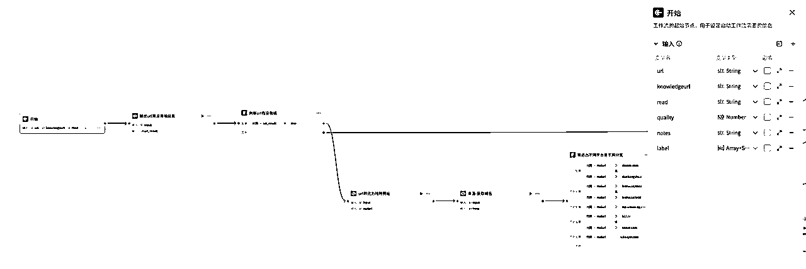
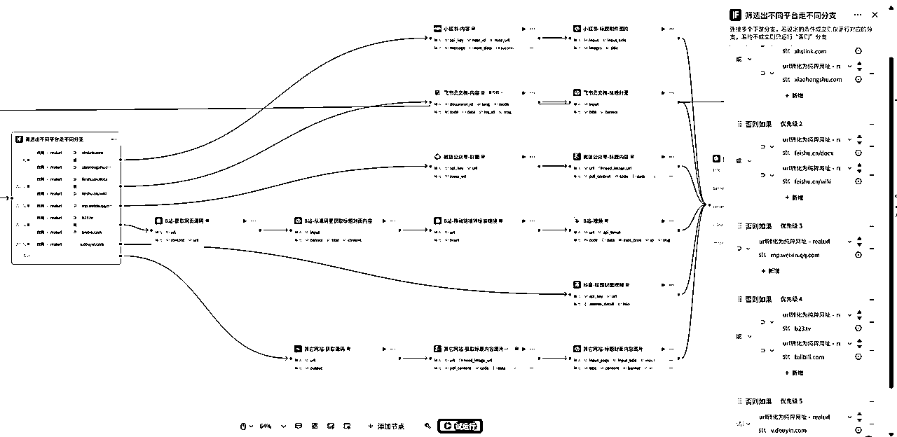
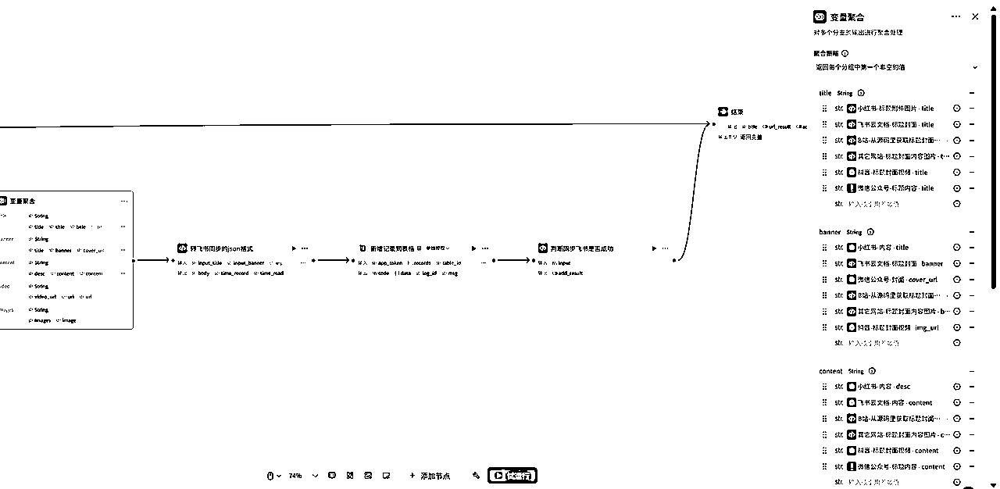
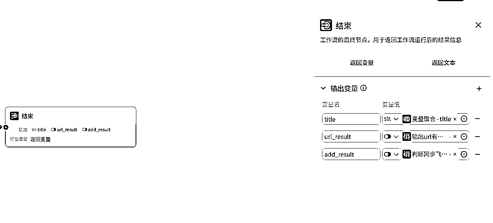

# 「勿传播」一键全网统一收藏 不外传教程

> 来源：[https://lv13e2iljbk.feishu.cn/docx/R78rdPYXUoF4mOx2bBYcEYjQnMg](https://lv13e2iljbk.feishu.cn/docx/R78rdPYXUoF4mOx2bBYcEYjQnMg)

# 碎碎念

大家好，我是「求索的木子」，全网同名，一名产品经理。

有些朋友希望了解工作流，我可以介绍下个人版的搭建方法。

希望能帮到各位，但是现成的工作流是没有的哈，授人以鱼不如授人以渔，还是要自力更生的，里面的很多小技巧相信在未来的实战中一定能帮助到你们的。

# 工作流

## 流程









以上是个人版的完整工作流，开始节点、结束节点的变量都截图出来了，搭建根据实际需要可以删除不要的变量。

考虑到稳定性，里面的一些插件我用的是收费插件，如果不在意稳定性的，可以自己更换相同功能的其他插件。

## 学会写代码

一定要记住，coze里能用代码块解决的就绝对不要用大模型，大模型准确率又低，而且费用又高，不值得。

有些圈友犯嘀咕，我不会写代码怎么办？

别怕，我教你的这个小技巧就值老多钱了。

可以让豆包、deepseek来帮我们写代码，以下是最重要的提示词部分：

```
帮我写一段代码，可以在IDE中编辑的JavaScript代码。

## 背景
有几个输入的变量
input_page，为一段网页的源码，类型为，里面包含了，比如：

<title>产品经理如何从0-1打造一款AI产品？ | 人人都是产品经理</title> 
```