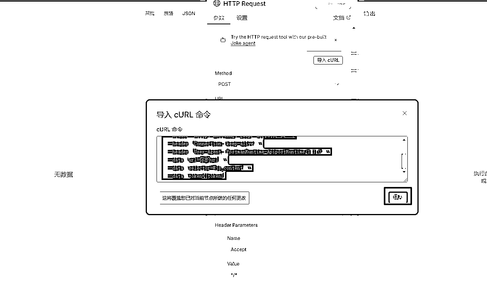
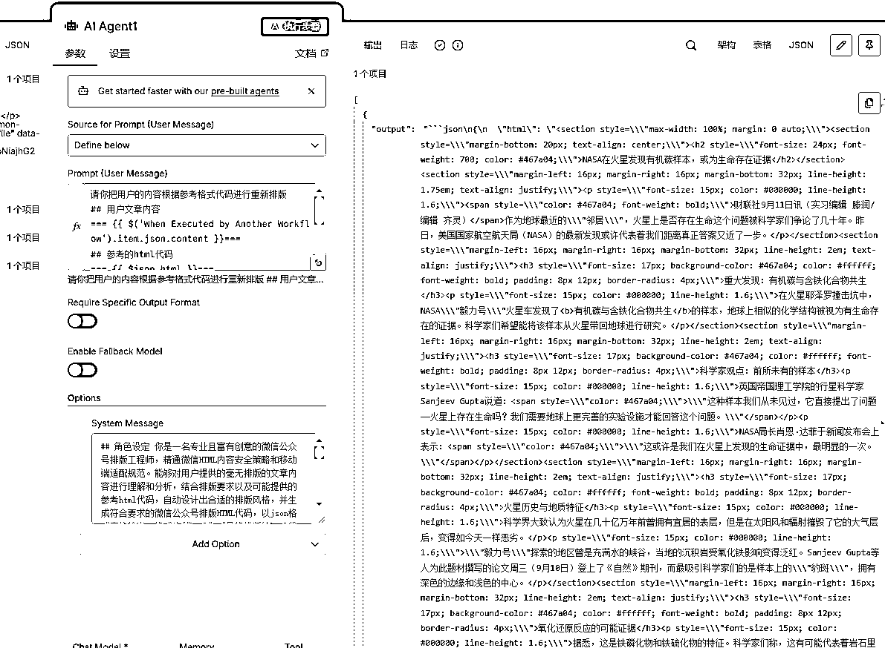

# 超详细教程又来啦：教你用n8n打造一个AI自动排版公众号的工作流

> 来源：[https://b121w2zgwyx.feishu.cn/docx/S3UfdX1Tjow9PAxGpAuc8yN1nWf](https://b121w2zgwyx.feishu.cn/docx/S3UfdX1Tjow9PAxGpAuc8yN1nWf)

上一期我给大家详细的介绍了，如何搭建一个AI生成内容并自动发布到公众号的工作流，还没有搭建的可以看这一篇内容：

内容确实是生成了，但是内容是纯文字，没有排版，不是很好看，所以，今天我将带大家打造一个n8n公众号AI排版工作流。如果你还没有完成上一篇的操作也没有关系，因为今天的工作流不依赖于之前的操作。做好以后可以单独用，也可以接入之前的工作流使用。结合上一篇工作流更佳！

根据本文实操，你可以学习到以下n8n知识点：

1、如何使用子工作流

2、如何使用if分支

3、合并分支参数技巧

# 让我们开始吧！

## 1、子工作流触发节点

首先，我们需要添加一个子工作流触发节点，我们在右边添加节点处搜索 “sub”找到 Execute Sub-workflow


接着点击进去，找到这个触发器，点击添加


这个触发节点是什么意思呢？

这个触发节点专门用于设计子工作流的，什么是子工作流？就是可以被其他工作流调用的工作流，有的时候，有些功能，可能很多工作流都会用到，为了避免重复的造轮子，我们可以提前封装公用的功能变成子工作流，后续直接引用就行了。

而子工作流必须使用这个触发节点作为开始，以接收上级工作流的参数。上级工作流则通过 Execute A Sub workflow 调用子工作流。这个我们在最后还会讲到。


好了，接下来，我们需要为子工作流设置需要的参数，双击节点,接着点击 “Add field”，然后设置我们需要的参数名称，比如：

content：需要排版的内容

url：排版参考的公众号链接


## 2、Html获取

接下来我们需要处理传入的url代码，为了让工作流更加的稳定和便捷，我希望 如果url为空或者提取公众号链接的Html代码失败的时候，可以使用默认的Html模板对内容进行排版，而且后续对这个模版进行改造，也可以做成多个不同风格排版的模板进行切换了，看大家是否有这种需求了。

所以接下来，首先引入“if”节点


我判断一下这个url是否为空，如果不为空则进行代码提取，如果为空则设置一个默认的代码


接着在url为空的分支上添加一个设置节点，设置节点搜索“set”就能找到了，到现在，工作流结构如下


接着我们设置一下如果url为空时，我们使用的默认参考代码。

那肯定有很多人就问了，代码怎么获取啊？ 很简单，随便找个公众号的编辑器，例如96编辑器这类的，找到一键排版，选择一套自己喜欢的免费的模板，接着点击 “微信复制”，其他编辑器可能不叫这个名字，但肯定都有类似的功能了，把它粘贴到我们自己的公众号


在公众号的文章编辑页面，然后按F12，或者右键 选择“审查元素” 复制文章区域的html代码，如下图所示，在右边代码中移动，当左边蓝色区域覆盖文章内容之后，右键红色框框区域，找到copy=> copy element 点击。我们需要的代码就复制好了。

你们也可以找一篇公众号文章使用同样的方法复制代码。用编辑器是为了快捷找到排版的代码。


把代码填入下面的设置中，作为我们的默认排版参考代码。


接下来我们需要处理url不为空的情况，如果url不为空，我们需要提前公众号链接指定部分的html代码，这里我需要用到一个提取代码的接口，接口需要授权，需要先申请一下账号

我们打开 https://auto.kanglan.vip/这个网站 ，没注册的注册一下，然后进入个人资料获取一下这个token


接着复制以下代码，记得将下面的{token} 替换成前面获取的token

```
curl --request POST \
  --url https://auto.kanglan.vip/cozeapi/html/getHtmlBySelector \
  --header 'Accept: */*' \
  --header 'Accept-Encoding: gzip, deflate, br' \
  --header 'Connection: keep-alive' \
  --header 'User-Agent: PostmanRuntime-ApipostRuntime/1.1.0' \
  --data 'url=你的url' \
  --data 'selector=#js_content' \
  --data 'token={token}'
```

然后我们在url不为空的分支，添加一个http请求节点，用来调用上面的接口获得html代码


我们进入节点设置，点击curl导入，把刚刚上面的代码黏贴进去，然后点击导入，记得token先替换，不然在n8n中还要修改。



然后，我们把上级节点的url传递进来，其他参数默认就可以。这里我们发现一个问题啊，因为子工作流触发节点没有地方输入参数，默认是空的，导致我们这个分支现在无法获取上级参数


为了方便测试，我们现在需要设置一下触发节点，双击进入触发节点，找到这个按钮点击之后，可以对节点的输出内容进行固定


我们填入一份默认数据用来做测试，确认没问题点保存


好了，现在回到画布，执行一下工作流，重新获取一下数据，切记！！不要单独执行我们的触发节点，因为我们设置了默认数据，单独执行会被覆盖成空的


执行成功之后，我们看到现在可以正常进入我们http请求分支了，接着我们把url的参数正确传递给接口一下


然后，点击“执行步骤”，看到获取成功，说明节点配置成功


## 3、合并html代码

现在我们需要把url为空的和不为空两种情况的html代码合并一下，方便后续的AI调用。我们还是使用“set”节点

，把if的两个分支合并进来


接着，我们按照之前的操作，去修改触发节点，分别设置url为空和不为空的情况时的上级html，拖动进来


现在这里有两个参数， $json.data.html 这个是http接口节点返回的，$json.html 是设置默认模板返回的。接下来我们使用以下表达式将这两个合并输出到html 这串代码整体的意思就是，这两个哪个有值就用哪个。

```
{{  $json?.data?.html || $json?.html }}
```

## 4、配置大模型节点

好了，现在参考的html构建完毕，可以开始AI排版了，我们需要搜索“Agent”添加一下 AI节点


大模型节点必须搭配model的节点使用，所以我们继续搜索 “open router”，把这个节点添加到Agent节点下方


接下来需要配置一下这个Openrouter，这个节点就是用于请求 Open Router这个网站大模型接口的，我们可以通过Open Router免费使用到国内外很多大模型。

## 5、申请Open Router的API Key

要使用OpenRouter节点，我们需要申请一下openRouter的API Key

openRoute官网地址：https://openrouter.ai/

我们打开这个网站，注册成功之后，找到这个地方


然后点击“创建API key”


创建成功之后，记得点这里复制，保存到自己电脑，只显示一次，后续如果忘记了，只能删除重新建。


## 6、配置Open Router

获取API Key之后，我们就可以开始配置openRouter节点了，双击进入openRouter节点，发现这里需要连接凭证才能使用，所以我们要去创建凭证


进入凭证创建后，我们看到只需要配置一个API KEY就可以了，把第5步申请的openRouter的APIKEY 填入保存就可以了


回到我们的openRouter配置这里，选择刚刚的凭证，然后在Model这里搜索一下你需要的大模型，这里我搜索“free”代表免费的模型，正式使用，建议使用付费的，因为免费的有调用频次限制1分钟只能请求一次。不过，付费的大家就得提前去充值了。


## 7、设置大模型参数

进入大模型的节点，首先，我们需要设置一下，用户提示词来源选项为“Define below”，接着我们需要添加一个系统提示词选项，用于我们设置系统提示词


然后我们分别往这两个地方，填入我们的用户提示词和系统提示词，系统提示词有点长，就不贴这里了，大家自己到我的公众号，输入关键词“AI排版提示词” 自取。大家记得提示词填入之后，需要把我们需要排版的内容和参考html参数替换进来


到这里所有节点就都搞定了，然后我们整体执行一下，成功生成排版代码



发现一个问题这个大模型数据有点混乱，不是干净的html，到时候不好用，所以我们还需要加个格式化输出的节点

我们进入Agent节点把这个开关打开


然后在新出来的分支上加上这个格式化节点


按照我下面的配置，给大模型一个输出示例


再次执行，看到现在的结果很干净了，后续直接使用html参数就是完整的代码了


## 8、在之前的自动生成和发布工作流中引用

如果大家有跟着上一篇内容完成自动生成和发布的工作流的话，那么可以在之前的工作流中引入这个排版工作流，实现自动生成并排版，然后发布到公众号的功能。找到大模型生成内容的节点后面这里点击添加


然后把Execute A Sub workflow 节点加进来


然后双击，按下图，找到自己刚刚做的工作流，你起什么名字就选哪个，把前面大模型生成的内容传入


接着还要修改一下 最后免“添加草稿”的节点，把内容替换成我们刚刚添加的这个节点的输出


对了节点修改之后，需要重新运行检查一遍有没有其他遗漏问题。重新运行一整个工作流之后，再到公众号看一下，一篇排版好的文章就出来了，不过有瑕疵，选定的参考代码还有优化空间，毕竟AI不是那么稳定的，多尝试一些排版，看看哪种排版比较稳定，就用哪种。


附件：