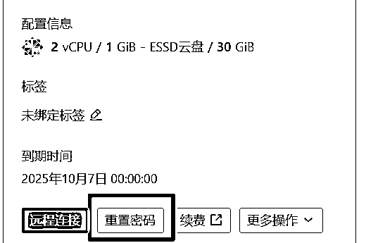
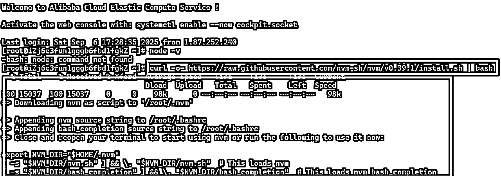
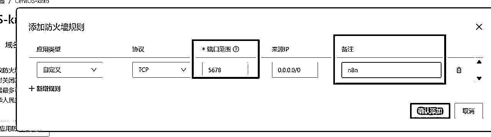
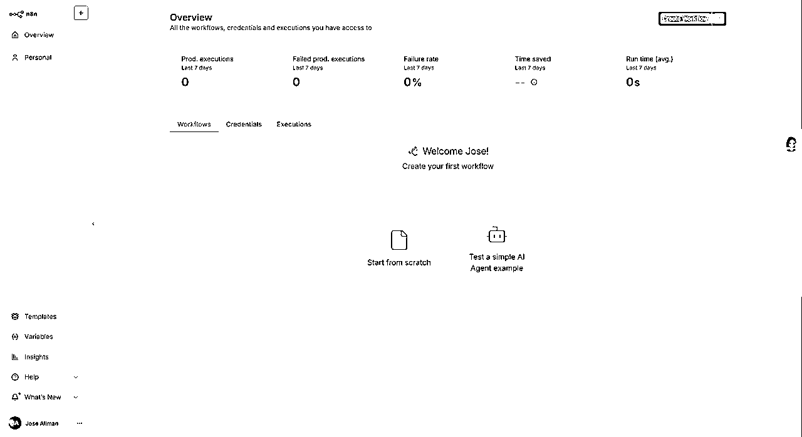

# N8N部署云服务器+买域名+证书保姆级教程(小白友好版)

> 来源：[https://a0u2vshvubw.feishu.cn/docx/ChBkdvUb0ojx5BxPARHcs7Phn9g](https://a0u2vshvubw.feishu.cn/docx/ChBkdvUb0ojx5BxPARHcs7Phn9g)

# 一、买服务器

## 坑点一：不要买境内的服务器！！！

法律明确要求，所有境内的服务器要备案，备案能把你黄花菜等的凉透了，我记得当时备案至少一个周以上，没有成功备案，你的网站就是报废状态，备案完了，还有人亲切友好的给你打电话问候，非常影响我们做项目，所以不要买境内的服务器。

至于说缺点也有：比如不能接微信支付、支付宝支付、公众号扫码登录、网速慢等等，不过其实都有解决办法。

比如登录完全可以通过公众号验证码登录，我最近做的网站：https://qianxunyoushu.com , 刚把登录接完，还不能正常使用哦。

支付可以用发卡平台或者个人支付服务，网速的话其实影响没那么大，几乎没有什么区别，记得服务器别买太远就行了，推荐买香港、日本、新加坡。

然后我们就可以愉快地买服务器了，选择境外服务器其实还有一个巨大的好处，后面我们会讲。

这里注意了，腾讯云会不定期做活动，有的服务器便宜到哭，但是朋友们，不要上当！！！

它找个地区只能选择国内，而且还是限制三个地区，不要一看便宜就无脑冲！！！

## 阿里云买服务器

先登录阿里云https://www.aliyun.com/，然后进入 https://swasnext.console.aliyun.com/buy，如果你看到轻量应用服务器那就对了，如果不对去搜索框搜一下，确保进入下面的页面。

具体配置如下：

这里注意了，至少要买2G以上的内存。太小了部署都成问题，56一个月就够用了，初次学习不要买太贵。

地址的话，香港、新加坡、日本都可以，因为我要做别的用途，所以我没选香港，理论上，香港里大陆南方近，网速应该是最快的。推荐买香港。

然后时间建议买一个月，慢慢续费，不要上去就是三年。

这里为了给大家做教程，我也是下血本买了一个，记得给我报销哦。

买完之后进入管理控制台，

会显示准备中，我们就等啊等....，直到出现下面画面，就可以操作服务器了。

我们先给服务器设置一个密码，完事之后会重启服务器，等重启完毕就好了。

# 二、安装N8N

这里我们省去一切花里胡哨容易让小白崩溃的操作，什么宝塔，不需要！！ 你只是跑工作流，又不是做网站！

这里我们还是不用docker，熟悉我的朋友都知道，我本地部署用的是npm，

那我们服务器照样可以一样的方式安装。

本地部署N8N教程：https://scys.com/articleDetail/xq_topic/4845128821211528

## 正片开始：

我们把服务器后台的网站加一个书签或者保存下，因为后面会频繁使用，存起来方便。

然后缩小浏览器窗口,

Win+R，打开【运行】，输入：CMD ，进入命令行链接云服务器。

命令：ssh root@xx.xxx.xxx.xx

注意！上面的XX你不要给我复制了，你要把XX换成你服务器的公共IP地址，在下图查看。

然后会出现下面的弹窗，大概意思就是，妈妈，我们真的要去隔壁老王家吗？你当然回答yes。

命令行输入：yes

然后出现警告，大概意思是 进隔壁老王家需要密码，我们没输入，隔壁老王拒绝进入，

我们再来一次，命令行输入：ssh root@xx.xxx.xxx.xx

这个时候会提示我们输入密码，你不要告诉我你不知道密码，不知道往上看，是你刚设置的。

注意！这里输入密码不会显示，不要担心，正常输入就行了，输入完按回车。

然后会进入欢迎页面，就是成功的链接到云服务器了，可以发现原来的本地路径变成了 root@xxxxxxxxxxxxx

如果出现以下情况，就是你密码输入错误，再输入就好了，忘记了可以去控制台重置密码。

如果控制台卡了，可以关闭重新进入，还是一样输入：ssh root@xx.xxx.xxx.xx 连接服务器。

然后我们输入安装NVM的命令：

curl -o- https://raw.githubusercontent.com/nvm-sh/nvm/v0.39.1/install.sh | bash

系统会自动安装nvm，非常快，等出现输入光标就代表安装完成。

然后我们 输入命令 ：exit 断开连接，重连服务器，再次输入：ssh root@xx.xxx.xxx.xx

再次进入后，输入命令：nvm -v 检查一下nvm是否安装成功, 出现版本号为安装成功。

然后输入命令: nvm install --lts 安装最新版本的nodejs 。

注意：这个命令和本地安装命令不一样。

出现下面的就是安装成功.

然后输入命令：nvm use --lts 切换刚安装的nodejs 版本为我们服务, 下面是切换成功的样子。

然后我们最后输入： npm install n8n -g 完成最终的安装。

现在我要揭晓一个振奋人心的好消息，

因为我们服务器放在境外，所以在用很多国外的服务，就不需要魔法了，非常的舒服！！！

所以这里不用再像本地部署一样，不是搞代理，或是搞国内镜像。

一个字，爽！！！！！！！！！！！！！！！！

这个页面大概需要一些时间，我们等着就行了，然后这里的【警告】，你就当没看见！只有【报错】会影响使用。

这里最容易出现的问题就是卡住，我的解决办法就是关闭命令行，

然后再次连接服务器：ssh root@xx.xxx.xxx.xx，

注意：如果发现 连接不上云服务器，先检查有没有设置密码，如果设置了就重启云服务器。

再次输入：npm install n8n -g ，等待十分钟后出现下面的页面就是安装成功了

## 打开n8n：

我们输入命令: n8n , 启动完成，出现以下画面。

注意这个地址，把localhost 换成你的 IP地址，后面加上 :5678 就是你访问云端n8n的地址，你最好存下来。

这个时候部署完了，但是还有一非常重要的事，你要去打开5678防火墙端口，否则你无法成功打开。

回到阿里云控制台，点击 服务器名称：

点击防火墙，点击添加规则。

添加端口: 5678

然后打开浏览器输入：xx.xxx.xxx.xx:5678

会看到下面的情况：

大概意思就是，因为我们没有戴TT，没有配置ssl证书，没有买域名，n8n觉得这样不安全，不让你进去。

最快的办法简单粗暴，打破n8n规则，强行进入！

我们先杀死之前开的n8n服务：

输入命令：ps aux | grep n8n ，这个是查看 n8n 是哪个进程，这里看到是1982

然后执行命令：kill -9 1982 杀死进程，

在命令行有一个潜规则，执行操作命令，没有报错返回就是成功。

然后我们执行重启n8n命令，并让n8n忽略安全检查，输入 ： N8N_SECURE_COOKIE=false n8n

这个时候，你再次浏览器输入 【你的服务器ip:5678】 的时候，你惊奇的发现终于可以进去了。

恭喜你，成功在云服务安装了n8n，你就可以愉快的玩耍了，

右下角有个报错，忽略这个小丑，不会影响你的正常使用。

即便是一样的账号，本地部署和云服务器数据不互通，所以你要重新激活下密钥。

# 三、温馨提示：

云端的服务器很容易被攻击，所以这里尽量推荐大家去买域名然后做hppts证书，因文章篇幅的原因，就不展开讲了，如果需要的话，请多多在生财里点赞、留言，我会再出一期教程。

执行命令的时候，不要去手打，你就复制，因为一个空格就可能报错。

也不要去跳过命令，我写的每一步，都要执行。

然后认真看教程，大部分卡点我都写了。

# 重要通知！！！！！！！！！！！！！！！！！！！！！：

二次更新：

注意了，这个n8n，我这边是关闭命令行还是可以正常在服务器运行，所以我们不要设置持久化的东西，

我发现命令行关闭没一会服务就断了，甚至没有关闭命令行就断开了，我辛辛苦苦在云上搭建的工作流没了！！！

所以这里防止大家出现类似的问题，我们再装一个pm2持久化管理。

这个可不是雾霾pm2.5的亲戚，它可以让你的N8N服务一直稳定运行，不会存在关闭命令行突然断开的问题。

注意要先 输入ssh root@xx.xxx.xxx.xx进入到云服务器后才能输入下面的，先杀死原来的服务后执行下面的，

pm2安装命令：npm install -g pm2

然后输入： N8N_SECURE_COOKIE=false pm2 start n8n --name my-n8n

其中黄色背景的是你这个任务的名字，可以随便改，但是后续命令要保持一致。

然后你的N8N服务就稳定运行了。

下次你进入到云服务器终端可以输入：pm2 list

可以查看当前运行的服务。

至此，就全部搞定，直接去浏览器打开就行了。

比如你不想让云服务器运行n8n，可以执行：pm2 stop my-n8n

这样服务就停止了，

如果你发现云服务N8N进不去，先查pm2 list 里有没有东西，

没有的话就执行 N8N_SECURE_COOKIE=false pm2 start n8n --name my-n8n

有的话看看状态，如果不在线，那你就执行 pm2 start my-n8n

如果在线还有问题，那你就重启N8N服务，执行 pm2 restart my-n8n

# 域名购买和证书绑定

域名购买推荐：https://www.namesilo.com/?rid=73edd49su

为什么推荐，

因为 第一是国外的，破事少。

第二、可以支付宝支付

第三、域名便宜性价比高

# 域名购买：

0、先注册账号，登录。

1、在搜索框输入你准备设置的域名, 回车！

2、选择合适的域名，点击下面的购物车购买，你做工作流的话买最便宜的。

3、点完小车之后，点上面出现的 绿色按钮。

4、然后出现了订单页面，从这一刻开始注意了，始终盯住你的付款金额，如果发现变多了，看看是不是多买了什么东西，我们这里只卖域名，其他的一律不要！！！ 然后继续点击绿色按钮。

5、然后弹出支付页面，我们选择最右边的see more。

6、选择支付宝支付

7、继续选择

8、这里的地址随便填，不知道填什么，谷歌搜 【美国地址生成】。

9、选择我同意，点支付。

10、扫码支付

11、付完钱之后回到首页，点击右上角的头像。

12、点击【MY Account】

13、点击 【Manage】

14、这里可以看到你买的所有域名。

# 域名绑定服务器

这里我们直接注册登录大善人 CF 。

https://www.cloudflare.com/zh-cn/

1、进入后台。英语不好的朋友切换成 中文。

2、然后输入你的买的域名，选择快速扫码DNS记录，点击继续。

3、选择免费计划

4、按照下图填写

5、填完之后保存，然后点【继续前往激活】

6、然后出现这个页面

7、回到 域名管理页面，选中你的买的域名，点击【Change Namesrevers】

8、把前面三个NameServer 全部删除，然后填入 ，cf 提供的。

复制到下面

下到最下面，点击【submit】

9、然后回到域名控制台，右边会显示处理中，然后我们再回到 CF 。

点击【继续】

出现下面页面，其实页面没太大变化，因为这里需要等几个小时。

等啊等啊等啊等.................................................................

终于 十分钟后，成功了，这个时间不固定，大概 半小时以内吧。

然后我们满怀期待的去访问买的域名。

会出现这样的情况，而不是我们想要的N8N，莫慌！！！

那是因为我们之前部署的N8N的端口是在5678，而我们 域名 默认绑定的端口是 80/443

相当于，你要进一个房子， 你从窗户进，但是窗户关闭了，所以进不去，我们改下端口从门进去。

然后这里补充一点，我们控制服务器不仅仅可以通过cmd 也可以通过阿里云自带的网页操作服务器。

我感觉网页对小白很友好，所以今天从网页操作。

1、进入域名控制台，点击远程连接。

2、选择第二种方式密码登录。

3、成功进去之后是这样

4、关闭之前的pm2服务

如果你之前开通过n8n开过N8N服务，那你需要先关闭N8N服务。

输入命令 ： pm2 list

如果发现状态是 绿色的online ，

执行命令 ： pm2 stop my-n8n （黄色是你的N8N服务的名字，不要完全复制）

然后状态变 stopped 变红就对了

5、让n8n在指定的 80 端口运行，复制命令，WEBHOOK_URL修改为你的域名。

N8N_PORT=80 \

N8N_LISTEN_ADDRESS=0.0.0.0 \

WEBHOOK_URL=https://qianxunyoushu.top \

N8N_SECURE_COOKIE=false \

pm2 start n8n --name my-n8n

粘贴：注意黄色背景，不要写我的域名，你改成你自己的

然后回车！！！！

6、最后一步设置，改加密模式。

选择【灵活】

然后就，

# 大功告成！

直接访问你的域名就可以进入N8N了

有问题可以留言或私信。

# 结尾：

尽管我绞尽脑汁想把手册写详细，但是还是有很多不可控的问题，

如果有其他问题欢迎 截图找我解决，我会不断优化手册，让小白也能无痛轻松部署，