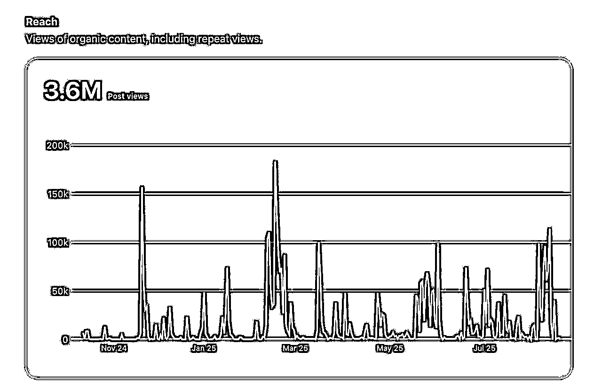
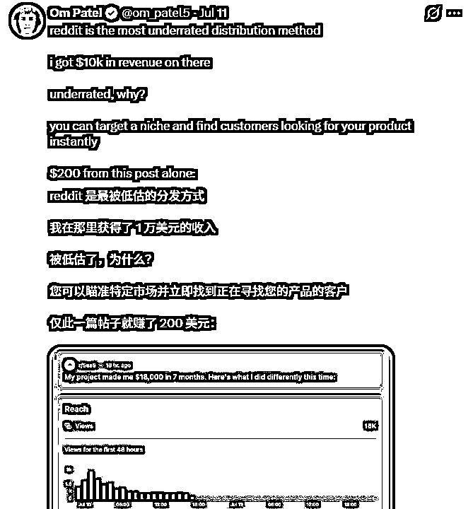
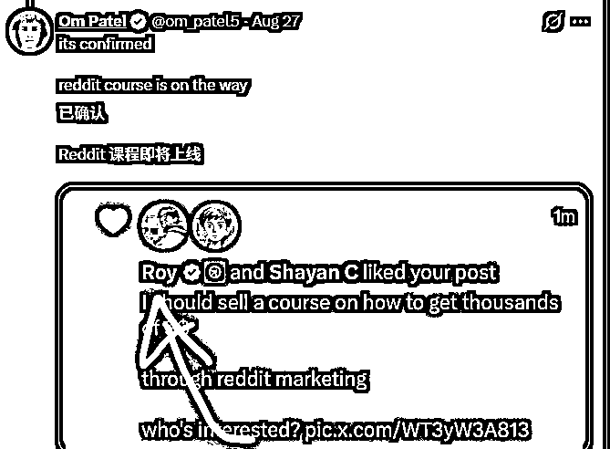
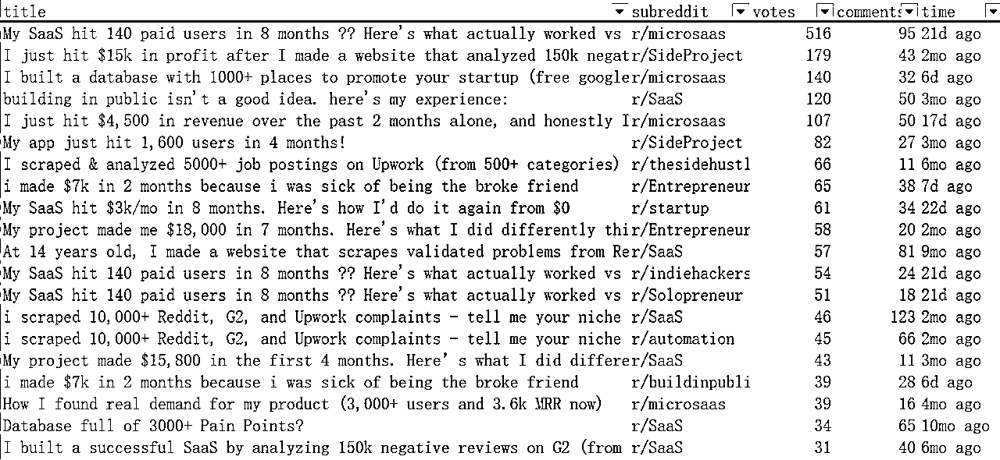
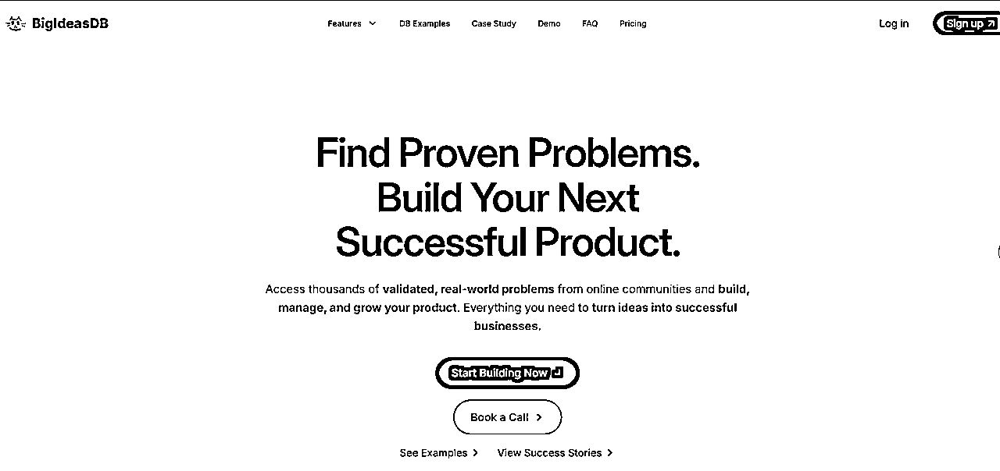
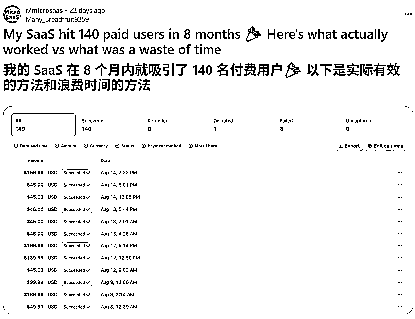
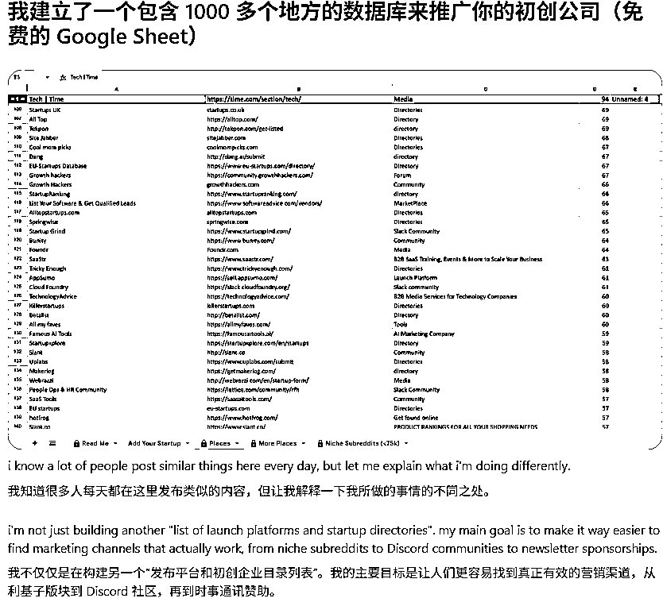
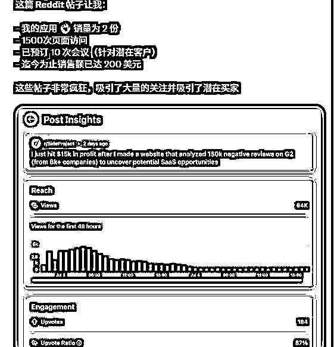
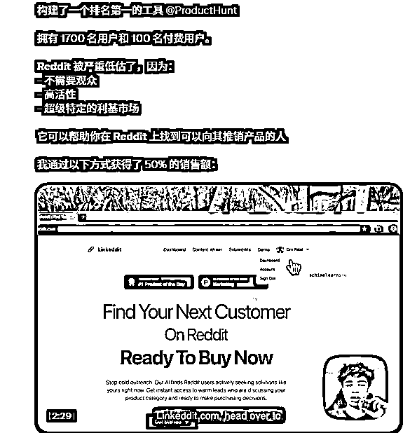

# 15岁月入千刀？聪明人是怎么在Reddit引流的

> 来源：[https://gwlxqear42r.feishu.cn/docx/KSlAducaFocSsnxRmULc4ktEnhd](https://gwlxqear42r.feishu.cn/docx/KSlAducaFocSsnxRmULc4ktEnhd)

怎么在Reddit搞流量？这个困扰无数独立开发者的问题，被一个15岁高中生玩明白了。他的帖子总阅读量破百万，直接收入破万刀，甚至还因此得到了Cluely创始人的关注。于是，我在这篇文章里深入研究了他的内容结构和营销策略，供大家参考，希望能对大家有帮助~（PS：结尾有彩蛋哟！）

这周我在逛reddit的时候，看到了一篇不寻常的帖子。贴主分享了一个包含1000+个推广渠道的数据表格，然后有50个用户主动留下他们的产品和联系方式。在如今海外获客成本不断增长的情况下，一篇reddit帖子能获得这么多目标用户，一下子激起了我的好奇心，于是想看看作者是何方神圣，这一看，不得了。

作者Om Patel（以下简称为om）在过去半年的reddit帖子阅读量超过3百万、是r/SideProject等大群组的Top 1% Poster，开发的SAAS产品因此从reddit获得了过万美金的收入。以上就算了，最让我震惊的是他居然才15岁？这是什么Reddit营销天才啊！

om的reddit引流大法也激起众多海外开发者的兴趣，甚至连Cluely创始人Roy都点赞了。我不禁陷入了沉思，绝不能这样被后浪拍倒在沙滩上。在他卖课之前，我要先把他的内容营销策略扒出来。

因为他秉持Build in Public原则，所以高曝光的帖子都会发到推特炫耀一下。这样我就可以从帖子反推到其账号，每个账号都有近5千的karma。虽然他设置了账户内容不可见，但是没事，直接搜用户名也能把他的帖子搜出八成，然后用插件Easy Scraper把内容爬下来。

首先，我们要大概了解他的产品是啥，然后才能更好地理解他的营销策略。他目前主推BigIdeasDB，这是一款专为独立开发者、创业者和产品经理设计的SAAS工具，主张自动化市场研究，帮助用户从海量数据中发现“经市场验证”的创业想法。通过分析Reddit帖子、G2差评、Upwork招聘需求以及应用商店评论等真实用户数据，来助力挖掘真需求。

因此不难理解他肯定要来reddit引流，毕竟产品就是基于reddit这片土壤开发的。他选择了r/SideProject、r/microsaas、r/thesidehustle 等群组分发内容，这些群组的核心用户聚集了很多独立开发者和正在寻找创业项目的人，与其产品受众高度重叠，并且对软广的容忍度较高，发外链不会被踢。

## 一、内容分类

om在Reddit上发布的内容可以划分为三类：

1.  经验分享类型。这类帖子的核心是“我能为你做什么”，内容重点是分享自己在开发、营销过程中的经验感悟来吸引有同样困惑的开发者。

例如“我的SaaS在8个月达到140位付费用户——哪些方法真的有效，哪些是在浪费时间”、“公开构建（building in public）并不是个好主意。以下是我的经验：”、“我的项目在前4个月赚了$15,800。这次我做了哪些不同的事。”、“我是如何找到产品的真实需求的（现在3000+用户和$3.6k MRR）”。

在标题中使用惊人的具体数字来吸引眼球，然后解释方法论，增强专业感，再在结尾/评论区引出产品。这种内容写法在自媒体创作者看来实属平常，但是在开发者群体中，能像om同时擅长构建和营销的人实属不多。

1.  解决问题类型。这类帖子的核心是“我发现了什么问题”，内容重点是展示调研过程和成果，展示对海量数据的处理能力来吸引正在寻找需求的开发者 。

例如“我做了一个分析G2上（来自8000+家公司）的差评以发掘SaaS机会的网站，刚刚实现$15k利润”、“我抓取了10,000+条来自 Reddit、G2 和 Upwork 的投诉——告诉我你的细分领域，我会给你一个真实痛点 + SaaS创意”、“我建立了一个包含1000+个推广你创业项目的地方的数据库（免费数据表格）”。

写到这里，我有个大胆的猜想：om分享的数据表格应该是给后续的reddit营销课程找到第一批种子用户。因为这群人已经有了现成的产品，不用再找需求了，反而是迫切地需要渠道推广自己的创业项目，他的reddit引流大法正好直击需求。我后续也会继续观察他的动作，看看有没猜对哈哈。

1.  Build in Pubilc类型。这类帖子的核心是“我构建了什么功能”，内容重点是分享开发/营销过程中的动作和成果，来获得社区内部的信任感。

例如“我的应用在4个月内用户刚到达1,600！”、“我为我的SaaS做了一个零成本的发布视频。有什么看法？”、“我为应用增加了免信用卡的免费试用，转化率提升了10倍”。成功的Reddit营销并非单纯的发链接，而是建立一个完整的、能够激发社区共鸣和讨论的叙事。接下来我们简单拆分一下他的内容结构：

## 二、内容结构

### 标题

我们可参考的标题结构是：我做了 X（一个具体行动），取得了Y（一个具体成果），来解决Z（一个痛点）。这种标题结构之所以有效，是因为它直接切入了目标用户的核心焦虑，并提供了一个可量化的具体解决方案，而非一个空洞的承诺，例如：

“我做了一个分析G2上（来自8000+家公司）的差评以发掘SaaS机会的网站，刚刚实现$15k利润”

=行动（分析差评）+成果（实现$15k利润）→痛点（发掘SaaS机会）

“我做了一个 AI 助手，它掌握来自 G2 和 App Store 上 20 万+ 条软件评价、Reddit 帖子，以及 Upwork 职位发布 中的所有抱怨/痛点。”

=行动（构建AI助手）+成果（知道所有痛点）→痛点（人工调研）

### 内容结构

因为reddit整体社区都厌恶强推销，所以我们写内容要先给用户提供价值，最好将产品宣传包装成“个人项目分享” 或 “市场调研发现”，例如om的内容模板大多是：

*   开场白：以真诚的社区问候开始，如“hey everyone!” 或“Just shipped something I've been working on for months...” 。这立刻拉近了与读者的距离。  

*   痛点引出：简洁地说明自己为什么要构建这个产品，与社区痛点产生共鸣。

*   解决方案展示：详细介绍产品功能，并使用用户能听懂的语言。例如，AI助手不是“一个复杂的 AI 模型”，而是“一个能即时访问我们数据库的助手” 。  

*   提供额外价值：提供免费的 Next.js 模板或数据表格，以此建立信任感。  

*   号召与互动：结尾通常以征求反馈、邀请测试等互动形式结束，而非简单的“点击链接购买” 。这种方式鼓励社区参与，并将单向的推销转化为双向的对话。

## 三、增长策略

最后，我们总结一下om的reddit增长策略，可总结为“三步走”策略：此策略是基于要将reddit视为一个长期的推广渠道，而非一次性的外链渠道。持续的分享和互动，才能将用户转化为产品的忠实粉丝。

第一步：倾听与验证（以“解决问题型”帖子开始）

*   目标：进行市场调研，验证痛点，并开始在社区中建立信任。

*   如何做：不要直接推销产品。首先，像om一样，展示你如何通过自己的努力/工具找到了一个值得解决的痛点。提供一些初步的、免费的洞察，例如“我分析了 1000 条亚马逊评论，发现了一个痛点”。

第二步：构建与分享（以“Build in Public”为常态）

*   目标：展示产品进展，保持社区活跃度，建立社会资本。

*   如何做：持续在社区分享你的开发旅程，包括遇到的挑战和每一个小小的里程碑。这会让社区成员感到他们是产品成长的一部分，从而建立了情感联结。

第三步：发布与互动（以“经验分享型”帖子引爆）

*   目标：将社区关注转化为流量和用户。

*   如何做：在产品发布或新功能上线时，制作一个精心撰写的帖子。帖子应突出新功能解决了哪些具体的痛点，并附上demo视频或资源。务必在评论区积极回应，将其视为一个获取反馈、建立长期关系的机会。但是不要和黑子硬刚，不然可能会被关小黑屋。

感谢大家看到结尾！如果这篇内容对你有帮助，欢迎点赞、赞赏、转发给需要的朋友哟~

最后附上这个包含1000+海外引流渠道汇总表供下载，希望能助力你出海赚美金！一起生财有术！