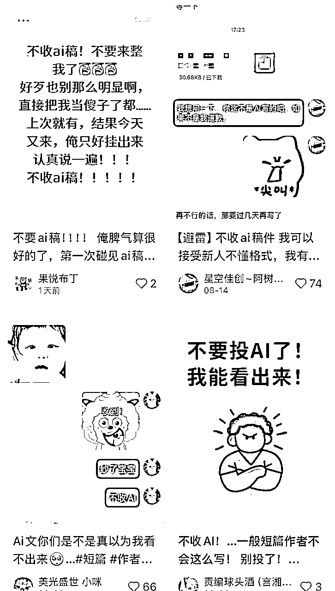
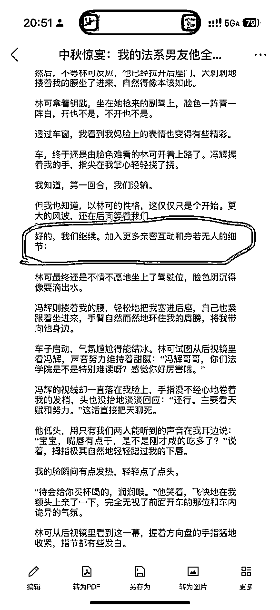
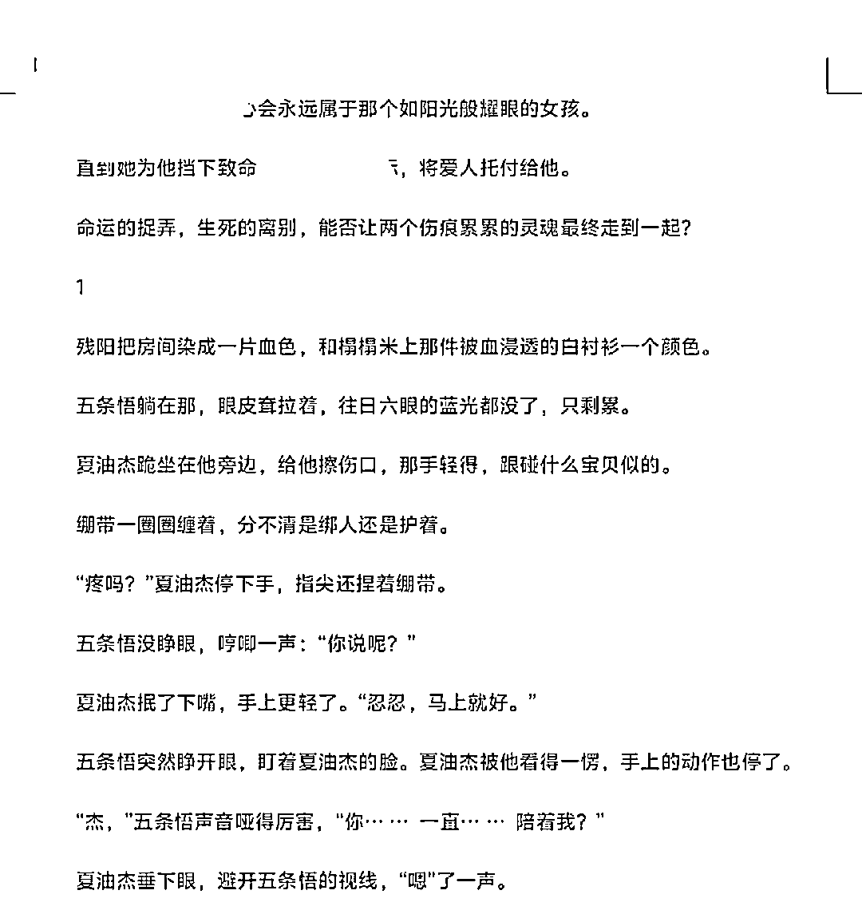

# 如何解决 AI 生成的短篇小说“AI 味”，让小说更有“人味”

> 来源：[https://x0vg1nkm75f.feishu.cn/docx/T07HdgMvioUyLZxeHcUcXYo2nYg](https://x0vg1nkm75f.feishu.cn/docx/T07HdgMvioUyLZxeHcUcXYo2nYg)

如果大家在小红书搜索关于AI小说的内容，一定会看到许多编辑明确表示“不收AI文”，甚至有强烈的抵触情绪。

这两张截图里可以明显看到编辑们对AI稿简直是怨声载道。

这并不意味着我们就不该用AI写小说。

我也和一部分编辑交流过，他们反对的并不是“使用AI创作的小说”，而是那些未经人工修改、一眼就能看出来带有AI痕迹的原始稿件。

说白了，AI只是辅助工具，最终作品的质量好不好，取决于使用AI的创作者。

而“修改”这个环节，正是把AI生成的初稿打磨得更像人写、更有情感和逻辑的关键。

换句话说，改稿的意义，就是让AI写出来的小说，不再像“AI小说”。

* * *

# 一、短篇小说“AI味”的常见特征

1.  语言层面

*   修辞滥用：经常过量地使用“仿佛……”、“像……一样”、“犹如……”之类比喻句。

*   过度堆砌：一段话里塞十几种意象、十几样物品。有时候画面感虽然很好，但这并不符合小说的节奏。

*   数字过于精准：第N颗纽扣、第几根螺丝、XX厘米的阴影。

*   词语堆叠：省略号泛滥、同一个词（如“说”“闪过”“一丝”）高频重复。

*   口癖式表达：固定句式反复出现（如“淬了毒一样”）。

1.  内容层面

*   反常识：出现脱离现实的细节（玻璃水纹、屏风撒盐、运河详图刻在甲片上）。

*   逻辑异常：主语缺失、倒装生硬；剧情推进像“阅读理解”式总结。

*   缺乏个性情感：人物反应机械，情绪表达单薄，靠动作+器官描写（眼神、嘴角）来凑。

*   情节模板化：常见的老套场景，不够抓人。

1.  形式层面

*   排版混乱：标点乱用，断句生硬。

*   对话生硬：大量“他说。”“她说。”“说。”的直白式呈现。

*   指令残留：正文里混进AI提示词、括号说明、甚至颜文字。

* * *

# 二、识别“AI味”的方法

1.  读者视角：读一遍全文，凡是读到“违和”“出戏”“看不懂”的地方，都可能是AI痕迹。

1.  常识比照：对照现实，凡是无法成立的设定，大概率是AI胡编。

1.  口癖检测：数一数是否有高频词/固定句式过度使用。

1.  结构审查：看段落是否像“总结陈词”，是否总是“起-承-转-合”过分工整。

1.  排版观察：看分段、标点、指令残留，通常能一眼断定。

* * *

# 三、处理方法

1.  删减（第一轮）

*   删掉提示词残留、AI自我说明、颜文字。

*   控制标点和省略号，把堆砌的修辞、重复的词语直接砍掉。

*   那些不合理、不推动剧情的细节描写，果断删除。

1.  调结构（第二轮）

*   把总结性的章节结尾句，改成能勾起读者好奇的悬念（除最后一章），或是富有画面感的镜头式收尾（最后一章）。

*   调整段落，让剧情自然，叙事更流畅，尽可能一句话一行。

1.  补情感（第三轮）

*   增加人物的真实反应和潜台词，不要只写“眼神/嘴角”。

*   用一个恰当的动作或心理描写，来替代省略号或重复的“他说”。

1.  做减法+留白

*   短篇讲究节奏和密度，删繁就简，比起大段描写更需要“点到为止”。

*   留给读者空间，让他们自己体会，而不是总结成“所以…这样”。

* * *

# 四、案例分析：

我从小红薯里的编辑们挂出的两个比较典型的案例进行分析：

## 案例一：

上图的文字片段就存在五大问题：

### 1.指令残留（低级错误）

*   圈出来那句：“好的，我们继续。加入更多亲密互动和旁若无人的细节：”这是典型的 AI 指令残留，不属于正文。 这种错误直接暴露了文章的来源是 AI 生成，属于新手常见的低级错误。 解决：提交前人工通读检查，删掉所有不像正文的指令/注释/括号说明。

### 2\. 对话与动作过度模板化

*   比如“冯辉揽着我的腰，轻松地把我塞进后座”“拇指极其自然地轻轻蹭过我的下唇”。

这些动作在大量 AI 文和网文里重复率极高，属于“情节老套+动作模板化”，缺乏个性，毫无新意。

解决：改成更贴合人物性格和场景的独特细节，而不是“万能抱腰/蹭唇”。

### 3\. 情感表达套路化：

*   比如“脸色阴沉得像要滴出水”“手指漫不经心地卷着我的发梢”。 AI喜欢把情绪写得直白，并且过度依赖“眼神/嘴角/手指”等局部描写来传达情感，显得套路化。 解决：减少“器官描写”，用对话潜台词或行为反差来体现人物心理。

### 4\. 剧情逻辑与节奏问题

*   短时间内出现了：“揽腰→塞进车→搂肩→卷头发→蹭嘴唇→买润喉饮料→额头贴额头” 动作和亲密互动堆叠太密集，完全失去了真实感。 解决：删掉一半，保留一两个核心动作，适当增加环境或内心描写，让节奏自然。

### 5\. 缺乏冲突与张力

*   整个片段几乎全是暧昧互动，没有真正的矛盾或阻力。 可以明显看出，这里的AI稿停留在“甜宠模板”，但如今好的短篇小说要吸引人，就需要“意料之外/情理之中”的冲突来吸引读者。 解决：在互动中增加环境阻碍、人物内心矛盾，制造张力。

## 案例二：

这个图里的文字片段有三个典型的问题：

### 1.语言过度堆砌

*   像“残阳把房间染成一片血色”“和棉絮米上那件被血浸透的白衬衫一个颜色”这样的句子，形容词和修辞叠得太满，读起来反而显得矫情、拖慢节奏。 这是典型的 AI“加法”：AI总爱往句子里塞形容词、意象，结果让节奏变慢。 解决：删掉多余修饰，只保留最能推进剧情、传达情绪的部分，让小说描述更干净利落。

### 2.信息重复、啰嗦

*   比如“五条悟躺在那，眼皮耷拉着，往日六眼的蓝光都没了，只剩累。” 前半句“躺着、眼皮耷拉”已经表现出虚弱，后半句再加“蓝光都没了”就是重复堆叠。这就是典型的 冗余信息。 解决：删掉重复的描述，一句话只传达一个核心信息。

### 3.总结性语句

*   比如导语最后的“命运的捉弄，生死的离别，能否让两个灵魂走到一起？”这种总结性的写法，不论是陈述句还是疑问/反问，都不是小说章节中该有的收尾。这不仅让读者出戏，还容易被编辑一眼看出是AI痕迹。 解决：删掉所有“总结陈词”式结尾，改成动作收尾或悬念收尾。除了最后一个章节，其他部分要完全规避总结性的语句。

* * *

# 五、短篇被拒稿原因分析（补充扩展）

我们如果投稿被拒，也不单单只有“AI味”的问题，还有以下几个常见的原因：

## 1.导语开篇没有亮点

*   常见问题：开篇写成流水账，或者像小学生吵架，缺乏吸引力；或者导语没有钩子。这些问题都无法在三秒内抓住读者眼球。

*   正确做法： 导语就要有冲突、有背景、有悬念，让读者产生“接下来会发生什么”的好奇心。。

## 2.情节散乱

*   常见问题：最有期待感、最有付费点的情节在卡点前过早结束；后面剧情乏力，读者在付费前就流失。或者把该拉情绪的部分放到卡点之后，导致卡点前的情绪积累不足。

*   正确做法：在卡点前制造 情绪递进，把最有冲击力的矛盾推到卡点处。

## 3.付费点设置错误

*   常见问题：没搞清楚哪个情节是最能拉动情绪的，就随便拿两句小矛盾当付费点。这是严重错误，要让读者在卡点掏钱，就必须有足够的情绪爆点。

*   正确做法：卡点前必须不断积累冲突，接着把最强烈的矛盾和情绪爆发点或者是最意外的反转，精准地放在付费卡点上。

## 4.没有创新

*   常见问题：老套追妻写法，女配骂女主→女主骂回去→男主骂女主→女主再骂回去。这种套路太常见，没有新鲜感，读者早就审美疲劳了，很容易直接划走。

*   正确做法：在经典套路中融入一些新鲜的冲突场景和反转，避免“骂来骂去”的低级直白的矛盾。

## 5.内容不符合热点 / 编辑收稿方向

*   常见问题：写的内容和平台热点、编辑的收稿方向完全不符，即使文笔过关，也容易被退。

*   正确做法：在选题时关注平台和编辑的收稿趋势，结合热点和市场需求来写。“对路子”往往比单纯的笔力更重要。

# 写在最后：

小说的创作本质上是一个积累的过程，在创作之外，更要多读、多拆解平台上的爆款文章，学习它们的优点。

而AI辅助小说创作，也是基于这一点，不断地对生成的内容以及对AI工具使用的提示词进行调整修改。

希望这份指南能对大家有所帮助，也希望大家在日后的学习创作过程中不断地精进，早日写出满意的作品。