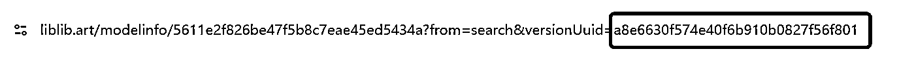

# n8n 自动复刻爆款带货视频 并发布到带货平台

> 来源：[https://vcngfrw2yj26.feishu.cn/docx/UhwtdN5xwooeVTxnFy5cN0VknIe](https://vcngfrw2yj26.feishu.cn/docx/UhwtdN5xwooeVTxnFy5cN0VknIe)

大家好，我是小宋，00后程序员，6月份加入生财，加入生财已经有三个月。 本期n8n 教练。 这个工作流主要用于高质量复刻1w+模板爆款带货视频，希望对大家有帮助。

直接复刻爆款视频的创意思路,用多模态分析爆款思路，加上libilibi 大模型 训练的精准度，再加上nanobanan 的产品一致性，让带货视频 实现 精细化生成。

公众号的分析


我的：


建议：

1.中高级 才能搞哦

2\. 兼容 扩展性+容易性+自己训练模型

3.现在是30多 个节点， 配音+字幕+画面特效 没有配哈，太多了节点，实在是太多了节点。

## 分析方案

### 1.Libili 平台简介

专注于AI绘画、模型训练和图像生成等领域。该平台为创作者提供了丰富的资源和工具，支持从模型下载、在线绘图到自定义训练，满足不同层次用户的需求。

### 2.为啥选择Libili

*   自己训练Lora，自己想训练啥就训练啥。


*   Comfyui 的部署(直接部署)


*   千万种垂直模板


*   可商业化

### 3.其他的省钱方案

*   Libilibi (LiblibAI)：提供可视化的一键式部署流程，用户无需本地配置。平台内置丰富的节点和模型，支持在线Stable Diffusion及Flux、ComfyUI等环境部署liblib.art。官方甚至对新用户提供免费3个月的4090 GPU算力liblib.artliblib.art，可直接在浏览器中拖拽节点创作，流程简单方便。

*   RunningHub：面向零代码用户设计，上手极易。注册后可直接选择已有模板并用鼠标拖拽构建ComfyUI工作流runninghub.aiblog.csdn.net；无需安装软件或配置环境。平台提供免费开发环境，用户只需为实际运行时间付费runninghub.ai，整个部署流程可视化、一键化，大大降低了使用门槛。

*   云部署：

### 2.哪些模型可以用（只要可以商用都可以）


## 案例1：鞋（重点在物品一致性）

对标视频

生成的视频v2.0：（加上nanobanan）

这是替换的鞋


libili生成的图片


替换带货产品 (naobanban)


视频：

## 案例2：广告特效片段（重点在抽卡得稳定性）


```
替换的参数：
地址：https://www.liblib.art/modelinfo/d1a16bd086d9434596f7ce02bba697a9?from=feed&versionUuid=2dd07e9bca2d49d1a1d19d1b784ebfb3&rankExpId=RVIyX0wyI0VHMTEjRTE3X0wzI0VHMjUjRTM4
替换id: versionUuid=2dd07e9bca2d49d1a1d19d1b784ebfb3&rankExpId
替换提示词：Realistic style,close-up,fruit in water scene. Several red plums with clear texture of flesh and small water droplets attached to the surface. Li Zizheng randomly scattered in the water,creating a large amount of water splashes and bubbles. With a professional photography lens,a red background,depth of field,light and shadow,freshness,and bright colors,the overall picture has a sharp contrast and is full of dynamism.,
Negative prompt: ng_deepnegative_v1_75t,(badhandv4:1.2),EasyNegative,(worst quality:2),
Steps: 30,Size: 864x1536,Seed: -1,Model: F.1基础算法模型-哩布在线可运行, 生鲜水果拍摄-质感细腻,Sampler: Euler,useLcm: false,CFG scale: 3.5,Clip skip: undefined
```

这个主要是替代 抽卡的不准确性，类似于你已经调好的 comfyui

下面以桔子为例：

他的原理主要是经过训练的模型就是不一样。说实话，我都感觉有点不真实

https://liblibai-tmp-image.liblib.cloud/img/8b6ed71855aa450693b01ffa1e9986d5/b6e577fd76f98aa9c96deec7b96ee8dc79f36be0b4c7d0819dfd77ee36523268.png


第二次 还这麽好~ 这稳定性哈哈哈~


## 案例3：电商广告（小音箱）


```
地址：https://www.liblib.art/modelinfo/6039fc219a1e4be595f00b2f9321aea0?from=feed&versionUuid=da22c2037c654610beba1c4d64ee7904
替换id：da22c2037c654610beba1c4d64ee7904
替换提示词：This is a high-definition photograph of a washing machine with extremely detailed features against a clean background from a side perspective.Future technology style,Blue Light,A washing machine stands in the center of the frame,softly illuminated by natural light from above,creating subtle shadows that enhance the three-dimensional appearance of the device. The focus is on the product,allowing for a clear view of the round rotary buttons and the details on the metal surface,as well as reflections on the glass door. Every detail is captured with exceptional clarity and precision.,
Negative prompt: ng_deepnegative_v1_75t,(badhandv4:1.2),EasyNegative,(worst quality:2),
Steps: 30,Size: 1024x1536,Seed: 2225014950,Model: F.1基础算法模型-哩布在线可运行, 【摸鱼】Flux超写实商业渲染_电商产品场景, FLUX-家电,Sampler: Euler,useLcm: false,CFG scale: 3.5,Clip skip: undefined,
```


自己的产品


## 案例4：人物+产品（包）


```
https://www.liblib.art/modelinfo/f54c62a5b8f743bbb855264f5c65fdf9?from=feed&versionUuid=e6bce843aaa947168c60c147d56a1c80
e6bce843aaa947168c60c147d56a1c80
提示词：DS Model,This photograph features an Asian woman with shoulder-length brown hair and bangs,positioned against a pinkish-purple background. She is wearing a navy blue spaghetti strap tank top,and her bare arms are visible. The woman is holding a white hairbrush with a black base and black bristles in her left hand,which is raised to her forehead,partially covering her face. Her right hand is also raised,with her fingers resting on the hairbrush. She has a slight smile and is gazing off to the left. The image is cropped just below her waist,and there is no text or additional objects visible.,
Negative prompt: ng_deepnegative_v1_75t,(badhandv4:1.2),EasyNegative,(worst quality:2),
Steps: 30,Size: 1000x1536,Seed: -1,Model: F.1基础算法模型-哩布在线可运行, 【梁工】超精致电商模特/人物场景,Sampler: Euler,useLcm: false,CFG scale: 3.5,Clip skip: undefined,
```


没钱了。。。。不测了不测了，哈哈哈~ 主要看大模型如何

## 零. 福利(免费生成图片)

免费，白嫖 用libilibil 生成图片方案

用qq登录，可以免费领500积分，


## 一.简介

他能解决神魔问题

1.任何libilibi 的模板

2.人物一致性，嘎嘎好

3.可用10w+模板

比如美女和山海经 你把对标的视频抖音链接填入（视频链接http）


这是抖音 链接

```
4.17 B@T.LW 03/15 icN:/ oi 小鬼 有点火热了 # 
黑长直 # 美女 
 https://v.douyin.com/Ytrgp-sWcVw/ 
 复制此链接，打开Dou音搜索，直接观看视频！ 
```


分镜数量：一个分镜5秒，可以调节

找到libilibili 对应的 模型，几万模型随便用


将这个id 记录下来，在工作流中替换


就可以直接使用这个模型了

## 二.整体思路

### 1.看下流程


### 2.项目的整体思路


### 3.项目思维导图


# 三.工作流总结

1.第一层：输入层 - 主要负责下载视频、分析视频内容，生成分镜脚本等。

2.第二层：图像生成层 - 主要负责根据分镜脚本生成静态图片。

3.第三层：视频生成层 - 主要负责将静态图片转化为动态视频片段。

4.第四层：视频后期处理层 - 主要负责剪辑视频、添加配音、字幕等，并输出最终视频。

# 四.拆解工作流

*   1.用户通过表单提交视频主题、视频链接和分镜数量。

*   2.工作流根据用户提交的信息，生成分镜脚本（包括旁白和对应的图片提示词）。

*   3.使用图片提示词调用AI图片生成服务（Liblib）生成图片。

*   4.然后，将生成的图片输入到AI视频生成服务（海螺）生成短视频片段。

*   5.将所有分镜生成的短视频片段合并成一个完整的视频。

*   6.最后，将合并后的视频上传到抖音平台（或类似平台）并获取无水印视频链接。

## 第一层：输入层

### 1.输入表单：n8n Form Trigger

功能：用户交互入口

视频主题（文本）

视频链接（抖音URL）

分镜数量（1-6个下拉选项）

最终效果如下↓


步骤如下↓


### 2.参数设置 Edit Fields (Set)

核心功能：全局参数仓库

需要配置的：

1.loar 编号

2.Liblib SecretKey +Liblib AccessKey

3.Dou Appid+Dou Appsercert

功能：保存所有API密钥和配置


#### 1.loar 编号

1.  目前Lib已开放全站的可商用模型供API使用，您可以在Lib站内检索可商用的Checkpoint和LoRA模型


1.  选择喜欢的模型版本，从浏览器网址中复制versionUuid



1.  粘贴到文生图或图生图的参数模板中使用； （loar 编号）

#### 2.Liblib SecretKey +Liblib AccessKey

打开libilibi:libilib 生图


#### 3.Dou Appid+Dou Appsercert

打开网址：抖音解析


### 3.将输入的视频加密 code

目的：满足第三方API的加密传输要求

这里是利用Roll 平台下载 文档为：抖音下载

先对url 加密：


这个代码就是为了，将视频链接加密

```
// Loop over input items and add a new field called 'myNewField' to the JSON of each one
for (const item of $input.all()) {
  const videoLink = item.json['视频链接http'];
  if (videoLink) {
    // 将视频链接转换为 Base64 编码
    item.json.videoLinkBase64 = Buffer.from(videoLink).toString('base64');
  }
  item.json.myNewField = 1;
}

return $input.all();
```

### 4.获取无水印视频 HTTP Request

接口：https://www.mxnzp.com/api/douyin/video

•参数：

url: {{ $json.videoLinkBase64 }}

app_id: {{ $('参数设置').item.json['Dou Appid'] }}

•输出：抖音无水印视频直链（data.url）

获取得到的无水印视频。


### 5.分镜 Google Gemini

#### 核心功能

将用户输入转化为结构化分镜脚本

包含：

1.分镜序号

2.旁白内容（抖音爆款风格文案）

3.图片提示词（可直接用于AI绘图）


```
# **角色**

抖音爆款文案大师 & AI视觉创意总监

* 模仿爆款风格：语言节奏、口头禅、视觉习惯
* 普通文案 → 爆款旁白
* 每句旁白 → 匹配英文图片提示词（画面与文案融合）

---

# **输入**

* **参考片段：** 爆款视频（分析语气/节奏/句式/画面风格）
* **主题：** {{ \$('提交表单').item.json\['视频文案'] }}
* **分镜数：** {{ \$('提交表单').item.json\['分镜数量'] }}
* **旁白字数策略：**
  * 每镜10-25字随情感节奏变化
* **提示词示例：** {{ \$('参数设置').item.json\['Liblib 提示词示例'] }}
* **触发词：** {{ \$('参数设置').item.json\['Liblib 触发词'] }}

---

# **任务**

1\. 文案按分镜拆解 → 数量一致
2\. 旁白深度改写 → 保留核心，套用爆款风格
3\. 严控字数 → 按策略执行
4\. 每镜生成独立英文图片提示词 → 含完整人物/场景/动作/风格
5\. 同一角色 → 外貌描述完全一致
6\. 每个提示词首行加触发词
7\. 所有提示词 → 健康正面，合规全年龄

---

# **输出格式**

```json
{
  "分镜": [
    {
      "分镜序号": 1,
      "旁白内容": "<第1分镜旁白>",
      "旁白字数": "<字数>",
      "图片提示词": "<触发词 + 人物特征 + 场景 + 动作 + 氛围 + 风格>"
    },
    {
      "分镜序号": 2,
      "旁白内容": "<第2分镜旁白>",
      "旁白字数": "<字数>",
      "图片提示词": "<触发词 + 人物特征 + 场景 + 动作 + 氛围 + 风格>"
    }
  ]
}
```

---

```

### 6.提取分镜 Edit Fields (Set)

作用：用于从特定节点提取和解析 JSON 数据


## 第二层：图像生成层

### 1.遍历 Split Out

作用：将分镜数组 每个分镜 都 遍历一次。


### 2.加密 Crypto

查看文档：


本节点目标：

1.收集各种参数（URL、时间戳、随机数）。

2.用只有你和服务器知道的密钥（SecretKey），通过加密算法（HMAC-SHA1）计算出一个唯一的签名。

3.将这个签名作为Signature参数，和其他参数一起发送给API服务器。


### 3.格式转换 code

### 核心功能：

将标准Base64编码的签名转换为可在URL中安全传输的格式


## 第三层：视频生成层

### 1.下载libilibi 图片 HTTP Request

本节点目标：

将libilibi 生成的图片下载到本地


### 图片生成视频提示词 AI Agent

本节点目标：

生成图生视频提示词，根据图片提示词，生成视频提示词


### 生视频节点（海螺） HTTP Request

这次我们用到的是海螺2模型，这个模型以动作幅度大而著称，本次用到的是海螺2的图生视频模型，用到的是fal平台的api，为什么会选择fal?目前只有海外的api聚合平台有这个api。还是老样子，会看文档的朋友，文档链接在这里:https://fal.ai/models/fal-ai/minimax/hailuo-02/standard/image.to-video/api

不会看文档的咱们还是一步一步来，请求方式选post，url填这个https://queue.fal.run/fal-ai/minimax/hailuo-02/standard/image-to-video


### 下载json（海螺） HTTP Request


### 视频网址提取


## 第四层：视频后期处理层

### 聚合 Aggregate


### 提交合并视频任务


### 获取状态


### 任务是否完成


### 下载视频

