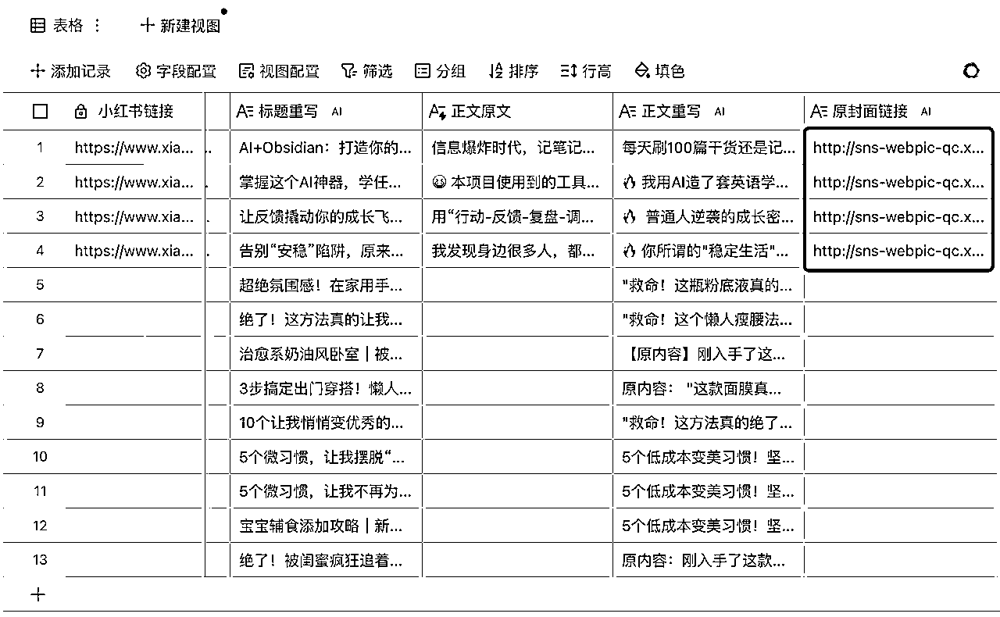
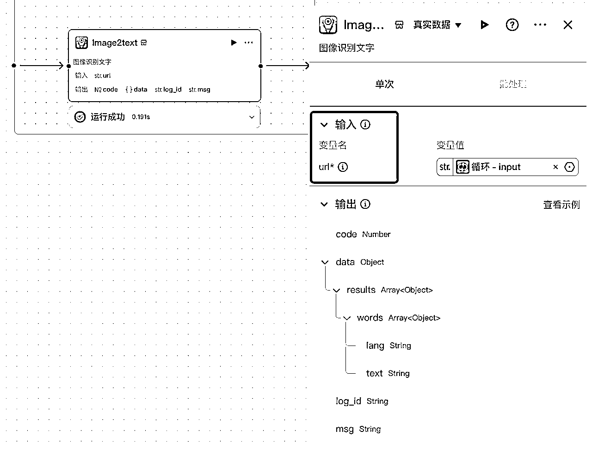
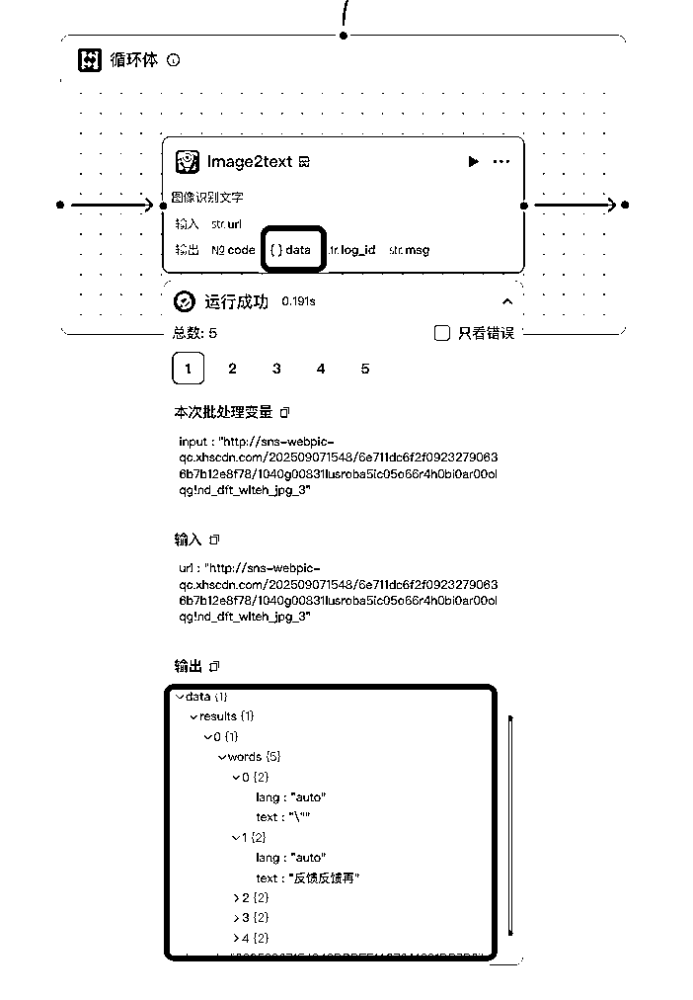

# Coze真的太香了！第一个项目就做出小红书图文抓取神器，成就感爆棚！

> 来源：[https://hc66d27gc1.feishu.cn/docx/U7hPdd8MWoPQ0kxpBCJcG59dn1f](https://hc66d27gc1.feishu.cn/docx/U7hPdd8MWoPQ0kxpBCJcG59dn1f)

大家好，我是克克。新手小白，报名参加了这次9月的「coze+多维表格」航海。

我也没想到，第一天学做工作流，就被教练和领队追着约稿。这简直是莫大的鼓舞！

我是带着明确的目标来的，那就是以后成为可以交付定制化工作流的专家！哈哈哈哈，想到这就很激动。

我发现带着解决问题的想法去学习，真的事半功倍。航海第一天，我就跟着航海手册吭哧吭哧地搭建第一条工作流「小红书笔记批量采集与改写」，很快就发现这条工作流还不能很好地满足我的真实需求。

于是，我开启了群里疯狂举手提问的模式，再加上自己摸索，一眨眼就干到了凌晨一点半，而现有的这条工作流已经经过了我的爆改，从图1变成了图2。

我后来去上网搜了一下，发现有大佬分享出来类似的工作流后，下面很多人求购买的。第一天玩coze，咱也是出息了哈哈哈哈！

这条工作流不仅实现了将小红书笔记三件套（标题、封面、正文）提取到多维表格，我还摸索出一个很实用的功能：将小红书笔记中的所有图片文字一键提取到多维表格。

## 下面是小白友好的完整保姆级教程，也是对我心路历程的梳理。

（如果有更加优秀的方法，欢迎大佬指点！下面言归正传⬇️）

跟着航海手册，我们会搭建出一个自动采集并改写「小红书笔记标题和正文」的工作流，在多维表格中的效果大概是这样的，如下图所示。

多维表格接入我们的coze工作流后，你需要做的只是粘贴小红书笔记链接，它就会自动抓取标题和正文内容了。后面我们在多维表中使用「快捷字段」，选择相应的大模型就可以进行针对标题和正文的改写啦。这个具体步骤在航海手册中很详细，我就不展开了。

⚠️：每一列的标题（像是「小红书链接」、「标题原文」、「标题改写」...这些）都是我自己起的，方便我记忆，所以你上手搭建的时候根据自己的需求来起名字就好哦！

### 01 如何同时获取笔记「标题+正文+封面」？

搭完之后我就在想🤔，只有标题和正文，我想连封面一起获取并重绘，能不能行呢？

困难很快就来了❗️因为我发现，多维表格中最多只能输出2个结果！

没想到这盆冷水泼来的这么快，要在之前我肯定就放弃了，心想：原来这实现不了啊（顺便摊手🤷然后心安理得躺着刷手机

但这次不一样，因为我想，真实情境中，我的客户一定会遇到相同的困扰，并且提出同样的需求。想要赚到他们的钱，那我必须想办法解决问题啊！于是我果断在群里举手提问，没想到贴心的骄阳教练一天前就录了一个演示视频，把这个问题讲解清楚了！

这让我不禁感叹：有时候，你真的只需要勇敢向前再迈一小步，你想要的答案已经在前面等着你了。千万不要主动放弃啊喂！

好，下面公布答案。其实很简单，只需要在多维表格中的「coze工作流调用」字段捷径中打开“完整响应数据”就可以了。这样不管输出多少个结果，都是可以显示在多维表格中的。对，就是这么简单。

然后新开一列，字段捷径选择「信息提取」，需要提取的字段选择「完整响应数据」，提取信息为「image」，为了确保链接干净，可以在下面的自定义提取要求中写上「输出不允许有中括号和引号」。

为了更方便我记忆，我把这列的名字改成了「原封面链接」。

⚠️：这个「image」可不是我随意乱写的，你要确保你选的coze插件是可以输出「image」的。并且你的「完整响应数据」中确实能够查看到输出了「image」

于是我得到了如下的效果⬇️

等等hold on hold on hold on，封面图怎么是以链接的形式显示的？

那这样，如果我后面想对封面进行重绘的话，不管是用文生图还是图生图模型都是不行的（因为链接既不是文字又不是图片啊喂！）。

于是我再次在群里发起提问。

后面跟着教练的方法，我又在多维表新开了一列，在字段捷径中心找到了这个「链接转换附件」，并在配置中将需要转换附件的字段选择为「原封面链接」

（⚠️：每一列的名字都是我自己取的，方便我理解和记忆，所以你在操作的时候名字不一定也叫“原封面链接”哈～）

于是，封面图片就水灵灵地出来啦～我发现不止是封面图片，图文笔记的话，所有图片都可以提取出来！

（⚠️：于是我给这一列起名为「原笔记图」，因为后面我想实现一键重绘笔记封面图的效果）

### 02 如何实现一键重绘封面图？

有了图片之后，我又在想🤔，能不能让Ai一键重绘这个封面图，既保证原创又能快速产出呢？

其实这个方法很简单，只需要用到图生图的快捷字段捷径就可以啦。

具体实操方法：

*   新开一列

*   在快捷字段捷径中搜索「图生图」，你就会看到这个豆包的模型

*   在输入指令处告诉它你想怎么改图就可以了

*   后面的「图片内容」选择我们刚生成好的「原笔记图」

*   点击确定

*   刷新一下， 重绘好的封面图就出来啦！

（⚠️：每列的名字是我自己取的，所以你在实操的时候不一定也叫「原笔记图」哈！）

但是！这里我要先泼一盆冷水，豆包图生图模型的改图能力还是比较有限的，生出来的图往往不能直接用（看下图）。教练说可以在工作流中使用nano banana模型来改图，并且这个教程会在第四章的内容中讲到，让我先来浅浅期待一下。

### 03 如何提取封面中的文字内容？

封面中有时会有一些非常精彩抓人的信息，我们也想提取出来作为参考，那如何把封面中的文字整理成文本形式呢？

这个过程其实非常简单。在多维表中新建一列，字段捷径选为「通用文字识别」，然后下面「需要识别的图片」选择我们刚刚通过「链接转换附件」获得的「原笔记图」。

这样，封面的文本我们就获取成功了

需要注意的是，不管我们从小红书笔记中提取了多少张图，使用「通用文字识别」只能提取到首图的文本，也就是封面的文字内容。

细心的朋友可能已经发现了，我提取的第三和第四篇笔记，文字都是嵌在图片中的。想要仿写这篇笔记，就要把每一张图中的文字全都扒下来。只有首图的文字显然是远远不够的。那该怎么办呢？

这才是我这篇分享帖真正想分享的重头戏：「一键提取小红书所有图片中的文字」！我是咋解决的呢？保姆级教程放在下一节了，请认真看哦！⬇️

### 04 如何一键提取所有图片中的内容？

我们刷到的很多小红书笔记，真正精华的内容并不是放在正文，而是在图片中的。有时候你会发现，一篇图文笔记可能文字分散在十几张图片里，但是正文可能就寥寥一句话。

这时候一张张截图去提取文字简直麻烦得要死。所以识别了这个痛点，我就要想办法在我的工作流中把它解决掉！

于是又开始了漫长的挠头。。。（头：hello？

我又双在群里问，教练给到的答复是把图片链接数组拆开，一张一张提取⬇️

这显然行不通的呀（我当时就想，这样交付给我的客户，他们肯定不干呀。。。每一张图提取出来的内容都要新开一列多维表格，而且最终提取出来的内容也是分散的。

有没有什么办法能一口气把所有图片里的文字都提取出来，而且还合在一起输出呢？

这时候头显然是不能再挠了，再挠它要冒烟了。

就在我和多维表格陷入了一段长时间的沉默和僵持的时候，我突然悟了！多维表做不到，那怎么不试试调一下coze工作流呢！！？

让工作流帮我把所有图片的文字汇总到一起，输出到多维表格中去！

天呐，有点刺激，行不行呢？

答案：行！

凌晨快一点，激动的心，颤抖的手，我在群里展示了最终的成果⬇️

连教练都好奇我是怎么实现的。领队也很激动，想要看分享帖。

我一个小白，第一天学做工作流，被教练和领队追着约稿是什么感觉？实话实说，当下的感觉就是三个字：我！不！行！

这一部分的感受放到文章最后说，希望能给同样也是小白的你一点点鼓励。

好的，言归正传。我是怎么调我的工作流的呢？

#### 第一步：查看插件节点图片输出结果形式

我去查看了coze工作流中「get_notes」节点（负责抓取小红书笔记内容的节点）的输出，发现输出的「image_url」的具体结果是数组（array string）形式，里面每一项都对应了小红书笔记里的一张图片

接下来就要考虑怎么把这组图片中的文字提取出来啦。

#### 第二步：提取图片中的文字

想要在工作流中将图片中的文字提取出来，我在b站搜到了这个非常厉害的OCR插件，它是coze官方出的插件，可以从包含文字的图片中识别文字。

我还惊喜地发现，OCR插件需要的输入正好是图片的url（还记得吗，「get_notes」的图片输出就是「image_urls」）！

但是！测试后我发现「OCR」（image2text）插件并不能直接处理「数组」形式的url呢。。所以要把每一个url拆分出来先。

#### 第三步：拆分urls

现在需要把image_urls中的网址拆分出来，因为OCR插件要求的输入是「字符串」，我们现在是「数组」。（一开始想先连接豆包来给数组做拆分，失败；然后又尝试用代码块来对数组进行拆分，也失败😭 anyway 不展开了）

最后，我尝试直接用工作流里的「循环模块」，连接到上一个节点，发现如果输入的是「数组」的话，循环可以直接遍历数组里的每一项，恰好符合目标！

循环设置为「使用数组循环」，循环体里加入OCR插件（image2text），这样每一个url都会被单独输入，经过OCR插件的处理，输出对应图片的文字内容。

#### 第四步：将文本组合成一个字符串

试运行成功后，检查OCR插件的输出，在其输出的「data」对象中包含了所有的文字内容。但是这里的文字内容是以行为单位进行输出的。所以虽然文字被提取出来了，但全都是散的。不过好在顺序是正确的。

所以在「循环」后面我链接了「文本处理」节点，用途就是将所有输出的文字直接整合成一个单独的字符串。

然后再试运行，发现所有的文字内容全被整合到了一起，但是也多了很多多余的内容，比如斜杠、lang、auto、大小括号等。

#### 第五步：大模型优化文本

因为这些多余内容的重复性很高，所以我直接在后面接了一个豆包大模型，给它的任务就是删除上述那些重复内容，并把剩下的，语意正常且逻辑通顺的正文给拼接后进行输出。

#### 第六步：连接结束节点

把输出结果给连到结束节点，这样一张条工作流就连好啦。

#### 第七步：新增输出变量

结束节点的输出变量新增一个，我这里起的名字是「fullcontent」，意思为全部的内容。（⚠️：这个fullcontent是我自定义的输出名称，你完全可以起一个你喜欢的名字哦！）

变量值选为上一个节点「大模型」的「output」

试运行一下，就可能看到清晰完整的全部文字啦！

到此为止，一篇笔记中，所有图片上的文本就被提取出来了！耶耶耶！

#### 第八步（也是最后一步）：完善多维表格

返回多维表中，新建一列。「字段捷径」选择「信息提取」，需要提取的字段选择「完整响应数据」，提取信息为「fullcontent」

（⚠️：刚刚说过了，这是我自己取的名字哦）。

刷新一下，所有图片中的文字内容就清晰地展示出来了！后面一键改写就会非常非常非常容易！

### 写在最后

这个工作流是我第一天搭的，但是当教练和领队真的让我出一篇分享帖的时候，我拖延了整整一天才开始动笔（这一天为了逃避现实甚至下午才起床。。）为什么呢？因为我觉得：我怎么能教别人呢？不不不，不可能。

我也很惊讶，最终梳理完成之后竟然写了这么长，原来我看起来还“真像那么回事”。

这里我要非常郑重地感谢骄阳、桃汐教练的解答。尤其是骄阳，我问完最后一个问题的时候，都快凌晨一点了。还要感谢一泽教练、刘同学、大圣学长的鼓励，不然我肯定不会去写这篇分享帖。

其实我到现在也不敢相信，一个coze小白，第一天竟然能做出这样的成果。我分享的所有内容，在几天前我都是想也没想过的。无非就是遇到了问题去思考解决的办法，见招拆招，疯狂问教练，实在不行小红书、b站去搜前辈的经验帖，一步一步，到凌晨合上电脑的时候，我才突然回过神来：我刚才几个小时都干了什么！第一次搭工作流搭出了心流的感觉！

我能搭出这样一个工作流，靠的是「结果倒逼过程」的激情。我把自己当成未来的客户，为了交付而去学习，这会让人忘了「寻求帮助羞耻」和「小白羞耻」。

我相信那几个小时，我满脑子都是「我不管，我只想把问题解决了」这一根筋在驾驶。

所以以后千万别低估你的潜力了喂，很多时候学不会，不是笨，而是怕。

这句话，我写给自己。