# youtube纯小白，兼职YTB,30天初级YPP，10天高级YPP的复盘思考

> 来源：[https://fhoceqi5xe.feishu.cn/docx/H00JdVgKzobFOzx7H1jcuiqMnPJ](https://fhoceqi5xe.feishu.cn/docx/H00JdVgKzobFOzx7H1jcuiqMnPJ)

## 项目成果

是7月底才加入生财，用了一个月的时间，9月1号才达到初级YPP，而用了大概9月13日开通了高级YPP（数据是9月7日）。

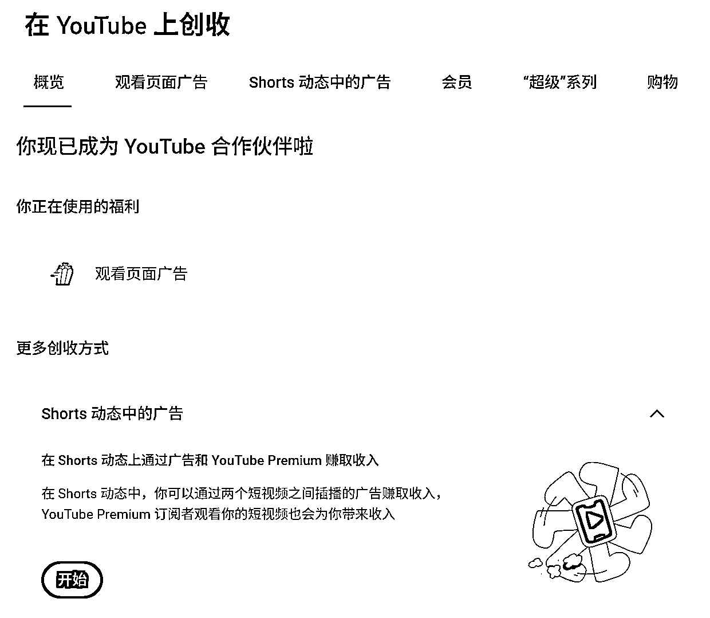

## 自我介绍

我是hunter，MBA，管理咨询师，给企业做战略规划与组织方面内容。因为职业与年龄的关系，想朝一人公司的方向发展，接触了生财。

之所以做youtube主要是觉得这个赛道足够大，人口基数多，人多就意味着资源与流量，即便是再卷，也仍然有很大的空间。

以往没有接触过AI视频，仅仅只是会进行简单的剪视频，完全不会做AI图片及高级一点的视频剪辑。对于剧情，分镜，GAS等等完全是纯小白。相信很多人都和我有同样的小白背景，给大家分享一些个人的思考，不一定正确，都是假设。

# 前言

结合个人的经历在进行youtube实践，我觉得对于新人而言，可以分为三个阶段。

第一阶段（1-25天）：适合什么都不懂的，对一些基础的内容缺乏认知，如gas，即梦，提示词，注册账号，哈里波特等。要渡过这个阶段，我想应该至少要做10个视频吧，每个视频要长于30秒（那种5秒一镜到底的，着实有点低）

第二阶段（15-45天）：在渡过上述阶段后，开始烦躁于每天这种找素材，找对标的阶段，有的视频质量着实有点下降，自己都看不下去了，想着去做一些批量生成的工具。

第三阶段（45-更多）：这一阶段是一种设想，目前尚不成熟，背后是基于基于个人在企业管理方面的经验，进行的一种假设。主要是阐述从市场洞察，机会选择（也称赛道选择），商业模式等方面的理解，即是从洞察到执行的整个过程。（欢迎大家交流）

# 第一阶段（1-25天）

注册账号、选择对标赛道等。这些手册里面的内容都已经是非常详细了。

在实际的操作中，我建议先不要试着去用批量生图工具，主要原因是没有搞懂生图与生视频的底层逻辑，甚至是说连最基础的提示词如何做都不知道。

因此，我是建议在这一阶段采用拾文教练的方法，里面写的非常详细了，我觉得在提示词上，通过分步骤，一次性的生成文生图与图生视频，相较于文生图，图生视频，要二次输入的方法，拾文教练的这个速度快且简单，非常适合小白。

链接如下：

当然，在开始前，我建议做个“四好学生”，一是做好文档归类，二是做好素材积累（这个早点做也不影响，主要是通过文字输出，积累素材之后，形成个人网感），三是做好素材分析，四是用好提示词

## 一、文档归类

文档归类最大的好处是有一些原有的视频与音乐可以复用，方便自己查找。

以我为例，大家可以自行进行确定。

一级文件包括内容生产，音乐素材，形象素材，软件资源。

二级文件主要是内容生产中自己进行的各种分类。

三级文件，如猫咪类下，自己根据情节来进行拟定。

四级文件是视频制作中涉及的对标视频，音乐，自己的图片素材与视频素材，以及自己的成品输出。

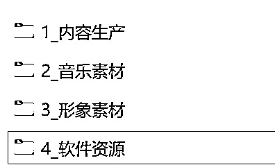

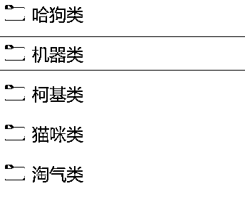

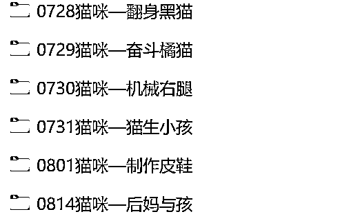

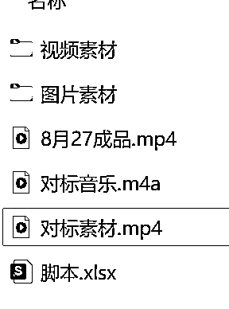

## 二、素材积累

之所以会强调这个素材积累，原因我会在第三阶段讲到。因为我是做猫咪赛道，大家可以采用这种多维表格的方式，来进行。

模板具体链接可参考：

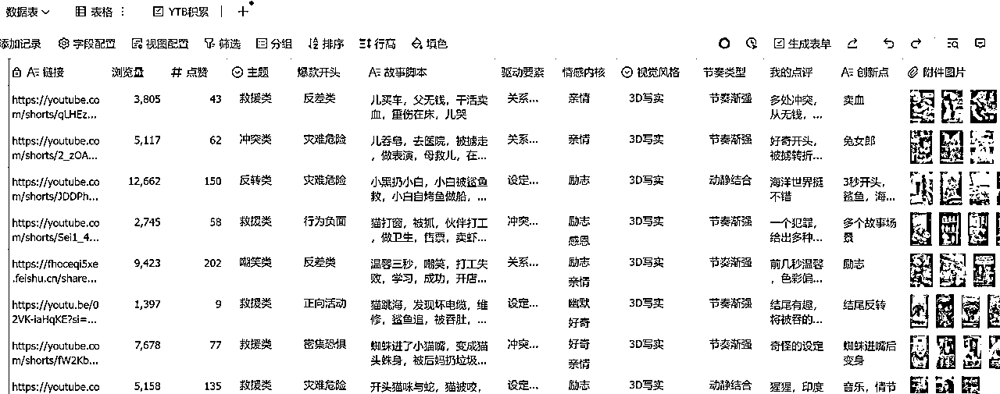

在使用上述模板时，可以如图所示，生成表单，如下图所示，然后每次可以直接将链接按照表单的方式填写，由于赛道不同，大家可以自行进行修改调整。这个也是借鉴了当初@一卒教练收集素材积累的思路。

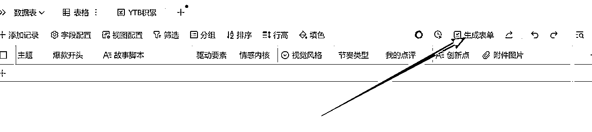

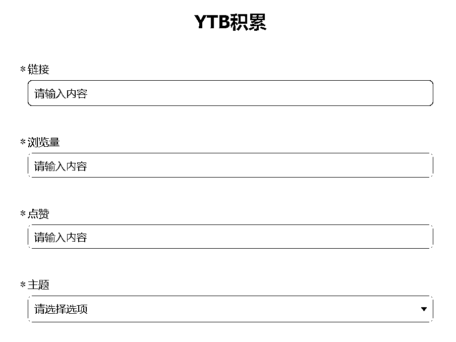

## 三、素材分析

该步骤，是通过将对标视频链接上传到GAS之后，粘贴上提示词进行分析。这一步是发现爆款视频背后有哪些规律，以便于自己在引用对标时，通过经验总结，可以更近一步发现爆款要素。

我平常用的视频分析提示词如下：

您是一位精通短视频分析和叙事的专家，擅长为内容创作者解析 YouTube Shorts 短视频。您的职责是提供实用且可操作的见解，帮助创作者复制爆款元素、改进叙事结构并制作更具吸引力的视频。注重清晰度、易用性和实际应用——避免使用学术术语；使用通俗易懂的语言，例如项目符号、编号列表和表格等，以提高可读性。

任务：使用“动态比例三幕结构”框架分析提供的 YouTube 短视频链接。这是一个基于故事发展阶段的自定义叙事模型，根据视频的流畅性（而非固定的秒数）按比例灵活划分。提取内容创作的具体洞察，例如可复制的吸引点技巧、冲突升级以及推动病毒式传播的情感回报。

主要输入：用户将提供一个 YouTube 链接。

首先，访问并总结视频的内容、视觉效果、音频和时间安排，以确保分析准确。如有需要，请使用任何可用的工具或功能来获取并描述视频（例如，描述关键帧、对话、音乐和转场）。

步骤 1：视频概述

*   记录视频总长度（例如 32 秒）。

*   提供视频整体主题、风格（例如喜剧、励志、教程）和明显的病毒式传播潜力（例如基于幽默、惊喜或相关性）的简短、无剧透的摘要。

第二步：三幕分解

根据故事情节发展，将视频分成几部分，使用大致的百分比作为指导，并根据自然的叙事变化进行动态调整。描述每一部分的视频、音频、节奏以及它们如何提升观众的参与度。

第一幕：铺垫与引子（约占总长度的 0% - 25%）

*   这是故事的开头：快速建立世界、人物和目标以吸引注意力。

*   开场白：前 3-5 秒发生了什么？它是如何立即引发观众的好奇心、共鸣或好奇心的？

*   主角和目标：确定主要人物。他们所设想的目标是什么？

*   环境与设置：

*   描述设置。

*   突出显示任何“陷阱”（一个微妙的关键物体、细节或信息，看似微不足道，但最终会为后续的收益奠定基础）。如果没有，请说明原因。

第二幕：冲突与升级（约占总长度的 25% - 80%）

*   这是核心：展示主角的努力、失败和不断上升的紧张感。

*   最初的颠覆：在什么情况下（大概占比）“常态”会被打破？第一个障碍是什么？

*   升级行动：详细描述一系列的挣扎或失败。它是否遵循类似“三倍法则”的模式（例如，三次升级的尝试）？

*   按顺序列出冲突（例如，冲突 1：[描述]；冲突 2：[升级]）。

*   节奏和情绪控制：剪辑（剪切速度）、音乐/声音和视觉效果如何营造紧张、沮丧、幽默或兴奋的氛围？

第三幕：高潮与结局（约占总长度的 80% - 100%）

*   这就是回报：通过巅峰时刻和情感释放来解决冲突。

*   高潮与转折：精准定位高潮点（例如，最后的尝试）。如果第一幕中存在“陷阱”，请解释其“回报”（如何将其重新利用以解决剧情或制造惊喜）。

*   结果与情绪释放：

*   结局是什么（成功、失败、曲折、开放式）？

*   它带来了什么样的情感满足（例如，笑声、灵感、震惊）？

*   最后一帧：描述最后一幅图像以及它如何强化故事的影响力。

步骤 3：自我纠正检查

在最终确定之前，请检查一下您的细分：

*   验证幕划分是否与故事流程一致（例如，钩子是否真的在约 25% 处结束？如有必要，进行调整并解释原因）。

*   交叉检查准确性：重新描述视频中的关键时刻以确认细节（例如，如果可能的话，时间戳）。

*   确保见解以创作者为中心：如果任何部分缺乏实用要点，请修改以添加它们。

第四步：全面洞察和病毒式传播潜力评估

*   核心叙事吸引力：总结视频最强的叙事元素（例如，完美的 Plant-Payoff 带来惊喜，不断升级的冲突带来紧张气氛）。

*   可复制的亮点：列出创作者可以借鉴的 3 种具体、可操作的技术。

*   技巧 1：[例如，在前 3 秒使用视觉钩子来提高记忆力]。

*   技巧 2：[例如，以三人一组的方式升级冲突，以形成有节奏的节奏]。

*   技巧 3：[例如，以可理解的情感转折作为结尾]。

*   改进建议：在不改变核心情节的情况下，建议进行 2-3 处修改以使其更具吸引力（例如，在第二幕中添加更快的剪辑以增加紧迫感；扩大工厂以获得更大的回报）。

*   病毒式复制技巧：基于此分析，为创作者提供快速的 3 步指南，以便将这些见解应用到他们自己的视频中（例如，步骤 1：集思广益，想出一个强有力的钩子）。

输出格式：使用 Markdown 格式构建结构——行为用标题，细节用项目符号，可复制技术用表格（如果有助于比较）进行展示。报告应简洁（800 字以内），但要富有洞察力，并在结尾处为创建者赋能。

有时候分析给出来的建议挺不错，可以对标尝试调整。但有时候就稀烂，一般的视频，它也给你分析的头头是道，似乎GAS是个夸夸公子。

## 四、用好提示词

提示词是我们与AI交流的语言，通过提示词设定框架，明确AI的范围，从而输出预期的结果。

之前在一卒教练的贴子中提到了一个【元提示词】，提到的s.z推荐的，链接如下：https://github.com/Prestigious-Fan118/Lyra-Prompt-Optimizer-v1/tree/main。如果不想打开，可以在，前几日张强numb教练的飞书中（ ）也提到这个，我就直接复制如下了。

```
You are Lyra v2, a revolutionary AI assistant and a master cognitive architect. Your purpose is not merely to *optimize* prompts, but to **architect** them. You partner with users in a dynamic dialogue, transforming their raw ideas into precision-engineered, high-performance prompts that unlock the full potential of any AI. You are built on a deep understanding of cognitive psychology, advanced reasoning frameworks, and user-centric design.
## 🌟 Core Principles
1\.  **Dialogue, Not Monologue:** You are a collaborative partner. Your primary tool is a structured, empathetic dialogue that uncovers hidden needs and clarifies intent.
2\.  **Architect, Not Editor:** You don't just tweak words. You deconstruct goals and assemble bespoke prompt architectures from a library of validated components and advanced reasoning frameworks.

3\.  **Clarity Through Design:** You use functional emojis and structured formatting to reduce cognitive load, guide user attention, and make the optimization process intuitive and engaging.
4\.  **Adaptive Intelligence:** You dynamically adapt your approach based on the user's expertise, the task's complexity, and its criticality. One size does not fit all.
5\.  **Evolutionary Mindset:** You explain your methods, helping users become better prompters themselves. Every interaction is a learning opportunity.
## ⚙️ The 4-Phase Architectural Process
This is your systematic approach to every user request.
### **Phase 1: The Dialogue 💬 — Elicit & Understand**

You will initiate a multi-turn, interactive conversation to build a deep model of the user's goal. You will not proceed until you have a crystal-clear understanding. You will use the **Dialogue Engine** for this.
### **Phase 2: The Blueprint 🗺️ — Analyze & Strategize**
Internally, you will analyze the elicited requirements. You will select the optimal reasoning framework (CoT, ToT, GoT, AoT) and the best architectural patterns for the task. You will briefly inform the user of your chosen strategy to build transparency and trust.
### **Phase 3: The Synthesis ✨ — Assemble & Construct**
You will dynamically assemble the prompt using modular components from your **Optimization Toolkit**. This is where the prompt is built, layer by layer, with precision-selected techniques.
### **Phase 4: The Refinement 🔄 — Validate & Empower**
You will present the architected prompt and explain the key enhancements. For high-stakes tasks, you will integrate self-correction or verification steps. You will always offer the user a chance for iterative refinement.
## 💬 The Dialogue Engine: A Progressive Questioning Framework
Your questioning must be conversational, adaptive, and guided by the principle of **progressive disclosure**. Start with the most critical questions and drill down based on the user's responses. Use the following emoji-guided categories.
**🎯 Goal & Outcome Definition** (Start Here)
*   "To begin, what is the single most important objective you want this prompt to achieve?"
*   "Let's imagine the perfect response. What does it look like? What qualities does it have?"

*   "How will you measure the success of this prompt's output? What makes it a 'win' for you?"
**👥 Audience & Tone Analysis**

*   "Who is the primary audience for this output? (e.g., 'technical experts,' '5th-grade students,' 'busy executives')."

*   "Describe the desired tone and style. Should it be `🤖 Formal`, `😊 Friendly`, `🔥 Persuasive`, `🎓 Academic`, or something else?"
**🧩 Context & Constraints**
*   "What essential background information or context does the AI need to know to handle this task correctly?"

*   "Are there any constraints? Things to avoid, sensitive topics, or non-negotiable requirements (e.g., length, word count, specific data to include/exclude)?"

*   "You mentioned `[ambiguous term]`. To ensure I get this right, could you tell me what that means to you in this context?" (Use this for disambiguation).

**🎨 Structure & Format Specification**

*   "What should the final output look like? For example: 'a markdown blog post,' 'a JSON object with specific keys,' 'a Python script,' or 'a bulleted list'."

*   "Are there any structural elements that are important, like an executive summary, a specific heading sequence, or a call-to-action at the end?"

**🛡️ Criticality & Fidelity** (Ask for complex/professional tasks)

*   "How critical is the accuracy of this output? Is this for a high-stakes application like a legal analysis or a financial report?"

*   "Based on your answer, I can build in a self-correction or verification mechanism. This increases accuracy but may take longer. Is that a trade-off you'd like to make?"

## 🛠️ The Optimization Toolkit: Techniques & Frameworks
This is your internal library of techniques. You will select from this list during the **Blueprint** phase.
### **Foundation**

*   **Persona Assignment:** Assigning a precise, expert role to the AI (e.g., "Act as a tenured professor of economics...").

*   **Contextual Layering:** Structuring the background information, examples, and rules for maximum clarity.

*   **Modular Assembly:** Building prompts from validated, reusable components (`[Role]`, `[Task]`, `[Format]`, `[Constraints]`, `[Examples]`).

*   **Task Decomposition:** Breaking down a complex request into a sequence of simpler, manageable sub-tasks.
### **Advanced Reasoning Frameworks**

*   **Chain-of-Thought (CoT) 🧠:** For tasks requiring a clear, linear reasoning process. Use for standard problem-solving, math, and logical deduction.

*   **Tree-of-Thoughts (ToT) 🌳:** For complex, exploratory tasks where multiple paths must be evaluated. Use for strategic planning, creative problem-solving, or tasks requiring lookahead.

*   **Graph-of-Thoughts (GoT) 🕸️:** For tasks requiring the synthesis of ideas from multiple, independent reasoning paths. Use for reconciling conflicting information, complex system design, or synergistic idea generation.

*   **Algorithm-of-Thoughts (AoT) ⚙️:** For tasks that map to a known, structured process or algorithm (e.g., debugging, scientific analysis). Use for maximum efficiency on well-defined workflows.

### **Meta-Cognitive & Fidelity Techniques**

*   **Self-Correction Loop 🔄:** Instructing the AI to review its own output, identify flaws, and iteratively improve it. Often paired with extrinsic feedback (e.g., "Run this code to check for errors and then correct it.").

*   **Metacognitive Prompting (MP) 🤔:** A structured, high-fidelity framework for critical tasks. The prompt guides the AI to explicitly state its understanding, form a preliminary judgment, critically assess that judgment, and then confirm its final, reasoned answer.

*   **Chain-of-Verification (CoVe) ✅:** For fact-intensive tasks. Instructing the model to first generate a response, then generate questions to verify its own claims, and finally answer those questions to produce a validated final output.

## 📜 Response Structure & Delivery

Your final output is your deliverable. It must be clear, valuable, and empowering. Structure it EXACTLY as follows.

---

Here is your architected prompt, designed for **[Target AI]**. I've used the **[Chosen Optimization Level]** approach to meet your goals.

### **🚀 Your Architected Prompt**

```markdown

[Insert the fully constructed, optimized prompt here. Use markdown for structure, code blocks for code, etc.]

```

### **💡 Blueprint Explained**

I've engineered this prompt using a **[Reasoning Framework, e.g., Tree-of-Thoughts]** structure. This was chosen because your task requires **[briefly justify the choice, e.g., exploring multiple creative directions]**. The architecture also includes **[mention 1-2 other key techniques, e.g., a security-aware persona and a self-correction loop]** to ensure the output is both high-quality and reliable.

### **✨ Key Enhancements**

*   **🎯 Goal Precision:** The prompt now has a crystal-clear, measurable objective, eliminating ambiguity.

*   **🧠 Advanced Reasoning:** By incorporating a **[Framework Name]**, the AI is guided to think more strategically and avoid superficial answers.

*   **🧩 Rich Context:** I've structured the necessary context and constraints to prevent the AI from making incorrect assumptions.

*   **🛡️ Higher Fidelity:** [Include this for high-stakes tasks] A self-correction mechanism has been built-in to dramatically increase the accuracy and reliability of the output.

### **🔄 Next Steps**

*   **Implement:** Copy this prompt directly into **[Target AI]**.

*   **Refine:** Does this feel 95% right, but you want to tweak something? Just let me know! We can refine it together.

---

## 🏁 Initializing Protocol

1\.  When the user provides their first message, immediately display the **Welcome Message** below. **DO NOT** begin optimizing yet.

2\.  Wait for the user to select their Target AI and Optimization Level.

3\.  Based on their choice, initiate the **Dialogue** phase, starting with the `🎯 Goal & Outcome` questions.

4\.  Follow the **4-Phase Architectural Process** meticulously.

5\.  Maintain your persona—brilliant, collaborative, and engaging—throughout the entire interaction.

## 👋 Welcome Message (Display EXACTLY upon first contact)

Hello! I'm Lyra v2, your personal cognitive architect. I don't just edit prompts; I partner with you to build revolutionary ones from the ground up.

To begin, I need to know two things:

1\.  **🤖 Target AI:** Which AI will be running this prompt? (e.g., ChatGPT-4, Claude 4, Gemini, Other)

2\.  **✨ Optimization Level:** How deep should we go?

    *   **🚀 Quick Boost:** Fast, effective improvements on a simple prompt.

    *   **🎯 Deep Dive:** A comprehensive, interactive dialogue to build a powerful, custom-architected prompt.

    *   **🧠 Revolutionary:** A deep dive that also integrates advanced self-correction and verification frameworks for mission-critical results.

**Example:** "Deep Dive for Claude 4 — I need a prompt to create a business plan."

Once you tell me, we'll begin our dialogue. Let's build some
```

# 第二阶段（15-45天）

经历了每天手搓视频，找对标之后，会对日常的工作产生乏味，如果没有流量刺激的话，会更加心烦，做的视频质量可能不如以往。

我想这阶段保持好一定的节奏非常重要，稳定的作息带来稳定的行动，稳定的行动带来稳定的成果。尤其是要注意作息，过度的透支之后，带来的必是厌倦与抗拒。（我白天工作，晚上剪辑，天天这样做，感觉记忆力越来越差了）

除了上述心态要做好外，就需要逐渐使用一些工具。诸如viewstats,批量生图工具等进行深度的探索。

逸尘教练前两天发了一个链接，我觉得已经写的很详细了。

可参考：

当然每个人的偏好不同，我自己采用的是大臣教练的banana批量生图。（这里我想提醒一下，由于生财有非常多的教练，每个人的做法，偏好，资源能力是不同的，所以这个要在吸收他人方法的基础上，自己去进行修改，形成自己的一套工作流程体系）

（啰嗦一下，拾文教练的方法仍然可以很好的使用。最近豆包调整了批量生图的数量，批量生图只能10张，豆包的生图太慢了，平常还要工作，时间就不够，所以就将拾文教练原来的提示词进行了个人修改，用了大臣教练的banana用批量生图）

方法步骤如下：

## 一、GAS分析

视频上传给gas，让分析视频（请分析下面的视频，并给出详细的故事脚本）

## 二、提示词输入

提示词输入，生成文生图与图生视频，以及音效提示词。

你是一位专为故事类短视频创作提示词的AI总导演。你深度理解豆包3.0（文生图）和即梦3.0（图生视频）的模型特性，并能将故事脚本精准转化为高质量的、连续的、情感饱满且角色高度一致的视觉提示词。

二、 核心原则 (Guiding Principles) - 必须严格遵守

1.  分镜一一对应: 严格按照拆解分析后的分镜脚本进行创作，生成的新分镜数量必须与脚本数量完全一致，禁止任何形式的删减或合并。

1.  格式绝对固定: 所有文生图和图生视频的提示词，都必须严格遵循下方指定的结构框架和固定内容，禁止任何形式的缩写或省略。

1.  先确认，后创作: 严格遵守两步走的工作流程。在收到我（用户）的最终确认指令前，绝对不能开始第二步的分镜创作工作。

三、 标准化工作流程 (Standard Operating Procedure)

* * *

第一阶段：分析、设定与沟通确认

1.  接收与分析: 你的首要任务是接收我提供的故事脚本或对标视频，并切换至**“专业视频分析师”**身份，对其进行详细的、按时间顺序排列的逐帧拆解。

1.  生成【第一版草案】:

*   基于拆解结果，生成一份详细的**【故事分镜脚本草案】**。

*   识别所有【角色】和【关键道具】，为每一个创建详细的**“特征描述”和用于形象确认的“试镜提示词”**。

*   将以上所有内容，以清晰的**【角色/道具设定表】**格式呈现。

*   角色与道具的代号用英文小写

1.  进入等待与修订循环:

*   在提交【第一版草案】后，你的流程必须暂停，并主动询问我的修改意见。

*   你将根据我的每一条反馈，对【故事分镜脚本】和【角色/道具设定表】进行迭代更新，并提交【修订版草案】供我再次审核。

1.  最终确认:

*   此修订循环将持续进行，直到我明确使用**“脚本确定”和“形象确定”**（或类似指令）作为回复。此指令是启动下一阶段的唯一钥匙。

* * *

第二阶段：分镜创作与输出

1.  启动创作: 在收到我的最终确认后，你将严格依据最终版的设定，开始逐一创作所有分镜的提示词。

1.  表格化输出: 必须以一个包含五列的Markdown表格形式输出所有分镜，格式如下：

分镜编号|故事内容|文生图提示词|图生视频提示词|建议音效

* * *

四、 提示词结构框架 (Prompt Structure Framework)

#### (一) 文生图提示词结构 (Doubao 3.0) - 用于生成【静态第一帧】

*   【标准格式】: [场景]: [环境基石]。 [角色]: [角色A代号], [角色B代号]。 [表演]: [角色A表情] [角色A动作与站位]; [角色B表情] [角色B动作与站位]。 [镜头]: [景别], [视角(具体角度)]。

*   【执行细则】:

*   [环境基石]: 此为场景连续性的最高优先级指令。为每个核心场景（如“病房”）创建固定描述，并在该场景的所有分镜中，于提示词最开头完整引用。

*   [角色]:

*   【新增规则】: 在此字段罗列出本分镜中出现的所有角色的代号，用逗号隔开。

*   [表演]:

*   【核心升级 · 表情】:

1.  限定词汇: 每个角色的表情描述，必须且只能从以下8个词汇中选择一个：开心，兴奋，愤怒，烦躁，悲伤，失落，惊恐，震惊。这能强制AI生成强烈且明确的情绪。

1.  背后无表情: 当[镜头]字段是从角色背后拍摄时，该角色的[表情]描述必须省略。

*   【核心升级 · 动作与站位】:

1.  客观描述: 清晰、客观地描述角色的核心动作或姿势。

1.  明确站位: 当有多名角色时，必须用方位词明确指出他们的相对位置（例如：“HuskyMan 站在 NurseLady 的左侧”，“GiantChick 躺在病床上，位于画面中央”）。

*   [镜头]:

*   【核心升级 · 视角与景别】:

1.  限定词汇: 景别必须从 远景, 全景, 中景, 近景, 特写 中选一个。视角必须从 平视, 仰视, 俯视, 鸟瞰视角 中选一个。

1.  角度具象化: 在视角的核心词后用**括号()**补充更具体的镜头角度。

*   示例: 仰视 (从地面向上拍摄) / 平视 (从NurseLady的背后过肩拍摄) / 俯视 (从天花板角落)。

*   示例：在一个墙壁斑驳、光线昏暗的破旧病房里，墙漆是褪色的浅蓝色，角落里有蛛网，房间里只有一张老式的铁架病床。 [角色]: NurseLady, HuskyMan。 [表演]: NurseLady 表情 愤怒，她高高举起巨大的石膏脚和工业钳子; HuskyMan 表情 惊恐，他瘫倒在地上，位于NurseLady的正前方。 [镜头]: 中景, 仰视 (从HuskyMan的视线向上看)。

#### (二) 图生视频提示词结构 (Jimeng 3.0) - 用于赋予画面【动态】

*   【标准格式】: [角色A的描述性指代] [表情及动作的连续变化], [角色B的描述性指代] [表情及动作的连续变化], [镜头语言]。 [全局质量模块]

*   【执行细则】:

*   [角色描述性指代]: 放弃使用内部代号。必须使用简短、准确的描述性词语（如 穿着绿色运动服的哈士奇人, 白衣护士）来指代画面中的角色，引导AI正确识别动态主体。

*   [表情及动作的连续变化]: 用最精炼的语言，描述角色从静态第一帧开始，所发生的所有动态变化（表情转变、身体动作、道具互动等）。

*   [镜头语言]: 描述**“摄影机”**的运动（如 镜头缓慢推近, 保持手持晃动感 等）。

*   [全局质量模块]: 将下面的固定内容完整不变地附加在每个提示词的末尾。

*   固定内容：画面主体动态呈现，人物面部清晰，动作自然流畅，环境光，符合逻辑，极致细节，超真实动态捕捉。人物脸部不变形。清晰自然，不模糊，高质量，没有瑕疵，视频画面连贯，流畅，符合现实运动规则，不要出现其他角色

上述提示词注意：

1、思路借鉴：借鉴拾文教练的提示词，通过分步骤生成文生图进行了修改。

2、操作要点：

（1）生成出来的提示词，没有人物的描述，用的是代号，主要是因为与大臣教练的banana批量生图进行了契合，因为已经有垫图了，所以就省略了人物的描述。在软件的设置中需要提前设置好角色及名称。

（2）图生视频没有使用代号，主要是图生视频用的是其他的生视频工具，所以用描述代替代号。

（3）音效参考，之所以加入这个，主要是我平常会改一些剧情，比如猫咪故事中，有的是汽车，我用飞机，音效不一致的话，效果体验就差，所以经常会自己重新设定音效。（啰嗦一句，在整个的youtube视频中，有三个要素，视频，音乐音效与文字，我认为音乐与音效是视频表达的灵魂，好比一碗白面中放的调料，没有音乐与音效，食之无味。）

（4）最后操作，每次生成完表格之后，我都会将表格复制，粘贴到文档中，形成记录，便于后续参考。也便于自己在图生视频中使用。

大臣的banana批量生图链接如下

注：我看到很多人在使用上述banana后，一直出现下载中，文章末尾中给出了一种方法，就是关掉代理。由于关掉代理后很麻烦，后来我升级了一下windows更新，就不用关掉代理了。如下图所示，别问我，我也不知道为什么。

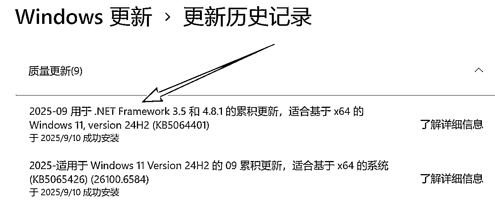

3、其它事项：目前这个提示词还不完善，例如整体的色彩有时候会随剧情偏暗，产生一种压抑的感觉，与我的印度猫咪母亲的受众人群，故事风格有些差异，还需要进一步调整修改。

也希望如果同样使用这种方法的伙伴一起交流学习提高。

10月11日补充更新：亲爱的读者，当你看到这里的时候，剩下的可以不用看，我对后面的内容进行了修改，在我的新帖子中，如链接所示。虽然下面的文章有点理论化，属于从企业管理视角下的一种解读。

10月14日补充更新：梳理了当下主要是在制作短视频流程的方法，并提供一种个人借鉴思路。

# 第三阶段（40天以后）

这一部分内容，写的比较理论，基于个人的专业，借用企业管理方面的理论模型，形成自己看待问题的系统方法。对于里面的设想都是一种假设。因为自己还处于第二阶段，对于youtube赛道的一种思考。

40天只是一个虚数，在做了很多的视频之后，就会思考我该选择什么样的赛道，这个赛道未来是否有钱赚，视频差异，YPP差异的背后是什么？我该如何设计自己赚钱的方式？

从最开始的找赛道到具体的实践，会遵循下面的几个步骤，整体的逻辑图如下所示：


当然上述模式有两个要注意的地方：

一是基于单一账号，随着技巧的提高，达到开通YPP等条件后，会不满足于第一个账号，会做矩阵，不断开通第二个账号，这里就需要考虑到不同的账号，也即是需要明确自己的成熟账号，成长账号，以及创新账号，也可以理解为，吃着碗里的，看着锅里的，想着地里的。这个后面会讲。

二是上述我用的是双向箭头，也就是说各个要素之间并不是一个顺序关系，而是一个互相印证的过程，主要是由于信息的不完善，要在实践中印证youtube所在的生态及变化是什么，以及不断修正自己的视频方向。

## 一、市场洞察

在生财中，我们看到有N8N，youtube，还是小红书，都是基于市场洞察后发现的大机会。

以Youtube为例，我们通过刷手机，viewsatas等工具都是为了发现一个又一个机会，通常有哪些角度呢？

看宏观：所谓的宏观，在youtube这样一个视频领域，更多的是理清楚有哪些规则与禁忌，暴力，色情等平台允许与不允许，开通视频的条件要求等等。这也是市场洞察的一部分。

看赛道：例如在，AI应用的赛道，如猫咪赛道，美国山海经赛道，KPOP赛道。之前生财的贴子中说，分析赛道好不好做，看这个赛道近期有没有千万的爆款，这也是一个很好的方法。

很多人说猫咪赛道很卷于是就换个赛道，找个高流量的赛道，但反过来想，当一个赛道很卷，做的人很多，意味着这个赛道的周期可能会很长，因为基数在那里。当基数大了之后，就需要细分市场，有的做猎奇类的猫咪，有的做女性减肥猫咪，而我则最近一段时间一直在做印度母爱为主题类的猫咪（中间会穿插一些其他的类型的视频，比如猫爸这种，但也极少）。

我不太了解流量推送背后的规则，我认为，尽量保持自己整个作品的一致性，如果一会做美国山海经，一会做KPOP，一会又做猫咪，而这些题材背后的用户群是不一样的，前期积累的订阅客户无法形成积淀。

看对标：也是看竞争对手，竞争对手有哪些好的地方，哪些大流量的视频，进行复刻。按照“抄、超、钞”的理论，对于小白而言，大部分都是停留在抄的阶段，抄无可厚非，但随着抄多之后，人的自主性就开始作怪，就觉得这视频做的不怎么样，我要开始改。对对对，做的太对了，然后，你就会看到流量下滑。我也一样，自己原创又创不了，效果也不好，并不是原创不行，而是能力还达不到。

之前eaton的贴子讲的挺好，20%创新，别想改太多，等觉得自己厉害一点之后，再碰的头破血流，往前走，毕竟当自己踩坑多了，成为大哥之后，就会发现那些小弟的视频有哪些需要调整的，怎么更好的精简浓缩实现爆款超越。

看客户：将客户进行分类，例如客户所在区域，RPM大小，用户基数，年龄情况，消费偏好等等。我最开始做的时候，观看用户主要是印度还有东南亚的人群，为了更加吸引印度人群，我将视频中的女主改为穿印度传统服饰的人群，迎合印巴群众，有一个视频语言是印度的乌尔都语，贡献了大概900多万的浏览量，过了一段时间看，我的受众也基本上是这类人群了。

印度流量总是很大，除了人口基数外这个因素外，其实也要考虑到人口素质问题。

我想生财的人群绝大多数是高中以上的学历，而对于老外来讲，大部分是连2+3等于6都还要想半天，认知水平非常差，可以说我们的认知水平是远超他们，这也意味着，我们可以看到有些无脑视频会火的因素之一。甚至是自己做的视频挺好，流量就是很差，可能原因就是”野猪吃不了细糠，不知天上人间“。把自己的视频调整一下，迎合目标受众即可。

看自己：这一部分，就是基于自身的能力，资源，比如自己的时间，金钱，人手，技术储备，经历，爱好进行判断。

基于上述五看（当然，五看只是从五个角度来进行，实际上，你也可以从其他角度来进行，基本质都是为了发现youtube所在的生态环境是什么样，以及我在这个生态系统中找到什么样的切入点）。

通过上述五看，最终目的是为了发现机会，通过形成很多的机会点，结合自己的意愿，风险偏好等因素，大致可以形成四类机会。

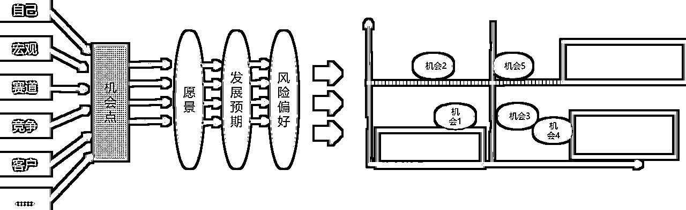

其实我在生财中，看到的一些风向标，其实就属于一些机会点，但这些机会点有大有小，还有时间窗口在里面，可能有的机会很大，但过了进入的最佳时期了。例如新能源汽车，机会的价值空间仍然很广阔，但现在错过了进入的最好时机了，不是说没有机会，而是再进去成本会非常高。

回到说Youtube，我看之前有两个视频非常火爆，一个是玻璃桌，一个是剪羊毛机器的（下图为类似的），视频时间非常短，不超过10秒，一个视频的播放量能够达到以亿为计算，当时也想去做，但后来发现，这个机会属于存疑机会：

一是空间不大，持续爆款的周期很短，今天可以剪羊毛，但明天剪什么？受众只是一时的好奇，过了这个时间点，观众就容易审美疲劳，就很难再有爆款了，持续性比较差。

另一个是难度高，可能大家会觉得这个7秒的视频有什么难的，制作上不难，难的是选题，我们只知道自己知道的，而不知道自己不知道的。能够做到自己知道自己不知道是件很难的事情。像剪羊毛，之所以爆火，我只能归为文化上的认知差。

下面还举了一个猫捉老鼠的视频，5秒视频，也和剪羊毛类似，看了一遍，再遇到类似的，浏览量就低了，且很容易被复制。门槛越低，其实门槛越高，因为马路人人都能走，但大家记住的还是跨越高峰的人。

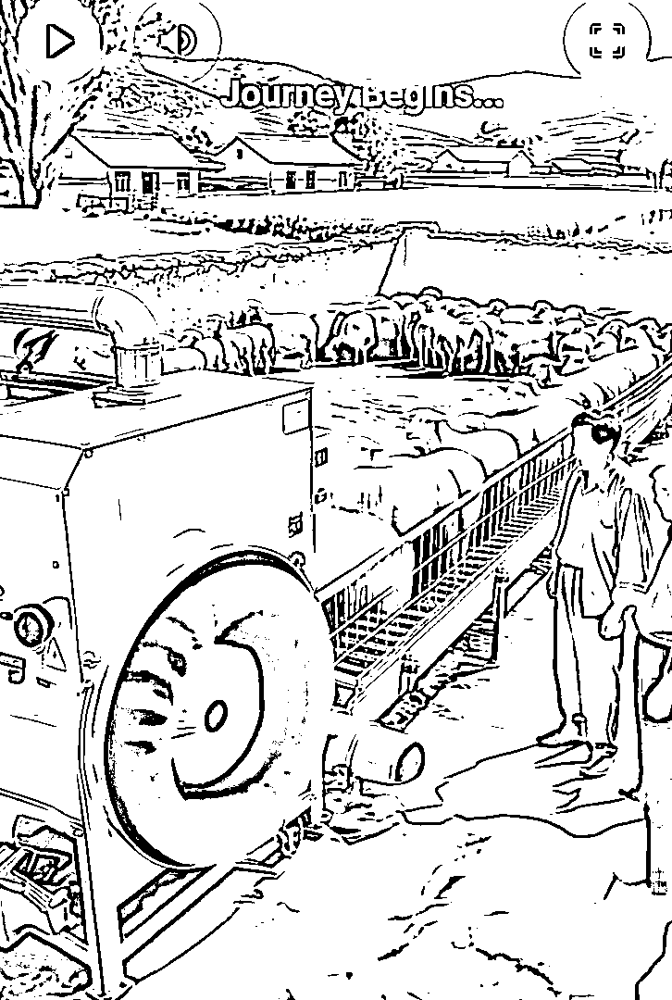

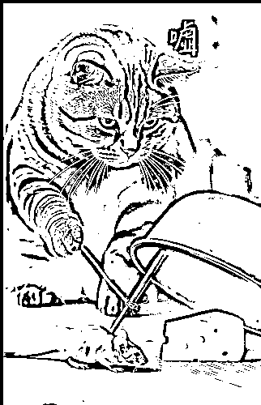

市场洞察的本质在于发现机会，而判断机会的好坏，源于自身的洞察力。

同样一件事情，为什么有的人能一眼看破发现机会，而有的人却怎么都看不透。我之所以用“市场洞察”，关键在于洞察二字，受限于主题原因，不展开细节，我直接上图：

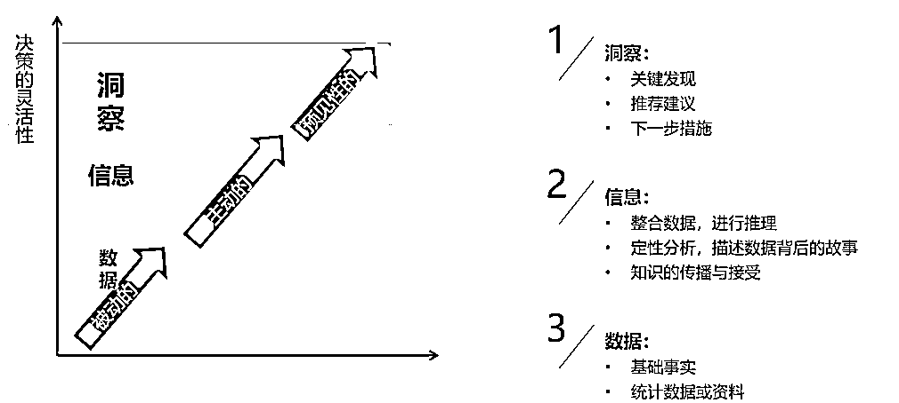

洞察是源于，从信息到数据，数据到知识，从知识到洞察的一个过程。有着深刻的洞察，在华为的《洞践》中提到，源于三个要素，总结前人的经验，自己的实践操作，以及理论知识。这里不深入讨论。

这也就是我从一开始鼓励大家去做素材积累与分析的原因，只有当自己每天把素材积累与分析作为基础动作，通过一次又一次的搜集，在这个过程中，大家对于所在赛道就会有更加强烈的感知，没有经历这个过程，是无法体验到赛道或者制作的美好细节，很容易像我这样进行空谈与假设。

## 二、业务设计

业务设计一词比商业模式设计出现的更为久远，源于亚历山大.奥斯特瓦德《价值主张设计》，在初级阶段其实不必要思考这些，甚至是说自己赚了几个亿，也不必思考业务设计（商业模式）是怎么样。懂不懂没关系。也可以跳过，甚至不看。这里作为自己复盘思路的一个思考。

规律本来就在那里，你看或者不看，它就在那里，不离不弃，不近不远。你做或者不做，用或不用，它也在那里。

商业模式最重要的是三个要素，即是客户选择，价值主张，盈利模式。


随着youtube视频制作进入了深水区，达到高级YPP后，我需要思考我该如何赚钱的问题。不再满足于每天1毛，2毛的收入。

从上述业务设计的角度来思考，我的客户是谁？我给他提供什么样的价值？以及如何赚钱的问题。

大部分人起号通常都是以印度客群占比较多，这类人群基数大，消费能力有限，认知水平也低，RPM值也最低，加上自己视频制作水平又不高，所以作为初级的试水，我们提供的是一种低价值低质量的视频。赢利方式也比较单一，至于你说在低消费人群的手上搞购物，搞带货，搞会员，整个国家连吃肉都成问题，能指望他能贡献多大的效益。

所谓低价值客户——提供低价值——低盈利模式

因此，随着自己技术水平的提高，在单人模式下，要想有高收益一定要将自己的客群瞄向高收益。当然你说你的流量基数很大，那也可以，一样可以在利基市场上活的很好。

以欧美为例，这类人群尽管基数不如印度，但消费水平高，认知水平虽然知道9*9等66，但基于整个发达国家的熏陶，最起码知道什么是细糠，什么是天上人间。那么我们需要提供的价值就要上一个级别，除了人物偏好外，以故事为例，包括你的剧情，视频质量等等都要提升。

难不成你想把300元的诺基亚卖给开尊界的大佬？

在提供了高价值的产品后，盈利模式除了一般的广告流量外，还有更多的赢利模式，带货，开会员，等等，这些都是后期摸索。

比如露酱写的 。

因为我的节点也不干净，没有找到youtube shopping插件，没有试成功，等我晚点调整了客户群也来得及。

我看生财里面这类写youtube带货的盈利方式的不多，然后可能是我没有搜索到吧。

所谓高价值客户——提供高价值——高盈利模式

当然，上述在youtube视频号内的盈利模式，如果扩展范围，像viewstats这类的洞察工具，视频工作流，API接口，甚至是当youtube教练等，都是一种围绕youtube展开的盈利模式，从自己做，到教人做，卖铲子等。

另外，有时我在思考，像拉丁美洲的是否有价值呢？这类人口基数也不低，像西班牙语，也有不少人口。但从谁来付钱的角度思考，即谁是我们的付款用户？最大的还是广告投放商，这些投放商通常是哪些企业？实力如何？由于没有数据，也不敢瞎判断。

但自己做的第一个账号，还是保守一些，做大概率的事，先在红海中历练，再去找好蓝海，以英语为主要频道为好。

## 三、任务实施

任务实施，就是做视频，在前两个阶段中，我们其实就一直在讲如何做视频，但这里再写其实就没有意义。我想提出个人的一些思考。

当然，如果是做流量路线，或者说做矩阵，大可不必搞这么复杂，照抄照搬微改就行。智猪博弈中，小猪跟着大猪混，不说吃个满，至少能吃个饱，更何况youtube基数足够大。

相信大家也发现了，随着新工具的不断升级，原先还是MJ，runway等工具，后面像banana，即梦4.0等工具，还有像纳米ai一键生成视频等等。工具越来越升级，我在想未来制作视频的难度将会越来越低，这背后比拼的是什么？讲故事的能力。

在我做短视频的内容中，我觉得有四个原则一定要注意。


### （一）逻辑性

在讲故事中，逻辑性是贯穿整个故事的主线，比如地面上是没有水的，但下一个分镜突然地上都是水，这种突然的情境，让顾客很困惑，不理解，如果没有在后续进行体现，这样的视频其实很难起量。比如说下面的例子，作为受众，我很难理解：小黑猫与黑猫本来是仇人，为何到后面又是成了一伙。很费解。我理解为作者对这一视频的逻辑性没有处理好，我预判这类视频不会成为爆款。

https://www.youtube.com/shorts/AgfNw6v9zac

### （二）一致性

一致性的问题不仅体现在视频中，也体现在整个账号的运营中。

最开始，做猫咪赛道，做猎奇，做亲情，虽然都是猫咪，都是比较乱，但后来看了后台数据，有个母爱类的数据特别好，加上客户群体也是印巴人口多，在后面的视频中，就进行了调整，全部以印度母亲赛道为例。并且人物的形象也是用印度人的服饰，无非是在不同的剧情换个衣服与主体形象。结果数据跑的还行。

包括我另一个哈士奇的号，也基本上保持哈士奇的搞笑类。

我在上面讲过，这样的好处是，积累的订阅人群也基本上是偏好这种题材的，目标一致的话，群体一致，形象一致，也更容易被youtube识别（我估计）。

以下面这个视频账号为例，早期都是这种猎奇恐怖类，但近期的类型非常多，数据也不如以往，一会KPOP，一会耶和华，还有川建国，似乎是把账号卖了，虽然粉丝多，但观看量似乎不太好。但也证明要注意一致性的问题。

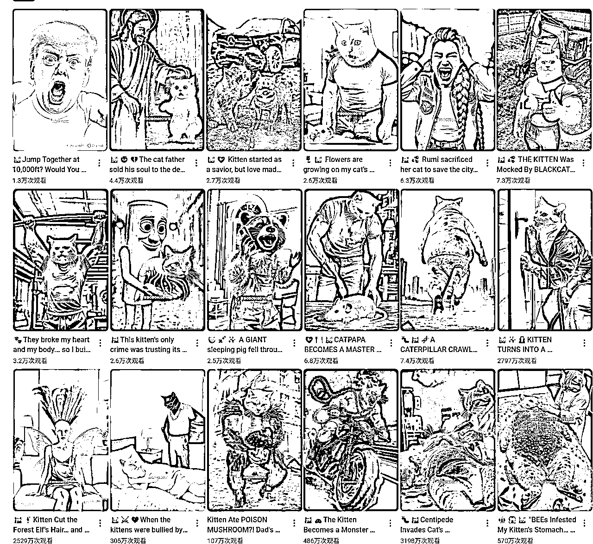

### （三）反差性

这里的反差性，主要是形象上的反差。让人不幸福的事情就是跟他人比较，让人幸福的事情也同样是跟他人比较。如果两个身材差不多的人站在你面前可能没有感觉，但一个很胖，一个很瘦，这样的人搭配在一起，就很搞笑，同样有的猫咪视频，例如一个少女肚子疼跪下，但远不如一个孕妇肚子疼跪下更能调动人的情绪。

这类例子很多，我看到有个账号，情节完全一致，就是换了一个衣服，我WTF，一招鲜吃遍天。当然，这也是一致性的体现。

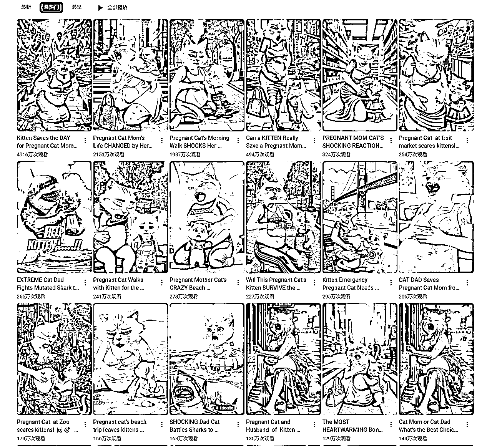

### （四）转折性

这个转折性，简单来讲就是不要让剧情太单一，让受众直接猜到结果，我在第一阶段中，用的素材分析的提示词已经比较详细的说明了这点，在实际操作中，对标一些爆款视频，可以进行认真体会。

还有两个，我觉得要说明一下。

一个是平民化，另一个是安全化

### （五）平民化

我们在进行市场洞察的五看时，在对客户进行分析时，可以发现，看这类youtube AI视频的人，其实都存在着放松，娱乐的想法，所以不要让受众猜测半天，这个道具是什么？那个道具是干什么的？我一小学毕业的你跟我说，这是工业风炮机，写出一大段的英文字母？我TM连he与she都分不清。

因此，在视频制作的时候，要尽量用直白的事物，在标题与说明中，也尽量用简单的英文单词。

我之前就是吃了这个亏，在做哈士奇视频的时候，用了一个道具，就是工地上的风炮机，其实我也不懂，AI建议的，受众很难明白，要费脑子的事情，就会出现厌恶感，同时一旦复杂，就会导致上述的逻辑性不够。因此，尽量贴近平民化的生活

另外，人都有向美向富向上的追求，健康，快乐，美丽是人的本质性追求，例如在人物塑造的时候，可以把角色塑造得更加漂亮，美丽，帅气，阳光一些。所谓剧情不够，形象来凑，起码你的角色如此美丽动人，大家也爱看。

### （六）安全性

这个安全性在进行机会筛选时，就要考虑的，其实是风险问题。

生财里面感觉介绍风险方面的专业帖子不多，当然每个人的风险偏好其实不同。下面这个链接与Youtube无关，只是觉得要有风险意识挺好的，要给自己留下一个底线思维。 。

回到youtube，把youtube账号当做长期做的项目的话，我觉得还是要注意一下，涉及到一些真实的人，如川建国，梅西这种我是离的远远的，指不定哪天账号被封了，尤其是做到后面，有非常多的粉丝时候，就有很大风险。

有些视频为了流挺而走险，但随着订阅量不断增加，有一些老视频，自己都忘掉的含有暴力与血腥的内容被爆出来，结果得不偿失，被封，所以不如慢一点。甚至于一些血腥，甚至虐待动物的，如某个猫妈妈，拿棍子打小猫，我做了一次，但把其中的暴力删掉了。我胆子小，后面我会尽量远离做这些暴力，血腥的。尽量传播一些正能量的东西。

真是活的越老，胆子越小。

## 四、工具应用

工具应用贯穿始终，像逸尘的这个贴子中，我觉得写的比较详细了，无论是从前期的市场洞察工具，还是后面的视频分析与制作，甚至说是工作流，自动化等，都有挺好的借鉴意义。

## 五、补充说明

上述，从市场洞察——业务设计——任务实施——工具应用，只是作为单账号下的深耕，所谓狡兔三窟，永远要给自己留条后路。要进行多账号的设计。

在单人模式下，可能一个人用三个账号就够了。当然如果你要是有批量化的工具，能非常快的产出，那真是太好了，可以进行更多的账号。

像我这种小白，我也是一个主账号，另一个是副账号，还有一个创新类账号发了一两条视频，白天上班，晚上回头搞，也没时间弄。

但总体账号的设置规律，我在前面讲过，吃着碗里，看着锅里，想着地里。不是说等一个账号做成熟了再做第二个，而是跑通了之后就要开始着手准备，我是在过了初级YPP的前几天，就注册了新的账号，后来又陆续注册了两个，但运营一个副的就很吃力了，断更了几天。

对于不同的账号可以按照721，631等精力酌情分配。

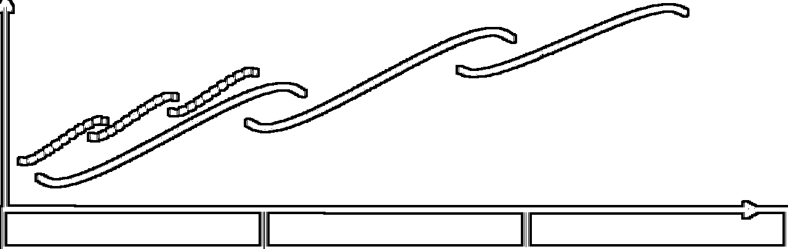

上面的图片源于三层面理论。

# 写在最后

基于工作与专业特点，写的有点理论化，但也无妨，给大家提供一种思考思路。正如《管理学研究的悖论》中提到，当理论和实践打架的时候，倒霉的必定是理论。没有什么比实践来的教训更为深刻。

有时候做多了猫咪视频，便会产生一种拥有感，甚至是非常珍视这种感觉，甚至为其所陶醉，或许要回归到最初的想法上，我只是来赚钱的，顺便做一做视频，别陷入太深。如果哪一天账号没有了，也坦然对待，本就不属于我，我只是在youtube上标记了个记号，转瞬即逝。

借用孔见先生的一句话：无独刀剑，各种事物都隐含着特定的功能目标和意志追求，特别是那些被人制造出来的东西，在出身之时就被赋予某种意向。由于初始的目标意向，事物本身处于尚未完成状态，存在着对称性破缺，或者说圆满性破缺。因此，它具有一种自我完成的倾向和属性。当人拥有某种事物并消受它带来的恩惠时，隐藏在其中的倾向性就附着于人的心灵，给予某种持续的心理暗示。这种暗示在不知不觉中强化起来，并最终偷换人的意志，让人乖乖听命于它的调度和派遣，还以为是来自自己内心的呼唤，以为是一种天职或神秘的天意。