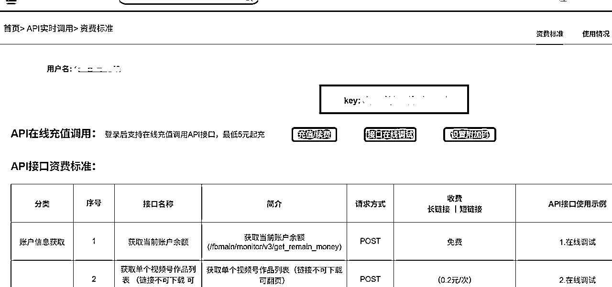
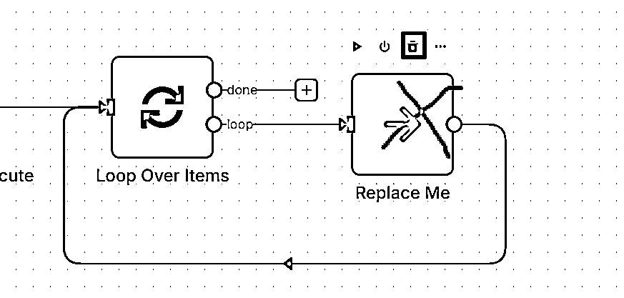
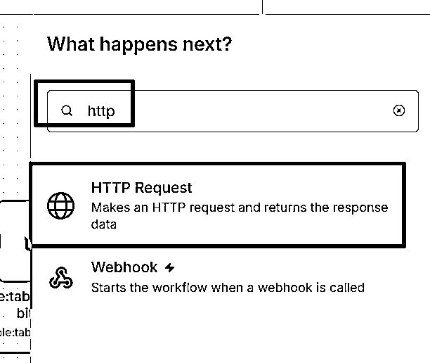
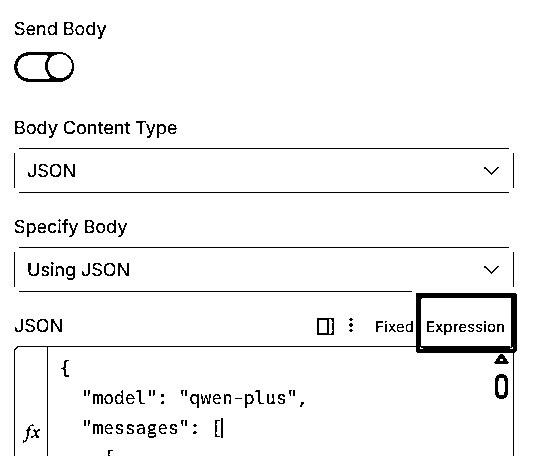
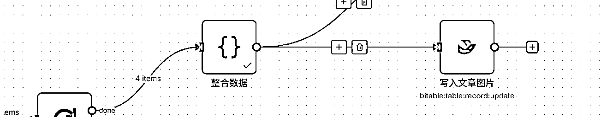
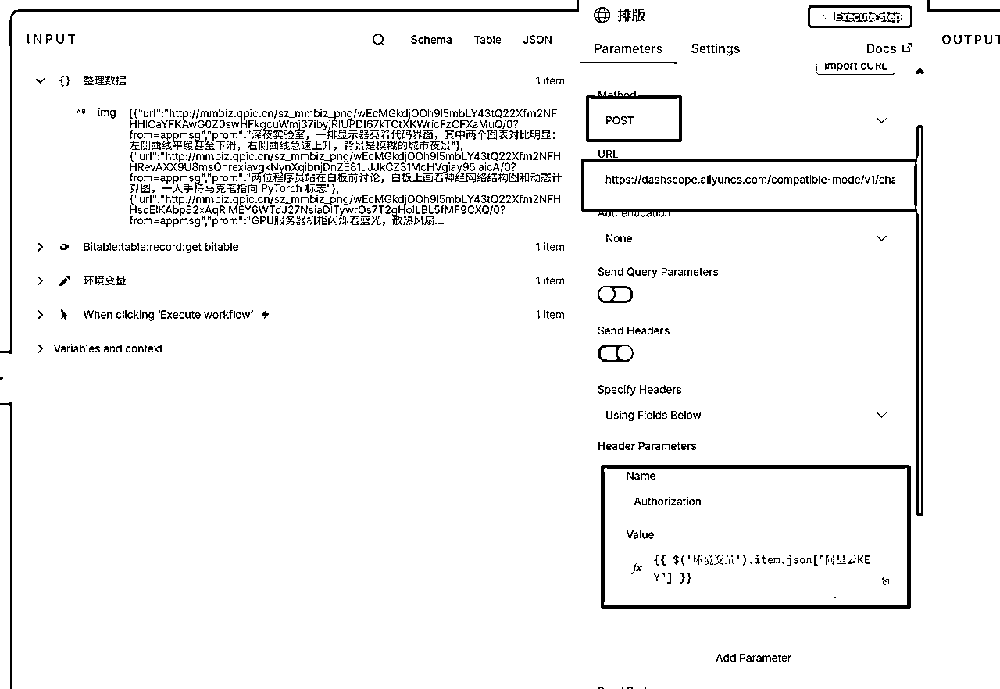
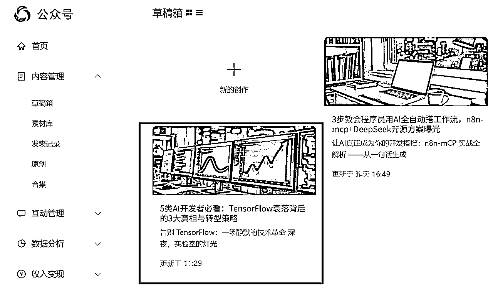

# 垂直小号 + n8n工作流，让公众号创作效率提升10倍 (附搭建全流程，小白也能轻松复刻)

> 来源：[https://a0u2vshvubw.feishu.cn/docx/UnPHdrxF7oOs9AxSjuIc0rlRnKg](https://a0u2vshvubw.feishu.cn/docx/UnPHdrxF7oOs9AxSjuIc0rlRnKg)

7月20日，亦仁大佬发布了【垂直小号】超级标，全场沸腾。

8月19日，亦仁大佬发布了【N8N】超级标，群情激昂。

9月4日，大航海开启，【垂直小号】报名4165人，【N8N】报名人数3778人，分别位列航海报名人数榜第一和第二名。

作为地表最强搞钱社群，这么多高认知圈友的选择，就已经说明了一切。

在920生财AI大会上，我看到了这用N8N做的公众号工作流，非常震撼。

那我就在想，如果把这两个超级标进行一个融合，会发生怎样的故事呢？

耗时2天，终于把这套自动写垂直小号的N8N工作流系统搭建起来了。

今天这篇教程，我将手把手带着你如何从0开始，搭建一个从灵感收集到选题，再到收集素材，再到写作，再到AI作图排版，最终直接出现在你个公众号草稿里全流程。

# 前情提要：

1、由于这个系统功能较多，实现起来特别复杂，所以我进行了简化，当可以多种方式实现一个功能的时候，只讲一种实现方式，但是整个流程是完全跑通。

2、考虑到多次测试，数据量较大的情况，我这里使用的API接口，主要是国产API，在学习阶段可以，但是真正商用还是建议大家用国外的大模型，效果会更加优秀，在结尾我会放上常用API模型替换教程。

3、由于整个工作流非常庞大，所以我拆分成了6个小工作流，

一方面是考虑到AI是辅助我们，而非取代，在一些关键决策需要进行干预，

另一方面即便是想要实现一键出文章也可以通过 Execute Workflow 节点把他们串起来，就像乐高积木一样灵活。


4、工作流主要流程：

输入关键词 ——> 批量爬取近期指定关键词的公众号文章按照阅读量从高到低 ——>

用AI分析这些文章的爆款潜力并打分以及给出理由 ——> 选择自己中意的文章作为初稿素材 ——>

AI分析用户画像和文章目标 ——> 根据选定的初稿素材和用户画像、文章目标提取关键词，采集更多素材 ——>

根据素材、初始文章、用户画像、文章目标让AI编写新的文章 ——> 根据新写文章由AI批量生成图片 ——>

通过AI把图片插入文章合适的位置并排版 ——> 保存至微信公众号草稿。

注意：N8N自动发布文章订阅号没有权限，只有服务号才可以。

# 准备工作：

## 一、飞书多维表格

### 1、创建多维表格

点击 https://a0u2vshvubw.feishu.cn/drive/home，进入飞书文档页，不要直接去创建，点击云盘。


进入后，创建多维表格。


创建成功后，直接点击右上角三个点的导入，把我的多维表格模板导入。


下载导入表格模板：

等右下角导入完成，点击跳转图标。


进入到我给你的多维表格模板，直接看【地址栏】把两个下划线位置的信息保存小本本：


示例：

表格Token：IciJbr2t9aftmtsPlFyc0pAJn6g

表格ID：tbledwLbDpLueWsT

不要照抄我的，你自己的地址栏是什么，你就写什么。

前者是表格token，后者是表格ID，后面有大用处。

### 2、配置机器人

这里考虑到不是所有人都参与了航海，所以我讲下飞书表格要怎么去配置以及机器人的创建和使用。

进入飞书开发平台：

如果没有下面页面，可以点右上角开发者后台，进来之后点 创建【企业自建应用】，我们所有对N8N对飞书的操作，本质都是给这个机器人发请求，这个机器人去帮你操作多维表格。


创建机器人名称和简介随便写。写完直接点创建。


然后开通【云文档】所有权限和【多维表格】所有权限：


然后点【版本管理与发布】，选择右上角的【创建版本】


输入版本号 1.0.0


保存之后立即发布。


发布成功后 点击 【凭证与基础信息】，把你的 App ID 和 App Secret 复制到小本本。


示例：

App ID： cli_a85f8e49c3f81013

App Secret： XXXXXXXXXXXXXXX

### 3、机器人绑定多维表格

总算是最后一步了，我们回到刚才导入的多维表格，点右上角三个点，选择【更多】，然后选择【添加文档应用】


然后搜索你刚才给机器人起的名字，点击机器人。


确定权限是【可编辑】，然后点击 添加。


关掉弹窗，飞书的配置，我们就暂时搞定了，下面我们来配置微信公众号。

## 二、微信公众号

重要通知：很多人反馈，这个拿不到appid，要认证啥的。

其实都不用，公众号实名就行。

直接去公众号后台获取下面这些东西就行，在开发接口管理里面。

进入微信开发平台，https://developers.weixin.qq.com/console/ 扫码登录，必须是绑定公众号的微信号扫码。

点右上角【我的业务和服务】点击【公众号】


### 1、获取 AppID 和 AppSeret

把AppID 和 AppSeret 记录在小本本，如果看不到AppSeret 就重置一下。


### 2、配置白名单IP

点击 API IP白名单的编辑


如果你是云服务器部署，这里直接写你的服务器IP，

如果你不知道服务器IP或者是本地部署，直接写： 0.0.0.0/0


点击确定，微信公众号的配置就算完成了。

## 三、其他API接口

### 一、获取AI大模型key

进入 https://bailian.console.aliyun.com/?tab=model 登录

点击左下角【密钥管理】创建密钥，保存到小本本。


### 二、获取素材抓取API key

进入 https://metaso.cn/ 登录后，点击 API


保存 API key ， 下图红色框。


### 三、极致了数据API key

进入 https://dajiala.com/ 扫码登录绑定手机号，这个接口主要是爬微信公众号文章。

点击【公众号API管理】


红色框就是 API Key ，记得保存。



踩坑点：这个网站只送一块钱，根本不够用，建议初次多充值点，因为第二次必须充值200以上，特别坑！！！！


## 四、安装飞书节点

1、点击左下角的【设置】


2、点击【 community nodes】


3、点击【 install a community node 】

注意：如果这里没有按钮，可能是因为用的云托管，是没有权限安装飞书节点的。

可以尝试下面两种方法，均可安装飞书节点：

本地部署N8N，无需docker：https://scys.com/articleDetail/xq_topic/4845128821211528

云服务器部署N8N，无需docker：https://scys.com/articleDetail/xq_topic/5124212852858214


4、在弹窗的文本框输入 【n8n-nodes-feishu-lite】 点击安装就好了。


笑死，写了半天，才把准备工作写完........... 感觉写完1w字起步了。

# 正片开始：

## 一、选题灵感（输入关键词爬同行文章）


### 1、新建工作流，点击加号，添加 SET 节点。


作用：这个节点的作用就是存一些后面要用到的信息，比如 API key、表格token、表格ID等等。

进去之后，点 Add Field , 填写下面的信息：

【关键词】 就是你要做哪个领域的文章，这个关键词决定整个工作流最终写的文章主题，你做什么主题就填什么关键词。

【抓取条数】就是你想抓多少条文章，最少填20，必须是20的整数倍，比如20、40、60、80、100、120等等，初次这里不要写太多，因为每抓一次都是有费用的。


填完之后，点击右上角的 【Execute step】 运行当前节点。如果输出有数据，关闭当前页面，进行下一步。

### 2、添加 code 节点，控制循环次数。


输入代码：

```
const pageSize = 20;
const total = Number(items[0].json['抓取条数'] || 20); 
const pages = Math.ceil(total / pageSize);           
const keyword = items[0].json['关键词'];
const apiKey  = items[0].json['极致了API密钥'];
return Array.from({ length: pages }, (_, i) => ({
  json: { page: i + 1, keyword, apiKey }
}));
```


整个代码的意思是构建多个元素的数组，因为只有多个元素数组才能触发循环。

我们用 http节点 抓取一次数据是20条，如果抓100条就需要抓5次，也就是5页，要循环五次。

但是我们开始写的是抓20条，所以运行一次就好了。

点击右上角的 【Execute step】 运行当前节点。如果输出有数据，关闭当前页面，进行下一步。

### 3、添加循环节点


这里不用改动，直接返回，继续添加节点。


删除 Replace Me 节点



后面我们要加节点，都点下面那条线的加号。


### 4、添加 http 节点，调用接口爬公众号数据。



修改如下图：


URL：https://www.dajiala.com/fbmain/monitor/v3/kw_search

JSON：

```
{
    "kw": "{{$json.keyword }}",
    "sort_type": 1,
    "mode": 3,
    "period": 7,
    "page": 1,
    "key": "{{ $json.apiKey     }}"
}
```

这些参数什么意思呢，看接口文档：

https://s.apifox.cn/410674f9-f451-4b4f-957a-5f54f243bc83/199754666e0


易错点：

1、JSON里正常应该是绿色或者白色背景，如果你是红色，那你看看左边有没有数据，如果没有数据就把上个节点运行一下。


2、JSON里，写的内容大多是变量，所以必须选择【Expression】而不是【Fixed】。



注意：后面每个节点设置完，都记得点一下 右上角的 【Execute step】，后面不再提醒了。

如果出现以下提醒，说明你该充钱了。


如果想知道返回的参数是什么意思就看文档吧。


### 5、添加 code 节点，把json字符串变成json对象，方便后面取值。


Code:

```
const input = $input.item.json;

// 如果顶层是数组 [ { code:..., data:[...] } ]
const arr = Array.isArray(input) ? input[0].data : input.data;

// 直接返回 data 数组
return arr;
```

运行成功之后是下面这样：


### 6、添加飞书节点，把抓到的数据存多维表格。


选择新增记录：


配置飞书节点：把小本本存的东西写上去，先配置凭证。


请求体JSON：

```
{
  "fields": {
    "标题": {{ $json.title.toJsonString() }},
    "文章链接": "{{ $json.short_link }}",
    "正文": {{ $json.content.toJsonString() }},
    "发布时间": "{{ $json.publish_time_str }}",
    "阅读量": {{ $json.read }},
    "点赞数": {{ $json.praise }},
    "再看数": {{ $json.looking }},
    "分类": "{{ $json.classify }}",
    "公众号名称": "{{ $json.wx_name }}"
  }
}
```

表格是导入的，代码是复制的，所以出错的机率几乎为0，唯一的问题就是你忘记充钱咯。

最后把循环连线闭环，你就可以点击最下面的大【Execute step】按钮，整体运行一次咯。


然后打开飞书多维表格，感受一下循环写入数据的快感吧！！！


至此，恭喜您，完成第一阶段，爬取到同行爆款文章数据。

新建一个工作流面板，进行第二个工作流的制作。

## 二、确定选题+内容定位（AI对抓取的文章进行爆款潜力、用户画像分析，提取文章关键词）


### 1、老样子，添加一个Set节点，写后面要用的信息。


### 2、添加飞书节点，读取表格数据。


圈友@诸葛莉Lily反馈这里报错：

解决方案：请求体JSON里的大括号不能删除，必须要有。

初始内容可能不一样，把里面的内容删除，只留下外层的大括号就行了。


### 3、添加code节点，提取有用数据。


code：

```
const rows = $json?.data?.items ?? [];

function pickText(v) {
  // 常见格式：[{text:"xxx"}] -> "xxx"；多值就用逗号拼
  if (Array.isArray(v)) {
    if (v.length && typeof v[0] === 'object' && v[0] && 'text' in v[0]) {
      return v.map(x => x.text).join(',');
    }
    return v; // 不是对象数组就原样返回
  }
  if (v && typeof v === 'object' && 'text' in v) return v.text;
  return v;
}

const out = rows.map(r => {
  const f = r.fields || {};
  const obj = {};

  for (const [key, val] of Object.entries(f)) {
    if (key === 'ID') {
      // 特殊：ID 只要 value[0].text
      obj[key] = val?.value?.[0]?.text ?? null;
    } else {
      obj[key] = pickText(val);
    }
  }
  return obj;
});

// ✅ 让 n8n 输出成一条条 item（最方便后续节点用）
return out.map(o => ({ json: o }));
```

### 4、添加循环节点。

因为我们每次AI只能读一行列表数据，所以我们要循环的发请求去读取每一行的数据。


### 5、添加code节点。

作用：把json对象变成json字符串，方便给AI投喂。


Code:

```

const items = $input.all(); 
// 假设目标数组在 items[0].json.data.items 或者 items[0].json.fieldsArray
const arr = items[0].json?.data?.items ?? items[0].json?.fields ?? items.map(i => i.json);

// 将其序列化为字符串（漂亮格式，便于调试）
const str = JSON.stringify(arr, null, 2);

// 返回一个字段 stringified 供下游引用
return [{ json: { stringifiedArray: str } }];

```

### 6、添加http节点。

作用：把每行的表格数据喂给AI，让AI分析爆款、用户画像、文章目标等等。


知识点：点击左侧的下拉选择，可以切换之前的节点，并且可使用之前任意节点跑过的数据。


这里我们把之前环境变量里的 AI key 拖过去直接使用即可。


URL: https://dashscope.aliyuncs.com/compatible-mode/v1/chat/completions

JSON:

```
{
  "model": "qwen-plus",
  "messages": [
    {
      "role": "system",
      "content": "You are a helpful assistant. When given a JSON array of article items, parse the array and evaluate each item for viral potential. Follow the user's output schema exactly and do not produce any extra commentary—only return valid JSON."
    },
    {
      "role": "user",
      "content": "你现在的任务是：给定一组数据包含 ID、标题、正文、发布时间、分类、点赞数等信息，分析爆款潜力、用户画像、文章目标、关键词。你的输出要求：为每条文章打一个 爆款评分（0–100，越高越容易成为爆款）。给出一句话的 爆款理由。 给出用户画像和文章目标。提取文章的核心关键词。输出格式：必须是一个 JSON ，字段为：{ 爆款指数: 0~100数字 , 爆款理由:'XXXXX', 用户画像:'XXXX',文章目标:'XXXX',关键词:'XX XX XX' } 约束条件：只输出纯 JSON，不要解释文字。缺失信息时用合理缺省值（比如分数为 0，理由留空）。文章如下："
    },
 {
      "role": "user",
      "content": {{ JSON.stringify($json.stringifiedArray)}}
}
  ]
}
```

### 7、添加code

作用：因为AI返回的JSON数据百分百是JSON字符串，如果我们想拿到具体的值，必须写代码解析成JSON对象。


```
const resp = $json;
let raw = resp?.choices?.[0]?.message?.content ?? '';

// 去掉代码块 ```json ... ``` 包裹
raw = raw.trim();
if (raw.startsWith('```')) {
  raw = raw.replace(/^```(?:json)?/i, '').replace(/```$/, '').trim();
}

// 尝试直接 parse
let parsed;
try {
  parsed = JSON.parse(raw);
} catch (e) {
  const startObj = raw.indexOf('{');
  const startArr = raw.indexOf('[');
  const start = (startObj === -1) ? startArr
              : (startArr === -1) ? startObj
              : Math.min(startObj, startArr);
  const endObj = raw.lastIndexOf('}');
  const endArr = raw.lastIndexOf(']');
  const end = Math.max(endObj, endArr);
  if (start >= 0 && end > start) {
    const slice = raw.slice(start, end + 1);
    parsed = JSON.parse(slice);
  } else {
    throw new Error('No valid JSON found in content');
  }
}

// 🔑 确保只返回一个对象
if (Array.isArray(parsed)) {
  return { json: parsed[0] };
} else {
  return { json: parsed };
}

```

### 8、添加飞书节点。

作用：我们已经拿到爆款指数、爆款理由、用户画像、文章目标，下面用飞书节点更新到表格里。


注意：后面这个表格写 token和ID 你就切回环境变量，拖拽就行了，后面不再演示，还不会的往前看。

因为我们这里是循环，所以每次的记录ID是不一样的，所以我们要切到循环节点，取到每行的ID.


在循环前面的code节点也可以取到每行的ID.


请求体JSON：

```
{
  "fields": {
    "AI爆款指数":{{ $json["爆款指数"]}},
    "AI爆款理由":"{{ $json["爆款理由"]}}",
    "用户画像":"{{ $json["用户画像"] }}",
    "文章目标":"{{ $json["文章目标"] }}",
    "关键词":"{{ $json["关键词"] }}"
  }
}
```

最后把循环连线闭环，你就可以点击最下面的大【Execute step】按钮，整体运行一次咯。

因为有20条数据，要调用AI 20次，所以需要些时间，可以切回多维表格，看数据一行一行蹦出来，超级解压。

等执行结束，你将看到新增的数据。


至此，恭喜您，完成第二阶段，对爬取的文章数据进行AI分析以及文章关键词的提取。

## 三、素材收集 (通过API抓取和文章关键词相关的信息)


这个时候注意了，我们就要根据AI返回的信息，去判断我们到底想以哪篇文章为初稿写内容，

把你想让AI写文章的那一行数据最前面的ID存在小本子上。

我们选一个感觉不错的文章，然后记住最前面的ID，存起来。


### 1、添加Set节点，设置环境变量，把后面要用的信息写入。

表格token和表格ID就不讲了，这个选中文章ID就是你上面选择的想以哪篇文章为初稿的ID.

搜索接口key 这个之前是存到小本本的，就是那个【秘塔搜索】拿出来用就行，注意格式：Bearer keyxxxxxx ，Bearer+空格+key。


### 2、添加飞书节点，通过ID读取记录。

后面的所有操作其实都是针对我们选中的那行(hang)进行读取，所以后面的节点读表格都需要行ID。


同理，拖拽。


### 3、添加code节点。

作用：从读取到的表格信息中把文章关键词提取，方便后面搜集素材。


Code:

```
const raw = $input.first().json.data.records[0].fields["关键词"]?.[0]?.text ?? "";

const keywords = [...new Set(
  raw.replace(/\u3000/g,' ')
     .replace(/[，。、“”‘’：:；;、|｜·\t\r\n]+/g,' ')
     .split(/\s+/).map(s=>s.trim()).filter(Boolean)
)];

// 变成 [{ keyword: "XX" }, ...]
return keywords.map(k => ({ json: { keyword: k } }));
```

### 4、添加循环节点。

作用：因为我们不是只有一个关键词，我们每个关键词都要搜一段素材出来，所以必须用循环节点。

### 5、添加http节点。

作用：调用接口获取素材信息。

这里的参数我就不讲了，怎么来的之前都讲过了。


URL : https://metaso.cn/api/v1/search

JSON：

```
{
"q":"{{ $json.keyword }}",
"scope":"webpage",
"includeSummary":true,
"size":"1",
"includeRawContent":true,
"conciseSnippet":true
} 
```

### 6、把获得素材后的节点和循环节点的前面相连，形成循环，后续的节点都要写在done后面。


因为我们要等循环把关键词的素材都拿到了才能进行拼接和写入飞书表格，有时间顺序的，

而done 就是恰好完成的时间。

### 7、添加code节点

作用：把抓到的素材拼接到一起，方便写入表格。


Code：

```
// 收集所有 item 的 webpages[].content
const items = $input.all();

const contents = items.flatMap(it => {
  const pages = it.json?.webpages ?? [];
  return pages
    .map(p => p?.content || p?.summary || "")
    .filter(Boolean);
});

// 清理：去掉 URL 和 Markdown 链接
const cleanContents = contents.map(c => {
  return c
    // 去掉 markdown 链接 [文字](http://xxx)
    .replace(/\[.*?\]\(https?:\/\/.*?\)/g, "")
    // 去掉裸露的 http/https 链接
    .replace(/https?:\/\/\S+/g, "")
    // 去掉多余的空格
    .trim();
});

// 拼接成一个大字符串，用换行隔开
const combined = cleanContents.join("\n\n");

// 从“人工选中文章”节点取 token 和 ID
const src = $('环境变量').first().json;
const 表格token = src['表格token'];
const 表格ID = src['表格ID'];
const 记录ID =$('环境变量').first().json.selected

return [{
  json: {
    表格token,
    表格ID,
    记录ID,
    合并内容: combined
  }
}];
```

### 8、添加飞书节点，保存抓取的素材。


请求体JSON:

```
{
  "fields":{
  "素材":{{ $json['合并内容'].toJsonString() }}
  }
} 
```

运行飞书节点，就可以看到素材插入多维表格了。


恭喜您，完成了第三个阶段，素材收集。

## 四、文章写作（AI根据已有信息写文章）


### 1、添加SET节点，存放常用信息。

没什么可讲的，这几个都是老熟人。


### 2、添加飞书节点，根据ID读取记录

这也老熟人了


### 3、添加code节点。

作用：这里的代码是把读取表格有用的数据，比如初始文稿、标题、爆款理由、素材等内容拼接到一起。


Code:

```
let a = "爆款理由：" + $input.first().json.data.records[0].fields["AI爆款理由"][0].text+"|"
let b = "文章目标：" + $input.first().json.data.records[0].fields["文章目标"][0].text+"|"
let c = "参考文章：" + $input.first().json.data.records[0].fields["正文"][0].text+"|"
let d ="用户画像："  +  $input.first().json.data.records[0].fields["用户画像"][0].text+"|"
let e = "素材：" + $input.first().json.data.records[0].fields["素材"][0].text+"|"

return [{
  data:a+b+c+d+e
}]
```

### 4、添加http节点。

作用：把前面拼接的数据喂给AI，让AI创作。


URL: https://dashscope.aliyuncs.com/compatible-mode/v1/chat/completions

JSON：

```
{
  "model": "qwen-plus",
  "messages": [
    {
      "role": "system",
      "content": "You are a helpful assistant. When given a JSON array of article items, parse the array and evaluate each item for viral potential. Follow the user's output schema exactly and do not produce any extra commentary—only return valid JSON."
    },
    {
      "role": "user",
      "content": "你是一名资深新媒体写作专家，擅长公众号爆款文章的拆解与创作。我将提供以下信息：1\. 同行文章（作为参考，分析其结构和亮点，但不能抄袭）。2\. 爆款理由（同行文章为什么能火的核心要素）。3\. 用户画像（目标读者是谁，他们的兴趣、痛点、需求）。4\. 文章目标（比如：引发共鸣、提供干货、塑造权威、带动转化）。5\. 关键词（文章必须包含的核心词）。6\. 素材（文章可用的数据、案例、故事、观点）。你的任务：1\. 根据以上信息写一篇【公众号原创文章】，必须原创，不能照搬同行文章。2\. 借鉴同行文章的爆款元素（如开头钩子、节奏感），但要用新的表达方式。3\. 文章要求：- 结构清晰：强烈代入感的开头、分点论述的正文、总结或行动号召的结尾。- 文风亲和、有温度，贴近目标用户的阅读习惯。- 内容既有干货信息（数据、案例、观点），又能引发情绪共鸣。- 自然融入关键词，避免生硬堆砌。内容里不要写标题，单独写标题。4、标题要求格式为[数字]+[人群]+[痛点]+[解决方案]=爆款标题。  输出要求：- 必须输出为 JSON 格式，结构如下：{ 'htmlContent': '这里放完整的 HTML 文章','content':'这里写正常的文章，内容和html一致，只是去掉标签，方便阅读。',Prompt':[{'text':'这里放图片提示词（只描述画面，不要文字）'},{'text':'...'}],title:'根据文章生成的爆款标题。'}- 具体规则：1\. 'content' 部分必须是完整的公众号文章，使用 HTML 格式（包括标题、开头、正文、总结）。2\. 'Prompt' 数组中必须包含至少 3 个以上插图点，每个对象里有详细的图片提示词。3\. 图片提示词只描述画面场景或氛围，禁止出现文字（如海报、文案等字样）。4\. 生成时不要输出任何解释说明，不要有 Markdown 代码块，只能输出符合要求的 JSON。5、文章的字数2000字左右。6、htmlContent和content开头不要写标题，直接引入开头场景。"
    },
{
      "role": "user",
      "content": {{ $json.data.toJsonString() }}
    }
  ]
} 
```

注意：这里的提示词你可以根据自己的要求优化调整，但是请注意，在双引号内，不得再出现双引号，否则报错。

另外这个节点有点慢是正常情况，因为输入输出处理的数据很多。

### 5、添加code节点。

作用：这里应该不用我多说了吧，每次请求AI，AI回应的都是json字符串，不能直接用，我们需要变成json对象，才能把我们想要的值取出来，相当于航海手册的 格式控制节点。

```
// n8n Code Node (JavaScript)

// 拿到原始 JSON 字符串
const raw = $json["choices"][0]["message"]["content"];

// 解析成对象
let parsed;
try {
  parsed = JSON.parse(raw);
} catch (e) {
  throw new Error("解析失败: " + e.message);
}

// 把 Prompt 数组转成字符串
// 比如拼接成多行，每行一个提示词
let promptStr = "";
if (Array.isArray(parsed.Prompt)) {
  promptStr = parsed.Prompt.map(p => p.text).join("|");
}

// 给解析结果加一个字段
parsed.PromptString = promptStr;

// 输出结果
return parsed;

```

### 6、添加飞书节点，更新记录。

作用：把AI创作的文章存到飞书。

注意：

这里存了两份一份是html版本，还有一份是纯文字版本。

你想让微信公众号有排版必须用html版本，浏览器会解析这些标签，

这些标签包含 字体大小、颜色、段落、行间距、字间距、标题等等排版。

纯文字版本是方便给你看AI写了个啥。


请求体JSON：

```
{"fields":{
  "html原创正文":{{ $json.htmlContent.toJsonString() }},
"原创正文": {{ $json.content.toJsonString() }},
"图片提示词":{{ $json.PromptString.toJsonString() }},
"原创标题":{{ $json.title.toJsonString() }}
}}
```

整体运行一遍，你的表格会新增以下四列数据。


恭喜您，完成了第四阶段，AI创作文章以及图片提示词。

## 五、AI创作图片


### 1、添加http节点

懵了吧! 这里一般都是set节点，怎么这次变成 http节点了？

是这样的，有两个原因：

第一、这个子工作流我们是要让AI作图，那为了方便后续插入文章，我们最终是需要把图片变成网络路径的，而我们这里要用户微信公众号里的图库作为存储的地方，你可以理解成图床，那要把我们的图片上传之后得到网络路径，上传的需要accessToken，这个东西就是你的令牌，是为了让微信知道哪个图是哪个人传的，有令牌了，你才有上传图片到微信公众号图库的权限。

第二、我们最终把文章上传到草稿需要一个封面ID，获得这个封面ID也必须要acceccToken。

获取acceccToken也是相当的简单，一个 GET 请求搞定。


URL ： https://api.weixin.qq.com/cgi-bin/token?grant_type=client_credential&appid=你的微信公众号AppId&secret=你的微信公众号密钥

注意：请把黄色背景文字替换成你真实的AI和密钥，不要直接复制，如果你不知道写什么，打开你的小本本！！！

运行之后，你就会得到 accessToken。

### 2、添加Set节点。

这几个都是老朋友，不过多介绍。


### 3、添加飞书节点，通过ID读记录。

也是老朋友，不介绍。


### 4、添加code

作用：提取图片提示词数据，构建数组。


Code:

```
const text = $input.first().json.data.records[0].fields["图片提示词"][0].text

const parts = text.split("|");  // 按 | 分割

const result = parts.map(p => ({ prom: p.trim() }));

return result.map(r => ({ json: r }));

```

### 5、添加循环节点

作用：因为这里是多个图片提示词，所以我们需要循环去生成图片。

### 6、添加http节点

作用：调用AI接口，生成图片。


URL: https://dashscope.aliyuncs.com/api/v1/services/aigc/multimodal-generation/generation

JSON:

```
{
  "model": "qwen-image-plus",
  "input": {
    "messages": [
      {
        "role": "user",
        "content": [
          {
            "text": "{{ $json.prom }}"
          }
        ]
      }
    ]
  },
  "parameters": {
    "negative_prompt": "",
    "prompt_extend": false,
    "watermark": false,
    "size": "1664*928"   
  }
}
```

### 7、添加http节点，下载图片。

作用：当我们执行上一个节点的时候，AI会给一个图片的下载链接，这个链接是临时的，所以我们要下载图片。

这里的URL是AI返回的，我们直接拖拽过去。


点击 Add option


选择 Response


选择 File


保持 Put Output in Field 的值为 data 不变


### 8、添加http节点，把下载的图片上传到微信素材库。


URL： https://api.weixin.qq.com/cgi-bin/media/uploadimg?access_token=微信accesstoken

这里点左边的输入，切换成第2步Set的节点，就能看到微信accesstoken了，拖拽即可。

body按照下面配置


### 9、添加code节点，提取网络路径url

作用：提取网络路径，拼接图片提示词。


Code:

```
let p = $('Loop Over Items').first().json.prom

return [
  {data:JSON.parse($input.first().json.data).url+"("+p+")"}
]
```

到这里，我们循环的部分算是完了，开始处理循环完成后的数据。

下面的节点都是在 循环节点的 done 后面添加。


### 10、添加code节点，整合数据。


Code:

```
const input = $input.all();                     // 等价于 items
const joined = input
  .map(i => i.json.data || i.json.url)          // 取每条里的链接字段
  .filter(Boolean)
  .join('|');

return [{ json: { 
  urls: joined,
  tableToken:$('Edit Fields').first().json["表格token"],
  tableID:$('Edit Fields').first().json["表格ID"],
  selected:$('Edit Fields').first().json.selected,
  accessToken:$('获取微信accesstoken').first().json.access_token
} }];
```

### 11、添加code，提取封面url

这里我们取正文第一张图作为公众号封面。


Code:

```
// 输入是一个对象，里面有 urls: "url1|url2|url3..."
const urls = $json["urls"];

// 拆分字符串
const arr = urls.split("|");

// 返回第一个链接
return [{ firstUrl: arr[0] }];
```

### 12、添加http，下载图片。

作用：因为封面图是要上传到另外一个素材库，所以我们要下载封面图，再上传。

这里的图片路径后面有文字，其实不影响，直接拖过去就行，下面的配置直接抄作业。


### 13、添加code节点，改图片名字。

作用：这一步不是我的本意，只因我下载的图片名字居然是 0 ？？ 还没有任何后缀，所以无法上传微信素材库，无奈只能改名字。


Code:

```
// 改掉 binary 文件的 fileName
for (const item of items) {
  if (item.binary && item.binary.data) {
    item.binary.data.fileName = "cover.png"; // 改成你想要的名字
  }
}
return items;
```

### 14、添加http节点，上传封面图到素材库

这个其实都不用多讲，要填的东西，前面都讲过了，看图抄作业就行了。


URL： https://api.weixin.qq.com/cgi-bin/material/add_material?access_token=微信accessToken&type=image

注意替换accessToken！！！

### 15、添加code节点 , 提取 媒体ID，也就是封面ID。


Code:

```
// 提取 media_id
return $input.all().map(item => {
  return {
    json: {
      media_id: JSON.parse(item.json.data).media_id
    }
  }
});

```

### 16、添加飞书节点，更新记录

作用：你猜！


请求体JSON：

```
{"fields":{
  "封面ID":"{{ $json.media_id }}"
}} 
```

上面我们完成了封面ID的获取和存储，最后再把 正文的图片存一下就结束了。

注意了，这里要在 整合数据 后面 新开一个分支，添加飞书节点。



### 17、添加飞书节点，保存正文图片路径


Code:

```
{"fields":{
  "图片":{{ $json.urls.toJsonString() }}
}} 
```

至此，恭喜您，完成第五个阶段，这个子工作流也是最复杂最麻烦，

我们完整运行一次，你的表格应该是下面这样：


到这里我们的表格就全部填写完毕，就差最后一个子工作流了，我们最后冲刺！！！！

### 六、排版和存入草稿。


### 1、添加Set节点

老样子！


### 2、添加飞书节点，通过ID读取表格数据。


### 3、添加code节点，提取图片链接和提示词


Code:

```
const input = $input.first().json.data.records[0].fields["图片"][0].text
const parts = input.split("|");  // 根据 | 分割

const result = parts.map(p => {
  const match = p.match(/(http[^\s]+)\((.*?)\)/); 
  return {
    url: match ? match[1] : "",
    prom: match ? match[2] : ""
  };
});

return [{img:JSON.stringify(result)}]  ;

```

### 4、添加http节点，把图片插入文章并排版。




URL: https://dashscope.aliyuncs.com/compatible-mode/v1/chat/completions

JSON:

```
{
  "model": "qwen-plus",
  "messages": [
    {
      "role": "system",
      "content": "请将我提供的文章与图片数组结合，理解文章语义后在最合适的段落后插入对应的图片标签，每张图片用格式嵌入，输出最终微信公众号可直接发布的完整html文档，排版精美，整体阅读体验清爽舒适；结构上要有清晰的主标题、副标题和层级小标题；段落分明，不要太密集，段落之间适当留白；重点信息需用加粗或不同颜色字体突出，适度点缀不同颜色但不要过度；适当使用表情符号、分割线或引用块增加层次感；字号层级合理（标题明显大于正文），正文保持易读性；段落控制在3-5行，避免大段文字；重要观点可用列表或编号形式呈现；图片居中展示，带简短说明；整体风格大方、亲和、专业，既有视觉美感，又利于快速浏览。对于代码等特殊文本必须用相应的标签展示，不得直接输出，代码用适配代码的标签，确保在微信公众号环境下能正常渲染和展示。每句之前留缝隙，每段之间也要有缝隙。不要解释说明，只返回处理后的html字符串"
    },
    {
      "role": "user",
      "content": {{ $('Bitable:table:record:get bitable').item.json.data.records[0].fields["原创正文"][0].text.toJsonString() }}
    },
{
      "role": "user",
      "content": {{ $json.img.toJsonString() }}
    }
  ]
} 
```

### 5、添加http节点，获取 accessToken

作用：上传文章到微信草稿需要用 accessToken


URL：https://api.weixin.qq.com/cgi-bin/token?grant_type=client_credential&appid=你的AppID&secret=密钥

### 6、添加http节点，上传文章至微信公众号草稿。


URL: https://api.weixin.qq.com/cgi-bin/draft/add?access_token={{ $json.access_token }}

JSON:

```
{
  "articles": [
    {
      "title": "{{ $('Bitable:table:record:get bitable').item.json.data.records[0].fields['原创标题'][0].text }}       ",
      "thumb_media_id": "{{ $('Bitable:table:record:get bitable').item.json.data.records[0].fields['封面ID'][0].text}}",
      "content": {{JSON.stringify($('排版').item.json.choices[0].message.content)}}
    }
  ]
}
```

至此，恭喜您，子工作流的所有流程，全部学习完毕。

整体运行完个代码之后，就可以打开你的微信公众号后台的草稿看看，有没有生成一篇文章。

效果预览：




怎么样效果还不错吧，

当然了，这个排版要贴合你的垂直领域是最好了，

我们后面再换个牛逼的大模型，然后再优化一下提示词，那就真的 无敌是多么寂寞。

小小垂直小号，拿下！！！

# 换大模型：

这里换大模型其实非常简单，我们只需要替换 http节点的 url 、 请求头 、 请求方式、请求参数就好了。

我们以 https://api.gpt.ge/pricing 这个网站为例子。


通过左边的模型标签筛选合适的模型，复制 【模型的名称】。

进入接口文档：https://api-gpt-ge.apifox.cn/


上面的 url 点击会自动复制完整链接，我们改完的http节点 就是这样：


上面的星号就是你的key ，登录之后，按照下图获取。


上面红框的地方就是模型名称，喜欢什么模型，把刚才复制的模型名称换这里就行。

# 常见问题解决：

问：报错怎么办？

答：1、截图报错信息，问AI。

2、从后往前排查一遍，确保写的内容和我截图一致，尤其是节点的命名，必须一样。

3、在帖子留言。