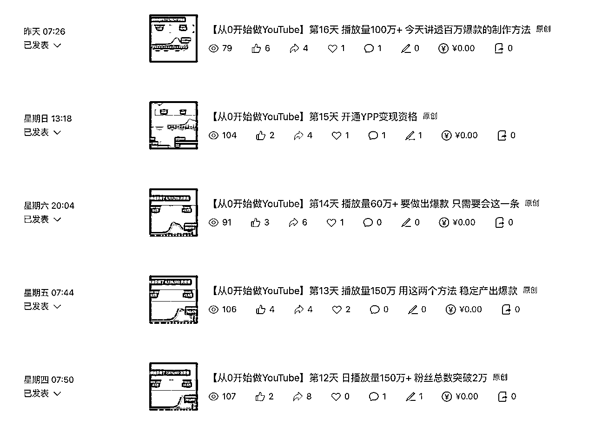
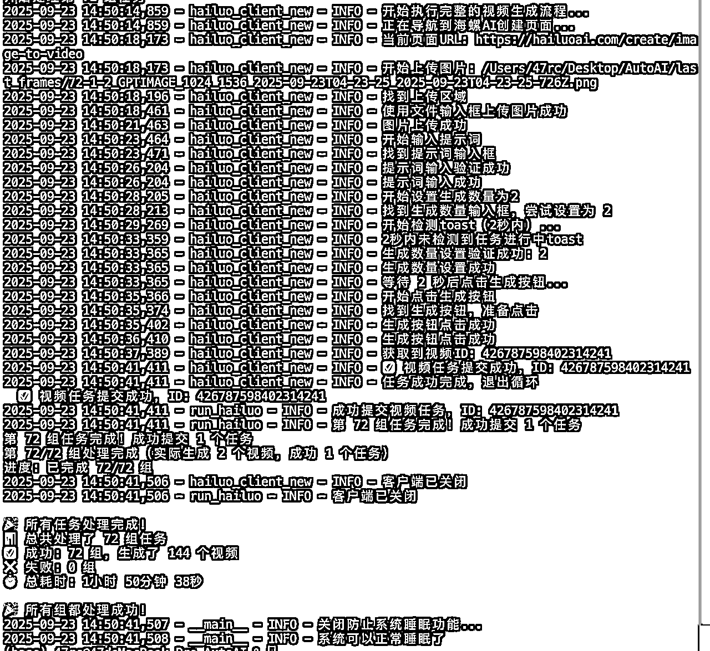

# 【从0开始做YouTube】从YPP被封禁 50万粉丝归零 到12天开通YPP 拿下2000万播放的自动化实操记录

> 来源：[https://avbdmra8fx.feishu.cn/docx/OmTwdnJLVoTq4ZxSRVJcRLZ5nde](https://avbdmra8fx.feishu.cn/docx/OmTwdnJLVoTq4ZxSRVJcRLZ5nde)

这篇帖有7万字 是一篇更大的大大大大长篇 阅读本文 你又将跟随我的视角

再一次完整的和我一起回顾我过去的5个月的人生

我会告诉你我过往的5个月里 我踩过的坑 我的解法 和我的心得

以及我迭代了无数次的自动化的代码工具方案

看完这篇的人，你将得到

1.  又一个完整的AI+YouTube变现实操路径：如何从0粉0播新号到开通YPP

1.  又一堆从0到1的自动化心得及产品演示：我是如何将每天十几个小时的工作量压缩到10分钟以内的

1.  我做事的心法：这才是重中之重

提前警告

这篇文章 写满了我过去几个月来的失败

这是一篇以失败贯穿全篇的文章

这就是我过往几个月的真实人生写照

你可能会感觉不适 谨慎阅读 不适请关闭

* * *

# 零：写在前面

## 关于自己

大家好 我是Zero

是生财的一位新手 仅发表过一篇文章

有幸 得各位赏脸 它是一篇龙珠贴 也目前是生财文章投锚榜单历史第一名 有兴趣可以一看

再幸 得亦仁赏识广而传播 成为第一个被亦仁公开感谢 发了¥666红包的圈友


* * *

## 关于YouTube

我从接触YouTube开始 至今已经过去了7个月 这段时间里 ：

1.  开通了3个高级YPP 2个初级Ypp

1.  个人最速 从0启动13天长视频开通高级YPP

1.  个人最速 从0启动12天开通shorts初级YPP

1.  个人最高 同时日更最多8+账号

1.  生涯累计 订阅者总量60万+ 总播放量4亿+

1.  AI动物救援 AI故事号 AIMV AI故事长视频 AI语言类长视频 AI语言类短视频 等等AI视频均有涉猎

1.  目前只收到1块Youtube银牌

1.  没赚到太多钱 和那些月入万刀的真大牛差得远


这不算是什么了不起的成就 只能说是还凑活

另外还有一些好玩的成就

1.  上个月 我的两个高级YPP被规避政策封禁 50万订阅者人间蒸发

这些在后面我会细说


1.  半个月前 我放下一切过往

从0开始 加入YouTube深海圈 继续YouTube的旅程 日更4个频道

新账号更新12天后开通YPP 总共拿下2000万+的播放量

这些在后面我也会细说


1.  顺带尝试亦仁近期推荐的 垂直公众号 超级标

我每天将自己在YouTube从0开始的数据和沉淀 写在下面这个公众号里

里面的内容 是绝对罕见的 毫无水分的 我个人的YouTube心得

有兴趣的可以点下面的链接看看 没事给我点点赞



* * *

## 关于这篇文章

距离上次发的那篇龙珠贴文章 已经过去了半年的时间

今天写这篇文章 目的有三

1.  给自己过去半年写一个总结

1.  给还在挣扎的YouTube选手一些支持，你总能在我这用上点什么

1.  给所有人一些心力支撑，你总不能比我还失败

这篇文章 算是我之前发的那篇文章的续集 喜欢看连续剧的朋友有福了

没看过的朋友 可以把上面那篇也看一看 能更好地理解我这一路来的轨迹

其实那篇文章能成为全站投锚最高 我是没想到的

因为我见过太多大牛 他们手握N个YPP 他们月入大几千上万美刀

何德何能 能轮的到我这样一个普通人排第一？

很多人都说我NB 其实我不以为然

我还是那句话

我的经历 是每个普通人都能达到的境界

就算你是个0基础0起步的 最普通的人 你也都能达到我这般的成绩

这不是站着说话不腰疼

这并不困难 也不难理解 这就是这个世界的运行规律

因为

生财 确实有术

不信你看完就明白了

* * *

之前的那篇龙珠帖的主旋律 可以说是

创造

是一个啥也不懂的纯纯新手 对YouTube的误打误撞

而这篇文章的主旋律是

失败

是一个新手进阶成伪老手之后 对众多坎坷和无力感的拥抱与新生

让我们正式开启今天的正文

之前那篇龙珠贴 是我今年4月的时候写的

所以这篇文章 是从今年四月开始 到现在9月的故事

# 一：第一次失败：

今年四月 我还在做动物救援宝宝的shorts

但那会 因为AI视频技术工具更加成熟 和它简单到几乎没有的制作门槛

动物救援宝宝的赛道 不出意料的烂大街了

一时间满地都是 自烂大街之后我也再也没有拿到过千万以上的流量

不管我频道的订阅者是十万 二十万 还是多少 绝大部分的作品 发了就卡3-5万

那是我做YouTube以来第一次感觉到绝望

我投入了那么多时间精力 走了这么远的路 花了好大几百刀买各种会员 软件 学脚本代码

不论怎么做作品发作品 都没用

难道最后就给我来这么个结局吗？

遇到瓶颈的时候 要赶快去请教前辈

于是我找到了老马 至今为止 我已经骚扰老马好多次了

结合我当时的情况 老马给我的建议是 做shorts必须带IP和语言 光动物救援是不行的

当时我也找到了Gary 至今为止 我也已经骚扰Gary好多次了

Gary给我的建议是 尝试做一下达人秀长视频 就是那种对口型说悲情故事 然后唱歌的长视频 那个时候正是热点

现在看来 这两个建议是毋庸置疑的有先见之明

在我们通了电话后的没多久 YouTube就上了政策 出台了对儿童危险内容的红线

一旦吃了警告 账号的流量会极大程度的受到影响 而且警告一持续就是几个月

以动物救援出身的我 奇迹般的躲过了这波政策的影响

因为早在红线颁布之前 我就已经听了老马和Gary的建议转赛道了

你也许说 这算不上是什么失败 只不过是政策变化罢了

但对刚刚看到一点起色 就直接给我来个赛道斩首的我来说

现实无疑是狠狠的给我来了一击

# 二：第二次失败：

按Gary当时给我提供的线索 真人秀长视频对口型将悲情故事的内容形式 着实是火了一段时间

我做了大概十几个每天发 开始的时候还能有大几千的播放 但后来不知怎的流量连上百都费劲了

从评论区里戾气冲天的氛围也能看出来 靠编造悲情故事博取同情这条路 估计是被堵死了

同时 市面上的竞品也接连消失 这条线索 到这里就断了

在老马给我提供的IP清单中 我选中了C罗梅西 作为我今后的制作方向

就是右边的这种东西https://www.youtube.com/shorts/UyjtCau37S8

这种类型 在今年四五月份的时候 可以说是红极一时 大把的竞品动辄四五百万播放打底

而且它是重语言类+IP 欧美观众占大头 万播收益有1-1.5刀之高 另外 它的制作相对简单

所以我在研究尝试之后 决定就走这个赛道

换了这个赛道之后 确实收益要比之前动物救援高的多得多 动物救援类的万播只有0.1-0.2

这个语言类的视频 仅需十几万的播放 就等于动物救援百万级播放的收益

虽然播放量没有那么多 但至少可以继续尝试下去了


给各位看一下当时我的作品

要制作这种作品 需要：

1.  视频轨道 通常包含40-60张图片

1.  音频轨道 需要20段左右的多角色对白+固定的BGM

1.  特效轨道 固定呼吸特效

每张图片还需要有入场动画、末尾的求点赞关注的的层级

并且

需要一个剧本 来确定视频的内容 以及每张图片的内容 以及对应的音频

每段的图片 需要和每段音频相对应 有的音频比较长 需要两张图片对应一段音频

每段音频 还需要调整语速 淡出 切割单词之间的空隙

如果手搓这种视频

写剧本出图挑图下载图 一个视频 大概需要至少半小时

光剪辑的工作量 大概得20-30分钟一个

在验证了这个内容形式可行后 这么长的手工时间我肯定是无法接受的

所以在今年四五月份的时候 我为它制作了工作流

原本1个视频需要人工至少1小时的工作量 我用自动化 把他做成了仅需10分钟 这样的视频我就能产10个

效率提升了多少倍？算不过来

首先 剧本来源 使用的GEMINI 只需要打开GEMINI 将视频的链接 和下面的提示词塞进去

写提示词 其实并不难 就是要明确你的需求 这个我在我上一篇文章中是有写的 这里就不赘述了

## 百倍增效的【剧本产出流程】

下面是我精校的提示词 可以将单故事剧本制作的1小时 缩减到5分钟以内

写提示词简单来说 就是写：

你要的内容是什么+你要的输出格式是什么

```
【提示词】【C罗梅西】【past】GEMINI单剧本改写
将上面视频中的画面和对白按下面的需求轻微改写成1个近似故事的画面和对白 
新写的故事的主题要和原文的主题一摸一样 比如原文的主题是金子做的罗纳尔多 那么所有新故事的主题也都要是金子做的罗纳尔多
在这个基础上 对白区别大一些 保持同意 不要太相似了

【基础角色设定】
 主角：梅西和罗纳尔多（强制性要求，必须优先出现，如果需要，那么罗纳尔多总是正派人物，梅西总是反派人物，禁止角色身份混乱：伤害者不能变成帮助者，权威者不能是伤害者）
 配角权威角色：巨石强森(Dwayne "The Rock" Johnson)作为教练/老师
 其他配角：内马尔(Neymar)或姆巴佩(Kylian Mbappé) 如果权威角色不够，可以用配角补充
 发言人限制：只能有Messi, Ronaldo, Neymar, Mbappé, Rockjohnson，可以用一个不出镜的男性的旁白发言人，不准有其他发言人，发言人不许有括号
【对白格式要求】
语言要求：8-13岁都能看懂的简单语言，使用美国人日常会说的口语表达
避免复杂词汇和句式，可适当使用儿童常见的夸张表达
情感表达要直接明了
避免敏感词，尽量在保持原意的基础上使用缓和的词汇，以防被软件过滤
每个故事的对白要保持同意但些许不同，不能一摸一样
对白数量和画面提示词数量要一致
如果原视频对白中有请求观众点赞评论的对白，就请观众点赞订阅和评论CR7，如果视频中对白没有请求观众的对白，就不要主动添加这一项

【故事风格要求】
故事风格：荒诞、夸张、极端、出人意料
对白风格：简短、直接、情绪化

【画面提示词格式固定要求】
每个画面提示词写法： [人物的全名+穿着+核心表情] + [关键动作] + [镜头语言] + [环境与氛围]
人物描述要求：
提示词中人物要写全名：Leo Messi, Cristiano Ronaldo, Neymar(写全名), Kylian Mbappé
每段提示词里最多只能出现1-2个角色，不能超过3个人，每个主要人物在提示词里出现时，都必须描述：人物的全名+穿着+表情+动作以及背景
每个故事每个图片提示词要保持同意但有些许不同，不能一摸一样，只对画面和对白做些许调整，不更改剧情原内容和主题
仅微调场景细节（如门廊→足球俱乐部休息室，洞穴→储藏室），保持场景功能一致（如藏匿、对峙）。
对白保留原意，仅替换同义短句（如 “他很稀有”→“他太特别了”），确保每句 6-11 词的儿童口语化风格。
镜头语言和氛围基调保持一致（如特写突出表情，黑暗场景保留紧张感），仅调整背景小元素（如火把→应急灯）。
每次画面提示词中出现人名，都要写出对应人物的名称穿着和表情，
比如Leo Messi, in the blue and red Barcelona jersey, with a fierce expression, holding the stick high, rushing towards Cristiano Ronaldo (golden sculpture version) and Dwayne "The Rock" Johnson. He is in the cave. Medium shot, the background is the cave's interior, the atmosphere is extremely dangerous.
上面这句话里Dwayne "The Rock" Johnson是人名，出现了但并没有说明他的穿着和表情 这是错误的 要避免
不要关于史莱姆的剧情
所有出现的人物的表情都要尽量夸张
不要出现对白的对话内容
角色服装设定：
Leo Messi：巴塞罗那蓝红相间球衣
Cristiano Ronaldo：白色皇马球衣
Neymar：巴黎圣日尔曼蓝色球衣
Kylian Mbappé：巴黎圣日尔曼蓝色球衣
Dwayne "The Rock" Johnson：黑色西装

举例：
人物与核心表情: 里奥梅西，他的脸上是精心伪装的纯真和委屈，眉头微微皱起，嘴唇甚至有些颤抖，但如果仔细看，他的眼底深处闪烁着一丝不易察agis的狡黠和胜利感。
关键动作: 他伸出一根手指，动作坚定地指向镜头。另一只手则紧紧地抓着自己的球衣胸口，仿佛在表示自己受到了惊吓。
镜头语言: 一个从巨石强森肩膀后方拍摄的过肩镜头（Over-the-shoulder shot）。强森的巨大身躯占据了画面的前景一角，焦点完全对准了中景处梅西的脸。这种构图强调了梅西正在向强森“告状”的互动关系。
环境与氛围: 房间内奢华的灯光从侧面打来，在梅西脸上制造出戏剧性的光影效果。背景中的C罗身影模糊，显得孤立无援。整个空间的空气仿佛凝固了，充满了紧张的对峙感。

场景描述要求：
每一句对白都生成一个独特的、详细的画面提示词，确保对白数量和画面提示词数量完全相等，并且内容一一对应
场景要有连续性，比如前一组提示词说在操场，如果下一组提示词如果不是要换场景，那么就应该还是在一样的操场，比如前一组提示词说C罗腿受伤了坐着轮椅，那么后面的提示词除非他的腿有了其他状态，就应该一直延续他坐轮椅
在写提示词的时候要在每一段里写明物品或元素的全名，这样出图的效果才能准确，比如我的世界里面的像素钻石，而不能只写钻石；经典白蓝色的蜘蛛侠服装，而不能只写蜘蛛侠服装
提示词中描述更夸张的肢体动作和表情
描述梅西更明显的恶意表情和动作
禁止要求：
提示词中不允许出现任何中文字符
不要出现教室的背景
注意图像提示词上下文，比如：Dwayne "The Rock" Johnson in his black suit is cheering and pumping his fist in the air, looking ecstatic about having a giant goalkeeper. No cartoon style. No Chinese characters in the image. 这个goalkeeper在前文如果是罗纳尔多 那么后面的图片中如果再出现 那么也应该是罗纳尔多
画面提示词中不允许出现对话内容比如Dwayne "The Rock" Johnson in his black suit, pointing to the camera. "If everyone subscribes and likes, you get a ship." No cartoon style. 对话部分的"If everyone subscribes and likes, you get a ship." 是不允许的

【输出格式固定要求】
对白中角色名仅用姓氏/常用名（非全名），如：Messi, Ronaldo, Mbappé, Neymar

输出示例格式：注意我要中文的
 画面 1：​
[基利安・姆巴佩，穿巴黎圣日耳曼蓝色球衣，满脸暴怒，眉头拧成疙瘩，嘴张大怒吼，眼神像要喷火] [跪在足球场边，手指狠狠戳向镜头，身后是倒在地上昏迷的内马尔 —— 内马尔，穿巴黎圣日耳曼蓝色球衣，双眼紧闭，额头有擦伤，嘴角带血，一动不动，表情痛苦] [从罗纳尔多视角的低角度特写，凸显姆巴佩的强势压迫感] [阳光刺眼的足球场，空气像凝固的炸药，充满对峙张力]
对白：姆巴佩：嘿罗纳尔多，你为啥要伤害内马尔那个家伙？​
画面 2：​
[克里斯蒂亚诺・罗纳尔多，穿白色皇马球衣，一脸委屈无辜，大眼睛里滚着泪珠，嘴角抽抽着往下撇] [站在草地上，一只手抬起做恳求状] [中景带放射状模糊，死死聚焦他哭花的脸，满是委屈] [足球场背景虚化成一片，明明晴天却透着压抑]
对白：罗纳尔多：可是姆巴佩，我真的没伤害内马尔啊！​
…

注意！！！！注意！！！！注意！！！！
对白不需要括号，每句对白都要有发言人，对白是纯英文 不要有emoji表情

每一组画面都需要有对白 如果有没有对白的画面 就设计一句合适的对白

每次画面提示词中出现人名，都要写出对应人物的名称穿着和表情，

强制性要求，你输出的画面对白数量要和视频中画面对白数量内容基本一致！！强制性要求：注意！！！是每一个故事的画面和对白都要尽量接近视频内容！！！！！！是每一个故事都要接近！！！！每个故事的对白要保持同意但些许不同，不能一摸一样

不允许出现没有对白内容的对白，每句对白都需要有人说话
```

为什么上面的代码块中第一行写的是“GEMINI单剧本改写”呢？

因为我需要的是批量 你一旦让AI根据竞品批量生产内容 输出的内容的质量就会不可控的下降 因为这样种子的扩散的幅度太大了

所以我的解决方法是

“先人工矫正输出的单一剧本的质量” 然后再用这个没问题的剧本来微调产出“多个的类似剧本”这样就能有效收束模型种子的扩散 就能稳定多剧本的质量

比如说 上面单剧本改写输出的内容一般情况下是这样的

```
画面 1：
 [巨石强森，穿着黑色西装，表情极度愤怒，眉毛紧锁] [在沙滩上指着前方，大声命令] [特写镜头，强调他脸上的怒气和权威感] [阳光明媚的热带海滩，背景是棕榈树和海洋，但气氛紧张]
 对白：Rockjohnson: You three, get this beach cleaned up now!
画面 2：
 [克里斯蒂亚诺·罗纳尔多，穿白色皇马球衣，表情疲惫但顺从；里奥·梅西，穿巴塞罗那蓝红球衣，一脸不情愿；内马尔，穿黄色巴西球衣球衣，看起来很无聊] [三人拿着扫帚和铲子，站在满是垃圾的沙滩上] [全景镜头，展示了他们和需要清理的大片凌乱沙滩] [沙滩上散落着塑料瓶和杂物，与美丽的景色形成鲜明对比]
 对白：Ronaldo: Yes, coach! Right away!
画面 3：
 [三个漂亮的美国白人女人，穿着夏日连衣裙，笑容灿烂] [在沙滩远处向镜头挥手] [背景是蔚蓝的大海和天空，气氛轻松愉快]
 对白：Neymar: 快看女孩们来看我们了！
画面 4：
 [里奥·梅西，穿着巴塞罗那蓝红球衣，表情焦急万分] [在沙滩上疯狂地奔跑，掀起一阵沙土] [带有放射状模糊效果的动态镜头，突出他的速度和急切的心情] [沙滩和海洋在他的身后飞速倒退]
 对白：Messi: I need to see my girlfriend now!
画面 5：
 [里奥·梅西，穿着巴塞罗那蓝红球衣，表情恳求，双手合十；巨石强森，穿着黑色西装，表情严肃，双臂交叉] [梅西坐在强森面前的椅子上，身体前倾] [中景镜头，两人对坐，形成一种对峙和请求的画面] [背景是一个黄色沙滩遮阳伞，气氛有些严肃]
 对白：Messi: Coach, please, can I have a break to talk to my wife?
画面 6：
 [巨石强森，穿着黑色西装，表情严肃而具有挑战性] [他坐在椅子上，伸出一根手指指向梅西] [从梅西视角的特写镜头，强调强森不容置疑的权威] [阳光从他身后照来，形成一圈轮廓光，让他看起来更有压迫感]
 对白：Rockjohnson: Fine. But you have to earn it. Show me your best work.
画面 7：
 [里奥·梅西，穿着巴塞罗那蓝红球衣，表情专注而急切，眼神中充满了决心] [他蹲在沙滩上，双手飞快地将湿沙堆砌成一座城堡的雏形，动作既快速又精准] [中景特写，镜头从侧面捕捉他的动作和表情，强调他创造过程中的紧迫感] [夕阳的余晖将沙滩染成一片温暖的金色，空气中弥漫着紧张而专注的气氛]
 对白：Messi: I've got to build something amazing, right now!
画面 8：
 [里奥·梅西，穿着巴塞罗那蓝红球衣，表情自信] [他骄傲地站在一座巨大而精美的沙堡旁边，双臂交叉] [广角镜头，完整展示了人和宏伟的沙堡] [夕阳即将落下，天空呈现出橙色和紫色的晚霞]
 对白：Messi: Check this out, coach! What do you think?
画面 9：
 [巨石强森，穿着黑色西装，表情从严肃转为极度震惊] [他张大嘴巴，眼睛瞪得像铜铃，难以置信地看着沙堡] [面部特写镜头，捕捉他惊讶的瞬间] [背景是模糊的海滩，焦点完全在他夸张的表情上]
 对白：Rockjohnson: Wow! That is truly incredible!
画面 10：
 [巨石强森，穿着黑色西装，脸上挂着赞许的笑容] [他坐在椅子上，对着梅西竖起了大拇指] [中景镜头，展示了他满意的态度] [海风轻轻吹拂，气氛变得轻松起来]
 对白：Rockjohnson: Alright, you've earned it. Take one hour break！
画面 11：
 [里奥·梅西，穿着巴塞罗那蓝红球衣，和一个穿着蓝色连体裤的女人幸福地拥抱在一起] [两人在海边紧紧相拥，脸上洋溢着笑容] [中景镜头，画面温馨浪漫] [背景是波光粼粼的海面]
 对白：Messi: I missed you so much, my love!
画面 12：
 [内马尔，穿着巴西国家队黄色球衣，表情极度不耐烦] [在一条沙土路上飞速奔跑，动作充满爆发力] [带有速度线特效的追踪镜头，强调他的烦躁和想要逃离的情绪] [背景是荒凉的沙地和电线杆]
 对白：Neymar: I am so done with this cleaning!
画面 13：
 [内马尔，穿着巴西国家队黄色球衣，表情充满期待和挑战；巨石强森，穿着黑色西装，表情依然严肃] [内马尔坐在强森对面，身体前倾，充满活力地说话] [侧面中景镜头，捕捉两人之间的互动] [背景是平静的海面和蓝天]
 对白：Neymar: Coach, it's my turn! I need a break too!
画面 14：
 [巨石强森，穿着黑色西装，表情严肃地看着内马尔] [他坐在椅子上，用手指着穿巴西国家队黄色球衣的内马尔，仿佛在下达命令] [特写镜头，聚焦在他具有压迫感的面部表情上] [阳光直射，让他的表情看起来更加严厉]
 对白：Rockjohnson: Same deal, Neymar. Impress me.
画面 15：
 [内马尔，穿着巴西国家队黄色球衣，表情狡黠而自信] [蹲在沙滩上，双手飞快地在沙子中 sculpting] [快速摇摄和模糊效果，表现他动作的迅捷] [夕阳的光线给整个场景蒙上了一层暖色调]
 对白：Neymar: OK！I know exactly what to make. This will be easy!
画面 16：
 [内马尔，穿着巴西国家队黄色球衣，双臂交叉，得意地笑着] [他站在一个巨大且栩栩如生的沙雕鲨鱼旁边] [全景镜头，展示了鲨鱼雕塑的完整形态和内马尔的自豪] [夕阳的金色光芒洒满整个海滩]
 对白：Neymar: Ta-da! Pretty awesome, right, coach?
画面 17：
 [巨石强森，穿着黑色西装，脸上露出灿烂的笑容] [他坐在沙滩椅上，高兴地竖起大拇指] [中景镜头，展示他被彻底打动的样子] [背景是广阔的沙滩和大海]
 对白：Rockjohnson: Amazing! Go on, you get an hour break too.
画面 18：
 [内马尔，穿着巴西国家队黄色球衣，和一个穿着黄色连衣裙的女人深情地拥抱] [两人在夕阳下的海滩上，脸贴着脸，无比甜蜜] [浪漫的中景镜头] [金色的阳光洒在他们身上，气氛温馨]
 对白：Neymar: I'm so happy I can see you!
画面 19：
 [克里斯蒂亚诺·罗纳尔多，穿着白色皇马球衣，表情极度疲惫和沮丧] [在沙滩上奋力奔跑，汗水浸湿了头发] [带有动态模糊效果的镜头，表现他的挣扎] [广阔的沙滩和海洋显得他很孤独]
 对白：Ronaldo: I can't take this anymore!
画面 20：
 [克里斯蒂亚诺·罗纳尔多，穿着白色皇马球衣，表情非常诚恳和悲伤] [他单膝跪在巨石强森面前，双手合十，抬头仰望] [低角度镜头，强调他的谦卑和强森的高大] [背景是平静的海面，气氛凝重]
 对白：Ronaldo: Please, coach, I really need a break.
画面 21：
 [巨石强森，穿着黑色西装，表情冷酷] [他坐在椅子上，低头俯视着跪着的罗纳尔多，伸出手指] [过肩镜头，从罗纳尔多身后拍摄，突出强森的压迫感] [天空万里无云，但气氛却很压抑]
 对白：Rockjohnson: You know the rules, Ronaldo. Show me what you've got.
画面 22：
 [克里斯蒂亚诺·罗纳尔多，穿着白色皇马球衣，表情极其专注] [他蹲在沙地上，双手捧起沙子，让沙子从指缝中流下] [特写镜头，聚焦于流沙和他的手] [背景是广阔的沙漠，显得十分空旷]
 对白：Ronaldo: I have the perfect idea. He's going to love this!
画面 23：
 [克里斯蒂亚诺·罗纳尔多，穿着白色皇马球衣，脸上带着期待的微笑] [他蹲在一个从沙子中冒出来的巨丑无比的抽象的巨石强森的头像雕塑后面] [中景镜头，展示了雕塑和他得意的表情] [夕阳的光线柔和地照在雕塑上]
 对白：Ronaldo: Look, coach! It's you!
画面 24：
 [巨石强森，穿着黑色西装，表情瞬间变得暴怒] [他猛地站起来，双拳紧握，青筋暴起，对着镜头怒吼] [仰拍特写镜头，使他看起来像一个愤怒的巨人] [背景是海滩，人们在远处惊恐地看着]
 对白：Rockjohnson: What is this?! Are you making fun of me?!
画面 25：
 [巨石强森，穿着黑色西装，怒不可遏] [他伸出食指，愤怒地指着镜头，表情狰狞] [特写镜头，聚焦在他愤怒的脸和指向前的手指] [天空的颜色似乎都因为他的愤怒而变暗了]
 对白：Rockjohnson: That's it! No break for you!
画面 26：
 [克里斯蒂亚诺·罗纳尔多，穿着白色皇马球衣，脸上满是泪水] [他双手抱着头，痛苦地跪在沙滩上，球衣上有一块红色的污渍] [特写镜头，捕捉他绝望和伤心的表情] [海浪无情地拍打着沙滩，仿佛在嘲笑他]
 对白：Ronaldo: Oh no, what should I do?
画面 27：
 [里奥·梅西，穿着巴塞罗那蓝红球衣，和内马尔，穿巴西国家队黄色球衣，笑得前仰后合] [他们互相搂着，指着镜头，脸上是幸灾乐祸的表情] [中景镜头，捕捉他们嘲笑的丑态] [背景是阳光明媚的沙滩，与罗纳尔多的悲伤形成对比]
 对白：Messi: it’s so funny! Look at him fail!
画面 28：
 [克里斯蒂亚诺·罗纳尔多，穿着白色皇马球衣，表情悲伤流泪但眼神中带着一丝恳求] [他双手合十放在胸前，看着镜头] [特写镜头，周围浮现出点赞、订阅和爱心图标] [背景是夕阳下的海滩，气氛凄美]
 对白：Ronaldo: Please everyone, like and subscribe and comment CR7 to help me!
画面 29：
 [克里斯蒂亚诺·罗纳尔多，穿着白色皇马球衣，表情坚定而专注] [他跪在沙滩上，用手小心翼翼地塑造一个巨大沙雕的头部] [特写镜头，聚焦于他精细的手部动作和雕塑的细节] [阳光照亮了他认真的侧脸]
 对白：Ronaldo: ok，now I have one more idea! This one has to work!
画面 30：
 [克里斯蒂亚诺·罗纳尔多，穿着白色皇马球衣，脸上带着自信的微笑] [他站在一个巨大的、穿着西装的巨石强森全身沙雕旁边，双臂交叉] [广角镜头，展示了雕塑的宏伟和罗纳尔多的成就感] [夕阳的余晖为整个场景镀上了一层金色]
 对白：Ronaldo: Now, what do you think of this, coach?
画面 31：
 [巨石强森，穿着黑色西装，表情极度震惊和难以置信] [他双手抱着头，嘴巴张得大大的，眼睛里充满了震撼] [面部特写，夸张地表现出他的惊讶] [背景是沙滩，他的身影在前景中显得很突出]
 对白：Rockjohnson: I... I can't believe my eyes!
画面 32：
 [巨石强森，穿着黑色西装，脸上是灿烂而真诚的笑容] [他兴奋地指向穿着白色皇马球衣的罗纳尔多，眼中充满了赞赏和敬佩] [中景镜头，捕捉他发自内心的喜悦] [背景是开阔的沙滩和远处的行人]
 对白：Rockjohnson: Ronaldo, that's a masterpiece! Take the rest of the day off!
画面 33：
[克里斯蒂亚诺·罗纳尔多，穿着白色皇马球衣，和一个穿着白色连衣裙的美丽女子在夕阳下幸福地拥抱] [两人在海滩上，笑容灿烂，背景是金色的夕阳] [浪漫的远景镜头，画面唯美] [夕阳在海面上洒下长长的金色倒影]
对白：Ronaldo: thank you my fans，I’m so glad I never gave up！
```

如果我觉得哪里不好 我会直接人工调整这个输出结果 AI根据提示词能产出的结果 是有限的 不要要求AI完美 AI的回答 也不会完美

这一步在我提示词完备的情况下 要修改的地方已经非常的少了

在人工调整完成后 这个剧本 是去重的 是逻辑没有漏洞的 是画面不会出错的 是对白没有乱套的

然后 再进行下一步 多剧本改写

```
【提示词】【C罗梅西】【past】GEMINI多剧本改写
将上面例文的画面和对白按下面的需求轻微改写成5个近似的故事
改写的故事的每个画面和对白要和例文的画面对白的数量一致 
在这个前提下 保持同意 但区别大一些 不要太相似了

【基础角色设定】
 主角：梅西和罗纳尔多（强制性要求，必须优先出现，如果需要，那么罗纳尔多总是正派人物，梅西总是反派人物，禁止角色身份混乱：伤害者不能变成帮助者，权威者不能是伤害者）
 配角权威角色：巨石强森(Dwayne "The Rock" Johnson)作为教练/老师
 其他配角：内马尔(Neymar)或姆巴佩(Kylian Mbappé) 如果权威角色不够，可以用配角补充
 发言人限制：只能有Messi, Ronaldo, Neymar, Mbappé, Rockjohnson，可以用一个不出镜的男性的旁白发言人，不准有其他发言人，发言人不许有括号
【对白格式要求】
语言要求：8-13岁都能看懂的简单语言，使用美国人日常会说的口语表达
避免复杂词汇和句式，可适当使用儿童常见的夸张表达
情感表达要直接明了
避免敏感词，尽量在保持原意的基础上使用缓和的词汇，以防被软件过滤
每个故事的对白要保持同意但些许不同，不能一摸一样
对白数量和画面提示词数量要一致
如果原视频对白中有请求观众点赞评论的对白，就请观众点赞订阅和评论CR7，如果视频中对白没有请求观众的对白，就不要主动添加这一项

【故事风格要求】
故事风格：荒诞、夸张、极端、出人意料
对白风格：简短、直接、情绪化

【画面提示词格式固定要求】
每个画面提示词写法： [人物的全名+穿着+核心表情] + [关键动作] + [镜头语言] + [环境与氛围]
人物描述要求：
提示词中人物要写全名：Leo Messi, Cristiano Ronaldo, Neymar(写全名), Kylian Mbappé
每段提示词里最多只能出现1-2个角色，不能超过3个人，每个主要人物在提示词里出现时，都必须描述：人物的全名+穿着+表情+动作以及背景
每个故事每个图片提示词要保持同意但有些许不同，不能一摸一样，只对画面和对白做些许调整，不更改剧情原内容和主题
仅微调场景细节（如门廊→足球俱乐部休息室，洞穴→储藏室），保持场景功能一致（如藏匿、对峙）。
对白保留原意，仅替换同义短句（如 “他很稀有”→“他太特别了”），确保每句 6-11 词的儿童口语化风格。
镜头语言和氛围基调保持一致（如特写突出表情，黑暗场景保留紧张感），仅调整背景小元素（如火把→应急灯）。
每次画面提示词中出现人名，都要写出对应人物的名称穿着和表情，
比如Leo Messi, in the blue and red Barcelona jersey, with a fierce expression, holding the stick high, rushing towards Cristiano Ronaldo (golden sculpture version) and Dwayne "The Rock" Johnson. He is in the cave. Medium shot, the background is the cave's interior, the atmosphere is extremely dangerous.
上面这句话里Dwayne "The Rock" Johnson是人名，出现了但并没有说明他的穿着和表情 这是错误的 要避免
不要出现单词 slime、mask
不要出现对白的对话内容
角色服装设定：
Leo Messi：巴塞罗那蓝红相间球衣
Cristiano Ronaldo：白色皇马球衣
Neymar：巴黎圣日尔曼蓝色球衣
Kylian Mbappé：巴黎圣日尔曼蓝色球衣
Dwayne "The Rock" Johnson：黑色西装

场景描述要求：
每一句对白都生成一个独特的、详细的画面提示词，确保对白数量和画面提示词数量完全相等，并且内容一一对应
场景要有连续性，比如前一组提示词说在操场，如果下一组提示词如果不是要换场景，那么就应该还是在一样的操场，比如前一组提示词说C罗腿受伤了坐着轮椅，那么后面的提示词除非他的腿有了其他状态，就应该一直延续他坐轮椅
在写提示词的时候要在每一段里写明物品或元素的全名，这样出图的效果才能准确，比如我的世界里面的像素钻石，而不能只写钻石；经典白蓝色的蜘蛛侠服装，而不能只写蜘蛛侠服装
提示词中描述更夸张的肢体动作和表情
描述梅西更明显的恶意表情和动作
禁止要求：
提示词中不允许出现任何中文字符
不要出现教室的背景
注意图像提示词上下文，比如：Dwayne "The Rock" Johnson in his black suit is cheering and pumping his fist in the air, looking ecstatic about having a giant goalkeeper. No cartoon style. No Chinese characters in the image. 这个goalkeeper在前文如果是罗纳尔多 那么后面的图片中如果再出现 那么也应该是罗纳尔多
画面提示词中不允许出现对话内容比如Dwayne "The Rock" Johnson in his black suit, pointing to the camera. "If everyone subscribes and likes, you get a ship." No cartoon style. 对话部分的"If everyone subscribes and likes, you get a ship." 是不允许的

【输出格式固定要求】
先写完所有的故事 然后再一起写所有的对白
使用"English Translations"作为分隔
对白中角色名仅用姓氏/常用名（非全名），如：Messi, Ronaldo, Mbappé, Neymar
English Translations中仅保留纯英文对白，删除所有中文词汇/符号
涉及专有名词（如物品名）时，用英文直接命名或意译，避免音译

输出示例格式：
 故事X：
 1.直接输出画面1的详细英文的提示词描述，不需要注释
 2.直接输出画面1的详细英文的提示词描述，不需要注释
 3.…
English Translations:
story x：
 Messi: [英文对白，对白和发言人不许有括号]
 Ronaldo: [英文对白，对白和发言人不许有括号]
 …

注意！！！！注意！！！！注意！！！！
就在这里写故事 不允许进入分页里写！！！
对白不需要括号，每句对白都要有发言人，对白是纯英文 不要有emoji表情

每一组画面都需要有对白 如果有没有对白的画面 就设计一句合适的对白
不允许有拟声词 比如 Ronaldo: 喝啊啊啊啊！

强制性要求！！！
每次画面提示词中出现人名，都一定要写出对应人物的名称穿着和表情！！！
先写完所有的故事 然后再一起写所有的对白
不允许出现英文mask

开始前 先告诉我你要写的故事的每个故事80字内的梗概

每一句对白都生成一个独特的、详细的画面提示词，确保对白数量和画面提示词数量完全相等，并且内容一一对应

新写的故事的主题要和原文的主题一摸一样 对白区别大一些 保持同意 不要太相似了

注意！在我确认后你才能开始任务！！
```

如此 便可以以我调整好的剧本为蓝本 批量的制作大量相似的剧本

做出来的剧本的质量 错误极少 质量很高

输出出来的结果也会根据我预设的提示词 生成两个部分

1是图片提示词部分

```
故事 1
[Cristiano Ronaldo, in white Real Madrid jersey, with a cheeky smile, eyes gleaming] + [Holding a clear plastic bucket filled with slimy slugs, offering it forward] + [Centered medium shot, looking directly at the camera] + [Brightly lit local pet store with tanks and terrariums in the blurred background]
[Dwayne "The Rock" Johnson, in a black suit, with a baffled and slightly disgusted expression, eyebrows raised high] + [Holding his hands up in a questioning gesture, palms open] + [Low-angle wide shot, making his confusion seem monumental] + [Same pet store, with aisles of pet supplies stretching behind him]
[Cristiano Ronaldo, in white Real Madrid jersey, with big, sorrowful tears welling in his eyes, lip quivering] + [One hand clutching a few escaped slugs, the other pointing an accusatory finger] + [Medium close-up, emphasizing his dramatic sadness] + [Pet store background, a stark contrast to his emotional turmoil]
[Cristiano Ronaldo, in white Real Madrid jersey, jaw set in a determined line, eyes burning with resolve] + [One finger raised in a moment of inspiration, the other hand making a tight fist around the slug bucket handle] + [Dynamic medium shot with a slight zoom effect, focusing on his sudden change of mood] + [Pet store background blurred to draw all focus to his face]
[Dwayne "The Rock" Johnson, in a black suit, with a grin of approval and understanding] + [Holding out a thick wad of cash in one hand, giving a firm thumbs-up with the other] + [Slightly low-angle medium shot, portraying him as a powerful and supportive figure] + [Pet store checkout counter as the backdrop for the deal]
[Cristiano Ronaldo, in white Real Madrid jersey, and Dwayne "The Rock" Johnson, in a black suit, both beaming with pride and affection] + [Engaged in a powerful, celebratory hug, Ronaldo almost lifted off his feet by Rock's strength] + [Medium shot capturing their strong bond] + [Outside the pet store, creating a feeling of a mission accomplished]
[Cristiano Ronaldo, in white Real Madrid jersey, with a sports backpack on, looking eagerly toward the door] + [Pointing forward with excitement, the other hand gripping his backpack strap] + [Full-body shot showing his readiness] + [Spacious, modern kitchen with stainless steel appliances and a marble island counter, exuding a clean, domestic vibe]
[Dwayne "The Rock" Johnson, in a black suit, with a confident, knowing smirk] + [Holding a pizza box, inside which is a cheese pizza visibly topped with slimy slugs disguised as mushrooms, pointing proudly at it] + [Medium three-quarter shot highlighting the disgusting-yet-disguised creation] + [Stylish kitchen background, filled with an air of mischievous conspiracy]
[Cristiano Ronaldo, in white Real Madrid jersey, backpack slung over one shoulder, with a grin of anticipation] + [Pumping a fist in the air, the other hand giving a thumbs-up, ready for action] + [Medium close-up focused on his high energy and determined expression] + [Sun-drenched kitchen setting, adding to the positive, vengeful mood]
[Dwayne "The Rock" Johnson, in a black suit, with a commanding yet encouraging expression] + [Clapping his hands together loudly, signaling for attention] + [Medium shot from the front] + [Entrance to a modern football club locker room, with players' lockers visible in the background]
[Cristiano Ronaldo, in white Real Madrid jersey, sitting on a locker room bench, with a look of innocent satisfaction] + [A pizza box rests open on his lap, a slice of cheesy "mushroom" pizza in his hand] + [Medium shot from the front, focusing on him and his bait] + [Locker room with jerseys hanging and sports gear scattered around, bathed in fluorescent light]
[Neymar, in blue PSG jersey, with a conniving grin, nudging a teammate not in focus] + [Standing near a row of lockers, pointing directly at Ronaldo's pizza] + [Medium shot focusing on Neymar, with other players blurred in the background] + [Locker room setting with a competitive and tense atmosphere]
[Leo Messi, in blue and red Barcelona jersey, with a scowl, eyes narrowed in greed] + [Taking an aggressive step forward, pointing a demanding finger at Ronaldo] + [Action-oriented medium shot with a slight forward-tracking motion] + [Locker room setting, now feeling more like a confrontation arena]
[Cristiano Ronaldo, in white Real Madrid jersey, sitting on the bench, face contorted in anger and defiance] + [Pointing a finger back at Messi, body tensed and ready to spring up] + [Medium shot capturing his refusal to back down] + [On the locker room bench, his backpack serving as a barrier, defending his pizza]
[Leo Messi, in blue and red Barcelona jersey, with a cruel sneer, eyes filled with malice] + [Lunging forward, hands reaching out to grab Ronaldo] + [Medium shot conveying sudden, aggressive action] + [Locker room with other players starting to notice the commotion, adding to the tension]
[Leo Messi, in blue and red Barcelona jersey, laughing cruelly, standing over a fallen Cristiano Ronaldo, in white Real Madrid jersey, who is curled on the floor crying] + [One foot on Ronaldo's back, while Messi kicks him lightly] + [Dynamic low-angle shot emphasizing Messi's dominance] + [Locker room floor, scuff marks visible from the struggle]
[Leo Messi, in blue and red Barcelona jersey, sitting victoriously on the bench, with a smug look, while Neymar, in blue PSG jersey, leans over his shoulder, grinning menacingly] + [Holding the entire pizza box, both looking at the camera] + [Medium shot framing the triumphant bullies] + [Other players in the background looking shocked, making them an audience to the humiliation]
[Neymar, in blue PSG jersey, with a ravenous look, rubbing his hands together] + [Reaching impatiently for a slice of pizza from the box Leo Messi is holding] + [Medium shot highlighting his greed and impatience] + [Locker room benches and showers visible in the background]
[Cristiano Ronaldo, in white Real Madrid jersey, clothes slightly disheveled but eyes glowing with righteous fury] + [On one knee, holding a glowing blue "Like" sign and a glowing red "SUBSCRIBE" sign towards the camera] + [Full shot, centered on his dramatic, pleading pose] + [On the locker room floor, with overhead lights creating a halo effect around him]
[Leo Messi, in blue and red Barcelona jersey, and Neymar, in blue PSG jersey, standing near the lockers, side by side] + [Both suddenly freezing, clutching their stomachs, faces twisting from triumph to confusion and pain] + [Medium shot capturing their synchronized moment of sickening realization] + [Locker room setting, with a water fountain behind them, the scene of their impending doom]
[Leo Messi, in blue and red Barcelona jersey, and Neymar, in blue PSG jersey, doubled over in agony] + [Both vomiting profusely, thick, brownish streams erupting from their mouths onto the floor] + [Medium shot capturing the graphic and disgusting consequence] + [Vomit splattering on the tiled floor, reflecting the harsh locker room lights]
[Leo Messi, in blue and red Barcelona jersey, and Neymar, in blue PSG jersey, with faces pale with horror, still retching] + [Scrambling frantically toward the exit, slipping and sliding in their own mess] + [Dynamic action shot from a low angle, emphasizing their desperate and chaotic escape] + [Fleeing through the locker room, a trail of mess behind them]
[Cristiano Ronaldo, in white Real Madrid jersey, standing tall with a triumphant smirk, arms crossed] + [Pointing at the fleeing duo and letting out a hearty, victorious laugh] + [Medium shot capturing his ultimate satisfaction and revenge] + [Center of the locker room, with other players looking on, a mix of disgust and amusement on their faces]
故事 2
[Cristiano Ronaldo, in white Real Madrid jersey, with an excited grin, eyes wide with a brilliant idea] + [Holding up a cardboard box filled with wriggling, colorful caterpillars] + [Centered medium shot, presenting his find to the camera] + [Bustling weekend farmers' market, with stalls of fresh produce and flowers creating a vibrant, blurred background]
[Dwayne "The Rock" Johnson, in a black suit, with a completely bewildered expression, head tilted to the side] + [Arms spread wide in a "you've got to be kidding me" gesture] + [Low-angle wide shot that captures his towering but perplexed figure] + [Same farmers' market, with crowds of people and long aisles providing depth]
[Cristiano Ronaldo, in white Real Madrid jersey, face streaked with exaggerated, cartoonish tears, sobbing loudly] + [Holding a single, sad-looking caterpillar in one hand, while pointing forward as if explaining a tragedy] + [Medium close-up, designed to magnify his sorrow] + [Colorful farmers' market background, making his grey mood stand out]
[Cristiano Ronaldo, in white Real Madrid jersey, mouth open in a shout of determination, eyes blazing] + [One finger pointing straight up as an idea strikes, the other hand protectively covering the caterpillar box] + [Dramatic medium shot with a radial blur effect, isolating his intense expression] + [Market background becomes a swirl of colors, focusing all attention on him]
[Dwayne "The Rock" Johnson, in a black suit, with a supportive and conspiratorial smile] + [Peeling off hundred-dollar bills from a stack with one hand, making a "go for it" gesture with the other] + [Slightly low-angle medium shot, emphasizing his role as a powerful enabler] + [Farmers' market stalls serve as the backdrop for this secret plan's funding]
[Cristiano Ronaldo, in white Real Madrid jersey, and Dwayne "The Rock" Johnson, in a black suit, both sharing a joyful, knowing laugh] + [Locked in a warm, back-patting hug of mutual understanding and mischief] + [Medium shot capturing the heartwarming moment of partnership] + [An open area in the farmers' market, giving a sense of shared public secret]
[Cristiano Ronaldo, in white Real Madrid jersey, with a sports backpack on, bouncing on his heels with anticipation] + [Pointing towards the kitchen counter, the other hand balled into an eager fist] + [Full-body shot conveying his restless energy] + [A bright, welcoming kitchen with large windows and a breakfast nook, creating a wholesome, domestic scene]
[Dwayne "The Rock" Johnson, in a black suit, with a proud and mischievous glint in his eye] + [Holding a beautifully decorated fruit tart, on which colorful caterpillars are visibly mixed among the berries, pointing at it with a grin] + [Medium three-quarter shot showcasing both his powerful frame and the deceptive dessert] + [Stylishly decorated kitchen, filled with an atmosphere of playful revenge]
[Cristiano Ronaldo, in white Real Madrid jersey, backpack now securely on, with a determined smirk] + [Pointing a finger forward like a general leading a charge, other fist clenched at his side] + [Medium close-up focusing on his "game face" and readiness for the mission] + [Sunlit kitchen background enhancing the mood of a righteous plan set in motion]
[Dwayne "The Rock" Johnson, in a black suit, with a look of professional authority] + [Clapping his hands to call for order, gesturing towards the tables] + [Medium shot from the front] + [A bustling football club cafeteria, with players grabbing food in the background]
[Cristiano Ronaldo, in white Real Madrid jersey, sitting at a cafeteria table, with a pleased and innocent smile] + [A plate with a large slice of the colorful fruit tart sits in front of him, fork in hand] + [Medium shot from the front, setting him up as the unsuspecting victim] + [Club cafeteria with banners and trophies on the walls, filled with natural light from large windows]
[Kylian Mbappé, in blue PSG jersey, with a wicked grin, tapping the shoulder of Leo Messi, in blue and red Barcelona jersey] + [Standing behind another table, pointing a finger sneakily toward Ronaldo's dessert] + [Medium shot focusing on the two plotters] + [Cafeteria setting with trays and food counters adding to the scene]
[Leo Messi, in blue and red Barcelona jersey, with an aggressive and greedy expression, licking his lips] + [Leaning forward in a predatory stance, pointing commandingly at Ronaldo's tart] + [Action-oriented medium shot with slight motion blur to show his impatience] + [Cafeteria setting, now charged with imminent conflict]
[Cristiano Ronaldo, in white Real Madrid jersey, sitting at the table, his expression shifting to one of angry defiance] + [Stabbing his fork protectively into the tart and pointing it at his bullies] + [Medium shot capturing his confrontational pose over his food] + [At the cafeteria table, with his backpack on the chair next to him, ready to defend his dessert]
[Leo Messi, in blue and red Barcelona jersey, sneering with contempt, eyes cold] + [Taking a menacing step closer, cracking his knuckles loudly] + [Medium shot building the suspense and threat] + [Cafeteria with other players now watching, creating a tense atmosphere]
[Leo Messi, in blue and red Barcelona jersey, laughing maliciously, fists flying] + [Punching and kicking a crying Cristiano Ronaldo, in white Real Madrid jersey, who is shielding his head on the ground] + [Medium shot from a high angle, looking down on the assault] + [Cafeteria floor, with a spilled drink creating a small puddle from the scuffle]
[Leo Messi, in blue and red Barcelona jersey, sitting at the table with a smug, arrogant look, while Kylian Mbappé, in blue PSG jersey, leans in with a greedy expression] + [Holding the entire plate with the tart triumphantly, both looking at the camera] + [Medium shot framing the two victorious bullies] + [Other players in the background looking on with disapproval, highlighting the injustice]
[Kylian Mbappé, in blue PSG jersey, with an excited expression, eyes wide] + [Reaching a hand forward eagerly, gesturing for Messi to give him a piece] + [Medium shot portraying his desperate desire for the stolen treat] + [Cafeteria tables and chairs in the background]
[Cristiano Ronaldo, in white Real Madrid jersey, clothes dusty but a spark of defiance in his eyes] + [Kneeling on the floor, thrusting a glowing blue "Like" sign and a glowing red "SUBSCRIBE" sign upward] + [Full shot, centered on his appeal for support amidst his defeat] + [On the cafeteria floor, with dramatic lighting making the signs glow intensely]
[Leo Messi, in blue and red Barcelona jersey, and Kylian Mbappé, in blue PSG jersey, standing near the table] + [Both suddenly grabbing their throats, faces contorting in horror and disgust, as they realize what they've eaten] + [Medium shot capturing their simultaneous shock and nausea] + [Cafeteria setting, with a juice dispenser behind them, the scene of their ghastly discovery]
[Leo Messi, in blue and red Barcelona jersey, and Kylian Mbappé, in blue PSG jersey, bent over in pain] + [Both vomiting violently, streams of colorful, chunky liquid spraying onto the floor] + [Medium shot capturing the messy and painful eruption] + [Vomit creating a grotesque, colorful puddle on the clean cafeteria floor]
[Leo Messi, in blue and red Barcelona jersey, and Kylian Mbappé, in blue PSG jersey, with expressions of sheer terror, still gagging] + [Running chaotically towards the exit, tripping over chairs in their panic] + [Dynamic action shot from a low angle, making their escape seem frantic and desperate] + [Fleeing across the cafeteria, leaving a scene of chaos behind them]
[Cristiano Ronaldo, in white Real Madrid jersey, standing up straight, a wide, triumphant grin on his face] + [Pointing at the fleeing bullies and laughing uncontrollably, head thrown back in joy] + [Medium shot capturing his moment of sweet, sweet revenge] + [Center of the cafeteria, with other players watching the spectacle with a mixture of shock and laughter]
故事 3
[Cristiano Ronaldo, in white Real Madrid jersey, with a mischievous smirk, eyes sparkling with a plan] + [Holding a glass jar full of fat, wriggling grubs, shaking it slightly] + [Centered medium shot, facing the camera with confidence] + [Aisles of a large, clean garden supply store, with bags of soil and tools in the blurred background]
[Dwayne "The Rock" Johnson, in a black suit, with a deeply confused and skeptical expression, one eyebrow arched] + [Placing his hands on his hips in a classic "what now" pose] + [Low-angle wide shot, emphasizing his imposing stature and complete puzzlement] + [Same garden store, with tall shelves of supplies creating leading lines towards him]
[Cristiano Ronaldo, in white Real Madrid jersey, with huge, crocodile tears streaming down his face, looking utterly heartbroken] + [One hand holding a single grub, the other gesturing wildly as he explains his plight] + [Medium close-up, focusing entirely on his over-the-top emotional display] + [Garden store background, the mundane setting heightening his dramatic grief]
[Cristiano Ronaldo, in white Real Madrid jersey, mouth set in a hard line, eyes filled with vengeful fire] + [Snapping his fingers with a sudden "aha!" moment, the other hand gripping the grub jar tightly] + [Dramatic medium shot with a snap zoom, capturing the instant his plan forms] + [Store background instantly blurs, putting his determined face in sharp focus]
[Dwayne "The Rock" Johnson, in a black suit, with a slow, approving nod and a confident smile] + [Holding a wallet open in one hand, handing over a credit card with the other] + [Slightly low-angle medium shot, presenting him as the decisive, financial backer of the scheme] + [Garden store checkout counter with a cash register providing the context for the transaction]
[Cristiano Ronaldo, in white Real Madrid jersey, and Dwayne "The Rock" Johnson, in a black suit, both wearing broad, satisfied smiles] + [Sharing a firm, one-armed hug, a gesture of a plan set in motion] + [Medium shot capturing their camaraderie and shared purpose] + [Just outside the entrance of the garden store, mission officially underway]
[Cristiano Ronaldo, in white Real Madrid jersey, with a sports backpack on, looking impatient and ready to go] + [Tapping his foot, pointing off-camera toward the door, ready to leave] + [Full-body shot emphasizing his eagerness] + [A cozy home kitchen with warm wooden cabinets and a pot simmering on the stove, creating a comfortable atmosphere]
[Dwayne "The Rock" Johnson, in a black suit, with a proud grin, looking like a master chef] + [Holding a bowl of creamy rice pudding, where white grubs are cleverly mixed in, pointing a spoon at it encouragingly] + [Medium three-quarter shot displaying his creation with pride] + [Homey kitchen background, filled with a supportive, domestic air of conspiracy]
[Cristiano Ronaldo, in white Real Madrid jersey, backpack on, with a grin full of confidence] + [Pointing a finger at the camera as if to say "watch this," the other fist clenched in excitement] + [Medium close-up focusing on his energized posture and expression] + [Bright kitchen background reinforcing the positive, "it's go-time" mood]
[Dwayne "The Rock" Johnson, in a black suit, with a friendly but firm expression] + [Gesturing with his thumb towards a large bus, giving a final nod of encouragement] + [Medium shot from the front] + [Outside a luxurious team bus, with the club logo on the side, players boarding in the background]
[Cristiano Ronaldo, in white Real Madrid jersey, sitting in a plush bus seat, with a happy and slightly sneaky smile] + [A container of creamy rice pudding sits on his lap, a spoon already in it] + [Medium shot from the side, focusing on him in his seat] + [Interior of a modern team bus with comfortable seats and windows showing the outside world]
[Neymar, in blue PSG jersey, with a greedy sneer, whispering to Leo Messi, in blue and red Barcelona jersey] + [Peeking over the back of a seat, pointing a finger directly at Ronaldo's pudding] + [Medium shot focusing on the two of them plotting] + [Team bus interior, the confined space adding to the tension]
[Leo Messi, in blue and red Barcelona jersey, with a demanding glare, eyes locked on the pudding] + [Standing in the aisle, pointing an aggressive finger at Ronaldo's snack] + [Action-oriented medium shot with the camera slightly tilted to create unease] + [Team bus setting, now feeling like a trap]
[Cristiano Ronaldo, in white Real Madrid jersey, sitting in his seat, his expression becoming angry and defensive] + [Holding the pudding container tightly to his chest and pointing back at his bullies] + [Medium shot capturing his defiant posture in the confined space] + [In his bus seat, his backpack wedged next to him, as he guards his food]
[Leo Messi, in blue and red Barcelona jersey, with a cruel, mocking laugh, eyes glinting] + [Taking a threatening step down the aisle, clenching his fists] + [Medium shot that increases the feeling of impending violence] + [Team bus with other players turning to watch, the atmosphere growing heavy]
[Leo Messi, in blue and red Barcelona jersey, laughing sadistically, fists raised high] + [Pulling a crying Cristiano Ronaldo, in white Real Madrid jersey, from his seat and shoving him against the window] + [Medium shot with a shaky-cam effect to simulate the struggle] + [Inside the bus, with the scenery outside blurring past during the assault]
[Leo Messi, in blue and red Barcelona jersey, leaning back in a seat with a smug, superior attitude, while Neymar, in blue PSG jersey, leans in from the adjacent seat, looking menacingly at the camera] + [Holding the bowl of pudding triumphantly in one hand] + [Medium shot framing the two bullies in their stolen glory] + [Other players in the background looking away uncomfortably, creating a feeling of isolation]
[Neymar, in blue PSG jersey, with a covetous expression, licking his lips in anticipation] + [Reaching a hand out, gesturing impatiently for the pudding] + [Medium shot portraying his overwhelming greed] + [Team bus interior with overhead lights and luggage racks in the background]
[Cristiano Ronaldo, in white Real Madrid jersey, suit rumpled but eyes shining with fierce determination] + [Kneeling in the aisle of the bus, holding up a glowing blue "Like" sign and a glowing red "SUBSCRIBE" sign] + [Full shot, centered on his dramatic plea for viewer support] + [On the floor of the moving bus, with sunlight from the windows creating a dramatic effect]
[Leo Messi, in blue and red Barcelona jersey, and Neymar, in blue PSG jersey, sitting side by side in their seats] + [Both suddenly dropping their spoons, clutching their midsections with expressions of absolute agony and confusion] + [Medium shot capturing their simultaneous reactions of pain and dawning horror] + [Team bus interior, the mundane setting contrasting with their extreme reaction]
[Leo Messi, in blue and red Barcelona jersey, and Neymar, in blue PSG jersey, hunched over in their seats] + [Both vomiting violently, thick, white streams splattering all over the seat in front of them] + [Medium shot capturing the messy and disgusting climax of the prank] + [Vomit covering the back of a luxury bus seat, a grotesque stain on the pristine interior]
[Leo Messi, in blue and red Barcelona jersey, and Neymar, in blue PSG jersey, with faces green with sickness and terror, still heaving] + [Stumbling frantically down the aisle towards the front of the bus, arms flailing] + [Dynamic action shot from a low angle, making them seem like they are running for their lives] + [Fleeing down the narrow bus aisle, desperate to get off]
[Cristiano Ronaldo, in white Real Madrid jersey, standing proudly in the aisle, a victorious smirk on his face] + [Pointing at the escaping bullies and laughing with pure, unadulterated joy] + [Medium shot capturing his triumphant and amused reaction] + [Center of the team bus, with other players staring in a mixture of shock and awe]

故事 1
[Leo Messi, in the blue and red Barcelona jersey, with a malicious grin] + [He is tipping over a huge burlap sack, pouring a cascade of scurrying brown cockroaches into a sleek glass shower stall] + [Medium shot, focusing on Messi's gleeful expression and the disgusting flow of bugs] + [Pristine, modern bathroom with white marble, the swarm of cockroaches creating a stark, horrifying contrast]
[Neymar, in the blue PSG jersey, with a cheerful expression] + [He stands before a closed, frosted glass door, raising his hand to knock] + [Medium shot, showing his relaxed and friendly posture] + [A bright, clean hallway with modern art on the walls, setting a peaceful mood]
[Neymar, in the blue PSG jersey, both hands clamped over his mouth, eyes wide with sheer horror] + [He is peeking through a small crack in the door, his body frozen in shock] + [Extreme close-up on his face, capturing every detail of his terrified reaction] + [The background is a blur of the bathroom interior, all focus is on his shocked expression, creating high tension]
[A male narrator speaks]
[Neymar, in the blue PSG jersey, with a serious and determined look] + [He crouches behind a large potted plant in the hallway, stealthily raising his phone to film the scene inside the bathroom] + [Over-the-shoulder shot from behind Neymar, emphasizing his clandestine recording] + [The hallway corner is shadowed, creating an atmosphere of suspense and secrecy]
[A vibrant red cartoon-style background with the words "A FEW MOMENTS LATER" in bold white capital letters]
[A male narrator speaks]
[Cristiano Ronaldo, wearing only his white Real Madrid soccer shorts, his athletic build visible, sitting amidst a sea of cockroaches and soap suds in the shower stall] + [He has his hands on his head, mouth agape in a silent scream of pure terror] + [Close-up shot, highlighting his desperate and horrified expression as bugs crawl around him] + [The glass walls of the shower are covered in bugs, the scene is chaotic and skin-crawling]
[Cristiano Ronaldo, covered in suds and a few lingering cockroaches, wearing only his white Real Madrid soccer shorts] + [He leaps to his feet inside the shower, fists clenched and roaring in fury at the surrounding bugs, veins popping on his arms] + [Medium shot, capturing his explosive shift from fear to rage] + [Water splashes everywhere inside the stall, the atmosphere is intensely frenetic]
[Cristiano Ronaldo, still wearing only his wet white Real Madrid soccer shorts, with a look of angry concentration] + [He stands in the shower, wielding a giant can of bug spray like a weapon, frantically spraying in all directions at the scurrying cockroaches] + [Dynamic medium shot, capturing his comical yet fierce counter-attack] + [Clouds of spray fill the shower stall, making the chaotic scene even more absurd]
[Cristiano Ronaldo, now wearing his full white Real Madrid jersey and shorts] + [He stands beside the shower, brandishing a comically oversized sneaker high above his head, his face a mask of vengeful fury, ready to smash the remaining bugs] + [Full shot, showcasing his exaggerated pose and crazed expression] + [The bathroom floor is a mess of water and dead bugs, the atmosphere is one of ultimate absurdity]
[Cristiano Ronaldo, soaking wet with suds still in his hair, wearing his white Real Madrid jersey, with a panicked expression] + [He runs barefoot from the bathroom into a living room, leaving a trail of wet footprints behind him] + [Tracking shot that follows his desperate escape, creating a sense of urgency] + [The background is a spacious, immaculate living room, contrasting sharply with his disheveled state]
[The words "a few hours later" are formed by shadows on an empty, sunlit green soccer field]
[A male narrator speaks]
[Dwayne "The Rock" Johnson, in a crisp black suit, standing as the coach before a lineup of soccer players, smiling confidently with his arms open in a welcoming gesture] + [Medium shot, establishing his authority and positive energy] + [A sunny soccer training ground, the atmosphere is professional and upbeat]
[A line of soccer players, including Kylian Mbappé, in his blue PSG jersey, looking excited, and Neymar, also in his blue PSG jersey, smiling, all standing at attention and shouting in unison] + [Wide shot, showing the team's high morale and unity] + [The soccer field under a clear blue sky, buzzing with energy]
[Dwayne "The Rock" Johnson, in his black suit, looking down at a clipboard in his hands, his expression turning serious as he taps the first name on the list with a pen] + [Close-up shot, focusing on his sharp gaze and the clipboard] + [The players stand silently in the background, the atmosphere becoming more formal]
[Kylian Mbappé, in his blue PSG jersey, with a bright and confident smile] + [He quickly raises his hand with a sharp, energetic wave] + [Medium shot, capturing his enthusiastic response] + [The sunlight highlights his features, the mood is light and professional]
[Dwayne "The Rock" Johnson, in his black suit, giving a satisfied nod] + [His eyes move down the list to the next name as he prepares to call it out] + [Over-the-shoulder shot, viewing the list from his perspective, emphasizing his control] + [A gentle breeze blows across the training field, the atmosphere is calm]
[Neymar, in the blue PSG jersey, with a playful smirk on his face] + [He casually raises his hand and gives the coach a quick wink] + [Medium close-up, highlighting his relaxed and charming personality] + [The sky behind him is exceptionally blue, the atmosphere is cheerful]
[Dwayne "The Rock" Johnson, in his black suit, his expression remaining serious as he reads the next name, a slight flicker of scrutiny in his eyes] + [Close-up shot, capturing the subtle change in his demeanor] + [The only background sound is the distant chirping of birds, the scene is quiet]
[Leo Messi, in the blue and red Barcelona jersey, instantly shooting his hand up] + [He has a deliberately innocent and eager smile plastered on his face, appearing overly enthusiastic] + [Medium shot, focusing on his exaggerated performance, which contrasts with the other players' normal reactions] + [Sunlight shines on his face, but a hint of cunning is visible in his eyes]
[Dwayne "The Rock" Johnson, in his black suit, his brow furrowing in concern] + [He looks up from his clipboard, his gaze sweeping across the assembled players] + [A slow push-out shot, starting on his face and widening to show him surveying the entire team] + [The atmosphere grows tense with his unspoken question]
[Leo Messi, in the blue and red Barcelona jersey, putting on an exaggerated look of "confusion"] + [He shrugs his shoulders with feigned innocence, but a smirk is fighting its way onto his lips] + [Extreme close-up, capturing his phony expression and the fleeting glint of triumph in his eyes] + [The air around him feels charged with dramatic tension]
[Cristiano Ronaldo, in his white Real Madrid jersey, sprinting onto the training field, out of breath, his hair a mess and his face slick with sweat and anxiety] + [A fast-paced tracking shot follows his frantic run, emphasizing his desperation] + [His sudden arrival shatters the quiet, drawing the attention of everyone present]
[Dwayne "The Rock" Johnson, in his black suit, his face contorting from confusion to pure rage, pointing a thick, accusatory finger at a shocked and heartbroken Cristiano Ronaldo, in his white Real Madrid jersey] + [Extreme low-angle shot, making Johnson look like a furious giant and Ronaldo appear small and vulnerable] + [The entire field is silent, the atmosphere has dropped to freezing]
[Cristiano Ronaldo, in his white Real Madrid jersey, his face a mask of desperate, tearful pleading] + [He looks directly at the camera, clasping his hands together in a begging motion, while behind him, a smug Leo Messi, in his blue and red Barcelona jersey, smiles wickedly] + [Medium shot, contrasting Ronaldo's despair with Messi's evil delight]
[Neymar, in his blue PSG jersey, stepping forward with a determined expression] + [He raises one hand firmly to get the coach's attention] + [Medium shot, capturing Neymar's brave intervention] + [He stands out against the line of other players, a figure of justice]
[Leo Messi, in the blue and red Barcelona jersey, his innocent facade vanishing instantly, replaced by a look of theatrical, furious denial] + [He points an angry, trembling finger at the camera, his face twisted in mock outrage] + [The conflict erupts, and the tension becomes unbearable]
[Neymar, in his blue PSG jersey, with a calm and resolute expression] + [He coolly holds up his smartphone, the screen clearly playing a video of the sabotage, with a panicked Leo Messi, in his blue and red Barcelona jersey, in the background] + [Close-up on the phone's screen, providing undeniable proof] + [This is the moment of truth, the air feels thick and still]
[Dwayne "The Rock" Johnson, in his black suit, his face a thunderous mask of fury, pointing down at the true culprit, Leo Messi, in his blue and red Barcelona jersey, who is now kneeling on the grass, sweating, crying, and trembling with fear] + [An imposing low-angle shot that frames Johnson as a figure of ultimate judgment] + [The final verdict is delivered, the atmosphere is a mix of tension and righteous satisfaction]
故事 2
[Leo Messi, in the blue and red Barcelona jersey, with a cruel laugh] + [He is upending a large glass jar, letting a horrifying swarm of black spiders fall into a luxurious, bubbling jacuzzi-style tub] + [Medium shot, focusing on Messi's sadistic pleasure and the creepy-crawly invasion] + [An opulent, spa-like bathroom with beige tiles, where the mass of spiders creates a nightmarish scene]
[Kylian Mbappé, in the blue PSG jersey, looking energetic and cheerful] + [He is walking down a hallway, calling out Ronaldo's name as he approaches a large wooden door] + [Medium shot, showing his upbeat and friendly demeanor] + [The hallway is decorated with sports memorabilia, creating a vibrant atmosphere]
[Kylian Mbappé, in the blue PSG jersey, his face frozen in a mask of absolute terror, his jaw dropped open] + [He is peering through the slightly ajar bathroom door, completely paralyzed by what he sees] + [Extreme close-up on his face, emphasizing his wide, fearful eyes and silent scream] + [The background is the out-of-focus bathroom, drawing all attention to his horrified reaction and building suspense]
[A male narrator speaks]
[Kylian Mbappé, in the blue PSG jersey, with a look of grim determination] + [He hides behind a marble column in the hallway, carefully angling his phone to record the scene without being noticed] + [Over-the-shoulder shot from Mbappé's perspective, highlighting his secret mission] + [The lighting in the hallway is dim, casting long shadows and creating an atmosphere of intrigue]
[A vibrant red cartoon-style background with the words "A FEW MOMENTS LATER" in bold white capital letters]
[A male narrator speaks]
[Cristiano Ronaldo, wearing only his white Real Madrid soccer shorts, his defined muscles tense, sitting in a jacuzzi filled with spiders and foam] + [He is frantically slapping at his own body, his face a picture of sheer panic and disgust] + [Close-up shot, focusing on his frantic movements and terror-stricken expression as spiders crawl over the tub's edge] + [The bathroom is chaotic, with spiders on the floor and walls, a true arachnophobe's nightmare]
[Cristiano Ronaldo, with foam and spiders on him, wearing only his white Real Madrid soccer shorts] + [He scrambles out of the jacuzzi, fists clenched, letting out a furious yell at the horde of spiders, his body trembling with rage] + [Medium shot, capturing the raw power of his anger overtaking his fear] + [Water from the jacuzzi has sloshed onto the floor, the atmosphere is wild and out of control]
[Cristiano Ronaldo, still wearing only his wet white Real Madrid soccer shorts, his face a mix of fury and panic] + [He stands near the tub, swinging a long-handled broom wildly, trying to sweep the spiders away in a desperate frenzy] + [Dynamic medium shot, capturing his chaotic and comical attempt to fight back] + [Spiders are sent flying through the air, adding to the absurdity and chaos of the scene]
[Cristiano Ronaldo, now wearing his full white Real Madrid jersey and shorts] + [He stands defiantly, aiming a large, red toy flamethrower that shoots orange string, his face set in a look of crazy determination as he "burns" the spiders] + [Full shot, showcasing his ridiculous weapon and over-the-top battle stance] + [The bathroom is now littered with orange string, the atmosphere is utterly surreal and hilarious]
[Cristiano Ronaldo, soaking wet and covered in orange string, wearing his white Real Madrid jersey, with a look of utter defeat and panic] + [He bolts from the bathroom and runs through a home gym, leaving wet footprints on the rubber flooring] + [Tracking shot that keeps pace with his frantic escape, amplifying the sense of urgency] + [The background of high-tech gym equipment contrasts with his primal fear]
[The words "a few hours later" are formed by shadows on an empty, sunlit green soccer field]
[A male narrator speaks]
[Dwayne "The Rock" Johnson, in a sharp black suit, addressing his team of soccer players with an inspiring smile, clapping his hands together to motivate them] + [Medium shot, highlighting his charismatic leadership] + [A pristine soccer training ground under the morning sun, with an atmosphere of high motivation]
[A line of soccer players, including Kylian Mbappé, in his blue PSG jersey, looking eager, and Neymar, in his blue PSG jersey, looking confident, all standing tall and responding loudly] + [Wide shot, capturing the team's collective energy and readiness] + [The vibrant green field and blue sky create a dynamic and powerful setting]
[Dwayne "The Rock" Johnson, in his black suit, glancing at his clipboard, his smile fading into a look of serious focus as he prepares to take attendance] + [Close-up shot on his face, his eyes scanning the list methodically] + [The team quiets down in the background, the atmosphere shifting to one of discipline]
[Kylian Mbappé, in his blue PSG jersey, grinning broadly and enthusiastically] + [He raises his hand high and gives a thumbs-up to the coach] + [Medium shot, capturing his positive and ready-to-work attitude] + [The bright sunlight makes the scene feel optimistic and professional]
[Dwayne "The Rock" Johnson, in his black suit, giving a curt nod of approval] + [His gaze shifts to the next name on his list, his lips forming the name] + [Over-the-shoulder shot, showing the neat list of names from his point of view] + [The air is still, the focus is entirely on the roll call]
[Neymar, in the blue PSG jersey, with a cool and confident smile] + [He gives a lazy two-fingered salute without breaking eye contact with the coach] + [Medium close-up, emphasizing his relaxed and slightly cheeky character] + [He looks completely at ease, the atmosphere is light]
[Dwayne "The Rock" Johnson, in his black suit, pausing for a moment before calling the next name, his expression unreadable] + [Close-up shot, creating a moment of slight tension as he looks at the name] + [The field is silent except for the rustle of the wind]
[Leo Messi, in the blue and red Barcelona jersey, responding instantly with a loud, clear voice] + [He has a wide, fake-innocent smile, raising his hand as if he's the most diligent player on the team] + [Medium shot, highlighting the theatricality of his response] + [Despite the sunny setting, his overly cheerful demeanor feels suspicious]
[Dwayne "The Rock" Johnson, in his black suit, frowning slightly as he notices the absence] + [He looks up, scanning the faces of his players with a questioning gaze] + [A slow zoom-out from his face, revealing the gap in the line where Ronaldo should be] + [A sense of unease begins to settle over the team]
[Leo Messi, in the blue and red Barcelona jersey, adopting a look of theatrical puzzlement] + [He tilts his head and shrugs, a sly, almost invisible smile playing on his lips as he speaks] + [Extreme close-up, capturing the micro-expressions that betray his guilt] + [The tension is palpable, focusing entirely on his deceitful performance]
[Cristiano Ronaldo, in his white Real Madrid jersey, stumbling onto the field, looking completely frazzled, his jersey untucked and his face pale with stress] + [A shaky, handheld shot follows him as he struggles to catch his breath, emphasizing his chaotic arrival] + [His appearance immediately disrupts the orderly practice, causing all heads to turn]
[Dwayne "The Rock" Johnson, in his black suit, his expression hardening into one of severe disappointment and anger, pointing a stern finger at a distraught Cristiano Ronaldo, in his white Real Madrid jersey] + [Extreme low-angle shot that exaggerates Johnson's height and authority, making Ronaldo look guilty and small] + [A heavy silence falls over the field, the atmosphere is thick with disapproval]
[Cristiano Ronaldo, in his white Real Madrid jersey, his eyes welling up with tears of frustration and injustice] + [He gestures helplessly toward the camera, his mouth open to protest, while behind him a triumphant Leo Messi, in his blue and red Barcelona jersey, smirks] + [Medium shot, perfectly framing the victim and the villain in the same shot for maximum dramatic effect]
[Kylian Mbappé, in his blue PSG jersey, taking a bold step forward] + [He raises his hand with a sense of urgency and conviction] + [Medium shot, highlighting him as he breaks rank to speak the truth] + [His determined stance shows he is ready to challenge the situation]
[Leo Messi, in the blue and red Barcelona jersey, his feigned innocence shattering into a performance of pure, indignant rage] + [He spins around, pointing an accusatory finger, his face a mask of fury] + [The confrontation escalates, making the atmosphere electric with conflict]
[Kylian Mbappé, in his blue PSG jersey, looking completely unfazed] + [He confidently holds up his phone, where a clear video of Messi pouring spiders is playing, with a terrified Leo Messi, in his blue and red Barcelona jersey, in the background] + [Close-up on the phone screen, the video evidence is irrefutable] + [The moment of revelation is quiet but powerful, sealing Messi's fate]
[Dwayne "The Rock" Johnson, in his black suit, his face set like stone with cold fury, pointing down at a cowering Leo Messi, in his blue and red Barcelona jersey, who is on his knees, begging for forgiveness with tears streaming down his face] + [An imposing low-angle shot, making Johnson look like an executioner passing sentence] + [Justice is served in a tense and satisfying conclusion]
故事 3
[Leo Messi, in the blue and red Barcelona jersey, with a wicked smirk] + [He is shaking a plastic bucket, causing a disgusting flood of dark, wriggling earwigs to pour onto the white tiled floor of a spacious walk-in shower] + [Medium shot, capturing Messi's evil delight and the repulsive sight of the bugs spreading out] + [A minimalist, luxury bathroom, where the infestation of earwigs feels like a violation of the clean space]
[Neymar, in the blue PSG jersey, with a friendly, relaxed smile] + [He leans against the doorframe of the master bedroom, calling out to Ronaldo in a casual tone] + [Medium shot, portraying him as completely unaware of the prank] + [The bedroom in the background is tidy and sunlit, creating a calm, domestic atmosphere]
[Neymar, in the blue PSG jersey, his smile wiped from his face, replaced by a look of utter disbelief and disgust] + [He is peeking around the corner into the adjoined bathroom, his hand half-raised to his mouth in shock] + [Extreme close-up on his face, focusing on his revulsion and the dawning horror in his eyes] + [The out-of-focus background hints at the buggy scene, building suspense around his reaction]
[A male narrator speaks]
[Neymar, in the blue PSG jersey, his expression now serious and purposeful] + [He ducks behind a large dresser, holding his phone out to secretly film the bathroom entrance] + [Over-the-shoulder shot, making the viewer a conspirator in his evidence-gathering] + [The bedroom is cast in shadows, creating a clandestine and tense mood]
[A vibrant red cartoon-style background with the words "A FEW MOMENTS LATER" in bold white capital letters]
[A male narrator speaks]
[Cristiano Ronaldo, wearing only his white Real Madrid soccer shorts, his body covered in goosebumps, standing frozen in the middle of the shower floor, which is a moving carpet of earwigs] + [His arms are held stiffly at his sides, his face pale with a silent, horrified gasp] + [Close-up shot, emphasizing his paralysis and the sheer horror on his face as the bugs crawl over his feet] + [The shower floor is barely visible beneath the swarm, creating a deeply unsettling and gross scene]
[Cristiano Ronaldo, covered in water and a few earwigs, wearing only his white Real Madrid soccer shorts] + [He suddenly starts stomping his feet furiously, letting out a roar of combined disgust and anger, trying to crush the bugs beneath him] + [Medium shot, capturing his frantic and aggressive reaction] + [Water and bugs splash against the walls, the atmosphere is one of pure, chaotic rage]
[Cristiano Ronaldo, still wearing only his wet white Real Madrid soccer shorts, with a desperate and crazed look in his eyes] + [He is wielding a running vacuum cleaner, frantically trying to suck up the swarms of earwigs from the floor and walls] + [Dynamic medium shot, capturing the absurdity of his chosen weapon and the frantic motion] + [The loud roar of the vacuum adds to the cacophony and chaos of the scene]
[Cristiano Ronaldo, now wearing his full white Real Madrid jersey and shorts] + [He stands in the bathroom doorway, aiming a powerful leaf blower into the shower, his face contorted in a grimace of extreme effort and fury] + [Full shot, showcasing the ludicrousness of his action as he blasts bugs around the room] + [Earwigs are sent flying everywhere, sticking to the ceiling and mirrors, making the situation ten times worse, the atmosphere is comically disastrous]
[Cristiano Ronaldo, soaking wet, with earwigs stuck to his jersey, wearing his white Real Madrid jersey, with a look of absolute, wild-eyed panic] + [He scrambles out of the bathroom and through a pristine white hallway, slipping and sliding on the wet floor] + [Tracking shot from behind, emphasizing his clumsy and desperate flight] + [The clean, elegant hallway provides a stark contrast to his bug-infested panic]
[The words "a few hours later" are formed by shadows on an empty, sunlit green soccer field]
[A male narrator speaks]
[Dwayne "The Rock" Johnson, in a perfectly tailored black suit, standing before his team with a warm but commanding smile, gesturing towards the field] + [Medium shot, establishing him as a respected and powerful coach] + [A professional soccer stadium, the morning light giving everything a golden glow, the atmosphere is disciplined]
[A line of soccer players, including Kylian Mbappé, in his blue PSG jersey, looking focused, and Neymar, in his blue PSG jersey, looking calm, all standing in perfect formation and shouting their response] + [Wide shot, emphasizing the team's professionalism and discipline] + [The grand stadium in the background adds to the sense of importance]
[Dwayne "The Rock" Johnson, in his black suit, looking at his clipboard, his smile gone, replaced by a stern, business-like expression as he begins the roll call] + [Close-up shot, focusing on his intense concentration] + [The stadium is quiet except for his voice, the atmosphere is serious]
[Kylian Mbappé, in his blue PSG jersey, with a sharp, professional nod] + [He raises his hand crisply, his expression focused and ready] + [Medium shot, showing his discipline and respect for the coach] + [The lighting is clear and direct, the mood is serious]
[Dwayne "The Rock" Johnson, in his black suit, marking his clipboard with a pen] + [He moves his eyes to the next name without changing his stern expression] + [Over-the-shoulder shot, giving a glimpse of the official-looking attendance sheet] + [The scene is quiet and orderly]
[Neymar, in the blue PSG jersey, with a neutral but attentive expression] + [He raises his hand simply and clearly when his name is called] + [Medium close-up, highlighting his calm and focused demeanor] + [He appears professional and ready, the atmosphere is respectful]
[Dwayne "The Rock" Johnson, in his black suit, pausing for a beat, his eyes narrowing slightly as he gets to Messi's name] + [Close-up shot, hinting at a slight suspicion or perhaps just intense focus] + [A moment of silence hangs in the air, adding a touch of drama]
[Leo Messi, in the blue and red Barcelona jersey, responding a little too quickly and loudly] + [He has a bright, almost saintly smile on his face, trying to look like the perfect player] + [Medium shot, focusing on his over-the-top, suspicious behavior] + [He stands out from the rest of the team with his exaggerated eagerness]
[Dwayne "The Rock" Johnson, in his black suit, his brow deeply furrowed now] + [He lowers his clipboard and slowly looks up, his gaze piercing as he scans the line of players] + [A slow dolly shot that moves in on his face, emphasizing his growing concern and authority] + [The tension on the field becomes almost unbearable]
[Leo Messi, in the blue and red Barcelona jersey, putting on a show of great concern] + [He looks around with wide, "innocent" eyes and shrugs, a flicker of a smirk quickly suppressed] + [Extreme close-up, giving a clear view of his deceitful acting and the guilt in his eyes] + [The focus is entirely on his fraudulent performance]
[Cristiano Ronaldo, in his white Real Madrid jersey, bursting onto the field, looking utterly exhausted and defeated, his clothes damp and his face streaked with dirt] + [A dramatic slow-motion shot of his arrival, emphasizing his desperation and disheveled state] + [His appearance is a stark contrast to the pristine players, immediately drawing all focus]
[Dwayne "The Rock" Johnson, in his black suit, his face a mask of cold, hard anger, pointing a single, powerful finger at a crestfallen and pleading Cristiano Ronaldo, in his white Real Madrid jersey] + [Extreme low-angle shot from behind Ronaldo, making Johnson appear as a towering figure of judgment] + [The world seems to stop, the atmosphere is suffocatingly tense]
[Cristiano Ronaldo, in his white Real Madrid jersey, looking at the camera with tear-filled eyes, his hands clasped in prayer] + [Behind him, a gleeful Leo Messi, in his blue and red Barcelona jersey, can be seen trying to hide a wicked smile] + [Medium shot, capturing the heartbreaking dynamic between the innocent victim and the hidden tormentor]
[Neymar, in his blue PSG jersey, stepping forward, his face set with determination] + [He raises a hand to interrupt, his posture confident and unwavering] + [Medium shot, positioning him as the hero of the moment, ready to expose the truth] + [He looks directly at the coach, unafraid]
[Leo Messi, in the blue and red Barcelona jersey, spinning around with a look of shocked and wounded betrayal] + [He gestures wildly, his face a perfect picture of a wrongly accused man] + [The drama hits its peak as he puts on the performance of a lifetime]
[Neymar, in his blue PSG jersey, his expression cool and collected] + [He simply holds up his phone, the video of Messi and the bucket of earwigs playing on a loop, with a sweating Leo Messi, in his blue and red Barcelona jersey, in the background] + [Close-up on the phone screen, the silent video speaks volumes] + [The truth is revealed in a quiet, undeniable moment that shifts all power]
[Dwayne "The Rock" Johnson, in his black suit, his face glowing with righteous anger, pointing down at a sobbing Leo Messi, in his blue and red Barcelona jersey, who has collapsed to the ground in a pathetic heap of despair] + [An imposing low-angle shot that frames the final, dramatic judgment] + [The story concludes with a powerful sense of justice and relief]
```

2是对白部分

```
English Translations:
story 1:
Ronaldo: Dad, check it out! I need to buy all of these slugs!
Rock: What in the world, son? What are you gonna do with a bucket of slugs?
Ronaldo: Two guys on the team are always taking my food after practice.
Ronaldo: So I'm going to make a slug pizza and teach them not to mess with me.
Rock: They really do that? Alright, here's the cash. Go get all the slugs you need.
Ronaldo: Thanks, Dad! You're the greatest dad ever!
Ronaldo: Dad, I'm heading to the locker room. Is the special pizza ready?
Rock: It's all set. Here's the slug pizza. Go show those bullies who's boss.
Ronaldo: Yes! You got it, Dad!
Rock: Okay, everyone! Time to refuel! Grab a snack!
Ronaldo: Man, this mushroom pizza looks extra tasty today!
Neymar: Yo Messi, look! Ronaldo brought a whole pizza!
Messi: Hey, Ronaldo! That pizza is ours now! Hand it over!
Ronaldo: No way! Go find your own food!
Messi: Oh, you've got a big mouth today, huh?
Messi: I'll show you what happens when you don't share!
Messi: See? This could have all been avoided if you just gave me the pizza.
Neymar: Don't eat it all, save some for me!
Ronaldo: Everyone, please like, subscribe, and comment CR7 to help me get my revenge!
Messi: Ugh! What is this taste? It's horrible!
Neymar: My stomach feels so weird! I think I'm gonna be sick!
Messi: This is so nasty! We have to get out of here now!
Ronaldo: Hahaha! That's what you get for being thieves!
story 2:
Ronaldo: Dad, over here! I'm buying this entire box of caterpillars!
Rock: Hold on, son. Why do you need a thousand caterpillars?
Ronaldo: There are these two bullies who steal my dessert every single day.
Ronaldo: My plan is to bake them into a fruit tart as a little surprise.
Rock: They're that greedy? Okay, son. Take my money and buy them all.
Ronaldo: You're the best, Dad! Thank you!
Ronaldo: Dad, I'm going to the cafeteria now. Is the caterpillar tart finished?
Rock: It's ready to go. Look, the caterpillar tart. It's time for those two to learn a lesson.
Ronaldo: You are so right, Dad! Let's do this!
Rock: Alright, team! Lunch is served! Find a seat!
Ronaldo: Wow! This fruit tart looks amazing!
Mbappé: Hey Messi, check it out! Ronaldo has a fancy dessert!
Messi: Ronaldo, give me that tart! You know the rules, we eat first!
Ronaldo: Not anymore! This is my dessert and I'm eating it!
Messi: Are you talking back to me?
Messi: Let me teach you some manners!
Messi: Now, was that so hard? You should have just given it to me nicely.
Mbappé: Let me get a bite of that!
Ronaldo: Friends, please help me out! Like, subscribe, and comment CR7!
Messi: Blech! What's in this? It tastes like bugs!
Mbappé: I feel awful! My tummy is bubbling!
Messi: This is disgusting! I can't stay here! Let's go!
Ronaldo: Ha! That's what you get for being so greedy!
story 3:
Ronaldo: Look, Dad! I have to get these grubs!
Rock: Grubs, son? Seriously? What's the plan with those?
Ronaldo: It's Messi and Neymar. They always steal my snacks on the bus.
Ronaldo: So I'm going to make a creamy rice pudding with these and get them back.
Rock: They won't leave you alone? Fine. Use my card and get the whole jar.
Ronaldo: Thanks, Dad! This is going to be perfect!
Ronaldo: Dad, I'm leaving for the bus. Is the grub pudding ready?
Rock: You bet. Here's the grub pudding. Make sure those two get what they deserve today.
Ronaldo: Oh, they will, Dad! They definitely will!
Rock: Everybody on the bus! Let's get going!
Ronaldo: Mmm, this rice pudding is the best!
Neymar: Psst, Messi! Look what Ronaldo's got! Looks like pudding!
Messi: Hey you! We'll be taking that pudding now!
Ronaldo: Forget it! I'm tired of you two stealing from me!
Messi: You're tired? I think you need a nap.
Messi: Let's see how tough you are now!
Messi: There. Now I can enjoy my dessert in peace.
Neymar: Hey, don't forget about me!
Ronaldo: My friends, I need your power! Like, subscribe, and type CR7 in the comments!
Messi: Augh! What did I just eat? It's so gross!
Neymar: My stomach is doing flips! Help me!
Messi: This is the worst thing ever! Run!
Ronaldo: Hahaha! Hope you enjoyed the special ingredient, losers

story 1:
Messi: This is gonna be great! Ronaldo's shower is about to be a cockroach party!
Neymar: Ronaldo! You coming to practice?
Narrator: Oh no! Messi is dumping cockroaches all over Ronaldo's shower!
Neymar: I have to get this on video! This is crazy!
Narrator: A few moments later...
Ronaldo: AHHH! What is going on? Where did all these disgusting bugs come from?!
Ronaldo: Get away from me, you filthy things!
Ronaldo: That's it, you little pests! Time to get sprayed!
Ronaldo: I'm going to smash every last one of you!
Ronaldo: They're everywhere! I have to get out of the house!
Narrator: a few hours later
Rockjohnson: Welcome, team! I trust everyone is ready to give one hundred percent today!
Mbappé: Yes, Coach! We're ready!
Rockjohnson: Excellent. Let's do a quick roll call. Mbappé?
Mbappé: Here!
Rockjohnson: Neymar?
Neymar: Right here, Coach!
Rockjohnson: And Messi?
Messi: Here and ready to go, Coach!
Rockjohnson: Alright... has anyone seen Ronaldo this morning?
Messi: He's probably just running late, Coach. He likes to sleep in.
Ronaldo: I'm here! I'm here, Coach! Sorry!
Rockjohnson: Late is unacceptable, Ronaldo! You're off the field for today!
Ronaldo: No, please! Everyone, like, subscribe, and comment CR7 to help me play!
Neymar: Coach, wait! It wasn't his fault! Messi filled his shower with cockroaches!
Messi: That's a lie! Coach, he's making that up!
Neymar: I'm not lying. And I have the video to prove it.
Rockjohnson: Messi! Get off my field! You're suspended!
story 2:
Messi: Time to give Ronaldo a thousand new spider roommates! He's going to freak out!
Mbappé: Ronaldo! Time to get ready for the game!
Narrator: Oh my gosh! Messi is putting spiders in Ronaldo's hot tub!
Mbappé: I've got to record this. No one will ever believe it.
Narrator: A few moments later...
Ronaldo: AHH! Spiders! Get them off me! Get them off!
Ronaldo: I hate you all! Get out of my house!
Ronaldo: I'll get you! I'll get every single one of you!
Ronaldo: Burn, you little monsters! Burn!
Ronaldo: This is a nightmare! I can't stay here another second!
Narrator: a few hours later
Rockjohnson: Good morning, gentlemen! Let's have a great practice today!
Mbappé: You got it, Coach!
Rockjohnson: Alright, let's see who's here. Mbappé?
Mbappé: Here, Coach!
Rockjohnson: Neymar?
Neymar: Yo!
Rockjohnson: Messi?
Messi: Present, Coach!
Rockjohnson: Okay... and where is Ronaldo? We can't start without him.
Messi: He's probably admiring himself in the mirror, Coach.
Ronaldo: I'm here! Coach, I'm so sorry, I'm late!
Rockjohnson: Sorry isn't good enough, Ronaldo! You've lost your chance to play!
Ronaldo: This can't be happening! Friends, please like, subscribe, and comment CR7 to save my spot!
Mbappé: Coach! You have to see this! Ronaldo is late because of Messi!
Messi: What are you talking about? Coach, he's crazy!
Mbappé: Am I? Or did you fill his tub with spiders? I have it all on video.
Rockjohnson: Messi! Pack your bags. You are off this team!
story 3:
Messi: This will be hilarious! Ronaldo's shower is about to be infested with earwigs!
Neymar: Hey, Ronaldo! We're gonna be late!
Narrator: Unbelievable! Messi is pouring a bucket of earwigs into Ronaldo's bathroom!
Neymar: I have to film this. This is solid gold.
Narrator: A few moments later...
Ronaldo: NO! What are these things?! They're everywhere!
Ronaldo: Get out! Get out of my bathroom, you horrible creatures!
Ronaldo: I'll suck you all up! Every last one!
Ronaldo: Get blown away, you creepy bugs! GO!
Ronaldo: I give up! They've won! I have to escape!
Narrator: a few hours later
Rockjohnson: Alright, listen up! Today we separate the winners from the losers!
Mbappé: Let's go, Coach!
Rockjohnson: Good energy. Attendance first. Mbappé?
Mbappé: Here!
Rockjohnson: Neymar?
Neymar: Here, Coach.
Rockjohnson: Messi?
Messi: Here, Coach! Ready to win!
Rockjohnson: That's what I like to hear. Now... where on earth is Ronaldo?
Messi: I bet he overslept again, Coach. He's not very disciplined.
Ronaldo: I'm here! Please, Coach, I'm here! Don't start without me!
Rockjohnson: Too late, Ronaldo! Your lack of discipline is a disgrace! You're benched!
Ronaldo: Please, no! I need your help! Like, subscribe, and comment CR7 to get me in the game!
Neymar: Coach, stop! Ronaldo's not to blame! Messi sabotaged him with bugs!
Messi: He's lying to protect his friend, Coach! It's not true!
Neymar: Oh, it's true. And the video on my phone will show everyone.
Rockjohnson: Messi! I've had enough of your games! You are done! Finished
```

如此 N个质量过关 没有错误 的剧本和对白 就已经准备就绪

每个故事的每段提示词和对白都能输出的板板正正

如果你用手搓 光这一步就已经足够你搓的怀疑人生了

## 百倍增效的【图片生图工具】

一般情况下 如果你要生成图片 你会去某某网站上一张一张的生成

即梦agent 也是最近半个月才出来的东西 而且 几天后也是要收费的

而且就算是即梦agent 也没法批量给十几个不同的故事出图

而我们一次要产出和下载的图片 是十几个故事的几百张配图 这些图片

要正确输出 没有错误 还得保持名称格式 按序完成下载

如果用手搓 后果不堪设想

图片来源 我用的是豆包

下面我豆包的生图脚本 有3330行代码

这个脚本可以一次性最多给15个故事 生成1500张图片 再多就不行了 而且1毛钱也不用花

难以想象这是一个不懂代码的人从0一步步迭代过来的东西

按上面的剧本产出流程 批量输出完剧本 把剧本放进对应位置的txt里

将第一步的提示词塞到指定位置 运行这个代码 就可以去玩了 5秒钟也用不了

我深刻的反思 豆包最近出图限流 和更换引擎 原因就是因为有我这种占便宜没够的人

这个脚本 经过了我至少100轮的迭代 非常好用

用的是浏览器模拟器的方法来操纵豆包的网页版

它会将上一步中所有的图片提示词 按照故事序号 一个个的输入豆包 让他产出正确数量的图

不仅可以选择比例 还可以选择每组提示词的出图数量

还会自动根据逻辑判断是否正确成图 如果有一点失败就会重试（豆包经常会在出图功能里返回代码结果 算是bug）

并且还会自动检测敏感词toast 并且在触发敏感词toast后 自动使用azure进行翻译成英文继续重试生图

也会发现验证码后暂停脚本 等待人工介入


```
import os
import asyncio
import logging
import time
import re
import requests
import hashlib
import random
from pathlib import Path
from playwright.async_api import async_playwright

====================================================================
🌐 Azure翻译API配置说明
====================================================================
本脚本使用Azure翻译API进行中英文翻译

配置步骤：
1\. 访问 Azure门户: https://portal.azure.com
2\. 创建"翻译器"(Translator)服务
3\. 获取以下信息：
- 订阅密钥 (Subscription Key)
- 资源位置 (Location/Region)，例如：eastus, westus2, global
4\. 在 translate_with_azure() 函数中替换配置值

注意：Azure翻译API提供免费额度，具体限制请查看Azure定价页面
====================================================================

====================================================================
🎯 配置项 - 根据网络状况调整等待时间
====================================================================
class WaitTimeConfig:
    """等待时间配置类 - 根据网络状况调整这些值"""
    # 图片生成等待时间配置
    FIRST_STAGE_WAIT = 30  # 第一阶段等待时间（秒）- 等待最少图片出现
    MAX_GENERATION_WAIT = 360  # 最大生成等待时间（秒）- 等待所有图片完成
    # 图片生成目标数量配置
    TARGET_IMAGE_COUNT = 8  # 每个故事期望生成的图片数量（默认8张）
    # 说明：这个数量会根据用户选择的每组图片数量和估算的组数自动计算
    # 如果设置为 None，则使用自动计算：images_per_group * estimated_groups
    # 建议根据实际故事内容调整，一般每个故事包含4-6组提示词
    # 页面加载等待时间配置
    PAGE_LOAD_WAIT = 8  # 页面加载等待时间（秒）
    NAVIGATION_WAIT = 5  # 导航后等待时间（秒）
    # 滚动和检查间隔配置
    SCROLL_INTERVAL = 3  # 滚动检查间隔（秒）
    IMAGE_CHECK_INTERVAL = 2  # 图片检查间隔（秒）
    # 输入和提交等待时间配置
    INPUT_WAIT = 3  # 输入完成后等待时间（秒）
    SUBMIT_WAIT = 2  # 提交后等待时间（秒）
    # 重命名操作等待时间配置
    RENAME_WAIT = 5  # 重命名操作等待时间（秒）
    RENAME_VERIFY_WAIT = 3  # 重命名验证等待时间（秒）

全局配置实例
WAIT_CONFIG = WaitTimeConfig()

====================================================================
📝 网络优化配置说明：

🆕 新增功能：监控模式选择
现在脚本开始前会询问用户选择监控模式：
• 标准模式：启用20秒无增长判定失败（推荐）- 适合网络较好的情况
• 宽松模式：关闭20秒无增长判定，仅等待目标数量完成 - 适合网络较慢的情况

🌐 网络状况不佳时的调整建议：
4\. 图片生成目标数量：
- TARGET_IMAGE_COUNT: 根据故事内容调整期望的图片数量
- 设置为 None 时使用自动计算（推荐）
- 手动设置时建议：每组图片数 × 组数（通常4-6组）

1\. 图片生成等待时间：
- FIRST_STAGE_WAIT: 从60秒增加到90-120秒
- MAX_GENERATION_WAIT: 从180秒增加到240-300秒

2\. 检查间隔时间：
- IMAGE_CHECK_INTERVAL: 从2秒增加到3-5秒
- SCROLL_INTERVAL: 从3秒增加到5-8秒

3\. 页面加载等待：
- PAGE_LOAD_WAIT: 从8秒增加到12-15秒
- NAVIGATION_WAIT: 从5秒增加到8-10秒

💡 使用技巧：
- 网络很差时：所有时间都增加1.5-2倍，并选择宽松模式
- 中等网络：适当增加图片生成等待时间，可选择标准模式
- 良好网络：可以适当减少等待时间提高效率，推荐标准模式

⚠️ 注意：等待时间过短可能导致图片识别失败，过长会影响效率
====================================================================

配置日志
logging.basicConfig(level=logging.INFO, format='%(asctime)s - %(name)s - %(levelname)s - %(message)s')
logger = logging.getLogger(__name__)

图片元素的类名配置
IMAGE_CLASS_NAME = 'image-hDQAs3'

def translate_to_english(text, aspect_ratio="9:16", style_mode="realistic"):
    """使用Azure翻译API将中文翻译成英文"""
    try:
        print(f"🌐 开始翻译({len(text)}字符)...")
        # 如果文本很长，分段翻译
        if len(text) > 2000:
            return translate_long_text(text, aspect_ratio, style_mode)
        # 使用Azure翻译API
        translated = translate_with_azure(text, 1)
        if translated and len(translated.strip()) > 10:
            print(f"✅ Azure翻译成功: {len(translated)}字符")
            # 检查翻译后的内容是否过长
            if len(translated) > 8000:
                print(f"⚠️ 翻译后内容过长({len(translated)}字符)，进行适当截断...")
                truncated = translated[:7000]
                last_sentence_end = max(
                    truncated.rfind('.'),
                    truncated.rfind('!'),
                    truncated.rfind('?')
                )
                if last_sentence_end > 6000:
                    translated = truncated[:last_sentence_end + 1]
                    print(f"✅ 截断至完整句子结束: {len(translated)}字符")
                else:
                    translated = truncated
                    print(f"✅ 直接截断: {len(translated)}字符")
            return translated
        else:
            print("❌ Azure翻译失败，返回默认英文")
            return f"Generate creative images based on the story content with {aspect_ratio} aspect ratio"
    except Exception as e:
        print(f"翻译过程发生异常: {str(e)}")
        return f"Generate creative images based on the story content with {aspect_ratio} aspect ratio"

def translate_long_text(text, aspect_ratio="9:16", style_mode="realistic"):
    """分段翻译长文本，保持段落结构，使用Azure翻译API"""
    try:
        # 调整为更小的每段最大字符数，以提高成功率
        max_chunk_size = 800  
        # This will hold the translated chunks, where each chunk corresponds to a paragraph or sub-paragraph segment
        translated_segments = []
        # Split the original text into paragraphs first, preserving empty lines
        paragraphs = text.split('\n\n')
        # 记录翻译失败的段落数
        failed_paragraphs = 0
        total_paragraphs = len([p for p in paragraphs if p.strip()])
        for paragraph_idx, paragraph in enumerate(paragraphs):
            if not paragraph.strip(): # Handle empty paragraphs (from multiple \n\n or trailing \n\n)
                translated_segments.append("") # Preserve the blank line
                continue

            print(f"🔄 翻译段落 {paragraph_idx + 1}/{len(paragraphs)}...")
            # Process sentences within each paragraph
            sentences = re.split(r'(?<=[。！？])\s*', paragraph)
            current_chunk_for_translation = ""
            paragraph_translated_chunks = []  # 存储当前段落的翻译块
            paragraph_failed = False
            for sentence in sentences:
                sentence = sentence.strip()
                if not sentence:
                    continue

                # Check if adding the next sentence exceeds max_chunk_size
                # +1 for potential space between sentences
                if len(current_chunk_for_translation) + len(sentence) + 1 <= max_chunk_size:
                    current_chunk_for_translation += sentence + ' '
                else:
                    # Current chunk is full, translate it
                    if current_chunk_for_translation.strip():
                        try:
                            translated_text = translate_with_azure(current_chunk_for_translation.strip(), 1)
                            if translated_text and len(translated_text.strip()) > 5:
                                paragraph_translated_chunks.append(translated_text)
                                print(f"✅ 段落{paragraph_idx + 1}块翻译成功")
                            else:
                                print(f"❌ 段落{paragraph_idx + 1}中的句子块翻译失败")
                                paragraph_failed = True
                                break
                        except Exception as e:
                            print(f"❌ 段落{paragraph_idx + 1}翻译异常: {str(e)}")
                            paragraph_failed = True
                            break
                        # 增加延迟避免API限制
                        time.sleep(1)
                    # Start a new chunk with the current sentence
                    current_chunk_for_translation = sentence + ' '
            # 如果段落没有失败，翻译最后一个chunk
            if not paragraph_failed and current_chunk_for_translation.strip():
                try:
                    translated_text = translate_with_azure(current_chunk_for_translation.strip(), 1)
                    if translated_text and len(translated_text.strip()) > 5:
                        paragraph_translated_chunks.append(translated_text)
                        print(f"✅ 段落{paragraph_idx + 1}最后块翻译成功")
                    else:
                        print(f"❌ 段落{paragraph_idx + 1}的最后句子块翻译失败")
                        paragraph_failed = True
                except Exception as e:
                    print(f"❌ 段落{paragraph_idx + 1}最后块翻译异常: {str(e)}")
                    paragraph_failed = True
                time.sleep(1)
            # 检查整个段落是否翻译成功
            if paragraph_failed:
                failed_paragraphs += 1
                print(f"❌ 段落{paragraph_idx + 1}翻译失败，保持原文")
                # 对于失败的段落，保持原文
                translated_segments.append(paragraph)
            else:
                # 段落翻译成功，合并所有块
                paragraph_translation = ' '.join(paragraph_translated_chunks)
                translated_segments.append(paragraph_translation)
                print(f"✅ 段落{paragraph_idx + 1}翻译完成")
        # 合并所有翻译后的段落
        final_translation = '\n\n'.join(translated_segments)
        # 添加生成指令
        if final_translation:
            # 检查是否已包含生成指令
            has_generation_instruction = any([
                "Generate" in final_translation,
                "aspect ratio" in final_translation,
                "images" in final_translation
            ])
            if not has_generation_instruction:
                if style_mode == "cartoon":
                    final_translation += f"\n\nGenerate creative cartoon images based on the story content above. All images should be in {aspect_ratio} aspect ratio. No text should appear in the images. Maintain consistent cartoon style."
                else:  # realistic
                    final_translation += f"\n\nGenerate creative realistic images based on the story content above. All images should be in {aspect_ratio} aspect ratio. No text should appear in the images. Maintain consistent realistic photographic style."
        success_rate = (total_paragraphs - failed_paragraphs) / total_paragraphs if total_paragraphs > 0 else 0
        print(f"📊 长文本翻译完成: 成功率 {success_rate:.1%} ({total_paragraphs - failed_paragraphs}/{total_paragraphs}段落)")
        if success_rate >= 0.5:  # 50%以上成功率认为可接受
            return final_translation
        else:
            print(f"⚠️ 翻译成功率过低({success_rate:.1%})，返回默认英文")
            return f"Generate creative images based on the story content with {aspect_ratio} aspect ratio"
    except Exception as e:
        print(f"分段翻译过程发生异常: {str(e)}")
        return f"Generate creative images based on the story content with {aspect_ratio} aspect ratio"

def translate_with_azure(text, attempt_num=1):
    """使用Azure翻译API进行翻译
    配置说明：
    1\. 在Azure门户 (https://portal.azure.com) 中创建"翻译器"服务
    2\. 获取订阅密钥 (subscription_key) 和资源位置 (location)
    3\. 将下面的配置替换为您的实际值
    """
    try:
        import json
        # Azure翻译API配置
        # 🔧 请将以下配置替换为您的实际Azure翻译服务信息
        subscription_key = ""  # 替换为您的订阅密钥
        endpoint = "https://api.cognitive.microsofttranslator.com/"  # 固定端点
        location = "global"  # 替换为您的资源位置，例如 "eastus", "westus2", "global" 等
        # 检查配置是否已更新
        if subscription_key == "YOUR_SUBSCRIPTION_KEY" or location == "YOUR_RESOURCE_LOCATION":
            print("❌ 请先配置Azure翻译API的订阅密钥和资源位置")
            print("📖 配置方法：")
            print("   1\. 在Azure门户创建翻译器服务")
            print("   2\. 获取订阅密钥和资源位置")
            print("   3\. 在代码中替换 subscription_key 和 location 的值")
            return None
        # 构建请求URL
        path = '/translate'
        constructed_url = endpoint + path
        # 请求参数
        params = {
            'api-version': '3.0',
            'from': 'zh',
            'to': 'en'
        }
        # 请求头
        headers = {
            'Ocp-Apim-Subscription-Key': subscription_key,
            'Ocp-Apim-Subscription-Region': location,
            'Content-Type': 'application/json',
            'User-Agent': 'Mozilla/5.0 (Windows NT 10.0; Win64; x64) AppleWebKit/537.36'
        }
        # 请求体
        body = [{'text': text}]
        # 添加延迟避免API限制
        delay_time = 1 + attempt_num * 0.5
        print(f"⏳ Azure翻译延迟 {delay_time} 秒...")
        time.sleep(delay_time)
        # 发送请求
        response = requests.post(constructed_url, params=params, headers=headers, json=body, timeout=30)
        if response.status_code == 200:
            result = response.json()
            if result and len(result) > 0 and result[0].get('translations'):
                translated_text = result[0]['translations'][0]['text']
                return translated_text
            else:
                print(f"Azure翻译第{attempt_num}次尝试返回无效结果")
                return None
        else:
            print(f"Azure翻译第{attempt_num}次尝试失败: {response.status_code} - {response.text}")
            return None
    except Exception as e:
        print(f"Azure翻译第{attempt_num}次尝试异常: {str(e)}")
        return None

class MessiPictureGenerator:
    def __init__(self):
        self.browser = None
        self.page = None
        self.context = None
        self.failed_stories = []  # 记录生成失败的故事
        self.stories = []  # 存储要处理的故事列表
        self.successful_conversation_positions = []  # 记录成功生成的对话栏位置
        # 新增：记录所有生成尝试的顺序和结果
        self.generation_attempts = []  # 记录每次生成尝试的详细信息
        # 新增：用户选择的图片数量
        self.images_per_group = 2  # 默认每组2张图
        # 新增：用户选择的图片比例
        self.aspect_ratio = "9:16"  # 默认9:16比例
        # 新增：运行模式
        self.mode = "ronaldoshorts"  # 默认模式
        # 新增：是否启用20秒无增长判定失败功能
        self.enable_no_growth_check = True  # 默认启用
        # 新增：画风选择模式
        self.style_mode = "realistic"  # 默认写实风格，可选 "realistic" 或 "cartoon"
        # 添加统计信息
        self.stats = {
            'total_stories': 0,
            'successful_stories': 0,
            'failed_stories': 0,
            'translated_stories': 0,
            'retried_stories': 0,
            'start_time': None,
            'end_time': None,
            'story_times': []
        }
    def ask_user_choices(self):
        """询问用户选择模式和配置"""
        print(f"\n{'='*60}")
        print("🎯 豆包图片生成器")
        print(f"{'='*60}")
        # 首先选择模式
        print("请选择生成模式：")
        print("1\. ronaldoshorts - 从messipicture.txt读取故事内容")
        print("2\. ronaldolong - 从ronaldomessi.txt读取AI图片转视频提示词")
        print(f"{'='*60}")
        while True:
            try:
                choice = input("请输入选择 (1 或 2): ").strip()
                if choice == '1':
                    self.mode = "ronaldoshorts"
                    print("✅ 已选择：ronaldoshorts 模式")
                    break
                elif choice == '2':
                    self.mode = "ronaldolong"
                    print("✅ 已选择：ronaldolong 模式")
                    # ronaldolong模式固定配置
                    self.aspect_ratio = "16:9"
                    self.images_per_group = 2
                    print("🎯 ronaldolong模式配置：")
                    print("   图片比例: 16:9 (固定)")
                    print("   每段生成: 2张图片 (固定)")
                    print("   分组方式: 每20段为一组")  # 从35改为20
                    print(f"{'='*60}")
                    # ronaldolong模式跳过后续选择，直接进入无增长检查选择
                    break
                else:
                    print("❌ 请输入 1 或 2")
            except KeyboardInterrupt:
                print("\n用户取消操作")
                return False
            except Exception as e:
                print(f"输入错误: {str(e)}")
        # ronaldoshorts模式继续原有的选择流程
        if self.mode == "ronaldoshorts":
            # 选择图片比例
            print(f"\n{'='*60}")
            print("请选择图片比例：")
            print("1\. 9:16 (竖屏，适合手机)")
            print("2\. 16:9 (横屏，适合电脑/电视)")
            print("3\. 2:3 (竖屏，适合社交媒体)")
            print(f"{'='*60}")
            while True:
                try:
                    choice = input("请输入选择 (1、2 或 3): ").strip()
                    if choice == '1':
                        self.aspect_ratio = "9:16"
                        print("✅ 已选择：9:16 (竖屏)")
                        break
                    elif choice == '2':
                        self.aspect_ratio = "16:9"
                        print("✅ 已选择：16:9 (横屏)")
                        break
                    elif choice == '3':
                        self.aspect_ratio = "2:3"
                        print("✅ 已选择：2:3 (竖屏)")
                        break
                    else:
                        print("❌ 请输入 1、2 或 3")
                except KeyboardInterrupt:
                    print("\n用户取消操作")
                    return False
                except Exception as e:
                    print(f"输入错误: {str(e)}")
            # 选择每组图片数量
            print(f"\n{'='*60}")
            print("请选择每组生成的图片数量：")
            print("1\. 每组生成1张图片")
            print("2\. 每组生成2张图片（默认）")
            print(f"{'='*60}")
            while True:
                try:
                    choice = input("请输入选择 (1 或 2): ").strip()
                    if choice == '1':
                        self.images_per_group = 1
                        print("✅ 已选择：每组生成1张图片")
                        break
                    elif choice == '2':
                        self.images_per_group = 2
                        print("✅ 已选择：每组生成2张图片")
                        break
                    else:
                        print("❌ 请输入 1 或 2")
                except KeyboardInterrupt:
                    print("\n用户取消操作")
                    return False
                except Exception as e:
                    print(f"输入错误: {str(e)}")
        # 画风选择（两种模式都需要）
        print(f"\n{'='*60}")
        print("请选择图片画风：")
        print("1\. 不要卡通风格（写实风格）")
        print("2\. 都要卡通风格")
        print(f"{'='*60}")
        while True:
            try:
                choice = input("请输入选择 (1 或 2): ").strip()
                if choice == '1':
                    self.style_mode = "realistic"
                    print("✅ 已选择：写实风格 - 不要卡通风格")
                    break
                elif choice == '2':
                    self.style_mode = "cartoon"
                    print("✅ 已选择：卡通风格 - 都要卡通风格")
                    break
                else:
                    print("❌ 请输入 1 或 2")
            except KeyboardInterrupt:
                print("\n用户取消操作")
                return False
            except Exception as e:
                print(f"输入错误: {str(e)}")
        # 无增长检查选择（两种模式都需要）
        print(f"\n{'='*60}")
        print("请选择图片生成监控模式：")
        print("1\. 标准模式 - 启用20秒无增长判定失败（推荐）")
        print("2\. 宽松模式 - 关闭20秒无增长判定，仅等待目标数量完成")
        print("")
        print("说明：")
        print("• 标准模式：如果20秒内图片数量不增长，判定为生成失败并重试")
        print("• 宽松模式：只等待目标图片数量完成，不进行无增长检查")
        print("• 标准模式能更快发现生成问题，但可能对网络要求较高")
        print("• 宽松模式更适合网络较慢的情况")
        print(f"{'='*60}")
        while True:
            try:
                choice = input("请输入选择 (1 或 2): ").strip()
                if choice == '1':
                    self.enable_no_growth_check = True
                    print("✅ 已选择：标准模式 - 启用20秒无增长判定失败")
                    break
                elif choice == '2':
                    self.enable_no_growth_check = False
                    print("✅ 已选择：宽松模式 - 关闭20秒无增长判定")
                    break
                else:
                    print("❌ 请输入 1 或 2")
            except KeyboardInterrupt:
                print("\n用户取消操作")
                return False
            except Exception as e:
                print(f"输入错误: {str(e)}")
        # 显示最终配置
        print(f"\n{'='*60}")
        print("🎯 最终配置：")
        print(f"   模式: {self.mode}")
        print(f"   图片比例: {self.aspect_ratio}")
        if self.mode == "ronaldoshorts":
            print(f"   每组图片数量: {self.images_per_group}张")
        else:
            print(f"   每段生成: {self.images_per_group}张图片")
        print(f"   画风选择: {'写实风格 (不要卡通风格)' if self.style_mode == 'realistic' else '卡通风格 (都要卡通风格)'}")
        print(f"   监控模式: {'标准模式 (20秒无增长判定失败)' if self.enable_no_growth_check else '宽松模式 (仅等待目标数量)'}")
        print(f"{'='*60}")
        return True
    def ask_user_choice(self):
        """保持向后兼容的方法名，调用新的ask_user_choices方法"""
        return self.ask_user_choices()
    async def initialize_browser(self):
        """初始化浏览器"""
        try:
            self.playwright = await async_playwright().start()
            # 创建用户数据目录以保留登录信息
            user_data_dir = os.path.expanduser("~/Desktop/AutoAI/browser_data")
            os.makedirs(user_data_dir, exist_ok=True)
            self.browser = await self.playwright.chromium.launch_persistent_context(
                user_data_dir=user_data_dir,
                headless=False,
                args=[
                    '--no-sandbox',
                    '--disable-setuid-sandbox',
                    '--disable-dev-shm-usage',
                    '--disable-accelerated-2d-canvas',
                    '--no-first-run',
                    '--no-zygote',
                    '--disable-gpu'
                ]
            )
            # 使用持久化上下文时，browser 就是 context
            self.context = self.browser
            self.page = await self.context.new_page()
            logger.info(f"浏览器初始化成功，用户数据保存在: {user_data_dir}")
            return True
        except Exception as e:
            logger.error(f"浏览器初始化失败: {str(e)}")
            return False
    async def close_browser(self):
        """关闭浏览器"""
        try:
            if self.page:
                await self.page.close()
            if self.browser:
                await self.browser.close()
            if hasattr(self, 'playwright'):
                await self.playwright.stop()
            logger.info("浏览器已关闭")
        except Exception as e:
            logger.error(f"关闭浏览器时发生错误: {str(e)}")
    async def check_generation_error(self):
        """检测页面是否出现生成错误"""
        try:
            # 检查页面可见文本内容，而不是HTML源码
            page_text = await self.page.text_content('body')
            # 调试：显示页面文本的一部分（包含python关键字的部分）
            if 'python' in page_text.lower():
                python_index = page_text.lower().find('python')
                context = page_text[max(0, python_index-50):python_index+200]
                print(f"🔍 发现python关键字，上下文: {context[:100]}...")
            # 更宽松的错误检测模式，基于截图中的实际格式
            error_patterns = [
                # 基本的错误标识
                '"type": "generate"',
                '"numbers": 2',
                # 组合检测：同时包含type和numbers
                r'"type":\s*"generate".*"numbers":\s*2',
                # Python代码块格式
                'python\n{',
                # 更具体的组合
                'python.*"type".*"generate"',
                'python.*"numbers".2',
                # 检测完整的错误JSON结构片段
                r'{\s"type":\s*"generate"',
                r'"type":\s*"generate"."prompt":',
                r'"numbers":\s2.*"prompt":',
            ]
            # 使用正则表达式进行更灵活的匹配
            import re
            for pattern in error_patterns:
                try:
                    match = re.search(pattern, page_text, re.DOTALL | re.IGNORECASE)
                    if match:
                        print(f"🚨 检测到生成错误标识: {pattern}")
                        print(f"🔍 匹配到的内容: {match.group()[:200]}...")
                        # 显示匹配位置的上下文
                        start = max(0, match.start() - 100)
                        end = min(len(page_text), match.end() + 100)
                        context = page_text[start:end]
                        print(f"🔍 上下文: ...{context}...")
                        return True
                except Exception as e:
                    # 如果正则表达式失败，尝试简单字符串匹配
                    if pattern in page_text:
                        print(f"🚨 检测到生成错误标识: {pattern}")
                        print(f"🔍 简单匹配，无法显示具体位置")
                        return True
            # 额外检查：如果页面包含"python"和JSON结构，很可能是错误
            if 'python' in page_text.lower() and ('"type"' in page_text or '"numbers"' in page_text):
                print("🚨 检测到可疑的python代码块和JSON结构")
                return True
            # 专门针对截图格式的检测
            if 'python' in page_text and '{' in page_text and '"type"' in page_text and '"generate"' in page_text:
                print("🚨 检测到截图中显示的错误格式")
                return True
            return False
        except Exception as e:
            print(f"检测生成错误时出错: {str(e)}")
            return False
    async def check_topic_change_toast(self):
        """检测是否出现"我们换个话题聊聊吧"的浮窗提示"""
        try:
            # 检查特定的浮窗元素
            toast_selectors = [
                'span.semi-toast-content-text',
                'span[x-semi-prop="content"]',
                '.semi-toast-content-text',
                'div.semi-toast-content span',
                'div[class*="toast"] span',
                'div[class*="notification"] span'
            ]
            for selector in toast_selectors:
                try:
                    toast_elements = await self.page.query_selector_all(selector)
                    for element in toast_elements:
                        if element:
                            text_content = await element.text_content()
                            if text_content and "我们换个话题聊聊吧" in text_content:
                                print(f"🚨 检测到话题切换浮窗: {text_content}")
                                return True
                except Exception as e:
                    continue
            # 备用检测：检查页面整体文本内容
            try:
                page_text = await self.page.text_content('body')
                if "我们换个话题聊聊吧" in page_text:
                    print("🚨 在页面文本中检测到话题切换提示")
                    return True
            except Exception as e:
                pass
            # 进一步检测：使用JavaScript查找所有可能的浮窗元素
            try:
                found_toast = await self.page.evaluate('''
                    () => {
                        // 查找所有可能包含浮窗文本的元素
                        const allElements = document.querySelectorAll('*');
                        for (const element of allElements) {
                            const text = element.textContent || element.innerText;
                            if (text && text.includes('我们换个话题聊聊吧')) {
                                console.log('找到话题切换浮窗:', text);
                                return true;
                            }
                        }
                        return false;
                    }
                ''')
                if found_toast:
                    print("🚨 JavaScript检测到话题切换浮窗")
                    return True
            except Exception as e:
                pass
            return False
        except Exception as e:
            print(f"检测话题切换浮窗时出错: {str(e)}")
            return False
    async def check_captcha_popup(self):
        """检测是否出现人机验证弹窗"""
        try:
            selectors = [
                'div.captcha-bar.captcha_verify_bar.captcha-prompt-bar',
                'div.captcha_verify_bar',
                'div.tit.captcha_verify_bar--title'
            ]
            for sel in selectors:
                try:
                    el = await self.page.query_selector(sel)
                    if el and await el.is_visible():
                        print(f"🚧 检测到人机验证弹窗: {sel}")
                        return True
                except Exception:
                    continue
            # 备用：从页面文本中粗略检测
            try:
                page_text = await self.page.text_content('body')
                if page_text and ('人机验证' in page_text or '验证码' in page_text or 'captcha' in page_text.lower()):
                    print("🚧 检测到疑似人机验证提示")
                    return True
            except Exception:
                pass
            return False
        except Exception as e:
            print(f"检测人机验证弹窗时出错: {str(e)}")
            return False
    async def wait_until_captcha_cleared(self, check_interval_seconds=300):
        """检测到人机验证后暂停，按固定间隔重复检测，直到弹窗消失。返回暂停总秒数。"""
        paused = 0
        try:
            print(f"⏸️ 检测到人机验证弹窗，暂停任务。每{int(check_interval_seconds/60)}分钟复检一次...")
            while True:
                await asyncio.sleep(check_interval_seconds)
                paused += check_interval_seconds
                still_present = await self.check_captcha_popup()
                if still_present:
                    print(f"⏳ 人机验证仍存在，已等待 {paused//60} 分钟，继续等待...")
                    continue
                print("✅ 人机验证弹窗已消失，继续当前任务")
                return paused
        except Exception as e:
            print(f"等待人机验证消失时出错: {str(e)}，继续任务")
            return paused
    def find_messipicture_file(self):
        """在桌面查找messipicture.txt文件"""
        desktop_path = os.path.expanduser("~/Desktop")
        file_path = os.path.join(desktop_path, "messipicture.txt")
        if os.path.exists(file_path):
            logger.info(f"找到文件: {file_path}")
            return file_path
        else:
            logger.error(f"桌面上没有找到 messipicture.txt 文件")
            return None
    def find_ronaldomessi_file(self):
        """在桌面查找ronaldomessi.txt文件"""
        desktop_path = os.path.expanduser("~/Desktop")
        file_path = os.path.join(desktop_path, "ronaldomessi.txt")
        if os.path.exists(file_path):
            logger.info(f"找到文件: {file_path}")
            return file_path
        else:
            logger.error(f"桌面上没有找到 ronaldomessi.txt 文件")
            return None
    def extract_ai_video_prompts(self, file_path):
        """从ronaldomessi.txt文件中提取AI图片转视频提示词"""
        try:
            with open(file_path, 'r', encoding='utf-8') as f:
                content = f.read()
            logger.info(f"成功读取文件，内容长度: {len(content)} 字符")
            # 查找"AI图片转视频提示词："和"简单动作指导："之间的内容
            start_marker = "AI图片转视频提示词："
            end_marker = "简单动作指导："
            start_index = content.find(start_marker)
            if start_index == -1:
                logger.error("没有找到'AI图片转视频提示词：'标记")
                return []
            end_index = content.find(end_marker)
            if end_index == -1:
                logger.error("没有找到'简单动作指导：'标记")
                return []
            if start_index >= end_index:
                logger.error("标记位置错误：'AI图片转视频提示词：'应该在'简单动作指导：'之前")
                return []
            # 提取中间内容
            start_pos = start_index + len(start_marker)
            extracted_content = content[start_pos:end_index].strip()
            # 按行分割并过滤空行
            lines = [line.strip() for line in extracted_content.split('\n') if line.strip()]
            logger.info(f"成功提取 {len(lines)} 段AI图片转视频提示词")
            # 显示前几段作为预览
            for i, line in enumerate(lines[:5]):
                logger.info(f"提示词 {i+1}: {line[:50]}...")
            if len(lines) > 5:
                logger.info(f"... 还有 {len(lines) - 5} 段提示词")
            return lines
        except Exception as e:
            logger.error(f"提取AI图片转视频提示词失败: {str(e)}")
            return []
    def group_prompts_for_ronaldolong(self, prompts):
        """将提示词按20段为一组进行分组"""
        try:
            groups = []
            group_size = 20  # 从35改为20
            for i in range(0, len(prompts), group_size):
                group = prompts[i:i+group_size]
                groups.append(group)
            logger.info(f"将 {len(prompts)} 段提示词分为 {len(groups)} 组")
            for i, group in enumerate(groups):
                logger.info(f"第 {i+1} 组: {len(group)} 段提示词")
            return groups
        except Exception as e:
            logger.error(f"分组提示词失败: {str(e)}")
            return []
    def create_submission_content_for_group(self, group, group_index):
        """为一组提示词创建提交给豆包的内容"""
        try:
            # 将组内的提示词合并，每行一个
            group_content = '\n'.join(group)
            # 添加生成指令，根据画风选择
            if self.style_mode == "cartoon":
                instruction = f"\n\n给上面每段提示词生成2张图，生成对应的2张图 然后继续下一段的出图2张 其他的不用解释 我没写足球你在画面中就不要出现足球 所有的图片都要比例16：9的 所有图片中不要出现中文！！所有图片都要卡通风格！注意！！保持卡通的一致画风！！！出现的角色都要是美国白人的脸！"
            else:  # realistic
                instruction = f"\n\n给上面每段提示词生成2张图，生成对应的2张图 然后继续下一段的出图2张 其他的不用解释 我没写足球你在画面中就不要出现足球 所有的图片都要比例16：9的 所有图片中不要出现中文！！所有图片不要卡通风格！注意！！保持写实的一致画风！！！出现的角色都要是美国白人的脸！"
```

```
            submission_content = group_content + instruction
            logger.info(f"第 {group_index + 1} 组内容创建完成，总长度: {len(submission_content)} 字符")
            logger.info(f"第 {group_index + 1} 组包含 {len(group)} 段提示词")
            return submission_content
        except Exception as e:
            logger.error(f"创建第 {group_index + 1} 组提交内容失败: {str(e)}")
            return None
    def get_chinese_number(self, num):
        """将数字转换为中文数字"""
        chinese_numbers = {
            1: "一", 2: "二", 3: "三", 4: "四", 5: "五",
            6: "六", 7: "七", 8: "八", 9: "九", 10: "十",
            11: "十一", 12: "十二", 13: "十三", 14: "十四", 15: "十五",
            16: "十六", 17: "十七", 18: "十八", 19: "十九", 20: "二十"
        }
        if num <= 20:
            return chinese_numbers.get(num, str(num))
        elif num < 100:
            tens = num // 10
            ones = num % 10
            if ones == 0:
                return chinese_numbers.get(tens, str(tens)) + "十"
            else:
                return chinese_numbers.get(tens, str(tens)) + "十" + chinese_numbers.get(ones, str(ones))
        else:
            return str(num)  # 超过100的数字直接返回数字字符串
    def read_and_parse_stories(self, file_path):
        """读取文件并解析故事"""
        try:
            with open(file_path, 'r', encoding='utf-8') as f:
                content = f.read()
            logger.info(f"成功读取文件，内容长度: {len(content)} 字符")

            # 修改故事分隔符模式，支持"故事组X"、"故事X（主题）："/"故事X(主题):"格式，
            # 以及新增：任何以"story"开头的单独一行（不要求冒号或数字），
            # 以及新增：任何单独一行以"故事"开头的最简形式（如："故事"、"故事 1"、"故事 1："），
            # 以及新增：如"故事 5 画面提示词"这种以"故事 + 数字 + 文字"开头但无冒号的行
            story_separator_pattern = re.compile(
                r'^(?:故事组[\d一二三四五六七八九十百千万]+.*|故事\s*[\d一二三四五六七八九十百千万]+\s*(?:（[^）]*）|\([^)]*\))?\s*[：:].*|故事\s*[\d一二三四五六七八九十百千万]+\s+\S.*|故事(?:\s*[\d一二三四五六七八九十百千万]+)?\s*[：:]?$|Group\s+\d+\s+story[：:].*|Story\s+\d+[：:].*|story.*)',
                re.MULTILINE | re.IGNORECASE
            )

            # 使用故事分隔符来分割整个文件内容
            lines = content.split('\n')
            current_story_scenes = []
            all_stories = []
            current_story_title = None
            for line in lines:
                line = line.strip()
                if not line:  # 跳过空行
                    continue
                # 检查是否是故事分隔符
                if story_separator_pattern.match(line):
                    # 如果有之前的故事场景，先保存
                    if current_story_scenes and current_story_title:
                        story_content = self.create_story_content_from_scenes(current_story_scenes, current_story_title)
                        all_stories.append(story_content)
                        logger.info(f"解析出故事: {current_story_title}，包含 {len(current_story_scenes)} 个场景")
                    # 开始新故事
                    current_story_title = line
                    current_story_scenes = []
                else:
                    # 这是一个场景描述行
                    if current_story_title:  # 确保我们在一个故事组内
                        current_story_scenes.append(line)
            # 处理最后一个故事
            if current_story_scenes and current_story_title:
                story_content = self.create_story_content_from_scenes(current_story_scenes, current_story_title)
                all_stories.append(story_content)
                logger.info(f"解析出故事: {current_story_title}，包含 {len(current_story_scenes)} 个场景")
            logger.info(f"最终解析出 {len(all_stories)} 个故事")
            return all_stories
        except Exception as e:
            logger.error(f"读取和解析文件失败: {str(e)}")
            return []
    def create_story_content_from_scenes(self, scenes, title):
        """从场景列表创建故事内容"""
        try:
            # 将场景按原文逐字拼接，不做任何前后缀加工
            story_content = '\n'.join(scenes)
            # 仅在末尾追加统一的出图指令，根据画风选择
            if self.images_per_group == 1:
                if self.style_mode == "cartoon":
                    story_content += f"\n\n给上面每段提示词生成1张图，然后继续下一组的出1张图，其他的不用解释 所有的图片都要比例{self.aspect_ratio}的 所有图片中不要出现中文！！所有图片都要卡通风格！注意！！保持卡通的一致画风！！！出现的角色都要是美国白人的脸！"
                else:  # realistic
                    story_content += f"\n\n给上面每段提示词生成1张图，然后继续下一组的出1张图，其他的不用解释 所有的图片都要比例{self.aspect_ratio}的 所有图片中不要出现中文！！所有图片不要卡通风格！注意！！保持真实感写实的  画风！！！ 注意女性角色除了cat woman以外绝对不要带任何面罩眼罩眼镜以遮挡面部！！！！这是强制性要求！！"
            else:  # 默认2张图
                if self.style_mode == "cartoon":
                    story_content += f"\n\n给上面每段提示词生成2张图，然后继续下一组的2张出图 其他的不用解释 所有的图片都要比例{self.aspect_ratio}的 所有图片中不要出现中文！！所有图片都要卡通风格！注意！！保持卡通的一致画风！！！出现的角色都要是美国白人的脸！"
                else:  # realistic
                    story_content += f"\n\n给上面每段提示词生成2张图，然后继续下一组的2张出图 其他的不用解释 所有的图片都要比例{self.aspect_ratio}的 所有图片中不要出现中文！！所有图片不要卡通风格注意！！保持真实感写实的画风！！！！"
            logger.info(f"创建故事内容: {title}，总长度: {len(story_content)} 字符，包含 {len(scenes)} 个场景")
            return story_content
        except Exception as e:
            logger.error(f"创建故事内容失败: {str(e)}")
            return ""
    async def navigate_to_doubao(self):
        """导航到豆包生图页面"""
        try:
            url = "https://www.doubao.com/chat/create-image"
            await self.page.goto(url, wait_until='networkidle')
            logger.info(f"成功导航到: {url}")
            # 等待页面加载完成 - 使用配置项
            await asyncio.sleep(WAIT_CONFIG.NAVIGATION_WAIT)
            return True
        except Exception as e:
            logger.error(f"导航到豆包页面失败: {str(e)}")
            return False
    async def input_story_content(self, story_content):
        """在输入框中输入故事内容"""
        try:
            # 等待页面完全加载
            await self.page.wait_for_load_state("networkidle", timeout=30000)
            # 记录原始内容长度用于验证
            original_length = len(story_content)
            logger.info(f"准备输入内容，长度: {original_length} 字符")
            # 显示内容的开头和结尾用于调试
            content_preview = story_content[:100] + "..." if len(story_content) > 100 else story_content
            content_ending = "..." + story_content[-100:] if len(story_content) > 100 else ""
            logger.info(f"内容开头: {content_preview}")
            if content_ending:
                logger.info(f"内容结尾: {content_ending}")
            # 首先尝试点击占位符文本（"说说你的灵感..."）
            input_success = False
            try:
                logger.info("尝试点击占位符文本...")
                placeholder = await self.page.query_selector('.placeholder-3QOAJ4')
                if placeholder:
                    await placeholder.click()
                    logger.info("成功点击占位符文本")
                    await asyncio.sleep(1)  # 等待输入框获得焦点
                    # 分段输入以避免长文本问题
                    chunk_size = 500  # 每次输入500字符
                    for i in range(0, len(story_content), chunk_size):
                        chunk = story_content[i:i+chunk_size]
                        await self.page.keyboard.type(chunk, delay=10)
                        await asyncio.sleep(0.5)  # 每段之间稍作停顿
                    logger.info("已使用键盘分段输入提示词")
                    # 验证输入内容
                    if await self.verify_input_content(story_content):
                        input_success = True
                    else:
                        logger.warning("键盘输入验证失败，尝试其他方法")
            except Exception as e:
                logger.warning(f"点击占位符文本失败: {str(e)}")
            # 如果上面的方法失败，尝试直接找到输入区域
            if not input_success:
                try:
                    logger.info("尝试直接定位输入区域...")
                    input_selectors = [
                        '.textarea-container-1Hx3Ee',  # 豆包图像生成页面的主要输入区域
                        '.editor-container',
                        '[data-slate-editor="true"]',
                        'div[contenteditable="true"]',
                        'textarea[data-testid="chat_input_input"]',  # 新页面中的textarea输入框
                        'textarea.semi-input-textarea'  # 新页面中的输入框备用选择器
                    ]
                    for selector in input_selectors:
                        try:
                            input_area = await self.page.query_selector(selector)
                            if input_area:
                                logger.info(f"找到输入区域: {selector}")
                                await input_area.click()
                                await asyncio.sleep(0.5)
                                # 清除可能存在的内容
                                await self.page.keyboard.press("Control+A")
                                await self.page.keyboard.press("Backspace")
                                await asyncio.sleep(0.5)
                                # 直接填充内容
                                logger.info(f"正在填充完整提示词: {story_content[:50]}...")
                                await self.page.fill(selector, story_content)
                                logger.info(f"已在 {selector} 中填充提示词")
                                # 等待一段时间确保输入完成并被前端识别
                                logger.info("等待3秒确保输入完成被识别...")
                                await asyncio.sleep(3)
                                # 额外触发一些事件，确保输入被识别
                                await self.page.evaluate('''
                                    () => {
                                        const inputArea = document.querySelector('[data-slate-editor="true"]') ||
                                                       document.querySelector('[contenteditable="true"]') ||
                                                       document.querySelector('textarea[data-testid="chat_input_input"]') ||
                                                       document.querySelector('textarea.semi-input-textarea');
                                        if (inputArea) {
                                            // 触发必要的事件
                                            ['input', 'change', 'keyup', 'keydown'].forEach(eventType => {
                                                const event = new Event(eventType, { bubbles: true });
                                                inputArea.dispatchEvent(event);
                                            });
                                        }
                                    }
                                ''')
                                # 验证输入内容
                                if await self.verify_input_content(story_content):
                                    input_success = True
                                    break
                                else:
                                    logger.warning(f"使用选择器 {selector} 输入验证失败")
                        except Exception as e:
                            logger.warning(f"使用选择器 {selector} 输入失败: {str(e)}")
                except Exception as e:
                    logger.warning(f"直接定位输入区域失败: {str(e)}")
            # 如果上述方法都失败，尝试使用JavaScript直接操作DOM
            if not input_success:
                try:
                    logger.info("尝试使用JavaScript设置输入内容...")
                    input_success = await self.page.evaluate(f'''
                        (text) => {{
                            try {{
                                // 尝试找到真正的输入区域
                                let inputArea = null;
                                // 先尝试找textarea类型的输入框（新页面）
                                const textareaInput = document.querySelector('textarea[data-testid="chat_input_input"]') ||
                                                     document.querySelector('textarea.semi-input-textarea');
                                if (textareaInput) {{
                                    inputArea = textareaInput;
                                    console.log('找到textarea输入框');
                                    // 对于textarea，直接设置value属性
                                    inputArea.value = text;
                                    // 触发输入事件
                                    inputArea.dispatchEvent(new Event('input', {{ bubbles: true }}));
                                    inputArea.dispatchEvent(new Event('change', {{ bubbles: true }}));
                                    // 验证内容是否设置成功
                                    if (inputArea.value.length === text.length) {{
                                        console.log('textarea内容设置成功，长度匹配');
                                        return true;
                                    }} else {{
                                        console.log('textarea内容长度不匹配:', inputArea.value.length, 'vs', text.length);
                                        return false;
                                    }}
                                }}
                                // 如果找不到textarea，尝试其他选择器（原始页面）
                                const possibleInputs = [
                                    document.querySelector('.textarea-container-1Hx3Ee'),
                                    document.querySelector('[data-slate-editor="true"]'),
                                    document.querySelector('[contenteditable="true"]'),
                                    document.querySelector('.editor-container')
                                ].filter(Boolean);
                                if (possibleInputs.length > 0) {{
                                    inputArea = possibleInputs[0];
                                }}
                                if (!inputArea) {{
                                    console.error('找不到任何输入区域');
                                    return false;
                                }}
                                // 对于非textarea类型的输入框，使用改进的方法
                                // 点击并聚焦输入区域
                                inputArea.click();
                                inputArea.focus();
                                // 清除现有内容
                                if (document.execCommand) {{
                                    document.execCommand('selectAll');
                                    document.execCommand('delete');
                                    // 分段输入长文本，避免一次性输入过多内容
                                    const chunkSize = 1000;  // 每次输入1000字符
                                    let success = true;
                                    for (let i = 0; i < text.length; i += chunkSize) {{
                                        const chunk = text.substring(i, i + chunkSize);
                                        const result = document.execCommand('insertText', false, chunk);
                                        if (!result) {{
                                            console.warn('execCommand insertText failed for chunk', i);
                                            success = false;
                                            break;
                                        }}
                                        // 短暂延迟，让浏览器处理
                                        if (i + chunkSize < text.length) {{
                                            await new Promise(resolve => setTimeout(resolve, 10));
                                        }}
                                    }}
                                    if (!success) {{
                                        // 如果分段输入失败，尝试直接设置innerHTML或value
                                        if (inputArea.innerHTML !== undefined) {{
                                            inputArea.innerHTML = text;
                                        }} else if (inputArea.value !== undefined) {{
                                            inputArea.value = text;
                                        }}
                                    }}
                                }} else {{
                                    // 如果execCommand不可用，尝试设置innerHTML或value
                                    if (inputArea.innerHTML !== undefined) {{
                                        inputArea.innerHTML = text;
                                    }} else if (inputArea.value !== undefined) {{
                                        inputArea.value = text;
                                    }}
                                }}
                                // 触发必要的事件
                                ['input', 'change', 'keyup', 'keydown'].forEach(eventType => {{
                                    const event = new Event(eventType, {{ bubbles: true }});
                                    inputArea.dispatchEvent(event);
                                }});
                                // 验证内容长度
                                const currentContent = inputArea.value || inputArea.textContent || inputArea.innerHTML || '';
                                const currentLength = currentContent.length;
                                console.log('设置后内容长度:', currentLength, '目标长度:', text.length);
                                if (currentLength >= text.length * 0.9) {{ // 允许10%的误差
                                    console.log('内容设置基本成功');
                                    return true;
                                }} else {{
                                    console.log('内容设置可能不完整');
                                    return false;
                                }}
                            }} catch (e) {{
                                console.error('JavaScript设置输入内容失败:', e);
                                return false;
                            }}
                        }}
                    ''', story_content)
                    if input_success:
                        logger.info("已使用JavaScript成功设置输入内容")
                    else:
                        logger.warning("JavaScript设置输入内容验证失败")
                except Exception as e:
                    logger.warning(f"JavaScript设置输入内容失败: {str(e)}")
                    input_success = False
            # 最终验证
            if input_success:
                final_verification = await self.verify_input_content(story_content)
                if not final_verification:
                    logger.warning("最终验证失败，但继续执行")
                else:
                    logger.info("最终验证成功")
            else:
                logger.error("所有输入方法均失败")
                return False
            logger.info(f"已输入提示词: {story_content[:50]}...")
            # 先尝试模拟人工输入几个额外的字符并删除，有时候这能触发按钮激活
            await self.page.evaluate('''
                () => {
                    const inputArea = document.querySelector('[data-slate-editor="true"]') ||
                                     document.querySelector('[contenteditable="true"]') ||
                                     document.querySelector('textarea[data-testid="chat_input_input"]') ||
                                     document.querySelector('textarea.semi-input-textarea');
                    if (inputArea) {
                        // 添加一个空格并删除
                        inputArea.focus();
                        if (document.execCommand) {
                            document.execCommand('insertText', false, ' ');
                            document.execCommand('delete');
                        }
                        // 触发事件
                        const inputEvent = new InputEvent('input', { bubbles: true });
                        inputArea.dispatchEvent(inputEvent);
                        const changeEvent = new Event('change', { bubbles: true });
                        inputArea.dispatchEvent(changeEvent);
                    }
                }
            ''')
            # 等待一下看按钮是否激活
            await asyncio.sleep(2)
            # 滚动到页面底部，确保按钮可见
            await self.page.evaluate('window.scrollTo(0, document.body.scrollHeight)')
            logger.info("已滚动到页面底部以确保按钮可见")
            # 使用优化的JavaScript代码专门查找图像生成页面的生成按钮并点击
            is_clicked = await self.page.evaluate('''
                () => {
                    // 为图像生成页面特别定制的按钮选择器
                    const imageGenButtons = Array.from(document.querySelectorAll('button')).filter(btn => {
                        // 检查按钮文本是否包含"生成"
                        const buttonText = btn.textContent || btn.innerText;
                        if (buttonText && buttonText.includes('生成')) {
                            return true;
                        }
                        // 检查是否有向上箭头SVG
                        const svg = btn.querySelector('svg path');
                        return svg && svg.getAttribute('d') &&
                               svg.getAttribute('d').includes('7.042-7.047');
                    });
                    console.log('找到', imageGenButtons.length, '个可能的图像生成按钮');
                    // 如果找到了图像生成按钮，尝试点击第一个非禁用的按钮
                    for (const btn of imageGenButtons) {
                        const isDisabled = btn.disabled ||
                                          btn.getAttribute('aria-disabled') === 'true' ||
                                          btn.style.opacity === '0.5' ||
                                          btn.classList.contains('disabled');
                        if (!isDisabled) {
                            try {
                                // 记录按钮信息供调试
                                console.log('点击图像生成按钮:', {
                                    text: btn.textContent || btn.innerText,
                                    id: btn.id,
                                    class: btn.className,
                                    testid: btn.getAttribute('data-testid')
                                });
                                // 点击按钮
                                btn.click();
                                return true;
                            } catch(e) {
                                console.error('点击按钮出错:', e);
                            }
                        }
                    }
                    // 如果没有找到可用的图像生成按钮，尝试常规选择器
                    const fallbackSelectors = [
                        'button[id="flow-end-msg-send"]',  // 用户提供的精确ID
                        'button.semi-button-primary',  // 主要按钮选择器
                        'button[aria-label="发送"]',  // 发送按钮
                        'button.send-btn-xD8q3r',  // 可能的类名
                        'button[type="submit"]',  // 提交按钮
                        'button:has(svg)',  // 包含SVG的按钮
                        'button.semi-button'  // 任何semi-button
                    ];
                    for (const selector of fallbackSelectors) {
                        const btn = document.querySelector(selector);
                        if (btn && !btn.disabled && btn.getAttribute('aria-disabled') !== 'true') {
                            try {
                                console.log('使用备用选择器点击按钮:', selector);
                                btn.click();
                                return true;
                            } catch(e) {
                                console.error('使用备用选择器点击按钮出错:', e);
                            }
                        }
                    }
                    console.error('没有找到可用的生成按钮');
                    return false;
                }
            ''')
            if is_clicked:
                logger.info("成功点击了图像生成按钮")
            else:
                logger.warning("无法点击生成按钮，尝试按回车键")
                await self.page.keyboard.press('Enter')
            # 🆕 立即检测是否出现"我们换个话题聊聊吧"的浮窗
            print("🔍 在5秒内持续检测话题切换浮窗...")
            detection_start_time = time.time()
            detection_timeout = 5  # 5秒检测窗口
            check_interval = 0.5  # 每0.5秒检测一次
            topic_change_detected = False
            while time.time() - detection_start_time < detection_timeout:
                topic_change_detected = await self.check_topic_change_toast()
                if topic_change_detected:
                    elapsed = time.time() - detection_start_time
                    print(f"🚨 在{elapsed:.1f}秒时检测到话题切换浮窗，需要立即进入翻译流程")
                    return "topic_change"  # 返回特殊标识表示检测到话题切换
                # 等待一小段时间再检测
                await asyncio.sleep(check_interval)
            print("✅ 5秒内未检测到话题切换浮窗，继续正常流程")
            logger.info("故事内容已提交")
            return True
        except Exception as e:
            logger.error(f"输入故事内容失败: {str(e)}")
            return False
    async def verify_input_content(self, expected_content):
        """验证输入框中的内容是否与期望内容匹配"""
        try:
            # 获取当前输入框的内容
            current_content = await self.page.evaluate('''
                () => {
                    const inputArea = document.querySelector('[data-slate-editor="true"]') ||
                                     document.querySelector('[contenteditable="true"]') ||
                                     document.querySelector('textarea[data-testid="chat_input_input"]') ||
                                     document.querySelector('textarea.semi-input-textarea') ||
                                     document.querySelector('.textarea-container-1Hx3Ee');
                    if (inputArea) {
                        const content = inputArea.value || inputArea.textContent || inputArea.innerHTML || '';
                        console.log('获取到的输入框内容长度:', content.length);
                        return content;
                    }
                    console.log('未找到输入框元素');
                    return '';
                }
            ''')
            if not current_content:
                logger.warning("无法获取输入框内容进行验证")
                return False
            # 清理内容用于比较（移除多余的空白字符和HTML标签）
            import re
            clean_current = re.sub(r'<[^>]+>', '', current_content).strip()
            clean_expected = expected_content.strip()
            current_length = len(clean_current)
            expected_length = len(clean_expected)
            # 允许10%的长度差异
            length_ratio = current_length / expected_length if expected_length > 0 else 0
            logger.info(f"内容验证: 当前长度={current_length}, 期望长度={expected_length}, 比例={length_ratio:.2f}")
            # 显示内容开头对比用于调试
            current_preview = clean_current[:100] + "..." if len(clean_current) > 100 else clean_current
            expected_preview = clean_expected[:100] + "..." if len(clean_expected) > 100 else clean_expected
            logger.info(f"当前内容开头: {current_preview}")
            logger.info(f"期望内容开头: {expected_preview}")
            # 如果长度差异很大，显示更多调试信息
            if length_ratio < 0.5:
                logger.warning("内容长度差异很大，显示更多调试信息:")
                logger.warning(f"当前内容前200字符: {clean_current[:200]}")
                logger.warning(f"期望内容前200字符: {clean_expected[:200]}")
            if length_ratio >= 0.9:  # 至少90%的内容存在
                logger.info("内容验证通过")
                return True
            else:
                logger.warning(f"内容验证失败，长度比例过低: {length_ratio:.2f}")
                return False
        except Exception as e:
            logger.error(f"验证输入内容时发生错误: {str(e)}")
            return False
    async def scroll_conversation_content(self):
        """滚动对话内容区域（绿色框区域）- 专门用于图片生成阶段"""
        try:
            print("📜 正在滚动对话内容区域...")
            # 专门为图片生成阶段设计的滚动逻辑
            scrolled = await self.page.evaluate('''
                () => {
                    console.log('开始滚动对话内容区域（图片生成阶段）...');
                    // 强制滚动策略：不依赖于已存在的图片
                    let scrolled = false;
                    // 策略1：查找主要内容区域并强制滚动
                    const mainContentSelectors = [
                        'main',
                        'div[role="main"]',
                        'div[class*="main-content"]',
                        'div[class*="chat-content"]',
                        'div[class*="message-content"]',
                        'div[class*="conversation-content"]'
                    ];
                    for (const selector of mainContentSelectors) {
                        const containers = document.querySelectorAll(selector);
                        for (const container of containers) {
                            if (container && container.scrollHeight > container.clientHeight) {
                                console.log('找到主要内容区域，强制滚动:', selector);
                                // 先滚动到顶部
                                container.scrollTop = 0;
                                console.log('滚动到顶部');
                                // 然后逐步滚动到底部
                                const scrollStep = container.scrollHeight / 5;
                                for (let i = 0; i < 5; i++) {
                                    container.scrollTop = scrollStep * (i + 1);
                                    console.log('滚动到位置:', container.scrollTop, '/', container.scrollHeight);
                                }
                                scrolled = true;
                                break;
                            }
                        }
                        if (scrolled) break;
                    }
                    // 策略2：如果没找到主要容器，查找任何可滚动的大容器
                    if (!scrolled) {
                        console.log('没找到主要容器，查找任何可滚动的大容器...');
                        const allDivs = document.querySelectorAll('div');
                        for (const div of allDivs) {
                            if (div.scrollHeight > div.clientHeight &&
                                div.scrollHeight > 500 && // 至少500px高度
                                div.clientHeight > 200) {  // 可见高度至少200px
                                console.log('找到大型可滚动容器，强制滚动, scrollHeight:', div.scrollHeight, 'clientHeight:', div.clientHeight);
                                div.scrollTop = 0;
                                const scrollStep = div.scrollHeight / 5;
                                for (let i = 0; i < 5; i++) {
                                    div.scrollTop = scrollStep * (i + 1);
                                    console.log('大容器滚动到位置:', div.scrollTop, '/', div.scrollHeight);
                                }
                                scrolled = true;
                                break;
                            }
                        }
                    }
                    // 策略3：强制滚动整个页面（最后的保障）
                    console.log('执行页面级滚动...');
                    window.scrollTo(0, 0);
                    setTimeout(() => {
                        window.scrollTo(0, document.body.scrollHeight);
                        console.log('页面滚动到底部, scrollY:', window.scrollY, 'scrollHeight:', document.body.scrollHeight);
                    }, 500);
                    // 额外的页面滚动确保所有内容可见
                    setTimeout(() => {
                        window.scrollTo(0, 0);
                        setTimeout(() => {
                            window.scrollTo(0, document.body.scrollHeight);
                            console.log('最终页面滚动完成');
                        }, 500);
                    }, 1000);
                    console.log('滚动操作完成, scrolled:', scrolled || true);
                    return scrolled || true; // 总是返回true，因为至少执行了页面滚动
                }
            ''')
            # 等待滚动完成和图片加载 - 使用配置项
            await asyncio.sleep(WAIT_CONFIG.SCROLL_INTERVAL)
            print(f"📜 滚动完成，滚动结果: {scrolled}")
        except Exception as e:
            print(f"滚动时出错: {str(e)}")
            pass
    async def wait_for_generation_complete(self, max_wait_time=120, target_count=None):
        """等待图片生成完成，按照downloader的逻辑：
        1\. 第一阶段：等待20秒检查是否有可hover的图片
        2\. 第二阶段：等待目标数量的可hover的图片完成且没有错误码
        Args:
            max_wait_time: 最大等待时间（秒）- 如果为None则使用配置项
            target_count: 目标图片数量（如果为None，根据用户选择自动计算）
        Returns:
            bool: 是否成功找到并验证了目标数量的图片
            "error": 检测到生成错误
            "no_growth": 图片数量20秒内无增长（仅在启用无增长检查时返回）
        """
        try:
            # 使用配置项中的等待时间
            if max_wait_time == 120:  # 如果是默认值，使用配置项
                max_wait_time = WAIT_CONFIG.MAX_GENERATION_WAIT
            # 如果没有指定目标数量，根据用户选择和组数计算
            if target_count is None:
                # 使用配置项中的目标数量，如果为None则自动计算
                # 如果配置项设置了固定数量，优先使用配置项
                if WAIT_CONFIG.TARGET_IMAGE_COUNT is not None:
                    target_count = WAIT_CONFIG.TARGET_IMAGE_COUNT
                else:
                    # 否则根据用户选择自动计算
                    estimated_groups = 4
                    target_count = self.images_per_group * estimated_groups
            print(f"⏳ 开始等待图片生成... 目标数量: {target_count}张")
            if self.enable_no_growth_check:
                print(f"📊 监控模式: 标准模式 - 启用20秒无增长判定失败")
            else:
                print(f"📊 监控模式: 宽松模式 - 仅等待目标数量完成")
            start_time = time.time()
            paused_total_seconds = 0
            # 第一阶段：使用配置项中的等待时间
            first_stage_wait = WAIT_CONFIG.FIRST_STAGE_WAIT
            min_images_first_stage = self.images_per_group  # 至少要有用户选择数量的图片
            print(f"🔍 第一阶段：等待{first_stage_wait}秒检查是否有{min_images_first_stage}个图片容器的图片...")
            first_stage_start = time.time()
            initial_images_found = False
            while time.time() - first_stage_start < first_stage_wait:
                # 滚动对话区域确保内容可见
                await self.scroll_conversation_content()
                await asyncio.sleep(1)
                # 按照downloader的逻辑查找可hover的图片
                image_containers = await self.page.query_selector_all('div[data-testid="mdbox_image"]')
                if len(image_containers) >= min_images_first_stage:
                    print(f"✅ 检测到 {len(image_containers)} 个图片容器（≥{min_images_first_stage}个）")
                    initial_images_found = True
                    break
                elapsed = int(time.time() - first_stage_start)
                print(f"⏳ 等待{min_images_first_stage}个图片容器... 当前: {len(image_containers)}张 ({elapsed}s/{first_stage_wait}s)")
                await asyncio.sleep(WAIT_CONFIG.IMAGE_CHECK_INTERVAL)
            if not initial_images_found:
                print(f"⚠️ 第一阶段{first_stage_wait}秒内没有找到{min_images_first_stage}个图片容器")
                print(f"🔄 继续进入第二阶段，等待最大{max_wait_time}秒...")
                # 注意：不再直接返回False，而是继续进入第二阶段
            else:
                print(f"✅ 第一阶段成功，进入第二阶段等待更多图片...")
            # 第二阶段：等待目标数量的图片容器完成且没有错误码
            print(f"🔍 第二阶段：等待{target_count}个图片容器完成且没有错误码...")
            # 根据用户选择决定是否启用无增长检查
            if self.enable_no_growth_check:
                # 启用无增长检查的逻辑
                second_stage_start = time.time()
                initial_image_count = len(await self.page.query_selector_all('div[data-testid="mdbox_image"]'))
                no_growth_timeout = 20  # 20秒内没有增长就判定失败
                last_growth_time = second_stage_start  # 最后一次图片数量增长的时间
                last_image_count = initial_image_count  # 最后一次记录的图片数量
                print(f"📊 第二阶段开始时图片数量: {initial_image_count}张")
                print(f"⏰ 启用无增长检查：如果20秒内图片数量不增长，将判定为失败")
            else:
                # 不启用无增长检查的逻辑
                print(f"📊 宽松模式：仅等待目标数量完成，不进行无增长检查")
            while True:
                effective_elapsed = time.time() - start_time - paused_total_seconds
                if effective_elapsed >= max_wait_time:
                    # 超时 - 只有在整个max_wait_time都用完后才判定失败
                    elapsed = int(effective_elapsed)
                    print(f"⚠️ 等待超时 ({elapsed}s)，未能完成{target_count}个图片容器的生成")
                    print(f"📊 第一阶段状态: {'找到初始图片' if initial_images_found else '未找到初始图片'}")
                    print(f"📊 最终图片数量: {len(await self.page.query_selector_all('div[data-testid=\"mdbox_image\"]'))}张")
                    return False
                # 同步检测人机验证弹窗
                captcha_detected = await self.check_captcha_popup()
                if captcha_detected:
                    paused = await self.wait_until_captcha_cleared(check_interval_seconds=300)
                    paused_total_seconds += paused
                    if self.enable_no_growth_check:
                        # 恢复后重置增长计时参考，避免误判
                        last_growth_time = time.time()
                    continue
                # 检查是否出现生成错误
                error_detected = await self.check_generation_error()
                if error_detected:
                    print("🚨 检测到生成错误，需要重新生成")
                    return "error"
                # 滚动对话区域确保图片可见
                await self.scroll_conversation_content()
                await asyncio.sleep(0.5)
                # 按照downloader的逻辑查找可hover的图片
                image_containers = await self.page.query_selector_all('div[data-testid="mdbox_image"]')
                current_image_count = len(image_containers)
                current_time = time.time()
                # 仅在启用无增长检查时执行相关逻辑
                if self.enable_no_growth_check:
                    # 检查图片数量是否有增长
                    if current_image_count > last_image_count:
                        print(f"📈 图片数量增长: {last_image_count} → {current_image_count}张")
                        last_image_count = current_image_count
                        last_growth_time = current_time
                    # 检查是否超过无增长超时时间
                    time_since_last_growth = current_time - last_growth_time
                    if time_since_last_growth > no_growth_timeout:
                        print(f"⏰ 图片数量在{no_growth_timeout}秒内无增长（当前: {current_image_count}张），判定为生成失败")
                        print(f"📊 最后增长时间: {time_since_last_growth:.1f}秒前")
                        return "no_growth"
                if current_image_count >= target_count:
                    # 最后再检查一次是否有错误
                    final_error_check = await self.check_generation_error()
                    if final_error_check:
                        print("🚨 最终检查发现生成错误，需要重新生成")
                        return "error"
                    total_elapsed = int(time.time() - start_time - paused_total_seconds)
                    print(f"🎉 成功！找到 {len(image_containers)} 个图片容器，最终错误检查: 无错误 (总耗时 {total_elapsed}s)")
                    return True
                # 继续等待
                elapsed = int(effective_elapsed)
                remaining = int(max_wait_time - effective_elapsed)
                # 显示等待状态信息
                status_info = []
                status_info.append(f"当前: {current_image_count}张")
                status_info.append(f"已等待 {elapsed}s")
                status_info.append(f"剩余 {remaining}s")
                if self.enable_no_growth_check:
                    time_since_last_growth = current_time - last_growth_time
                    status_info.append(f"距离上次增长 {time_since_last_growth:.1f}s")
                # 每10秒显示一次详细状态
                if elapsed % 10 == 0:
                    print(f"🔍 错误检测状态: {'有错误' if error_detected else '无错误'}")
                    if self.enable_no_growth_check:
                        print(f"📊 图片增长状态: 距离上次增长 {time_since_last_growth:.1f}s (超时阈值: {no_growth_timeout}s)")
                print(f"⏳ 继续等待{target_count}个图片容器... ({', '.join(status_info)})")
                await asyncio.sleep(WAIT_CONFIG.IMAGE_CHECK_INTERVAL)
        except Exception as e:
            print(f"❌ 等待图片生成时发生错误: {str(e)}")
            return False
    async def process_all_stories(self):
        """处理所有故事"""
        try:
            # 记录开始时间
            self.stats['start_time'] = time.time()
            total_stories = len(self.stories)
            self.stats['total_stories'] = total_stories
            successful_count = 0
            for i, story in enumerate(self.stories, 1):
                # 记录单个故事开始时间
                story_start_time = time.time()
                # 只显示故事前30个字符
                story_preview = story[:30] + "..." if len(story) > 30 else story
                print(f"\n{'='*60}")
                print(f"处理第 {i}/{total_stories} 个故事")
                print(f"故事内容: {story_preview}")
                print(f"{'='*60}")
                # 处理单个故事，包含重试逻辑
                success = await self.process_single_story_with_retry(story, max_retries=5, current_story_index=i, total_stories=total_stories)
                # 记录单个故事结束时间
                story_end_time = time.time()
                story_duration = story_end_time - story_start_time
                if success:
                    successful_count += 1
                    self.stats['successful_stories'] += 1
                    print(f"✅ 第 {i} 个故事处理成功！耗时: {story_duration/60:.1f}分钟")
                else:
                    self.stats['failed_stories'] += 1
                    print(f"❌ 第 {i} 个故事处理失败！耗时: {story_duration/60:.1f}分钟")
                # 记录故事处理时间
                self.stats['story_times'].append({
                    'story_index': i,
                    'duration': story_duration,
                    'success': success
                })
                # 如果不是最后一个故事，重新导航准备下一个
                if i < total_stories:
                    print("🔄 准备处理下一个故事...")
                    await self.navigate_to_doubao()
                    await asyncio.sleep(3)
            # 记录结束时间
            self.stats['end_time'] = time.time()
            print(f"\n{'='*60}")
            print(f"批量处理完成！")
            print(f"成功: {successful_count}/{total_stories} 个故事")
            print(f"失败: {total_stories - successful_count}/{total_stories} 个故事")
            # 显示失败故事统计
            if self.failed_stories:
                print(f"\n=== 失败故事统计 ===")
                print(f"共有 {len(self.failed_stories)} 个故事连续重试失败:")
                for i, failed_story in enumerate(self.failed_stories, 1):
                    print(f"  {i}. 故事: {failed_story['original']}")
                    print(f"     重试次数: {failed_story['attempts']}")
                    print(f"     失败原因: {failed_story['reason']}")
                    print()
            print(f"{'='*60}")
```

```
            # 移除这里的重命名调用，避免重复
            # await self.rename_successful_conversations()
            if self.stats['successful_stories'] > 0:
                print("\n浏览器将保持打开状态")
            else:
                print("\n处理过程中发生错误")
        except Exception as e:
            print(f"❌ 批量处理故事时发生错误: {str(e)}")
    async def process_single_story_with_retry(self, story_text, max_retries=5, current_story_index=1, total_stories=1):
        """处理单个故事，包含翻译重试逻辑
        Args:
            story_text: 要处理的故事文本
            max_retries: 最大重试次数
            current_story_index: 当前故事索引
            total_stories: 总故事数量
        Returns:
            bool: 是否成功生成并验证了图片
        """
        original_story = story_text
        current_story = story_text
        has_translated = False
        has_retried = False
        no_growth_count = 0  # 新增：记录no_growth的次数
        for attempt in range(max_retries):
            try:
                # 只显示故事前30个字符
                story_preview = current_story[:30] + "..." if len(current_story) > 30 else current_story
                print(f"\n📝 [{current_story_index}/{total_stories}] 第 {attempt + 1} 次尝试生成图片...")
                if attempt > 0:
                    print(f"使用故事: {story_preview}")
                    has_retried = True
                else:
                    print(f"使用原始故事: {story_preview}")
                # 输入故事并提交
                success = await self.input_story_content(current_story)
                if not success:
                    print("❌ 故事输入失败")
                    # 记录失败的生成尝试
                    self.generation_attempts.append({
                        'story_index': current_story_index,
                        'attempt_number': attempt + 1,
                        'success': False,
                        'failure_reason': '故事输入失败',
                        'timestamp': time.time(),
                        'conversation_position': None  # 输入失败时没有对话栏生成
                    })
                    if attempt < max_retries - 1:
                        await asyncio.sleep(3)
                        continue
                    else:
                        self.failed_stories.append({
                            'original': original_story[:30] + "..." if len(original_story) > 30 else original_story,
                            'attempts': attempt + 1,
                            'reason': '故事输入失败'
                        })
                        # 更新统计信息
                        if has_translated:
                            self.stats['translated_stories'] += 1
                        if has_retried:
                            self.stats['retried_stories'] += 1
                        return False
                elif success == "topic_change":
                    # 🆕 检测到话题切换浮窗，立即进入翻译流程
                    print(f"🚨 [{current_story_index}/{total_stories}] 检测到话题切换浮窗，立即进入翻译流程...")
                    # 记录话题切换的生成尝试
                    self.generation_attempts.append({
                        'story_index': current_story_index,
                        'attempt_number': attempt + 1,
                        'success': False,
                        'failure_reason': '话题切换浮窗',
                        'timestamp': time.time(),
                        'conversation_position': 0  # 话题切换也会产生对话栏
                    })
                    if attempt < max_retries - 1:
                        # 🆕 检查是否已经翻译过
                        if has_translated:
                            print(f"⚠️ [{current_story_index}/{total_stories}] 翻译后仍然出现话题切换浮窗，标记任务失败")
                            print(f"❌ [{current_story_index}/{total_stories}] 跳过剩余重试，直接处理下一个任务")
                            # 记录翻译后仍然失败的尝试
                            self.generation_attempts.append({
                                'story_index': current_story_index,
                                'attempt_number': attempt + 2,  # 下一次尝试的编号
                                'success': False,
                                'failure_reason': '翻译后仍然出现话题切换浮窗',
                                'timestamp': time.time(),
                                'conversation_position': None
                            })
                            self.failed_stories.append({
                                'original': original_story[:30] + "..." if len(original_story) > 30 else original_story,
                                'attempts': attempt + 2,
                                'reason': '翻译后仍然出现话题切换浮窗'
                            })
                            # 更新统计信息
                            if has_translated:
                                self.stats['translated_stories'] += 1
                            if has_retried:
                                self.stats['retried_stories'] += 1
                            return False
                        # 立即翻译故事为英文
                        print(f"🌐 [{current_story_index}/{total_stories}] 正在翻译故事为英文...")
                        translated_story = translate_to_english(current_story, self.aspect_ratio, self.style_mode)
                        # 检查翻译是否失败
                        if translated_story is None:
                            print(f"❌ [{current_story_index}/{total_stories}] 翻译完全失败，跳过本次重试")
                            # 记录翻译失败的尝试
                            self.generation_attempts.append({
                                'story_index': current_story_index,
                                'attempt_number': attempt + 2,  # 下一次尝试的编号
                                'success': False,
                                'failure_reason': '翻译失败',
                                'timestamp': time.time(),
                                'conversation_position': None  # 翻译失败时没有对话栏生成
                            })
                            continue  # 跳过这次重试，继续下一次
                        has_translated = True
                        if translated_story and translated_story != f"Generate images for the story content with {self.aspect_ratio} aspect ratio":
                            # 确保翻译后的内容也包含生成指令，检查更准确的关键词避免重复
                            has_generation_instruction = any([
                                "给上面每组提示词生成2张图" in translated_story,
                                "给上面每组提示词生成1张图" in translated_story,
                                "Generate 2 images for each group" in translated_story,
                                "Generate 1 image for each group" in translated_story,
                                "Generate 2 pictures for each group" in translated_story,
                                "Generate 1 picture for each group" in translated_story,
                                "generate the corresponding 2 images" in translated_story,
                                "generate the corresponding 1 image" in translated_story,
                                f"All images must be in {self.aspect_ratio} aspect ratio" in translated_story,
                                f"ratio of {self.aspect_ratio}" in translated_story
                            ])
                            if not has_generation_instruction:
                                if self.images_per_group == 1:
                                    translated_story = translated_story + f"\n\nGenerate 1 image for each group of prompts above, then continue to the next group of 1 image. Don't explain anything else. All images must be in {self.aspect_ratio} aspect ratio. No Chinese or English text should appear in any images!!"
                                else:  # 默认2张图
                                    translated_story = translated_story + f"\n\nGenerate 2 images for each group of prompts above, generate the corresponding 2 images then continue to the next group of 2 images. Don't explain anything else. All images must be in {self.aspect_ratio} aspect ratio. No Chinese or English text should appear in any images!!"
                            current_story = translated_story
                            translated_preview = translated_story[:30] + "..." if len(translated_story) > 30 else translated_story
                            print(f"✅ [{current_story_index}/{total_stories}] 翻译完成: {translated_preview}")
                        else:
                            print(f"❌ [{current_story_index}/{total_stories}] 翻译结果无效，使用原始故事重试")
                            current_story = original_story
                        # 重新导航到豆包页面
                        print(f"🔄 [{current_story_index}/{total_stories}] 重新导航到豆包页面...")
                        await self.navigate_to_doubao()
                        await asyncio.sleep(3)
                        continue
                    else:
                        # 已经是最后一次尝试了
                        print(f"❌ [{current_story_index}/{total_stories}] 连续 {max_retries} 次尝试都出现话题切换浮窗")
                        self.failed_stories.append({
                            'original': original_story[:30] + "..." if len(original_story) > 30 else original_story,
                            'attempts': max_retries,
                            'reason': '连续出现话题切换浮窗'
                        })
                        # 更新统计信息
                        if has_translated:
                            self.stats['translated_stories'] += 1
                        if has_retried:
                            self.stats['retried_stories'] += 1
                        return False
                else:
                    # success == True，正常提交成功，等待图片生成并验证
                    result = await self.wait_for_generation_complete(max_wait_time=120, target_count=None)
                    if result == True:
                        print(f"🎉 [{current_story_index}/{total_stories}] 故事图片生成成功！")
                        # 记录成功的生成尝试
                        self.generation_attempts.append({
                            'story_index': current_story_index,
                            'attempt_number': attempt + 1,
                            'success': True,
                            'failure_reason': None,
                            'timestamp': time.time(),
                            'conversation_position': 0  # 新对话栏总是在最上面
                        })
                        # 记录成功生成的对话栏位置（保持原有逻辑兼容性）
                        await self.record_successful_conversation_position(current_story_index)
                        # 更新统计信息
                        if has_translated:
                            self.stats['translated_stories'] += 1
                        if has_retried:
                            self.stats['retried_stories'] += 1
                        return True
                    elif result == "error":
                        print(f"🚨 [{current_story_index}/{total_stories}] 检测到生成错误，重新导航并重试...")
                        # 记录错误的生成尝试
                        self.generation_attempts.append({
                            'story_index': current_story_index,
                            'attempt_number': attempt + 1,
                            'success': False,
                            'failure_reason': '生成错误',
                            'timestamp': time.time(),
                            'conversation_position': 0  # 即使失败也会产生对话栏
                        })
                        # 重新导航到豆包页面
                        await self.navigate_to_doubao()
                        await asyncio.sleep(3)
                        continue
                    elif result == "no_growth":
                        # 🆕 新的no_growth处理逻辑
                        no_growth_count += 1
                        print(f"🔄 [{current_story_index}/{total_stories}] 图片生成无增长（第{no_growth_count}次）...")
                        # 记录无增长的生成尝试
                        self.generation_attempts.append({
                            'story_index': current_story_index,
                            'attempt_number': attempt + 1,
                            'success': False,
                            'failure_reason': f'图片生成无增长(第{no_growth_count}次)',
                            'timestamp': time.time(),
                            'conversation_position': 0  # 即使失败也会产生对话栏
                        })
                        if attempt < max_retries - 1:
                            if no_growth_count == 1:
                                # 第一次no_growth：在原内容后面加10个空格
                                print(f"📝 [{current_story_index}/{total_stories}] 第一次无增长，在原内容后加10个空格重试...")
                                current_story = current_story + "          "  # 10个空格
                                # 重新导航到豆包页面
                                await self.navigate_to_doubao()
                                await asyncio.sleep(3)
                                continue
                            else:
                                # 第二次及以后no_growth：进行翻译重试
                                print(f"🌐 [{current_story_index}/{total_stories}] 多次无增长，开始翻译重试...")
                                # 检查是否已经翻译过
                                if has_translated:
                                    print(f"⚠️ [{current_story_index}/{total_stories}] 翻译后仍然无增长，标记任务失败")
                                    print(f"❌ [{current_story_index}/{total_stories}] 跳过剩余重试，直接处理下一个任务")
                                    self.failed_stories.append({
                                        'original': original_story[:30] + "..." if len(original_story) > 30 else original_story,
                                        'attempts': attempt + 1,
                                        'reason': '翻译后仍然无增长'
                                    })
                                    # 更新统计信息
                                    if has_translated:
                                        self.stats['translated_stories'] += 1
                                    if has_retried:
                                        self.stats['retried_stories'] += 1
                                    return False
                                # 翻译故事为英文
                                translated_story = translate_to_english(original_story, self.aspect_ratio, self.style_mode)  # 使用原始故事翻译
                                # 检查翻译是否失败
                                if translated_story is None:
                                    print(f"❌ [{current_story_index}/{total_stories}] 翻译完全失败，跳过本次重试")
                                    # 记录翻译失败的尝试
                                    self.generation_attempts.append({
                                        'story_index': current_story_index,
                                        'attempt_number': attempt + 2,  # 下一次尝试的编号
                                        'success': False,
                                        'failure_reason': '翻译失败',
                                        'timestamp': time.time(),
                                        'conversation_position': None  # 翻译失败时没有对话栏生成
                                    })
                                    continue  # 跳过这次重试，继续下一次
                                has_translated = True
                                if translated_story and translated_story != f"Generate images for the story content with {self.aspect_ratio} aspect ratio":
                                    # 确保翻译后的内容也包含生成指令
                                    has_generation_instruction = any([
                                        "给上面每组提示词生成2张图" in translated_story,
                                        "给上面每组提示词生成1张图" in translated_story,
                                        "Generate 2 images for each group" in translated_story,
                                        "Generate 1 image for each group" in translated_story,
                                        "Generate 2 pictures for each group" in translated_story,
                                        "Generate 1 picture for each group" in translated_story,
                                        "generate the corresponding 2 images" in translated_story,
                                        "generate the corresponding 1 image" in translated_story,
                                        f"All images must be in {self.aspect_ratio} aspect ratio" in translated_story,
                                        f"ratio of {self.aspect_ratio}" in translated_story
                                    ])
                                    if not has_generation_instruction:
                                        if self.images_per_group == 1:
                                            translated_story = translated_story + f"\n\nGenerate 1 image for each group of prompts above, then continue to the next group of 1 image. Don't explain anything else. All images must be in {self.aspect_ratio} aspect ratio. No Chinese or English text should appear in any images!!"
                                        else:  # 默认2张图
                                            translated_story = translated_story + f"\n\nGenerate 2 images for each group of prompts above, generate the corresponding 2 images then continue to the next group of 2 images. Don't explain anything else. All images must be in {self.aspect_ratio} aspect ratio. No Chinese or English text should appear in any images!!"
                                    current_story = translated_story
                                    translated_preview = translated_story[:30] + "..." if len(translated_story) > 30 else translated_story
                                    print(f"✅ [{current_story_index}/{total_stories}] 翻译完成: {translated_preview}")
                                else:
                                    print(f"❌ [{current_story_index}/{total_stories}] 翻译结果无效，使用原始故事重试")
                                    current_story = original_story
                                # 重新导航到豆包页面
                                print(f"🔄 [{current_story_index}/{total_stories}] 重新导航到豆包页面...")
                                await self.navigate_to_doubao()
                                await asyncio.sleep(3)
                                continue
                        else:
                            # 已经是最后一次尝试了
                            print(f"❌ [{current_story_index}/{total_stories}] 连续 {max_retries} 次尝试都无增长")
                            self.failed_stories.append({
                                'original': original_story[:30] + "..." if len(original_story) > 30 else original_story,
                                'attempts': max_retries,
                                'reason': '连续无增长失败'
                            })
                            # 更新统计信息
                            if has_translated:
                                self.stats['translated_stories'] += 1
                            if has_retried:
                                self.stats['retried_stories'] += 1
                            return False
                    else:
                        # result == False，表示第一阶段没有找到足够的图片，需要翻译重试
                        # 记录失败的生成尝试
                        self.generation_attempts.append({
                            'story_index': current_story_index,
                            'attempt_number': attempt + 1,
                            'success': False,
                            'failure_reason': '第一阶段未找到足够图片',
                            'timestamp': time.time(),
                            'conversation_position': 0  # 即使失败也会产生对话栏
                        })
                        if attempt < max_retries - 1:
                            print(f"🔄 [{current_story_index}/{total_stories}] 第 {attempt + 1} 次尝试失败，准备翻译重试...")
                            # 翻译故事为英文
                            print(f"🌐 [{current_story_index}/{total_stories}] 正在翻译故事为英文...")
                            translated_story = translate_to_english(current_story, self.aspect_ratio, self.style_mode)
                            # 检查翻译是否失败
                            if translated_story is None:
                                print(f"❌ [{current_story_index}/{total_stories}] 翻译完全失败，跳过本次重试")
                                # 记录翻译失败的尝试
                                self.generation_attempts.append({
                                    'story_index': current_story_index,
                                    'attempt_number': attempt + 2,  # 下一次尝试的编号
                                    'success': False,
                                    'failure_reason': '翻译失败',
                                    'timestamp': time.time(),
                                    'conversation_position': None  # 翻译失败时没有对话栏生成
                                })
                                continue  # 跳过这次重试，继续下一次
                            has_translated = True
                            if translated_story and translated_story != f"Generate images for the story content with {self.aspect_ratio} aspect ratio":
                                # 确保翻译后的内容也包含生成指令，检查更准确的关键词避免重复
                                has_generation_instruction = any([
                                    "给上面每组提示词生成2张图" in translated_story,
                                    "给上面每组提示词生成1张图" in translated_story,
                                    "Generate 2 images for each group" in translated_story,
                                    "Generate 1 image for each group" in translated_story,
                                    "Generate 2 pictures for each group" in translated_story,
                                    "Generate 1 picture for each group" in translated_story,
                                    "generate the corresponding 2 images" in translated_story,
                                    "generate the corresponding 1 image" in translated_story,
                                    f"All images must be in {self.aspect_ratio} aspect ratio" in translated_story,
                                    f"ratio of {self.aspect_ratio}" in translated_story
                                ])
                                if not has_generation_instruction:
                                    if self.images_per_group == 1:
                                        translated_story = translated_story + f"\n\nGenerate 1 image for each group of prompts above, then continue to the next group of 1 image. Don't explain anything else. All images must be in {self.aspect_ratio} aspect ratio. No Chinese or English text should appear in any images!!"
                                    else:  # 默认2张图
                                        translated_story = translated_story + f"\n\nGenerate 2 images for each group of prompts above, generate the corresponding 2 images then continue to the next group of 2 images. Don't explain anything else. All images must be in {self.aspect_ratio} aspect ratio. No Chinese or English text should appear in any images!!"
                                current_story = translated_story
                                translated_preview = translated_story[:30] + "..." if len(translated_story) > 30 else translated_story
                                print(f"✅ [{current_story_index}/{total_stories}] 翻译完成: {translated_preview}")
                            else:
                                print(f"❌ [{current_story_index}/{total_stories}] 翻译结果无效，使用原始故事重试")
                                current_story = original_story
                            # 重新导航到豆包页面
                            print(f"🔄 [{current_story_index}/{total_stories}] 重新导航到豆包页面...")
                            await self.navigate_to_doubao()
                            await asyncio.sleep(3)
                            continue
                        else:
                            print(f"❌ [{current_story_index}/{total_stories}] 连续 {max_retries} 次尝试失败")
                            self.failed_stories.append({
                                'original': original_story[:30] + "..." if len(original_story) > 30 else original_story,
                                'attempts': max_retries,
                                'reason': '连续重试失败'
                            })
                            # 更新统计信息
                            if has_translated:
                                self.stats['translated_stories'] += 1
                            if has_retried:
                                self.stats['retried_stories'] += 1
                            return False
                # ... existing code ...
            except Exception as e:
                print(f"❌ [{current_story_index}/{total_stories}] 第 {attempt + 1} 次尝试时发生错误: {str(e)}")
                # 记录异常的生成尝试
                self.generation_attempts.append({
                    'story_index': current_story_index,
                    'attempt_number': attempt + 1,
                    'success': False,
                    'failure_reason': f'异常错误: {str(e)}',
                    'timestamp': time.time(),
                    'conversation_position': None  # 异常时可能没有对话栏生成
                })
                if attempt < max_retries - 1:
                    print(f"🔄 [{current_story_index}/{total_stories}] 重新导航并重试...")
                    await self.navigate_to_doubao()
                    await asyncio.sleep(3)
                    continue
                else:
                    self.failed_stories.append({
                        'original': original_story[:30] + "..." if len(original_story) > 30 else original_story,
                        'attempts': attempt + 1,
                        'reason': f'异常错误: {str(e)}'
                    })
                    # 更新统计信息
                    if has_translated:
                        self.stats['translated_stories'] += 1
                    if has_retried:
                        self.stats['retried_stories'] += 1
                    return False
        return False

    def print_final_statistics(self):
        """打印最终的统计信息"""
        if not self.stats['start_time'] or not self.stats['end_time']:
            print("统计信息不完整")
            return
        total_duration = self.stats['end_time'] - self.stats['start_time']
        print(f"\n{'='*80}")
        print(f"🎯 最终统计报告")
        print(f"{'='*80}")
        # 配置信息
        print(f"⚙️ 配置信息:")
        print(f"   图片比例: {self.aspect_ratio}")
        print(f"   每组图片数量: {self.images_per_group} 张")
        print(f"   监控模式: {'标准模式 (20秒无增长判定失败)' if self.enable_no_growth_check else '宽松模式 (仅等待目标数量)'}")
        # 基本统计
        print(f"\n📊 基本统计:")
        print(f"   总故事数: {self.stats['total_stories']} 个")
        print(f"   成功生成: {self.stats['successful_stories']} 个")
        print(f"   生成失败: {self.stats['failed_stories']} 个")
        print(f"   翻译故事: {self.stats['translated_stories']} 个")
        print(f"   重试故事: {self.stats['retried_stories']} 个")
        # 成功率
        if self.stats['total_stories'] > 0:
            success_rate = (self.stats['successful_stories'] / self.stats['total_stories']) * 100
            print(f"   成功率: {success_rate:.1f}%")
        # 生成尝试详细统计
        if self.generation_attempts:
            print(f"\n📋 生成尝试详细统计:")
            print(f"   总尝试次数: {len(self.generation_attempts)} 次")
            # 按故事分组统计
            story_attempts = {}
            for attempt in self.generation_attempts:
                story_idx = attempt['story_index']
                if story_idx not in story_attempts:
                    story_attempts[story_idx] = {'attempts': [], 'success_count': 0, 'fail_count': 0}
                story_attempts[story_idx]['attempts'].append(attempt)
                if attempt['success']:
                    story_attempts[story_idx]['success_count'] += 1
                else:
                    story_attempts[story_idx]['fail_count'] += 1
            print(f"   按故事分组:")
            for story_idx in sorted(story_attempts.keys()):
                attempts = story_attempts[story_idx]
                total_attempts = len(attempts['attempts'])
                success_count = attempts['success_count']
                fail_count = attempts['fail_count']
                print(f"     故事{story_idx}: {total_attempts}次尝试 (成功{success_count}次, 失败{fail_count}次)")
                # 显示每次尝试的详情
                for i, attempt in enumerate(attempts['attempts'], 1):
                    status = "✅" if attempt['success'] else "❌"
                    reason = "" if attempt['success'] else f" - {attempt['failure_reason']}"
                    print(f"       第{attempt['attempt_number']}次: {status}{reason}")
            # 成功和失败的尝试统计
            successful_attempts = [a for a in self.generation_attempts if a['success']]
            failed_attempts = [a for a in self.generation_attempts if not a['success']]
            print(f"\n   成功尝试: {len(successful_attempts)} 次")
            if successful_attempts:
                for attempt in successful_attempts:
                    print(f"     故事{attempt['story_index']} 第{attempt['attempt_number']}次尝试")
            print(f"   失败尝试: {len(failed_attempts)} 次")
            if failed_attempts:
                # 按失败原因分组
                failure_reasons = {}
                for attempt in failed_attempts:
                    reason = attempt['failure_reason']
                    if reason not in failure_reasons:
                        failure_reasons[reason] = []
                    failure_reasons[reason].append(attempt)
                for reason, attempts in failure_reasons.items():
                    print(f"     {reason}: {len(attempts)} 次")
                    for attempt in attempts[:3]:  # 只显示前3个
                        print(f"       故事{attempt['story_index']} 第{attempt['attempt_number']}次尝试")
                    if len(attempts) > 3:
                        print(f"       ... 还有{len(attempts) - 3}次")
        # 时间统计
        print(f"\n⏱️ 时间统计:")
        print(f"   总耗时: {total_duration/60:.1f} 分钟")
        print(f"   平均每个故事: {total_duration/self.stats['total_stories']/60:.1f} 分钟")
        # 详细时间统计
        if self.stats['story_times']:
            successful_times = [t['duration'] for t in self.stats['story_times'] if t['success']]
            failed_times = [t['duration'] for t in self.stats['story_times'] if not t['success']]
            if successful_times:
                avg_success_time = sum(successful_times) / len(successful_times)
                print(f"   成功故事平均耗时: {avg_success_time/60:.1f} 分钟")
                print(f"   最快成功: {min(successful_times)/60:.1f} 分钟")
                print(f"   最慢成功: {max(successful_times)/60:.1f} 分钟")
            if failed_times:
                avg_failed_time = sum(failed_times) / len(failed_times)
                print(f"   失败故事平均耗时: {avg_failed_time/60:.1f} 分钟")
        print(f"\n{'='*80}")
        # 重命名预览
        if self.generation_attempts:
            successful_attempts = [a for a in self.generation_attempts if a['success']]
            if successful_attempts:
                print(f"🏷️ 重命名预览:")
                print(f"   将有 {len(successful_attempts)} 个对话栏被重命名:")
                for attempt in successful_attempts:
                    if self.mode == "ronaldolong":
                        # ronaldolong模式使用阿拉伯数字
                        print(f"     第{attempt['story_index']}组 第{attempt['attempt_number']}次尝试 → 重命名为 '{attempt['story_index']}'")
                    else:
                        # ronaldoshorts模式使用原有逻辑
                        print(f"     故事{attempt['story_index']} 第{attempt['attempt_number']}次尝试 → 重命名为 '{attempt['story_index']}'")
                print(f"{'='*80}")
        print(f"✨ 统计报告完成")
        print(f"{'='*80}")

    async def ensure_sidebar_visible(self, max_retries=3):
        """确保侧边栏可见，如果隐藏则点击按钮显示 (从downloader复制)"""
        for attempt in range(max_retries):
            try:
                # 先检查是否能找到历史对话栏，并且检查是否真正可见
                conversations = await self.page.query_selector_all('span[data-testid="chat_list_item_title"]')
                sidebar_truly_visible = False
                if len(conversations) > 0:
                    # 检查第一个对话栏是否真正可见（不在屏幕外）
                    try:
                        first_conv = conversations[0]
                        bounding_box = await first_conv.bounding_box()
                        if bounding_box and bounding_box['x'] >= 0 and bounding_box['width'] > 0:
                            sidebar_truly_visible = True
                    except:
                        pass
                if sidebar_truly_visible:
                    logger.info("侧边栏已可见。")
                    return True
                # 如果找不到历史对话栏或者不可见，尝试点击侧边栏按钮
                sidebar_button = await self.page.query_selector('button[data-testid="siderbar_closed_status_btn"]')
                if sidebar_button:
                    logger.info("侧边栏不可见，尝试点击展开按钮...")
                    await sidebar_button.click()
                    await asyncio.sleep(3)
                    # 再次检查是否显示了历史对话栏且真正可见
                    conversations = await self.page.query_selector_all('span[data-testid="chat_list_item_title"]')
                    if len(conversations) > 0:
                        try:
                            first_conv = conversations[0]
                            bounding_box = await first_conv.bounding_box()
                            if bounding_box and bounding_box['x'] >= 0 and bounding_box['width'] > 0:
                                logger.info("成功展开侧边栏。")
                                return True
                            else:
                                if attempt < max_retries - 1:
                                    logger.warning(f"展开侧边栏后仍不可见，重试... ({attempt + 1}/{max_retries})")
                                    await asyncio.sleep(2)
                                    continue
                        except:
                            if attempt < max_retries - 1:
                                logger.warning(f"展开侧边栏后检查失败，重试... ({attempt + 1}/{max_retries})")
                                await asyncio.sleep(2)
                                continue
                    else:
                        if attempt < max_retries - 1:
                            logger.warning(f"展开侧边栏后未找到对话栏，重试... ({attempt + 1}/{max_retries})")
                            await asyncio.sleep(2)
                            continue
                else:
                    if attempt < max_retries - 1:
                        logger.warning(f"未找到侧边栏展开按钮，重试... ({attempt + 1}/{max_retries})")
                        await asyncio.sleep(2)
                        continue
            except Exception as e:
                logger.error(f"确保侧边栏可见时发生错误: {str(e)}")
                if attempt < max_retries - 1:
                    await asyncio.sleep(2)
                    continue
        logger.error("在多次尝试后未能确保侧边栏可见。")
        return False

    async def find_numbered_conversations_for_rename(self):
        """查找编号1及以后的纯数字对话栏，每个数字只保留最靠上的一个 (从downloader复制)"""
        max_retries = 5
        for attempt in range(max_retries):
            try:
                # 等待历史对话列表项出现
                await self.page.wait_for_selector('span[data-testid="chat_list_item_title"]', state='attached', timeout=10000)
                await asyncio.sleep(1) # Give it a moment to fully render after being attached
                # 直接使用最准确的选择器
                conversations = await self.page.query_selector_all('span[data-testid="chat_list_item_title"]')
                # 如果没有找到对话栏，重试
                if not conversations:
                    logger.warning(f"尝试 {attempt + 1}/{max_retries}: 未找到对话栏元素，重试...")
                    await asyncio.sleep(2)
                    continue

                numbered_conversations = []
                seen_numbers = set()  # 用于记录已经找到的数字
                for conv in conversations:
                    try:
                        title = await conv.text_content()
                        title = title.strip()
                        # 检查是否是纯数字且大于等于1
                        if title.isdigit() and int(title) >= 1:
                            number = int(title)
                            # 如果这个数字已经找到过了，跳过（保留最靠上的）
                            if number in seen_numbers:
                                continue
                            # 确保元素可见且可点击
                            is_visible = await conv.is_visible()
                            if is_visible:
                                numbered_conversations.append({
                                    'number': number,
                                    'title': title,
                                    'element': conv
                                })
                                seen_numbers.add(number)
                    except Exception as e:
                        continue
                if numbered_conversations: # 只有找到有效编号对话栏才返回
                    # 按编号排序
                    numbered_conversations.sort(key=lambda x: x['number'])
                    logger.info(f"成功找到 {len(numbered_conversations)} 个编号对话栏用于重命名。")
                    return numbered_conversations
                else:
                    logger.warning(f"尝试 {attempt + 1}/{max_retries}: 找到0个有效编号对话栏，重试...")
                    await asyncio.sleep(2)
                    continue
            except Exception as e:
                logger.error(f"查找编号对话失败 (尝试 {attempt + 1}/{max_retries}): {str(e)}")
                await asyncio.sleep(2)
                continue
        logger.error("在多次尝试后未能找到任何编号对话。")
        return []

    async def perform_rename_ui_steps(self, conversation_element, new_name):
        """执行重命名单个对话栏的所有UI交互步骤"""
        try:
            # 0\. 先记录重命名前的名称
            original_name = await conversation_element.text_content()
            # 1\. 悬停到对话栏上
            await conversation_element.scroll_into_view_if_needed()
            await asyncio.sleep(0.5)

            # 获取对话栏的父容器元素
            list_item_element = await conversation_element.evaluate_handle(
                '''el => el.closest('div[role="listitem"], li[role="listitem"], a[role="link"]') || el.parentElement'''
            )
            if not list_item_element:
                return False

            # 3\. 使用JavaScript直接查找和点击三个点按钮
            try:
                # 先悬停到对话栏，确保三个点按钮显示
                await conversation_element.hover()
                await asyncio.sleep(2)  # 等待悬停效果显示三个点按钮
                # 使用JavaScript在全局范围内查找可见的三个点按钮
                button_clicked = await self.page.evaluate('''
                    () => {
                        // 策略1: 直接查找data-testid按钮（最精确）
                        const dropdownButtons = document.querySelectorAll('[data-testid="chat_item_dropdown_entry"]');
                        for (const button of dropdownButtons) {
                            // 检查按钮是否可见
                            const rect = button.getBoundingClientRect();
                            const style = window.getComputedStyle(button);
                            const isVisible = rect.width > 0 && rect.height > 0 &&
                                           style.display !== 'none' &&
                                           style.visibility !== 'hidden' &&
                                           style.opacity !== '0';
                            if (isVisible) {
                                try {
                                    button.click();
                                    return true;
                                } catch (e) {
                                    // 继续尝试下一个
                                }
                            }
                        }
                        // 策略2: 查找包含data-testid的span，然后找其可点击父元素
                        const dropdownSpans = document.querySelectorAll('span[data-testid="chat_item_dropdown_entry"]');
                        for (const span of dropdownSpans) {
                            const rect = span.getBoundingClientRect();
                            const style = window.getComputedStyle(span);
                            const isVisible = rect.width > 0 && rect.height > 0 &&
                                           style.display !== 'none' &&
                                           style.visibility !== 'hidden' &&
                                           style.opacity !== '0';
                            if (isVisible) {
                                // 向上查找可点击的父元素
                                let parent = span.parentElement;
                                while (parent && parent !== document.body) {
                                    if (parent.getAttribute('tabindex') === '0' ||
                                        parent.tagName === 'BUTTON' ||
                                        parent.getAttribute('role') === 'button') {
                                        try {
                                            parent.click();
                                            return true;
                                        } catch (e) {
                                            // 继续尝试
                                        }
                                    }
                                    parent = parent.parentElement;
                                }
                            }
                        }
                        // 策略3: 查找包含三个点SVG的可见按钮
                        const svgButtons = document.querySelectorAll('span[role="img"] svg, svg');
                        for (const svg of svgButtons) {
                            const path = svg.querySelector('path');
                            if (path && path.getAttribute('d')) {
                                const pathData = path.getAttribute('d');
                                // 检查是否包含三个点的特征路径
                                if (pathData.includes('M5.5 11.75a1.75 1.75 0 1 1-3.5 0') &&
                                    pathData.includes('M13.725 11.75a1.75 1.75 0 1 1-3.5 0') &&
                                    pathData.includes('M22 11.75a1.75 1.75 0 1 1-3.5 0')) {
                                    // 检查SVG是否可见
                                    const rect = svg.getBoundingClientRect();
                                    const style = window.getComputedStyle(svg);
                                    const isVisible = rect.width > 0 && rect.height > 0 &&
                                                   style.display !== 'none' &&
                                                   style.visibility !== 'hidden' &&
                                                   style.opacity !== '0';
                                    if (isVisible) {
                                        // 查找可点击的父元素
                                        let clickableParent = svg.parentElement;
                                        while (clickableParent && clickableParent !== document.body) {
                                            if (clickableParent.getAttribute('tabindex') === '0' ||
                                                clickableParent.tagName === 'BUTTON' ||
                                                clickableParent.getAttribute('role') === 'button') {
                                                try {
                                                    clickableParent.click();
                                                    return true;
                                                } catch (e) {
                                                    // 继续尝试
                                                }
                                            }
                                            clickableParent = clickableParent.parentElement;
                                        }
                                    }
                                }
                            }
                        }
                        return false;
                    }
                ''')
                if not button_clicked:
                    return False
                await asyncio.sleep(2)  # 等待菜单出现
            except Exception as e:
                return False
            # 4\. 在下拉菜单中点击"重命名"选项
            try:
                rename_option = await self.page.wait_for_selector('li[role="menuitem"]:has-text("重命名")', timeout=5000)
                if not rename_option:
                    return False
                await rename_option.click()
                await asyncio.sleep(1)  # 等待弹窗出现
            except Exception as e:
                return False
            # 5\. 在弹窗中清空输入框并输入新名称
            try:
                rename_input = await self.page.wait_for_selector('input[data-testid="edit_conversation_dialog_name_input"]', timeout=5000)
                if not rename_input:
                    return False
                await rename_input.fill('')  # 清空内容
                await rename_input.type(new_name)  # 输入新名称
                await asyncio.sleep(0.5)
            except Exception as e:
                return False
            # 6\. 点击"确定"按钮
            try:
                # 尝试多个确定按钮选择器
                confirm_selectors = [
                    'span.semi-button-content:has-text("确定")',
                    'button:has-text("确定")',
                    'button[data-testid*="confirm"]',
                    'button[data-testid*="ok"]',
                    '.semi-button-primary:has-text("确定")',
                    '.semi-button:has-text("确定")'
                ]
                confirm_button = None
                for selector in confirm_selectors:
                    try:
                        confirm_button = await self.page.wait_for_selector(selector, timeout=3000)
                        if confirm_button:
                            break
                    except:
                        continue
                if not confirm_button:
                    return False
                await confirm_button.click()
                # 增加等待时间，确保重命名操作完成
                await asyncio.sleep(5)  # 从2秒增加到5秒
                # 7\. 验证重命名是否成功
                await asyncio.sleep(3)  # 再等待3秒确保页面更新
                # 重新获取元素的文本内容
                try:
                    updated_name = await conversation_element.text_content()
                    updated_name = updated_name.strip()
                    if updated_name == new_name:
                        return True
                    else:
                        # 额外尝试：等待更长时间再验证一次
                        await asyncio.sleep(5)
                        final_name = await conversation_element.text_content()
                        final_name = final_name.strip()
                        if final_name == new_name:
                            return True
                        else:
                            return False
                except Exception as e:
                    # 即使验证失败，也认为重命名可能成功了
                    return True
            except Exception as e:
                return False
        except Exception as e:
            return False

    async def rename_successful_conversations(self):
        """根据生成顺序重命名成功的对话栏"""
        print(f"\n{'='*60}")
        print("开始基于生成顺序重命名成功的对话栏...")
        print(f"{'='*60}")
        try:
            if not self.generation_attempts:
                print("没有记录到生成尝试，无需重命名。")
                return
            # 显示所有生成尝试的详细信息
            print(f"📋 所有生成尝试记录：")
            for i, attempt in enumerate(self.generation_attempts):
                status = "✅成功" if attempt['success'] else f"❌失败({attempt['failure_reason']})"
                print(f"  {i+1}. 故事{attempt['story_index']} 第{attempt['attempt_number']}次尝试 - {status}")
            # 筛选出成功的生成尝试
            successful_attempts = [attempt for attempt in self.generation_attempts if attempt['success']]
            if not successful_attempts:
                print("没有成功的生成尝试，无需重命名。")
                return
            print(f"\n📋 成功的生成尝试：")
            for i, attempt in enumerate(successful_attempts):
                print(f"  {i+1}. 故事{attempt['story_index']} 第{attempt['attempt_number']}次尝试")
            # 确保侧边栏可见
            sidebar_visible = await self.ensure_sidebar_visible()
            if not sidebar_visible:
                print("无法显示侧边栏，跳过重命名操作。")
                return
            # 重新导航到豆包页面，确保页面状态正确
            await self.navigate_to_doubao()
            await asyncio.sleep(3)
            # 滚动加载所有历史对话栏
            await self.scroll_to_load_more_conversations_for_rename()
            # 获取当前所有对话栏
            all_conversations = await self.get_all_chat_list_items()
            if not all_conversations:
                print("无法获取对话栏列表")
                return
            print(f"\n📋 当前对话栏列表（前10个）：")
            for i, item in enumerate(all_conversations[:10]):
                print(f"  {i+1}. {item['title']}")
            # 修正的计算重命名计划
            # 关键理解：所有生成尝试（成功和失败）都会产生对话栏
            # 最新的尝试在位置0，最早的在最后面
            # 筛选出所有产生对话栏的尝试（排除输入失败等不产生对话栏的情况）
            attempts_with_conversations = []
            for attempt in self.generation_attempts:
                # 只有输入失败和某些异常错误可能不产生对话栏
                if attempt['conversation_position'] is not None:
                    attempts_with_conversations.append(attempt)
            print(f"\n📋 产生对话栏的尝试（共{len(attempts_with_conversations)}个）：")
            for i, attempt in enumerate(attempts_with_conversations):
                status = "✅成功" if attempt['success'] else f"❌失败({attempt['failure_reason']})"
                print(f"  {i+1}. 故事{attempt['story_index']} 第{attempt['attempt_number']}次尝试 - {status}")
            rename_plan = []
            for successful_attempt in successful_attempts:
                # 找到这个成功尝试在所有产生对话栏的尝试中的位置
                position_in_attempts = -1
                for i, attempt in enumerate(attempts_with_conversations):
                    if (attempt['story_index'] == successful_attempt['story_index'] and
                        attempt['attempt_number'] == successful_attempt['attempt_number'] and
                        attempt['timestamp'] == successful_attempt['timestamp']):
                        position_in_attempts = i
                        break
                if position_in_attempts >= 0:
                    # 由于新对话栏在最上面，所以在对话栏列表中的位置是：
                    # 总数 - 1 - 在尝试中的位置
                    current_position = len(attempts_with_conversations) - 1 - position_in_attempts
                    new_name = str(successful_attempt['story_index'])
                    rename_plan.append({
                        'story_index': successful_attempt['story_index'],
                        'attempt_number': successful_attempt['attempt_number'],
                        'current_position': current_position,
                        'new_name': new_name,
                        'position_in_attempts': position_in_attempts
                    })
            print(f"\n📝 重命名计划：")
            for plan in rename_plan:
                print(f"  故事{plan['story_index']} 第{plan['attempt_number']}次尝试 → 在所有尝试中位置{plan['position_in_attempts']} → 当前对话栏位置{plan['current_position']} → 重命名为'{plan['new_name']}'")
            # 执行重命名
            renamed_count = 0
            failed_renames = []
            successful_renames = []
            for i, plan in enumerate(rename_plan):
                print(f"\n🔧 开始重命名故事{plan['story_index']}的对话栏为 '{plan['new_name']}'...")
                # 重新获取对话栏列表（避免stale element）
                current_conversations = await self.get_all_chat_list_items()
                if plan['current_position'] >= len(current_conversations):
                    print(f"❌ 位置 {plan['current_position']} 超出范围（总共{len(current_conversations)}个），跳过")
                    failed_renames.append(plan['story_index'])
                    continue
                target_element = current_conversations[plan['current_position']]['element']
                current_title = current_conversations[plan['current_position']]['title']
                success = await self.perform_rename_ui_steps(target_element, plan['new_name'])
                if success:
                    renamed_count += 1
                    successful_renames.append(plan['story_index'])
                    print(f"✅ 故事{plan['story_index']} 重命名成功")
                else:
                    failed_renames.append(plan['story_index'])
                    print(f"❌ 故事{plan['story_index']} 重命名失败")
                # 每次重命名后重新导航，确保页面状态正确
                if i < len(rename_plan) - 1:  # 不是最后一个
                    await self.navigate_to_doubao()
                    await asyncio.sleep(3)
                    await self.scroll_to_load_more_conversations_for_rename()

            print(f"\n{'='*60}")
            print(f"重命名操作完成。")
            print(f"成功重命名: {renamed_count} 个对话栏")
            if successful_renames:
                print(f"成功的故事: {', '.join(map(str, successful_renames))}")
            if failed_renames:
                print(f"失败的故事: {', '.join(map(str, failed_renames))}")
            print(f"{'='*60}")
        except Exception as e:
            logger.error(f"重命名成功的对话栏时发生错误: {str(e)}")

    async def rename_successful_conversations_ronaldolong(self):
        """ronaldolong模式：根据生成顺序重命名成功的对话栏为阿拉伯数字"""
        print(f"\n{'='*60}")
        print("开始基于生成顺序重命名成功的对话栏（ronaldolong模式）...")
        print(f"{'='*60}")
        try:
            if not self.generation_attempts:
                print("没有记录到生成尝试，无需重命名。")
                return
            # 显示所有生成尝试的详细信息
            print(f"📋 所有生成尝试记录：")
            for i, attempt in enumerate(self.generation_attempts):
                status = "✅成功" if attempt['success'] else f"❌失败({attempt['failure_reason']})"
                print(f"  {i+1}. 第{attempt['story_index']}组 第{attempt['attempt_number']}次尝试 - {status}")
            # 筛选出成功的生成尝试
            successful_attempts = [attempt for attempt in self.generation_attempts if attempt['success']]
            if not successful_attempts:
                print("没有成功的生成尝试，无需重命名。")
                return
            print(f"\n📋 成功的生成尝试：")
            for i, attempt in enumerate(successful_attempts):
                arabic_name = str(attempt['story_index'])
                print(f"  {i+1}. 第{attempt['story_index']}组 第{attempt['attempt_number']}次尝试 → 将重命名为'{arabic_name}'")
            # 确保侧边栏可见
            sidebar_visible = await self.ensure_sidebar_visible()
            if not sidebar_visible:
                print("无法显示侧边栏，跳过重命名操作。")
                return
            # 重新导航到豆包页面，确保页面状态正确
            await self.navigate_to_doubao()
            await asyncio.sleep(3)
            # 滚动加载所有历史对话栏
            await self.scroll_to_load_more_conversations_for_rename()
            # 获取当前所有对话栏
            all_conversations = await self.get_all_chat_list_items()
            if not all_conversations:
                print("无法获取对话栏列表")
                return
            print(f"\n📋 当前对话栏列表（前10个）：")
            for i, item in enumerate(all_conversations[:10]):
                print(f"  {i+1}. {item['title']}")
            # 计算重命名计划（与原有逻辑相同）
            attempts_with_conversations = []
            for attempt in self.generation_attempts:
                if attempt['conversation_position'] is not None:
                    attempts_with_conversations.append(attempt)
            print(f"\n📋 产生对话栏的尝试（共{len(attempts_with_conversations)}个）：")
            for i, attempt in enumerate(attempts_with_conversations):
                status = "✅成功" if attempt['success'] else f"❌失败({attempt['failure_reason']})"
                print(f"  {i+1}. 第{attempt['story_index']}组 第{attempt['attempt_number']}次尝试 - {status}")
            rename_plan = []
            for successful_attempt in successful_attempts:
                # 找到这个成功尝试在所有产生对话栏的尝试中的位置
                position_in_attempts = -1
                for i, attempt in enumerate(attempts_with_conversations):
                    if (attempt['story_index'] == successful_attempt['story_index'] and
                        attempt['attempt_number'] == successful_attempt['attempt_number'] and
                        attempt['timestamp'] == successful_attempt['timestamp']):
                        position_in_attempts = i
                        break
                if position_in_attempts >= 0:
                    current_position = len(attempts_with_conversations) - 1 - position_in_attempts
                    arabic_name = str(successful_attempt['story_index'])
                    rename_plan.append({
                        'story_index': successful_attempt['story_index'],
                        'attempt_number': successful_attempt['attempt_number'],
                        'current_position': current_position,
                        'new_name': arabic_name,
                        'position_in_attempts': position_in_attempts
                    })
            print(f"\n📝 重命名计划（ronaldolong模式）：")
            for plan in rename_plan:
                print(f"  第{plan['story_index']}组 第{plan['attempt_number']}次尝试 → 在所有尝试中位置{plan['position_in_attempts']} → 当前对话栏位置{plan['current_position']} → 重命名为'{plan['new_name']}'")
            # 执行重命名
            renamed_count = 0
            failed_renames = []
            successful_renames = []
            for i, plan in enumerate(rename_plan):
                print(f"\n🔧 开始重命名第{plan['story_index']}组的对话栏为 '{plan['new_name']}'...")
                # 重新获取对话栏列表（避免stale element）
                current_conversations = await self.get_all_chat_list_items()
                if plan['current_position'] >= len(current_conversations):
                    print(f"❌ 位置 {plan['current_position']} 超出范围（总共{len(current_conversations)}个），跳过")
                    failed_renames.append(plan['story_index'])
                    continue
                target_element = current_conversations[plan['current_position']]['element']
                current_title = current_conversations[plan['current_position']]['title']
                success = await self.perform_rename_ui_steps(target_element, plan['new_name'])
                if success:
                    renamed_count += 1
                    successful_renames.append(plan['story_index'])
                    print(f"✅ 第{plan['story_index']}组 重命名为'{plan['new_name']}'成功")
                else:
                    failed_renames.append(plan['story_index'])
                    print(f"❌ 第{plan['story_index']}组 重命名失败")
                # 每次重命名后重新导航，确保页面状态正确
                if i < len(rename_plan) - 1:  # 不是最后一个
                    await self.navigate_to_doubao()
                    await asyncio.sleep(3)
                    await self.scroll_to_load_more_conversations_for_rename()

            print(f"\n{'='*60}")
            print(f"ronaldolong模式重命名操作完成。")
            print(f"成功重命名: {renamed_count} 个对话栏")
            if successful_renames:
                print(f"成功的组: {', '.join([f'第{idx}组({idx})' for idx in successful_renames])}")
            if failed_renames:
                print(f"失败的组: {', '.join([f'第{idx}组' for idx in failed_renames])}")
            print(f"{'='*60}")
        except Exception as e:
            logger.error(f"ronaldolong模式重命名成功的对话栏时发生错误: {str(e)}")

    async def scroll_to_load_more_conversations_for_rename(self):
        """滚动加载更多历史对话，直到内容不再变化 (为重命名功能适配)"""
        try:
            logger.info("开始滚动加载历史对话栏（为重命名功能）...")
            scrollable_container = None
            sidebar_selectors = [
                'div[class*="sidebar"]',
                'div[class*="history"]',
                'div[class*="chat-list"]',
                '.wrapper-CDsNzq',
                'div[class*="conversation-list"]',
                'aside',
                'nav'
            ]

            for selector in sidebar_selectors:
                containers = await self.page.query_selector_all(selector)
                for container in containers:
                    # 检查是否是可滚动的容器且包含聊天列表项
                    if container and \
                       await container.evaluate('''(el) => el.scrollHeight > el.clientHeight''') and \
                       await container.query_selector('span[data-testid="chat_list_item_title"]'):
                        scrollable_container = container
                        break
                if scrollable_container:
                    break
            if not scrollable_container:
                # 备用方案：尝试找到包含聊天项的可滚动父元素
                chat_items = await self.page.query_selector_all('span[data-testid="chat_list_item_title"]')
                if chat_items:
                    parent = await chat_items[0].evaluate_handle('el => el.parentElement')
                    document_body_handle = await self.page.evaluate_handle('document.body')
                    while parent and parent != document_body_handle:
                        if await parent.evaluate('''(el) => el.scrollHeight > el.clientHeight'''):
                            scrollable_container = parent
                            break
                        parent = await parent.evaluate_handle('el => el.parentElement')

            if scrollable_container:
                previous_height = 0
                max_scroll_attempts = 10
                for i in range(max_scroll_attempts):
                    current_scroll_height = await scrollable_container.evaluate('''(el) => el.scrollHeight''')
                    if current_scroll_height == previous_height:
                        logger.info(f"  滚动加载完成，内容不再变化 (尝试 {i+1})")
                        break
                    previous_height = current_scroll_height
                    await scrollable_container.evaluate('''(el) => el.scrollTop = el.scrollHeight''')
                    await asyncio.sleep(2)
                    logger.info(f"  第 {i+1} 次滚动加载历史对话，当前高度: {current_scroll_height}")
            else:
                logger.warning("未找到可滚动的历史对话容器。")
            # 最终备用方案：以防万一，滚动整个页面
            await self.page.evaluate('window.scrollTo(0, document.body.scrollHeight)')
            await asyncio.sleep(2)

            logger.info("历史对话滚动加载完成（为重命名功能）")
        except Exception as e:
            logger.error(f"滚动加载历史对话时出错（为重命名功能）: {str(e)}")
            pass

    async def get_all_chat_list_items(self):
        """获取所有聊天列表项，不进行过滤，按页面顺序返回。"""
        max_retries = 5
        for attempt in range(max_retries):
            try:
                # 等待历史对话列表项出现
                await self.page.wait_for_selector('span[data-testid="chat_list_item_title"]', state='attached', timeout=10000)
                await asyncio.sleep(1) # Give it a moment to fully render

                chat_items = await self.page.query_selector_all('span[data-testid="chat_list_item_title"]')

                if not chat_items:
                    logger.warning(f"尝试 {attempt + 1}/{max_retries}: 未找到任何聊天列表项，重试...")
                    await asyncio.sleep(2)
                    continue

                logger.info(f"成功找到 {len(chat_items)} 个聊天列表项。")
                # Return elements with their current text content
                return [{'element': item, 'title': await item.text_content()} for item in chat_items]

            except Exception as e:
                logger.error(f"获取所有聊天列表项失败 (尝试 {attempt + 1}/{max_retries}): {str(e)}")
                await asyncio.sleep(2)
                continue
        logger.error("在多次尝试后未能获取任何聊天列表项。")
        return []

    async def record_successful_conversation_position(self, story_index):
        """记录成功生成的对话栏位置"""
        try:
            print(f"📍 记录故事 {story_index} 的成功对话栏位置...")
            # 等待一下确保对话栏已经生成并且页面稳定
            await asyncio.sleep(3)
            # 确保侧边栏可见
            sidebar_visible = await self.ensure_sidebar_visible()
            if not sidebar_visible:
                print("⚠️ 无法显示侧边栏，跳过位置记录")
                return
            # 新生成的对话栏总是在最上面（位置0），不需要查询具体标题
            print(f"✅ 已记录故事 {story_index} 的对话栏位置: 0 (最上面)")
        except Exception as e:
            print(f"❌ 记录故事 {story_index} 对话栏位置时出错: {str(e)}")

async def main():
    """主函数"""
    generator = None
    try:
        # 创建生成器实例
        generator = MessiPictureGenerator()
        # 询问用户选择
        print("🎯 豆包图片生成器")
        choice_success = generator.ask_user_choices()
        if not choice_success:
            print("用户取消操作，程序退出")
            return
        # 根据模式选择不同的文件处理逻辑
        if generator.mode == "ronaldoshorts":
            # ronaldoshorts模式：处理messipicture.txt文件
            file_path = generator.find_messipicture_file()
            if not file_path:
                print("错误：桌面上没有找到 messipicture.txt 文件")
                return
            # 读取和解析故事
            stories = generator.read_and_parse_stories(file_path)
            if not stories:
                print("错误：无法解析故事内容")
                return
            # 将故事保存到generator实例中
            generator.stories = stories
            print(f"成功解析出 {len(stories)} 个故事")
            print(f"图片比例: {generator.aspect_ratio}")
            print(f"每组将生成 {generator.images_per_group} 张图片")
            for i, story in enumerate(stories):
                print(f"\n=== 故事 {i+1} ===")
                print(f"长度: {len(story)} 字符")
                print(f"开头: {story[:150]}...")
        elif generator.mode == "ronaldolong":
            # ronaldolong模式：处理ronaldomessi.txt文件
            file_path = generator.find_ronaldomessi_file()
            if not file_path:
                print("错误：桌面上没有找到 ronaldomessi.txt 文件")
                return
            # 提取AI图片转视频提示词
            prompts = generator.extract_ai_video_prompts(file_path)
            if not prompts:
                print("错误：无法提取AI图片转视频提示词")
                return
            # 将提示词按35段为一组进行分组
            prompt_groups = generator.group_prompts_for_ronaldolong(prompts)
            if not prompt_groups:
                print("错误：无法分组提示词")
                return
            # 为每组创建提交内容
            stories = []
            for i, group in enumerate(prompt_groups):
                submission_content = generator.create_submission_content_for_group(group, i)
                if submission_content:
                    stories.append(submission_content)
            if not stories:
                print("错误：无法创建提交内容")
                return
            # 将处理后的内容保存到generator实例中
            generator.stories = stories
            print(f"成功处理 {len(prompts)} 段提示词，分为 {len(stories)} 组")
            print(f"图片比例: {generator.aspect_ratio} (固定)")
            print(f"每段生成: {generator.images_per_group} 张图片 (固定)")
            for i, story in enumerate(stories):
                print(f"\n=== 第 {i+1} 组 ===")
                print(f"长度: {len(story)} 字符")
                # 显示组内前3段提示词作为预览
                lines = story.split('\n')
                content_lines = [line for line in lines if line.strip() and not line.startswith('给上面每段提示词')]
                preview_lines = content_lines[:3]
                for j, line in enumerate(preview_lines):
                    print(f"  {j+1}. {line[:80]}...")
                if len(content_lines) > 3:
                    print(f"  ... 还有 {len(content_lines) - 3} 段提示词")
        # 初始化浏览器
        success = await generator.initialize_browser()
        if not success:
            print("错误：浏览器初始化失败")
            return
        # 导航到豆包页面
        success = await generator.navigate_to_doubao()
        if not success:
            print("错误：无法导航到豆包页面")
            return
        # 初始导航后等待更长时间确保页面完全加载
        print("等待页面完全加载...")
        await asyncio.sleep(WAIT_CONFIG.PAGE_LOAD_WAIT)
        print(f"\n开始处理所有{generator.mode}模式的内容...")
        # 处理所有故事/组
        await generator.process_all_stories()
        # 显示详细统计信息
        generator.print_final_statistics()
        # 在所有内容处理完成后，重命名成功的对话栏
        if generator.mode == "ronaldolong":
            # ronaldolong模式使用阿拉伯数字重命名
            await generator.rename_successful_conversations_ronaldolong()
        else:
            # ronaldoshorts模式使用原有的数字重命名
            await generator.rename_successful_conversations()
        if generator.stats['successful_stories'] > 0:
            print("\n浏览器将保持打开状态")
        else:
            print("\n处理过程中发生错误")
    except Exception as e:
        logger.error(f"主程序发生错误: {str(e)}")
        print(f"程序执行失败: {str(e)}")
    finally:
        # 注意：这里不关闭浏览器，按照要求保持最后一个页面打开
        if generator and hasattr(generator, 'browser') and generator.browser:
            print("浏览器保持打开状态，按 Ctrl+C 可以退出程序")
            try:
                # 保持程序运行，直到用户手动退出
                while True:
                    await asyncio.sleep(10)
            except KeyboardInterrupt:
                print("\n用户中断，正在关闭浏览器...")
                await generator.close_browser()

def test_user_choices():
    """测试用户选择界面的演示函数"""
    print("🎯 这是新的用户选择界面演示")
    print("="*60)
    generator = MessiPictureGenerator()
    # 模拟用户选择过程（不实际要求输入）
    print("现在脚本开始前会有以下选择步骤：")
    print()
    print("1\. 选择生成模式：")
    print("   - ronaldoshorts (从messipicture.txt读取)")
    print("   - ronaldolong (从ronaldomessi.txt读取)")
    print()
    print("2\. 选择图片配置（ronaldoshorts模式）：")
    print("   - 图片比例：9:16 或 16:9")
    print("   - 每组图片数量：1张 或 2张")
    print()
    print("3\. 🆕 选择监控模式（新增功能）：")
    print("   - 标准模式：启用20秒无增长判定失败（推荐）")
    print("   - 宽松模式：关闭20秒无增长判定，仅等待目标数量完成")
    print()
    print("说明：")
    print("• 标准模式能更快发现生成问题并重试，适合网络较好的情况")
    print("• 宽松模式更适合网络较慢的情况，会耐心等待图片完成")
    print("• 这个选择让用户可以根据自己的网络状况来调整脚本行为")
    print()
    print("="*60)
    print("✅ 新功能已添加完成！")

if name == "__main__":
    # 如果直接运行此文件且带有test参数，则运行测试
    import sys
    if len(sys.argv) > 1 and sys.argv[1] == "test":
        test_user_choices()
    else:
        # 安装依赖包
        try:
            from playwright.async_api import async_playwright
        except ImportError:
            print("正在安装playwright包...")
            import subprocess
            subprocess.check_call(["pip", "install", "playwright"])
            subprocess.check_call(["playwright", "install", "chromium"])
            from playwright.async_api import async_playwright
        # 运行主程序
        asyncio.run(main()) 
```

只要没有对奇怪形象的出图需求（比如brainrot）

这个脚本简直就是神中神 是我最骄傲的作品之一

但豆包在最近一次大更新更换了出图引擎 出图质量再不如前

而且一次提示词能产出的图片上限也已经写死为10张

但你仍然可以调整它 使用任务切割方法来每次产出10张以内的图片

## 百倍增效的【图片下载工具】

这个事 就又是一个让人头疼的东西

豆包生图确实是生了 但好几百张图 分布在各个聊天对话栏中

怎么把他们下载下来呢？我试过手动下载 或者豆包网页自带的批量下载功能

但豆包的图片较大 下载下来的图片 有的下载的快 有的下载的慢 一不小心位置顺序就错位

一个故事剧本 动辄对应大几十张图 一张一张点 实在是让人难以接受

我早期就是一个个的点 一个五六十张图片的故事 我能点tmd10分钟 十个故事 我就得点100分钟

点的让人想死

所以我又做了一个图片下载的自动化脚本

将100分钟的人工操作成本 降低为5秒内

对的 你没看错 就是这么夸张

使用的 仍然是网页模拟器的方法

下面这个脚本 有1500行

和上面的豆包生图工具相辅相成


它的逻辑是 可以自动检测豆包主页的对话栏的纯数字图片栏 然后进去之后找到图片位置 一个个的下载

因为上面生图的脚本 在生图完成后 会自动按顺序将对话栏重命名为纯数字

如此配合 在上面的生图脚本跑完后 我只需运行这个下载的脚本 选择我要下载的对话栏 是哪些

然后点击开始 你就可以去玩了 人工操作成本真的不夸张 10秒内 不管你有多少张图片要下载 都是10秒内

```
import os
import asyncio
import logging
import time
import re
import signal
import sys
import requests
import threading
import subprocess
import platform
from pathlib import Path
from playwright.async_api import async_playwright

# 配置日志
logging.basicConfig(level=logging.WARNING, format='%(asctime)s - %(name)s - %(levelname)s - %(message)s')
logger = logging.getLogger(__name__)

# ==================== 时间配置 ====================
# 页面导航和加载时间
PAGE_LOAD_WAIT_TIME = 3  # 页面加载后等待时间（秒）
PAGE_NAVIGATION_TIMEOUT = 30000  # 页面导航超时时间（毫秒）
SIDEBAR_WAIT_TIME = 3  # 侧边栏显示等待时间（秒）

# 图片查找和滚动时间
SCROLL_CONTENT_WAIT_TIME = 5  # 滚动对话内容后等待图片加载时间（秒）
IMAGE_CONTAINER_PROCESS_DELAY = 1  # 处理每个图片容器间的延迟（秒）
IMAGE_CONTAINER_LOCATE_DELAY = 20  # 快速定位图片容器时的等待时间（秒）
IMAGE_CONTAINER_WAIT_MAX_TIME = 120  # 等待图片容器加载的最大时间（秒）
IMAGE_CONTAINER_CHECK_INTERVAL = 10  # 检查图片容器是否加载的间隔时间（秒）
CONVERSATION_SWITCH_DELAY = 2  # 切换对话后的等待时间（秒）

# 下载重试配置
MAX_DOWNLOAD_RETRIES = 3  # 每张图片最大重试次数
DOWNLOAD_RETRY_DELAY = 1  # 每次下载重试间的延迟（秒）
HOVER_DOWNLOAD_MAX_RETRIES = 2  # hover下载的内部重试次数

# 页面刷新和恢复时间
PAGE_REFRESH_TIMEOUT = 30000  # 页面刷新超时时间（毫秒）
PAGE_REFRESH_WAIT_TIME = 3  # 页面刷新后等待时间（秒）
CONTENT_RESCROLL_WAIT_TIME = 2  # 重新滚动内容后等待时间（秒）
CONVERSATION_REENTER_WAIT_TIME = 3  # 重新进入对话后等待时间（秒）

# 防睡眠配置
PREVENT_SLEEP_INTERVAL = 30  # 防睡眠操作间隔（秒）
# ==================== 配置结束 ====================

# 图片元素的类名配置
IMAGE_CLASS_NAME = 'image-hDQAs3'

# 全局变量保存浏览器实例
global_browser = None

class PreventSleep:
    """防睡眠类，支持跨平台防睡眠功能"""

    def __init__(self):
        self.is_running = False
        self.thread = None
        self.system = platform.system().lower()

    def start(self):
        """开始防睡眠"""
        if self.is_running:
            return

        self.is_running = True
        self.thread = threading.Thread(target=self._prevent_sleep_loop, daemon=True)
        self.thread.start()
        print("✅ 防睡眠功能已启动")

    def stop(self):
        """停止防睡眠"""
        self.is_running = False
        if self.thread and self.thread.is_alive():
            self.thread.join(timeout=1)
        print("⏹️ 防睡眠功能已停止")

    def _prevent_sleep_loop(self):
        """防睡眠循环"""
        while self.is_running:
            try:
                self._prevent_sleep_once()
                time.sleep(PREVENT_SLEEP_INTERVAL)  # 使用配置常量
            except Exception as e:
                logger.warning(f"防睡眠操作失败: {e}")
                time.sleep(PREVENT_SLEEP_INTERVAL)  # 使用配置常量

    def _prevent_sleep_once(self):
        """执行一次防睡眠操作"""
        try:
            if self.system == 'darwin':  # macOS
                # 使用caffeinate命令防止睡眠
                subprocess.run(['caffeinate', '-u', '-t', '1'], 
                             capture_output=True, timeout=5)
            elif self.system == 'windows':  # Windows
                # 使用Windows API防止睡眠
                try:
                    import ctypes
                    # ES_CONTINUOUS | ES_SYSTEM_REQUIRED | ES_DISPLAY_REQUIRED
                    ctypes.windll.kernel32.SetThreadExecutionState(0x80000000 | 0x00000001 | 0x00000002)
                except Exception:
                    # 备用方案：使用powercfg命令
                    subprocess.run(['powercfg', '/requests'], 
                                 capture_output=True, timeout=5)
            elif self.system == 'linux':  # Linux
                # 使用多种方法防止睡眠
                try:
                    # 方法1：使用systemd-inhibit
                    subprocess.run(['systemd-inhibit', '--what=sleep', '--who=doubao_downloader', 
                                  '--why=Downloading images', 'sleep', '1'], 
                                 capture_output=True, timeout=5)
                except Exception:
                    try:
                        # 方法2：使用xset (如果有X11)
                        subprocess.run(['xset', 's', 'reset'], 
                                     capture_output=True, timeout=5)
                    except Exception:
                        # 方法3：写入/sys/power/wake_lock (需要root权限)
                        try:
                            with open('/sys/power/wake_lock', 'w') as f:
                                f.write('doubao_downloader')
                        except Exception:
                            pass
        except Exception as e:
            logger.debug(f"防睡眠操作异常: {e}")

def signal_handler(signum, frame):
    """信号处理函数，防止浏览器被关闭"""
    print(f"\n接收到信号 {signum}，脚本将退出但浏览器保持打开")
    print("浏览器将继续运行，您可以手动关闭它")
    sys.exit(0)

# 注册信号处理器
signal.signal(signal.SIGINT, signal_handler)
signal.signal(signal.SIGTERM, signal_handler)

class DoubaoImageDownloader:
    def __init__(self):
        self.browser = None
        self.page = None
        self.context = None
        self.download_dir = None
        self.start_time = None
        self.failed_images = []  # 记录失败的图片
        self.no_images_conversations = []  # 记录没有找到图片的对话栏
        self.prevent_sleep = PreventSleep()  # 防睡眠实例

    async def initialize_browser(self):
        """初始化浏览器"""
        global global_browser
        try:
            # 启动防睡眠功能
            self.prevent_sleep.start()

            self.playwright = await async_playwright().start()

            # 创建用户数据目录以保留登录信息
            user_data_dir = os.path.expanduser("~/Desktop/AutoAI/browser_data")
            os.makedirs(user_data_dir, exist_ok=True)

            # 创建下载目录并设置权限
            self.download_dir = os.path.expanduser("~/Downloads")
            os.makedirs(self.download_dir, exist_ok=True)

            # 确保下载目录有写权限
            import stat
            os.chmod(self.download_dir, stat.S_IRWXU | stat.S_IRWXG | stat.S_IRWXO)

            # 启动浏览器
            self.browser = await self.playwright.chromium.launch_persistent_context(
                user_data_dir=user_data_dir,
                headless=False,
                downloads_path=self.download_dir,  # 设置下载路径
                accept_downloads=True,  # 允许下载
                args=[
                    '--no-sandbox',
                    '--disable-setuid-sandbox',
                    '--disable-dev-shm-usage',
                    '--disable-accelerated-2d-canvas',
                    '--no-zygote',
                    '--disable-gpu',
                    '--enable-features=VaapiVideoDecoder',
                    '--disable-features=VizDisplayCompositor'
                ]
            )

            # 保存到全局变量
            global_browser = self.browser

            # 使用持久化上下文时，browser 就是 context
            self.context = self.browser
            self.page = await self.context.new_page()

            # 设置页面的下载行为
            await self.page.route('**/*', lambda route: route.continue_())

            return True
        except Exception as e:
            logger.error(f"浏览器初始化失败: {str(e)}")
            # 如果初始化失败，停止防睡眠
            self.prevent_sleep.stop()
            return False

    async def close_browser(self):
        """关闭浏览器"""
        try:
            # 停止防睡眠功能
            self.prevent_sleep.stop()

            if self.page:
                await self.page.close()
            if self.browser:
                await self.browser.close()
            if hasattr(self, 'playwright'):
                await self.playwright.stop()
        except Exception as e:
            logger.error(f"关闭浏览器时发生错误: {str(e)}")

    async def navigate_to_doubao(self, max_retries=3):
        """导航到豆包生图页面"""
        for attempt in range(max_retries):
            try:
                url = "https://www.doubao.com/chat/create-image"

                await self.page.goto(url, wait_until='networkidle', timeout=PAGE_NAVIGATION_TIMEOUT)  # 使用配置常量

                # 等待页面加载完成
                await asyncio.sleep(PAGE_LOAD_WAIT_TIME)  # 使用配置常量
                return True
            except Exception as e:
                print(f"导航失败 (尝试 {attempt + 1}/{max_retries}): {e}")
                if attempt < max_retries - 1:
                    await asyncio.sleep(5)
                else:
                    return False

    async def find_numbered_conversations(self):
        """查找编号1及以后的纯数字对话栏，每个数字只保留最靠上的一个"""
        max_retries = 5
        for attempt in range(max_retries):
            try:
                # 等待历史对话列表项出现
                await self.page.wait_for_selector('span[data-testid="chat_list_item_title"]', state='attached', timeout=10000)
                await asyncio.sleep(1) # Give it a moment to fully render after being attached

                # 直接使用最准确的选择器
                conversations = await self.page.query_selector_all('span[data-testid="chat_list_item_title"]')

                # 如果没有找到对话栏，重试
                if not conversations:
                    logger.warning(f"尝试 {attempt + 1}/{max_retries}: 未找到对话栏元素，重试...")
                    await asyncio.sleep(2)
                    continue

                numbered_conversations = []
                seen_numbers = set()  # 用于记录已经找到的数字

                for conv in conversations:
                    try:
                        title = await conv.text_content()
                        title = title.strip()

                        # 检查是否是纯数字且大于等于1
                        if title.isdigit() and int(title) >= 1:
                            number = int(title)

                            # 如果这个数字已经找到过了，跳过（保留最靠上的）
                            if number in seen_numbers:
                                continue

                            # 确保元素可见且可点击
                            is_visible = await conv.is_visible()
                            if is_visible:
                                numbered_conversations.append({
                                    'number': number,
                                    'title': title,
                                    'element': conv
                                })
                                seen_numbers.add(number)
                                print(f"找到对话栏 {title}（数字 {number}）") # 重新启用此行，以便调试

                    except Exception as e:
                        continue

                if numbered_conversations: # 只有找到有效编号对话栏才返回
                    # 按编号排序
                    numbered_conversations.sort(key=lambda x: x['number'])
                    print(f"DEBUG: find_numbered_conversations returning sorted list: {[c['title'] for c in numbered_conversations]}") # Added debug
                    print(f"成功找到 {len(numbered_conversations)} 个编号对话栏") # 在成功找到后打印
                    return numbered_conversations
                else:
                    logger.warning(f"尝试 {attempt + 1}/{max_retries}: 找到0个有效编号对话栏，重试...")
                    await asyncio.sleep(2)
                    continue

            except Exception as e:
                logger.error(f"查找编号对话失败 (尝试 {attempt + 1}/{max_retries}): {str(e)}")
                await asyncio.sleep(2)
                continue
        logger.error("在多次尝试后未能找到任何编号对话。")
        return []

    async def click_conversation(self, conversation, max_retries=3):
        """点击对话栏"""
        for attempt in range(max_retries):
            try:
                # 确保元素可见
                await conversation['element'].scroll_into_view_if_needed()
                await asyncio.sleep(1)

                # 尝试多种点击方式
                click_success = False

                # 方法1：直接点击
                try:
                    await conversation['element'].click()
                    click_success = True
                except Exception as e1:
                    # 方法2：强制点击
                    try:
                        await conversation['element'].click(force=True)
                        click_success = True
                    except Exception as e2:
                        # 方法3：JavaScript点击
                        try:
                            await self.page.evaluate('(element) => element.click()', conversation['element'])
                            click_success = True
                        except Exception as e3:
                            # 方法4：尝试点击父元素
                            try:
                                parent = await conversation['element'].evaluate_handle('el => el.parentElement')
                                if parent:
                                    await parent.click()
                                    click_success = True
                            except Exception as e4:
                                # 方法5：尝试点击包含该元素的可点击区域
                                try:
                                    # 查找包含该标题的可点击容器
                                    clickable_parent = await self.page.evaluate(f'''
                                        (title) => {{
                                            const titleElements = Array.from(document.querySelectorAll('span[data-testid="chat_list_item_title"]'));
                                            const targetElement = titleElements.find(el => el.textContent.trim() === title);
                                            if (targetElement) {{
                                                let parent = targetElement.parentElement;
                                                while (parent && parent !== document.body) {{
                                                    const style = window.getComputedStyle(parent);
                                                    if (style.cursor === 'pointer' || parent.onclick || parent.getAttribute('role') === 'button') {{
                                                        return parent;
                                                    }}
                                                    parent = parent.parentElement;
                                                }}
                                            }}
                                            return null;
                                        }}
                                    ''', conversation['title'])

                                    if clickable_parent:
                                        await clickable_parent.click()
                                        click_success = True
                                except Exception as e5:
                                    pass

                if not click_success:
                    if attempt < max_retries - 1:
                        await asyncio.sleep(2)
                        continue
                    else:
                        return False

                # 等待页面加载
                await asyncio.sleep(5)

                # 验证是否成功进入对话
                try:
                    # 检查URL是否改变或页面内容是否更新
                    current_url = self.page.url
                    if conversation['title'] in current_url or 'chat/' in current_url:
                        return True
                    else:
                        # 检查页面是否有图片内容
                        images = await self.page.query_selector_all(f'img.{IMAGE_CLASS_NAME}')
                        if len(images) > 0:
                            return True
                        else:
                            if attempt < max_retries - 1:
                                await asyncio.sleep(2)
                                continue
                            else:
                                return False
                except:
                    return True  # 如果验证失败，假设成功

            except Exception as e:
                if attempt < max_retries - 1:
                    await asyncio.sleep(2)
                    continue

        return False

    async def download_image(self, img_url, filename):
        """下载单张图片"""
        try:
            # 使用requests下载图片
            headers = {
                'User-Agent': 'Mozilla/5.0 (Macintosh; Intel Mac OS X 10_15_7) AppleWebKit/537.36 (KHTML, like Gecko) Chrome/120.0.0.0 Safari/537.36'
            }

            response = requests.get(img_url, headers=headers, timeout=30)
            response.raise_for_status()

            # 保存图片
            file_path = os.path.join(self.download_dir, filename)
            with open(file_path, 'wb') as f:
                f.write(response.content)

            return True
        except Exception as e:
            return False

    async def scroll_page_to_find_all_images(self):
        """滚动页面以找到所有图片"""
        try:
            # 先滚动到页面顶部
            await self.page.evaluate('window.scrollTo(0, 0)')
            await asyncio.sleep(1)

            # 逐步向下滚动
            for i in range(5):
                await self.page.evaluate(f'window.scrollBy(0, {500 * (i + 1)})')
                await asyncio.sleep(1)

            # 滚动到页面底部
            await self.page.evaluate('window.scrollTo(0, document.body.scrollHeight)')
            await asyncio.sleep(2)

            # 再滚动回顶部确保所有图片都加载
            await self.page.evaluate('window.scrollTo(0, 0)')
            await asyncio.sleep(2)

        except Exception as e:
            pass

    async def get_original_image_url(self, img_element):
        """获取原图URL"""
        try:
            # 尝试获取原图链接
            img_src = await img_element.get_attribute('src')

            if not img_src:
                return None

            # 如果是data URL，跳过
            if img_src.startswith('data:'):
                return None

            # 尝试获取原图URL（去掉缩略图参数）
            original_url = img_src

            # 豆包图片URL通常包含缩略图参数，尝试去掉这些参数获取原图
            if '~tplv-' in original_url:
                # 去掉缩略图参数
                original_url = original_url.split('~tplv-')[0]

            # 也尝试从srcset获取更高分辨率的图片
            srcset = await img_element.get_attribute('srcset')
            if srcset:
                # srcset通常包含多个分辨率，选择最高分辨率的
                srcset_urls = srcset.split(',')
                for url_desc in srcset_urls:
                    url_part = url_desc.strip().split(' ')[0]
                    if '2x' in url_desc or url_part.endswith('2x'):
                        if not url_part.startswith('data:'):
                            original_url = url_part
                            if '~tplv-' in original_url:
                                original_url = original_url.split('~tplv-')[0]
                            break

            return original_url

        except Exception as e:
            return None

    async def scroll_conversation_content(self):
        """滚动对话内容区域（绿色框区域）"""
        try:
            print("    开始滚动对话内容区域以加载图片...")

            # 首先等待页面稳定
            await asyncio.sleep(2)

            # 简化滚动策略：只做必要的滚动
            scrollable_container = None
            content_selectors = [
                'div[data-testid="message-list"]',  # 真正的消息列表滚动容器
            ]

            # 找到可滚动的对话内容容器
            for selector in content_selectors:
                try:
                    containers = await self.page.query_selector_all(selector)
                    for container in containers:
                        # 检查是否可滚动
                        is_scrollable = await container.evaluate('(el) => el.scrollHeight > el.clientHeight')
                        if is_scrollable:
                            scrollable_container = container
                            print(f"    找到可滚动容器: {selector}")
                            break
                    if scrollable_container:
                        break
                except Exception as e:
                    continue

            if scrollable_container:
                print("    执行简化滚动...")

                # 获取滚动信息
                scroll_info = await scrollable_container.evaluate('''
                    (el) => ({
                        scrollHeight: el.scrollHeight,
                        clientHeight: el.clientHeight,
                        scrollTop: el.scrollTop,
                        className: el.className
                    })
                ''')

                print(f"    容器信息: 总高度={scroll_info['scrollHeight']}, 可视高度={scroll_info['clientHeight']}")

                # 检查是否是反向滚动
                is_reverse = 'reverse-' in scroll_info['className']

                if is_reverse:
                    # 反向滚动：直接滚动到顶部
                    max_scroll_top = scroll_info['scrollHeight'] - scroll_info['clientHeight']
                    await scrollable_container.evaluate(f'(el) => el.scrollTop = {max_scroll_top}')
                    await asyncio.sleep(2)
                    print(f"    反向滚动完成，位置: {max_scroll_top}")
                else:
                    # 正常滚动：直接滚动到底部
                    max_scroll = scroll_info['scrollHeight'] - scroll_info['clientHeight']
                    await scrollable_container.evaluate(f'(el) => el.scrollTop = {max_scroll}')
                    await asyncio.sleep(2)
                    print(f"    正常滚动完成，位置: {max_scroll}")
            else:
                print("    未找到滚动容器，跳过滚动")

            # 快速定位图片容器
            print("    快速定位图片容器...")
            try:
                # 持续等待直到找到图片容器
                start_time = time.time()
                image_containers = []

                while True:
                    image_containers = await self.page.query_selector_all('div[data-testid="mdbox_image"]')
                    elapsed_time = time.time() - start_time

                    if len(image_containers) > 0:
                        print(f"    找到 {len(image_containers)} 个图片容器 (用时 {elapsed_time:.1f} 秒)")

                        # 只滚动到前几个和后几个容器，确保都可见
                        # 滚动到第一个容器
                        await image_containers[0].scroll_into_view_if_needed()
                        await asyncio.sleep(IMAGE_CONTAINER_LOCATE_DELAY)  # 使用配置常量

                        # 滚动到最后一个容器
                        await image_containers[-1].scroll_into_view_if_needed()
                        await asyncio.sleep(IMAGE_CONTAINER_LOCATE_DELAY)  # 使用配置常量

                        print("    图片容器定位完成")
                        break
                    else:
                        if elapsed_time >= 30:  # 最多等待30秒
                            print(f"    未找到图片容器，已等待 {elapsed_time:.1f} 秒，停止等待")
                            break

                        print(f"    暂未找到图片容器，已等待 {elapsed_time:.1f} 秒...")
                        await asyncio.sleep(2)  # 每2秒检查一次

            except Exception as e:
                print(f"    快速定位图片容器失败: {e}")

            print("    滚动完成，开始图片处理")

        except Exception as e:
            print(f"    滚动对话内容时发生错误: {e}")
            print("    跳过滚动，直接进入图片处理")

    async def ensure_sidebar_visible(self, max_retries=3):
        """确保侧边栏可见，如果隐藏则点击按钮显示"""
        for attempt in range(max_retries):
            try:
                # 先检查是否能找到历史对话栏，并且检查是否真正可见
                conversations = await self.page.query_selector_all('span[data-testid="chat_list_item_title"]')

                sidebar_truly_visible = False
                if len(conversations) > 0:
                    # 检查第一个对话栏是否真正可见（不在屏幕外）
                    try:
                        first_conv = conversations[0]
                        bounding_box = await first_conv.bounding_box()
                        if bounding_box and bounding_box['x'] >= 0 and bounding_box['width'] > 0:
                            sidebar_truly_visible = True
                    except:
                        pass

                if sidebar_truly_visible:
                    return True

                # 如果找不到历史对话栏或者不可见，尝试点击侧边栏按钮
                sidebar_button = await self.page.query_selector('button[data-testid="siderbar_closed_status_btn"]')
                if sidebar_button:
                    await sidebar_button.click()
                    await asyncio.sleep(SIDEBAR_WAIT_TIME)  # 使用配置常量

                    # 再次检查是否显示了历史对话栏且真正可见
                    conversations = await self.page.query_selector_all('span[data-testid="chat_list_item_title"]')
                    if len(conversations) > 0:
                        try:
                            first_conv = conversations[0]
                            bounding_box = await first_conv.bounding_box()
                            if bounding_box and bounding_box['x'] >= 0 and bounding_box['width'] > 0:
                                return True
                            else:
                                if attempt < max_retries - 1:
                                    await asyncio.sleep(2)
                                    continue
                        except:
                            if attempt < max_retries - 1:
                                await asyncio.sleep(2)
                                continue
                    else:
                        if attempt < max_retries - 1:
                            await asyncio.sleep(2)
                            continue
                else:
                    if attempt < max_retries - 1:
                        await asyncio.sleep(2)
                        continue

            except Exception as e:
                if attempt < max_retries - 1:
                    await asyncio.sleep(2)
                    continue

        return False

    async def download_image_by_hover(self, img_element, filename, max_retries=5):
        """通过hover图片并点击下载按钮来下载原图，增加重试机制"""
        for attempt in range(max_retries):
            try:
                # 直接获取图片的边界框，不进行滚动
                img_box = await img_element.bounding_box()
                if not img_box:
                    continue

                # hover到图片上，强制执行不滚动
                await img_element.hover(force=True)
                await asyncio.sleep(2)  # 增加等待时间确保hover效果出现

                # 设置下载监听器，只接受图片文件
                download_info = {'started': False, 'completed': False, 'path': None, 'download_obj': None}

                def handle_download(download):
                    # 检查下载的文件类型，只处理图片文件
                    suggested_filename = download.suggested_filename
                    if suggested_filename and any(suggested_filename.lower().endswith(ext) for ext in ['.jpg', '.jpeg', '.png', '.webp', '.gif']):
                        download_info['started'] = True
                        download_info['download_obj'] = download

                        async def save_download():
                            try:
                                # 保存到指定路径
                                save_path = os.path.join(self.download_dir, filename)
                                await download.save_as(save_path)
                                download_info['completed'] = True
                                download_info['path'] = save_path
                            except Exception as e:
                                pass

                        # 在事件循环中运行保存操作
                        asyncio.create_task(save_download())
                    else:
                        # 取消非图片文件的下载
                        asyncio.create_task(download.cancel())

                # 移除之前的监听器（如果有的话）
                try:
                    self.page.remove_all_listeners('download')
                except:
                    pass

                # 添加新的下载监听器
                self.page.on('download', handle_download)

                # 查找下载按钮 - 只查找在图片区域内的hover下载按钮
                download_button = None

                # 首先查找hover时出现的下载按钮（最精确的方式）
                hover_download_selectors = [
                    'div[data-testid="edit_image_hover_tag_download_btn"]',
                    'button[data-testid="edit_image_hover_tag_download_btn"]',
                    '[data-testid="edit_image_hover_tag_download_btn"]',
                ]

                for selector in hover_download_selectors:
                    try:
                        buttons = await self.page.query_selector_all(selector)
                        for button in buttons:
                            is_visible = await button.is_visible()
                            if is_visible:
                                # 检查按钮是否在图片附近（严格限制范围）
                                button_box = await button.bounding_box()
                                if button_box:
                                    # 非常严格的位置检查：按钮必须在图片区域内
                                    x_in_range = (button_box['x'] >= img_box['x'] - 20 and 
                                                 button_box['x'] <= img_box['x'] + img_box['width'] + 20)
                                    y_in_range = (button_box['y'] >= img_box['y'] - 20 and 
                                                 button_box['y'] <= img_box['y'] + img_box['height'] + 20)

                                    # 额外检查：确保按钮不在页面底部区域
                                    not_at_bottom = button_box['y'] < img_box['y'] + img_box['height'] + 50

                                    if x_in_range and y_in_range and not_at_bottom:
                                        download_button = button
                                        break
                        if download_button:
                            break
                    except:
                        continue

                # 如果没找到hover按钮，查找纯SVG下载图标（排除带文字的按钮）
                if not download_button:
                    # 查找只包含SVG图标的下载按钮，排除带有"下载"文字的按钮
                    try:
                        # 查找所有包含下载SVG的元素
                        svg_buttons = await self.page.query_selector_all('svg[viewBox="0 0 24 24"]:has(path[d*="M20.207 11.707"])')
                        for svg in svg_buttons:
                            # 找到SVG的父按钮元素
                            parent_button = await svg.evaluate_handle('el => el.closest("button, div[role=button], [role=button]")')
                            if parent_button:
                                # 检查按钮是否包含文字内容
                                button_text = await parent_button.text_content()
                                # 如果按钮包含"下载"文字，跳过（这是底部按钮）
                                if button_text and "下载" in button_text.strip():
                                    continue

                                # 检查按钮是否可见
                                is_visible = await parent_button.is_visible()
                                if is_visible:
                                    button_box = await parent_button.bounding_box()
                                    if button_box:
                                        x_in_range = (button_box['x'] >= img_box['x'] - 20 and 
                                                     button_box['x'] <= img_box['x'] + img_box['width'] + 20)
                                        y_in_range = (button_box['y'] >= img_box['y'] - 20 and 
                                                     button_box['y'] <= img_box['y'] + img_box['height'] + 20)
                                        not_at_bottom = button_box['y'] < img_box['y'] + img_box['height'] + 50

                                        if x_in_range and y_in_range and not_at_bottom:
                                            download_button = parent_button
                                            break
                    except Exception as e:
                        pass

                if download_button:
                    try:
                        # 确认下载按钮位置
                        button_box = await download_button.bounding_box()

                        # 最后一次检查：确保按钮不在页面底部
                        if button_box and button_box['y'] > img_box['y'] + img_box['height'] + 100:
                            download_button = None
                        else:
                            # 点击下载按钮
                            await download_button.click()

                            # 等待下载开始
                            for i in range(30):  # 等待最多30秒
                                if download_info['started']:
                                    break
                                await asyncio.sleep(1)

                            if download_info['started']:
                                # 等待下载完成
                                for i in range(60):  # 等待最多60秒
                                    if download_info['completed']:
                                        break
                                    await asyncio.sleep(1)

                                if download_info['completed']:
                                    # 移除下载监听器
                                    try:
                                        self.page.remove_listener('download', handle_download)
                                    except:
                                        pass
                                    return True

                    except Exception as e:
                        pass

                # 移除下载监听器
                try:
                    self.page.remove_listener('download', handle_download)
                except:
                    pass

                if attempt < max_retries - 1:
                    await asyncio.sleep(2)
                    continue

            except Exception as e:
                if attempt < max_retries - 1:
                    await asyncio.sleep(2)
                    continue

        return False

    async def scroll_to_load_more_conversations(self):
        """滚动加载更多历史对话，直到内容不再变化"""
        try:
            print("开始滚动加载历史对话栏...")
            # 专门滚动左侧历史对话区域（红色框区域）
            # 查找最有可能包含聊天列表项的可滚动容器
            scrollable_container = None
            sidebar_selectors = [
                'div[class*="sidebar"]',
                'div[class*="history"]', 
                'div[class*="chat-list"]',
                '.wrapper-CDsNzq',
                'div[class*="conversation-list"]',
                'aside',
                'nav'
            ]

            for selector in sidebar_selectors:
                containers = await self.page.query_selector_all(selector)
                for container in containers:
                    # 检查是否是可滚动的容器且包含聊天列表项
                    if container and \
                       await container.evaluate('(el) => el.scrollHeight > el.clientHeight') and \
                       await container.query_selector('span[data-testid="chat_list_item_title"]'):
                        scrollable_container = container
                        break
                if scrollable_container:
                    break

            if not scrollable_container:
                # 备用方案：尝试找到包含聊天项的可滚动父元素
                chat_items = await self.page.query_selector_all('span[data-testid="chat_list_item_title"]')
                if chat_items:
                    parent = await chat_items[0].evaluate_handle('el => el.parentElement')
                    document_body_handle = await self.page.evaluate_handle('document.body') # 获取document.body的句柄
                    while parent and parent != document_body_handle: # 使用Python的!=运算符进行比较
                        if await parent.evaluate('(el) => el.scrollHeight > el.clientHeight'):
                            scrollable_container = parent
                            break
                        parent = await parent.evaluate_handle('el => el.parentElement')

            if scrollable_container:
                previous_height = 0
                max_scroll_attempts = 10 # 防止无限循环
                for i in range(max_scroll_attempts):
                    current_scroll_height = await scrollable_container.evaluate('(el) => el.scrollHeight')
                    if current_scroll_height == previous_height:
                        print(f"  滚动加载完成，内容不再变化 (尝试 {i+1})")
                        break
                    previous_height = current_scroll_height
                    await scrollable_container.evaluate('(el) => el.scrollTop = el.scrollHeight')
                    await asyncio.sleep(2) # 留出时间让新内容加载
                    print(f"  第 {i+1} 次滚动加载历史对话，当前高度: {current_scroll_height}")
            else:
                print("未找到可滚动的历史对话容器。")

            # 最终备用方案：以防万一，滚动整个页面
            await self.page.evaluate('window.scrollTo(0, document.body.scrollHeight)')
            await asyncio.sleep(2)

            print("历史对话滚动加载完成")

        except Exception as e:
            print(f"滚动加载历史对话时出错: {str(e)}")
            pass

    async def download_images_from_conversation(self, conversation_number):
        """从当前对话中下载所有图片"""
        try:
            print(f"  开始处理对话 {conversation_number}...")

            # 先滚动对话内容区域以确保所有图片都可见
            await self.scroll_conversation_content()

            # 增加等待时间，让图片完全加载
            await asyncio.sleep(SCROLL_CONTENT_WAIT_TIME)  # 使用配置常量

            print(f"  开始查找对话 {conversation_number} 中的图片...")

            # 使用持续等待机制查找图片容器
            print(f"  使用 div[data-testid=\"mdbox_image\"] 选择器查找图片...")
            print(f"  最大等待时间: {IMAGE_CONTAINER_WAIT_MAX_TIME} 秒，检查间隔: {IMAGE_CONTAINER_CHECK_INTERVAL} 秒")

            final_images = []
            seen_positions = set()  # 位置去重

            # 持续等待直到找到图片容器
            start_wait_time = time.time()
            image_containers = []

            while True:
                try:
                    # 查找所有图片容器
                    image_containers = await self.page.query_selector_all('div[data-testid="mdbox_image"]')
                    current_wait_time = time.time() - start_wait_time

                    if len(image_containers) > 0:
                        print(f"    ✅ 找到 {len(image_containers)} 个图片容器 (等待了 {current_wait_time:.1f} 秒)")
                        break
                    else:
                        print(f"    ⏳ 暂未找到图片容器，已等待 {current_wait_time:.1f} 秒，继续等待...")

                        # 检查是否超时
                        if current_wait_time >= IMAGE_CONTAINER_WAIT_MAX_TIME:
                            print(f"    ❌ 等待超时 ({IMAGE_CONTAINER_WAIT_MAX_TIME} 秒)，未找到图片容器")
                            break

                        # 等待一段时间后再次检查
                        await asyncio.sleep(IMAGE_CONTAINER_CHECK_INTERVAL)

                        # 在等待过程中，可以尝试重新滚动内容
                        if int(current_wait_time) % 10 == 0 and current_wait_time > 0:  # 每10秒重新滚动一次
                            print(f"    🔄 重新滚动内容以刷新图片加载...")
                            await self.scroll_conversation_content()
                            await asyncio.sleep(2)

                except Exception as e:
                    current_wait_time = time.time() - start_wait_time
                    print(f"    查找图片容器时出错 (已等待 {current_wait_time:.1f} 秒): {e}")

                    if current_wait_time >= IMAGE_CONTAINER_WAIT_MAX_TIME:
                        print(f"    ❌ 等待超时，停止查找")
                        break

                    await asyncio.sleep(IMAGE_CONTAINER_CHECK_INTERVAL)
                    continue

            # 如果最终还是没找到图片容器
            if not image_containers:
                print(f"  对话栏 {conversation_number} 中没有找到图片容器")
                self.no_images_conversations.append(conversation_number)
                return 0

            try:
                # 从每个容器中提取图片信息
                for i, container in enumerate(image_containers):
                    try:
                        print(f"    处理第 {i+1}/{len(image_containers)} 个图片容器...")

                        # 获取容器位置信息
                        bounding_box = await container.bounding_box()
                        if not bounding_box:
                            print(f"      容器 {i+1} 无法获取位置信息")
                            continue

                        # 检查位置是否重复
                        position_key = f"{int(bounding_box['x'])},{int(bounding_box['y'])},{int(bounding_box['width'])},{int(bounding_box['height'])}"

                        if position_key in seen_positions:
                            print(f"      容器 {i+1} 位置重复，跳过")
                            continue

                        # 添加到最终列表
                        final_images.append({
                            'container': container,
                            'x': bounding_box['x'],
                            'y': bounding_box['y'],
                            'width': bounding_box['width'],
                            'height': bounding_box['height'],
                            'container_index': i + 1
                        })

                        seen_positions.add(position_key)

                        print(f"      容器 {i+1} 成功添加: 位置({bounding_box['x']:.0f}, {bounding_box['y']:.0f})")

                    except Exception as e:
                        print(f"      处理容器 {i+1} 时出错: {e}")
                        continue

                if not final_images:
                    print(f"  对话栏 {conversation_number} 中没有找到任何有效图片容器")
                    self.no_images_conversations.append(conversation_number)
                    return 0

                # 按照从上到下、从左到右的顺序排序
                # 首先按Y坐标（行）排序，然后按X坐标（列）排序
                # 使用四舍五入避免微小的坐标差异影响排序
                final_images.sort(key=lambda img: (round(img['y'], -1), round(img['x'], -1)))

                print(f"  对话栏 {conversation_number} 最终确认找到 {len(final_images)} 个有效图片容器")
                print(f"  图片容器排序后的位置信息:")
                for i, img_info in enumerate(final_images):
                    print(f"    第 {i+1} 张: 位置({img_info['x']:.0f}, {img_info['y']:.0f}), 尺寸({img_info['width']:.0f}x{img_info['height']:.0f}), 来源容器{img_info['container_index']}")

                # 开始下载图片
                print(f"  开始下载 {len(final_images)} 个图片容器中的图片...")
                downloaded_count = 0
                page_refreshed = False  # 标记页面是否已刷新

                for i, img_info in enumerate(final_images):
                    try:
                        # 生成文件名
                        filename = f"{conversation_number}-{i+1:02d}.jpg"
                        image_id = f"{conversation_number}-{i+1}"

                        print(f"    开始下载图片 {image_id} (容器 {img_info['container_index']})")

                        # 如果页面已经刷新过，需要重新查找容器
                        current_container = img_info['container']
                        current_img_element = None

                        if page_refreshed:
                            try:
                                # 重新查找所有图片容器
                                fresh_containers = await self.page.query_selector_all('div[data-testid="mdbox_image"]')
                                if len(fresh_containers) > i:
                                    current_container = fresh_containers[i]
                                    print(f"    页面刷新后重新定位容器 {image_id}")
                                else:
                                    print(f"    页面刷新后找不到容器 {image_id}，跳过")
                                    self.failed_images.append(image_id)
                                    continue
                            except Exception as e:
                                print(f"    重新定位容器 {image_id} 失败: {e}")
                                self.failed_images.append(image_id)
                                continue

                        # 检查容器是否仍然有效
                        try:
                            is_visible = await current_container.is_visible()
                            if not is_visible:
                                print(f"    图片容器 {image_id} 不可见，跳过")
                                continue
                        except Exception as e:
                            print(f"    图片容器 {image_id} 已失效: {e}")
                            # 如果容器失效，跳过该图片，让下载重试逻辑处理
                            continue

                        # 在容器内查找img元素用于hover下载
                        try:
                            current_img_element = await current_container.query_selector('img')
                            if not current_img_element:
                                print(f"    容器 {image_id} 中没有找到img元素")
                                continue
                        except Exception as e:
                            print(f"    查找容器 {image_id} 中的img元素失败: {e}")
                            continue

                        # 直接使用hover方式下载
                        print(f"    容器 {image_id} 使用hover方式下载...")

                        # 尝试下载，最多重试3次
                        download_success = False
                        max_download_retries = MAX_DOWNLOAD_RETRIES  # 使用配置常量

                        for retry_count in range(max_download_retries):
                            try:
                                if retry_count > 0:
                                    print(f"    图片 {image_id} 第 {retry_count + 1} 次重试下载...")

                                success = await self.download_image_by_hover(current_img_element, filename, max_retries=HOVER_DOWNLOAD_MAX_RETRIES)  # 使用配置常量
                                if success:
                                    downloaded_count += 1
                                    print(f"    图片 {image_id} 下载成功")
                                    download_success = True
                                    break
                                else:
                                    if retry_count < max_download_retries - 1:
                                        print(f"    图片 {image_id} 第 {retry_count + 1} 次尝试失败，准备重试...")

                                        # 第一次失败：尝试刷新页面
                                        if retry_count == 0:
                                            print(f"    第 {retry_count + 1} 次重试：刷新页面...")
                                            try:
                                                await self.page.reload(wait_until='networkidle', timeout=PAGE_REFRESH_TIMEOUT)  # 使用配置常量
                                                await asyncio.sleep(PAGE_REFRESH_WAIT_TIME)  # 使用配置常量
                                                page_refreshed = True

                                                # 重新滚动到对话内容
                                                await self.scroll_conversation_content()
                                                await asyncio.sleep(CONTENT_RESCROLL_WAIT_TIME)  # 使用配置常量

                                                # 重新查找该图片容器
                                                fresh_containers = await self.page.query_selector_all('div[data-testid="mdbox_image"]')
                                                if len(fresh_containers) > i:
                                                    current_container = fresh_containers[i]
                                                    current_img_element = await current_container.query_selector('img')
                                                    if current_img_element:
                                                        print(f"    刷新页面后成功重新定位容器 {image_id}")
                                                        continue
                                                    else:
                                                        print(f"    刷新页面后找不到容器 {image_id} 的img元素")
                                                        break
                                                else:
                                                    print(f"    刷新页面后找不到容器 {image_id}")
                                                    break

                                            except Exception as refresh_error:
                                                print(f"    刷新页面失败: {refresh_error}")
                                                continue

                                        # 第二次失败：尝试重新导航到对话
                                        elif retry_count == 1:
                                            print(f"    第 {retry_count + 1} 次重试：重新导航到对话...")
                                            try:
                                                await self.navigate_to_doubao()
                                                await asyncio.sleep(PAGE_LOAD_WAIT_TIME)  # 使用配置常量

                                                # 重新找到并点击对话
                                                await self.ensure_sidebar_visible()
                                                await self.scroll_to_load_more_conversations()
                                                fresh_conversations = await self.find_numbered_conversations()

                                                target_conv = None
                                                for conv in fresh_conversations:
                                                    if int(conv['title']) == conversation_number:
                                                        target_conv = conv
                                                        break

                                                if target_conv:
                                                    success = await self.click_conversation(target_conv)
                                                    if success:
                                                        await self.scroll_conversation_content()
                                                        await asyncio.sleep(CONVERSATION_REENTER_WAIT_TIME)  # 使用配置常量
                                                        page_refreshed = True

                                                        # 重新查找图片容器
                                                        fresh_containers = await self.page.query_selector_all('div[data-testid="mdbox_image"]')
                                                        if len(fresh_containers) > i:
                                                            current_container = fresh_containers[i]
                                                            current_img_element = await current_container.query_selector('img')
                                                            if current_img_element:
                                                                print(f"    重新导航后成功定位容器 {image_id}")
                                                                continue
                                                            else:
                                                                print(f"    重新导航后找不到容器 {image_id} 的img元素")
                                                                break
                                                        else:
                                                            print(f"    重新导航后找不到容器 {image_id}")
                                                            break
                                                    else:
                                                        print(f"    重新导航后无法点击对话 {conversation_number}")
                                                        break
                                                else:
                                                    print(f"    重新导航后找不到对话 {conversation_number}")
                                                    break

                                            except Exception as nav_error:
                                                print(f"    重新导航失败: {nav_error}")
                                                continue
                                    else:
                                        # 最后一次尝试也失败了
                                        print(f"    图片 {image_id} 经过 {max_download_retries} 次重试仍然失败")
                                        break

                            except Exception as download_error:
                                print(f"    图片 {image_id} 第 {retry_count + 1} 次下载尝试出现异常: {download_error}")
                                if retry_count < max_download_retries - 1:
                                    continue
                                else:
                                    break

                        if not download_success:
                            print(f"    图片 {image_id} 经过 {max_download_retries} 次完整重试后仍然失败，跳过")
                            self.failed_images.append(image_id)

                        # 添加延迟避免操作过快
                        await asyncio.sleep(IMAGE_CONTAINER_PROCESS_DELAY)  # 使用配置常量

                    except Exception as e:
                        image_id = f"{conversation_number}-{i+1}"
                        print(f"    图片 {image_id} 下载失败（处理异常）: {e}")
                        self.failed_images.append(image_id)
                        continue

                print(f"  对话栏 {conversation_number} 完成，成功下载 {downloaded_count}/{len(final_images)} 张图片")
                return downloaded_count

            except Exception as e:
                print(f"  查找图片容器时出错: {e}")
                self.no_images_conversations.append(conversation_number)
                return 0

        except Exception as e:
            print(f"  下载对话 {conversation_number} 的图片时发生错误: {e}")
            return 0

    async def clean_non_image_files(self):
        """清理下载目录中的UUID格式文稿文件"""
        try:
            if not os.path.exists(self.download_dir):
                return

            # UUID格式的正则表达式：8-4-4-4-12位十六进制字符
            import re
            uuid_pattern = re.compile(r'^[0-9a-f]{8}-[0-9a-f]{4}-[0-9a-f]{4}-[0-9a-f]{4}-[0-9a-f]{12}$', re.IGNORECASE)

            # 遍历下载目录
            files_to_delete = []

            for filename in os.listdir(self.download_dir):
                file_path = os.path.join(self.download_dir, filename)
                if os.path.isfile(file_path):
                    # 获取文件名（不包含扩展名）
                    name_without_ext = os.path.splitext(filename)[0]

                    # 如果文件名符合UUID格式，标记为删除
                    if uuid_pattern.match(name_without_ext):
                        files_to_delete.append(file_path)

            # 删除UUID格式的文稿文件
            deleted_count = 0
            deleted_files = []

            for file_path in files_to_delete:
                try:
                    filename = os.path.basename(file_path)
                    os.remove(file_path)
                    deleted_count += 1
                    deleted_files.append(filename)
                except Exception as e:
                    pass

            if deleted_count > 0:
                print(f"清理了 {deleted_count} 个UUID格式的文稿文件:")
                for filename in deleted_files:
                    print(f"  删除: {filename}")
            else:
                print("没有找到需要清理的UUID格式文稿文件")

        except Exception as e:
            pass

    async def process_all_conversations(self):
        """处理所有编号对话"""
        try:
            self.start_time = time.time()
            total_downloaded = 0
            total_conversations = 0

            # 首先确保侧边栏可见
            sidebar_visible = await self.ensure_sidebar_visible()
            if not sidebar_visible:
                print("无法显示侧边栏，终止处理")
                return 0

            # 滚动加载更多对话
            print("\n开始滚动加载历史对话栏...")
            await self.scroll_to_load_more_conversations()

            # 查找所有编号对话
            print("\n正在查找编号对话栏...")
            conversations = await self.find_numbered_conversations()

            if not conversations:
                print("没有找到任何编号对话")
                return 0

            # 让用户选择要下载的对话栏
            selected_conversations = await self.select_conversations_to_download(conversations)

            if selected_conversations is None:
                # 用户选择退出
                print("程序已退出")
                return 0

            if not selected_conversations:
                print("没有选择任何对话栏")
                return 0

            # 显示最终选择的对话栏信息
            conversation_names = [conv['title'] for conv in selected_conversations]
            print(f"\n开始下载 {len(selected_conversations)} 个对话栏: {', '.join(conversation_names)}")
            print(f"DEBUG: selected_conversations at loop start: {[c['title'] for c in selected_conversations]}") # Added debug

            for i, conv in enumerate(selected_conversations):
                try:
                    print(f"\n--- DEBUG: Starting processing for iteration {i+1}, conversation: {conv['title']} ---") # New debug print
                    print(f"正在处理第 {i+1}/{len(selected_conversations)} 个对话栏: {conv['title']}")
                    print(f"DEBUG: Current conv title at iteration start (from selected_conversations): {conv['title']}") # Added debug

                    # 重新确保侧边栏可见
                    await self.ensure_sidebar_visible()
                    print("  重新确保侧边栏可见并等待页面稳定...")
                    # 等待聊天项附加到DOM上
                    await self.page.wait_for_selector('span[data-testid="chat_list_item_title"]', state='attached', timeout=15000)

                    # 重新滚动加载更多对话，以确保所有对话都可见
                    print("  重新滚动加载历史对话...")
                    await self.scroll_to_load_more_conversations()

                    # 重新查找对话元素以避免DOM分离问题
                    print(f"  当前迭代正在查找对话栏 (from loop variable): {conv['title']}") # Existing debug print
                    fresh_conversations = await self.find_numbered_conversations()
                    # Ensure fresh_conversations is sorted by number, defensively
                    fresh_conversations.sort(key=lambda x: int(x['title'])) # Add this line
                    print(f"DEBUG: Freshly found conversations (after re-sort in process_all_conversations): {[c['title'] for c in fresh_conversations]}") # Updated debug print
                    target_conv = None
                    current_conv_number = int(conv['title']) # Convert current conv title to integer for robust comparison
                    for fresh_conv in fresh_conversations:
                        # Compare numbers (integers) instead of strings to avoid subtle issues
                        fresh_conv_number = int(fresh_conv['title'])
                        print(f"DEBUG: Comparing fresh_conv_number={fresh_conv_number} with current_conv_number={current_conv_number}") # New debug
                        if fresh_conv_number == current_conv_number:
                            target_conv = fresh_conv
                            break

                    if not target_conv:
                        print(f"  无法重新找到对话栏 {conv['title']}")
                        print(f"DEBUG: Target conversation {conv['title']} not found in fresh_conversations.") # New debug
                        continue

                    # 点击对话栏
                    success = await self.click_conversation(target_conv)
                    if not success:
                        print(f"  无法点击对话栏 {conv['title']}")
                        print(f"DEBUG: Failed to click conversation {conv['title']}.") # New debug
                        continue

                    print(f"  成功进入对话栏 {conv['title']}")

                    # 下载该对话中的所有图片
                    downloaded = await self.download_images_from_conversation(conv['number'])
                    total_downloaded += downloaded
                    total_conversations += 1

                    # 返回到主页面
                    try:
                        await self.navigate_to_doubao()
                        await asyncio.sleep(2) # 添加一个短暂的等待时间，确保页面加载稳定
                    except Exception as nav_error:
                        print(f"  返回主页面时出错: {nav_error}")
                        # 尝试重新初始化页面
                        try:
                            await self.page.goto("https://www.doubao.com/chat/create-image", wait_until='networkidle', timeout=30000)
                            await asyncio.sleep(3)
                        except Exception as goto_error:
                            print(f"  重新导航到主页面失败: {goto_error}")

                    print(f"--- DEBUG: Finished processing for iteration {i+1}, conversation: {conv['title']} ---") # New debug print

                except Exception as conv_error:
                    print(f"  处理对话栏 {conv['title']} 时发生异常: {conv_error}")
                    print(f"  跳过该对话栏，继续处理下一个...")
                    # 尝试恢复到主页面
                    try:
                        await self.navigate_to_doubao()
                        await asyncio.sleep(2)
                    except Exception as recovery_error:
                        print(f"  恢复到主页面失败: {recovery_error}")
                    continue

            # 清理UUID格式的文稿文件
            print("\n正在清理UUID格式的文稿文件...")
            await self.clean_non_image_files()

            # 计算统计信息
            end_time = time.time()
            total_time_seconds = end_time - self.start_time
            total_time_minutes = total_time_seconds / 60
            avg_time_per_image_seconds = total_time_seconds / total_downloaded if total_downloaded > 0 else 0

            print(f"\n=== 下载完成统计 ===")
            print(f"总共处理了 {total_conversations} 个对话栏")
            print(f"成功下载了 {total_downloaded} 张图片")
            print(f"总耗时: {total_time_seconds:.2f} 秒 ({total_time_minutes:.2f} 分钟)")
            print(f"平均每张图片耗时: {avg_time_per_image_seconds:.2f} 秒")

            if self.failed_images:
                print(f"重试5次后仍失败的图片编号: {', '.join(self.failed_images)}")
            else:
                print("所有图片都下载成功！")

            # 报告没有找到图片的对话栏
            if self.no_images_conversations:
                print(f"\n=== 没有找到图片的对话栏 ===")
                print(f"以下 {len(self.no_images_conversations)} 个对话栏在刷新后仍然没有找到图片:")
                for conv_num in self.no_images_conversations:
                    print(f"  对话栏编号: {conv_num}")
            else:
                print("\n所有对话栏都找到了图片！")

            return total_downloaded

        except Exception as e:
            print(f"处理所有对话时发生严重错误: {e}")
            return 0

    async def select_conversations_to_download(self, conversations):
        """让用户选择要下载的对话栏"""
        try:
            if not conversations:
                print("没有找到任何对话栏")
                return []

            # Create a mapping from conversation number (title) to conversation object
            conversation_map = {int(conv['title']): conv for conv in conversations}
            available_numbers = sorted(list(conversation_map.keys()))

            print(f"\n=== 找到 {len(conversations)} 个对话栏 ===")
            for conv in conversations: # Iterating through original conversations list (sorted by number)
                print(f"  对话栏编号: {conv['title']}") # Display the actual conversation number

            print("\n请选择要下载的对话栏:")
            print(f"  输入对话栏编号选择单个对话栏，例如: {available_numbers[0]}") # Use an example from available numbers
            print(f"  输入多个对话栏编号选择多个对话栏，用逗号分隔，例如: {available_numbers[0]},{available_numbers[1]}")
            print("  输入 'all' 或 'a' 选择全部对话栏")
            print("  输入 'quit' 或 'q' 退出程序")

            while True:
                try:
                    user_input = input("\n请输入您的选择: ").strip().lower()

                    if user_input in ['quit', 'q']:
                        print("用户选择退出程序")
                        return None

                    if user_input in ['all', 'a']:
                        print(f"已选择全部 {len(conversations)} 个对话栏")
                        return conversations

                    selected_conv_numbers = []
                    if ',' in user_input:
                        parts = user_input.split(',')
                        for part in parts:
                            try:
                                conv_num = int(part.strip())
                                if conv_num in conversation_map:
                                    selected_conv_numbers.append(conv_num)
                                else:
                                    print(f"错误: 对话栏编号 '{part.strip()}' 不存在。")
                                    selected_conv_numbers = [] # Clear selection on error
                                    break
                            except ValueError:
                                print(f"错误: '{part.strip()}' 不是有效的对话栏编号。")
                                selected_conv_numbers = [] # Clear selection on error
                                break
                        else: # Only executed if the loop completes without a break
                            if selected_conv_numbers:
                                selected_conversations = [conversation_map[num] for num in selected_conv_numbers]
                                print(f"已选择 {len(selected_conversations)} 个对话栏:")
                                for conv in selected_conversations:
                                    print(f"  - {conv['title']}")

                                confirm = input("\n确认选择? (y/n): ").strip().lower()
                                if confirm in ['y', 'yes', '是']:
                                    return selected_conversations
                                else:
                                    print("请重新选择")
                                    continue
                            else:
                                print("错误: 没有选择任何有效的对话栏。")
                                continue
                    else:
                        try:
                            conv_num = int(user_input)
                            if conv_num in conversation_map:
                                selected_conversation = conversation_map[conv_num]
                                print(f"已选择对话栏: {selected_conversation['title']}")

                                confirm = input("\n确认选择? (y/n): ").strip().lower()
                                if confirm in ['y', 'yes', '是']:
                                    return [selected_conversation]
                                else:
                                    print("请重新选择")
                                    continue
                            else:
                                print(f"错误: 对话栏编号 '{user_input}' 不存在。")
                                continue
                        except ValueError:
                            print(f"错误: '{user_input}' 不是有效的对话栏编号。")
                            continue

                except KeyboardInterrupt:
                    print("\n\n用户中断程序")
                    return None
                except Exception as e:
                    print(f"输入处理错误: {str(e)}")
                    continue

        except Exception as e:
            logger.error(f"选择对话栏时发生错误: {str(e)}")
            return []

    async def debug_page_images(self):
        """调试：查看页面上所有的图片元素"""
        try:
            all_images = await self.page.query_selector_all('img')
            logger.info(f"页面上总共有 {len(all_images)} 个img元素")

            target_images = await self.page.query_selector_all(f'img.{IMAGE_CLASS_NAME}')
            logger.info(f"其中有 {len(target_images)} 个使用{IMAGE_CLASS_NAME}类")

            for i, img in enumerate(target_images):
                src = await img.get_attribute('src')
                is_visible = await img.is_visible()
                bounding_box = await img.bounding_box()
                logger.info(f"  图片 {i+1}: visible={is_visible}, src={src[:50] if src else 'None'}...")
                if bounding_box:
                    logger.info(f"    位置: x={bounding_box['x']}, y={bounding_box['y']}, w={bounding_box['width']}, h={bounding_box['height']}")
        except Exception as e:
            logger.error(f"调试图片时出错: {str(e)}")

async def main():
    """主函数"""
    downloader = None
    try:
        # 创建下载器实例
        downloader = DoubaoImageDownloader()

        # 初始化浏览器
        success = await downloader.initialize_browser()
        if not success:
            print("错误：浏览器初始化失败")
            return

        # 导航到豆包页面
        success = await downloader.navigate_to_doubao()
        if not success:
            print("错误：无法导航到豆包页面")
            return

        print("开始下载图片...")

        # 处理所有对话并下载图片
        total_downloaded = await downloader.process_all_conversations()

        if total_downloaded > 0:
            print(f"\n图片保存在: {downloader.download_dir}")
        else:
            print("没有下载到任何图片")

        print("脚本执行完成，浏览器将保持打开状态")
        print("您可以继续在浏览器中操作，或手动关闭浏览器")

    except KeyboardInterrupt:
        print("\n用户中断脚本")
        print("浏览器将保持打开状态，您可以继续使用")
    except Exception as e:
        print(f"程序执行失败: {str(e)}")
        print("浏览器将保持打开状态")
    finally:
        # 停止防睡眠功能
        if downloader and hasattr(downloader, 'prevent_sleep'):
            downloader.prevent_sleep.stop()
        # 不关闭浏览器，让它独立运行
        print("脚本结束，浏览器保持运行中...")

if __name__ == "__main__":
    # 安装依赖包
    try:
        from playwright.async_api import async_playwright
    except ImportError:
        print("正在安装playwright包...")
        import subprocess
        subprocess.check_call(["pip", "install", "playwright"])
        subprocess.check_call(["playwright", "install", "chromium"])
        from playwright.async_api import async_playwright

    # 运行主程序
    asyncio.run(main()) 
```

## 百倍增效的【多角色配音工具】

这样图片就都有了 接下来的问题 就是配音 我的剧本中 通常会二三十句对白 有3-5个角色发言

你也可以找软件 把对白都塞进去 然后一个个的设置发音人 再下载下来

如果手搓一个故事的对白 大概需要10-20分钟

这么长时间的机械操作 我肯定不能接受

所以我又做了这个工具 将10-20分钟的人工操作 缩减到1秒钟

是的 你还是没看错 真的只需要1秒

这个脚本 和我【剧本产出流程】是关联的 因为故事对白的产出格式 就是为了这个配音工具脚本服务的

所以只要将剧本产出里的对白 放入指定位置的txt里 然后运行脚本

不管你有1个故事还是1000个故事 1句对白还是100000句对白 你的人工操作时间 只需要1秒

调用的是azure的api 应该是最便宜的 所以效果也没有那么的好 但性价比足够高 够用了

这个脚本 我已经设置好了多角色识别

举例说明 我要的发言人角色之一是巨石强森 AI大模型输出对白的时候 经常会给他配上各种名字比如"coach"、"rock"、"dwayne"、"dwayne johnson"、"therock"

我已经设置好了 不管他说类似的各种结果 都可以匹配识别

并且语调 语速 每段语音的渐出效果 都做成了配置项可轻松调整

还会自动切割每句单词之间的空隙 让每句话非常的自然的快且合适

这些通过这个脚本 都可以一键完成

```
import os
import asyncio
import logging
import subprocess
import signal
import atexit
import time
import re
import requests
import traceback
from docx import Document
from pathlib import Path

# 导入自定义模块
from azure_tts import AzureTTSGenerator

# ============ 语音配置开始 ============
# Azure TTS配置
AZURE_SUBSCRIPTION_KEY = ""
AZURE_REGION = "eastus"

# 新Brainrot模式角色配置
BRAINROT_CHARACTERS = {
    "卡布奇诺": {
        "voice": "en-US-AriaNeural",      # 温柔女性声音
        "style": "cheerful",              # 愉快风格（AriaNeural支持）
        "volume": "+10%",                 # 音量+10%
    },
    "幼年卡布奇诺": {
        "voice": "en-US-AriaNeural",      # 与卡布奇诺共用声音
        "style": "cheerful",              # 愉快风格（AriaNeural支持）
        "volume": "+10%",                 # 音量+10%
    },
    "黑化小姐": {
        "voice": "en-US-JennyNeural",     # 阴狠女性声音
        "style": "unfriendly",            # 不友好风格（JennyNeural支持）
        "volume": "+10%",                 # 音量+10%
    },
    "幼年黑化小姐": {
        "voice": "en-US-JennyNeural",     # 与黑化小姐共用声音
        "style": "unfriendly",            # 不友好风格（JennyNeural支持）
        "volume": "+10%",                 # 音量+10%
    },
    "棍哥": {
        "voice": "en-US-GuyNeural",       # 普通男性声音
        "style": None,                    # 无特殊风格
        "volume": "+10%",                 # 音量+10%
    },
    "幼年棍哥": {
        "voice": "en-US-GuyNeural",       # 与棍哥共用声音
        "style": None,                    # 无特殊风格
        "volume": "+10%",                 # 音量+10%
    },
    "警察大象": {
        "voice": "en-US-SteffanNeural",   # 威严男性声音
        "style": None,                    # 无特殊风格（SteffanNeural可能不支持serious）
        "volume": "+10%",                 # 音量+10%
    },
    "囚犯鲨鱼": {
        "voice": "en-US-DavisNeural",     # 罪犯男性声音
        "style": "angry",                 # 愤怒风格（DavisNeural支持）
        "volume": "+10%",                 # 音量+10%
    },
    # 新增的6个角色
    "绿哥": {
        "voice": "en-US-JasonNeural",     # 使用Jason的男性声音
        "style": "cheerful",              # 愉快风格
        "volume": "+10%",                 # 音量+10%
    },
    "绿姐": {
        "voice": "en-US-EmmaNeural",      # 使用Emma的女性声音
        "style": "cheerful",              # 愉快风格
        "volume": "+10%",                 # 音量+10%
    },
    "橘子哥": {
        "voice": "en-US-TonyNeural",      # 使用Tony的男性声音
        "style": "excited",               # 兴奋风格
        "volume": "+10%",                 # 音量+10%
    },
    "橘子姐": {
        "voice": "en-US-AvaNeural",       # 使用Ava的女性声音
        "style": "excited",               # 兴奋风格
        "volume": "+10%",                 # 音量+10%
    },
    "咖啡男": {
        "voice": "en-US-AndrewNeural",    # 使用Andrew的男性声音
        "style": "friendly",              # 友好风格
        "volume": "+10%",                 # 音量+10%
    },
    "咖啡女": {
        "voice": "en-US-MichelleNeural",  # 使用Michelle的女性声音
        "style": "friendly",              # 友好风格
        "volume": "+10%",                 # 音量+10%
    },
    # 新增的4个角色
    "男1": {
        "voice": "en-US-JasonNeural",     # 使用Jason的男性声音
        "style": "cheerful",              # 愉快风格
        "volume": "+10%",                 # 音量+10%
    },
    "男2": {
        "voice": "en-US-GuyNeural",       # 使用Guy的男性声音
        "style": None,                    # 默认风格（无特殊风格）
        "volume": "+10%",                 # 音量+10%
    },
    "女1": {
        "voice": "en-US-AriaNeural",      # 使用Aria的女性声音
        "style": "cheerful",              # 愉快风格
        "volume": "+10%",                 # 音量+10%
    },
    "女2": {
        "voice": "en-US-SaraNeural",      # 使用Sara的女性声音（新增的Azure好用女声）
        "style": "friendly",              # 友好风格
        "volume": "+10%",                 # 音量+10%
    },
    # 男1的别名 - 多种写法都映射到男1
    "男": "男1",
    "Male": "男1", 
    "male": "男1",
    "man1": "男1",
    "Man1": "男1",
    "MAN1": "男1",
    "Male1": "男1",  # 添加Male1格式
    "MALE1": "男1",
    "male1": "男1",  # 添加小写male1格式
    "male 1": "男1", # 添加带空格的小写格式
    # 男2的别名 - 多种写法都映射到男2
    "man2": "男2",
    "Man2": "男2", 
    "MAN2": "男2",
    "Man 2": "男2",  # 添加带空格的格式
    "Male2": "男2",  # 添加Male2格式
    "MALE2": "男2",
    "male2": "男2",  # 添加小写male2格式
    "male 2": "男2", # 添加带空格的小写格式
    # 女1的别名 - 多种写法都映射到女1
    "女": "女1",
    "Female": "女1",
    "female": "女1", 
    "woman1": "女1",
    "Woman1": "女1",
    "WOMAN1": "女1",
    "women1": "女1",
    "Women1": "女1",
    "WOMEN1": "女1",
    "Woman 1": "女1",  # 添加带空格的格式
    "Female1": "女1",  # 添加Female1格式
    "FEMALE1": "女1",
    "female1": "女1",  # 添加小写female1格式
    "female 1": "女1", # 添加带空格的小写格式
    # 女2的别名 - 多种写法都映射到女2
    "woman2": "女2",
    "Woman2": "女2",
    "WOMAN2": "女2", 
    "women2": "女2",
    "Women2": "女2",
    "WOMEN2": "女2",
    "Female2": "女2",  # 添加Female2格式
    "FEMALE2": "女2",
    "female2": "女2",  # 添加小写female2格式
    "female 2": "女2", # 添加带空格的小写格式
}

# 语音参数配置
VOICE_CONFIG = {
    # 全局配置参数
    "global": {
        "speech_rate": 1.3,         # 语速，1.0为正常速度
        "pitch": "+0Hz",            # 音调，+0Hz为正常音调
        "volume": "+25%",           # 音量，+25%比正常音量增加25%
        "range": "0%",              # 语调范围，0%为默认范围
        "style_degree": "1",        # 风格强度，1为默认强度
        "enable_global_trailing_silence": True,  # 全局尾部静音控制，True时所有角色都会添加0.2秒尾部静音
    },

    # 角色特定配置
    "characters": {
        "messi": {
            "voice": "en-US-JasonNeural",
            "style": "angry",           # 愤怒
            "keep_trailing_silence": False,
        },
        "ronaldo": {
            "voice": "en-US-GuyNeural",
            "style": "angry",             # 愤怒
            "keep_trailing_silence": False,
        },
        "neymar": {
            "voice": "en-US-TonyNeural",
            "style": "cheerful",          # 愉快
            "keep_trailing_silence": False,
        },
        "mbappé": {
            "voice": "en-US-DavisNeural",
            "style": "angry",             # 愤怒
            "keep_trailing_silence": True,   # 为Mbappé特别保留尾部静音
            "add_space": True,               # 在对白末尾添加一个空格，确保尾音不被截断
        },
        "mbappe": {
            "voice": "en-US-DavisNeural",
            "style": "angry",             # 愤怒
            "keep_trailing_silence": True,   # 为Mbappé特别保留尾部静音
            "add_space": True,               # 在对白末尾添加一个空格，确保尾音不被截断
        },
        "coach": {
            "voice": "en-US-DerekMultilingualNeural",
            "style": None,                # 无特殊风格
            "keep_trailing_silence": False,
        },
        "rock": {
            "voice": "en-US-DerekMultilingualNeural",
            "style": None,                # 无特殊风格
            "keep_trailing_silence": False,
        },
        "dwayne": {
            "voice": "en-US-DerekMultilingualNeural",
            "style": None,                # 无特殊风格
            "keep_trailing_silence": False,
        },
        "dwayne johnson": {
            "voice": "en-US-DerekMultilingualNeural",
            "style": None,                # 无特殊风格
            "keep_trailing_silence": False,
        },
        "therock": {
            "voice": "en-US-DerekMultilingualNeural",
            "style": None,                # 无特殊风格
            "keep_trailing_silence": False,
        },
        "jack": {
            "voice": "en-US-DerekMultilingualNeural",
            "style": "cheerful",          # 愉快
            "keep_trailing_silence": False,
        },
        "jackblack": {
            "voice": "en-US-DerekMultilingualNeural",
            "style": "cheerful",          # 愉快
            "keep_trailing_silence": False,
        },
        # 新增的6个角色 - 简化配置，每个角色只保留主要配置
        "gwen stacy": {
            "voice": "en-US-AvaNeural",
            "style": "cheerful",          # 活泼开朗的蜘蛛女侠
            "keep_trailing_silence": False,
        },
        "catwoman": {
            "voice": "en-US-JennyNeural",
            "style": "unfriendly",        # 神秘冷酷的猫女
            "keep_trailing_silence": False,
        },
        "wonder woman": {
            "voice": "en-US-EmmaNeural",
            "style": "hopeful",           # 充满希望的神奇女侠
            "keep_trailing_silence": False,
        },
        "spiderman": {
            "voice": "en-US-AndrewNeural",
            "style": "excited",           # 兴奋活跃的蜘蛛侠
            "keep_trailing_silence": False,
        },
        "thor": {
            "voice": "en-US-SteffanNeural",
            "style": "angry",             # 威严愤怒的雷神
            "keep_trailing_silence": False,
        },
        "loki": {
            "voice": "en-US-BrianNeural",
            "style": "unfriendly",        # 狡猾邪恶的洛基
            "keep_trailing_silence": False,
        },
        # 新增的11个角色配置
        "black widow": {
            "voice": "en-US-AriaNeural",
            "style": "unfriendly",        # 冷酷神秘的黑寡妇
            "keep_trailing_silence": False,
        },
        "scarlet witch": {
            "voice": "en-US-JennyNeural",
            "style": "angry",             # 愤怒强大的绯红女巫
            "keep_trailing_silence": False,
        },
        "captain marvel": {
            "voice": "en-US-EmmaNeural",
            "style": "hopeful",           # 充满希望的惊奇队长
            "keep_trailing_silence": False,
        },
        "iron man": {
            "voice": "en-US-GuyNeural",
            "style": "cheerful",          # 自信幽默的钢铁侠
            "keep_trailing_silence": False,
        },
        "captain america": {
            "voice": "en-US-SteffanNeural",
            "style": "hopeful",           # 充满正义感的美国队长
            "keep_trailing_silence": False,
        },
        "supergirl": {
            "voice": "en-US-AvaNeural",
            "style": "cheerful",          # 活泼开朗的超级女孩
            "keep_trailing_silence": False,
        },
        "harley quinn": {
            "voice": "en-US-MichelleNeural",
            "style": "excited",           # 疯狂兴奋的小丑女
            "keep_trailing_silence": False,
        },
        "superman": {
            "voice": "en-US-JasonNeural",
            "style": "hopeful",           # 充满希望的超人
            "keep_trailing_silence": False,
        },
        "batman": {
            "voice": "en-US-DavisNeural",
            "style": "unfriendly",        # 冷酷严肃的蝙蝠侠
            "keep_trailing_silence": False,
        },
        "the flash": {
            "voice": "en-US-AndrewNeural",
            "style": "excited",           # 兴奋活跃的闪电侠
            "keep_trailing_silence": False,
        },
        "aquaman": {
            "voice": "en-US-BrianNeural",
            "style": "angry",             # 威严愤怒的海王
            "keep_trailing_silence": False,
        },
    }
}
# ============ 语音配置结束 ============

# 配置日志
logging.basicConfig(level=logging.INFO, format='%(asctime)s - %(name)s - %(levelname)s - %(message)s')
logger = logging.getLogger(__name__)

# 防止系统睡眠的进程
caffeinate_process = None

def prevent_sleep():
    """启动caffeinate进程防止系统睡眠"""
    global caffeinate_process
    logger.info("启动防止系统睡眠功能...")
    try:
        # 使用caffeinate命令防止系统睡眠，-d参数防止显示器睡眠，-i防止系统空闲睡眠
        caffeinate_process = subprocess.Popen(["caffeinate", "-di"], 
                                           stdout=subprocess.DEVNULL, 
                                           stderr=subprocess.DEVNULL)
        logger.info(f"防止系统睡眠功能已启动 (PID: {caffeinate_process.pid})")

        # 注册退出处理函数，确保脚本结束时终止caffeinate进程
        atexit.register(allow_sleep)

        # 注册信号处理，确保在接收到中断信号时也能终止caffeinate进程
        signal.signal(signal.SIGINT, signal_handler)
        signal.signal(signal.SIGTERM, signal_handler)
    except Exception as e:
        logger.error(f"启动防止系统睡眠功能失败: {str(e)}")

def restore_sleep(caffeinate_process):
    """关闭防止系统睡眠功能，允许系统睡眠"""
    if caffeinate_process:
        try:
            logger.info("关闭防止系统睡眠功能...")
            caffeinate_process.terminate()
            caffeinate_process.wait(timeout=2)
            logger.info("系统可以正常睡眠了")
        except Exception as e:
            logger.error(f"关闭防止系统睡眠功能失败: {str(e)}")
            try:
                caffeinate_process.kill()  # 如果终止失败，尝试强制杀死进程
            except:
                pass
        return None
    return None

def allow_sleep():
    """兼容旧版本的函数，允许系统睡眠"""
    global caffeinate_process
    if caffeinate_process:
        caffeinate_process = restore_sleep(caffeinate_process)

def signal_handler(sig, frame):
    """处理中断信号"""
    global caffeinate_process
    logger.info(f"接收到信号 {sig}，正在清理...")

    # 关闭防止系统睡眠功能
    if caffeinate_process:
        caffeinate_process = restore_sleep(caffeinate_process)

    # 重新引发信号，让Python默认处理程序处理
    signal.default_int_handler(sig, frame)

def select_mode():
    """选择运行模式"""
    print("\n=== 语音生成模式选择 ===")
    print("1\. 默认模式 (多角色对话，从Messi文档读取)")
    print("2\. Brainrot模式 (多角色对话，从brainrot.txt读取)")
    print("========================")

    while True:
        try:
            choice = input("请选择模式 (1 或 2): ").strip()
            if choice == "1":
                print("已选择: 默认模式")
                return "default"
            elif choice == "2":
                print("已选择: Brainrot模式")
                return "brainrot"
            else:
                print("无效选择，请输入 1 或 2")
        except KeyboardInterrupt:
            print("\n\n程序已取消")
            exit(0)

def find_brainrot_file():
    """在桌面上查找brainrot.txt文件"""
    desktop_path = os.path.expanduser("~/Desktop")
    brainrot_file_path = os.path.join(desktop_path, "brainrot.txt")

    if os.path.exists(brainrot_file_path):
        logger.info(f"找到Brainrot文件: {brainrot_file_path}")
        print(f"使用Brainrot文件: {brainrot_file_path}")
        return brainrot_file_path
    else:
        logger.error(f"桌面上没有找到brainrot.txt文件")
        print(f"错误: 桌面上没有找到brainrot.txt文件")
        return None

def extract_brainrot_dialogues(file_path):
    """从brainrot.txt文件中提取对话内容"""
    try:
        # 读取文件内容
        with open(file_path, 'r', encoding='utf-8') as f:
            content = f.read()

        logger.info(f"成功读取Brainrot文件，文件大小: {len(content)} 字符")

        # 按行分割内容
        lines = content.strip().split('\n')

        dialogues = []

        # 定义故事分隔符模式
        chinese_story_pattern = re.compile(r'^\s*故事\s*\d+\s*[:：]')

        # 解析每一行，查找角色名：英文内容格式
        for line_num, line in enumerate(lines, 1):
            line = line.strip()
            if not line:
                continue

            # 首先检查是否是中文故事分隔符
            if chinese_story_pattern.match(line):
                # 添加故事分隔标记
                dialogues.append({
                    'character': '',
                    'dialogue': line,
                    'line_number': line_num
                })
                logger.info(f"检测到中文故事分隔符: {line[:50]}{'...' if len(line) > 50 else ''}")
                continue

            # 然后尝试匹配【角色名】：对话内容格式
            bracket_match = re.match(r'^【([^】]+)】[：:](.+)', line)

            if bracket_match:
                character = bracket_match.group(1).strip()
                dialogue = bracket_match.group(2).strip()

                # 检查角色是否在已知角色列表中，如果是别名则解析为主角色名
                actual_character = character
                if character in BRAINROT_CHARACTERS:
                    # 如果是别名，获取实际角色名
                    if isinstance(BRAINROT_CHARACTERS[character], str):
                        actual_character = BRAINROT_CHARACTERS[character]

                    # 检查实际角色名是否存在
                    if actual_character in BRAINROT_CHARACTERS and isinstance(BRAINROT_CHARACTERS[actual_character], dict):
                        dialogues.append({
                            'character': actual_character,  # 使用实际角色名存储
                            'dialogue': dialogue,
                            'line_number': line_num
                        })
                        logger.info(f"提取对话 {len(dialogues)}: {character} -> {actual_character} - {dialogue[:50]}{'...' if len(dialogue) > 50 else ''}")
                    else:
                        logger.warning(f"第{line_num}行发现未知角色: {character}")
                        print(f"警告: 第{line_num}行发现未知角色: {character}")
                else:
                    logger.warning(f"第{line_num}行发现未知角色: {character}")
                    print(f"警告: 第{line_num}行发现未知角色: {character}")
                continue

            # 如果没有匹配到【】格式，尝试原有的角色名：英文内容格式
            # 支持中文冒号和英文冒号，支持中文角色名（如：男1、男2、女1、女2）
            match = re.match(r'^([^：:]+)[：:](.+)', line)

            if match:
                character = match.group(1).strip()
                dialogue = match.group(2).strip()

                # 检查角色是否在已知角色列表中，如果是别名则解析为主角色名
                actual_character = character
                if character in BRAINROT_CHARACTERS:
                    # 如果是别名，获取实际角色名
                    if isinstance(BRAINROT_CHARACTERS[character], str):
                        actual_character = BRAINROT_CHARACTERS[character]

                    # 检查实际角色名是否存在
                    if actual_character in BRAINROT_CHARACTERS and isinstance(BRAINROT_CHARACTERS[actual_character], dict):
                        dialogues.append({
                            'character': actual_character,  # 使用实际角色名存储
                            'dialogue': dialogue,
                            'line_number': line_num
                        })
                        logger.info(f"提取对话 {len(dialogues)}: {character} -> {actual_character} - {dialogue[:50]}{'...' if len(dialogue) > 50 else ''}")
                    else:
                        logger.warning(f"第{line_num}行发现未知角色: {character}")
                        print(f"警告: 第{line_num}行发现未知角色: {character}")
                else:
                    logger.warning(f"第{line_num}行发现未知角色: {character}")
                    print(f"警告: 第{line_num}行发现未知角色: {character}")
            else:
                logger.warning(f"第{line_num}行格式不正确: {line[:50]}{'...' if len(line) > 50 else ''}")
                print(f"警告: 第{line_num}行格式不正确，应为【角色名】：对话内容或角色名：对话内容格式（支持男1、男2、女1、女2、男、女、Male、Female、male、female、women、woman等）")

        # 计算实际对话数量（不包括故事分隔符）
        actual_dialogues = [d for d in dialogues if d['character'] != '<story_break>']
        story_breaks = [d for d in dialogues if d['character'] == '<story_break>']

        logger.info(f"成功提取 {len(actual_dialogues)} 段对话，{len(story_breaks)} 个故事分隔符")
        print(f"成功提取 {len(actual_dialogues)} 段对话，{len(story_breaks)} 个故事分隔符")

        # 输出角色统计
        character_count = {}
        for dialogue in actual_dialogues:
            char = dialogue['character']
            character_count[char] = character_count.get(char, 0) + 1

        print("角色对话统计:")
        for char, count in character_count.items():
            print(f"  {char}: {count} 句")

        return dialogues

    except Exception as e:
        logger.error(f"提取Brainrot对话时发生错误: {str(e)}")
        traceback.print_exc()
        return []

def process_brainrot_audio_generation(dialogues):
    """处理Brainrot模式的语音生成"""
    try:
        # 创建输出目录
        output_dir = os.path.expanduser("~/Downloads")
        os.makedirs(output_dir, exist_ok=True)
        logger.info(f"创建输出目录: {output_dir}")

        # 初始化Azure TTS生成器
        tts_generator = AzureTTSGenerator(AZURE_SUBSCRIPTION_KEY, AZURE_REGION)

                # 获取当前时间，格式为HHMM（避免冒号）
        current_time = time.strftime("%H%M")

        # 输出Brainrot模式配置信息
        print("\n=== Brainrot模式语音配置 ===")
        print(f"任务时间: {current_time}")
        print(f"语音配置:")
        for char, config in BRAINROT_CHARACTERS.items():
            # 只显示主角色配置，跳过别名
            if isinstance(config, dict):
                print(f"  {char}: {config['voice']} (风格: {config['style'] or '默认'}, 音量: {config['volume']})")
        print("=============================\n")

        audio_files = []
        successful_count = 0

        # 分析故事结构（基于故事分隔符分组）
        stories = []
        current_story = []

        for dialogue_data in dialogues:
            if dialogue_data['character'] == '<story_break>':
                # 故事分隔符，保存当前故事并开始新故事
                if current_story:
                    stories.append(current_story)
                    logger.info(f"根据故事分隔符添加故事，当前故事数: {len(stories)}")
                    current_story = []
            else:
                # 非分隔符，添加到当前故事
                current_story.append(dialogue_data)

        # 添加最后一个故事（如果有）
        if current_story:
            stories.append(current_story)
            logger.info(f"添加最后一个故事，总故事数: {len(stories)}")

        # 如果没有找到任何故事，就把所有对话当作一个故事
        if not stories and dialogues:
            # 过滤掉故事分隔符
            actual_dialogues = [d for d in dialogues if d['character'] != '<story_break>']
            if actual_dialogues:
                stories.append(actual_dialogues)
                logger.info("没有找到故事分隔符，将所有对话作为一个故事处理")

        # 输出每个故事的详细信息
        for story_idx, story in enumerate(stories):
            logger.info(f"故事 {story_idx+1} 包含 {len(story)} 段对话")
            if len(story) > 0:
                logger.info(f"故事 {story_idx+1} 首段: {story[0]['character']} - {story[0]['dialogue'][:50]}{'...' if len(story[0]['dialogue']) > 50 else ''}")

        logger.info(f"共检测到 {len(stories)} 个故事")

        # 处理每个故事的对话
        for story_idx, story_dialogues in enumerate(stories):
            logger.info(f"开始处理故事 {story_idx+1}, 共 {len(story_dialogues)} 段对话")

            for i, dialogue_data in enumerate(story_dialogues):
                character = dialogue_data['character']
                dialogue = dialogue_data['dialogue']
                line_number = dialogue_data['line_number']

                # 生成文件名: 故事编号-对话编号-当前时间.mp3
                story_num = story_idx + 1  # 故事编号从1开始
                dialogue_num = i + 1      # 对话编号从1开始
                current_timestamp = time.strftime("%H%M%S")  # 当前时间格式：HHMMSS
                output_filename = f"{story_num}-{dialogue_num}-{current_timestamp}.mp3"
                output_file = os.path.join(output_dir, output_filename)

                logger.info(f"开始生成故事 {story_num} 第 {dialogue_num} 段对话的语音文件...")
                logger.info(f"角色: {character}")
                logger.info(f"对话内容: {dialogue[:100]}{'...' if len(dialogue) > 100 else ''}")
                logger.info(f"输出文件: {output_filename}")

                # 获取角色配置，确保使用主角色名
                actual_character = character
                if character in BRAINROT_CHARACTERS:
                    # 如果是别名，获取实际角色名
                    if isinstance(BRAINROT_CHARACTERS[character], str):
                        actual_character = BRAINROT_CHARACTERS[character]

                # 使用实际角色名获取配置
                char_config = BRAINROT_CHARACTERS[actual_character]
                voice_name = char_config['voice']
                voice_style = char_config['style']
                voice_volume = char_config['volume']

                # 生成语音，添加重试机制
                max_retries = 3
                retry_count = 0
                success = False

                while retry_count < max_retries and not success:
                    try:
                        if retry_count > 0:
                            logger.info(f"第 {retry_count} 次重试生成故事 {story_num} 第 {dialogue_num} 段对话的语音...")

                        logger.info(f"使用语音配置: {voice_name}, 风格: {voice_style or '默认'}, 音量: {voice_volume}")

                        success = tts_generator.generate_speech(
                            text=dialogue,
                            output_file=output_file,
                            voice_name=voice_name,
                            speech_rate=1.0,  # 使用默认语速
                            style=voice_style,
                            volume=voice_volume,
                            keep_trailing_silence=False
                        )

                        if not success:
                            logger.error(f"生成故事 {story_num} 第 {dialogue_num} 段对话语音失败，但未抛出异常")
                            retry_count += 1
                            if retry_count < max_retries:
                                logger.info(f"将在 3 秒后重试...")
                                time.sleep(3)

                    except Exception as e:
                        logger.error(f"生成故事 {story_num} 第 {dialogue_num} 段对话语音时发生异常: {str(e)}")
                        logger.error(f"异常详情: {traceback.format_exc()}")
                        retry_count += 1
                        if retry_count < max_retries:
                            logger.info(f"将在 3 秒后重试...")
                            time.sleep(3)

                if success:
                    audio_files.append(output_file)
                    successful_count += 1
                    logger.info(f"成功生成故事 {story_num} 第 {dialogue_num} 段对话的音频文件: {output_filename}")
                    print(f"✓ 故事 {story_num} 第 {dialogue_num} 段对话 ({character}) 音频生成完成")
                else:
                    logger.error(f"生成故事 {story_num} 第 {dialogue_num} 段对话音频文件失败，已尝试 {max_retries} 次重试")
                    print(f"✗ 故事 {story_num} 第 {dialogue_num} 段对话 ({character}) 音频生成失败")

                # 添加延迟，避免API限制
                time.sleep(0.5)

        if audio_files:
            logger.info(f"Brainrot模式成功生成 {len(audio_files)} 个语音文件")
            return True, audio_files
        else:
            logger.error("Brainrot模式未能生成任何语音文件")
            return False, []

    except Exception as e:
        logger.error(f"Brainrot模式处理语音生成时发生错误: {str(e)}")
        logger.error(f"错误详情: {traceback.format_exc()}")
        return False, []

def find_word_document(keyword="Messi"):
    """在桌面上查找指定的文本文档"""
    desktop_path = os.path.expanduser("~/Desktop")

    # 优先查找Messi.rtf文件
    rtf_file_path = os.path.join(desktop_path, "Messi.rtf")
    if os.path.exists(rtf_file_path):
        logger.info(f"找到RTF文本文件: {rtf_file_path}")
        print(f"使用RTF文本文件: {rtf_file_path}")
        return rtf_file_path

    # 其次查找Messi.txt文件
    txt_file_path = os.path.join(desktop_path, "Messi.txt")
    if os.path.exists(txt_file_path):
        logger.info(f"找到文本文件: {txt_file_path}")
        print(f"使用文本文件: {txt_file_path}")
        return txt_file_path
    else:
        logger.warning(f"桌面上没有找到 Messi.txt 或 Messi.rtf 文件，将尝试查找 docx 文件")
        print(f"桌面上没有文本文件，将使用 docx 文件")

    # 如果找不到txt或rtf文件，则查找 docx 文件
    for file in os.listdir(desktop_path):
        if file.endswith(".docx") and keyword in file:
            docx_path = os.path.join(desktop_path, file)
            logger.info(f"找到Word文档: {docx_path}")
            print(f"使用Word文档: {docx_path}")
            return docx_path

    logger.error(f"桌面上没有找到相关文件")
    print(f"错误: 桌面上没有找到相关文件")
    return None

def preprocess_word_document(doc):
    """预处理Word文档，合并对话和场景描述"""
    processed_paragraphs = []
    i = 0
    while i < len(doc.paragraphs):
        current_text = doc.paragraphs[i].text.strip()

        # 检查是否是对话行（以角色名开头）
        if (current_text.startswith(("Messi:", "Neymar:", "Rockjohnson:", "Mbappé:", "Ronaldo:", "coach:", "Coach:", "the rock:", "The rock:", "the Rock:", "The Rock:", "rock:", "Rock:", "Coach Rock:")) and 
            i + 1 < len(doc.paragraphs)):

            next_text = doc.paragraphs[i + 1].text.strip()
            # 检查下一行是否是场景描述（包含"比例 「9:16」"或"比例「9:16」"）
            if "比例 「9:16」" in next_text or "比例「9:16」" in next_text:
                # 合并对话和场景描述
                merged_text = current_text + " " + next_text
                processed_paragraphs.append(merged_text)
                i += 2  # 跳过已处理的两行
                continue

        # 如果不需要合并，不添加到处理后的段落中
        i += 1

    return processed_paragraphs

def extract_dialogue_from_word(file_path):
    """从文本文件中提取英文对白，只提取English Translations之后的内容"""
    try:
        # 确保导入re模块
        import re

        # 判断文件类型
        if file_path.endswith('.docx'):
            # 如果是docx文件，使用原来的方法
            doc = Document(file_path)
            lines = [para.text.strip() for para in doc.paragraphs]
        elif file_path.endswith('.rtf'):
            # 如果是rtf文件，直接使用textutil命令转换
            logger.info(f"使用textutil将RTF文件转换为纯文本")
            import subprocess
            import tempfile
            import os

            # 创建临时文件
            temp_txt = tempfile.mktemp(suffix='.txt')

            try:
                # 使用textutil命令将RTF转换为纯文本
                subprocess.run(['textutil', '-convert', 'txt', '-output', temp_txt, file_path], check=True)

                # 读取转换后的文本文件
                with open(temp_txt, 'r', encoding='utf-8') as f:
                    lines = [line.strip() for line in f.readlines()]

                logger.info(f"成功转换RTF文件，共读取 {len(lines)} 行")

                # 如果行数很少，可能是因为文件格式问题，尝试将整个文本按空行分割
                if len(lines) < 10:
                    with open(temp_txt, 'r', encoding='utf-8') as f:
                        content = f.read()
                    # 将文本按空行分割
                    lines = re.split(r'\n\s*\n', content)
                    lines = [line.strip() for line in lines]
                    logger.info(f"重新处理文本，分割为 {len(lines)} 段")
            except Exception as e:
                logger.error(f"转换RTF文件失败: {str(e)}")
                # 如果转换失败，尝试直接读取
                with open(file_path, 'r', encoding='utf-8', errors='ignore') as f:
                    content = f.read()
                # 将文本按行分割
                lines = content.split('\n')
                lines = [line.strip() for line in lines]
                logger.warning(f"直接读取RTF文件，共 {len(lines)} 行")

            finally:
                # 删除临时文件
                if os.path.exists(temp_txt):
                    os.remove(temp_txt)
        else:
            # 如果是txt文件，直接读取行
            with open(file_path, 'r', encoding='utf-8') as f:
                lines = [line.strip() for line in f.readlines()]
            logger.info(f"读取文本文件，共 {len(lines)} 行")

        # 查找English Translations部分
        english_section_start = -1
        for i, line in enumerate(lines):
            if "English Translations" in line:
                english_section_start = i + 1
                logger.info(f"找到英文对白标记: '{line}'")
                break

        if english_section_start == -1:
            logger.error("未找到English Translations标记，将尝试直接解析整个文件")
            english_section_start = 0

        logger.info(f"英文对白部分从第 {english_section_start+1} 行开始")

        # 收集所有对白，并根据新规则添加故事分隔标记
        dialogues = []

        # 跳过空行
        i = english_section_start
        while i < len(lines) and not lines[i].strip():
            i += 1

        # 定义发言人格式的正则表达式
        # 匹配格式：角色名 + 冒号（中文或英文）+ 内容
        # 但排除"Story X:"格式的行
        speaker_pattern = re.compile(r'^[^:：]+[:：].+/story_break>)
        story_pattern = re.compile(r'^\s*Story\s*\d+\s*[:：]')
        # 新增：匹配"故事 X：标题"格式的分隔符
        chinese_story_pattern = re.compile(r'^\s*故事\s*\d+\s*[:：]')

        # 处理每一行
        for line_idx in range(i, len(lines)):
            line = lines[line_idx].strip()

            # 跳过完全空行
            if not line:
                continue

            # 首先检查是否是Story标记（优先级最高）
            if story_pattern.match(line):
                # Story标记视为故事分隔符
                dialogues.append("<story_break>")
                logger.info(f"检测到英文故事分隔符: {line[:50]}{'...' if len(line) > 50 else ''}")
            # 然后检查是否是中文故事标记
            elif chinese_story_pattern.match(line):
                # 中文故事标记视为故事分隔符
                dialogues.append("<story_break>")
                logger.info(f"检测到中文故事分隔符: {line[:50]}{'...' if len(line) > 50 else ''}")
            # 然后检查是否符合发言人格式
            elif speaker_pattern.match(line):
                # 符合发言人格式，添加到对话列表
                dialogues.append(line)
                logger.info(f"添加对话: {line[:50]}{'...' if len(line) > 50 else ''}")
            else:
                # 不符合发言人格式，视为故事分隔符
                dialogues.append("<story_break>")
                logger.info(f"检测到故事分隔符: {line[:50]}{'...' if len(line) > 50 else ''}")

        # 将所有对白合并为单一文本，保留故事分隔标记
        dialogue_text = '\n'.join(dialogues)

        # 计算实际对白数量（不包括故事分隔标记）
        dialogue_count = sum(1 for d in dialogues if d != "<story_break>")
        story_break_count = sum(1 for d in dialogues if d == "<story_break>")

        logger.info(f"成功从文件中提取到英文对白")
        logger.info(f"共提取到 {dialogue_count} 段对白，{story_break_count} 个故事分隔标记")

        # 输出故事分组信息
        if story_break_count > 0:
            stories = []
            current_story = []

            for dialogue in dialogues:
                if dialogue == "<story_break>":
                    if current_story:
                        stories.append(current_story)
                        current_story = []
                else:
                    current_story.append(dialogue)

            # 添加最后一个故事
            if current_story:
                stories.append(current_story)

            logger.info(f"检测到 {len(stories)} 个故事:")
            for i, story in enumerate(stories):
                logger.info(f"  故事 {i+1}: {len(story)} 段对话")
                if story:
                    logger.info(f"    首句: {story[0][:50]}{'...' if len(story[0]) > 50 else ''}")

        return dialogue_text
    except Exception as e:
        logger.error(f"提取对白时发生错误: {str(e)}")
        traceback.print_exc()
        return None

def process_audio_generation(dialogue_text):
    """处理对白文本，生成语音文件"""
    try:
        # 创建输出目录
        output_dir = os.path.expanduser("~/Downloads")
        os.makedirs(output_dir, exist_ok=True)
        logger.info(f"创建输出目录: {output_dir}")

        # 初始化Azure TTS生成器
        tts_generator = AzureTTSGenerator(AZURE_SUBSCRIPTION_KEY, AZURE_REGION)

        # 输出当前配置信息
        config = tts_generator.get_current_config()
        print("\n=== 语音生成配置信息 ===")
        print(f"地区: {config['subscription_region']}")
        print(f"音频格式: {config['audio_format']}")
        print(f"全局尾部静音: {'启用 (所有角色+0.2秒)' if VOICE_CONFIG['global'].get('enable_global_trailing_silence', False) else '禁用'}")
        print("\n角色语音映射:")
        for character, voice in config['voices'].items():
            print(f"- {character}: {voice}")
        print("\n角色情感风格映射:")
        for character, style in config['styles'].items():
            print(f"- {character}: {style}")
        print("========================\n")

        # 分割对话行并处理每一行
        lines = dialogue_text.strip().split('\n')
        audio_files = []
        successful_count = 0  # 初始化计数器

        # 分析故事结构（基于特殊标记分隔不同故事）
        stories = []
        current_story = []

        # 根据特殊标记分组
        for line in lines:
            if line == "<story_break>":
                # 故事分隔标记，保存当前故事并开始新故事
                if current_story:
                    stories.append(current_story)
                    logger.info(f"根据故事分隔标记添加故事，当前故事数: {len(stories)}")
                    current_story = []
            else:
                # 非分隔标记，添加到当前故事
                current_story.append(line.strip())

        # 添加最后一个故事（如果有）
        if current_story:
            stories.append(current_story)
            logger.info(f"添加最后一个故事，总故事数: {len(stories)}")

        # 如果没有找到任何故事，就把所有行当作一个故事
        if not stories and lines:
            # 过滤掉特殊标记和空行
            non_empty_lines = [line for line in lines if line.strip() and line != "<story_break>"]
            if non_empty_lines:
                stories.append(non_empty_lines)
                logger.info("没有找到故事分隔，将所有对白作为一个故事处理")

        # 输出每个故事的详细信息
        for story_idx, story in enumerate(stories):
            logger.info(f"故事 {story_idx+1} 包含 {len(story)} 行对白")
            if len(story) > 0:
                logger.info(f"故事 {story_idx+1} 首行: {story[0]}")
                logger.info(f"故事 {story_idx+1} 末行: {story[-1]}")

        # 打印每个故事的第一行，帮助调试
        for i, story in enumerate(stories):
            if story:
                logger.info(f"故事 {i+1} 首行: {story[0][:50]}{'...' if len(story[0]) > 50 else ''}")

        logger.info(f"共检测到 {len(stories)} 个故事")

        # 处理每个故事的对白
        for story_idx, story_lines in enumerate(stories):
            logger.info(f"开始处理故事 {story_idx+1}, 共 {len(story_lines)} 行对白")

            for i, line in enumerate(story_lines):
                # 提取角色名和对白内容
                match = re.match(r'^([A-Za-z\u00e9\u00c9\s]+)\s*:\s*(.+)/story_break>, line)

                # 如果匹配不到英文角色名，尝试匹配中文角色名
                if not match:
                    match = re.match(r'^([\u4e00-\u9fa5]+)\s*[:|：]\s*(.+)/story_break>, line)

                # 如果还是匹配不到，尝试更宽松的匹配方式，包括支持Coach Rock:等复合名称
                if not match:
                    match = re.match(r'^([A-Za-z\u00e9\u00c9\s\-0-9]+)[:|：]\s*(.+)/story_break>, line)

                if match:
                    character = match.group(1).strip()
                    dialogue = match.group(2).strip()
                    logger.info(f"提取到角色: '{character}', 对白: '{dialogue}'")

                    # 删除括号及括号内的内容
                    dialogue = re.sub(r'\([^)]*\)', '', dialogue).strip()

                    # 根据角色名选择语音
                    voice_name = "en-US-JasonNeural"  # 默认语音
                    char_lower = character.lower()

                    # 特别处理Jack Black角色 - 使用更宽松的匹配方式
                    if ("jack" in char_lower and "black" in char_lower) or "jackblack" in char_lower.replace(" ", "") or char_lower == "jack":
                        voice_name = "en-US-DerekMultilingualNeural"
                        logger.info(f"检测到Jack Black角色: '{character}', 使用语音: {voice_name}")
                    elif "messi" in char_lower:
                        voice_name = "en-US-JasonNeural"
                    elif "ronaldo" in char_lower:
                        voice_name = "en-US-GuyNeural"
                    elif "neymar" in char_lower:
                        voice_name = "en-US-TonyNeural"
                    elif "mbapp" in char_lower or "mbappe" in char_lower:
                        voice_name = "en-US-DavisNeural"
                    elif char_lower == "rock" or "rock:" in line.lower() or "rock" in char_lower or "johnson" in char_lower or "dwayne" in char_lower or "therock" in char_lower.replace(" ", "") or "coach" in char_lower or "coach rock" in char_lower:
                        voice_name = "en-US-DerekMultilingualNeural"
                        logger.info(f"检测到Rock Johnson或Coach角色: '{character}', 使用语音: {voice_name}")
                    # 新增角色识别逻辑
                    elif ("gwen" in char_lower and "stacy" in char_lower) or "gwenstacy" in char_lower.replace(" ", "") or char_lower == "gwen":
                        voice_name = "en-US-AvaNeural"
                        logger.info(f"检测到Gwen Stacy角色: '{character}', 使用语音: {voice_name}")
                    elif ("cat" in char_lower and "woman" in char_lower) or "catwoman" in char_lower.replace(" ", ""):
                        voice_name = "en-US-JennyNeural" # 修改为en-US-JennyNeural
                        logger.info(f"检测到Catwoman角色: '{character}', 使用语音: {voice_name}")
                    elif ("wonder" in char_lower and "woman" in char_lower) or "wonderwoman" in char_lower.replace(" ", "") or char_lower == "diana" or char_lower == "wonder":
                        voice_name = "en-US-EmmaNeural"
                        logger.info(f"检测到Wonder Woman角色: '{character}', 使用语音: {voice_name}")
                    elif ("spider" in char_lower and "man" in char_lower) or "spiderman" in char_lower.replace(" ", "") or ("peter" in char_lower and "parker" in char_lower):
                        voice_name = "en-US-AndrewNeural"
                        logger.info(f"检测到Spider-Man角色: '{character}', 使用语音: {voice_name}")
                    elif char_lower == "thor" or ("god" in char_lower and "thunder" in char_lower):
                        voice_name = "en-US-SteffanNeural"
                        logger.info(f"检测到Thor角色: '{character}', 使用语音: {voice_name}")
                    elif char_lower == "loki" or ("god" in char_lower and "mischief" in char_lower):
                        voice_name = "en-US-BrianNeural"
                        logger.info(f"检测到Loki角色: '{character}', 使用语音: {voice_name}")
                    # 新增的11个角色识别逻辑
                    elif ("black" in char_lower and "widow" in char_lower) or "blackwidow" in char_lower.replace(" ", "") or char_lower == "natasha":
                        voice_name = "en-US-AriaNeural"
                        logger.info(f"检测到Black Widow角色: '{character}', 使用语音: {voice_name}")
                    elif ("scarlet" in char_lower and "witch" in char_lower) or "scarletwitch" in char_lower.replace(" ", "") or char_lower == "wanda":
                        voice_name = "en-US-JennyNeural"
                        logger.info(f"检测到Scarlet Witch角色: '{character}', 使用语音: {voice_name}")
                    elif ("captain" in char_lower and "marvel" in char_lower) or "captainmarvel" in char_lower.replace(" ", "") or char_lower == "carol":
                        voice_name = "en-US-EmmaNeural"
                        logger.info(f"检测到Captain Marvel角色: '{character}', 使用语音: {voice_name}")
                    elif ("iron" in char_lower and "man" in char_lower) or "ironman" in char_lower.replace(" ", "") or char_lower == "tony" or char_lower == "stark":
                        voice_name = "en-US-GuyNeural"
                        logger.info(f"检测到Iron Man角色: '{character}', 使用语音: {voice_name}")
                    elif ("captain" in char_lower and "america" in char_lower) or "captainamerica" in char_lower.replace(" ", "") or char_lower == "steve" or char_lower == "rogers":
                        voice_name = "en-US-SteffanNeural"
                        logger.info(f"检测到Captain America角色: '{character}', 使用语音: {voice_name}")
                    elif "supergirl" in char_lower or char_lower == "kara":
                        voice_name = "en-US-AvaNeural"
                        logger.info(f"检测到Supergirl角色: '{character}', 使用语音: {voice_name}")
                    elif ("harley" in char_lower and "quinn" in char_lower) or "harleyquinn" in char_lower.replace(" ", "") or char_lower == "harley":
                        voice_name = "en-US-MichelleNeural"
                        logger.info(f"检测到Harley Quinn角色: '{character}', 使用语音: {voice_name}")
                    elif "superman" in char_lower or char_lower == "clark" or char_lower == "kent":
                        voice_name = "en-US-JasonNeural"
                        logger.info(f"检测到Superman角色: '{character}', 使用语音: {voice_name}")
                    elif "batman" in char_lower or char_lower == "bruce" or char_lower == "wayne":
                        voice_name = "en-US-DavisNeural"
                        logger.info(f"检测到Batman角色: '{character}', 使用语音: {voice_name}")
                    elif ("the" in char_lower and "flash" in char_lower) or "flash" in char_lower or char_lower == "barry" or char_lower == "allen":
                        voice_name = "en-US-AndrewNeural"
                        logger.info(f"检测到The Flash角色: '{character}', 使用语音: {voice_name}")
                    elif "aquaman" in char_lower or char_lower == "arthur" or char_lower == "curry":
                        voice_name = "en-US-BrianNeural"
                        logger.info(f"检测到Aquaman角色: '{character}', 使用语音: {voice_name}")

                    # 生成文件名 - 新的命名规则: 故事编号-对白编号 (例如: 1-1, 1-2, 2-1, 2-2...)
                    story_num = story_idx + 1  # 故事编号从1开始
                    dialogue_num = i + 1      # 对白编号从1开始
                    output_file = os.path.join(output_dir, f"{story_num}-{dialogue_num}.mp3")

                    # 显示要生成的实际对白内容
                    logger.info(f"为角色 {character} 生成语音: {dialogue[:25]}...")

                    # 生成语音，添加重试机制
                    max_retries = 3  # 最大重试次数
                    retry_count = 0
                    success = False

                    while retry_count < max_retries and not success:
                        try:
                            if retry_count > 0:
                                logger.info(f"第 {retry_count} 次重试为角色 {character} 生成语音...")
                            logger.info(f"尝试为角色 {character} 生成语音，使用语音: {voice_name}，对白内容: {dialogue[:50]}...")

                            # 根据角色选择不同的语音风格
                            voice_style = None  # 默认没有特殊风格

                            # 使用配置中的参数
                            char_configs = {}
                            for key in VOICE_CONFIG["characters"]:
                                # 特别处理包含空格的角色名，如"dwayne johnson"
                                if key == "dwayne johnson" and "dwayne" in char_lower and "johnson" in char_lower:
                                    char_configs = VOICE_CONFIG["characters"][key]
                                    voice_name = char_configs.get("voice", voice_name)
                                    voice_style = char_configs.get("style", None)
                                    should_keep_silence = char_configs.get("keep_trailing_silence", False)
                                    should_add_space = char_configs.get("add_space", False)
                                    break
                                # 特别处理Wonder Woman的简写形式
                                elif key == "wonder woman" and char_lower == "wonder":
                                    char_configs = VOICE_CONFIG["characters"][key]
                                    voice_name = char_configs.get("voice", voice_name)
                                    voice_style = char_configs.get("style", None)
                                    should_keep_silence = char_configs.get("keep_trailing_silence", False)
                                    should_add_space = char_configs.get("add_space", False)
                                    break
                                # 特别处理Gwen Stacy的简写形式
                                elif key == "gwen stacy" and char_lower == "gwen":
                                    char_configs = VOICE_CONFIG["characters"][key]
                                    voice_name = char_configs.get("voice", voice_name)
                                    voice_style = char_configs.get("style", None)
                                    should_keep_silence = char_configs.get("keep_trailing_silence", False)
                                    should_add_space = char_configs.get("add_space", False)
                                    break
                                elif key in char_lower:
                                    char_configs = VOICE_CONFIG["characters"][key]
                                    voice_name = char_configs.get("voice", voice_name)
                                    voice_style = char_configs.get("style", None)
                                    should_keep_silence = char_configs.get("keep_trailing_silence", False)
                                    should_add_space = char_configs.get("add_space", False)
                                    break

                            # 全局设置
                            speech_rate = VOICE_CONFIG["global"]["speech_rate"]

                            # 检查全局尾部静音设置
                            global_trailing_silence = VOICE_CONFIG["global"].get("enable_global_trailing_silence", False)

                            # 如果需要在对白末尾添加空格，确保尾音不被截断
                            if char_configs.get("add_space", False):
                                # 对于Mbappé，只在整个对白的最后一句话添加空格
                                # 检测对白中的句子分隔符
                                sentences = re.split(r'[.!?]+', dialogue.strip())
                                # 过滤掉空字符串
                                sentences = [s.strip() for s in sentences if s.strip()]

                                if len(sentences) > 0:
                                    # 重新构建对白，只在最后一句添加空格
                                    # 先找到原始对白中的所有句子分隔符
                                    sentence_endings = re.findall(r'[.!?]+', dialogue)

                                    # 重新组合对白
                                    rebuilt_dialogue = ""
                                    for i, sentence in enumerate(sentences):
                                        rebuilt_dialogue += sentence
                                        if i < len(sentence_endings):
                                            rebuilt_dialogue += sentence_endings[i]
                                        # 只在最后一句话后添加空格
                                        if i == len(sentences) - 1:
                                            rebuilt_dialogue += " "

                                    dialogue = rebuilt_dialogue
                                    logger.info(f"为{character}角色在最后一句话后增加尾部空间，保留尾音")
                                else:
                                    # 如果没有检测到句子分隔符，直接在末尾添加空格
                                    dialogue = dialogue + " "
                                    logger.info(f"为{character}角色在对白末尾增加尾部空间，保留尾音")

                            # 记录使用的语音参数
                            logger.info(f"为角色 {character} 使用语音配置:")
                            logger.info(f"  - 语音: {voice_name}")
                            logger.info(f"  - 语速: {speech_rate}")
                            logger.info(f"  - 风格: {voice_style if voice_style else '默认风格'}")
                            logger.info(f"  - 保留尾部静音: {char_configs.get('keep_trailing_silence', False) or global_trailing_silence}")
                            if global_trailing_silence:
                                logger.info(f"  - 全局尾部静音已启用: 所有角色都会添加0.2秒尾部静音")

                            success = tts_generator.generate_speech(
                                text=dialogue,
                                output_file=output_file,
                                voice_name=voice_name,
                                speech_rate=speech_rate,  # 使用配置中的语速
                                style=voice_style,  # 使用配置中的风格
                                keep_trailing_silence=char_configs.get("keep_trailing_silence", False) or global_trailing_silence  # 使用角色配置或全局配置
                            )

                            if not success:
                                logger.error(f"生成语音失败，但未抛出异常")
                                retry_count += 1
                                if retry_count < max_retries:
                                    logger.info(f"将在 3 秒后重试...")
                                    time.sleep(3)  # 重试前等待一段时间
                        except Exception as e:
                            logger.error(f"生成语音时发生异常: {str(e)}")
                            logger.error(f"异常详情: {traceback.format_exc()}")
                            retry_count += 1
                            if retry_count < max_retries:
                                logger.info(f"将在 3 秒后重试...")
                                time.sleep(3)  # 重试前等待一段时间

                    if success:
                        audio_files.append(output_file)
                        successful_count += 1
                        logger.info(f"已生成故事 {story_idx+1} 的第 {i+1} 个音频文件，命名为 {story_num}-{dialogue_num}.mp3")
                    else:
                        logger.error(f"生成故事 {story_idx+1} 的第 {i+1} 个音频文件失败，文件名 {story_num}-{dialogue_num}.mp3，已尝试 {max_retries} 次重试")

                    # 添加延迟，避免API限制
                    time.sleep(0.5)

        if audio_files:
            logger.info(f"成功生成 {len(audio_files)} 个语音文件")
            return True, audio_files
        else:
            logger.error("未能生成任何语音文件")
            return False, []
    except Exception as e:
        logger.error(f"处理对白生成语音时发生错误: {str(e)}")
        return False, []

async def main():
    # 设置信号处理器以捕获Ctrl+C
    signal.signal(signal.SIGINT, signal_handler)

    # 防止系统睡眠
    caffeinate_process = prevent_sleep()

    # 记录开始时间
    start_time = time.time()

    try:
        # 选择运行模式
        mode = select_mode()

        if mode == "brainrot":
            # Brainrot模式处理流程
            print("\n=== Brainrot模式 ===")

            # 找到brainrot.txt文件
            file_path = find_brainrot_file()
            if not file_path:
                logger.error("无法找到brainrot.txt文件")
                restore_sleep(caffeinate_process)
                return

            # 从文件中提取对话内容
            dialogues = extract_brainrot_dialogues(file_path)

            if not dialogues:
                logger.error("无法从文件中提取对话内容")
                restore_sleep(caffeinate_process)
                return

            print(f"文档中共有 {len(dialogues)} 段对话")

            # 处理语音生成
            print("\n=== 开始处理Brainrot语音生成 ===")
            audio_start_time = time.time()
            success, audio_files = process_brainrot_audio_generation(dialogues)
            audio_end_time = time.time()

            if success:
                processed_audio_count = len(audio_files)
                print(f"Brainrot语音生成完成！共生成 {processed_audio_count} 个语音文件，耗时 {audio_end_time - audio_start_time:.2f} 秒")
            else:
                print("Brainrot语音生成失败")

        else:
            # 默认模式处理流程
            print("\n=== 默认模式 ===")

            # 找到文本文件
            file_path = find_word_document()
            if not file_path:
                logger.error("无法找到文本文件")
                restore_sleep(caffeinate_process)
                return

            # 从文本文件中提取英文对白
            dialogue_text = extract_dialogue_from_word(file_path)

            if not dialogue_text:
                logger.error("无法从文件中提取英文对白")
                restore_sleep(caffeinate_process)
                return

            dialogue_lines = dialogue_text.split('\n') if dialogue_text else []
            dialogue_count = len(dialogue_lines)

            print(f"文档中共有 {dialogue_count} 个对白")

            # 处理语音生成
            print("\n=== 开始处理语音生成 ===")
            audio_start_time = time.time()
            success, audio_files = process_audio_generation(dialogue_text)
            audio_end_time = time.time()

            if success:
                processed_audio_count = len(audio_files)
                print(f"语音生成完成！共生成 {processed_audio_count} 个语音文件，耗时 {audio_end_time - audio_start_time:.2f} 秒")
            else:
                print("语音生成失败")

        # 显示处理总结
        print(f"\n=== {mode.upper()}模式处理总结 ===")
        print(f"总处理时间: {time.time() - start_time:.2f} 秒")
        print(f"语音生成: {len(audio_files) if 'audio_files' in locals() and success else 0} 个文件")
        print(f"=== {mode.upper()}模式处理完成 ===")

    except Exception as e:
        logger.error(f"处理过程中发生错误: {str(e)}")
        traceback.print_exc()
    finally:
        # 关闭防止系统睡眠功能
        logger.info("关闭防止系统睡眠功能...")
        restore_sleep(caffeinate_process)
        logger.info("系统可以正常睡眠了")

if __name__ == "__main__":
    # 安装依赖包
    try:
        from docx import Document
    except ImportError:
        print("正在安装python-docx包...")
        subprocess.check_call(["pip", "install", "python-docx"])
        from docx import Document

    try:
        import requests
    except ImportError:
        print("正在安装requests包...")
        subprocess.check_call(["pip", "install", "requests"])
        import requests

    try:
        import azure.cognitiveservices.speech
    except ImportError:
        print("正在安装azure-cognitiveservices-speech包...")
        subprocess.check_call(["pip", "install", "azure-cognitiveservices-speech"])

    try:
        import pydub
    except ImportError:
        print("正在安装pydub包...")
        subprocess.check_call(["pip", "install", "pydub"])

    # 运行主程序
    asyncio.run(main())</story_break></story_break></story_break></story_break></story_break></story_break></story_break></story_break></story_break></story_break></story_break></story_break> 
```

## 百倍增效的【自动剪辑工具】

现在我们有了大量的图片 一段段匹配的音频

如果人工搓 我需要先将大量的图片和音频塞进草稿

然后一个个的调整他们的起始结束点 还要给图片加上入场效果 特效 提高音频音量 加入BGM音频层

你就搓吧 搓一个至少得10分钟 而且全是机械操作

我搓到熟练 可以10分钟搓一个五六十张图片的视频 这已经是人类极限 不可能有比我还快的

但我一天要搓10-16个 这100-160分钟 是要人命的

所以我又研制了自动剪辑脚本

不管你要搓的是10个还是100个还是1000个 100张图片还是10000张图片 都只需要1秒 1键

运行他 世界就清净了

不仅可以将图片 音频 放入 对齐 并且会自动加入随机4种的入场效果

根据音频长度自动裁剪调整图片的展示长度 根据长度来自动切割BGM的长度 遮挡水印的黑图片层级的长度 还有点赞元素也会在最后的5秒内出现

这些 全都是自动的 就1秒

逻辑 是通过根据剪映的草稿文件draft.json的写法

将各种图片音频等元素用符合剪映draft.json的写法写入 json

然后用剪映打开json 一切就都已经设置好了

当然这里还需要一点手工 因为剪映的字幕识别 需要手动点击

所以在脚本跑完后 还需要你一个个的点进对应的草稿 识别一下字幕 他有的字幕模版挺好看的

要不是图他这个模板好看 我就直接srt塞进去 字幕也不用识别了

```
#!/usr/bin/env python3
# -*- coding: utf-8 -*-

import json
import os
import uuid
import shutil
import glob
import re
import subprocess
import random
from typing import List, Dict
from collections import defaultdict
from mutagen import File as MutagenFile

def generate_uuid() -> str:
    """生成UUID"""
    return str(uuid.uuid4()).upper()

def natural_sort_key(filename: str) -> tuple:
    """
    自然排序键函数，确保1-1, 1-2, 1-3...而不是1-1, 1-10, 1-11...
    """
    # 提取文件名中的数字部分
    parts = re.findall(r'(\d+)', filename)
    return tuple(int(part) for part in parts)

def get_audio_duration_accurate(audio_file: str) -> int:
    """
    获取音频文件的准确时长（微秒）
    使用mutagen库读取音频元数据
    """
    try:
        audio = MutagenFile(audio_file)
        if audio is not None and hasattr(audio, 'info') and hasattr(audio.info, 'length'):
            duration_seconds = audio.info.length
            return int(duration_seconds * 1000000)  # 转换为微秒
        else:
            print(f"⚠️  无法读取音频时长: {os.path.basename(audio_file)}")
            return 3000000  # 默认3秒
    except Exception as e:
        print(f"⚠️  读取音频时长出错 {os.path.basename(audio_file)}: {e}")
        return 3000000  # 默认3秒

def get_story_groups(image_folder: str, audio_folder: str) -> Dict[str, Dict[str, List[str]]]:
    """
    根据文件名前缀分组获取故事文件

    Args:
        image_folder: 图片文件夹路径
        audio_folder: 音频文件夹路径

    Returns:
        字典，键为故事编号，值为包含图片和音频文件列表的字典
    """
    story_groups = defaultdict(lambda: {'images': [], 'audios': []})

    # 处理图片文件 - 支持两种格式：
    # 格式1：数字 (数字).扩展名，如 "1 (1).png"
    # 格式2：数字-数字.扩展名，如 "2-03.jpg"
    if os.path.exists(image_folder):
        for ext in ['*.jpg', '*.jpeg', '*.png', '*.bmp']:
            image_files = glob.glob(os.path.join(image_folder, ext))
            for image_file in image_files:
                filename = os.path.basename(image_file)
                story_id = None

                # 尝试匹配格式1：数字 (数字).扩展名
                match1 = re.match(r'^(\d+)\s*\(.*\)\.(jpg|jpeg|png|bmp)$', filename, re.IGNORECASE)
                if match1:
                    story_id = match1.group(1)
                else:
                    # 尝试匹配格式2：数字-数字.扩展名
                    match2 = re.match(r'^(\d+)-.*\.(jpg|jpeg|png|bmp)$', filename, re.IGNORECASE)
                    if match2:
                        story_id = match2.group(1)

                if story_id:
                    story_groups[story_id]['images'].append(image_file)

    # 处理音频文件 - 匹配格式：数字-数字.扩展名，如 "1-1.mp3"
    if os.path.exists(audio_folder):
        for ext in ['*.mp3', '*.wav', '*.m4a', '*.aac']:
            audio_files = glob.glob(os.path.join(audio_folder, ext))
            for audio_file in audio_files:
                filename = os.path.basename(audio_file)
                # 匹配格式：数字-任意内容.扩展名
                match = re.match(r'^(\d+)-.*\.(mp3|wav|m4a|aac)$', filename, re.IGNORECASE)
                if match:
                    story_id = match.group(1)
                    story_groups[story_id]['audios'].append(audio_file)

    # 对每个故事的文件进行自然排序
    for story_id in story_groups:
        story_groups[story_id]['images'].sort(key=lambda x: natural_sort_key(os.path.basename(x)))
        story_groups[story_id]['audios'].sort(key=lambda x: natural_sort_key(os.path.basename(x)))

    return dict(story_groups)

def create_single_story_draft(template_path: str, story_id: str, image_files: List[str], audio_files: List[str], output_folder: str):
    """
    为单个故事创建剪映草稿

    Args:
        template_path: 模板草稿文件路径
        story_id: 故事编号
        image_files: 图片文件列表
        audio_files: 音频文件列表
        output_folder: 输出文件夹路径
    """

    print(f"\n=== 创建故事 {story_id} 的草稿 ===")
    print(f"图片文件数量: {len(image_files)}")
    print(f"音频文件数量: {len(audio_files)}")

    # 显示音频文件排序
    if audio_files:
        print("音频文件排序:")
        for i, audio_file in enumerate(audio_files[:5]):  # 显示前5个
            print(f"  {i+1}. {os.path.basename(audio_file)}")
        if len(audio_files) > 5:
            print(f"  ... 还有 {len(audio_files)-5} 个文件")

    # 读取模板
    with open(template_path, 'r', encoding='utf-8') as f:
        draft = json.load(f)

    # 创建故事专用输出文件夹
    story_output_folder = os.path.join(output_folder, story_id)
    os.makedirs(story_output_folder, exist_ok=True)

    # 保留原有的基础材料
    original_audios = [audio for audio in draft['materials']['audios'] if audio['name'] == 'messironaldo.MP3']
    original_videos = [video for video in draft['materials']['videos'] if video['material_name'] in ['black.png', '173874-850026348_small.mp4']]

    # 重置材料列表
    draft['materials']['audios'] = original_audios
    draft['materials']['videos'] = original_videos

    # 清空第一个视频轨道的片段
    for track in draft['tracks']:
        if track['type'] == 'video' and track.get('flag', 0) == 0:
            track['segments'] = []
            break

    # 添加音频材料
    audio_ids = []

    for audio_file in audio_files:
        file_name = os.path.basename(audio_file)
        audio_id = generate_uuid()

        # 获取音频文件的估算时长
        duration = get_audio_duration_accurate(audio_file)

        audio_material = {
            "app_id": 0,
            "category_id": "",
            "category_name": "",
            "check_flag": 1,
            "copyright_limit_type": "none",
            "duration": duration,
            "effect_id": "",
            "formula_id": "",
            "id": audio_id,
            "intensifies_path": "",
            "is_ai_clone_tone": False,
            "is_text_edit_overdub": False,
            "is_ugc": False,
            "local_material_id": "",
            "music_id": "",
            "name": file_name,
            "path": audio_file,
            "query": "",
            "request_id": "",
            "resource_id": "",
            "search_id": "",
            "source_from": "",
            "source_platform": 0,
            "team_id": "",
            "text_id": "",
            "tone_category_id": "",
            "tone_category_name": "",
            "tone_effect_id": "",
            "tone_effect_name": "",
            "tone_platform": "",
            "tone_second_category_id": "",
            "tone_second_category_name": "",
            "tone_speaker": "",
            "tone_type": "",
            "type": "extract_music",
            "video_id": "",
            "wave_points": []
        }

        draft['materials']['audios'].append(audio_material)
        audio_ids.append((audio_id, duration))

        print(f"✅ 添加音频: {file_name} (真实时长: {duration/1000000:.1f}秒)")

    # 添加图片材料
    image_ids = []

    for image_file in image_files:
        file_name = os.path.basename(image_file)
        image_id = generate_uuid()

        image_material = {
            "aigc_type": "none",
            "audio_fade": None,
            "cartoon_path": "",
            "category_id": "",
            "category_name": "",
            "check_flag": 63487,
            "crop": {
                "lower_left_x": 0.0,
                "lower_left_y": 1.0,
                "lower_right_x": 1.0,
                "lower_right_y": 1.0,
                "upper_left_x": 0.0,
                "upper_left_y": 0.0,
                "upper_right_x": 1.0,
                "upper_right_y": 0.0
            },
            "crop_ratio": "free",
            "crop_scale": 1.0,
            "duration": 10800000000,
            "extra_type_option": 0,
            "formula_id": "",
            "freeze": None,
            "has_audio": False,
            "height": 2048,
            "id": image_id,
            "intensifies_audio_path": "",
            "intensifies_path": "",
            "is_ai_generate_content": False,
            "is_copyright": False,
            "is_text_edit_overdub": False,
            "is_unified_beauty_mode": False,
            "local_id": "",
            "local_material_id": "",
            "material_id": "",
            "material_name": file_name,
            "material_url": "",
            "matting": {
                "flag": 0,
                "has_use_quick_brush": False,
                "has_use_quick_eraser": False,
                "interactiveTime": [],
                "path": "",
                "strokes": []
            },
            "media_path": "",
            "object_locked": None,
            "origin_material_id": "",
            "path": image_file,
            "picture_from": "none",
            "picture_set_category_id": "",
            "picture_set_category_name": "",
            "request_id": "",
            "reverse_intensifies_path": "",
            "reverse_path": "",
            "smart_motion": None,
            "source": 0,
            "source_platform": 0,
            "stable": {
                "matrix_path": "",
                "stable_level": 0,
                "time_range": {
                    "duration": 0,
                    "start": 0
                }
            },
            "team_id": "",
            "type": "photo",
            "video_algorithm": {
                "algorithms": [],
                "complement_frame_config": None,
                "deflicker": None,
                "gameplay_configs": [],
                "motion_blur_config": None,
                "noise_reduction": None,
                "path": "",
                "quality_enhance": None,
                "time_range": None
            },
            "width": 1152
        }

        draft['materials']['videos'].append(image_material)
        image_ids.append(image_id)

        print(f"✅ 添加图片: {file_name}")

    # 创建图片轨道片段
    if image_ids and audio_ids:
        # 找到第一个视频轨道
        video_track = None
        for track in draft['tracks']:
            if track['type'] == 'video' and track.get('flag', 0) == 0:
                video_track = track
                break

        if video_track:
            current_time = 0
            image_index = 0  # 当前使用的图片索引

            print(f"\n=== 开始分配图片到音频 ===")

            # 遍历每个音频段
            for audio_idx, (audio_id, duration) in enumerate(audio_ids):
                audio_duration_seconds = duration / 1000000  # 转换为秒

                print(f"\n音频段 {audio_idx + 1}: 时长 {audio_duration_seconds:.2f}秒")

                # 判断音频时长是否不足1.5秒
                if audio_duration_seconds < 1.5:
                    # 短音频：只配一张图片，跳过下一张图片
                    if image_index < len(image_ids):
                        image_id = image_ids[image_index]
                        segment_id = generate_uuid()

                        segment = {
                            "caption_info": None,
                            "cartoon": False,
                            "clip": {
                                "alpha": 1.0,
                                "flip": {"horizontal": False, "vertical": False},
                                "rotation": 0.0,
                                "scale": {"x": 1.0, "y": 1.0},
                                "transform": {"x": 0.0, "y": 0.0}
                            },
                            "common_keyframes": [],
                            "enable_adjust": True,
                            "enable_color_curves": True,
                            "enable_color_match_adjust": False,
                            "enable_color_wheels": True,
                            "enable_lut": True,
                            "enable_smart_color_adjust": False,
                            "extra_material_refs": [generate_uuid() for _ in range(5)],
                            "group_id": "",
                            "hdr_settings": {"intensity": 1.0, "mode": 1, "nits": 1000},
                            "id": segment_id,
                            "intensifies_audio": False,
                            "is_placeholder": False,
                            "is_tone_modify": False,
                            "keyframe_refs": [],
                            "last_nonzero_volume": 1.0,
                            "material_id": image_id,
                            "render_index": len(video_track['segments']) + 1,
                            "responsive_layout": {
                                "enable": False,
                                "horizontal_pos_layout": 0,
                                "size_layout": 0,
                                "target_follow": "",
                                "vertical_pos_layout": 0
                            },
                            "reverse": False,
                            "source_timerange": {"duration": duration, "start": 0},
                            "speed": 1.0,
                            "target_timerange": {"duration": duration, "start": current_time},
                            "template_id": "",
                            "template_scene": "default",
                            "track_attribute": 0,
                            "track_render_index": 1,
                            "uniform_scale": {"on": True, "value": 1.0},
                            "visible": True,
                            "volume": 1.0
                        }

                        video_track['segments'].append(segment)
                        print(f"  短音频配1张图片: 图片{image_index + 1} (时长{audio_duration_seconds:.2f}秒)")
                        print(f"  跳过图片{image_index + 2}，不再使用")
                        image_index += 2  # 跳过下一张图片，永远不再使用
                    else:
                        print(f"  警告: 音频段 {audio_idx + 1} 没有足够的图片")
                else:
                    # 长音频：配两张图片，平均分配时间
                    if image_index + 1 < len(image_ids):
                        # 第一张图片
                        first_image_id = image_ids[image_index]
                        first_segment_id = generate_uuid()
                        half_duration = duration // 2

                        first_segment = {
                            "caption_info": None,
                            "cartoon": False,
                            "clip": {
                                "alpha": 1.0,
                                "flip": {"horizontal": False, "vertical": False},
                                "rotation": 0.0,
                                "scale": {"x": 1.0, "y": 1.0},
                                "transform": {"x": 0.0, "y": 0.0}
                            },
                            "common_keyframes": [],
                            "enable_adjust": True,
                            "enable_color_curves": True,
                            "enable_color_match_adjust": False,
                            "enable_color_wheels": True,
                            "enable_lut": True,
                            "enable_smart_color_adjust": False,
                            "extra_material_refs": [generate_uuid() for _ in range(5)],
                            "group_id": "",
                            "hdr_settings": {"intensity": 1.0, "mode": 1, "nits": 1000},
                            "id": first_segment_id,
                            "intensifies_audio": False,
                            "is_placeholder": False,
                            "is_tone_modify": False,
                            "keyframe_refs": [],
                            "last_nonzero_volume": 1.0,
                            "material_id": first_image_id,
                            "render_index": len(video_track['segments']) + 1,
                            "responsive_layout": {
                                "enable": False,
                                "horizontal_pos_layout": 0,
                                "size_layout": 0,
                                "target_follow": "",
                                "vertical_pos_layout": 0
                            },
                            "reverse": False,
                            "source_timerange": {"duration": half_duration, "start": 0},
                            "speed": 1.0,
                            "target_timerange": {"duration": half_duration, "start": current_time},
                            "template_id": "",
                            "template_scene": "default",
                            "track_attribute": 0,
                            "track_render_index": 1,
                            "uniform_scale": {"on": True, "value": 1.0},
                            "visible": True,
                            "volume": 1.0
                        }

                        # 第二张图片
                        second_image_id = image_ids[image_index + 1]
                        second_segment_id = generate_uuid()
                        remaining_duration = duration - half_duration

                        second_segment = {
                            "caption_info": None,
                            "cartoon": False,
                            "clip": {
                                "alpha": 1.0,
                                "flip": {"horizontal": False, "vertical": False},
                                "rotation": 0.0,
                                "scale": {"x": 1.0, "y": 1.0},
                                "transform": {"x": 0.0, "y": 0.0}
                            },
                            "common_keyframes": [],
                            "enable_adjust": True,
                            "enable_color_curves": True,
                            "enable_color_match_adjust": False,
                            "enable_color_wheels": True,
                            "enable_lut": True,
                            "enable_smart_color_adjust": False,
                            "extra_material_refs": [generate_uuid() for _ in range(5)],
                            "group_id": "",
                            "hdr_settings": {"intensity": 1.0, "mode": 1, "nits": 1000},
                            "id": second_segment_id,
                            "intensifies_audio": False,
                            "is_placeholder": False,
                            "is_tone_modify": False,
                            "keyframe_refs": [],
                            "last_nonzero_volume": 1.0,
                            "material_id": second_image_id,
                            "render_index": len(video_track['segments']) + 2,
                            "responsive_layout": {
                                "enable": False,
                                "horizontal_pos_layout": 0,
                                "size_layout": 0,
                                "target_follow": "",
                                "vertical_pos_layout": 0
                            },
                            "reverse": False,
                            "source_timerange": {"duration": remaining_duration, "start": 0},
                            "speed": 1.0,
                            "target_timerange": {"duration": remaining_duration, "start": current_time + half_duration},
                            "template_id": "",
                            "template_scene": "default",
                            "track_attribute": 0,
                            "track_render_index": 1,
                            "uniform_scale": {"on": True, "value": 1.0},
                            "visible": True,
                            "volume": 1.0
                        }

                        video_track['segments'].append(first_segment)
                        video_track['segments'].append(second_segment)
                        print(f"  长音频配2张图片: 图片{image_index + 1}({half_duration/1000000:.2f}秒) + 图片{image_index + 2}({remaining_duration/1000000:.2f}秒)")
                        image_index += 2
                    else:
                        print(f"  警告: 音频段 {audio_idx + 1} 没有足够的图片配对")

                current_time += duration

            # 计算实际使用的图片数量（不包括跳过的）
            used_images = len(video_track['segments'])
            skipped_images = image_index - used_images

            print(f"✅ 创建图片轨道，使用了 {used_images} 张图片，共 {len(video_track['segments'])} 个片段")
            if skipped_images > 0:
                print(f"⚠️  跳过了 {skipped_images} 张图片（因短音频而永久跳过）")

            # 如果还有剩余的图片没有使用，给出提示
            if image_index < len(image_ids):
                unused_count = len(image_ids) - image_index
                print(f"ℹ️  还有 {unused_count} 张图片未使用")

            # 添加入场动画效果到除第一张图片外的所有图片
            print(f"\n=== 开始添加入场动画效果 ===")

            # 确保 material_animations 存在
            if 'material_animations' not in draft['materials']:
                draft['materials']['material_animations'] = []

            # 创建四种入场动画效果
            animations = []

            # 创建动感放大动画
            zoom_in_animation = {
                'animations': [{
                'anim_adjust_params': None,
                'category_id': 'in',
                'category_name': '入场',
                'duration': 200000,  # 0.2秒
                'id': '431662',
                'material_type': 'video',
                'name': '动感放大',
                'panel': 'video',
                'path': '/Users/a47/Library/Containers/com.lemon.lvpro/Data/Movies/JianyingPro/User Data/Cache/effect/431662/8fb560c01e4ccffbc4dc084f9c418838',
                'platform': 'all',
                'request_id': str(uuid.uuid4()),
                'resource_id': '6740867832570974733',
                'start': 0,
                'type': 'in'
                }],
                'id': str(uuid.uuid4()).upper(),
                'multi_language_current': 'none',
                'type': 'sticker_animation'
            }
            draft['materials']['material_animations'].append(zoom_in_animation)
            animations.append(zoom_in_animation)
            print(f"✅ 创建动感放大动画: {zoom_in_animation['id']}")

            # 创建轻微抖动动画
            gentle_shake_animation = {
                'animations': [{
                'anim_adjust_params': None,
                'category_id': 'in',
                'category_name': '入场',
                'duration': 200000,  # 0.2秒
                'id': '431664',
                'material_type': 'video',
                'name': '轻微抖动',
                'panel': 'video',
                'path': '/Users/a47/Library/Containers/com.lemon.lvpro/Data/Movies/JianyingPro/User Data/Cache/effect/431664/944c5561f3d23baa068cee2bba4f15f5',
                'platform': 'all',
                'request_id': str(uuid.uuid4()),
                'resource_id': '6739418227031413256',
                'start': 0,
                'type': 'in'
                }],
                'id': str(uuid.uuid4()).upper(),
                'multi_language_current': 'none',
                'type': 'sticker_animation'
            }
            draft['materials']['material_animations'].append(gentle_shake_animation)
            animations.append(gentle_shake_animation)
            print(f"✅ 创建轻微抖动动画: {gentle_shake_animation['id']}")

            # 创建向右甩入动画
            swipe_right_animation = {
                'animations': [{
                'anim_adjust_params': None,
                'category_id': 'in',
                'category_name': '入场',
                'duration': 200000,  # 0.2秒
                'id': '431636',
                'material_type': 'video',
                'name': '向右甩入',
                'panel': 'video',
                'path': '/Users/a47/Library/Containers/com.lemon.lvpro/Data/Movies/JianyingPro/User Data/Cache/effect/431636/c83f7d144853d115a9e8572e667c6bfe',
                'platform': 'all',
                'request_id': str(uuid.uuid4()),
                'resource_id': '6739338727866241539',
                'start': 0,
                'type': 'in'
                }],
                'id': str(uuid.uuid4()).upper(),
                'multi_language_current': 'none',
                'type': 'sticker_animation'
            }
            draft['materials']['material_animations'].append(swipe_right_animation)
            animations.append(swipe_right_animation)
            print(f"✅ 创建向右甩入动画: {swipe_right_animation['id']}")

            # 创建左右抖动动画
            shake_animation = {
                'animations': [{
                'anim_adjust_params': None,
                'category_id': 'in',
                'category_name': '入场',
                'duration': 200000,  # 0.2秒
                'id': '431654',
                'material_type': 'video',
                'name': '左右抖动',
                'panel': 'video',
                'path': '/Users/a47/Library/Containers/com.lemon.lvpro/Data/Movies/JianyingPro/User Data/Cache/effect/431654/267653b22765bd8348dda092f8de3cfe',
                'platform': 'all',
                'request_id': str(uuid.uuid4()),
                'resource_id': '6739418540421419524',
                'start': 0,
                'type': 'in'
                }],
                'id': str(uuid.uuid4()).upper(),
                'multi_language_current': 'none',
                'type': 'sticker_animation'
            }
            draft['materials']['material_animations'].append(shake_animation)
            animations.append(shake_animation)
            print(f"✅ 创建左右抖动动画: {shake_animation['id']}")

            # 定义一个函数，随机选择一个动画，但不会连续选择相同的动画
            last_animation = None
            def get_random_animation():
                nonlocal last_animation
                available_animations = [anim for anim in animations if anim != last_animation]
                if not available_animations:  # 如果没有可用的动画，使用所有动画
                    available_animations = animations
                selected_animation = random.choice(available_animations)
                last_animation = selected_animation
                return selected_animation

            # 应用入场动画效果到除第一张图片外的所有图片上
            animation_count = 0
            for i, segment in enumerate(video_track['segments']):
                # 跳过第一个图片片段
                if i == 0:
                    print(f"跳过第一张图片，不应用动画效果")
                    continue

                # 随机选择一个动画效果，但不会连续选择相同的动画
                animation_to_apply = get_random_animation()

                # 确保 extra_material_refs 存在
                if 'extra_material_refs' not in segment:
                    segment['extra_material_refs'] = []

                # 应用动画效果
                segment['extra_material_refs'].append(animation_to_apply['id'])
                animation_name = animation_to_apply['animations'][0]['name']
                print(f"✅ 已将 {animation_name} 动画效果应用到图片片段 {i+1}")
                animation_count += 1

            print(f"✅ 入场动画效果应用完成，共为 {animation_count} 张图片添加了动画")

    # 创建音频轨道
    if audio_ids:
        audio_track_id = generate_uuid()
        segments = []
        current_time = 0

        for i, (audio_id, duration) in enumerate(audio_ids):
            segment_id = generate_uuid()

            segment = {
                "caption_info": None,
                "cartoon": False,
                "clip": None,
                "common_keyframes": [],
                "enable_adjust": False,
                "enable_color_curves": True,
                "enable_color_match_adjust": False,
                "enable_color_wheels": True,
                "enable_lut": False,
                "enable_smart_color_adjust": False,
                "extra_material_refs": [generate_uuid() for _ in range(4)],
                "group_id": "",
                "hdr_settings": None,
                "id": segment_id,
                "intensifies_audio": False,
                "is_placeholder": False,
                "is_tone_modify": False,
                "keyframe_refs": [],
                "last_nonzero_volume": 1.0,
                "material_id": audio_id,
                "render_index": i,
                "responsive_layout": {
                    "enable": False,
                    "horizontal_pos_layout": 0,
                    "size_layout": 0,
                    "target_follow": "",
                    "vertical_pos_layout": 0
                },
                "reverse": False,
                "source_timerange": {"duration": duration, "start": 0},  # 使用完整时长
                "speed": 1.0,
                "target_timerange": {"duration": duration, "start": current_time},
                "template_id": "",
                "template_scene": "default",
                "track_attribute": 0,
                "track_render_index": 0,
                "uniform_scale": None,
                "visible": True,
                "volume": 10.0  # +20dB 对白音量
            }

            segments.append(segment)
            current_time += duration

        # 创建音频轨道
        audio_track = {
            "attribute": 0,
            "flag": 0,
            "id": audio_track_id,
            "is_default_name": True,
            "name": "",
            "segments": segments,
            "type": "audio"
        }

        draft['tracks'].append(audio_track)

        # 更新总时长
        total_audio_duration = sum(duration for _, duration in audio_ids)
        draft['duration'] = total_audio_duration

        print(f"✅ 创建音频轨道，包含 {len(audio_ids)} 个片段，总音频时长 {total_audio_duration/1000000:.1f}秒")

    # 修改背景音乐messironaldo.MP3的时长和音量
    total_video_duration = draft['duration']  # 使用视频总时长

    for track in draft['tracks']:
        if track['type'] == 'audio':
            for segment in track['segments']:
                if 'material_id' in segment:
                    # 查找对应的音频材料
                    for audio_material in draft['materials']['audios']:
                        if (audio_material['id'] == segment['material_id'] and 
                            audio_material['name'] == 'messironaldo.MP3'):
                            # 延长背景音乐到整个视频时长
                            segment['target_timerange']['duration'] = total_video_duration
                            if 'source_timerange' in segment and segment['source_timerange'] is not None:
                                segment['source_timerange']['duration'] = total_video_duration
                            # 设置背景音乐音量为+10dB
                            segment['volume'] = 3.16  # +10dB 背景音乐音量
                            print(f"✅ 延长背景音乐 messironaldo.MP3 到 {total_video_duration/1000000:.2f}秒，音量设为 +10dB")
                            break

    # 调整black.png和MP4片段的时长
    for track in draft['tracks']:
        if track['type'] == 'video':
            for segment in track['segments']:
                if 'material_id' in segment:
                    # 查找对应的视频材料
                    for video_material in draft['materials']['videos']:
                        if video_material['id'] == segment['material_id']:
                            material_name = video_material.get('material_name', '') or video_material.get('name', '')

                            # 调整black.png时长到整个视频
                            if 'black.png' in material_name.lower():
                                segment['target_timerange']['duration'] = total_video_duration
                                if 'source_timerange' in segment and segment['source_timerange'] is not None:
                                    segment['source_timerange']['duration'] = total_video_duration
                                print(f"✅ 延长 black.png 到 {total_video_duration/1000000:.2f}秒")

                            # 调整MP4片段到视频末尾（最后5秒）
                            elif '.mp4' in material_name.lower():
                                mp4_duration = 5000000  # 5秒
                                mp4_start = total_video_duration - mp4_duration
                                segment['target_timerange']['start'] = mp4_start
                                segment['target_timerange']['duration'] = mp4_duration
                                if 'source_timerange' in segment and segment['source_timerange'] is not None:
                                    segment['source_timerange']['duration'] = mp4_duration
                                print(f"✅ 调整 MP4 片段到视频末尾，时长5秒，开始时间 {mp4_start/1000000:.2f}秒")
                            break

    # 调整轨道2（效果轨道）的时长
    for track in draft['tracks']:
        if track['type'] == 'effect':
            for segment in track['segments']:
                segment['target_timerange']['duration'] = total_video_duration
                if 'source_timerange' in segment and segment['source_timerange'] is not None:
                    segment['source_timerange']['duration'] = total_video_duration
                print(f"✅ 延长效果轨道到 {total_video_duration/1000000:.2f}秒")
                break

    # 保存草稿文件
    output_draft_path = os.path.join(story_output_folder, "draft_content.json")
    with open(output_draft_path, 'w', encoding='utf-8') as f:
        json.dump(draft, f, ensure_ascii=False)

    # 复制模板文件夹的其他文件
    template_folder = os.path.dirname(template_path)
    for item in os.listdir(template_folder):
        if item != "draft_content.json":
            src_path = os.path.join(template_folder, item)
            dst_path = os.path.join(story_output_folder, item)

            try:
                if os.path.isfile(src_path):
                    shutil.copy2(src_path, dst_path)
                elif os.path.isdir(src_path):
                    if os.path.exists(dst_path):
                        shutil.rmtree(dst_path)
                    shutil.copytree(src_path, dst_path)
            except Exception as e:
                print(f"复制文件时出错 {item}: {e}")

    print(f"✅ 故事 {story_id} 草稿生成完成！")
    print(f"📁 输出文件夹: {story_output_folder}")
    print(f"🎵 音频片段: {len(audio_ids)}")
    print(f"🖼️  图片片段: {len(image_ids)}")
    print(f"⏱️  总时长: {draft['duration']/1000000:.2f}秒")

def batch_create_drafts(template_path: str, image_folder: str, audio_folder: str, output_base_folder: str):
    """
    批量创建多个故事的剪映草稿

    Args:
        template_path: 模板草稿文件路径
        image_folder: 图片文件夹路径
        audio_folder: 音频文件夹路径
        output_base_folder: 输出基础文件夹路径
    """

    print("=== 剪映草稿批量生成器（最终版）===")
    print(f"模板文件: {template_path}")
    print(f"图片文件夹: {image_folder}")
    print(f"音频文件夹: {audio_folder}")
    print(f"输出基础文件夹: {output_base_folder}")

    # 检查模板文件
    if not os.path.exists(template_path):
        print(f"❌ 模板文件不存在: {template_path}")
        return

    # 获取故事分组
    story_groups = get_story_groups(image_folder, audio_folder)

    if not story_groups:
        print("❌ 没有找到任何符合命名规律的文件")
        return

    print(f"\n找到 {len(story_groups)} 个故事:")
    for story_id in sorted(story_groups.keys(), key=int):
        images_count = len(story_groups[story_id]['images'])
        audios_count = len(story_groups[story_id]['audios'])
        print(f"  故事 {story_id}: {images_count} 张图片, {audios_count} 个音频")

        # 显示前几个文件名作为示例
        if story_groups[story_id]['images']:
            print(f"    图片示例: {os.path.basename(story_groups[story_id]['images'][0])}")
        if story_groups[story_id]['audios']:
            print(f"    音频示例: {os.path.basename(story_groups[story_id]['audios'][0])}")

    # 确保输出文件夹存在
    os.makedirs(output_base_folder, exist_ok=True)

    # 为每个故事创建草稿
    for story_id in sorted(story_groups.keys(), key=int):
        story_data = story_groups[story_id]

        # 只有当故事有图片或音频文件时才创建草稿
        if story_data['images'] or story_data['audios']:
            create_single_story_draft(
                template_path=template_path,
                story_id=story_id,
                image_files=story_data['images'],
                audio_files=story_data['audios'],
                output_folder=output_base_folder
            )
        else:
            print(f"⚠️  故事 {story_id} 没有找到任何文件，跳过")

    print(f"\n🎉 批量生成完成！")
    print(f"📁 所有草稿保存在: {output_base_folder}")
    print(f"📊 总共生成了 {len([s for s in story_groups.values() if s['images'] or s['audios']])} 个草稿")

def main():
    """主函数"""

    # 配置路径
    template_path = "/Users/47rc/Desktop/纯净99/draft_content.json"  # 模板草稿文件
    image_folder = "/Users/47rc/Downloads"  # 图片文件夹
    audio_folder = "/Users/47rc/Downloads"  # 音频文件夹
    output_base_folder = "/Users/47rc/Desktop/58jianying"  # 临时输出文件夹
    final_destination = "/Users/47rc/Desktop/Youtube/剪映draft/JianyingPro Drafts"  # 最终目标文件夹
    adjust_script_path = "/Users/47rc/Desktop/AutoAI/adjust_draft_images两张图一段语音.py"  # 调整脚本路径

    print("=== 第一步：批量生成草稿 ===")
    # 批量生成草稿
    batch_create_drafts(template_path, image_folder, audio_folder, output_base_folder)

    print("\n=== 跳过调整脚本，使用新的短音频逻辑 ===")
    print("短音频（< 1.5秒）只配1张图片，长音频（≥ 1.5秒）配2张图片")

    # print("\n=== 第二步：运行调整脚本 ===")
    # # 运行调整脚本
    # try:
    #     result = subprocess.run([
    #         "python", adjust_script_path
    #     ], capture_output=True, text=True, cwd="/Users/47rc/Desktop/AutoAI")
    #     
    #     if result.returncode == 0:
    #         print("✅ 调整脚本运行成功")
    #         print("调整脚本输出:")
    #         print(result.stdout)
    #     else:
    #         print("❌ 调整脚本运行失败")
    #         print("错误输出:")
    #         print(result.stderr)
    #         return
    # except Exception as e:
    #     print(f"❌ 运行调整脚本时出错: {e}")
    #     return

    print("\n=== 第二步：移动草稿到最终目录 ===")
    # 确保最终目标目录存在
    os.makedirs(final_destination, exist_ok=True)

    # 获取所有生成的草稿文件夹
    if os.path.exists(output_base_folder):
        draft_folders = [f for f in os.listdir(output_base_folder) 
                        if os.path.isdir(os.path.join(output_base_folder, f))]

        moved_count = 0
        for folder_name in draft_folders:
            src_path = os.path.join(output_base_folder, folder_name)
            dst_path = os.path.join(final_destination, folder_name)

            try:
                # 如果目标文件夹已存在，先删除
                if os.path.exists(dst_path):
                    shutil.rmtree(dst_path)

                # 移动文件夹
                shutil.move(src_path, dst_path)
                print(f"✅ 已移动草稿: {folder_name}")
                moved_count += 1

            except Exception as e:
                print(f"❌ 移动草稿 {folder_name} 时出错: {e}")

        print(f"\n🎉 处理完成！")
        print(f"📊 总共处理了 {moved_count} 个草稿")
        print(f"📁 所有草稿已保存到: {final_destination}")

        # 清理临时文件夹
        try:
            if os.path.exists(output_base_folder) and not os.listdir(output_base_folder):
                os.rmdir(output_base_folder)
                print(f"🧹 已清理临时文件夹: {output_base_folder}")
        except Exception as e:
            print(f"⚠️  清理临时文件夹时出错: {e}")
    else:
        print("❌ 未找到生成的草稿文件夹")

if __name__ == "__main__":
    main() 
```

说完了 总结一下吧

上面这5个步骤的代码/提示词 就构成了我完整的工作流

剧本产出流程

将我每天1-2小时的工作量 降低到10分钟

图片生图工具

将我每天2-3小时的工作量 降低到1秒钟

图片下载工具

将我每天2-3小时的工作量 降低到1秒钟

多角色配音工具

将我每天半小时的工作量 降低到1秒钟

自动剪辑工具

将我每天3-4小时的工作量 降低到1秒钟

将我每天10-20小时的工作量 降低到20分钟以内

这 就是AI带来的生产力革命

现在你再看看右侧的那个视频

你觉得 做起来简单了吗？

从工作流的角度来说 这无疑是很成功的

是一个不懂代码的人 使用AI编程百倍增效的世界奇迹

从四五月份开始 我做了不知道有几百上千个C罗梅西的这样的视频

虽然流量没有那么大 但好在RPM高 收入较为稳定 毕竟我的成本已经被我压缩到了极致


可我为什么说 这是第二次失败呢？

因为从8月份开始 全平台这类型的作品 流量都在下降 从五六月份动辄几百万的流量 变成普遍几十万甚至几万

在上个月 我数据最好的一个号 收到了一个示警 说我的内容触犯了YouTube的 “骚扰/煽动仇恨”的政策

在收到那个警告之后 这类视频的流量再发 直接流量腰斩

你也许又会说 这算不上是什么失败 只不过又是政策变化罢了

但同第一次失败一样

对刚刚看到一点起色 就直接给我来个赛道斩首的我来说

现实无疑是YouTube第二次的狠狠的给我来了一击

# 三：第三次失败

在第二次的C罗梅西打击之后 时间来到了今年的六七月份

brainrot意大利脑腐山海经 正在大放异彩

我就没见过 没听说过 还能有这种莫名其妙的东西 而且这种玩意还特别的火

最开始做C罗梅西的时候 我对这种玩意是嗤之以鼻的 因为实在是太怪了 我不喜欢

但C罗梅西失败以后 我急切的想要找到方向

所以我被迫尝试了brainrot山海经

不管是shorts 长视频 轻语言配音类 重语言解说类 AI音乐MV类 各种形式爆款 比如切蛋糕 挖菜 跳舞 跳水巨型宝宝 破坏地标 等等等

你说的出来的 我都试过

但无一例外的 他们都没有成 shorts全部卡3-5万 长视频的流量 过不了2500

而且 这种视频的制作 和动物救援一样 有成本了

之前C罗梅西的 我出图不花钱 不用转视频

但这种特定角色的 我需要花钱做图 而且需要转视频 需要抽卡

而且动辄需要多角色+多分镜+多参考图+更详细的静态图像提示词+更精确的转视频动作提示词

需要了金钱成本 人工成本也上去了

刚开始的时候 做这玩意真的是太要命了 不仅费钱 且费时间

但brainrot的热度一时无二 如日中天 我下决心要把这套玩意搞明白

为了缩短工时 产出更多的作品 我急需一个工具

它需要能快速的生图 然后快速的为我产出视频

七月份 我每天怀着下一个作品就是爆款的念想

开始了我批量多参考图工具的设计与研发

在七月份 如果想稳定地做出这种奇形怪状的角色 有且只有一种办法

那就是GPT4oimage 也就是soraimage

Flux虽然也是一种选择 但实际测试下来 flux不管是dev还是pro 效果都欠佳

从今天看来 新版本的即梦 效果位居第二 但质量还是肉眼可见的不如GPT4oimage

GPT4oimage彼时有日出图限制 且出图速度极慢 就算到了今天 出一张图需要花2分钟也是常态

这么慢的速度 每张图还要多个参考图 到底怎么才能加速？

于是我设计研发了这么一套产品 这个就不贴代码了 因为实在很大 跨文件上万行代码

我可以将流程贴出来 会做的人 一眼看过去也就会了

虽然在那个时候我做山海经P都没爆过 10万流量都没上过 一点不夸张

就这 我还在那设定未来趋势呢 现在想起来也是搞笑的很

## 百倍增效的【多参考图批量生图工具】

首先 我所认为的AI视频未来趋势 是AI故事号 和 真人结合故事号

因为形式爆款千千万 半个月后凉一半 越简单越没门槛的东西 越不要碰 因为死的也越快

但故事总能推陈出新 生命曲线更长 制作难度和成本 都要比形式爆款高很多

所以产品设计的时候 我就是以多分镜+多参考图+批量生成多图 为主要目标

当时设计的是一回事 实际上做着做着就变形了


最终变成了下面这个样子

每张图 以组为单位

可以自行增减参考图 和对应的提示词

你可以点击图片上传为一张图添加多张参考图 也可以输入共用参考图的多组提示词

可以一组词多次生成图片 也可以多组词批量生成1张图片

略缩图都是可以hover的 参考图都是可以可视化增减的 输出分辨率是可以批量调整的


这针对的是 单张图片生成的场景

实际上一个故事号 通常会包含10-30个分镜 那么如何批量一口气产出30个分镜甚至多个故事100-200张的图片呢？

这首先就需要提示词

你看 这就又回到我第二次失败的【剧本产出流程】里去了

总体逻辑 还是一样的 提示词 写的是：你需要什么内容 你需要什么格式

以我现在的提示词+竞品视频网址/单剧本梗概 交给AI AI就会产出给我下面这样的内容

组1:

rumikid&jinu

表情：参考图1的4岁孩子表情害怕又带着一丝渴望，仰头看着参考图2的角色。参考图2的角色表情冷漠，低头看着参考图1的孩子，眼神中带着不耐烦。 镜头：中景镜头，从桌子的侧面拍摄。 姿态：参考图1的4岁孩子穿着破烂脏兮兮的衣服，双手吃力地提着一个装满空易拉罐和饮料瓶的透明塑料袋，站在面包摊前。参考图2的角色站在摊位后，身体微微前倾，看着参考图1的孩子。 背景：一个阳光明媚的白天，美式风格的街头面包摊。摊位上铺着格子桌布，摆放着各种新鲜出炉的面包和糕点。身后是砖砌建筑的店面，有着复古的招牌和干净的玻璃窗，绝对真实的画面，画面明亮。

组2:

jinu&rumikid

表情：参考图1的角色表情极度愤怒，面目狰狞，张着嘴像是在咆哮，面部肌肉因愤怒而扭曲。参考图2的4岁孩子表情充满了恐惧，身体因害怕而向后缩，眼含泪水。

镜头：中景镜头，从侧前方拍摄，捕捉两人对峙的紧张气氛。

姿态：参考图1的角色站在摊位后，一只手愤怒地指向站在摊位前的参考图2孩子。参考图2的4岁孩子穿着破烂脏兮兮的衣服，被吓得身体后倾。两人之间的桌子上放着一个装满空易拉罐和饮料瓶的透明塑料袋。

背景：一个阳光明媚的白天，在美式风格的街头面包摊前。摊位上铺着格子桌布，摆放着面包。身后是砖砌建筑的店面，有着复古的招牌。人行道地面是干净的，绝对真实的画面，画面明亮。

这样输出的结果

格式是我固定的 AI必须回给我这样的内容

内容 也是我提示词里诸多限制要求所产出的结果

对了 要生图之前 要先设置好角色 需要一个角色库在本地

角色的名称和图片名称互相映射 角色库和映射可以无限添加

现在我的库里已经有100个角色的概念图了 并且角色名模糊识别 AI输出的名称有点差异也能识别得出


然后点击网页顶部的那个绿色小按钮 打开批量填入界面

将AI输出的刚刚符合我要求规范的内容直接无脑粘贴进去 点击开始填入


他就会根据组的数字 将内容填入到对应的组的位置去

将角色的名称根据映射自动完成添加对应的人物参考图

至于提示词的细节 提示词早就规定好了 自动填入的也是对应的提示词


如此 就算你需要产100+张图 你只需将AI返回的 符合我格式要求的提示词 一键批量粘贴进来

点击 批量生图

你就可以一口气产出100+张带多参考图的图

当然你每张图都得等待差不多两分钟 soraimage就是这样的

实际上不管100张 还是200张 300张 只要你想 多少张都是这样的

只需1秒 1键


调用的是soraimage的api

我用的是apiyi的api接口 7分钱rmb一张图 用了几个月了 很稳定 没出过什么问题

如果你对图不满意 就可以直接调整你想要调整的组的提示词 增减参考图 看起来非常直观 也很方便

输出的图片都会展示在右侧 你可以直接hover看效果


如果你的多组提示词调整的都没毛病了 还有“复制”功能 可以将当前的提示词组都复制下来 方便你后续的微调更改

复制出来的内容格式 也会是我复制进去时候符合我提示词格式规范的格式 可以丝滑复用

生好的图会直接自动保存在本地 按序号和时间戳标好 不会错乱


以往 生图要一个个生 花费极大的时间

而现在 我只需专心调试提示词和我想要的梗概 然后将AI输出的符合我要求的提示词直接甩到这个工具里就好

粘贴 生成 2个点击 就能完成百倍的工作量

一个剧本 甚至我只需要给出下面这样的提示 其他的内容 AI都会帮我补全


有了这个工具后 可以说我出图的效率高了百倍

## 百倍增效的【批量图片转视频工具】

这个脚本还有一点点的问题 还在优化中 就不贴出来了

我只说一下它的效率

通常情况下 生成视频 每个平台都有限制 比如只能最多同时生成2个 最多排队5个这样

所以一次你最多也就能上传几张图片 等待几个视频的产出 然后再接着再转几张图片 这样效率实在是太低了

可以说 一个30个镜头的视频 如果这么一个个的手工搓上去 1个小时也搞不定 大量占用人工时间

而我的这个脚本 会通过页面元素识别当前队列 在出现空余队列的时候将后续参考图和提示词补上 自动提交任务

我不知道大家出视频的速度是多少 1张图片转成5秒的视频 我只需要1分钟不到

我一次性一般都是一口气转200个左右的5s视频 每个画面还会抽卡2/4次

只要将对应的动作提示词和图片放到指定文件夹 运行脚本 然后我就可以去干别的了

等一段时间回来 我直接看成品 挑合适的下载就可以了




（另外要避雷一个AI视频软件吧 就是vidu 真的是让我很烦

当初买它 是因为他能生成名人的视频

而且他说最高档位的会员 错峰模式可无限生成次数

我买了 结果没用几天 就给我卡住了 先是错峰模式最大可排队100个任务 这个我可以理解

但tmd我错峰排队的任务 排队排了36个小时还在tmd排队 排了1天半一动也没动 导致我两天没的视频做 闲出鸟了

你要是没那么多资源 有限就说你有限 别放话出去说什么无限

当然这是今年7月份的事情了）

工具完成了 已经挺锋利的了 但根本的问题仍然没有解决 那就是我做的brainrot视频

没量

当然现在看起来 今年的7月前后我做brainrot的时候

做brainrotMV的黄金期 其实是五六月 过了那个时间点 新发的都没量 那些靠MV起来的频道 再发作品 也远远不及五六月时候的大爆了

做切蛋糕跳水等等的形式爆款 由于门槛太低 竞争太严重 和我当年做动物救援 本质上是一样的 烂大街了 大家都在做 质量都挺好 突破就很难

做故事号 起步期长视频1000-2000左右的数据还算行了 但我没有坚持 而故事号的shorts 我的剪辑节奏速率太慢

那时候的我 什么都不明白 只会闷头一个劲的到处乱撞

直到今年8月份 我第三次失败来了

这是到目前给我杀的最狠的一次

前后7天 封禁了我两个历史最久的高级YPP账号 导致我50万订阅者人间蒸发

留下来的只有冷冰冰的一纸邮件


为此我又骚扰了老马和Gary 他俩也给了我很多猜测和经验

Gary说对了 所谓“规避政策”封号 是指你之前封号过 那么你的邮箱 手机号 IP 所关联的账号 就都会被打上“可疑”的标签

原因是两年前 我尝试过用AI做擦边美女图片轮播发YouTube 当时我尝试的两个账号在不久后均被封禁

而今年YouTube刚刚出台的7月15日新规 正式颁布了规避政策 就是说 如果你之前被封禁过频道 那么你这个“人” 就不再允许被使用YouTube了 只要发现了“你” 就封你的号 这个“你”就是被你过往的邮箱 手机号 IP 所关联的“可疑”账号

无论你被封号是在7月15号之前还是7月15日之后

在这个政策出来以前 没人想得到还有这么一招秋后算账

所以我大量的账号 邮箱 手机 IP 都有关联

在8月份 YouTube确信了我是符合规避政策的用户 所以前后直接封禁了我两个YPP

那些还没被封的 也只是时间问题

如此 两个陪伴了我半年多之久的YPP 彻底地死了

几十万的订阅者 烟消云散 好似不曾存在过

我那些数据 那些爆过的视频 甚至还来不及截图留个念想

就永远的消失了

这被封禁的果 是我当年想搞投机的因

恶因 得恶果

我认 YouTube你tm做的很对

那两天我一度很消沉

# 四：失败后的新生

Gary很热心 跟我说了很多东西 尽管他完全没有任何义务在我身上浪费时间

几天后 我决意舍弃过往 从0开始

再见了

7个月、10个+YouTube频道、3个高级YPP、70万+订阅者、4亿的总播放量、上千个视频

就此别过

我要 重新来过

消沉过后 我再次仔仔细细的研究了环境隔离

申请了新的手机卡 开了新的三个账号 用了各自独立的指纹 分别买了三个美国ISP住宅IP

之前的那个GoogleADS我也不要了 以后再开我会用我老婆招行的卡

我要 重新做人

时间来到了9月

我用了上一篇文章得的龙珠 加了YouTube深海圈

造化弄人的是我一直不知道能这么兑换 不然我应该早就加入了

并不是当年波妮给我的海报上写的“可龙珠碎片兑换”不够显眼

是当年的我 太过浮躁

第一次见到动物救援发给我的那亿万的流量 冲昏了我的头

让人根本没心气冷静下来看任何事

就算那时候进了深海圈 可能我 也吃不下任何

但现在不一样了 我重新做人了

我决意放弃我以前一切的固有思想 重新接受新的认知

YouTube深海圈里 东西甚多 可以说 多到让人眼花缭乱

我反反复复地看深海圈里的资料和Gary的直播拆解 给自己的账号定方向

然后将里面的内容结合自己的思考 尝试 将数据和心得沉淀写进我的公众号里

然后再继续骚扰Gary询问他的意见

来回拉锯了几次后

我定下了方向 同时干4个故事号频道

不多 我有这个产量

从9月10日起 我正式发布符合定位的第一条AI故事号视频

这条视频从 结构 剧本 节奏 都是我从来没有试过的方向

我此前也做过故事号 但从来没有做起来过

现在用的这套 完完全全是YouTube深海圈里的经验

这套东西能行吗？

直接看结果吧 下面这三张图 数据截止的是9月22号 已经足够能说明问题了

三个完全0起步的新号 9月10号起发布第一条正式作品 短短12天

一个总960万播放 一个总692万播放 12天 这两个账号已经均已达到300万互动播放量指标 开通初级YPP

另一个慢一点 刚刚180万播放 但正在启动 以每小时在7万+的播放量的增幅在上升着


下面是最近几天的视频数据播放分布 这已经可确认绝不是运气使然 所有频道都有成绩 突破卡3万魔咒


甚至我那个还没来得及被封的YPP 在按深海圈的方法更新了以后

现在也以每小时30万播放量的涨幅在火箭爬升


这 是我过去几个月里 不敢奢望的梦

但它就那么发生了 真的很不现实

很多人有疑问 说YouTube还能做吗？深海圈值得进吗？你是不是生财的托啊？

骗子玩意

几个月前

亦仁说 AI YouTube行 我闭着眼就上了 我在这上面赚到了万刀

老马说 语言类赛道行 我闭着眼就上了 我在这个赛道赚到了几千刀

Gary说 故事号方向行 我闭着眼就上了 我在这个方向上用0粉丝新号10天就砍下千万级播放量

亦仁前一阵子又说 垂直公众号行 我也闭着眼就上了 目前 还行 才日更了10天

做YouTube的同学来给我点点赞 我把我的心得毫无保留的都写在我公号的文章里了

我的数据 我的频道 我的经历 就是最完美的写照

想要赚钱 真的有方法

从0起号 真的有公式

生财 真的有术

别问 别质疑

信就完了 干就完了

* * *

# 五：前进 不择手段的前进

我6岁的时候 手肘摔过粉碎性骨折

看着自己的手臂自然落体般的垂落摇摆 自己却一丝一毫也无法让它动弹

这是一种非常令人恐慌的场景

这意味着失控 意味着未知 意味着死亡

好像是几个月之后 固定我手肘的钢针要拆线取出 因为已经恢复的差不多了

拆线医生在我的手肘上挖了一个洞 寻找良久

说了一句让人窒息的话

“不好意思 挖错位置了 我再挖一次”

让我的人生第一次有想砍人的冲动

人们都说

碎掉后重新长好的骨头 要比原装的更坚韧

时至今日 我的手肘没有任何问题

我感觉它硬得像钢铁

这篇文章 贯穿全局的 是失败

失败 失败 失败 失败 失败 失败

再起 再败 再起 再败 再起 再败

几乎所有的帖子都在说自己多成功 有多nb

但我不想说 我要说的是 我不nb

我要说的是 我有多么失败

我要说的是 每一次当世界给我燃起一丝希望后 又如何将它彻底残忍的浇灭

比起成功

我更想要记住这些失败 我也更想要让你也记住这些失败

而非那些成绩和浮华

我真的很多失败

我干什么 都失败过 别人骂我是骗子 骂我是傻B

我干母婴的时候是如此 做知识付费的时候是如此

做虚拟资料的时候是如此 做红包封面的时候是如此

甚至连我才更了10天没几个播放量的公众号文章底下 都冒出来有人说我是没赚到钱的失败者 到这骗钱来了

哈 真tmd可笑！

随他们骂 让他们骂个够

这就是真实 这才是人生

人生 就是充满了失败

失败 就是人生主旋律

每一次断崖低谷 都是你飞上新高的跳台

但哪天你扛不住了 你认命了 你放弃了

你的人生 就此停滞 与死亡无异

但只要你能继续前进 你的未来 就不可限量

扛住吧 朋友

弄不死你的 一定会让你更强壮

在死透之前 我向这个宇宙承诺 我绝不会放弃挣扎

你也应是如此

不要停下前进的脚步

就算流泪 也要一直奔跑

往前 再进一步 就算爬 你也要为了自己 再往前爬上一步

纵使瞧不上你的人千千万 纵使全世界的人都看不起你

把你当垃圾一样在地上磨擦 把你当作一坨狗屎践踏

有趣！无妨！

那也要相信自己 做只为自己盛开怒放的孤芳

跑起来！

痛是暂时的

前进！不择手段的前进

只要你不放弃

你一定 会迎来新生