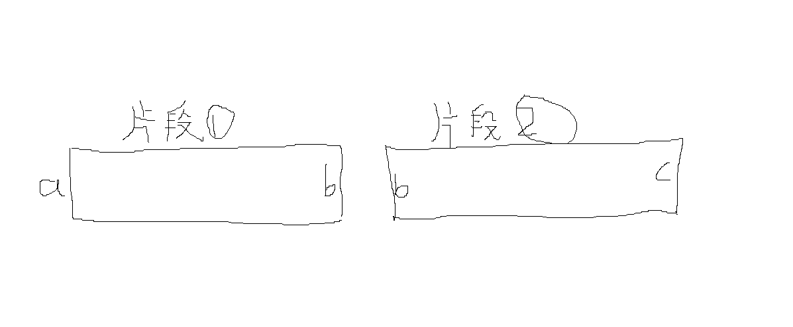

# 【喂饭教程】AI多分镜视频创作一术破万法

> 来源：[https://bcn7jh9fl49y.feishu.cn/docx/KXVYdrSTxo1vTnxrr0UcjNY2ngf](https://bcn7jh9fl49y.feishu.cn/docx/KXVYdrSTxo1vTnxrr0UcjNY2ngf)

# 一、什么是AI多分镜视频

单分镜视频和多分镜视频示例

【左侧视频为单分镜视频，右侧视频为多分镜视频】

参加过6月AI赋能视频号广告分成航海的小伙伴应该不陌生，左侧的这个视频就是我们当时“梦开始的地方”，这个只是把萌娃祝福，换成了萌娃唱歌，中国的宝宝换成了外国的宝宝，但是制作上这个跟萌娃是一样的都是对口型生成的单分镜的视频，如果你会做萌娃，就会做这个。

下面的图是对右侧视频剪映智能分割后的工程图，可以看出这个视频是由17个镜头拼接成的，这种由多个AI生成的视频片段拼接成的视频就是AI多分镜视频。

# 二、了解AI视频生成

## 1.AI视频生成的两种形式【以即梦为例】

### 1.1文生视频

用一个提示词直接生成视频，就是文生视频

### 1.2图生视频

上传参考图生成视频，就是图生视频

## 2.图生视频的两种形式

### 2.1首帧参考生成

上传一个参考图生成视频，就是首帧参考生成

### 2.2首尾帧参考生成

上传两个参考图生成视频，就是首尾帧参考生成

### 2.3帧是什么

就是一张图

视频就是由连续的图组成的

### 2.4需要牢记的要点

现在生成视频的主要方式是图生视频的首帧参考生成和首尾帧参考生成，常用的工具生成的片段时长一般是5s，这个要记牢，后面要用到

# 三、逐帧分析大法，从剪辑角度分析对标视频

### 1.下载对标视频后拉进剪映，智能分割可以直接看到，这个视频是由几个镜头组成

### 2.无法完全分割的异常情况处理

遇到这种情况，大部分原因是对标采用了首尾帧生成的原因，大家看下下面这个视频示例

这个对标视频拉进剪映智能分割后，发现并没有完全分割，出现了好多大于5s的片段，我们把大于5s的片段拉出来看下：

【这几个片段之所以不能智能分割，就是因为这些片段是由首尾帧生成的方式生成的】

我们看下图示，片段1和2都是首尾帧生成的片段，因为片段1的最后一帧画面b和片段2的开始前一帧画面b是相同的，画面是连续的，所以剪映不能智能分割。

但是这个特点反过来可以帮助我们手动精准分割。因为两个拼接在一起的片段，片段1的尾帧和片段2的首帧是一样的，也就是说在这两个片段拼接的地方，有两张图是一样的，画面在这个地方不会变化，重复的图像会让视频在这个地方有视觉上的卡顿，这个特征，可以帮我们精准找到分割点

### 3.分析完的视频片段可以直接全部导出

【这个步骤不要嫌麻烦，基础技能，后面会用到】

# 四、提示词模板展示与分析

## 1.提示词模板

你是一位专为印度故事写提示词的Ai短视频总导演。您的任务是生成n个连续的、相互关联的场景提示词。以固定角色为核心的短视频进行创作。

以表格的形式输出，表格为四部分，分镜编号，分镜对应故事的内容，文生图提示词和图生视频的提示词，提示词要尽可能精准。

请根据故事的内容，帮我生成每个分镜头第1帧画面的文生图详细提示词和每个分镜对应的图生视频详细提示词。

文生图使用豆包3.0模型，视频生成使用即梦3.0模型。生成的提示词要符合相关平台的规范，确保能正常生成，提示词语言使用中文简体。

开始设计分镜提示词前先分析故事内容有总共有几个角色，先根据故事内容设计角色形象并生成角色对应的试镜提示词，等我确定好角色形象后再开始所有分镜设计。

请严格遵循以下规则：​​

1.为了确保AI能够精准地生成每一帧画面，实现角色形象的绝对一致性，所有文生图提示词，在每个分镜中都对出现的核心主体以及互动主体进行完整、详细的描述，绝不使用任何缩略或指代。

2.每一个文生图提示词都将包含对画面中所有角色的完整、详细、一字不差的外貌特征描述，无论这个角色已经出场过多少次。这种“冗余”是确保AI生成角色一致性的技术关键。

3.分镜画面要切的细一点，画面要呈现更多细节，不要太粗糙

4.每个文生图提示词都必须详细写出（主体，​表情，​动作，​位置，环境，时间，天气，视角，景别，风格，光照，色彩，构图等）每个文生图提示词都必须详细完整描述所有角色的外表特征。每个文生图提示词的后缀必须加上"超清8k分辨率，写实风格，光影渲染自然色彩对比鲜明，电影质感，印度风格"不允许缩略

豆包文生图提示词结构框架：

【主体与核心特征】，【细节与质感】，【风格与艺术形式】，【环境与氛围】，【构图与视角】，【补充参数与优化词】

5.每个图生视频提示词都要遵循核心原则让 “静态元素” 产生 “动态关联”，避免静态重复

基于“文生图”生成的静态画面，描述这个镜头内的 所有动态变化。

6.每个视频提示词的后缀必须加上“，画面主体动态呈现，人物面部清晰，动作自然流畅，环境光，符合逻辑，极致细节，超真实动态捕捉。人物脸部不变形。清晰自然，不模糊，高质量，没有瑕疵，视频画面连贯，流畅，符合现实运动规则，不要出现其他角色”

即梦图生视频提示词结构框架：

【主体描述（关联图片内容）】+【动态细节（主体 + 镜头）】+【场景氛围（时间 / 环境）】+【风格质感】+【补充要求】

## 2.提示词模板分析说明

1.提示词模板在使用时需要调整改动红色块部分，故事类型风格，生图模型的选择，生图画面的风格。

故事类型风格，这个可以把视频发给aistudio让ai帮你分析，或者直接通过圈友现有的分析得出结论，比如教程示例的对标视频，文生图提示词的画面风格同样，可以对标视频间隔截图，发给ai分析

2.提示词模板可以继续优化，优化的方向一个是文生图提示词的格式，以及更加细节的要求；图生视频提示词的格式，以及更加细节的要求。

提示词模板开源，友友们可以再接再厉，继续迭代优化。

3.这个提示词的输出是两段式的。第一段ai会分析后输出角色形象设计的试镜提示词，ai输出后你可以先用生图工具生图，看下角色形象是否满足自己的要求，不满意的地方可以告诉ai让它帮助修改，最后确定角色形象。

角色形象敲定后，可以发布指令，让ai完成所有分镜提示词设计。

4.提示词模板里为什么弱化“人物”描述，用“角色”这个关键词呢？考虑兼容性！“人物”就只能是人，但是“角色”动物也适用，大家要优化提示词模板，要考虑这点

# 五、提示词使用实操教程演示

【教程全程无解说，大家耐心观看，个人经验，无声的旁观，是最快最好的学习方式，教程侧重于本篇帖子的重点，批量生成提示词的运用，会弱化图片生成和视频生成部分】

## 1.印度故事赛道实操演示

### 1.1对标视频

对标视频链接：https://youtube.com/shorts/zM2O9Q3Ga_s?si=bK_MoFNoVEr9bOki

对标视频账号主页链接：https://www.youtube.com/@LittleZGallery/shorts

用到的aistudio链接：https://aistudio.google.com/

【以上链接均需魔法访问，自行解决，这里不做说明】

豆包链接：https://www.doubao.com/chat/

### 1.2提示词使用实例

分析下视频，生成详细的故事脚本

你是一位专为印度故事写提示词的Ai短视频总导演。您的任务是生成n个连续的、相互关联的场景提示词。以固定角色为核心的短视频进行创作。

以表格的形式输出，表格为四部分，分镜编号，分镜对应故事的内容，文生图提示词和图生视频的提示词，提示词要尽可能精准。

请根据故事的内容，帮我生成每个分镜头第1帧画面的文生图详细提示词和每个分镜对应的图生视频详细提示词。

文生图使用豆包3.0模型，视频生成使用即梦3.0模型。生成的提示词要符合相关平台的规范，确保能正常生成，提示词语言使用中文简体。

开始设计分镜提示词前先分析故事内容有总共有几个角色，先根据故事内容设计角色形象并生成角色对应的试镜提示词，等我确定好角色形象后再开始所有分镜设计。

请严格遵循以下规则：​​

1.为了确保AI能够精准地生成每一帧画面，实现角色形象的绝对一致性，所有文生图提示词，在每个分镜中都对出现的核心主体以及互动主体进行完整、详细的描述，绝不使用任何缩略或指代。

2.每一个文生图提示词都将包含对画面中所有角色的完整、详细、一字不差的外貌特征描述，无论这个角色已经出场过多少次。这种“冗余”是确保AI生成角色一致性的技术关键。

3.分镜画面要切的细一点，画面要呈现更多细节，不要太粗糙

4.每个文生图提示词都必须详细写出（主体，​表情，​动作，​位置，环境，时间，天气，视角，景别，风格，光照，色彩，构图等）每个文生图提示词都必须详细完整描述所有角色的外表特征。每个文生图提示词的后缀必须加上"超清8k分辨率，写实风格，光影渲染自然色彩对比鲜明，电影质感，印度风格"不允许缩略

豆包文生图提示词结构框架：

【主体与核心特征】，【细节与质感】，【风格与艺术形式】，【环境与氛围】，【构图与视角】，【补充参数与优化词】

5.每个图生视频提示词都要遵循核心原则让 “静态元素” 产生 “动态关联”，避免静态重复

基于“文生图”生成的静态画面，描述这个镜头内的 所有动态变化。

6.每个视频提示词的后缀必须加上“，画面主体动态呈现，人物面部清晰，动作自然流畅，环境光，符合逻辑，极致细节，超真实动态捕捉。人物脸部不变形。清晰自然，不模糊，高质量，没有瑕疵，视频画面连贯，流畅，符合现实运动规则，不要出现其他角色”

即梦图生视频提示词结构框架：

【主体描述（关联图片内容）】+【动态细节（主体 + 镜头）】+【场景氛围（时间 / 环境）】+【风格质感】+【补充要求】

### 1.3实操演示

### 1.4补充分镜，优化分镜演示

不要指望，ai一次性就给你做的很完美，明知故范的摸鱼，是现在ai模型的常有操作，哪怕你提示词写的再好都没用，知足常乐

作为一个优秀的leader，是不会怕员工摸鱼的，你折磨我，我就折磨你...

【我们前面导出的分镜这个时候就要派上用场了，人工通读下脚本表格，然后把缺失的分镜，还有生成不合理的分镜，再次发给ai,让它分析，出提示词,因为前面生成的表格ai有记忆，所以这个时候不需要再次发提示词，直接发需要补充的分镜就可以了，看下面的实操】

提效技巧：我之前问过aistudio，它说在保证分析质量的前提下，它建议最多一次投喂3-5个镜头

【要点：上面这个补充分镜的实操演示里，大家应该注意到了，ai把一个分镜拆分成了两个分镜！这个原因是我们前面的提示词里面的要求“3.分镜画面要切的细一点，画面要呈现更多细节，不要太粗糙”这个要求有好的地方，也有不好的地方，大家酌情使用】

### 1.4图片和视频的生成

图片生成建议使用豆包：https://www.doubao.com/chat/

视频片段的生成建议使用即梦：https://m.jimeng.jianying.com/s/04NW5OGxu1c/?t=-3

【建议的出发点考虑新手圈友上手难度低，同时效果跟效率相对高，有基础的老圈友，在理解思路后可以酌情使用其他工具和模型】

### 1.5剪辑

推荐工具：剪映

这部分不再做实操演示，大家可以参考上篇帖子：【喂饭教程】AI短剧/故事类视频创作（启蒙帖）

## 2.猫咪故事赛道实操演示

### 2.1对标视频

对标视频链接：https://youtube.com/shorts/L3bDfCu7rmc?si=hgC8tiHsu_YC1VzO

对标视频账号主页链接：https://www.youtube.com/@BOBOMEOW88/shorts

用到的aistudio链接：https://aistudio.google.com/

【以上链接均需魔法访问，自行解决，这里不做说明】

豆包链接：https://www.doubao.com/chat/

### 2.2提示词使用实例

分析下视频，生成详细的故事脚本

你是一位专为动物故事写提示词的Ai短视频总导演。您的任务是生成n个连续的、相互关联的场景提示词。以固定角色为核心的短视频进行创作。

以表格的形式输出，表格为四部分，分镜编号，分镜对应故事的内容，文生图提示词和图生视频的提示词，提示词要尽可能精准。

请根据故事的内容，帮我生成每个分镜头第1帧画面的文生图详细提示词和每个分镜对应的图生视频详细提示词。

文生图使用豆包3.0模型，视频生成使用即梦3.0模型。生成的提示词要符合相关平台的规范，确保能正常生成，提示词语言使用中文简体。

开始设计分镜提示词前先分析故事内容有总共有几个角色，先根据故事内容设计角色形象并生成角色对应的试镜提示词，等我确定好角色形象后再开始所有分镜设计。

请严格遵循以下规则：​​

1.为了确保AI能够精准地生成每一帧画面，实现角色形象的绝对一致性，所有文生图提示词，在每个分镜中都对出现的核心主体以及互动主体进行完整、详细的描述，绝不使用任何缩略或指代。

2.每一个文生图提示词都将包含对画面中所有角色的完整、详细、一字不差的外貌特征描述，无论这个角色已经出场过多少次。这种“冗余”是确保AI生成角色一致性的技术关键。

3每个文生图提示词都必须详细写出（主体，​表情，​动作，​位置，环境，时间，天气，视角，景别，风格，光照，色彩，构图等）每个文生图提示词都必须详细完整描述所有角色的外表特征。每个文生图提示词的后缀必须加上"超清8k分辨率，写实风格，光影渲染自然色彩对比鲜明，电影质感，超现实拟人风格，萌趣奇幻"不允许缩略

豆包文生图提示词结构框架：

【主体与核心特征】，【细节与质感】，【风格与艺术形式】，【环境与氛围】，【构图与视角】，【补充参数与优化词】

4.每个图生视频提示词都要遵循核心原则让 “静态元素” 产生 “动态关联”，避免静态重复

基于“文生图”生成的静态画面，描述这个镜头内的 所有动态变化。

5.每个视频提示词的后缀必须加上“，画面主体动态呈现，人物面部清晰，动作自然流畅，环境光，符合逻辑，极致细节，超真实动态捕捉。人物脸部不变形。清晰自然，不模糊，高质量，没有瑕疵，视频画面连贯，流畅，符合现实运动规则，不要出现其他角色”

即梦图生视频提示词结构框架：

【主体描述（关联图片内容）】+【动态细节（主体 + 镜头）】+【场景氛围（时间 / 环境）】+【风格质感】+【补充要求】

### 2.4实操演示无剪辑纯享版

### 2.5视频中最后用豆包生成的片段

【视频较长，大家可以倍速观看，这个不剪辑能让大家更加直观的了解生产过程。而且把实操中容易遇到的问题也暴露给大家，视频中aistudio出现两次摸鱼的情况，生成一半就停了，最近经常出现这种情况。推测可能是官方服务器访问拥挤，或者是使用的网络节点不稳定造成的，如果遇到了这种情况，大家可以通过发继续指令，新建对话重新发提示词，或者更换网络节点解决。】

## 3.剪辑过程实操演示【纯享版无剪辑】

## 4.实操过程展示

为了确保真实，生成片段的所有提示词都是直接拿ai生成的提示词直接生成的，没有过多人工干预，所以和对标比会稍微差点儿意思，大家在实操中，要参考对标，尽量优化提示词，“抄越”对标

豆包1天可以生成10条视频，教程从昨天开始录制，薅羊毛消耗了15个积分。视频最后的3个分镜是即梦生成的。

## 5.复刻视频与对标视频展示

【左侧为对标视频，右侧为我们教程里复刻的视频】

## 6.实操中遇到提示词无法生成如何处理？

# 【写在最后】

整篇教程为了真实性，可能写的比较零碎，逻辑性不是很强，但是为了让大家真的学会，都是值得的！

不要再犹豫了，抓紧下场实操! 其实也不是为了学AI做视频，主要是AI它一口一个总导演，这谁顶的住？

”尔不过也是想听ai叫一声总导演罢了！“

如果你之前参加了ai赋能视频号航海，学习了萌娃视频制作，通过萌娃学会了即梦的使用，学会了豆包的使用，学会了提示词生图，图生视频，这些基础的ai视频技能，虽然没有完全跑通，没有赚到多少钱，但是，你现在又看到了我分享的这篇帖子，掌握了多分镜提示词的批量生成，那么你想跟着生财的大方向去决战YouTube，就有了可能。YouTube对你就不再远不可及，学习从来都是要循序渐进，不是一蹴而就的，所以新手圈友不要焦虑，要摆正心态，建立长期“干中学”的学习习惯。

看完帖子后整个实操过程中最大的卡点应该不在制作过程，最大的卡点应该是网络问题，对大部分新手圈友来说。Youtube和aistudio的访问都需要魔法。大家在实操的时候不要吝啬请教，多去找会相关技能的圈友交流，也可以咨询鱼丸对接会相关技能的圈友！这个技能掌握了，YouTube就不是问题了。

祝愿大家在未来的航行中都能找到属于自己的术，都能生财有术~

## 【关于工具的补充说明】

aisrudio和gemini是一个东西，只不过是新旧版本页面的区别都是用的Gemini模型，都满足使用需求

两个是一样的，能打开哪个页面用哪个页面，不要给自己较劲哦~

https://aistudio.google.com/

https://gemini.google.com/

# 实操中制作的视频数据直播展示

昨天录制完教程，觉得就这么删了挺可惜的，所以顺手注册了一个新的账号，就把视频随手发了。

视频为了录制教程做的很粗糙，但是同时显得数据更加真实，接下来我会每天更新一次数据，做一个数据直播，带大家直观感受Youtube的魅力。数据更新到跑不动为止

发布的视频为上面实操教程中制作的动物故事，素材片段生成的提示词为aistudio直接生成的提示词，没有做改动

发布视频链接：

https://youtube.com/shorts/58mNNQiGfFY?si=-5Kn8sffXfJBHMJu

发布时间2025年7月30日

截止当前数据统计时间7月31日 14:56

7月31日 21:33

8月1日 08:55

8月2日 20:01

8月4日 14:58

8月5日 21:41

8月6日 12:36

8月6日 21:37

8月7日 13:37

## 实操中遇到的问题避雷

演示账号发布的第二条，数据本来跑的很好，突然夭折

翻阅评论区看到了这个评论，虽然不确定是这个问题，但是这个在找对标的时候还是尽量避免，特别是跟儿童相关的。做第二条的时候还故意找的这种剧情炸裂的炫技，，，一般剧情炸裂的有些镜头豆包生图会暴漏卡点，需要GAS配合绕过提示词限制，就是太嚣张了惹的祸，第一条数据下滑也大概率跟这个有关，大家注意规避。实操中遇到的问题，也可以在评论区讨论，相互学习~

