# [YouTube新人必读中级篇2.0】进入深海圈前的无保留分享——做一个视频仅需十几分钟？

> 来源：[https://bcn5ot9wwnew.feishu.cn/docx/L4EkduoEYoshPnxSty3cBfRhnne](https://bcn5ot9wwnew.feishu.cn/docx/L4EkduoEYoshPnxSty3cBfRhnne)

hello，大家好，我是逸尘，先解释下两个事情哈

*   1.为啥是中级篇2.0？

说来实在汗颜，本来说努力努力把自动化跑通，收入上一个收入阶层再来写帖子的高级篇。但是做视频遇到了瓶颈，自动化也还没彻底跑通。所以此篇先定位中级篇2.0，等我月入两三千刀的时候再来写高级篇

*   2.为啥不沉淀到有写高级篇的实力再来写？

因为遇到了瓶颈，发现深海圈能帮我提效不少，所以加入了深海圈，我想进去好好沉淀学习一下，在此之前，我会把从0-1快速复刻对标视频到工作流的一些思考无保留分享给大家。在进行水滴石穿的积累前，舍弃过往繁华，抛去所有包袱，躬身入局。

# 零、前言

目前为止我一个高级YPP账号，播放量1.7亿+，千万级爆款两个，百万级多个。

但这也是阻挡我扩大或者陷入瓶颈的问题。单点收入局限，遇到当前的流量限制就一蹶不振。

基于此，本文会从以下几个方面进行分享

*   一、一个对标爆款视频的复刻

*   二、半自动化工作流的分享

*   三、99%全自动化工作流的思考以及流量瓶颈破局办法

*   四、以YouTube视频为根基的更大世界

小弟素来，闻过则喜，欢迎大佬们斧正

# 一、一个对标爆款视频的复刻

这个其实是给新手小白看的，开通YPP的大佬可以选择性跳过

## （一）找赛道（传统➡️工具）

找赛道的时候有一个误区，就是先去学习自动化工具，我个人觉得是不明智的，首先是有技术门槛，会浪费大量时间；其次，你的目的是找一个合适的赛道，仅仅一个！就算你自动化爬取了几万个，你最终只选择一个，能懂我意思吧

万道同理，找赛道也就讲究一个“低量爆款”，“低量”也就是作品数量少（控制在30个以内），“爆款”，对于我来说，每个视频基本上得有千万级播放，甚至亿播

很简单的道理，如果一个对标账号只有一千万的体量，你去学他，最多也就是个百万级，如果他是亿级，你就可能达到千万级

### 1.传统寻找方法

1.开几个号一起多刷shorts，找尽量感兴趣的视频，至少最后视频做完的那一刻你的心情是愉悦的，被视频内容给折服。实在不行做不反感的视频即可，做着做着看到收益会有兴趣的

2.看标签，视频下方的标签挨个点进去看，是否同类爆款视频比较少，说明这是个蓝海赛道；爆款比较多，说明这是一个容量足够大的赛道【注意：一定要观看最近一个周的，有一些视频可能是很久以前的，不具有参考性】


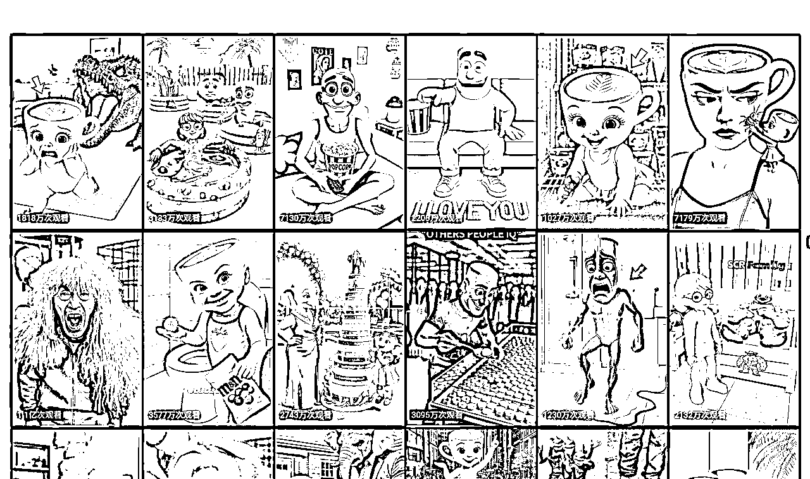

3.刷到感兴趣的，订阅点赞，那么系统会给你推荐同类视频，如果你发现这一类视频最近都比较爆火，播放量很高，而且视频数量比较少，那么或许就是你对标的方向。几个号这样子操作，你就能拿到几条你比较感兴趣的赛道方向，最后择一最优进行决断

总结：

*   最具潜力：同类少，订阅多，播放高，感兴趣

*   还能做：爆款多，播放高，不反感

### 2.迭代方法：现成的工具

#### 1）viewstats

https://www.viewstats.com/付费（top榜单筛选免费，更多要求筛选限制，数据查看限制）

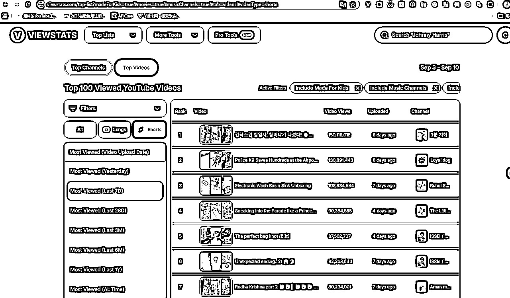

优点：野兽先生出品，十分强大，数据较为准确

缺点：只能查看top榜单，不能加入过多筛选条件【比如，不能直接针对性搜索一类“cat”之类的，然后再加入评论、播放量、点赞等限制】，但是如果是付费玩家当我没说，氪金就行

#### 2.vidIQ

https://app.vidiq.com/另外一款十分强大的数据查询工具


优点：数据也比较新，比较强大，也比viewstats便宜

缺点：免费版作用比viewstats还小

#### 3.圈友思明自研工具

https://www.media-copilot.com查询对标很有帮助

优点：限时/永久免费，现在去找思明大佬内测都可以免费领取；筛选条件丰富，数据量足够大


## （二）拆爆款

拆爆款必须借助Google ai studio这一神器：https://aistudio.google.com/

不熟悉界面的朋友们可以看我的上一篇帖子：https://scys.com/articleDetail/xq_topic/5125442228188414

### 1.利用GAS进行对标频道的整体分析

GAS是能同时点击“+”上传十个视频，这一步非常好操作，直接复制对标频道的所有爆款视频的URL，然后Ctrl V粘贴到对话框。（记住，爆款视频一次性粘贴的越多越好，数据越多，GAS分析地就更全面，就能拆解地更为细致）

这一步注意了，“十个”视频，只是历史最多只能上传十个，但是如下图所示，你只需要在之后的对话中把多余的视频delete，你就可以继续上传视频分析了。（而且之前的记忆会保留），这一点真的屡试不爽。但切记，只能历史十个，要不然你就无法继续对话了，它会显示internal error（但其实你删掉多余的视频就可以继续用了）

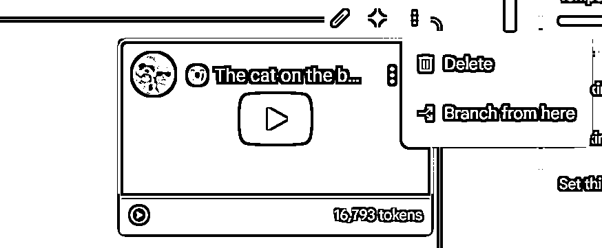

下图，就是我拆解今天做的视频，也就是上述我发的第一个视频，我把对标账号的120w播放以上的视频全部丢给了GAS让它帮我分析。（一个对话大概20w Token）

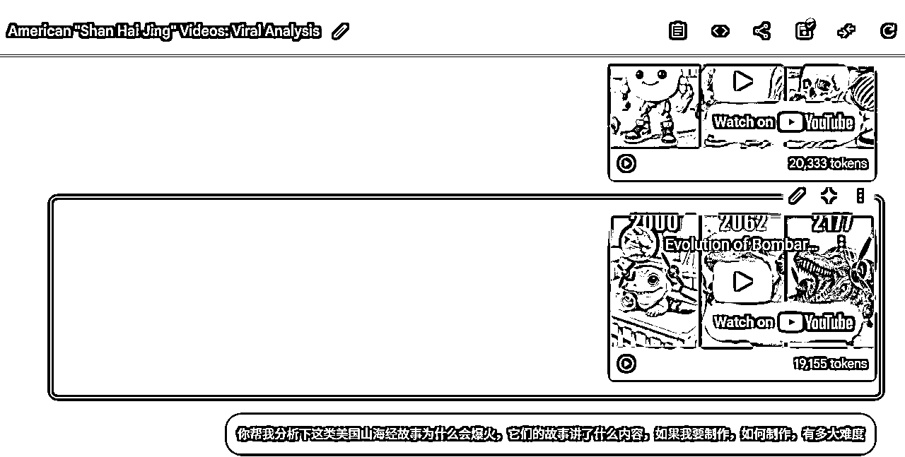

通过这个操作，你就能指导这个爆款频道的内容大概讲了什么，如果需要制作，能通过什么方法制作。

GAS会事无巨细地告诉你。

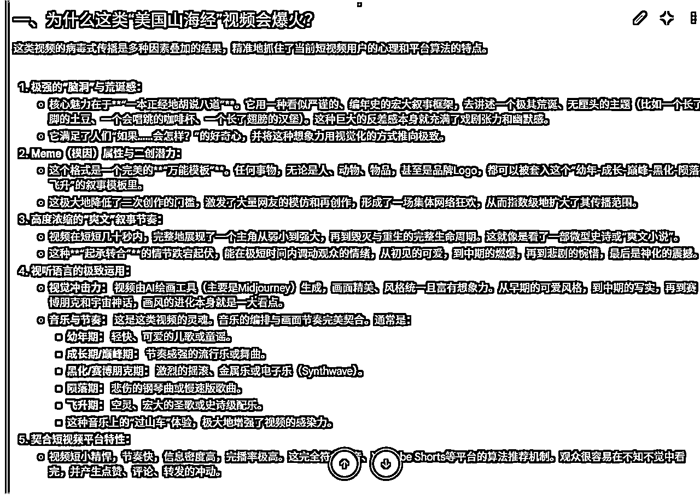


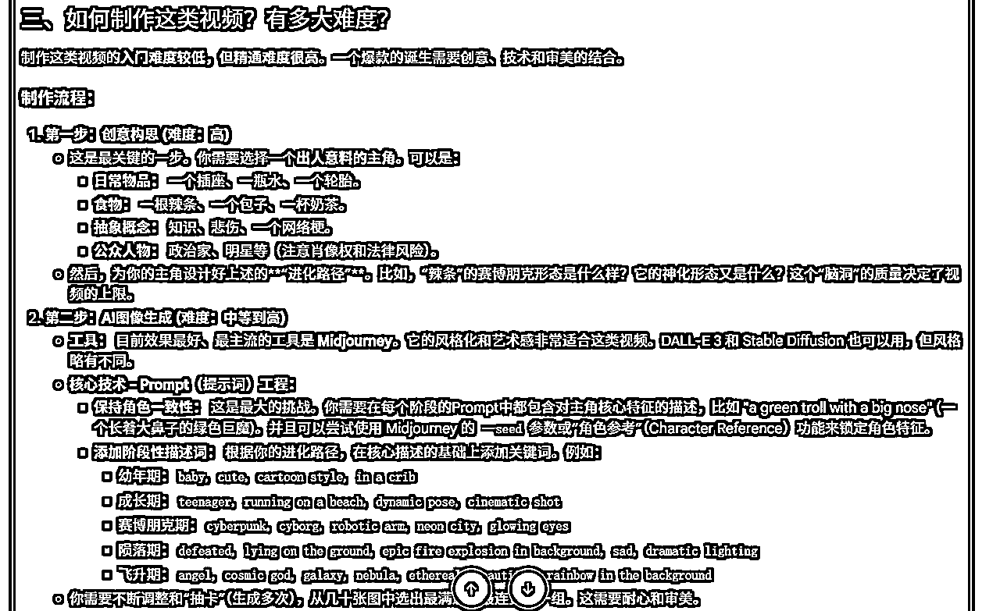

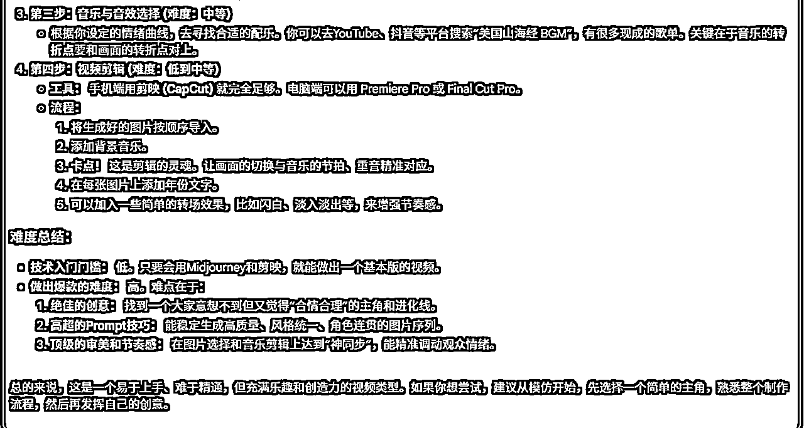

通过上述操作，这一个对标频道讲的是什么内容，为什么爆火，采用了哪些技巧，大概就能知道个七七八八

### 2.揆诸己身，能胜任否？

你需要再次观看对标频道的爆款视频，观察它的每一个细节：内容、音效、BGM、转场、滤镜、特效，是否是以你自身的技术能完成的？如果不能，但是确实对这个频道很感兴趣，提供一解

把这个视频发给GAS，让它告诉你某一帧采用了什么技术，怎么完成，如果你看得懂GAS的分析，那么就代表你也可以完成，那么就能做。不要怕，所有能力都是从有到无，不会就学，关键在于敢于去做have a skin in the game。No what, no why, just how to do it！

### 3.微创新——做最小的手术（文生图分镜头创作）

我的初级篇的内容，就犯了一个要命的错误，我对对标视频进行了大概百分之八十以上的修改，仅仅保留了一些非爆款元素，这才导致了前期的踟蹰不前。

前面也说了，“抄”才是最大的学问，不要创新！不要创新！不要创新！

至少新手阶段不要，原创后面会讲到，但是难度比抄大很多

“不要创新”的意思是指不要把你的天马行空的想象用在这里，只做最小的微创新，动最小的手术——只换人物主体（不要换的太离谱）或者就换一下服饰就好，背景也可以适当修改，但是不得影响视频的主要内容

具体操作如下：

#### 1）分解

GAS输入对标爆款视频URL输入提示词：【以下为迭代版本】

*   这个提示词只能说比我之前的强太多，用过的才知道。但是进入深海圈之后我肯定会更快地迭代，现在最多算个半成品

*   还有个要提醒的点是，我这套提示词和一卒大佬的相比可能少了点精准度，但是我这个是基于自身的工作流来迭代的。我之后有一些工作流或许也会采用一卒大佬的方式——用人物A、B这种来代替，再到excel表格一键替换【但这种仅仅适用于从前到后服饰没有任何变化的视频，有些故事可能会有多套服装或者形态，则我这套万能提示词就更吃香】

```
拆解这个视频的**每一个分镜**，给我生成能完美复刻的文生图提示词
用连贯的自然语言描述每一个分镜的文生图提示词(视角+景别【远景、近景、中景、特写、俯视、仰视、平视等等】+主体+主体的表情+行为+环境等)
文生图描述词示例：(平视中景，一只白色的大胖猫，在躺椅上戴着墨镜，手拿酒杯躺着晒太阳，身上盖着浴巾，背景是大海。)

修改主角：
【具体要修改的主角内容】
（比如：把“xx”换成“xx”）

必须遵循的原则：
视角的取值，必须且只能从`平视, 仰视, 俯视, 鸟瞰视角`中选择一个
景别的取值，必须且只能从`远景, 全景, 中景, 近景, 特写`中选择一个
“主体的表情”的取值，**必须且只能**从以下词汇中选择一个”开心，无奈，兴奋，愤怒，烦躁，悲伤，失落，惊讶，惊恐，震惊”
** 所有动作描述必须是客观、可执行的，并明确指出角色的相对位置**
每个镜头独立描述，因为我进行生图的时候每张图都是独立生成的，所以所有主角的提示词在每个镜头中保持一模一样，不得有一个字的不同（你必须假设每个分镜都会被一个**完全独立、无记忆**的图像生成AI所处理）
具有相同环境的镜头对于环境的提示词必须保持一模一样（比如在同一个房间里面，有两个镜头，那么这两个镜头对房间的描述词必须一模一样）

输出内容：
最后只需要给出我文生图提示词即可
不需要类似分镜1、分镜2的内容，只需要单纯的各个分镜的文生图提示词
```

#### 2）检查是否有遗漏的分镜【迭代过后99%不会出现这种情况】

GAS不一定能一次性输入所有的分镜头，所以需要再次观看视频，检查是否有遗漏的分镜，如果有，通过截图或者关键帧捕获工具捕获，然后让GAS添加

#### 3）二创或者微调人物细节

A.我的二创指的是对人物描述词之外的细节进行二创，具体迭代版本如下

```
你现在来帮我修改一些分镜的提示词。比如，我需要你帮我变动一下每个分镜的背景提示词（比如说，有一个镜头，背景是背景是模糊的、带有大片草坪的现代化别墅和绿树，你就可以给我增添一些别的不影响画面的事物，对整个画面进行微调，但不要影响故事的主体和主要内容展现，主要是为了避免抄袭的嫌疑。如果你没明白微调的含义，我再举一个例子，有一个镜头，在一间被摧毁的现代化卧室里，你就可以对这个卧室里面的陈设以及颜色进行一下描述，来修改一下这些不是很重要的元素，使得整个画面的主要内容与对标视频相同，但是次要背景与对标视频不同，有效帮助我进行二创）  ，但是主体的描述词不得进行二创
更换具体环境： 比如将“白色游艇”替换成“现代化的私人码头”、“豪华游轮的露天泳池边”或者“海边悬崖上的观景露台”。
增加环境细节： 比如将“沙滩”具体描述为“散落着贝壳和海草的白色细沙滩”，或者在“大海”背景中加入“远处的帆船”或“海面上的薄雾”。
改变时间和天气： 比如将“天气晴朗”的白天调整为“日落时分的金色黄昏”，或者在战斗场景中加入“乌云密布、风雨欲来”的紧张感。
调整色彩和氛围： 比如将“深蓝色的水下”描绘成“阳光穿透的、清澈见底的绿松石色热带浅海”，并在其中点缀“五彩斑斓的珊瑚礁和小鱼群”。
```

B.修改人物描述词：

我一般会给人物换个服饰啥的，或者直接换主体人物，这一步其实要看具体情况，不能一概而论。具体操作的时候把“（某个人物的描述词）”换为“（你想要的人物的描述词）”。

C.一起换（不建议，但是有概率爆）

```
你现在来帮我修改一些分镜的提示词。比如，我需要你帮我变动一下每个分镜的背景提示词（比如说，有一个镜头，背景是背景是模糊的、带有大片草坪的现代化别墅和绿树，你就可以给我增添一些别的不影响画面的事物，对整个画面进行微调，但不要影响故事的主体和主要内容展现，主要是为了避免抄袭的嫌疑。如果你没明白微调的含义，我再举一个例子，有一个镜头，在一间被摧毁的现代化卧室里，你就可以对这个卧室里面的陈设以及颜色进行一下描述，来修改一下这些不是很重要的元素，使得整个画面的主要内容与对标视频相同，但是次要背景与对标视频不同，有效帮助我进行二创）   和人物提示词（将主体的衣服颜色、种类等次要元素进行创新，不得改变主体的性别、外形、年龄等核心元素）进行微创

更换具体环境： 比如将“白色游艇”替换成“现代化的私人码头”、“豪华游轮的露天泳池边”或者“海边悬崖上的观景露台”。
增加环境细节： 比如将“沙滩”具体描述为“散落着贝壳和海草的白色细沙滩”，或者在“大海”背景中加入“远处的帆船”或“海面上的薄雾”。
改变时间和天气： 比如将“天气晴朗”的白天调整为“日落时分的金色黄昏”，或者在战斗场景中加入“乌云密布、风雨欲来”的紧张感。
调整色彩和氛围： 比如将“深蓝色的水下”描绘成“阳光穿透的、清澈见底的绿松石色热带浅海”，并在其中点缀“五彩斑斓的珊瑚礁和小鱼群”。
```

#### 4）文生图细节补充（非必须）

如果上述出来的文生图提示词你觉得还不够详细，也就是太过于简单，元素不够丰富，也就需要我们对文生图提示词进行优化

提示词如下：（这个根据自己的来调整，我只是举个例子）

你现在来帮我修改一些分镜的提示词。比如，我需要你帮我变动一下每个分镜的背景提示词进行微调（比如说，第一个镜头，背景是背景是模糊的、带有大片草坪的现代化别墅和绿树，你就可以给我增添一些别的不影响画面的事物，对整个画面进行微调，但不要影响故事的主体和主要内容展现，主要是为了避免抄袭的嫌疑。如果你没明白微调的含义，我再举一个例子，镜头10在一间被摧毁的现代化卧室里，你就可以对这个卧室里面的陈设以及颜色进行一下描述，来修改一下这些不是很重要的元素，使得整个画面的主要内容与对标视频相同，但是次要背景与对标视频不同，有效帮助我进行二创）

#### 5）细节完善（非必须）

这一步就更随自己的意了，就是哪个地方你觉得不好看，想换个颜色之类的，你就换就得了，描述得越精准越好。但是这一步也很重要，很多微创新就在这一步，某个颜色或许就是你的千万爆款甚至亿级爆款的钥匙。

特别注意景别设置，远景、近景、特写、仰拍、俯拍，都很关键

### 小结：

这一步看似不起眼，其实决定生死，一般我自己去操作，刚开始会花1-2个小时，静下心来，慢慢做，你若静心，花自盛开，每一次精心的雕刻都是伟大艺术品诞生不可或缺的步骤。

【现在已经能提速到几分钟完成】

## （三）文生图

这一步，也很重要，因为图片决定了观众对你的视频内容的直接感受，所以需要反复抽卡、打磨。一般也会花费1-2个小时【现在已经能提速到几分钟到几十分钟完成】

但是，效率至上，通过反复打磨提示词，让上述百分之八十的文生图提示词非常精准，生成出来的图片大多数一次过（生图的时候有细微修改）。

磨刀不误砍柴工，打磨好提示词再谈生图，效率翻一倍不止

### 1.抽卡 这一步一般有三种便捷方法（两种免费，一种付费）

#### 1）豆包一次性出图【不推荐，万一出错修改麻烦】

具体方法参考李澹归老师这篇帖子，我就不再赘述https://scys.com/articleDetail/xq_topic/1524488222818842

#### 2）即梦批量出图【推荐】

具体的方法还是李澹归老师的另一篇帖子，这里真的十分感谢李澹归老师让我节约了不少时间：https://scys.com/articleDetail/xq_topic/2852211242585521

【我迭代版本的方法放在半自动化工作流的地方讲】

具体的方法我就不再说了，就给大家几个小的注意的点（贴子里没写，读完帖子再来看我的注意事项）：

1.每次重新登陆都必须再次点击“添加账号”，然后才能用


2.有些图片生成出来时空白，这时候不用继续生成，因为你的即梦账号本身是生成了的，你去网页的即梦里面就能找到了

#### 3）批量出图付费工具（不推荐）

需要付款，需要的圈友可以去试一试这一款Chrome插件，支持GPT/即梦/MJ等主流生图工具，自动操作，加速效率。

这是官方文档：https://www.yuque.com/autojourney/docs/pkil2i72vcqfweld

Chrome商店搜：AutoGPT

### 2.对抗顽劣的图片

虽说大部分图片都能生成，但是确实有一些图片就是某个角度不对，或者服饰、身体之类的不对，我的应对方法一般有几种：

#### 1）最推荐：即梦4.0或者香蕉模型

指哪打哪，字面意思，用了就知道

GAS和Lovart都可以免费用

#### 2）反复抽，字面意思

#### 3) 精修提示词

这个其实比较看个人感觉，就是仔细观察你的提示词，你觉得通过哪里能修改正确就该哪里，反复生成到成功为止

#### 4）更换不同的生图工具

gpt（sora）、豆包、即梦、runway、海螺、可灵、MJ都是你可以选择的，多去尝试

#### 5）截图法

把你想要复刻的图片截图（或者关键帧）下来，发给AI，然后加上提示词，这样成功率会大一些

### 3.去水印

注意：开通了即梦会员左上角仍然有“AI”的水印，所以去水印在所难免，我这里推荐三款去水印好用的免费工具，

如果不考虑质量的话，我直接推荐一款google商店的插件（720p，对我来说有点无法接受）


第二款和第三款画质没变：

第二款完全免费，第三款不知道是否完全免费（至少我现在用的次数它是免费的）。它们的缺点都是一次只能去水印一张图，所以可以同时用。

https://online.niuxuezhang.cn/online-photo-watermark-remover/detail/

https://www.arkthinker.com/zh/watermark-remover/

批量去水印文件夹工具（里面有很多脚本）：

### 4.解决人物一致性问题

最推荐：即梦4.0或者香蕉模型或者gpt

字面意思，试了就知道

过时办法：

我其实不止用即梦生图，只是在山海经这个内容上，由于主体不具有一致性，所以我用即梦生图一点问题都没有。

但是往往很多视频（比如故事类的视频）是有较高的人物一致性要求的，所以我采用了以下方法来解决（在我尝试了很多工具之后，包括但不限于gpt、即梦、可灵、豆包、runway、vidu、智谱清言）

我直接说结论：

由于我没充MJ，所以以下内容均不是最佳答案（最佳答案就是充MJ，这就是AI和所有创作者公认的最好用的控制人物一致性的软件）

1.gpt

2.runway

只有这两个很不错。只需要先把你要当做主体的图片上传给他，比如一个猫爸爸和猫猫的视频，我就先上传给了gpt和runway。


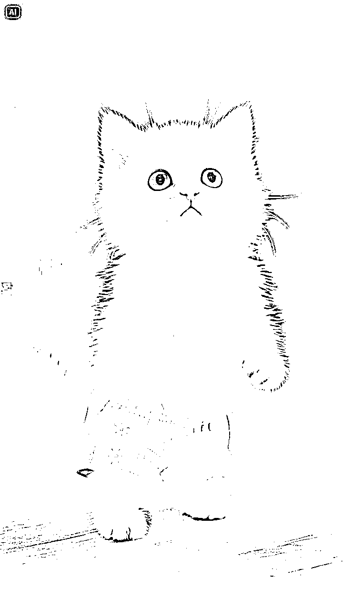

然后告诉它们，使得图片中的角色作为以下文生图提示词中的主体，再给出相应的文生图提示词。就能比较顺利地生成了。

由于gpt（大概一个号生成不超过10张图）和runway（最高1080，一次消耗积分8【720p消耗5】）使用次数有限，所以想要白嫖，就得多开几个号。如果不差钱，就结合我上述推荐的Auto工具，直接猛猛干！

## （四）图生视频

### 1.图生视频提示词

这一步，其实有朋友是有误区的，包括之前的我也是，为了节约时间，在生图的时候就把已经生成好的图片结合图生视频提示词去生视频，这其实是错误的，因为这一步有个（隐藏）方法，可以提高视频生成的精准性。

假设我们现在已经得到所有的图片，我们就可以把这些图片再次导入Google ai studio（GAS）让它根据图片来生成图生视频提示词（一次性上传28张没有问题，我没有测过极限）


* * *

我的迭代提示词如下：（请注意高亮栏里面的红色字体）

你是一名世界顶级的生成式视频AI提示词工程师，你的核心使命是不仅能预判动作趋势，更能依据成熟的【导演决策框架】做出最佳的运镜选择，并通过最终的【自我校验循环】确保输出的提示词在各方面都达到最高标准，最终输出一段纯净、精准、充满电影感的视频提示词。

#生成规则与输出格式

分析静态画面: 仔细观看这个视频，理解该视频每个分镜头的基础画面、角色状态和环境。你的目标是为每个静态画面注入“生命”和“时间”，为每个分镜头生成最适合即梦图生视频的提示词

生成动态指令: 你生成的提示词必须精准地描述“动”的部分。这包括：​

运镜方式: 根据情节需要，选择最合适的镜头运动，如【拉近镜头、拉远镜头、左推摇镜、右推摇镜、上摇镜头、下摇镜头、环绕运镜、跟随运镜、横移镜头、纵移镜头、前跟镜头、后跟镜头、侧跟镜头、升镜头、降镜头】等。

主体动作: 描述画面中核心角色或物体的具体行为。动作要连贯、符合逻辑。

表情变化: 捕捉并描述角色表情的细微变化，这是传递情感的关键。例如，从“平静”变为“震惊”，或从“享受”变为“惊慌”。

#提示词示范案例（严格遵循）

[运镜方式],+[主体动作],+[主体表情],+[可选的镜头切换或其他运镜]`

例子：过肩镜头向前推进，母猫坐在沙发上看着电视新闻，当看到星球撞击地球的画面时，身体前倾，表情逐渐变得紧张和恐惧。

#提示词风格要求:

单一语句: 所有的动态指令必须融合在一个连贯的中文长句中。

聚焦动作: 省略静态画面中已有的、不必要的形容词，重点描述“发生了什么变化”。

丰富详尽: 对“动作”和“表情变化”的描述要足够丰富和细致，确保动态效果的饱满。

为了辅助你理解，我给出以下提示：

这个“提示”提示的是啥呢？

其实如果只有图片+提示词是不够准确地，还需要“人为介入”

这个方法我愿称之为高效＋准确度的完美结合——口喷法【含金量极高，请仔细看！！！】

只需要打开输入法自带的“语音输入”功能

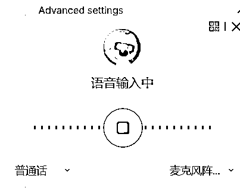

把你每张分镜想体现的动作完全描述给他，就能直出90%以上准确度的提示词，效果巨好，我一般不调整（注意：必须在同一个GAS对话框）


* * *

### 2.图生视频【迭代方法之后讲】

即梦+豆包=凡间无敌

千万不要买可灵，买的都是冤大头


## （五）剪辑

### 1.google ai studio助力剪辑

这一步不比我多说，就是看大家的剪辑功底的时候，但是，有一个但是！你只要擅用Google ai studio你就算是头猪，你也能学会高端的剪辑技巧，今天就给大家上一课。

就是大家看一下我刚开始的第三个视频末尾的回忆片段，我当时看到对标视频的这个片段的时候就觉得好高级，做不来，结果，我把视频丢到GAS，它马上就手把手教我用剪映把这个效果做出来了，由于当时的对话我没保留，就不好分享图片。但是，我想强调，只要你看到某个对标视频的效果，把它丢给GAS，它真的就能一步步纯小白都能懂地教你剪辑技巧

### 2.音效搭配

做动物视频的朋友们都知道，音效在故事里面至关重要（因为没有对话和字幕）。所以好的音效可以说决定了一个视频百分之三十的成败。

但是，思考搭配什么音效是一个比较困难的事情，老是在剪映的音效库里面搜索，却找不到称心如意的，那么这时候，有两个办法

#### 1）GAS

把视频URL丢给他，让它分析给出合理的音效


然后，我们照着GAS给出的音效名字去剪映搜，就比较快捷了，一般都能找到合适的。

#### 2）网站音效库

这个我更常用，打开爱给网网址：https://www.aigei.com/ 搜索想要的免费商用的音效，挨个试听，下载

#### 3.剪辑细节

这个细节很多，建议观看上一期航海的高手领航或者学下B站、抖音，就不多说了，细节的地方会在后面迭代方法中讲到

剪完了，不要感觉自我良好，先去找对标视频，看一下是否还有与它不一致的地方，尤其是转场、音效、色彩

## （六）反思-提升（非必须）

是不是到这你就觉得完了？该上传视频了？其实不然。

你这时候应该把你的成品视频最后上传给GAS，让它对比对标账号的爆款视频对你的视频进行评价，找出不足，进行查漏补缺。


我的提示词：

* * *

除了最后一个猫咪的，封面上有2016/2021/2160的标志的视频是我自己做的。其他视频都是来自一个youtube的美国山海经频道的爆款视频（长视频最低120w播放以上）。我模仿的对标视频是这个频道。现在我想把我的视频上传到youtube上，但我自己感觉我的视频似乎不太吸引人，所以我想让你帮我分析一下我的视频和前面视频的差距。你可以参考以下内容进行分析：评价一个真正优秀的YouTube长视频，意味着要进行一次全方位的审视，这个过程始于其核心内容与叙事，即选题立意是否兼具价值性与新颖性，其结构是否拥有强劲的开篇吸引力和严谨的逻辑框架，并通过张弛有度的播放速度与节奏和自然的转场衔接，来呈现其经过深度研究后得出的、事实准确且观点极具说服力的信息。在此基础上，卓越的视觉呈现是必不可少的，它要求画质高清且画面稳定，构图与运镜富有目的性，光线运用专业且能烘托氛围；同时，剪辑不仅要保证流畅更能创造节奏感，并有效利用高质量的B-roll补充画面、精美的动画特效和统一的调色风格来强化信息与美感。与之并行的，是同样重要的听觉体验，这体现在人声的绝对清晰与整体音量的精妙平衡，创作者富有感染力的发音、语速、语气和情感表达，以及与内容贴合的背景音乐和功能性与适度性兼备的音效设计。最后，视频的专业高度则体现在对整体质感的打磨上，包括准确易读且经过精心设计的字幕，从片头到片尾都毫无瑕疵的细节完成度，最终让所有元素和谐共振，共同铸就一部真正经得起推敲的、完整的作品。

* * *

上面提示词中的后半部分，其实也是让genimi帮我生成的优质长视频必备元素（感兴趣也可以之后分享）

然后，GAS就给了我相应的修改建议：


太多了，就不一一呈现，反正，我又去剪映里面修改了一下。哈哈，然后又出了第二版成片，才上传的Youtube。

注意：这块导出视频的时候就选择480p、25fps就行了，因为只是进行视频的诊断， 不需要太高质量。这样可以加快上传速度，提高效率

## （七）上传视频

### 1.导出配置

按照我这个就行了，不需要太高的分辨率，对播放量没有任何影响（2K也行）


### 2.标题和说明的生成

#### 1）GAS

标题其实能为视频增加曝光量，因为一个SEO优化友好的标题，观众能通过关键词搜索，从而得到更多曝光。

说明虽然不能增加曝光量，但是某种程度上能提高点赞量，因为如果在说明里面描述一下剧情，那么观众可能能更好地理解故事的内容，从而提高点赞率。

以下是我的迭代提示词：【根据自己需要更改】

视频标题

生成一个具有吸引力的YouTube英文标题。

英文标题后面必须带#cat #kitten #catstory#meow这四个标签

标题应进行SEO优化，包含核心关键词。

总长度（空格+字母）控制在70个字符左右（不算标签）。

视频描述

描述内容为一段完整的英文简介。

简介内容要富有吸引力，可以概括故事、提出悬念，并鼓励用户互动（如点赞、分享）。

在适当的位置添加1-3个表情符号来增加趣味性。

首先，固定包含以下三个核心标签：#cat #kitten #catstory #meow，在其后，根据视频内容额外补充5-15个相关的、有助于搜索的标签。

格式：​

[此处为完整的英文描述段落]#cat #kitten #catstory #meow #[标签4] #[标签5] #[标签6]\n\n

#### 2）对标微创

找到对标视频它是怎么弄的，你就怎么弄，然后稍微可以丢给AI润色一下，但是不要改具体的内容（我一般是用的豆包插件，因为就在网页上很方便，具体操作，看我这篇帖子：https://scys.com/articleDetail/xq_topic/8852484828841522），然后把标签和表情符号也可以按照视频风格进行适当的微修改

#### 3）发布时间和地区（非必须）

我觉得设置IP成美国，可能比较好，因为刚开始的几万流量都是美国的，可能之后的美国观众会多一些；但是也有不好的地方，想要杀出美国观众的审美，是很难得，就看自己的抉择了

时间的话，多去尝试，每天换着不同时间发，或者几天换一次，看下啥时候发最好，最好不要预定，直接发。如果视频爆了不用担心这个问题了——啥时候发都有大量流量。

频道流量起来了，可以一天更3-4条

#### 4）封面图（非必须）

shorts其实不太注重，用手机版改缩略图的时候选取视频里面你觉得最精彩的一帧就可以了

## （八）小工具

### 1.YouTube下载：

https://youtube.iiilab.com/最好用

### 2.canva制作封面以及做内容

其实长视频的封面是需要打磨打磨的，比如我这个

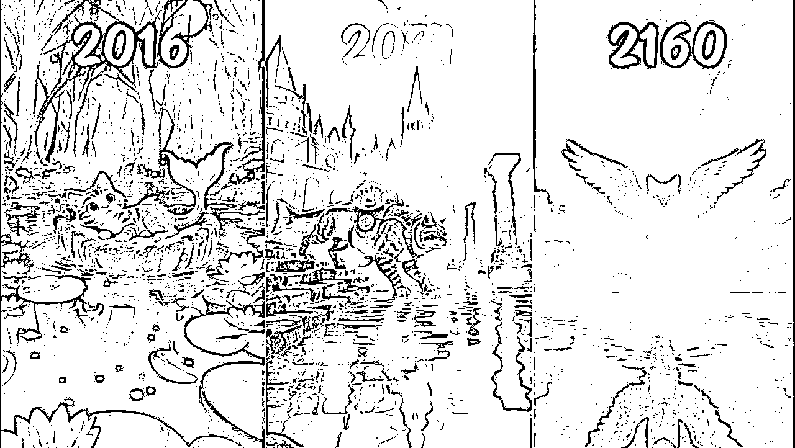

就是我精心用canva打磨的，首先，我之前做视频的时候生成了16∶9的图片，然后可以使用即梦的扩图变成9∶16（记得加超清）。然后再咸鱼上买个canva的会员，一块钱。就能直接选择制作YouTube封面：

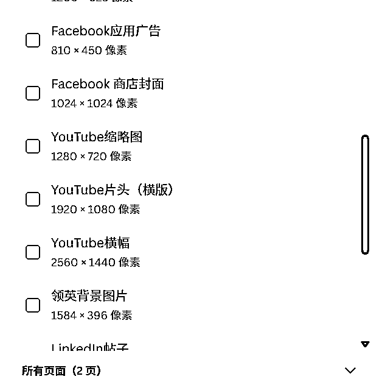

我觉得还是挺不错的。然后就是拼接上述生成的图片，这个很简单，拖动一下就好了。然后高清下载。

### 3.除了生成封面图，还能做视频内容

可以看到我最开始的熊猫最后一个回忆的片段有这样一个画面：


这封信其实也是canva做的，只需要找一个牛皮纸模版，然后修改一下，添加英文内容即可。做视频的时候弄关键帧就能做出视频中的效果

### 4.YouTube插件——你跟高手的差距


这是我的YouTube界面，有没有感觉哪里不一样，可以给你看一下我的YouTube插件有哪些


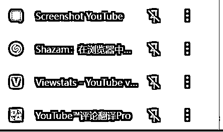

分别啥意思：

##### 1）vidIQ（充钱才能用，最大的插件作用如下）

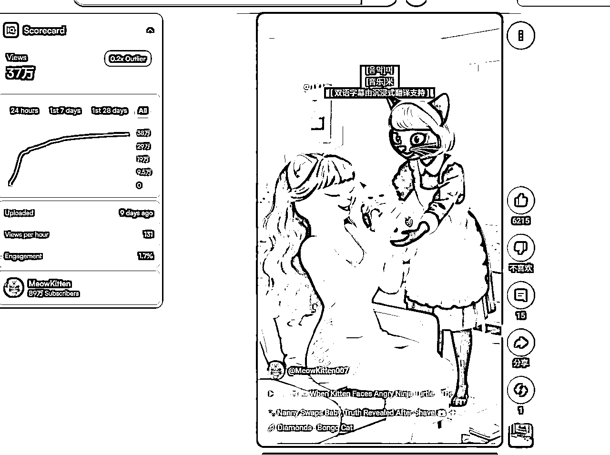

##### 2）pocketyoutube

给频道分组+观看未看视频+快速查找对标爆款【懂的都懂，含金量极高！！！】

##### 3）screenshot youtube（非必须）

##### 4）shazam

分析对标BGM

##### 5）viewstats说过了

##### 6）评论翻译

## （九）反思提升-数据分析

每一天都要仔细反思前一天的数据，手机端和电脑端都可以，看以下两个重要指标：

1.“继续观看”（很重要，跑到千万级别以上的都是75%以上的留存度我估计。然后看哪几秒下滑了，然后去优化内容）

只要选择观看在持续增长就可能爆，与起点无关；如果选择观看持续下降，就容易断流

2.热门地理位置（决定你的revenue，大爆款印度不可避免，不用刻意去规避）

3.“观看次数”，这个我就不多说了


就只需要研究这三个就好了，不断反思，总结，剖析自己的问题，进步！

# 二、半自动化工作流分享（多分镜）

以下是我自己在用的比较成熟的半自动化工作流的分享

## （一）查找对标赛道

流程：手动+圈友思明大佬工具+推荐

## （二）文生图

提示词参考上文。

我因为自身需求，对李大佬的工具略微做了些修改，还顺便开发出了一个sora版本的批量生图工具（这是我三个月前开发的，而且我一次性是两张图，如果四张图我没测试过是否有BUG，如果有任何BUG，自己用AI编程工具修改下即可）

我把两个压缩包分享在下面（有问题请自行解决，不要来问我谢谢，AI比我更聪明）

流程：文生图提示词（几分钟）➡️导入提示词并修改（一两分钟）➡️生图（sora一二十分钟，即梦一两分钟）➡️重新生成满意的图（反复生成+切换工具，几分钟到十几分钟）

注意：导入提示词注意导入markdown形式：


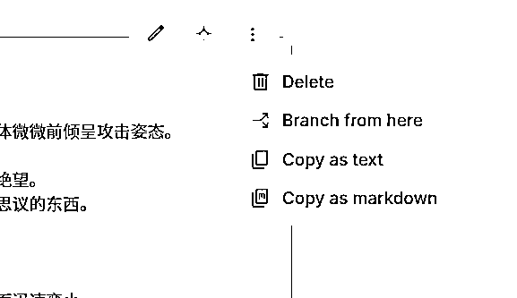

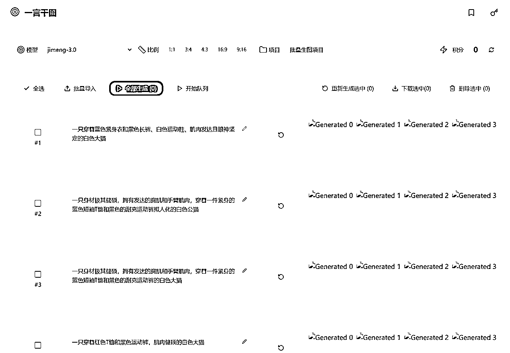

## （三）图生视频

流程：图生视频提示词（提示词+口喷，五分钟左右）➡️图生视频

图生视频自动化的最好方式就是自己研发工具接入API，我觉得太贵，我开发出来了只用过几次


替代办法：

即梦+豆包

为什么？

免费+高质量+速度较快

豆包每一个手机号每天免费10次，实测效果大于可灵2.1高品质模式（血的教训，可灵就是垃圾，我说的）

即梦每一个手机号每天66-100积分，平均8个视频左右

如果你有四个手机号，OK，一天一两个二三十个分镜的视频随便做的下来，动作复杂的用豆包，动作简单的用即梦

注意：即梦是高并发，可以不停上传图片和提示词进行排队；豆包每一次最多上传两个视频，但是多个号切换着来，基本无缝衔接

无缝衔接，只要脑子在线，不乱点，这一步一般就几分钟就做完了二十多个分镜

## （四）剪辑

也是有工具的，也就是剪映API，免费的，如果衔接到图生视频工具，可以按顺序导入视频并穿件草稿，就不用在剪映里面再拖动了，平均一个视频节约1-3分钟

## （五）音效

有一些工具生成的视频有音效，比如可灵（虽然他是s）

还有就是剪映SVIP的AI音效，每一个片段都可以生成


实在没有满意的，再用之前的方法加

但是最牛逼的操作，还是直接拿对标视频的音频，还是这个youtube下载网站：https://youtube.iiilab.com/

这一步直接节省配音效的十几分钟到几十分钟

综上，一个视频最快十多分钟就做好了

# 三、99%全自动化工作流的思考以及流量瓶颈破局办法

## （一）一个视频制作的生命历程（配音的暂时没研究，因为圈友做的大多数是没有配音的）：

创意➡️大纲➡️文生图提示词➡️文生图（包含修改）➡️图生视频提示词➡️图生视频（包含修改）➡️导入剪映草稿➡️拖拽视频➡️删减视频➡️添加BGM➡️添加音效

那么，需要自动化，就要把这些流程全部自动化了

抄袭的自动化很简单：上面讲的很清楚，十几分钟就完成了。但这种周期很短，或者说难以跨越周期

原创自动化呢？

完全自动化不可能，创意和图片选择、视频选择、添加部分音效都需要人为操作，所以只能在最大程度自动化的同时保留人工介入性

逐个分析

文生图、图生视频提示词、图生视频、导入剪映草稿并排序都已经算是自动化了

最难的点有三个：

1.好的爆款创意 2.不同的创意对应不同的提示词，所以文生图提示词稳定性难以保障 3.添加音效和BGM

我也暂时没有解决这些问题，只能讲一下我的思路

1.好的爆款创意

我从一卒大佬的灵感素材库得到启发，我可以建立一个自己的灵感素材库，并且尽量多用文字的形式去表达，为什么呢？我最终需要的是一个超级庞大的爆款素材库，然后丢给多模态模型，让它给我自动组合创意（用文字的原因是，识别文字便宜，图片视频贵，因为数据库肯定是本地的）；但这一点，我又觉得可以细化——细化成5s、8s、十多秒，几十秒几个层次的短视频

先预设N套提示词，然后让多模态模型帮我抓取创意并组合（这个预设的N套提示词也是相对不固定的，可以多介入人为的修改，就可以理论上创造出无数经过验证的爆款逻辑）

模型越强，这个创意理论上来说没有天花板，我觉得深海圈可以做这么个事

2.文生图提示词

经过预设的N套提示词，那么产出的创意也将对应N套的文生图提示词的提示词，那么形成的文生图提示词脚本就相对稳定

3.添加BGM和音效

同样创建数据库，把文字去记录每一个爆款视频对应的BGM和音效种类

也是同样地办法进行无限种组合，非常有想象力

## （二）流量瓶颈突破

最近我测试了一下，5s的短视频和59s的短视频RPM不相上下，甚至5s的还会高一些，播放量也更好一些。意味着只要你的创意够爆，那么播放量起来了，收益也不会差，把“短”做到极致，就是我接下来研究的方向

# 四、以YouTube视频为根基的更大世界

不知道有没有细心的圈友发现


为啥我之前展示的图生视频页面还有点好看呢，其实这就是我和我的黑客松队友们正在研发的一款AI故事类视频的工作流产品

从灵感到图片到视频，都是相当得快捷，以我的实际创作需求出发，一切都是以我的方便为基础来打造。我的这款工作流产品的逻辑上述也讲到过了，就差不多那样，但是创意那一步实现的还有点简陋（毕竟没有庞大的数据库），但是生图生视频都是相当的丝滑，最近还根据具体需要接入“改图”“按顺序导入剪映草稿”等提效功能，会在北京黑客松决赛完成一个比较完善的商业化产品。这个产品如果要上线，上线之前肯定会给部分圈友进行免费内测体验哈哈；如果上线成功，有需要的圈友，虽然做不到完全免费，也可以给成本价（毕竟API调一次给一次钱）

之前已经让群里面的大佬内测过了，除了贵都很方便，这也是我后续重点考虑的点——是接入残血大模型还是调用低价API。圈友们后续创建自己工作流的时候也可以考虑一下这个问题

以YouTube为根基的更大世界这个小标题的意思就是，YouTube还是靠流量分成较多，如果想闯出更大的天地，还是得把目光放远一点，做这样的AI工具站，出海赚saas订阅的美金（老外一美金可以生成几个高质量视频了）。

还有一个就是YouTube长视频，我接下来或许也会对其进行攻略，短视频在于极致的“短”，长视频的“长”也不是长度的“长”那么简单，但是我做了一个长视频，是我短视频的17倍，我瞬间对短视频失去了兴趣哈哈

大家一起加油！ 早日日入万刀！