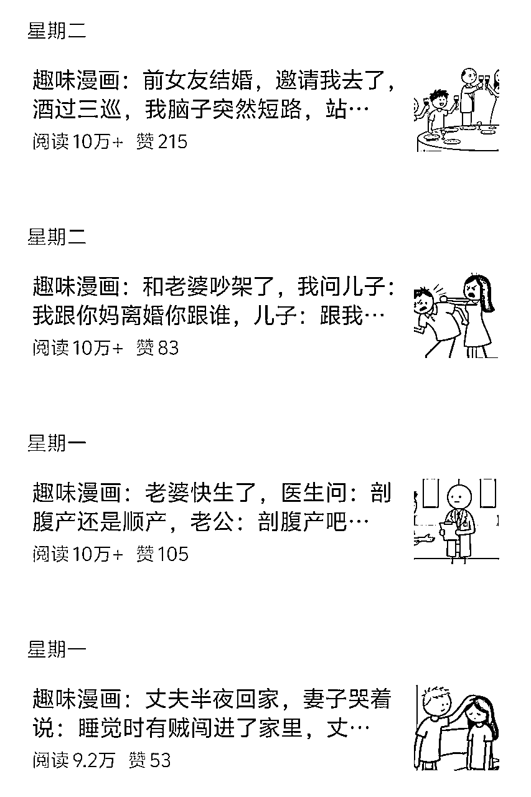
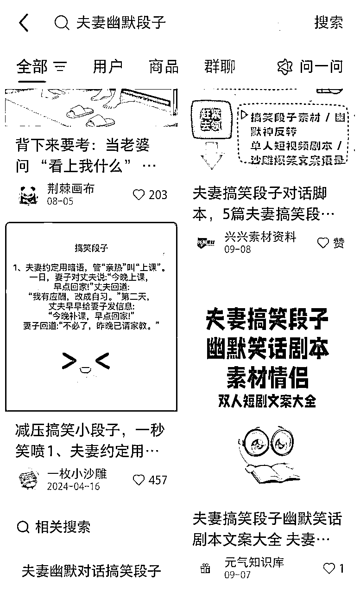
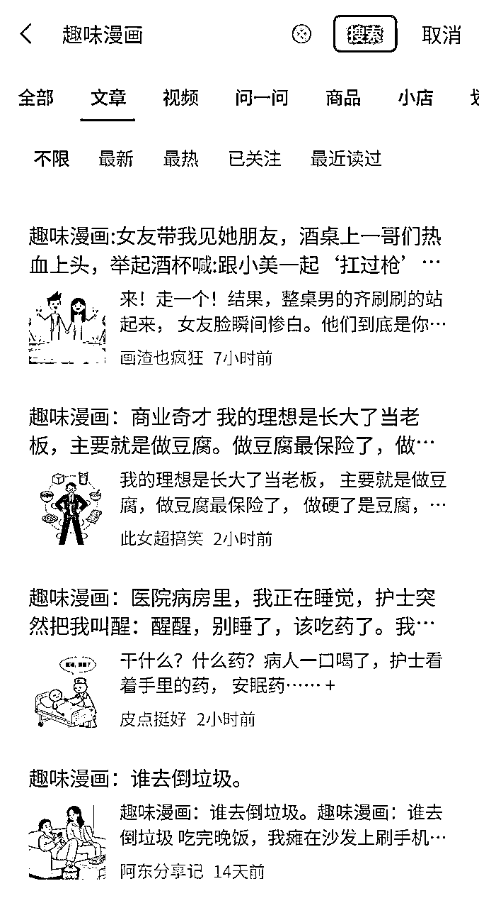
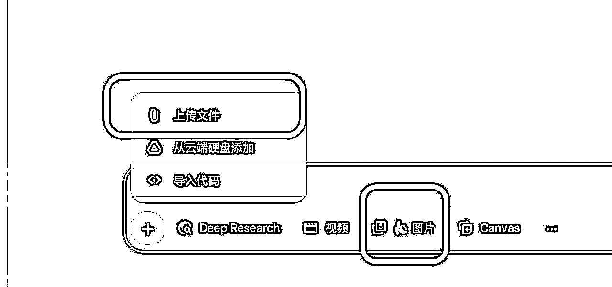
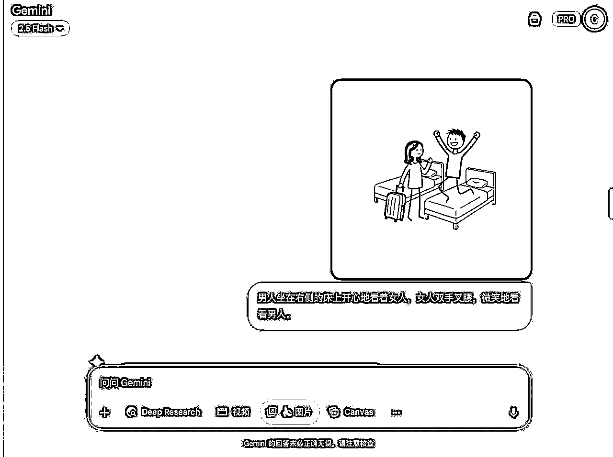
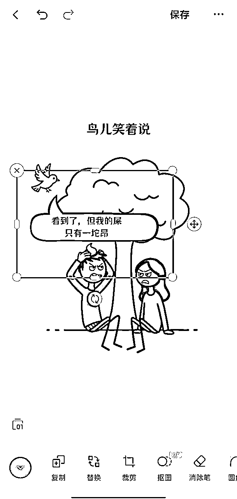

# 趣味漫画篇篇10W+，怎么制作？只需三步即可制作，可保持人物一致性，保姆级实战教程

> 来源：[https://fcnked2dqtcf.feishu.cn/docx/EvXgdzDcZoebYLxl09XclDksntc](https://fcnked2dqtcf.feishu.cn/docx/EvXgdzDcZoebYLxl09XclDksntc)

大家好，我是钱磊，之前一直看大家的内容，自己不好意思发，这是我在生财发的第一篇帖子，感谢大家。

这一阵子公众号上连环漫画很多，于是这次出一期详细的连环漫画制作过程。

首先这种漫画的形式是这样的：

我们能看到这种内容流量非常好，很受平台欢迎。

但外行看热闹，内行看门道，目前网上搜索很多教程教你怎么去做，大多都是用coze智能体去做，但你会发现做出来的效果不是很好。

要么人物无法保持一致性，要么背景无法保持一致性。

连环漫画最大的特点就是，剧情是连贯的，你不能上面是张三，下面突然变成李四了，这样很影响阅读体验。

那么有一款工具就能很好地解决这个问题：gemini2.5。

他的文生图性能非常优秀，而且在保持一致性方面，我认为是目前最强的。

给你看一下我自己做出来的漫画：

你看人物一致性的问题是不是完美解决了？这是我自己做的，熟练的话，半个小时就能完成一幅漫画，下面我手把手教你怎么制作。

第一步：找文案

连环漫画重要的是剧情，没有好文案，漫画做的再精致，也没什么人看。

以下两种方法找文案：

1、小红书、抖音，直接搜“夫妻幽默段子”，文案可以稍加修改。

2、找对标的爆款公众号，直接搜关键词“趣味漫画”，你会得到很多爆款案例，记得不要完全一样，适当修改二创。

有文案了之后，你要把他们拆分成几个部分，你要做四幅漫画，就拆成四句提示词。

比如下面这样：

①男人和女人在宾馆，里面是双人床，男人开心地要跳起来了，女人左手里拎着个行李箱

②男人坐在右侧的床上开心地看着女人，女人双手叉腰，微笑地看着男人

③男人坐在右侧床上，女人坐在左侧床，两人互相看着

④男人崩溃大哭，女人过来安慰男人

第二步：把提示词输入gemini2.5

gemini需要魔法才能使用，这个自己搜索就能解决。

下面我讲实操：

在使用gemini2.5时，如果你对自己设计的形象不满意，你可以上传图片，让gemini给你修改，当然不要忘记打开生图按钮。

然后输入我们第一步拆分出来的提示词：

注意，这里一定不要让他给我生成聊天框内容，因为gemini对生成中文还是有难度，如果你图省事让他生成对话内容，你就会得到一堆外星符号。

背景尽量是白底，这样方便我们抠图，去除AI水印。

第三步：对图片进行加工

到这里，基本上算最后一步了，加工图片的软件有很多，比如剪映自带的图片编辑，醒图，稿定设计，黄油相机，美图秀秀等等。

我这里常用稿定设计，用了几年了，个人习惯。

可以看到，图片上面的旁白和聊天框内容都是后期加上去的。

你所看到的那些精致的连环漫画基本上都是这么做的。

大家可以去百度搜一些PNG格式的聊天框素材，后面能一直用。

聊天内容就是你找到文案，二创一下就可以。

然后去公众号发布，坐等流量上门就行了。

连环漫画在公众号应该还能有很大一波流量，趁着现在公众号有流量扶持，赶紧去做，别给自己找借口。

我相信这篇内容发出去后，绝对有小伙伴开始执行了，请务必抓住这波机会。

如果你在学习过程中遇到什么问题，直接下面联系我就行。