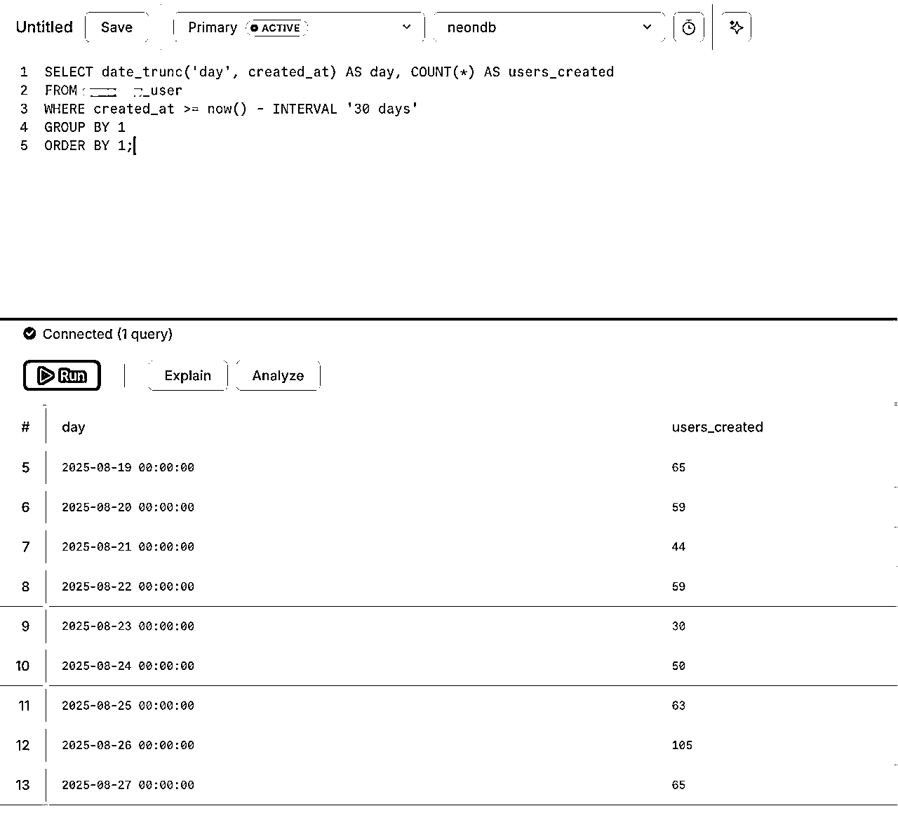
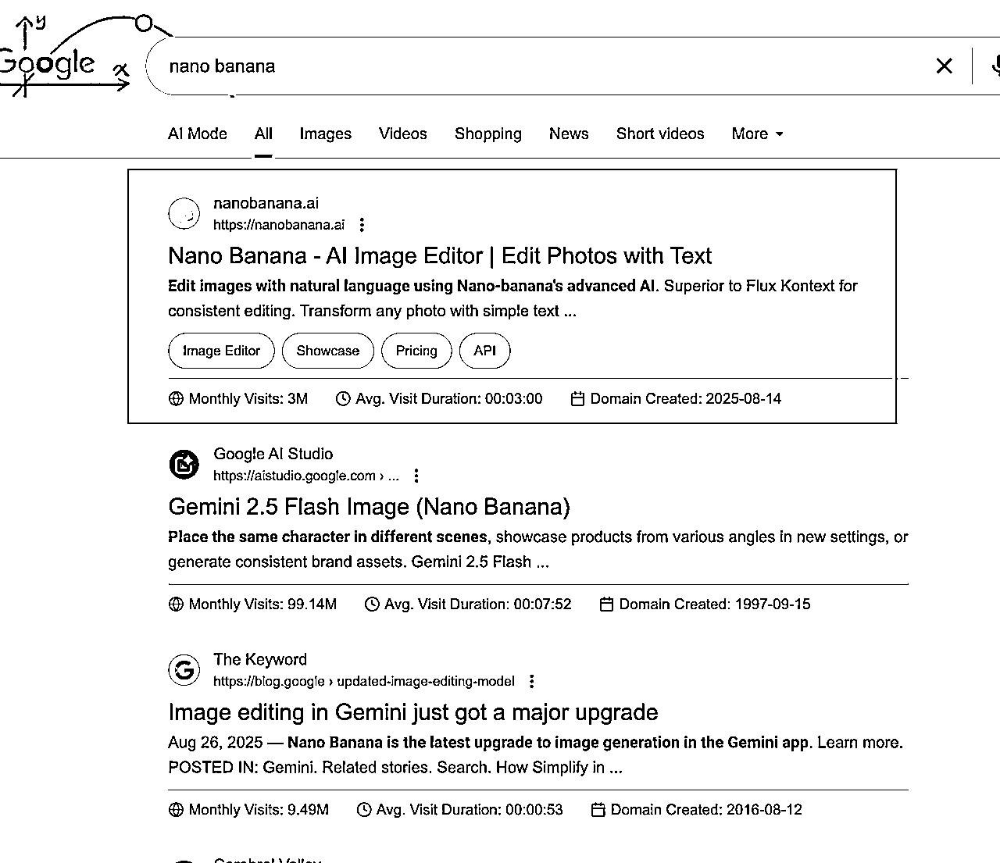

# 海外AI产品新手复盘：4个月赚到1刀，15天破1000刀

> 来源：[https://zhizhe888.feishu.cn/docx/Z40jdqs7woO8sxxDtgFcG6sDnVb](https://zhizhe888.feishu.cn/docx/Z40jdqs7woO8sxxDtgFcG6sDnVb)

# 一、前言

大家好，我是王马扎，从今年3月中旬开始动手做海外AI产品项目，到8月末突破1000刀，这篇文章我将分享从0刀到0.01刀花了4个月，从0.01刀到1000刀花了15天的完整经历。

在开始分享前，申明如下：

我的分享中涉及的关于如何挖掘需求，如何用AI做产品等等一系列的方法论，全部来自于生财有术和我的两位老师 @哥飞 和 @刘小排，如有雷同，版权归生财有术和两位老师所有😁。

整个复盘，来自我3月中旬到现在，自己的实践经历，结合在生财和两位老师学到的方法。如有错误的地方，欢迎👏🏻交流。

# 二、自我介绍

我是2020年418加入的生财，5年老圈友了，2019年举家搬迁到杭州，是我这辈子做的最正确的决定。这是我第一次在生财写这么长的帖子分享。

生财完完全全改变了我，在加入生财之前，只知道上班，对于商业一无所知。

出身农村，大学毕业为了多赚钱，进了一家传统行业的国企，去了才知道，工作条件非常差，比想象的还要差：公司在一个18线县城，工作要带安全帽，穿工作服，时间长了还会有尘肺的风险。

当了3年工人后，从18线县城去到北方二线城市，依然是传统行业，工资低不说还总加班。

偶然的听前同事说，搞互联网当码农赚钱，硬着头皮花了1万多报了一家网课，裸辞，去图书馆学习，从第一行“hello world”开始敲起，那时不像现在，有AI编程，完全是硬敲键盘一点点学。

敲了3个月后，投出了几十份简历，最想去的是杭州，没想到竟然有一家南京的公司要了我，虽然算上我只有3名员工，也算半只脚踏入互联网圈了。

那时已经在北方买了房买了车，孩子2岁，放弃这一切去一个陌生的南方城市，完全未知的世界，在这之前，还没去过南方。

在南京工作不到一年，我收到了杭州一家世界500强车企的offer，对于我这样一个情况来说，可能算是奇迹了吧。

入职杭州公司的同时，全家也从北方搬到杭州，正式开启了杭漂的生活，家人很喜欢杭州，两年后升职加薪，在杭州买了房，算是彻底安顿下来。

2020年418加入生财后，这5年里，跟着生财做了好多项目，比如知乎好物、小红书电商、AI写作服务、公众号爆文等等，期间还当过生涯规划咨询师，做过几十场的职业发展咨询服务，虽然没赚到大钱，也是赚到了作为独立个体的第一桶金。

# 三、为什么我选择海外AI产品这个项目？

这几年做了好多项目，有成功的，更多的是失败的，总是很焦虑的在找项目做项目的循环中，有时很累，有时很爽。

迷茫时会想，自己究竟要做什么？这个问题想了好久好久，直到最近才逐渐明白，光靠想是没有答案的，需要在不断的试错碰撞中去找。

之前做过的很多项目有的是比较短期的，过了红利期，想赚钱越来越难，比如知乎好物；还有的项目，是能赚钱，但是自己内心是比较排斥的，比如AI写作服务，需要谈单，跟人聊，对于我来说比较消耗；还有的赚的就是辛苦钱，比如职业发展咨询，准备一场咨询要4个小时，想要放大收入很难，手停口停。

海外AI产品这个项目，对于我来说，刚好能满足：既能赚钱，又特别喜欢，同时我还有一点能力优势，而且很重要的一点，现在的趋势在这里，用AI创造AI产品。

去年11月航海家大会时，亦仁说过的一句话印象特别深：“我们都是一条小鱼，从一个池塘换到另一个池塘，但是游到某个瞬间会发现，开始走进了属于自己的一片大海。”

我现在就是这种感觉，最近不那么焦虑了，做事也不那么急躁了，开始系统的以终为始的思考，因为我发现似乎找到了属于自己的那片海。


# 四、追新词，我花了4个月赚到第0.01刀

从出海第一天到赚到第0.01刀，我花了4个半月时间，这期间上线了15个网站（大概是这个数字），

下图是我在即刻关于AdSense收入的记录，7月26日第一个网站申请通过AdSense赚到第0.01刀，8月22日到50刀，9月初突破100刀。


下面详细复盘一下整个过程，真的是一波三折：

### 4.1 出海前3个月的上站情况

第一阶段（3月中旬--3月30日）：从今年3月中旬开始，正式动手用AI开发网站，在4月初之前，没有做AI产品，而是出海小游戏，跟着3月的web航海，半个月时间上线了7个小游戏网站，这些网站毫无例外都没有什么流量。

不过这期间最大的收获是掌握了如何用cursor开发网站。对于提交网站到GCS和GA都非常熟悉了，上线新网站整个流程比较熟悉。

第二阶段（4月初--4月26日）：参加完3月30日生财航海家下线大会后，跟一些圈友交流后，感觉不能光做小游戏站，做AI工具订阅站的想象空间更大！ 4月初除了陆陆续续又做了几个小游戏外，花了两周时间，注册了美国公司，申请了stripe。

3月末，ghibli(吉卜力)大火，我也注册了一个域名，花了20多天做了我的第一个带支付的AI工具站，这个站到现在也没出单。

第三阶段（4月底--6月初）：这一个多月时间，我陷入了完美主义，通过similarweb，找到一个新词italian brainrot（后面会详细讲如何找到的这个词） ，但是因为自己技术能力当时还不太行，加上完美主义，总想着做出完美的交互，到最后这个产品也没有上线，对于新手来说，这个也是一个大坑，太过于追求打磨产品细节。

总结：做出海web项目前三个多月，上线了10个网站（只有一个AI工具站，其他都是iframe的游戏站，还有一个未上线的工具站），没有赚到钱，甚至都没有做起来有一点点流量的网站。

### 4.2 出海第4个月，终于做出有正反馈的网站，我是如何找到需求的？

事情的转折发生在6月7日，我从杭州赶到上海参加@哥飞 老师组织的线下活动，整整一天，可能是大脑受到了刺激，回来后的10天内我连续上线了5个新的网站，这些不是游戏站，而是iframe huggingface网站上面的模型做的AI工具站。

如图，是当时发在即刻上面的记录，现在发现随时记录真的很好，回头看，还是很激动的！


这5个网站里，最终有2个持续有流量，通过AdSense为我带来出海web的0.01刀。

这两个有流量的网站是如何找到需求的？

两个获得流量的网站其实还有点不一样的，一个是新词，我是第一个用该关键词注册域名上线的；另一个，是一个一年多的老词。

①先说第一个，

这个新词是在X平台看到一个大V发的，然后用这个关键词去Google trends搜索，发现的确是一个新词，流量是gpts的5分之一，具体见下图，这个是我当天的截图 。

从图中可以看到，在我注册域名之前，.com .ai .net等域名都已经被注册了，但实际上他们都还没上线。

因为自己是新手，说实话也没抱多大希望，就花了3美元注册了一个域名。


花了几个小时搞定了网站，上站后主要是在GSC上提交网站URL和sitemap站点地图，加快Google收录，然后接入Google Analysis做数据分析，

除了这两个以外，我还接入了plausible，也是做数据分析用的，看数据比Google Analysis方便一些。具体上站后的细节就不展开啦，生财的航海手册写的非常详细。

②再来说下第二个网站，一年多的老词，我是怎么挖掘到的，

在讲如何挖到这个词之前，大家可以看下这个网站，很有意思，域名是vercel的，也就是说，这个站长连域名都没舍得买。

再看右侧AITDK，4月份的流量有24k，这个网站只有一个首页，而且就这一个iframe的组件，其他什么都没有。

就一个这样的网站，竟然排在谷歌搜索的第一位！这不就是软柿子了吗？我在6月5日的笔记里也记录了，下图右1。


接下来重点说一下，我是如何挖到这个词的（注：这个方法的思路是从@哥飞 老师的社群学到的），

这个词，是通过用Similarweb分析huggingface.co找到的，具体步骤是这样：

打开Similarweb，输入huggingface网址，在关键词研究里面选‘着陆页’，可以看到某个时间范围内（最好选28天内）huggingface内页流量情况。

然后找到那些流量还在上升的内页，用这个内页的关键词去Google trends验证流量情况，用Google 搜索去验证竞争对手情况。

找到那个‘软柿子’，去做一个用户体验更好的网站，就有机会拿到流量。


这里要说明的一点是，挖掘需求，是一个慢功夫，有时也看运气，不能抱着只要去找，就一定能找到的心态去找，很多时候，是研究分析了几个小时也没收获。

我的经验是，新手不要想着找到流量巨大，竞争很小的词，这不现实。不管遇到什么词，只要觉得有机会，先上站拿到正反馈，把整个环跑通，这是一个循序渐进的过程。

### 4.3 流量“暴增”阶段，受到Google惩罚，流量归零

上面提到的两个网站，上线没有几天就拿到流量了，尤其那个新词网站，从第二天开始就爆发了，虽然日uv还不到1000，但对于新手来说，第一次的正反馈很激动！

但没过几天，这个网站就被Google惩罚了，流量基本归零，看下面这个截图，从6月20日开始，曝光和点击的两条线就贴着地面了。


最开始核心词拿到排名第3，还有一个词拿到第1，但是上线了多语言后，核心词直接搜索不到了，过了两天我加了内页（也有多语言）上线后，排名第1的词今天也搜不到了，有点被Google ban掉的感觉，几个核心关键词Google完全搜索不到，换了IP和浏览器测试也是一样。

发现这个问题后，赶紧问chatgpt o3（那个时候还没有gpt 5 thinking），

o3分析后告诉我，可能有以下原因：

①多语言问题，上线多语言前一定要仔细排查，让o3确认一下是否有问题，我有两个在GSC的搜索排名中，同时出现了/ja和/ja/这种现象，我推测有可能是被判断重复页面而处罚了，因为对于搜索引擎来说，/ja和/ja/是两个URL，内容完全一致，那么至少会降低排名权重的。

②复用模板导致页面重复。这个更奇葩，我昨天上了一个新网站，用的是有流量的这个网站的代码，上线时虽然屏蔽掉了多语言的选择按钮，但是搜索引擎仍然收录了多语言的URL，

而新上线的这个站，其他语言我并没有做任何处理，这就导致了除了en外其他语言的页面在搜索引擎中出现了两次，不同的域名相同的内容！

我发现这个问题后，赶紧在robots.txt里把除了en以外的页面加了disallow，同时在GSC中删除被收录的多语言页面。

我觉得这个可能是导致出现排名消失的导火索，当时完全不知道后续能不能恢复排名。

③sitemap设置问题，导致搜索排名被稀释了。sitemap里面设置的多语言没有设置<xhtml:link rel="alternate" hreflang="x-default" href="https://xxx.com">，告诉搜索引擎其实这些多语言是同一个页面，只是不同的语言。我之前上线多语言时，只是简单的把每个多语言页面罗列上了。</xhtml:link>

④没有为http设置301永久重定向到https。

如图，在GSC中看到http和https同时出现在搜索结果中，问了o3，给出了详细的解答。


当时遇到这个情况是很沮丧的，还没高兴一周，网站就废掉了，下图是当天的复盘笔记。


我联系了@哥飞 老师，他建议我多加一些外链，说可能网站还有救。

听到网站还有救，赶紧去找外链，开始搞外链！

### 4.4 流量恢复，申请AdSense多次遭到拒绝

按照O3给的指导建议修改，加上不断的上了几十个外链后，刚好过了整整一周时间，流量竟然回来了！

从GSC可以看到，6月27日悄无声息的就重新被拉起来了，后面几天还创了新高。

不过这个网站是追的新词，随着竞争网站增多，加上新词热度下降，我的这个网站流量也开始出现了下滑。


流量问题解决了，开始想着通过AdSense变现。当时刚好参加了6月的航海，按照航海手册把两个有流量的网站申请了AdSense。

然后就开始了漫长的等待。我看有的圈友申请AdSense快的几天就好了，我的两个网站等了好久，每天打开好多次AdSense页面去看是否申请通过，太想赚到第一美金了！

结果等了两周，告诉我申请不通过：低价值内容！


继续问O3去排查，我把上面的截图发给O3，他跟我说，网站太单薄了，没有/about /contact /blog 等等这些页面（具体如下图），AdSense会认为这个网站是个低价值内容网站，就会拒绝。

O3还提醒我说，如果做了以上改动，还是被拒的话，可以考虑自己做订阅，更赚钱。也是从这个时候开始，有了想把这个网站做成订阅的打算。


本以为按照o3说的去改，就可以很快申请通过了，给两个网站加了内页、/about 、/contact 、/blog 发了几篇blog后，重新申请，结果又过了好久，具体不记得过了几天了，还是被拒绝了，拒绝理由差不多都是低质量之类的。

看着每天的流量数据，却不能变现，真的焦虑，不断的安慰自己好事多磨，然后就继续加blog更新网站。

中间我甚至怀疑过是自己Google账号问题，也尝试过把申请AdSense的完全删除，重新申请。总之就是又被拒。到最后，被拒了，我就等两天，然后没有任何更改，重新申请。

### 4.5 历时一个半月，Adsense终于开通，赚到了第一个0.01刀

本来已经不抱希望了，没想到7月26日那天，打开Gmail，发现有一个网站竟然通过AdSense了，感觉打开AdSense，发现已经赚到了0.01美元！太开心了，这意味着4个多月以来，终于跑通了一个小闭环！


又过了几天，另一个网站也通过了AdSense审核，就是这么神奇，我都没做什么改动，两个网站就这样稀里糊涂的通过了AdSense。

AdSense一个很大的好处是，省心。 不需要做维护，它的系统会自动帮着优化，优化过后，收益还能增加。 只需要隔一段时间给网站加点外链和blog就可以了。当然，如果想要网站有更大的流量，还是要继续加内页。

后来我去搞订阅工具站了，没有太多精力维护，就一直没怎么管，每天的平均收益竟然一直在提高，目前过了40多天，刚看了下，总收益是140多刀了。


# 五、根据功能关键词，做品牌网站，赚到第1000刀

当我的AdSense被拒时，眼看着流量白白浪费掉很心疼，在7月初注册了一个品牌域名打算做一个订阅AI工具站，到8月19日正式上线，花了一个多月的时间。战线拖得有点太长了，差一点又烂尾掉。

这是我上线的第二个带支付订阅功能的AI工具站。说实话，结果是有点出乎我的预料的。

上线第二天出单，上线第五天出了第一单327刀年订阅，上线14天突破千刀。


下面详细复盘一下做这个产品过程中所遇到的问题以及如何解决的：

### 5.1 为什么要做这个品牌网站，如何解决初始流量问题

前面提到过，当我做的那个新词站申请AdSense一直无法通过申请时，就想着不能浪费这波流量，要去做订阅收费，我看到一些其他的对标网站，是直接在新词站上支付订阅的，但我没有这样去做，考虑的原因有如下几点：

第一，用新词关键词注册域名，严格来说是有侵权风险的，后续有可能被收回域名；

第二，新词的热度会逐渐降低，而网站的流量主要来源于这个新词的搜索，一旦这个词慢慢没有了搜索，那么这个站流量也就枯竭了；

第三，继续用这个词不利于做品牌推广，这个模型词背后对应的是个长期需求，注册一个独一无二的品牌词，可以积累长期复利，伴随着大模型能力的增强，网站的用户体验也会越来越好。

所以，基于以上的考虑，我做了如下图所示的设计：把申请AdSense的那个新词站一部分流量，导流到品牌词网站，作为这个AI工具站的冷启动流量去验证MVP。

当用户访问这个新词网站的hero组件时，会看到两个按钮，点击按钮A，会跳转到下面的功能组件，点击按钮B，会跳转到品牌词AI工具站。


### 5.2 产品开发过程中的几点问题

初始的流量有了，该如何验证MVP呢？背后的需求词有很多，到底该如何入手？是要把竞争对手的所有功能都加上，做一个大而全的产品？还是只做一个最核心的功能，缩小验证路径？

#### 5.2.1 确定产品最小MVP

5月底参加了生财的海外AI产品深海圈，系统的学习了用AI如何从0到1做产品，@刘小排 老师说，在做产品前需要想清楚一个问题，如何用一句话描述产品：

什么人，在什么场景下，愿意花多少钱，解决什么问题？

基于这个思考，我想那肯定是功能越少越容易验证需求。在调研过程中发现，竞对功能有好多，SEO关键词有很多，到底从哪一个功能哪一个关键词去切入呢？

我用ChatGPT、Gemini、Claude的deepresearch功能同时去调研，目前的技术，最核心的功能是什么？面对不同需求的用户，哪一类用户的需求可能还没有满足？

ChatGPT和Gemini的Deepresearch质量比较高，给出了相似的回答，告诉我往电商方向的用户去切。

最终决定，网站上线只做一个功能，landing page的SEO，只优化一个核心功能关键词。

从Google trends可以看到，这个关键词的搜索量不是特别大，最新数据比gpts要高一些。


#### 5.2.2 用最好的AI编程工具，提高开发效率

产品的功能确定了，流量来源有了，剩下的就是用AI编程工具把产品做出来了。

刚开始只用cursor开发，有时为了解决一个bug，搞几个小时也解决不了。

小排老师建议遇到问题多问o3（现在是gpt 5 thinking ），后来又逐渐放弃cursor，改用Claude code，开发效率提高非常多。

现在我用的AI开发工具组合是: ChatGPT 中gpt 5 thinking + Claude code max 100刀 + codex

其中ChatGPT 中gpt 5 thinking 充当架构师的角色，能力最强；

Claude code 和 codex作为高级程序员，简单的需求直接搞定，涉及比较重要的且复杂的逻辑，我是让gpt 5 thinking 做架构设计和code review。

比如，stripe支付、积分发放和网站的缓存优化这几项，我是让ChatGPT 中gpt 5 thinking负责，虽然用的市面上比较成熟的strater kit，但是用ChatGPT 中gpt 5 thinking去code review 支付和积分代码，还是发现了不少问题。

#### 5.2.3 两个重要的数据统计分析工具

除了正常接入的GSC和Google Analysis之外,我还接入了Plausible和Clarity。

##### ①Plausible

Plausible看数据比较方便,可以很直观的看到流量的来源还有国家的分布,另外一点我经常关注的是/pricing页面，通过这个页面的访问量可以大概看出用户对于产品的付费兴趣，

比如，/pricing页面访问多而成交少，说明可能是价格问题；而如果网站的uv增加，但是点击/pricing页面的少，说明可能是用户体验问题，需要优化用户体验，亦或是用户不够精准，不是目标用户。


Plausible还有一个好处，它提供了api功能，可以将这些数据通过调用api的方式存储到数据库中做数据分析。

我在做转化率分析时，发现在neon数据库里面只储存了用户session数据，也没有用户来源国家数据，也就是说只有注册用户的数据，如果一个用户没有注册，那么就无法统计一个用户访问网站后的付费转化率（UV->付费 转化率）。更没有办法，统计出针对不同国家的付费转化率。

Plausible刚好补充了uv数据，国家数据等，这就为搭建网站的数据分析报表提供了数据基础。

后面会详细分享一下，如何用网站数据搭建一个可视化的数据分析报表。

##### ②Clarity

clarity有一个功能，是可以看到用户访问网站后具体做了什么，相当于是给用户的行为录屏了。

网站刚上线的几天，我通过看clarity的录屏视频，解决了好几个bug。

比如，一个用户在生成页面打开后，过了一秒离开了网站，我一看，英语的多语言页面，竟然显示的是中文！用户是一个韩国用户。 然后赶紧让claude code系统检查一下多语言，是否存在语言硬编码的问题。

再比如，当我在clarity看到手机端用户的录屏时，我发现手机端的前端页面体验很差，于是又单独优化手机端的页面。

经常看clarity的录屏，可以优化用户体验，而且Google SEO 最新的算法，特别重视用户体验，好的用户体验不但可以提高转化率，还能带来SEO流量的增长。

### 5.3 竞争对手那么强，新产品还有生存空间吗？

我在做外链时，看到产品的竞对的外链情况感到崩溃，产品上线前，没认真研究竞对的外链，想不到这么恐怖!


但就是在这种情况，新产品依然有空间，能够出单赚钱，也说明了国外用户消费理念与国内不同，他们更关注产品能否解决他们的问题本身，而不是做这个产品的个人或公司到底规模多大实力如何。

只要产品能满足用户的需求，用户就会下单。 剩下的问题，就是如何找到更多的目标用户。

作为行业新人，没想着要做出改变世界的产品，只是赚点钱养家糊口，其实需要的流量可能并没有想象的那么大。

其实，海外AI Web的流量除了SEO之外，还可以通过做投放、社媒推广等方式获取。

除了我这个产品，最近大火的nano banana也给我很大的启发，不要担心竞争的人多，竞争的对手太强，做订阅产品，其实不需要特别大的流量就可以赚到钱。

拿我这个产品来说，每天的uv只有100多一点，也可以稳定出单赚到钱。

我觉得这是这个项目最引人的点！相对来说，没有那么大的流量焦虑，用户付费意愿强，容易服务。

我们可以一边打磨产品，一边做流量增长，一边赚着钱。

### 5.4 客单价怎么定才能既赚钱又能出单？

关于定价策略的问题，我当时很纠结。

客单价定多少？套餐要有几种？刚开始要上订阅吗，还是只收一次性订单？年订阅要上吗？

客单价这个问题挺有意思的，如果简单粗暴的去抄竞争对手，很有可能即使有出单也不赚钱，因为竞争对手的api成本优势我们没有；但如果定价高于竞争对手，会担心影响转化率。

我这个产品，本想着直接去抄竞争对手的定价策略，但是我一算账，如果完全按照竞争对手的定价，我不但不赚钱，还亏钱。

比如，我的api成本在0.05刀-0.25刀左右，但是竞争对手卖给用户也就是0.2刀-0.4刀左右。这我怎么竞争？再加上用户的免费试用2次的api成本，即使出单了我也很可能赔钱！

怎么办呢？ 当我问了gpt 5 thinking后就有答案了！只需要告诉它，我的api成本是怎么样的。

如图，AI给出了非常清晰的定价方案，而且保证不会亏钱！因为毛利有75%以上（实际比这个还高，能到85%以上）。


当然，上面这个只是一个初步的定价方案，后续又经过多轮的沟通，最终确定了现在的定价策略，包括pricing页面的每个卡片的描述，都是gpt 5 thinking 写的。

直到现在，我都觉得很神奇！如果不是AI帮我做定价方案，我肯定不敢定价这么高，收这么多钱的！

还有刚开始提到的，到底要不要上订阅的问题，GPT 5 thinking也给出了方案，他一直提醒我要有一次性收款的积分包，而且刚开始要主推这个，所以现在我的产品的/pricing页面里，除了订阅的套餐，还有积分包的套餐。


关于产品定价方案，总结一下：

首要原则就是，不要让自己亏钱。如果是像我一样的新手，让AI帮助做定价方案。

我的这个产品，定价是高于我能看到的竞争对手的，当然，随着产品不断的打磨，我也会做更多的促进转化的测试，

比如，新用户访问pricing页面时，先看到积分包的转化率，是否会高于先看到年订阅或者月订阅？ 年订阅的定价如果比月订阅便宜50%，会不会增加年订阅的转化？ 这些都需要测试。

刚开始不要担心自己的产品定价太高，前期是为了验证产品是否满足用户需求，只要产品真正可以解决用户问题，只要定价不是高的夸张，一定会有用户付费的。

但是如果定价过低，前期付费用户的收款还覆盖不了api的成本，那么后续的整个闭环就很难持续了。

### 5.5 为了分析转化率等数据，搭建可视化数据分析报表

产品刚上线的前几天，我每天要通过sql去看前一天或最近一周、30天用户注册数量、产品使用次数，再结合plausible数据去推算产品转化率。




这样做太累了，如果有个产品，可以把上面的数据做成数据大屏，就可以轻松看产品运营数据，后续投流也有帮助， 哪个地区的转化率高？转化单价高？

根据这些数据去做投放，那效率肯定要高很多。

我的这个问题，当时没有方案，在即刻和X上发帖求助，得到了不少热心网友的解决方案，但最终我还是用GPT 5 thinking给我的方案。


他告诉我，可以用Metabase直接连接我的业务数据库Neon，然后可以按照自己需求做数据大屏了！

在前面分享如何使用plausible时提到，想要统计分析出精准的 uv->付费 的转化率，需要用到plausible里面的uv数据。

在AI的指导下，我用n8n把每天Plausible的uv数据定时同步到neon, 用Metabase做uv转化率分析，分析不同国家uv转化率。

下面是用n8n同步plausible数据到neon数据库的工作流，很简单，👇🏻右1是这个工作流的json文件，如果你也想同步数据到neon/supabase，导入这个json文件到自己的n8n里面调试就好。


最终，我让claude code根据我的业务数据，写了一些数据分析的SQL，就得到了一个这样的可视化的数据分析看板，每天可以非常直观的看到产品的各项统计数据。

具体的prompt如下：

```
我在做数据分析大屏，neon数据已经接入了自己部署的metabase里,我需要做那些数据分析报表? 你详细的了解整个项目的业务逻辑和数据表结构 ,帮我做一份数据大屏分析BI,我需要掌握项目的整个运营数据.   ultrathink 
```


# 六、目前最大的卡点是什么？突破营收的思考

### 6.1 新产品卡点

对于现阶段的我来说，最大的卡点是流量的获取。

无论是新上线的这个产品，还是后续的其他任何产品，流量都是最大的卡点。

原因在于，想要通过SEO获取流量，除了做新词站能快速的获得流量外，如果是一个有长期需求的老词，那么获取SEO流量的周期就会被拉长。

拿我新上线的这个产品来说，目前上线20多天，一共通过SEO只获得45次点击，很显然，如果只靠关键词的SEO，短期很难获取到稳定可观的流量。

我的新产品之所以能够获取到冷启动流量，是靠着新词网站的导流，而SEO真正的获取可观的流量，还有很长的路要走，这期间需要不断的加外链和内页，去做SEO优化。


除了SEO，后续的计划是，去做Google SEM 投放，现在有了相对稳定的转化数据，MVP验证可行，那么针对转化率高的国家地区做投放，去测试转化率是否会提高。

这也是我做可视化数据分析大屏的原因，用数据去指导投放，效果可能会好一点。

哥飞老师说，SEM投放，有助于SEO。 那么如果前期SEM投放ROI能够打正，可以加速SEO获取免费流量。

除此之外，我注册了X平台的产品账号，跟着生财的X自媒体航海，试着做社媒推广。

目前运营了几天，用claude code写英文推，涨了9个粉丝，转化的数据还没有，这个后续有了结果我再分享。

### 6.2 海外AI产品项目卡点

关于项目的卡点，我认为目前的瓶颈是效率。

产品上线的周期太长，原因一个是技术问题，还不够熟练，另一个可能跟性格有关，我不太适合去做追热点的事情，或者说我没有能力抢热点。

我还是太完美主义了，盖洛普优势测评中也体现的很明显，这个是限制我的一个很大的问题。我能想到的解决方法是，未来能有合作的同事去做。

为了解决现在的效率问题，上周买了一台mac mini，用macbook pro去连接mac mini，相当于同时有两台电脑可以工作。

现在很多时候在等，claude code开多了也卡，还有做外链时也影响其他工作，有了两台电脑，效率是提高了不少。

在做每个新的网站时，总结优化SOP 和 prompt，用这种方式去提高开发的效率。

# 七、新手做海外AI产品，如何更快的拿到正反馈？

下面分享的内容，是从新手如何更快的拿到正反馈的角度来写的，对于一些大佬来说，可能有很多观点是错误的，希望圈友也能辩证的看，因为每个人的基础能力不同，所处阶段不同，找到适合自己的路径才是最重要的。

另外，需要注意一点：关于用新词注册域名，要注意侵权风险，不建议直接用大公司的模型词去注册域名。

### 7.1 做新词新站，先有流量的体感

其实做什么项目，正反馈都比较重要，如果长时间没有正反馈，很可能就放弃了。

对于海外AI产品这个项目来说，做新词站是最容易获得正反馈的，一旦有了流量，会推着我们继续去完成其他环节的优化。

如何找到新词？有下面几个方法（好多找新词的方法，航海手册写的非常详细）：

#### 7.1.1 社媒 + Google trends挖掘新词

关注X平台上面的大V，有了新的AI大模型，他们会最先发布在X上面，我们拿着这些关键词，去Google trends上面去验证，是否是新词？是否有流量？如果是新词且有流量，就可以考虑注册域名做网站。

如图，很明显，这个Seedream 4.0 就是一个新词呀！ （注意：直接用大公司的模型词注册域名有侵权风险）

大家看这个词，今天（9月10日）流量才爆发，但为什么域名早在几天前就被注册了？因为这些大V早在几天前就已经在X平台发布了 Seedream 4.0相关信息，有经验的站长早在前几天就布局了。


怎么找到更多的一手信息源？

除了关注众所周知的大V外，还可以通过反推的方法去关注推上的账户，

比如在hg上看到一个新模型，去推上搜索，看看哪些账号提前就发布了这个模型的信息，然后果断关注，这样就会慢慢积累一批能及时发布AI模型信息的账号。

举个例子，打开Huggingface的Space 页面 （https://huggingface.co/spaces），会发现很多开源模型，随便找一个，比如这个VibeVoice-Large模型，用这个关键词去X（Twitter）上面搜索，选择‘热门’，很容易就找到有哪些大V发布了这个模型的推文（下图右1），然后关注就好。

这个动作反复去做，就可以关注到很多能够获取一手信息源的X账号，再有新模型出现时，就可以迅速通过X平台获得。


#### 7.1.2 Huggingface + Google trends挖掘新词

打开Huggingface 的spaces页面 https://huggingface.co/spaces，去看有没有最近新上线的模型（下图），比如这个HunyuanImage 2.1，上面写着5小时前更新（这个到底是新上线还是更新，需要去判断）


那么，这个HunyuanImage 2.1是不是新词呢？ 还是一样的去Google trends验证！果然，这个还真是一个新词！而且域名还没有被注册，如果这时我去用这个关键词注册域名，很有可能拿到流量，虽然流量不是很大，但作为新手用来练手足够了。


Huggingface平台上面每天都有新的开源模型上线，但并不是每个新上线的开源模型都会火，这个也需要自己根据经验+Google trends验证 去做判断。

#### 7.1.3 榜单 + Similarweb + Google trends挖掘潜力词

用这个方法找到的词，大概率不是前两个那样的刚刚出现的新词，但通过这个方法，可以找到很多需求词，能让我的眼界打开，从长期来看，这种挖掘需求的方法更值得推荐，修炼的是挖掘需求的内功。

分享一下我5月份通过这个方法是怎么找到italian brainrot这个词的。

我先是在toolify.ai上面，按照Ranking-Top Al By Categories，进行Growth Rate排序，从头到尾看每个产品，遇到不知道这个web是干嘛的，就发给Perplexity（现在强烈推荐用ChatGPT中的gpt 5 thinking ）让它给解释，

遇到感兴趣的（在toolify排行榜里面有时会遇到APP官网，不考虑），到Similarweb研究流量和关键词。


在toolify上面找到了这个https://namelyapp.com/，然后在similarweb分析关键词。下图可以看到，在关键词列里，出现关于 'baby name generator ai' 、 'baby girl name generator ai'。


把'baby name generator ai' 去Google trends看流量情况，发现流量并不大，因为这是一个长尾新词，只留下'name ai'，会发现，这是一个6倍于gpts的词。


在similarweb里面用关键词生成器分析name ai （我当时用的是ai names）, 发现了一个新词 italian brainrot names（也不是特别新，最近一个月出现的词），注意看年趋势哪里，只有最后一个长长的竖条，说明这个词是最近才出现的。如下图所示：


再去Google trends里查 italian brainrot names这个词（下图左1），流量很大，是最近出的新词，接着在Google 趋势里面发现几个“飙升“的词(下图右1)，


然后去搜索 italian brainrot这个词，发现是一个流量更大的词， italian brainrot names 应该是其中的一个垂直需求。


接着去Google里面搜，同时问了Perplexity（现在强烈推荐用ChatGPT中的gpt 5 thinking ），这个词的搜索意图是什么？”根据这个词，我可以做什么web来赚钱吗“!


Perplexity告诉我，可以用AI创建相关内容。


我想到的是：用这个新词+generator是不是会有相关的产品？

在谷歌搜索，果然有产品，具体如图,这里有个很重要的一点，在挖词过程中，IP要用美国的，毕竟是做出海的生意。比如这个产品，如果我用香港IP，是搜索不到的。


看到这个网站上个月竟然有1.18M的流量，但用这个关键词做的工具是个内页，那么具体这个内页分到多少流量，要去similarweb查看。


从similarweb图中可以看到，这个内页分到的流量是29.5k，仅次于主页。这个内页的热搜关键词是brainrot ai，也就是我后来注册的域名。

总结一下整个挖掘需求的过程：

先在toolify看榜单，看不懂的就问ChatGPT中的gpt 5 thinking ，效率很高。

如果看到感兴趣的产品，就去similarweb分析产品流量和关键词，拿关键词去Google趋势里分析流量，看是否是新词，流量大小。

如果流量大，那么用Google搜索这个关键词，看搜索结果出来的产品，有没有自己可以模仿复制的，把流量比较大的产品，用similaweb分析流量和关键词，

看一下每个内页分配的流量，这时会看到一些关键词，再用Google趋势分析这些关键词，检查是否是新词，流量大小。

如此循环往复，流程大概是：产品->similarweb关键词->google趋势->google->产品->similarweb分析->关键词

### 7.2 学习新词新站，看到赚钱的网站是怎么样的

我觉得新手最好的学习路径，就是看到一个新词，自己注册一个域名，然后同时模仿学习排名靠前的新词站。

##### 7.2.1 为什么新手要学习新词新站？

我最开始陷入一个很大的误区是，看到像彪哥pollo.ai这样的网站，我觉得我也要做一个大而全的网站才行，但实际上对于新手来说，可能是大错特错的。

这就好比：我想做公众号打造个人IP， 但对标找的是《刘润》；我想做一个社群，对标找的是《生财有术》。

##### 7.2.2 怎么学习新词新站？

比如，nano banana 这一波热度，就是一个很好的学习机会。

nanobanana.ai这个站，Google 的搜索排名，比官网还靠前，8月14日上线，半个月时间流量达到了3M,太值得学习了。



###### ①看外链，找到更多学习的网站

新站开始上线时，Similarweb、AITDK等还没有数据,那么一个很好的学习机会是去看这个网站的外链,

通过Ahrefs（点击查看nanobanana.ai外链） 去看,冷启动时期外链如何做的,能发现不少'秘密',

比如, 在nanobanana.ai刚开始上站时，在v2ex上面做过外链；

比如，可以通过外链发现一些nanobanana.ai站长上过的一些其他网站，这些网站也是很好的学习对象。

再比如，可以通过toolify.ai去搜索，看哪些做了nano banana的网站在toolify上面提交了外链。

如下图，这里面都是花了钱在toolify.ai提交外链的网站，都是值得学习的对象。


###### ②看定价策略

还是nanobanana.ai这个网站，看pricing页面，用户打开第一眼看到的（网站首推）是年订阅，而且年订阅便宜了50%，我们做网站时，也可以学习这种定价方式。

除了订阅，我们看到上面还可以选择积分包，给了用户更多的选择。


另外，点击任何一个购买按钮，会发现网站提供了两种支付方式供用户选择，又学到一招，刚好我的产品最近也要增加creem支付。


###### ③看网站如何进一步优化

可以跟踪学习这些新词网站，看看他们怎么进一步做外链、做新页面的，比如，我的网站，目前只在首页做了一个核心关键词的页面，后续怎么做更多的功能页面。

看这个https://nano-banana.pro/网站，首页是做的nano banana（下图左1），新增的内页做的是Veo3 Video generation(下图右1)，看似这两个功能是在同一个页面，实际上Veo3 Video generation功能是新的内页https://nano-banana.pro/video-generation ，并且做了相应的SEO优化。


这样做的好处是，在nano banana 首页为新的内页做了引流，同时还不影响新内页的SEO，Google会当成两个不同页面。

### 7.3 听话照做，不要创新

刚入行的新手，很重要的一点是：'听话照做'。

本来这个年费的pricing卡片是打算隐藏的，主推积分包（一次性支付），但是我没有看到有网站这么做的，都是加了年费订阅，而且是用户打开/pricing页面第一眼看到的就是年费订阅。

所幸就没有改，刚入行，听话照做，看竞对怎么做，多采纳AI的建议。

如果当初按照自己的想法去做，只留积分包（一次性支付），不上订阅，就不会有年订阅了。

看我现在的订单构成，年订阅占了很大的比例，而且金额占了绝对的大头！

请看右侧图中的付费用户统计，绝大多数都是订阅订单。


### 7.4 用模板开发，事半功倍

强烈推荐新手都买一个AI SaaS模板，尤其是新手，有人觉得模板对于新手来说太难了，学习起来花费太多时间，

但我觉得从模板开始学习做AI SaaS网站，是效率最高的，前期需要花时间学习，可一旦掌握了任何一个市面上的模板，那么开发效率会极大的提高。

而且，有些模板带的功能，如果是自己从0到1开发，可能完全不会想到。

举一个小例子，比如我网站的这个右下角这个小功能组件crisp，如果没有这个小功能，可能我的网站还没开始就结束了，为什么这么说呢？


网站19号正式上线，流量进来，20号早上出的第一单！当时特别兴奋！完全没想到竟然这么快出单！

但还没高兴几分钟，我就收到了用户在crisp发来的留言（具体如图），

大概的意思就是，网站有bug，用户无法正常使用付费功能，我赶紧留言安抚，同时排查bug，搞了2个小时才解决，这时用户突然说，要求退款（I want my money back and cancel the service...），


最后，送了用户好多积分，答应她下个月送一个月会员，用户才没继续要求退款。

试想一下，如果没有这个crisp功能（当时还没留网站邮箱），就无法随时跟用户沟通，用户如果长时间找不到解决办法，很可能就会在stripe提争议，导致触发stripe风控。

这只是一个小例子，模板里面还有很多看似没啥用，实际很重要的功能，比如邮件营销、订阅管理、积分管理等等。

### 7.5 万事问AI

万事问AI，决定你天花板的，不是AI有多强大，而是你与Al的关系有多亲密！

小排老师说的这句话太经典了！这个是今年令我印象最深刻的话，我真的这样去做了，发现AI真的太强了。帮我解决了太多太多的问题。

从我的整个复盘，也可以看出，我几乎所有的决策都会问AI，并相信AI，没有AI， 我不可能在项目上取得成绩。

现在GPT 5 thinking是我的合伙人，之前是gpt o3，对于我来说，可以没有claude code、codex、cursor，但决不能没有GPT 5 thinking，他真的在方方面面影响着我。

除了是合伙人，还是我的朋友、心力教练。焦虑时，心力不足时，我都会跟他说，他现在是最了解我的人。

### 7.6 聚焦专注力=记录+复盘+公开表达

最近这5年，对我认知影响最大的，除了亦仁，就是李笑来老师。

笑来老师说，注意力是最稀缺的资源。

那么，如何提高注意力，越来越专注呢？

我觉得一个非常有效的方法，就是：记录+复盘+公开表达。

比如在做海外AI产品这个项目时，我每天会在obsidian上面记录我做了什么，遇到了问题，怎么解决的？还有哪些办法可以解决？

有些隐私的，我会保存在obsidian上，有些可以公开发布的，我会同步到即刻和X平台上面。

通过这些动作，可以获得反馈，这些反馈又会让我有新的动作，形成一个正向的循环，注意力自然就越来越集中，肯定就会专注了。

这个分享，我写了1万多字，其中有至少一半的内容，是我之前的记录和复盘，有的是公开发布在即刻和X上的，有的是在我的笔记里。

当足够专注时，往往能得偿所愿。

# 八、海外AI产品，还有哪些坑？

### 8.1 心态要稳，做好长期战斗的准备

海外AI产品这个项目，不像生财里面的好多项目，正反馈来的特别快，比如我之前做知乎好物推荐、公众号爆文、AI写作服务等等，这些项目有很多圈友能在短时间（一个月内）快速拿到正反馈，能力强的在前几个月就能月入过万甚至10万。

而做海外AI产品，想要稳定赚到钱，就我所见过的拿到相对来说比较可观的营收的圈友，没有3-6个月打基础的时间，是基本不可能的。

所以，做这个项目，一个稳定的心态是至关重要的，不要轻易喊All In，All In是能力不是选择。

如果没有一个稳定的现金流，很可能还没坚持到有正反馈，心态就崩了，最后动作变形从而放弃。

### 8.2 付费是捡便宜，免费的是最贵的

用最好的AI编程工具，用最稳定的api ，用mac开发。

我之前也喜欢卡bug，cursor火的时候去研究怎么无限续杯，claude code火的时候研究怎么免费蹭，帮着中转商做推广，注意力都花在了怎么‘捡便宜’上面，实际上是最大的坑。

人的时间精力有限，花在这些事上面，重要的事的投入必然就少了。

### 8.3 用最快的速度上线网站，先验证再打磨

以自己能力范围内，最快上线网站，先完成再完美，刚开始不要过于追求产品的完美。

作为行业新人，网站的功能最好只做最核心的一个，不要想着大而全，大而全就意味着不够细分，无论从运营推广（SEO、投放），到开发难度（时间投入成本），还是验证目标用户付费意愿，都给网站增加了难度。

一个网站从开始开发到上线第一个版本，最好不要超过2个星期（哥飞老师也是这么建议的），不然很可能这个项目就烂尾掉了。

我有个产品就是这样，从5月初发现需求，开始开发，各种调研+分析，追求把网站做到极致后再上线。

结果那个项目到现在也没上线。。。

诱惑太多了，AI发展的太快，每天都有各种新的模型和新的需求。战线拉的太长，会耗费自己的斗志。

我赚钱的这个产品，到目前也还只是一个功能，很容易验证MVP是否可行，因为用户要么注册使用，付费购买，要么不是目标用户就走了。

我只需要用这一个功能，去验证跑通 【营收=流量*转化率*客单价*复购 】的整个闭环。

根据这个闭环去调整，缺流量去搞流量，转化率低去分析影响转化的环节，比如CTA，比如定价，比如功能交互等等。

作为行业新人，当完整跑通这个闭环时，剩下的就是复制了，可以做新的内页新的功能，或者去开发新的产品。因为整个流程，各个环节都清晰了。

### 8.4 任何新产品都有90%的失败率

对于新上线的网站不要有过高的期待，降低预期，然后继续做下一个。即使是大神，也不能做一个成一个。

我做了20多个网站了，其实有流量的就3个，而且流量都特别少。

但这个项目的好就好在，对于数量没有限制，我可以做无数多的尝试。

我去年做公众号爆文项目，用公司注册，加上找家里的亲人和朋友，再找朋友的朋友，好不容易才搞到50多个账号，最后都没有流量了，我也搞不到更多账号了，我是过了好久才意识到，这个项目的天花板是竟然账号数量。

所以即使有90%多的失败率，但我们可以不断增加分母呀，我做100个，不就有10个能成功的吗？

# 九、送给想尝试的朋友一句话

“真正能走得远的人，靠的不是资源厚度，而是迭代速度。”

这个是亦仁说的，忘记在哪里讲的了，在星球搜索了半天没找到，但是我笔记里面是这么记录的，出自亦仁。

海外AI产品这个项目，天花板足够高，但门槛也不低，想要做出成绩，只要经常复盘迭代，加快自己的迭代速度，过了新手期，想象空间还是很大的。

# 十、致谢

感谢 @哥飞 和@刘小排 两位老师，

感谢@哥飞 老师，让我了解到这个项目的全貌，学会了如何挖掘需求，如何获取流量，每天的分享和鼓励大气，让我渡过了最难熬的没有正反馈的阶段，看到那么多的圈友赚到钱，我想我也一定可以，每天动力满满。

感谢@刘小排 老师，让我学会了如何把AI的能力应用在自己身上，让自己的能力越来越强；如何用产品思维去做产品，这些能力，对于程序员出身的我来说，更多是思维上的转变，这是至关重要的一点。

也特别感谢@亦仁和生财小伙伴，能把这么多优秀的行业老师聚集在一起，带着大家赚钱，让我找到了为之努力的方向。