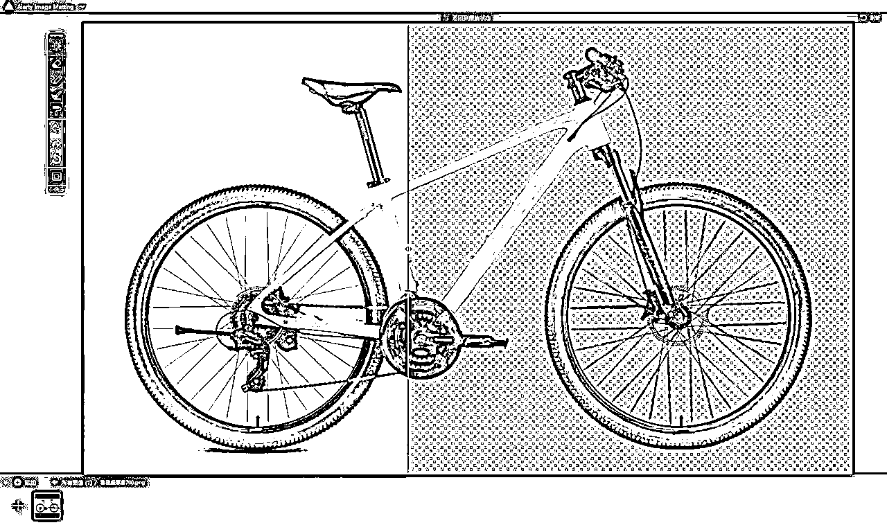
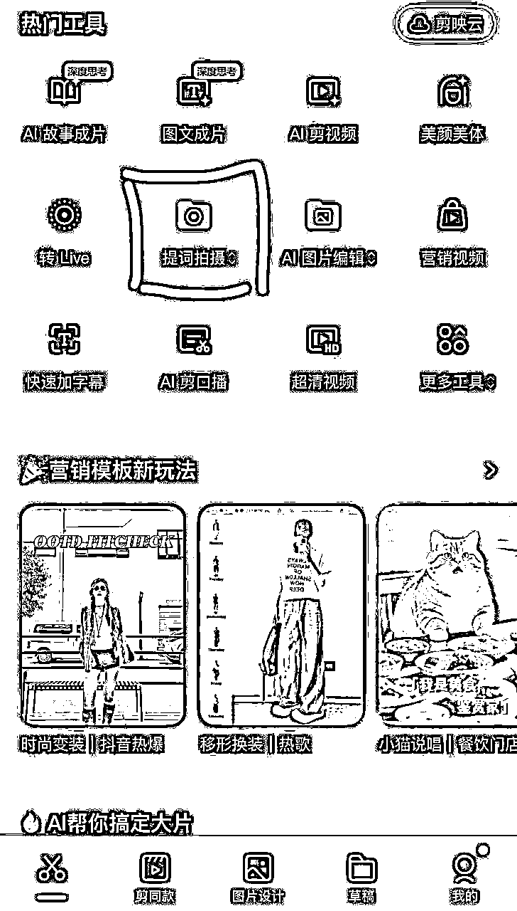

# 2025.9.11直播分享-从选品到发布，全流程演示B站视频创作

> 来源：[https://l1vve2sz9i.feishu.cn/docx/XpvzdnRcVoocI5x8jFGcvd1snQb](https://l1vve2sz9i.feishu.cn/docx/XpvzdnRcVoocI5x8jFGcvd1snQb)

# 一.明确账号定位与主题选取

关于选题，根据自己账号做的品类选就可以，比如冰箱，洗衣机，电视等等比较热门的3C数码品类，或者是自己比较熟悉的品牌，我是觉得什么佣金高就做什么品类，选择大于努力，之前做知乎的时候就只喝了点汤，因为一直在做骑行品类，但骑行是个季节性的品类，一入冬收入直线下降，当时没有去做3C数码家电类的，一样的努力少赚了很多，所以这次我自己是准备了好几个号来做B站好物，下面分享的是我一直在做的一个全平台IP号：十方的骑记

这次演示是根据自己这个IP账号定位，做的第三个视频主题是：2025年下半年2000内值得推荐的山地车集合

# 二.选品

确定主题之后要做的就是搜集产品，我这里是根据淘宝及京东销量来收集产品的

销量排行大家应该都好理解，卖的越好的产品，你推荐之后出单的概率会越大，而评价好的产品，出错的概率也会更小

具体操作比较简单，首先淘宝选择你要创作的品类，选择价格区间筛选，根据销量排行，基本上把区间内前销量前三四十款选出来就行，后面的销量一般的就不用考虑了，出单那么少，去推广的话也是更难出单

# 三.采集并整理详细产品数据

收集素材就是比较苦力的活，我一般会收集这些素材：产品图片，价格，型号，配置等等，收集之后会全都记录到飞书表格里，比较方便对比产品，其实如果要做的粗糙一点，都可以直接用于视频内容了这些配置表格，而且以后还可以复用

对于这些数据的收集方法我用了ChatGPT来帮忙，首先截图产品的配置等信息，发给ChatGPT，让他直接全都给你整理好，你这边直接粘贴到表格里就好了，这样能大大提升效率，其实还有更好的方法，就是采用AI工作流，输入产品链接，直接输出你想要的图片，型号，价格，配置等信息，我之后也会研究研究这类工作流，分享给大家节省时间

# 四.筛选产品(重要)

筛选产品在我看来是一个比较花时间也是非常重要的步骤，如果你想要出单快，出单多，一定得花时间来选择好的产品，不仅仅是能赚钱，而且更重要的是能增加用户对你的信任感，我有时候从四五十个产品中筛选一二十个能筛选好几天，我会去对比配置，对比评价，对比不同博主对产品的评价等等，通过这些对比，我自己对这个产品也是能了解个七七八八了，变成半个专家了

## 1.根据配置筛选

相同价位的产品直接优先选择配置高的，性价比高的产品，这里就需要去了解熟悉产品，知道需要选购的时候注意哪些方面，哪些配置才是好的

## 2.根据佣金筛选

在销量差不多的情况下，优先推荐佣金高的，选择大于努力，很多时候就是这样的，两个产品差不多，但是佣金却差了一倍，这时候肯定选佣金高的，就算佣金高的差一丢丢，那也选他

## 3.主流品牌+新兴品牌组合

在品牌选择上，除非是接了商单，那么选择主流品牌是避免错误的很好的方式，而且主流品牌的品质基本问题也不大，像我在选择自行车品牌的时候，基本组合就是主流品牌突出一个稳，新兴品牌突出一个性价比，这样搭配的话基本可以覆盖大部分用户的需求

我第二个视频其实出单比较少，因为主流的品牌卷起来比新兴品牌性价比更高了，但是主流的品牌并没有好物推广，这样的搭配从出单角度来说其实是不太成功的，这块是需要注意的

## 4.其他优质博主的推荐

在小红书，抖音，B站，知乎等平台寻找一些优质数据好的内容，把他们推荐的产品都纳入选品的范围内，比较头部的博主推荐的产品，而且不是那种带货的博主，我基本会把数据好的博主推荐的产品都记下来，和我之前收集的对比，如果有重复的，那这个品直接入选

## 5.淘宝联盟及京粉推广情况筛选

淘宝联盟和京粉都有一个品类的推广排名，还能看到一个产品的推广情况，这个数据我觉得挺重要，是判断一个品好不好推广的重要依据，这里可以看到有多少人在推广这个品，竞争大不大，每天以及每个月的推广销售情况，如果推广销售数量越多，说明这个品更容易推广出单

## 6.根据行业信息筛选

要做一个品类，我觉得需要先去了解一下这个品类的相关信息，特别是想做IP的朋友，如果乱推荐的话，很可能就会让用户觉得你很不专业，比如说自行车行业，我看很多做好物的博主会推荐永久，飞鸽，凤凰等品牌的产品，其实这几个品牌已经在行业内算品质挺差的了，基本都是贴牌的，如果稍微懂一点的用户你给他推荐这类产品，估计会觉得你就是个坑，啥也不懂就乱推荐

# 五.做视频内容

筛选完成之后就可以开始根据收集的产品素材来做视频内容了，这里我没有采用PPT的方式去做内容，而是直接用的剪映来做内容，剪映做内容的好处就是简单方便，还有一点就是我做长视频没有打算出镜，以后出镜的话也就是在前面+结尾出一下镜，中间还是一样的这种内容

下面这张图，内容要素只有背景图片+6个文本+自行车图片，介绍不同的产品就是替换内容加图片就好了，整个视频内容就完成了，非常简单，节省了做PPT的步骤

给大家推荐一个扣图软件，非常简单方便，一键扣图，还能批量扣图，批量导出：Aiarty Image Matting

分享给大家： https://pan.baidu.com/s/1cOVsGTSfkd6mY0snR_tuhQ 提取码: 51rr

# 六.写文案(重要)

视频内容都做好之后就是写文案了，文案也是比较重要，文案的话我基本是针对每个品来写，大概是总分的结构，首先先介绍一下品类相关的信息，挑选方法等等，然后就是介绍每个产品的优缺点，基本也是模块化的东西，做苦力，我自己操作的话，每个产品我都会去小红书，抖音，知乎，B站等地方搜集其他博主对这个产品的讲解，然后加上自己的见解，融合起来，这样的话会更加有可信度以及准确

写着写着就变成了一篇知乎文章：

2025年8月2000内休闲骑行/上学上班通勤公路车/平把公路/山地车推荐集合 | 自行车集合 | 自行车清单

如果要做IP的话，文章可以分发到知乎，公众号，B站等平台，可以扩大影响力

# 七.录音

文案有了，录音就是把文案给读一遍，用剪映的题词拍摄录音就行，每次录音大概需要录个一两个小时，如果觉得麻烦，就直接把文案用剪映朗读功能，可以克隆自己声音也可以文本朗读用其他人的声音

# 八.剪辑

以上准备都做好之后，剪辑就只是苦力活了，把录音添加进去，根据录音调整每个产品的时间段，一定要调整好之后再识别录音字幕，会省去很多调节字幕的麻烦，识别字幕之后就是把视频浏览一遍，检查字幕的错误修改好，视频基本就做好了

# 九.发布

发布推荐电脑上发布，这样添加产品链接会更加方便，需要注意的地方就是评论里面添加商品，你需要看看右边的效果，是不是整洁，我一般都会调整好，让人看起来很舒服就好了，这个地方也是需要花点时间去操作，样式可以借鉴一些优质账号的样式，哪个看着舒服就选哪个就好了

# 十.维护

最后就是评论区维护，如果有人有问题，我比较建议详细去回答，然后说清楚理由，带好链接，我感觉我这出单很多都是评论区询问的用户下单的，所以一定不要忘记了维护好评论区

