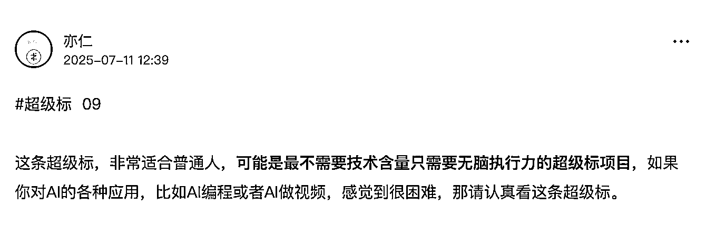
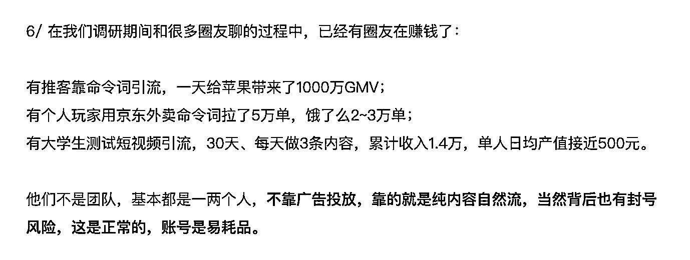
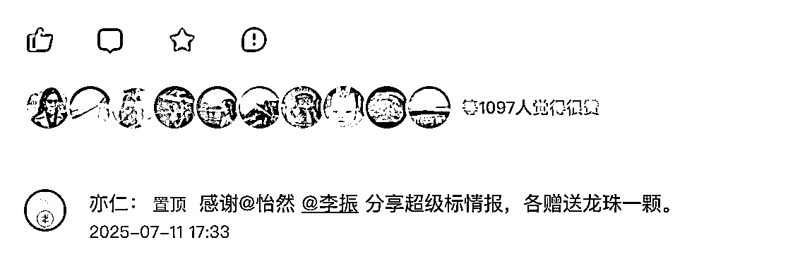
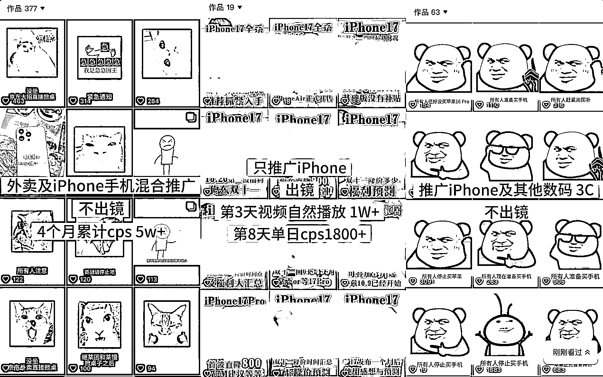
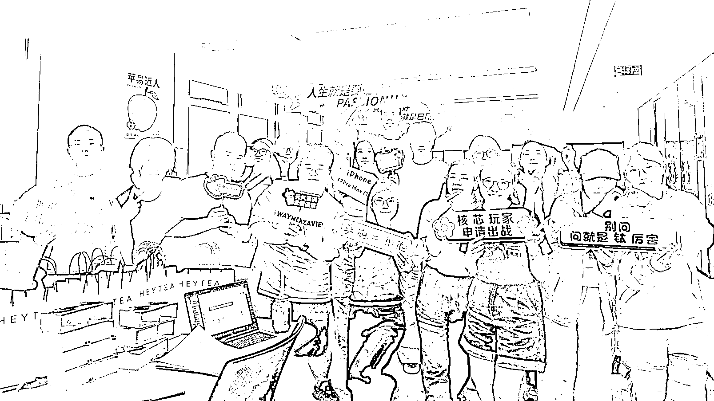
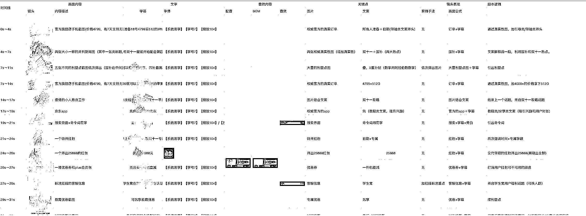
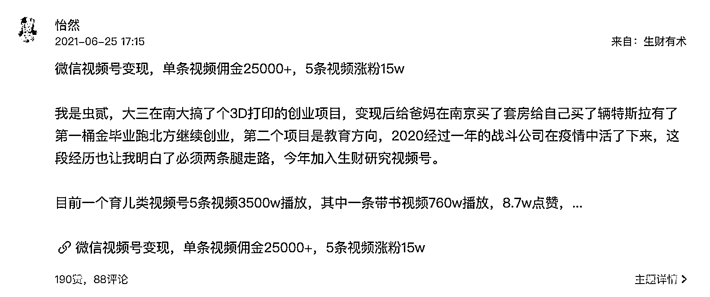

# (198 赞)抖音自然流 CPS 项目机会拆解

> 原文：[`www.yuque.com/for_lazy/zhoubao/tozr9h2skyylmilo`](https://www.yuque.com/for_lazy/zhoubao/tozr9h2skyylmilo)

## (198 赞)抖音自然流 CPS 项目机会拆解

作者： 怡然

日期：2025-10-19

* * *

大家好，我是除了流量一无所有的邓怡然。

圈友比较熟悉的可能是“天才少女”这个名字，还是那句话：感谢圈友抬爱，我当然不是天才，只是掌握了一些适用于现在流量的玩法和内容方法论。

这篇文章比较简单，讲一讲关于现在的一个机会：**抖音自然流 CPS。**

**以及将和生财有术在双十一期间基于抖音自然流 CPS 项目开一期 mini 航海。**

关于我个人的介绍，和要讲的内容关系不大，如果感兴趣的圈友，可以选择阅读：一条视频私域引流 30w+，我怎么通过内容在抖音精准引流[`t.zsxq.com/uo1Yo`](https://t.zsxq.com/uo1Yo)

这个事儿的契机，从一顿饭说起。

今年 6 月在广州的航海家流量大会嘉宾晚宴上，我和亦仁老大还有家蒙凑几个人到一块儿聊天。

家蒙分享了他在做的 B 站好物，我分享了一个关于自然流+密令词的玩法，一个信息是 5 月 11 号，当时 iPhone
16 首次降到 6000 以下叠加国补减 500 直接降价到 5499，一条自然流视频一晚上卖了 1000 万的
iPhone，第二个是外卖大战正在开始，自然流有很多曼波类型的外卖视频流量很大，玩法有很大机会。

我们凑在一起聊了十来分钟，这次契机后来有了两个超级标——

一个是 B 站好物，一个是外卖内容推客。

感谢亦仁老大给的超级标龙珠

**  **

抖音自然流 CPS 核心依然是：**这是一个非常适合普通人最不需要技术含量，只需要执行力的项目。** 这个玩法可以推的内容有外卖、数码家电国补等。

我们先说一下这个项目本身是什么，再说一下为什么是现在。

当然还有最重要的部分，劝退不适合的人。

# **一、项目是什么：抖音+自然流+密令词**

抖音自然流 CPS 是制作短视频内容发布至抖音平台，通过密令词引流至电商平台，最终赚取佣金的模式。

项目的盈利模式是通过电商联盟，推广产品（数码 3C、国补家电、外卖等）完成销售，用户确认收货后赚取一定比例的佣金。

**项目无需囤货、无需开店、无需付费投流，一个人可以完成内容创作** ，进而带货赚取佣金。

如果说之前的内容电商是“拍内容卖货”，那么现在的自然流 CPS 是“拍内容种草密令”。

相比传统通过内容创作带货赚取佣金的方式，比如挂小黄车，**内容需要更原生，让平台觉得你是一条能带给用户信息差的视频** 。密令词的机制，其实就是一次流量和转化逻辑的重新洗牌。

上面是几个案例账号，出镜和不出镜的都有脚本可以跑，如果可以出镜，那脚本选择会更多一点。

为什么是抖音平台？小红书目前对于自然流挂命令词风控还是比较严重，很难跑起来，抖音在视频是真的能带来价值和有信息的情况下，**越像原生内容的视频是越好跑，越有机会爆量** 。

# **二、为什么是现在？**

我在今年 4 月之前一直是纯投流派，我在过往做项目的时候哪怕自然流有一定的量，都会选择放弃这条路，觉得能够直接用投流加杠杆放大的事，就没有必要用自然流去铺，人效不高、费劲儿、不够性感。

但是在今年两个信息，我的想法发生了变化。

第一个是外卖大战这个过程中，有自然流玩家的个人推客一天出 50 万单，上限非常的高，以及我们自己实操后感受到找对内容方向，用数量去抵抗概率后，自然流可达的量级空间也是非常足的。

第二个信号来自联盟内部，在今年参加双 11 合作伙伴大会的时候，我们了解到联盟这个期间给个人推客分佣有 8000 万，而且大部分的钱其实是被少量的个人推客推客分走的，那这事儿可太性感了。

这就是这次航海的起点。

**但为什么是现在开船？为什么要现在上船？**

**玩法性感+时机合适+平台支持。**

只要抖音平台没有对自然流命令词引流到站外这个事情做强烈的干预限制封禁，这个事儿就是好的机会，而双
11 期间京东联盟平台官方也下场大力推广自然流密令词，给了比平时推广活动和激励丰富。

原本这是一期跟着十一月发布的航海，但是我们不想让大家错过双 11 这个时间点，所以提前开船，用一期 mini 航海来快速开始。

# **三、航海将带来什么？**

**  **

这次除了我之外，会有海宇教练全程一起来带大家航行。海宇教练是咱在星球里没太露过脸的圈友，他做过很多品牌内容营销的项目，他的团队一共卖了 5 个多亿的 iPhone 手机，咱这次要求不高，就定个小目标让他带大伙一起做个 5000 万 GMV 吧。

**我们会带着大家从 0 到 1 跑通整个自然流 cps 的流程**

**  **

玩法其实很简单，航海重点的话我们会带大家去拆解脚本

自然流 CPS 是一个低投入但高复用的项目，过程中沉淀下来的内容能力能成为之后任何内容项目的底层能力。

在这次项目中先发布第一条视频，通过密令词引入第一个用户到平台，实现第一单成交拿到佣金，分析数据，继续优化内容。

**联盟官方给了这次航海充裕的密令词**

**  **

我和平台讲要 500 个密令词给咱生财的圈友，每个人都至少有一个命令词，京东联盟直接给了 1000 个密令词，最终，京东、美团、淘宝三个平台一共要到了 2000 多个词。所以这是一场富裕仗。

但是我们人数会卡得非常严，人均多分点词，直接干。满足平台出单门槛的密令词不会取消，航海结束后可以申请继续使用，可以当作个人长期业务去做。

# **四、劝退**

**  **

前面说这是一个非常适合普通人最不需要技术含量，只需要执行力的项目。

但不需要技术含量的项目，其实门槛越高，因为它意味着没有太多的捷径，需要你超强的执行力。

所以我先劝退四类人：

1️⃣  **双十一期间有其他项目在跑的** ——请优先保证你已有业务的专注。

2️⃣  **执行力不足、只想看看风口的** ——这次节奏快，需要在短时间内大量执行。

3️⃣  **想先学知识不想落地实操的** ——我们是一起实战，不是听课。

4️⃣  **需要正反馈才能有动力** ——前期数据不好，就失去干劲的。

自然流项目的反馈周期不短，一定会有人第一天就第一条视频就带来成交，也一定会有人连续发了十条，甚至二十条视频都没有出单。

正反馈来的时候很爽，但前期的冷启动是煎熬的。如果你能熬过最前面的那段不被看见的时间，那后面的流量就是奖赏。

劝退是因为不希望大家盲目冲动地报名此次航海。相反，是真的对这个项目有了认知以后，依然愿意选择这个项目，这样的执行才会坚定，也才是有意义的执行。

那这个航海适合什么样的人？如果你不是以上四类人，那这个项目就不需要再有什么关键的额外能力了。

所以这篇帖子提前发出来，也是希望大家提前了解做决策，不要因为临时看到这个报名信息去冲动报名。

**【更新补充】**

**报名时间 10 月 21 号 20:00，生财会发布正式的报名贴，限 450 人**

**读到这里没被劝退的朋友设闹铃蹲**

关于看项目看到这里就可以，后面是一些碎碎念。

# **写在最后**

**  **

坦白讲，这次航海，对我自己也是一种挑战。

我习惯带自己的团队落地，但是带着一群线上的没有见过面的伙伴远程去做这个事儿，能否取得预期的成绩？我不确定。我其实是个 ego 有点重的人，担心万一不能体面的退休咋整？

但我很确定的是，这是一个好的机会，是一个可以复制拿到结果的机会，那就干吧！

开头说这个事儿的契机，从一顿饭说起，那后来决定开航海又源于另一顿饭。在九月深圳的航海家晚宴上，我和亦仁老大坤汀聊到平台给个人推客分了非常多的佣金，那这些个人推客的头部为什么不能是咱生财的人！决定合作后，亦仁老大又带我们去李克老师那吃了让我回味一个月的一顿饭

还在这里穿上了淘宝闪购的第一件外卖服，纪念一下

吃了老大这么多顿饭，这事儿必须好好干！

加入生财有术有五年了，加入生财的时机也是我第二次创业失败低谷的时候，当时在生财有尝试过很多玩法。

第一篇帖子曾经写的是视频号带货，和我现在做的天差地别，那会儿甚至用的还是花名

但是那段时间的正反馈给我带来了极大的鼓舞，也跟着生财有术做过淘宝蓝海、做过知乎好物和不少项目。我很感谢在低谷时期生财提供的搞钱信息，每一次正反馈带来的信心都是很珍贵的。这一次我也希望能够从能从一个在生财吸收的受益者，变成一个能给生财提供信息给圈友提供信心的人。当然也有私心，这个项目是平台现在鼓励的事儿，我也希望借这个机会在平台积累起更大的势能，变成下一个版本的自己。

那就一起航行！一起生财有术！！

* * *

评论区：

有尔 : 给天才少女打 call[爱心]

篮子🍀 : 哇，期待这个航海！

岽子 : 新人炒鸡期待，准备撸起袖子了

小鹅 : 除了流量和天真蓝 db11 亿无所有的小姐姐一枚

华龙 : 跟上

sunflower : 订好闹钟，准备跟

Vic 胜前 : ➕1 蹲蹲蹲

西瓜 : 上次 mini 航海没报上！这次狠狠蹲！！！