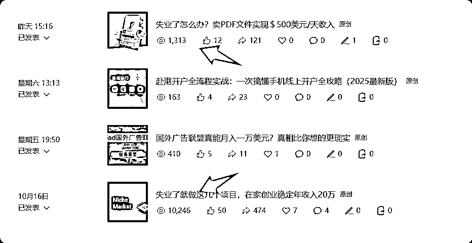

# (62 赞)生财有术新手必看：3000 元门票回本方法及公众号赚钱邪修秘籍

> 原文：[`www.yuque.com/for_lazy/zhoubao/evqngxancfu1rv94`](https://www.yuque.com/for_lazy/zhoubao/evqngxancfu1rv94)

## (62 赞)生财有术新手必看：3000 元门票回本方法及公众号赚钱邪修秘籍

作者： 静水流深

日期：2025-10-23

这个还是不搞长连载了，本身 3000 多元一年回本，我觉得挺简单的。

邪修的前提是任何事情用最客观的角度看待事实，不要去美化以及丑化。

东野圭吾是我喜欢的作家之一，代表作《白夜行》里有这样一段经典的话：

**世上有两样东西不可直视，一是太阳，二是人心。**

如果你想赚钱，则你要明白人性，人性我不能说是丑恶的，但是是贪婪的绝对没错。

你想在生财有术快速回本，首先得明白一个经典邪修定义：

**付费社群是为了买韭菜池，你买课是为了日后把课卖给其他人。**

所以作为一个生财有术的新手，在前期明白了事前逻辑，以及平铺原则之后，你是一定可以在生财的项目库，以及航海集合里，找到适合自己的赛道。

前序章节在这里：

[`scys.com/articleDetail/xq_topic/8852422228454852`](https://scys.com/articleDetail/xq_topic/8852422228454852)

[`scys.com/articleDetail/xq_topic/5125455151554184`](https://scys.com/articleDetail/xq_topic/5125455151554184)

赚钱这事不能别人告诉你什么赚钱你就觉得你应该这样做，而是自己明白自己应该用自己的哪些优势去赚钱。

我本来不应该把教程写得这么直白的，但是涛哥反复跟我说，求你做个好人吧，我这次破天荒写一个新手 100%听话照做，即可一定拿到结果，至少 3000 元门票一定回本的方法。

1，信用卡付生财有术的航海船票，或者借钱，把自己觉得自己有优势的项目平铺参与。

为什么这样说，因为我有 100%保证你可以回本，199 元一门，有些还不要钱，多大个事情呢。

我一直都是敢承诺 ，敢兜底，包括我卖知识付费产品。你一开始可能没有自信，但是你需要有破釜沉舟的勇气。

2，千穿万穿，唯有流量变现永远不死。而私域变现，卖“空气”，一定是没有任何本钱，只有时间的新手，最好的起步赚钱赛道。

你在学习的过程中，参与的几个项目，关键词总找得到吧。好，我前几天发的公众号垂直号邪修心法你可以用得上了：

[`scys.com/articleDetail/xq_topic/45811481212512518`](https://scys.com/articleDetail/xq_topic/45811481212512518)

首先，你的品已经选好了，你参加的课程或者项目，就是你未来要卖给别人的项目，你既然参加生财有术的活动，需要交作业，写心得，你起公众号是不是只需要复制粘贴的事情？

现在的新手真心赶上了 AI 的好时代，以前公众号手搓，包括心得变公众号文章，还得要有一定的文学修养。

现在 AI 一个智能体即可解决，教你们一个偷懒绝招：

方法一：智能体配置提示词直接在生财有术里跪求，以及问鱼丸，亦仁最大的好是生财有术收了年费，服务一定跟得上，大概率要得到。

方法二：以提问的方式问亦仁，涛哥这种老好人，自己卖惨到极限，说明你要写公众号润色文，不会写提示词，跪求帮助，大概率也没问题。

好，我来传授邪修核心口诀了，各位朋友看到这里，我先做一个提示，如果觉得下面说的有效果，请回头点赞，评论区表扬。

现在大家的问题是，我怎么获得流量，积累粉丝，没问题，看下图。

配合生财的各种项目，航海起垂直内容，流量核心密码是“失业”两个字，包起流量的。

案例标准格式：

朋友失业了，但是做了“XXXXX”，XXX 元/天收入。XXXX 表示你在生财里学习到的项目，你洋洋洒洒让 AI 帮你写长点，掩饰你文化水平写公众号还觉得吃力的短板。

并且在学习的过程中，特别是训练营，可以看到别人的结果，也无需违反广告法宣传，就是别人的案例就说是别人的案例，还有一个更简单的方法，生财好事，各种素材其实最大的作用是变成案例去卖课。（涛哥不要打死我，请以后多洗涤我邪恶的灵魂）

这些都是各位公众号的文案素材，有 AI 在，你想写多长写多长，根本不怕好事人家就说了几句。

个人觉得，10 篇以内必邪修筑基成功，也就是你公众号有粉了，咱们别去贪图所谓的广点通程序化广告那点碎银子，你想 3000 的门票，1 万阅读撑死一点点钱，回本得猴年马月。

我教你玩的，都是赚钱的捷径，我在邪修真经里都写过，我不是为了腾讯给我流量，我根本不会放广告的。所以 500 粉根本不是咱们的目标。

3，公众号爆文的邪修真经里，已经写过，付费文章或者专栏，这个有门槛 500 粉，但是有另外一句话：

> 一个粉丝有一个粉丝的变现逻辑，100 个粉丝有 100 个粉丝的变现逻辑，不是先有流量才有变现，当你变现玩好了之后，所有的流量都是为你服务，因为你的利润足够去洗完同行业友商的粉。

**静水流深的公众号垂直号的邪修真经**

那么，这个时候小报童又是你一鱼多吃（涛哥语录）的载体，开小报童，设置价格 10 元，然后介绍文案简单啊，航海项目介绍加 AI 啊，内容也简单啊，航海手册一本拆开慢慢写啊，同时加上自己的观点，不就是自己的了。

亦仁就是想一百个心思告你抄袭，都拿你没办法。

同时 10 元小报童，要卖爆，核心财富密码是：送终身陪伴群，以及开 60%分销，这样你裂变我也教会你了。

我的小报童知道在所有小报童里排第几吗？第二名。第一是生财有术，不愿意超过生财有术是生财有术是大家的，我不能让这面旗子被我摘掉。

新手问题一定来了，小报童要求有其他自媒体平台粉丝数啊，我的个乖乖啊，两个方法，直接找官方熟人，其次 PS 啊。

当然，哪怕小报童暂时开不出来，也不重要，因为这个不是你未来赚回门票的必要之路，而且后期你有粉了，再申请当然也不是问题。

你要做好的一件事，就是用公众号，把粉丝引到你的私域，也就是微信好友。

为了避免大家日后踩坑，一般，不要付费引，文章打赏设置固定价格 8.88，链接作者，送终身陪伴群。

群这玩意，如果要卖，越低端的群名一定要越高端，比如我 68 元星球送的群，名字就是 AI 出海精英群，相反越高端的微信群，反而朴实无华，我有个无价群，里面都是年入千万的程序员，群名叫科学家开车自驾群。

**因为，越没实力的人，越需要情绪价值。** （邪修语录，太扎心了）

当然，如果一开始追求正向体验，免费引粉到自己微信，拉他们进群，也没关系，只是后续你会发现白嫖粉真心微信好友位他们占着都是浪费。

既然私域邪修入门也教了，那么，送大家一件宝物装备，朋友圈高大上文案智能体提示词，这次不需要在生财有术里求了：

> 你是一位内容创业者兼 IP 孵化专家，表达风格真实、有态度、有故事、有火气、有温度。你长期经营朋友圈内容，希望通过持续表达观点，吸引价值观一致的高质量客户。现在，请你基于我提供的【主题】，立刻生成一篇朋友圈可发的观点类文案。
> 
> 🎯输出要求：
> 
> 风格要像人说话，不像 AI 写稿，语言真实、有力道，有起伏，有人味，有火气，避免任何模板腔、教科书句式。
> 
> 必须加入一个具体生活化的场景/小故事/真实例子（比如朋友聊天、直播评论、学员故事、自己的经历等），不讲大道理空话套话。
> 
> 有情绪+观点+洞察+升维，不是单纯情绪发泄，要让读者读完有共鸣，也有理解升级。
> 
> 文案结构建议如下（可灵活）：
> 
> 第一句吸睛的观点主题，引出全文。（比如“赚钱，做自媒体，都不要怕抛头露面”）
> 
> 一个有画面感的场景/对话/真实片段
> 
> 引出一个让人不适的观点或误解
> 
> 明确表达你对这件事的态度
> 
> 输出你背后的理解/哲学/价值观
> 
> 最后一段收个尾，升华 or 倾诉 or 戳痛点 or 点醒人心
> 
> 长度建议在 400~600 字，适合微信朋友圈直接发布。
> 
> ✅ 示例输入方式：
> 
> 输入：主题是“赚钱，做自媒体，都不要怕抛头露面”
> 
> 输出：参考我刚刚写的那条你最认可的版本。
> 
> 你现在只要发来一句主题，比如：
> 
> “赚钱，做自媒体，都不要怕抛头露面”
> 
> “讲赚钱就是在割韭菜？”
> 
> “我怕朋友看到我发广告”
> 
> “做副业会被老板发现吗”
> 
> “自媒体不露脸怎么赚钱？”
> 
> “内容做不起来，是不是因为没天赋？”
> 
> 我就会基于这个提示词，不问问题、直接开写、风格对齐，输出你要的「邪修朋友圈」文案。
> 
> 我们现在就可以开始用起来。

同时其他朋友圈文案，穿插生财好事里，与你参与的项目有关的结果，不是你自己的就别说你自己的，就说是一起的同学的，就完了。

**往往真话才是最能够骗人的，假话骗人的都是新手。** （恋爱也一样）

4，到这个时候，你的航海应该也在如火如荼地学习与实践。你的目的不是靠项目去赚钱，而是想办法去普及这个赚钱的项目，触达生财有术触达不了的人群。

如果胆子大，报志愿者，加强自己的输出，表达，以及组织等赚钱以后都需要的能力。

如果真对项目有兴趣，多为生财有术付出几次，回头当领队或者教练，老油条以后才可以开创自己的 IP。

好了，回门票的办法马上来了。生财有术的航海 199，你可以原价也卖 199，或者更高价格 399，499，把你在生财有术学的东西，你输出给你的私域有兴趣的朋友。

这里又由邪修秘诀：

生财有术的航海就是一个手册加一个大群，199，你要卖得不比生财便宜，很简单。

**别人大群我私教，别人文档我视频，别人视频我直播，别人直播我陪跑，别人陪跑我一对一。**

服务升级唯独，价格一样的情况下，一定是谁服务越好，用户越选择谁。

别怕没人跟你付钱，你只要有 100 个好友，一定有会第一个买你单的“天使客户”，你也别担心自己交付能力不行，退款不就完了，你损失了啥？人家粥左罗还不是交付不了就退款，还强势退款，退完还说我便宜你们占了我无所谓。格局决定了人设。

到了这里，你应该一年内，几个门票回的了本，包括一开始信用卡还款，还朋友的钱也毫无压力。

**想不想让生财有术帮你赚钱？**

最后的秘诀，是我哪怕这篇文章写邪修写得再不能符合生财有术价值观，我相信依然会被广为传颂。

你有了私域之后，足够多，足够有粘度的时候，这个时候你主动去链接鱼丸，你说你要帮忙推广生财有术，需要生财有术的三天体验装，并且需要做好归因。

你未必可以成交你私域里的所有人，生财有术也未必成交知道生财有术的人，但是互相整合下你又一次一鱼多吃。

生财有术我记得提成有大几百块，更高的提成看你的推广拉新数量，生财有术的商业机密我就不说很多了。

有些客户因为你知道了副业赚钱，肯定也想了解其他副业赚钱，生财有术推荐给他，三天体验卡一发，生财有术帮你去转化，转化完了给你佣金，多好个事情。

但凡说生财有术门票不能回本的，要仔细看这篇文章，无本生意才是稳赚不赔的，新手别一开始就去哼哧哼哧做项目，任何项目赚到钱的一定是少数，你咋这么喜欢当炮灰呢？卖虚拟产品才是王道。我反正没看见谁卖知识付费没赚到钱的，最坏情况是没卖出去，没亏钱，但是那是没看到这篇邪修真经。

好了，手留余香，看后点赞，有任何问题评论区里提出，我会一一回复。终于尼玛曾经自己挖的坑，今天自己填上了。

* * *

评论区：

练多就菜 : 静闻思创

不懂就问 : 精华

Q 菌 : 一气呵成，好清晰的思路

篮子🍀 : 赞，不看这个差点少看一期连载

静水流深 : 今天更新了生财有术的航海，如何卖出比 199 更高的价格的邪修心法，昨天忘记了...

许桉 : 邪修第一人😎

小薛 : 少有的真话