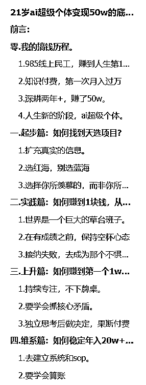
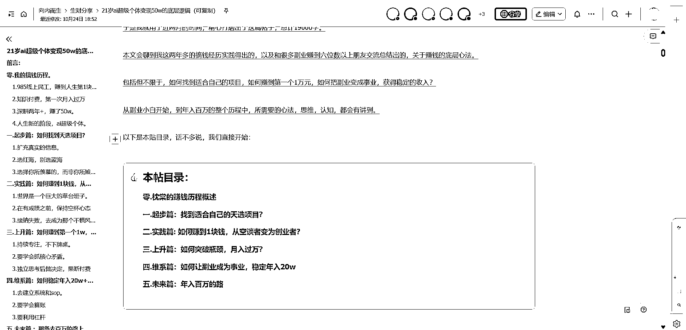

# (精华帖)(122 赞)从赚到 1 块钱到第一个 1w，再到稳定年入 20w，我是如何突破项目收入的瓶颈的？

> 原文：[`www.yuque.com/for_lazy/zhoubao/fuhk0zvuvqt9ud0g`](https://www.yuque.com/for_lazy/zhoubao/fuhk0zvuvqt9ud0g)

## (精华帖)(122 赞)从赚到 1 块钱到第一个 1w，再到稳定年入 20w，我是如何突破项目收入的瓶颈的？

作者： 枕棠

日期：2025-10-24

圈友们好呀，见字如面。 我是枕棠，今年 21 岁，本科刚毕业，也是生财三年级生。 这是我在生财的第三篇帖子，这篇文章主要想和大家分享一下：
具体会聊到我这两年多的搞钱实战得出的，和很多副业赚到六位数的朋友交流获得的，关于赚钱的底层逻辑。
包括但不限于，如何找到适合自己的项目，如何赚到第一个 1 万元，如何把副业变成事业，获得稳定的收入？
从副业小白开始，到年入百万的整个历程中，所需要的心法，思维，认知，都会有讲。 最后， 感谢掌柜
，热心组局，全程认真关注，让我有机会在 30 人的线下场分享，本文的初版框架也得益于这次分享。 感谢林途老师
，真诚分享，线上线下交流过很多，不管事业的格局上还是垂直小号的做法上，都让我受益良多。 感谢吴熳姐姐
，很多次思维碰撞都收获很大，学到了 coze，多维表格等好多 ai 的信息差。 感谢戴哥
，来到北京后每一次发展和转型，戴哥总能特别多细节和专业的建议，像一盏明灯般照我前行。
感谢生财，感谢亦仁老师，做副业以来的三年都泡在生财，很多底层逻辑和认知，最开始的来源都是生财。[`p3ak6osfed.feishu.cn/wiki/T9rSwYuI3i8UZkkORgvc4hagnrc?from=from_copylink`](https://p3ak6osfed.feishu.cn/wiki/T9rSwYuI3i8UZkkORgvc4hagnrc?from=from_copylink)

* * *

评论区：

林途 : 内容很干，复盘能力超强。

鹤儿 : 赚大钱是你应得的[强][强][强][强]，写的那么好

枕棠 : 哈哈谢谢[爱心][爱心][爱心]

枕棠 : 哈哈谢谢林途老师，向您学习[爱心]

练多就菜 : 赚钱这件事情上已经超过 99%的大学生了[强]

枕棠 : 感谢[爱心]

飞掌柜 : 你的分享让很多也受益匪浅，期待这篇精华帖[得意]

枕棠 : [爱心][爱心][玫瑰][玫瑰]感谢掌柜