# (105 赞)个体红利（小红书买手）Mini 航海，即将起航！

> 原文：[`www.yuque.com/for_lazy/zhoubao/bh3g43gxvyb1hk5k`](https://www.yuque.com/for_lazy/zhoubao/bh3g43gxvyb1hk5k)

## (105 赞)个体红利（小红书买手）Mini 航海，即将起航！

作者： 谢无敌-闪亮猫传媒

日期：2025-10-18

嗨～生财的老朋友们，大家好~

我是闪亮猫传媒创始人-谢无敌，是一个从生财里成长起来的超级 IP，擅长小红书买手和商家运营；

从 2021 年开始创业，靠小红书拯救了自家实体产业，3 年在上海开了 3 家公司，并且在陆家嘴还经营一家 1600㎡家居独立大店。

小红书是我第一个变现的平台，起号第一个月，我就成功获客，也是在没有任何人指导的情况下，完成了：**第一个月，变现将近 10W；第二个月，变现超过 200W+。**

后来，经过一番摸索，爆款不断。

半年时间，实现变现 1000 万，让我的家居实体业有了突飞猛进的结果，完成了我人生的第一个逆袭。

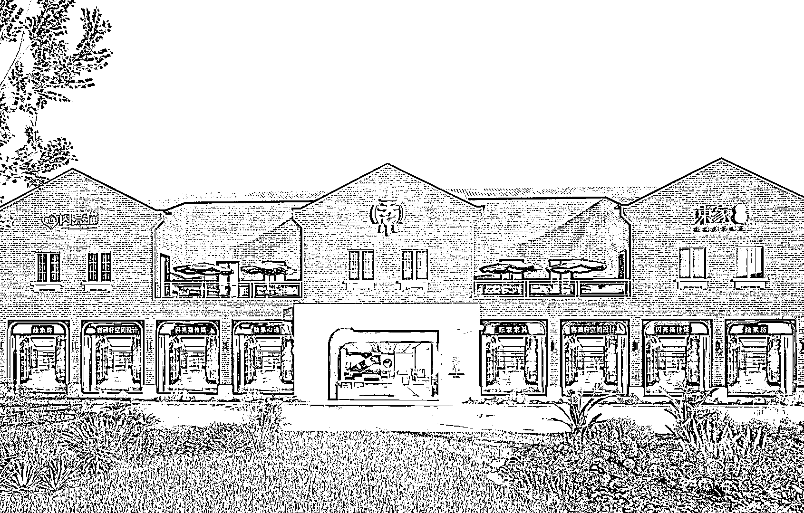

（绘素坊-坐落于美丽的陆家嘴波特营创意园）

小红书这个平台，想必大家都不陌生，但**有的朋友觉得上手难度大，不知道从哪开始；**

身边也有很多朋友已经开始做，并且成功拿到了不错的正反馈。

今天跟大家聊聊 —— 小红书买手。

## **一、“小红书买手”能赚多少钱？**

先聊聊：**小红书买手，能赚多少钱。**

2023 年，我把我一手孵化的小红书 IP —— “设计师鹏老师” 账号，从设计师主理人转型为商家+买手双角色。

这一过程中，我们经历了不同维度的调整，也收获了全新的运营体验，期间账号还被官方评为 “新锐百万买手”。

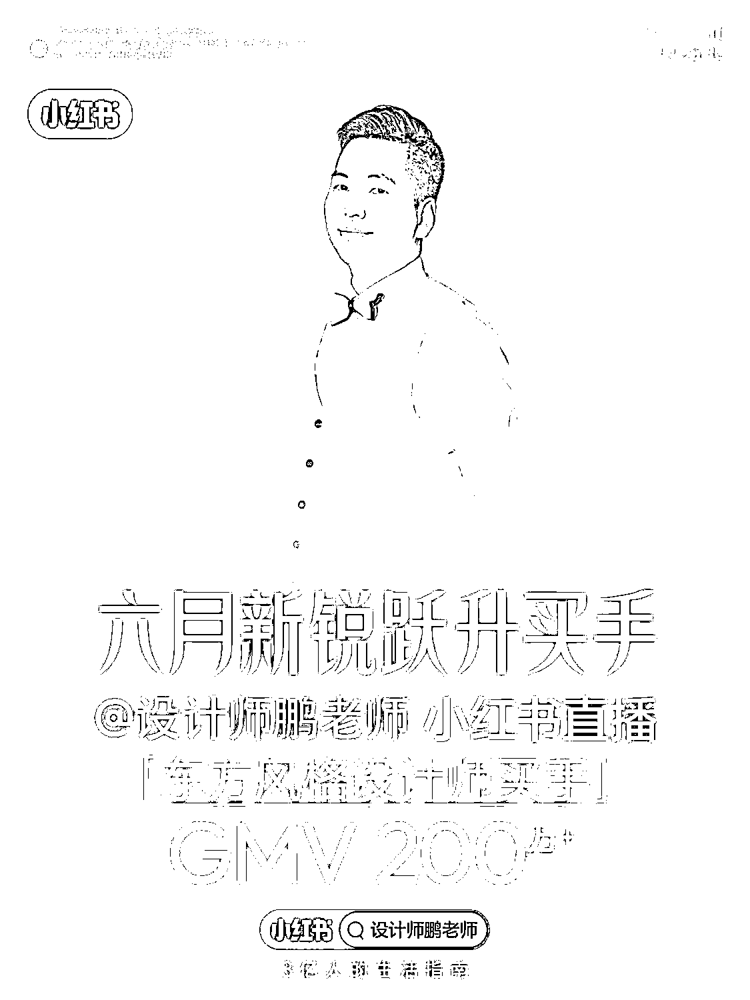

在 618 期间，单场场观不到一万人数，但是单场直播**GMV 却达到了 160W！位列实时买手榜 Top3！**

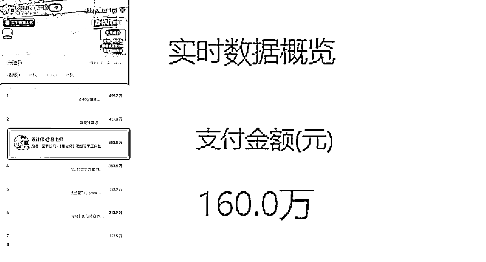

这也很好的证明了，即便你不是明星、达人，一样能靠小红书买手的身份赚到钱。

我身边也有很多做得非常不错的垂类博主/买手：

有女性成长赛道的素人博主，刚开始账号只有 200 粉丝，跟着我们更了几篇笔记，成功接到了广告；

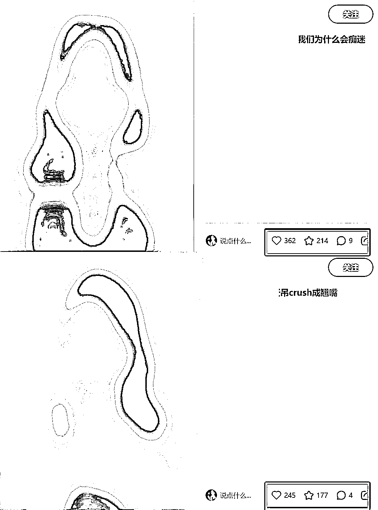

陆续更新笔记后，**账号粉丝突破了 1000+，成功开启了小红书买手带货；**

不仅可以继续接商单广告，还能通过笔记和直播进行带货，拓宽账号变现范围。

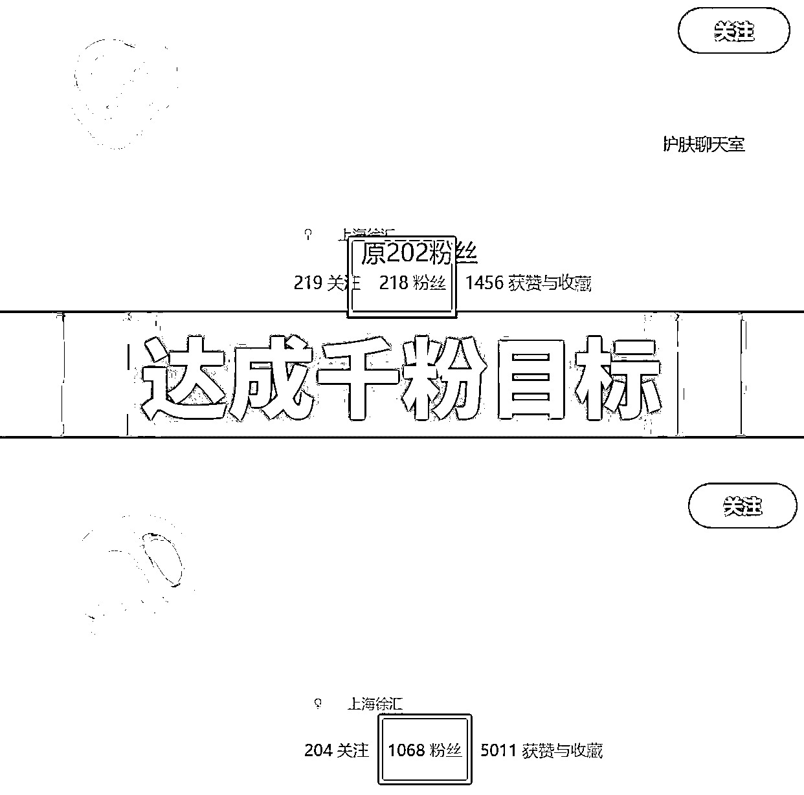

也有 30+主副业两手抓的职场妈妈，利用下班 2 小时做小红书副业，账号粉丝破千后开通博主和买手合作，**11 天光是商单合作就变现了近 2000 块钱。**

**  **

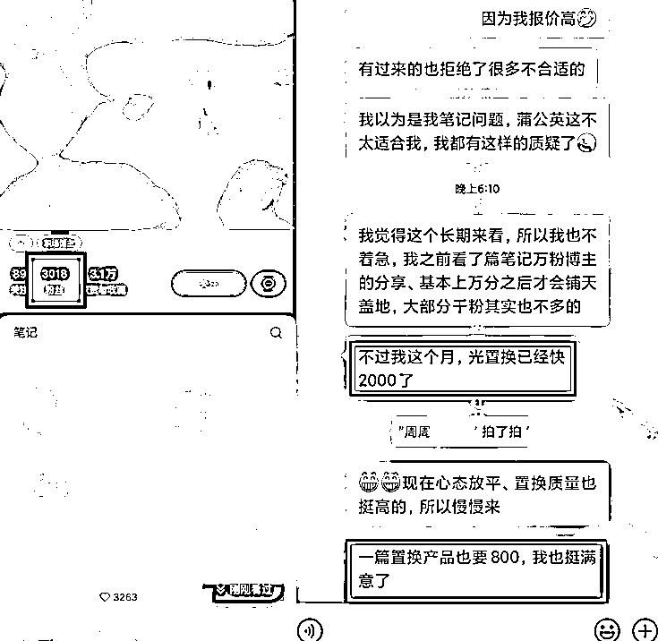

还有完全从 0 开始探索小红书的职场博主，辞掉工作，把爱好转型成自己的事业，在我一步步的带领下，做起了小红书垂类赛道的买手博主。

在小红书直播的趋势下，开启直播带货，并且拿下**首场直播营业额达到 2.9 万+的成绩，现在单月稳定变现 10 万+。**

**  **

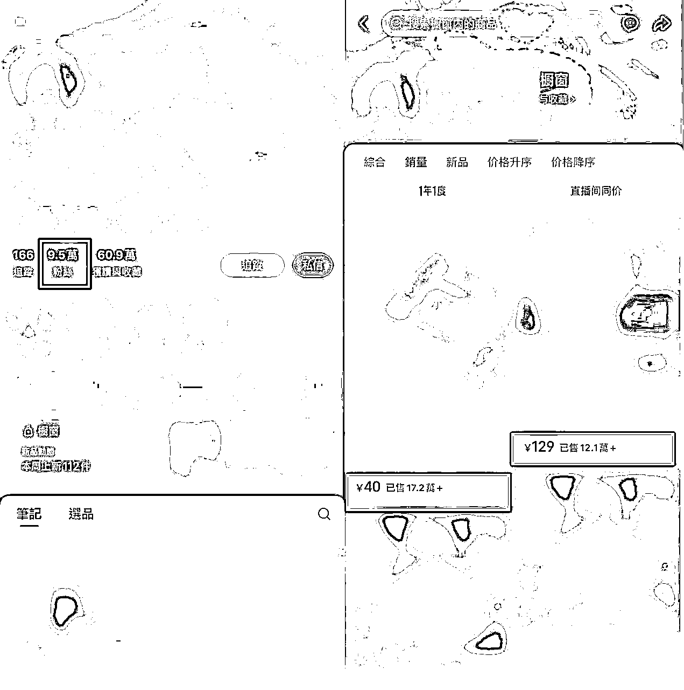

平台数据显示，2025 年小红书买手**数量是 2024 年的 2.1 倍，收入却是 2024 年的 3 倍。**

其中，在小红书电商发布的「2024 小红书 rise100 电商年度榜单」里，有 2000 粉开播，**3 个月月销就突破百万，实现低粉高增长的素人买手；**

**  **

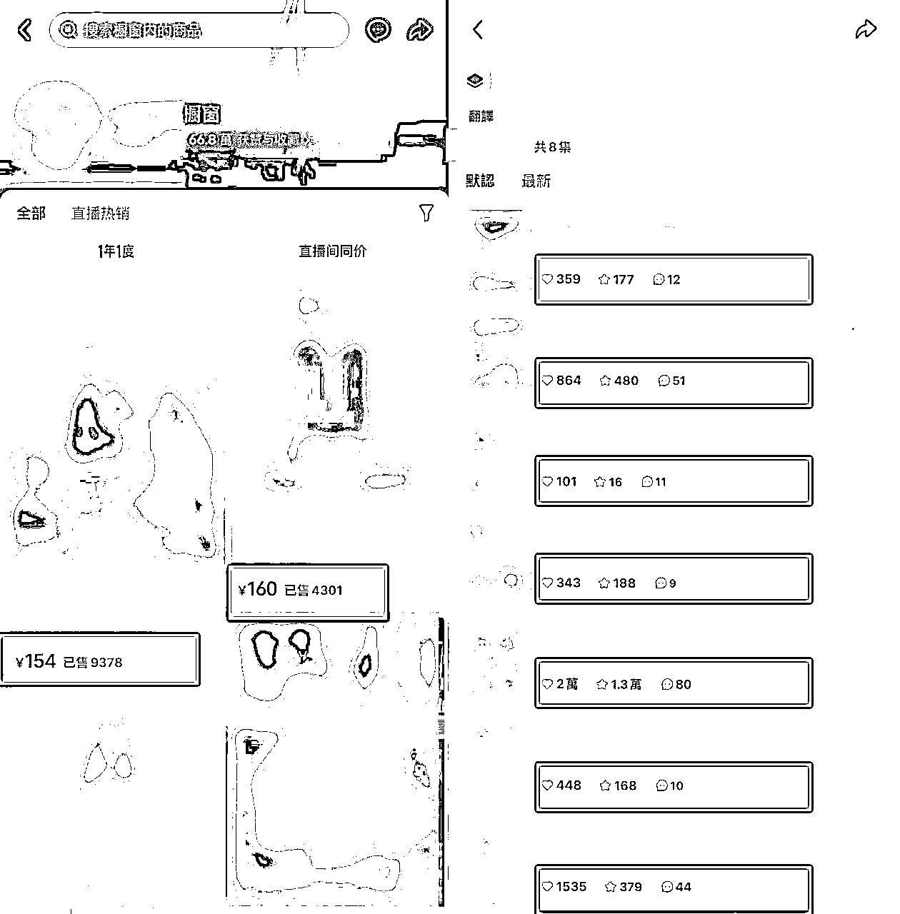

也有不直播，靠橱窗发笔记，成为垂直领域超强种草买手。

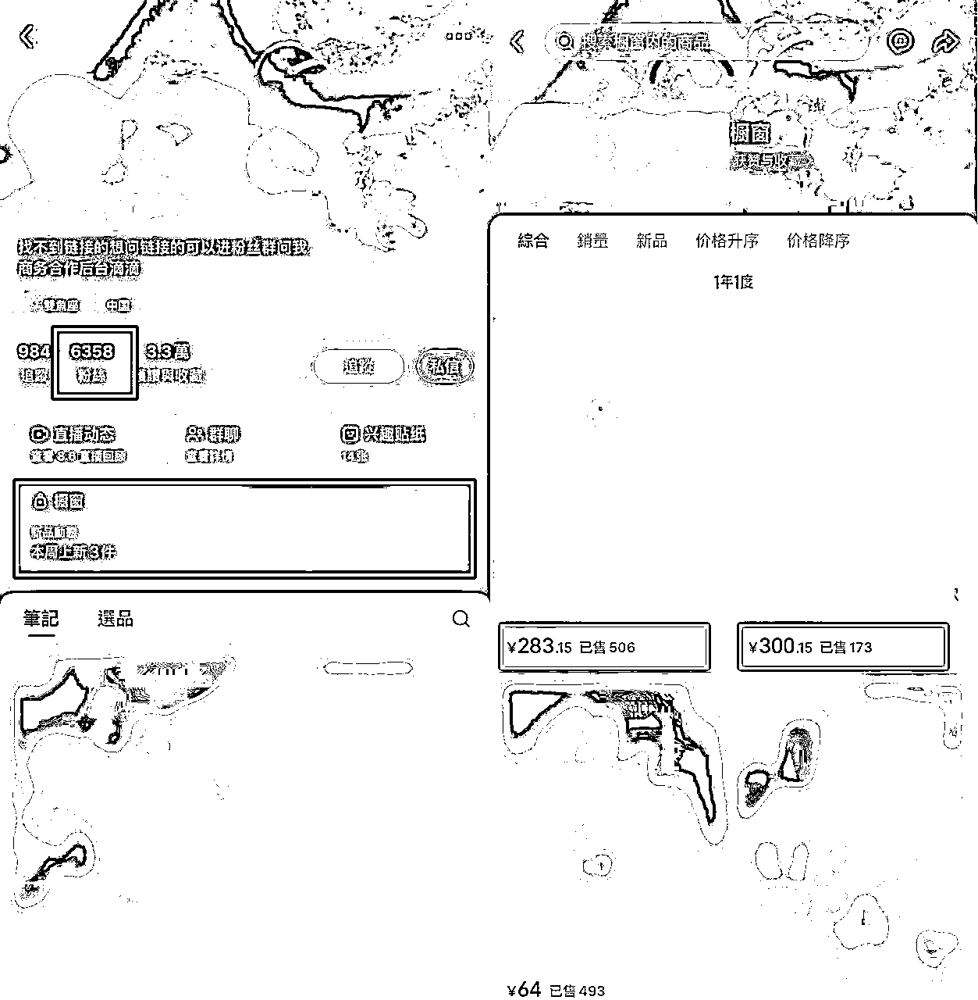

根据我的经验，小红书买手的带货**佣金比例大概是 5%-50%左右** ，也就是说，销售额达 10 万，佣金就是 5000-5 万元；销售额达 100 万，佣金就是 5 万到 50 万元。

以前，小红书博主变现渠道窄，想带货还没有完整闭环；

现在，平台打破了 “单靠商单变现” 的局限，**把 “广告 + 带货” 两条路直接递到博主面前。**

**  **

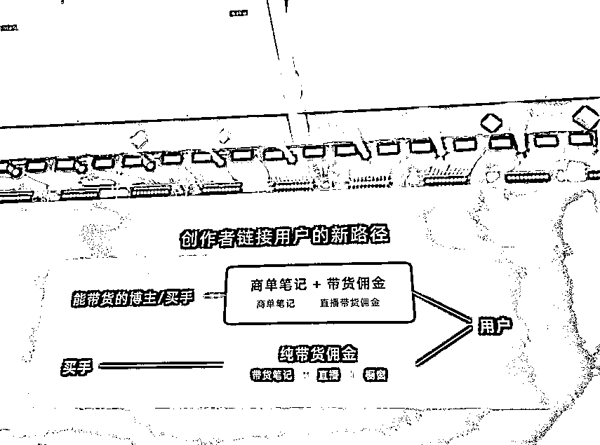

除了接商单广告，还能开买手直播、搞笔记带货，实现 “白天接广告，夜里订单自动跑” ，一天 24 小时都能有收益。

本质上就是平台和博主的 “双向奔赴”：**你用心做好优质内容，我帮你把内容转化成钱。**

## **二、为什么是“现在”要做买手？**

今年 9 月，我参加了 2025 小红书创作伙伴大会，官方正式宣称买手 2.0 时代到来~

从不断提高电商端口的曝光和对商家、博主们的流量扶持，把原本作品页的 “小清单” 升级成 “橱窗” ，**直接挪到简介下方，和小红书店铺端口一致，** 目的就是更好地提升买手的商品曝光和转化效率。

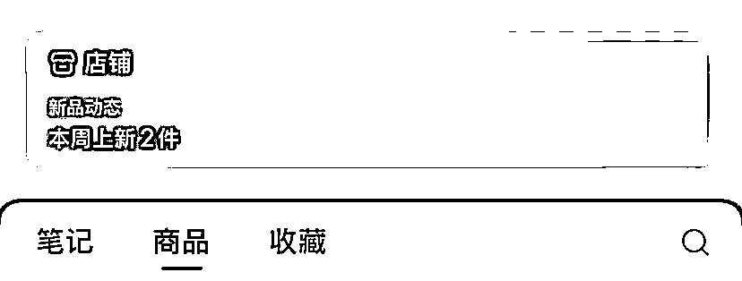

而且小红书买手门槛低，1000 粉以上的创作者就能申请。

开通之后，不需要自己有产品、不用囤货找货源，直接**去 “选品中心” 挑自己擅长的细分领域好货，** 就能实现笔记带货、赚取佣金。

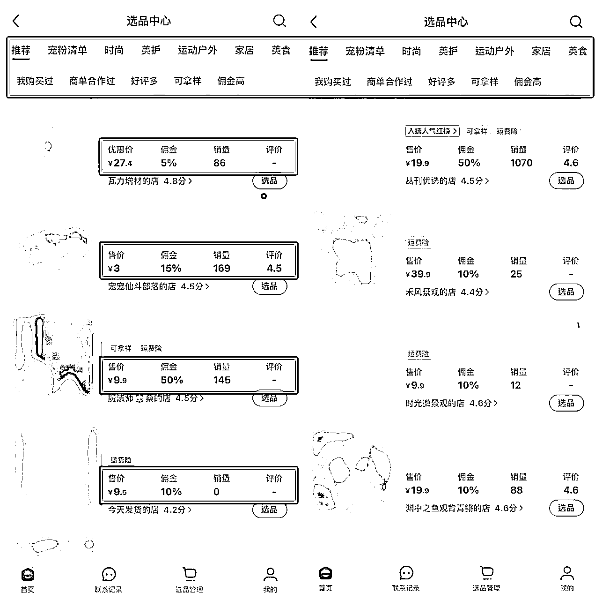

用户要是觉得东西不错，可以通过**私信、群聊分享的橱窗链接下单；**

还能在粉丝群顶部设置橱窗入口，粉丝点进去就能买，不用一个一个点链接，更好的缩短了下单转化链路。

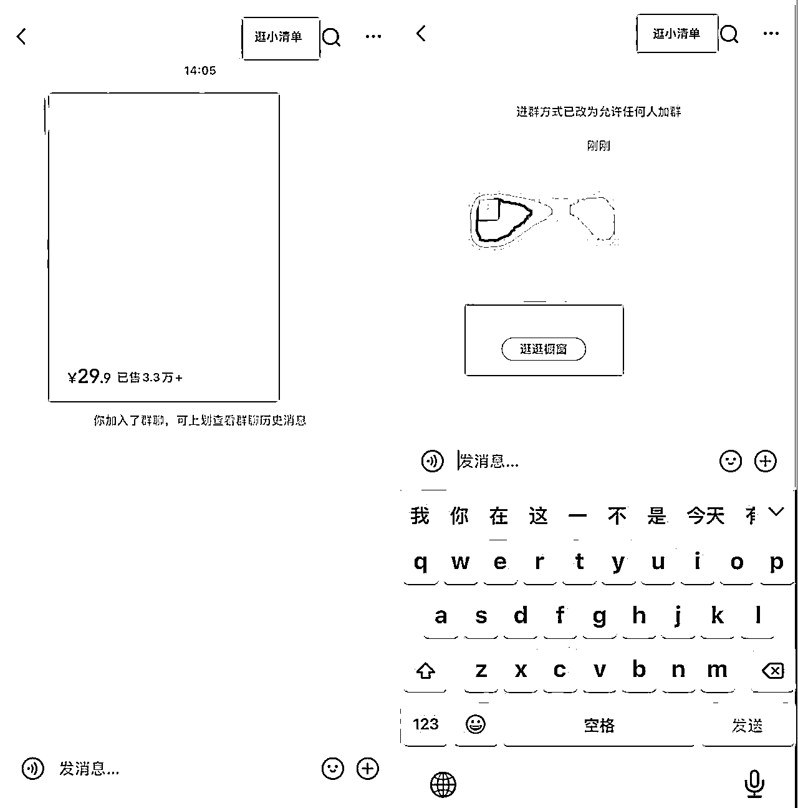

账号接广没任何影响，你就专心分享好东西就行： 相当于**多了个低风险的副业，基本没什么试错成本。**

从官方数据可以看出，小红书 “买手直播带货+合作笔记” 的变现模式，不仅能让博主账号涨粉速度变快，收入更是比以前多 2 倍不止。

## **三、为什么要跟着我们参与 Mini 航海？**

**2022 年，生财第一次开小红书的航海打卡，** 我以航海船长的身份，带领了第一期的小红书活动。

目前，你在生财参加的很多与小红书相关的航海，航海手册里都可以看到我的名称。

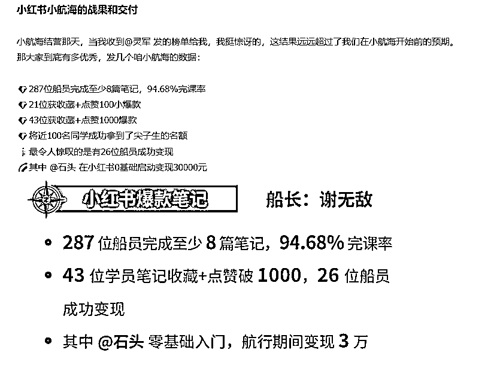

2023 年初，在生财千人全国线下见面会上，**我受邀成为了小红书专题分享嘉宾，** 更多朋友也是在那个时候开始认识我，并且开始尝试经营小红书；

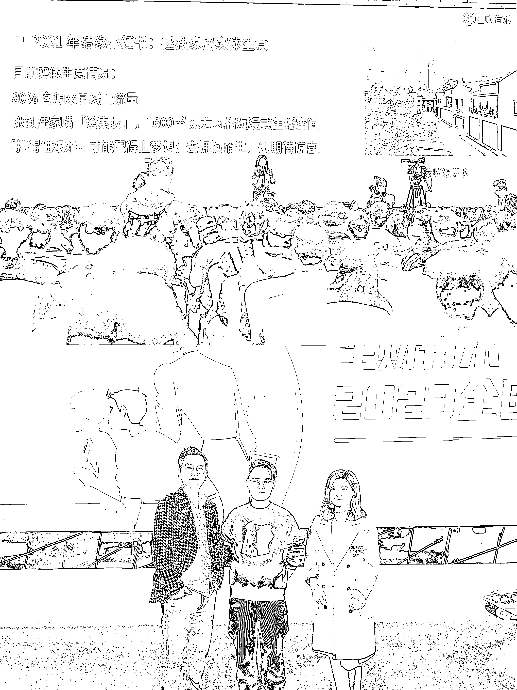

（上：谢无敌在 2023 年生财千人大会；下：鹏老师（左）、亦仁大哥、谢无敌（右））

2024 年，生财航海家小红书专场上，我作为主讲嘉宾，把我运营账号的经验，毫无保留地分享给更多想通过小红书流量赋能的创业者们。

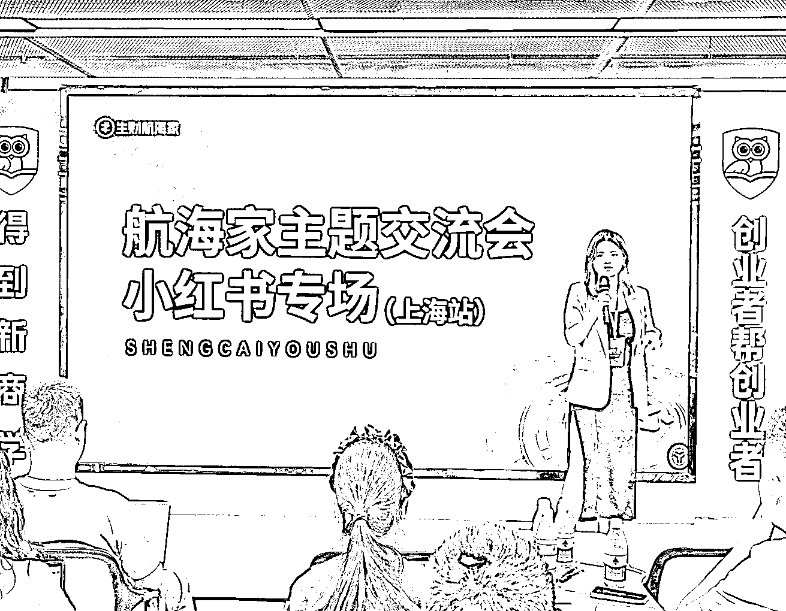

作为一个女性，我内心一直怀揣着这样的愿景：我不仅要把自己的小红书事业做好，更要助力更多人在小红书这片天地里发光发热。

在过往的 4 年里，我就像一个执着的分享者，经常在生财发一些优质文章。通过这些文章，我逐渐积累起了 IP
的影响力，就像一颗种子在肥沃的土壤里慢慢生根发芽，茁壮成长。

同时，它们也像一块巨大的磁石，吸引着那些志同道合、同频共振的人来到我身边，我们一起交流、一起探索、一起成长。

我始终坚信，**分享的力量是无穷的，帮助他人就是成就自己。** 而事实也有力地证明了，我真真切切地做到了用自己的知识和经验去照亮他人前行的道路。

我也带过不少小红书垂类赛道的买手：

有平时工作不算太忙的上班族，用业余时间分享办公好物，做那种**草单类型图文笔记，月收入增加 3000 多；**

也有分享育儿经验的宝妈，开通买手推荐宝宝绘本、玩具，**一个月赚 8000 多** ，实现经济独立。

还有不少买手一个月佣金加广告收入，能有大几万甚至更多。

看着他们从迷茫到坚定，从新手小白成长为独当一面的高手，我由衷地感到骄傲和欣慰。

我知道，我的努力没有白费，**我正在以自己的方式让更多人在小红书上实现梦想** ，这就是我这份事业的价值所在。

所以 2025 年，我会带领更多人，在小红书上实现从 0 到 1、从 1 到 10 的跨越。

会一起见证更多低粉起号的博主成长为超级买手，更多实体经营者借助小红书的力量实现业务的腾飞，更多普通人通过小红书开启自己的副业之路，实现经济独立和自我价值。

## **四、跟着我们能学到哪些技能？**

现在做小红书买手好处和机会都很多，但也要正视这个过程中可能会遇到的一些难题，像**涨粉难、选品难** 这些常见的问题。

所以呢，我和生财有术合作了【10 月 Mini 航海 · 小红书买手】，10 月 21
日正式开始报名，我会给大家提供相应的解决办法，让大家都能搭上小红书买手变现的快车。

这次航海主要围绕下述四大维度，帮助你提升买手核心能力：

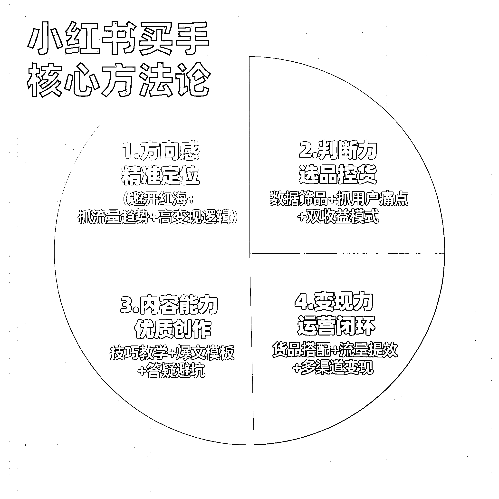

**1、方向感：精准定位少走弯路**

做小红书买手先定方向，我们会协助你确定前景好的垂直领域，避开红海赛道。

还会教你盯平台流量政策和季节趋势，提前布局热门选题，快速掌握高变现账号的核心逻辑，不用盲目试错。

**2、判断力：选品控货抓准需求**

选品是买手根本，得跟着用户需求和市场趋势走。

我们教你用数据分析工具筛热门、高利润、适配小红书用户的货，还会教你分析目标群体痛点，靠 “商单 + 笔记带货” 双收益，避免选到卖不动、质量差的品。

**3、内容能力：优质内容带飞销量**

内容要懂技巧，标题、文案、图文 、视频都得抓眼球。

我们会给实操教学，教你写能涨阅读、点赞的文案，还提供可复用的《高转化爆文模板库》。

持续发垂直内容能快速涨粉开买手功能，教练、助教还会帮你答疑避坑。

**4、变现力：运营闭环实现盈利**

选对货更要卖好货，得掌握从选品到成交的闭环。

我们教你搭配货品，用热门话题、精准标签提笔记曝光，还会讲直播、粉丝群等变现渠道的玩法，

让你不仅能靠商单赚钱，还能通过笔记、直播带更多货，提升整体盈利。

**可能会遇到的项目难点（无敌补充：其实都可以克服，写在这里只是为了让大家知道）：**

1、新号缺粉丝，笔记易没流量，新手易焦虑

2、需持续产出吸睛内容，选题、内容要贴合用户且避同质化，封面影响点击

3、选品易踩雷：选合适高性价比产品耗时，售后、质量问题伤账号口碑

4、谈合作没底气：新手没粉丝数据，难和商家谈样品、高佣金

**谁可以参与此次报名：**

1、本身已经是商单博主，想转型成买手

2、对买手感兴趣的圈友

3、对内容创作有热情，愿意坚持学习拍摄、剪辑、文案撰写等技能

4、每天能投入至少 2-4 小时

PS：粉丝 500 粉以上，有爆文经验的圈友，优先招募

**孵化周期：一共 30 天**

第一阶段：定赛道+搭账号、尽可能多涨粉丝，完成 1000 粉目标

第二阶段：选品+发布笔记，启动买手带货准备

第三阶段：优化转化+复盘数据，提升买手收益

无论你是想拓展副业的普通人，还是想转型的博主，只要对买手感兴趣，现在就快来报名吧！

**种一棵树最好的时间是十年前，其次是现在。**

利用业余时间，开启小红书买手新可能～

* * *

评论区：

青霜 : 没有看到对“买手”的介绍，想问问“买”与“带货”是什么关系？是通过“买的货”来“带货”，还是通过“买货的经验”种草来实现“带货”？

谢无敌-闪亮猫传媒 : 买手是一个称呼，小红书喜欢起一些有意思的名词，它是博主的升级版，博主只能接商单合作，买手除了商单还可以做橱窗带货。

阿希 : 请问在哪里报名呀？

中意@东东西西 : 请问在哪里报名吗？ [害羞][害羞]

Savi : 请问在哪里报名？

三胡 : 报名

铁酱酱 : 蹲报名

当你 : 想问下这个项目露脸直播是不是必须的？